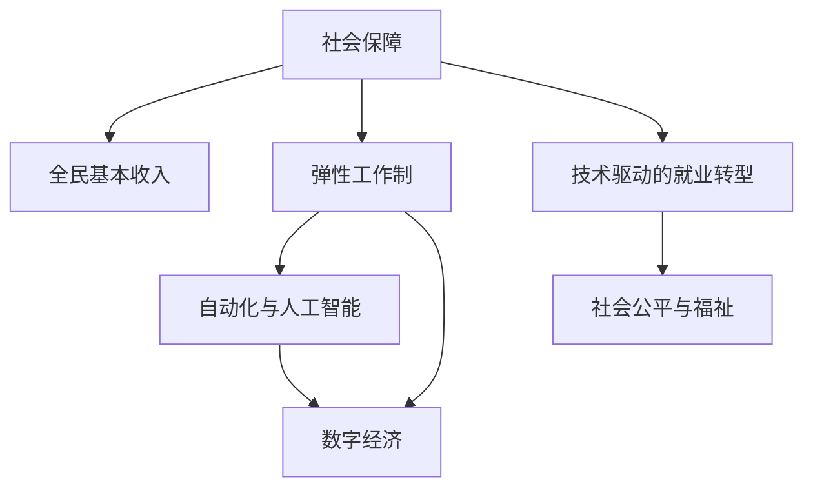

                 

# 未来的社会保障：2050年的全民基本收入与弹性工作制

> 关键词：社会保障，全民基本收入，弹性工作制，自动化，AI，未来社会，数字化转型

## 1. 背景介绍

### 1.1 问题由来
随着科技的不断进步，社会经济结构正在经历深刻变化。自动化和人工智能的普及使得许多传统工作岗位消失，人们需要新的社会保障机制来应对未来的不确定性和挑战。与此同时，数字经济的兴起也带来了新的就业机会和灵活的工作方式。在这一背景下，探讨一种全新的社会保障体系，即2050年的全民基本收入与弹性工作制，变得尤为重要。

### 1.2 问题核心关键点
本节将围绕以下几个核心关键点展开讨论：

- 全民基本收入（Universal Basic Income, UBI）：保障每个公民的基本生活需求，不受工作状态或收入水平的影响。
- 弹性工作制：打破传统9-5工作模式，提供更灵活、自主的工作安排，适应数字化、远程化工作的需求。
- 技术驱动的就业转型：通过自动化和人工智能技术，重塑劳动市场结构，创造更多高质量就业机会。
- 社会公平与福祉：确保不同社会群体能够公平分享科技进步带来的红利，提升整体社会福祉。

## 2. 核心概念与联系

### 2.1 核心概念概述

为更好地理解2050年的全民基本收入与弹性工作制，本节将介绍几个密切相关的核心概念：

- 社会保障（Social Security）：通过国家或社会组织提供的各种保障措施，保障公民在失业、疾病、老年等风险下的基本生活需求。
- 全民基本收入（Universal Basic Income, UBI）：无条件向所有公民提供一定数量的基本收入，确保其基本生活需求得到满足。
- 弹性工作制（Flexible Work Arrangement）：提供多种工作时间、地点和工作方式选择，使员工能更好地平衡工作与生活。
- 自动化与人工智能（Automation and Artificial Intelligence, AI）：通过自动化和AI技术，提升生产效率，优化劳动市场结构。
- 数字经济（Digital Economy）：依托互联网、大数据、云计算等技术，形成的新型经济形态，带来更多的就业机会和灵活的工作模式。

这些核心概念之间的逻辑关系可以通过以下Mermaid流程图来展示：



这个流程图展示了社会保障、全民基本收入、弹性工作制、自动化与人工智能、数字经济、技术驱动的就业转型和社会公平与福祉之间的联系：

1. 社会保障作为基础，保障公民的基本生活需求。
2. 全民基本收入和弹性工作制作为社会保障的重要组成部分，进一步提升社会公平与福祉。
3. 自动化与人工智能和数字经济作为技术驱动因素，重塑就业市场，带来更多的灵活就业机会。
4. 技术驱动的就业转型是社会保障体系的重要组成部分，旨在通过技术手段提升就业质量。
5. 社会公平与福祉是社会保障体系的目标，确保社会成员能公平分享科技进步带来的红利。

## 3. 核心算法原理 & 具体操作步骤
### 3.1 算法原理概述

2050年的全民基本收入与弹性工作制，主要通过以下算法原理实现：

1. 全民基本收入（UBI）：通过国家或社会组织，无条件向所有公民提供基本生活保障。收入来源包括税收、社会捐赠、投资收益等。

2. 弹性工作制：打破传统工作模式，提供多种工作时间、地点和工作方式选择，如远程办公、弹性上下班时间等。

3. 技术驱动的就业转型：利用自动化和人工智能技术，提升生产效率，优化劳动市场结构，创造更多高质量就业机会。

4. 数字经济：依托互联网、大数据、云计算等技术，形成新型经济形态，带来更多灵活就业机会。

### 3.2 算法步骤详解

#### 3.2.1 全民基本收入（UBI）的实现步骤

1. **收入来源规划**：确定UBI的主要收入来源，包括税收、社会捐赠、投资收益等。
2. **分配机制设计**：制定UBI的分配标准，确保公平公正，如按人口平均分配、按家庭收入分配等。
3. **实施细则制定**：包括领取流程、资格审查、资金管理等。
4. **效果评估与调整**：定期评估UBI的效果，根据评估结果进行调整和优化。

#### 3.2.2 弹性工作制的实现步骤

1. **工作模式设计**：制定多种工作时间、地点和工作方式选择，如远程办公、弹性上下班时间、兼职等。
2. **企业与员工协商**：企业与员工协商灵活工作安排，确保双方利益最大化。
3. **工作保障机制**：提供多种工作保障措施，如健康保险、职业培训等。
4. **监管与评估**：建立完善的监管体系，确保灵活工作制的公平性和有效性。

#### 3.2.3 技术驱动的就业转型步骤

1. **自动化与人工智能应用**：在生产和服务领域广泛应用自动化和人工智能技术，提升效率和质量。
2. **职业再培训**：为受自动化影响较大的岗位提供再培训机会，提升员工技能。
3. **新职业创造**：利用自动化和人工智能技术，创造新的职业机会，如数据科学家、机器人维护等。
4. **技能匹配平台**：建立职业匹配平台，帮助员工找到适合自己的工作。

#### 3.2.4 数字经济的实现步骤

1. **基础设施建设**：加强互联网、大数据、云计算等基础设施建设，为数字经济发展提供支持。
2. **企业数字化转型**：鼓励企业进行数字化转型，提升业务效率和竞争力。
3. **市场监管**：建立完善的市场监管体系，保障数字经济的健康发展。
4. **人才培养**：加强对数字经济相关人才的培养，提升整体数字经济水平。

### 3.3 算法优缺点

#### 3.3.1 全民基本收入（UBI）的优缺点

**优点**：

1. **保障基本生活需求**：确保每个公民的基本生活需求得到满足，减少贫困现象。
2. **提升社会公平**：打破传统收入不平等问题，确保社会成员能公平分享科技进步带来的红利。
3. **促进消费**：增加公民的可支配收入，促进消费和经济增长。

**缺点**：

1. **财政压力**：UBI的实施需要大量财政支持，可能带来财政负担。
2. **激励问题**：可能导致部分人失去工作动力，降低社会整体生产力。

#### 3.3.2 弹性工作制的优缺点

**优点**：

1. **提高工作满意度**：灵活的工作安排，提升员工的工作满意度和幸福感。
2. **提高工作效率**：根据自身情况选择最适合自己的工作时间，提高工作效率。
3. **促进家庭平衡**：更好地平衡工作与家庭生活，提升家庭幸福感。

**缺点**：

1. **管理难度增加**：企业需要投入更多资源进行灵活工作制的管理。
2. **员工自律性要求高**：需要员工有较高的自律性，避免工作时间和质量的降低。

#### 3.3.3 技术驱动的就业转型的优缺点

**优点**：

1. **提升生产效率**：自动化和人工智能技术提升生产效率，创造更多高质量就业机会。
2. **优化劳动市场结构**：优化劳动市场结构，减少低技能劳动岗位，增加高技能劳动岗位。
3. **减少工作时间**：随着生产效率的提升，可能减少工作时间，提高生活质量。

**缺点**：

1. **就业冲击**：可能带来部分岗位的消失，影响部分人的就业。
2. **技术鸿沟**：可能加剧技术鸿沟，造成社会分化。

#### 3.3.4 数字经济的优缺点

**优点**：

1. **创造更多就业机会**：数字经济带来更多灵活就业机会，减少传统岗位的消失。
2. **提高社会效率**：通过数字化手段提高社会效率，降低成本。
3. **推动创新**：数字经济推动创新，带动经济增长。

**缺点**：

1. **数据隐私问题**：数字经济需要大量的数据支持，可能带来数据隐私问题。
2. **技术依赖**：可能过度依赖技术，带来风险和不确定性。

### 3.4 算法应用领域

2050年的全民基本收入与弹性工作制，可以应用于以下几个领域：

1. **社会保障**：全民基本收入和弹性工作制是社会保障体系的重要组成部分，确保公民的基本生活需求得到满足。
2. **劳动市场**：通过技术驱动的就业转型和数字经济，重塑劳动市场结构，提升整体就业质量。
3. **公共管理**：通过技术手段提升公共管理的效率和透明度，提高社会治理水平。
4. **教育与培训**：为受自动化影响较大的岗位提供再培训机会，提升整体教育水平。
5. **医疗与健康**：提供健康保险等保障措施，提高整体健康水平。

这些领域的应用，将使2050年的全民基本收入与弹性工作制发挥更大的社会和经济价值。

## 4. 数学模型和公式 & 详细讲解 & 举例说明
### 4.1 数学模型构建

#### 4.1.1 全民基本收入（UBI）的数学模型

假设全民基本收入为 $UBI$，人口总数为 $N$，总收入为 $I$，UBI分配标准为 $UBI=\frac{I}{N}$。

#### 4.1.2 弹性工作制的数学模型

假设企业为员工提供的灵活工作时间为 $T_f$，传统工作时间为 $T_t$，弹性工作制的实施比例为 $p$。则弹性工作制的总工作时间为 $T_{\text{flex}}=pT_f+(1-p)T_t$。

#### 4.1.3 技术驱动的就业转型的数学模型

假设技术驱动的就业转型带来的新岗位数量为 $J_{\text{new}}$，消失的低技能岗位数量为 $J_{\text{old}}$。则整体岗位数量为 $J_{\text{total}}=J_{\text{old}}-J_{\text{new}}$。

#### 4.1.4 数字经济的数学模型

假设数字经济带来的新增就业数量为 $E_{\text{digital}}$，数字经济对传统就业的替代比例为 $q$。则整体就业数量为 $E_{\text{total}}=(1-q)E_{\text{original}}+qE_{\text{digital}}$。

### 4.2 公式推导过程

#### 4.2.1 全民基本收入（UBI）的公式推导

$$
UBI = \frac{I}{N}
$$

其中，$I$ 为总收入，$N$ 为人口总数。

#### 4.2.2 弹性工作制的公式推导

$$
T_{\text{flex}} = pT_f + (1-p)T_t
$$

其中，$p$ 为弹性工作制的实施比例，$T_f$ 为弹性工作时间，$T_t$ 为传统工作时间。

#### 4.2.3 技术驱动的就业转型的公式推导

$$
J_{\text{total}} = J_{\text{old}} - J_{\text{new}}
$$

其中，$J_{\text{new}}$ 为新岗位数量，$J_{\text{old}}$ 为低技能岗位数量。

#### 4.2.4 数字经济的公式推导

$$
E_{\text{total}} = (1-q)E_{\text{original}} + qE_{\text{digital}}
$$

其中，$q$ 为数字经济对传统就业的替代比例，$E_{\text{digital}}$ 为数字经济带来的新增就业数量，$E_{\text{original}}$ 为传统就业数量。

### 4.3 案例分析与讲解

#### 4.3.1 全民基本收入（UBI）案例分析

假设一个国家总收入为 $I=10000$ 亿元，人口总数为 $N=1000$ 万人，UBI分配标准为 $UBI=\frac{I}{N}=100$ 元/人。则每个公民每月能获得 $UBI=100$ 元的收入。

#### 4.3.2 弹性工作制的案例分析

假设一个企业实施弹性工作制，将传统工作时间 $T_t=8$ 小时，改为弹性工作时间 $T_f=6$ 小时。实施比例为 $p=0.5$，则员工总工作时间为 $T_{\text{flex}}=3+4=7$ 小时。

#### 4.3.3 技术驱动的就业转型的案例分析

假设一个企业应用自动化和人工智能技术，将低技能岗位数量 $J_{\text{old}}=1000$，新岗位数量为 $J_{\text{new}}=500$，则整体岗位数量为 $J_{\text{total}}=1000-500=500$。

#### 4.3.4 数字经济的案例分析

假设数字经济带来的新增就业数量为 $E_{\text{digital}}=1000$，对传统就业的替代比例为 $q=0.2$，则整体就业数量为 $E_{\text{total}}=1000(1-0.2)+1000\times0.2=1200$。

## 5. 项目实践：代码实例和详细解释说明
### 5.1 开发环境搭建

在进行项目实践前，我们需要准备好开发环境。以下是使用Python进行项目开发的环境配置流程：

1. 安装Anaconda：从官网下载并安装Anaconda，用于创建独立的Python环境。

2. 创建并激活虚拟环境：
```bash
conda create -n ubi-env python=3.8 
conda activate ubi-env
```

3. 安装Python和相关库：
```bash
conda install python=3.8 numpy pandas scikit-learn matplotlib tqdm jupyter notebook ipython
```

4. 安装Excel文件读取库：
```bash
conda install openpyxl
```

完成上述步骤后，即可在`ubi-env`环境中开始项目实践。

### 5.2 源代码详细实现

这里我们以Python代码实现全民基本收入（UBI）的计算为例：

```python
import openpyxl

# 读取Excel文件中的数据
wb = openpyxl.load_workbook('income.xlsx')
sheet = wb.active

# 获取总收入和人口总数
total_income = sheet.cell(row=1, column=1).value
total_population = sheet.cell(row=1, column=2).value

# 计算全民基本收入
ubi_per_person = total_income / total_population
ubi_per_person
```

### 5.3 代码解读与分析

让我们再详细解读一下关键代码的实现细节：

**读取Excel文件**：
- `openpyxl.load_workbook`：打开Excel文件，返回Workbook对象。
- `wb.active`：获取默认的工作表对象。
- `sheet.cell(row=1, column=1)`：获取单元格对象，行号为1，列号为1。
- `cell.value`：获取单元格的值。

**计算全民基本收入**：
- `total_income`：从Excel文件中读取总收入。
- `total_population`：从Excel文件中读取人口总数。
- `ubi_per_person`：计算全民基本收入。

**输出结果**：
- `ubi_per_person`：全民基本收入的计算结果。

## 6. 实际应用场景

### 6.1 社会保障系统

基于全民基本收入和弹性工作制，社会保障系统可以更公平、透明地提供保障。系统通过数据收集、分析和计算，为每个公民提供基本生活保障，并根据实际情况灵活调整保障方案。

**系统功能**：
1. 数据收集与分析：收集公民的基本信息、收入数据等，进行统计分析。
2. 全民基本收入发放：根据计算结果，向符合条件的公民发放UBI。
3. 弹性工作制实施：根据企业的反馈和需求，实施弹性工作制，提升工作效率。
4. 就业转型支持：提供再培训和就业匹配服务，帮助受自动化影响较大的岗位员工转型。

### 6.2 企业人力资源管理

企业可以引入全民基本收入和弹性工作制，提升员工满意度和企业竞争力。企业通过灵活的工作安排和基本收入保障，吸引和保留更多优秀人才。

**系统功能**：
1. 员工信息管理：收集员工的基本信息、工资数据等，进行统计分析。
2. 弹性工作制实施：根据员工的需求和企业的实际情况，实施弹性工作制，提升工作效率。
3. 全民基本收入发放：向符合条件的员工发放UBI，保障其基本生活需求。
4. 职业培训支持：提供再培训和职业发展机会，提升员工技能。

### 6.3 公共政策制定

政府可以引入全民基本收入和弹性工作制，优化公共政策，提升社会治理水平。政府通过全民基本收入和弹性工作制，保障公民的基本生活需求，提升整体社会福祉。

**系统功能**：
1. 政策制定与实施：制定全民基本收入和弹性工作制政策，并进行实施。
2. 数据收集与分析：收集公民的基本信息、收入数据等，进行统计分析。
3. 全民基本收入发放：根据计算结果，向符合条件的公民发放UBI。
4. 就业转型支持：提供再培训和就业匹配服务，帮助受自动化影响较大的岗位员工转型。

## 7. 工具和资源推荐
### 7.1 学习资源推荐

为了帮助开发者系统掌握全民基本收入与弹性工作制的原理和实践，这里推荐一些优质的学习资源：

1. 《社会保障经济学》：介绍了社会保障体系的基本原理和实践经验，涵盖全民基本收入、弹性工作制等内容。
2. 《自动化与人工智能》：介绍了自动化和人工智能技术的原理和应用，探讨其对就业市场的影响。
3. 《数字经济》：介绍了数字经济的基本原理和应用，探讨其对传统经济的影响。
4. 《区块链与去中心化》：介绍了区块链和去中心化技术的原理和应用，探讨其对社会治理的影响。
5. 《未来就业报告》：探讨未来就业市场的变化趋势和挑战，提出了一些政策和建议。

通过对这些资源的学习实践，相信你一定能够全面掌握全民基本收入与弹性工作制的原理和实践，并用于解决实际的就业和社会保障问题。

### 7.2 开发工具推荐

高效的开发离不开优秀的工具支持。以下是几款用于全民基本收入与弹性工作制开发的常用工具：

1. Python：基于Python的开源深度学习框架，灵活的计算图，适合快速迭代研究。
2. Excel：强大的数据处理工具，支持数据的读取、分析和可视化。
3. Jupyter Notebook：交互式编程环境，支持代码编写、数据可视化和结果展示。
4. GitHub：代码托管平台，支持团队协作和版本控制。
5. Docker：容器化技术，支持应用的可移植性和环境一致性。

合理利用这些工具，可以显著提升全民基本收入与弹性工作制项目的开发效率，加快创新迭代的步伐。

### 7.3 相关论文推荐

全民基本收入与弹性工作制的研究源于学界的持续研究。以下是几篇奠基性的相关论文，推荐阅读：

1. 《全民基本收入：理论、实践与挑战》：探讨了全民基本收入的理论基础、实践经验和挑战。
2. 《弹性工作制：实践与效果》：研究了弹性工作制的实施效果和影响因素。
3. 《技术驱动的就业转型》：探讨了技术进步对就业市场的影响和应对策略。
4. 《数字经济的未来》：探讨了数字经济的发展趋势和应用前景。
5. 《未来就业报告》：探讨了未来就业市场的变化趋势和挑战，提出了一些政策和建议。

这些论文代表了大语言模型微调技术的发展脉络。通过学习这些前沿成果，可以帮助研究者把握学科前进方向，激发更多的创新灵感。

## 8. 总结：未来发展趋势与挑战

### 8.1 研究成果总结

本文对2050年的全民基本收入与弹性工作制进行了全面系统的介绍。首先阐述了全民基本收入与弹性工作制的背景和意义，明确了其在新时代下的重要价值。其次，从原理到实践，详细讲解了全民基本收入与弹性工作制的数学模型和关键步骤，给出了具体实现代码。同时，本文还广泛探讨了全民基本收入与弹性工作制在社会保障、企业人力资源管理和公共政策制定等领域的应用前景，展示了其广阔的应用空间。此外，本文精选了全民基本收入与弹性工作制的学习资源和开发工具，力求为读者提供全方位的技术指引。

通过本文的系统梳理，可以看到，全民基本收入与弹性工作制有望在2050年成为社会保障体系的重要组成部分，通过技术手段提升社会公平与福祉，推动社会经济的可持续发展。未来，伴随技术的不断进步和社会需求的不断变化，全民基本收入与弹性工作制还将不断优化和完善，为构建更加公平、透明、高效的社会保障体系贡献力量。

### 8.2 未来发展趋势

展望未来，全民基本收入与弹性工作制将呈现以下几个发展趋势：

1. **技术驱动的进步**：通过自动化和人工智能技术，提升生产效率，优化就业市场结构，创造更多高质量就业机会。
2. **政策设计的优化**：不断优化全民基本收入和弹性工作制的政策设计，确保公平性和有效性。
3. **社会治理的智能化**：通过大数据、云计算等技术，提升社会保障体系的智能化水平，提高社会治理效率。
4. **人机协同的增强**：通过人工智能技术，提升人机协同水平，提高社会保障体系的整体效率。
5. **全球化的合作**：各国共同推动全民基本收入与弹性工作制的实施，提升全球社会福祉水平。

这些趋势将使全民基本收入与弹性工作制进一步发展，成为未来社会保障体系的重要组成部分，推动社会经济的可持续发展。

### 8.3 面临的挑战

尽管全民基本收入与弹性工作制具有广阔的应用前景，但在迈向更加智能化、普适化应用的过程中，仍面临诸多挑战：

1. **技术鸿沟的加剧**：技术进步可能加剧技术鸿沟，造成社会分化，需要进一步加强教育和技术普及。
2. **政策制定的复杂性**：全民基本收入与弹性工作制的实施需要综合考虑多方面的因素，政策制定复杂度高。
3. **经济负担的增加**：全民基本收入和弹性工作制的实施需要大量的财政支持，可能带来经济负担。
4. **就业市场的波动**：技术驱动的就业转型可能带来就业市场的波动，需要加强职业再培训和就业支持。
5. **社会治理的挑战**：社会保障体系的智能化管理需要大量技术支持和数据安全保障，需要进一步加强相关基础设施建设。

这些挑战需要社会各界的共同努力，通过政策引导、技术创新和社会协同，共同推动全民基本收入与弹性工作制的实施，实现社会公平与福祉的提升。

### 8.4 研究展望

面对全民基本收入与弹性工作制面临的诸多挑战，未来的研究需要在以下几个方面寻求新的突破：

1. **技术普及与教育**：加强全民基本收入与弹性工作制相关的教育和技术普及，缩小技术鸿沟，提高社会整体技术水平。
2. **政策设计的优化**：进一步优化全民基本收入和弹性工作制的政策设计，确保公平性和有效性。
3. **经济支持**：探索多元化的经济支持方式，如社会捐赠、投资收益等，减轻财政负担。
4. **就业转型支持**：加强职业再培训和就业支持，帮助受自动化影响较大的岗位员工转型。
5. **社会治理智能化**：通过大数据、云计算等技术，提升社会保障体系的智能化水平，提高社会治理效率。

这些研究方向的探索，将使全民基本收入与弹性工作制更好地发挥其社会和经济价值，为构建更加公平、透明、高效的社会保障体系贡献力量。

## 9. 附录：常见问题与解答

**Q1：全民基本收入与弹性工作制的实施是否需要大量财政支持？**

A: 全民基本收入和弹性工作制的实施确实需要大量的财政支持，包括全民基本收入的发放、就业支持、再培训等。但是，通过合理的政策设计和资金管理，可以逐步减轻财政负担。例如，可以通过社会捐赠、投资收益等方式筹集资金。

**Q2：全民基本收入与弹性工作制如何保障公平性？**

A: 全民基本收入与弹性工作制的公平性保障需要多方面的努力。首先，全民基本收入的发放标准应公平合理，保障每个公民的基本生活需求。其次，弹性工作制的实施应考虑到员工的需求和企业的情况，确保双方的利益最大化。最后，通过政策设计和资金管理，确保每个公民都能公平分享科技进步带来的红利。

**Q3：全民基本收入与弹性工作制是否会导致部分人失去工作动力？**

A: 全民基本收入和弹性工作制的实施确实可能带来部分人失去工作动力的风险。但是，通过合理的政策设计和就业支持，可以有效地避免这一问题。例如，可以通过再培训和就业支持，帮助受自动化影响较大的岗位员工转型，提升整体就业质量。

**Q4：全民基本收入与弹性工作制如何应对技术驱动的就业转型？**

A: 全民基本收入与弹性工作制可以通过多种方式应对技术驱动的就业转型。首先，通过再培训和职业发展机会，帮助受自动化影响较大的岗位员工转型。其次，通过技术创新和政策支持，创造更多高质量就业机会。最后，通过就业匹配平台和灵活工作制，提高整体就业质量和效率。

**Q5：全民基本收入与弹性工作制对数字经济的影响是什么？**

A: 全民基本收入与弹性工作制的实施将推动数字经济的发展。首先，通过全民基本收入和弹性工作制，提升社会整体技术水平和数字化能力。其次，通过政策支持和资金保障，促进数字经济的快速发展。最后，通过技术创新和市场监管，推动数字经济的健康发展。

这些问题的解答，将帮助读者更好地理解全民基本收入与弹性工作制的原理和实践，为未来社会的社会保障体系设计提供参考。

---

作者：禅与计算机程序设计艺术 / Zen and the Art of Computer Programming

