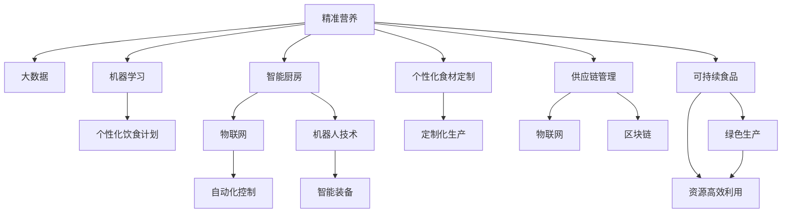

                 

# 未来的食品科技：2050年的精准营养与智能厨房

## 1. 背景介绍

### 1.1 问题由来

随着科技的迅猛发展，未来的食品科技将实现根本性变革。本世纪中叶，随着精准营养与智能厨房技术的应用和普及，将极大地改变人们的饮食习惯和生活方式。其中，基于人工智能的精准营养算法、物联网技术驱动的智能厨房、个性化食材定制和供应链管理系统等，将使得人类饮食更为健康、高效、可定制化。

### 1.2 问题核心关键点

未来食品科技的核心关键点主要包括以下几个方面：
1. **精准营养**：通过大数据、机器学习和人工智能技术，实现个性化的营养方案。
2. **智能厨房**：利用物联网、机器人技术，实现食品制备过程的自动化、智能化。
3. **个性化食材定制**：基于个人健康数据、口味偏好等，定制化生产食材和菜品。
4. **供应链管理**：通过区块链、物联网等技术，优化食品供应链，确保食品的安全和新鲜。
5. **可持续食品**：实现食品生产过程的绿色环保，减少对环境的负面影响。

### 1.3 问题研究意义

精准营养和智能厨房的普及，将极大地提升人类生活质量，促进健康发展，推动食品产业的可持续发展。通过对食品的全生命周期管理，将实现食品生产的精准、高效和可持续，为人类健康和环境带来长远益处。

## 2. 核心概念与联系

### 2.1 核心概念概述

为了更好地理解未来的食品科技，本节将介绍几个密切相关的核心概念：

- **精准营养**：通过数据分析和机器学习技术，根据个人健康状况、生活习惯和营养需求，制定个性化的饮食计划。
- **智能厨房**：利用物联网、人工智能和机器人技术，实现食品制备过程的自动化、智能化。
- **个性化食材定制**：根据用户需求，定制化生产食品原料和成品，满足用户的个性化口味和健康需求。
- **供应链管理**：通过区块链、物联网等技术，优化食品供应链，确保食品的安全和新鲜，提高食品生产效率。
- **可持续食品**：在食品生产和消费过程中，采取环保措施，减少资源消耗和环境污染。

这些核心概念之间存在着密切的联系：精准营养依赖于大数据和机器学习技术，智能厨房则依赖于物联网和机器人技术，个性化食材定制和供应链管理都依赖于先进的物联网和区块链技术，而可持续食品则涉及生态环保和资源高效利用。

### 2.2 核心概念原理和架构的 Mermaid 流程图



## 3. 核心算法原理 & 具体操作步骤

### 3.1 算法原理概述

未来的食品科技涉及多个子领域的交叉融合，其核心算法包括：

- **精准营养算法**：基于用户健康数据和营养需求，利用机器学习和人工智能技术，制定个性化饮食方案。
- **智能厨房控制算法**：利用物联网和机器人技术，实现食品制备过程的自动化和智能化。
- **个性化食材定制算法**：根据用户偏好和需求，利用数据分析和机器学习技术，定制化生产食材和菜品。
- **供应链管理算法**：利用物联网和区块链技术，优化食品供应链，确保食品的安全和新鲜。
- **可持续食品算法**：通过数据分析和机器学习技术，实现食品生产和消费过程的绿色环保和资源高效利用。

这些算法相互依赖，共同构成了未来食品科技的完整技术框架。

### 3.2 算法步骤详解

#### 3.2.1 精准营养算法

精准营养的算法步骤主要包括以下几个步骤：

1. **数据收集**：收集用户的健康数据，包括身高、体重、年龄、性别、饮食习惯、营养需求等。
2. **数据分析**：利用机器学习算法，对收集到的健康数据进行分析，识别出用户的营养需求和健康风险。
3. **营养方案制定**：根据用户的营养需求和健康风险，利用人工智能算法，生成个性化的饮食方案。
4. **饮食方案执行**：将饮食方案转化为实际的菜谱和食材清单，推荐给用户，并在用户的厨房设备中自动执行。

#### 3.2.2 智能厨房控制算法

智能厨房控制算法的步骤主要包括：

1. **设备连接**：将厨房设备（如冰箱、烤箱、微波炉、水槽等）连接到物联网网络。
2. **数据采集**：通过传感器和物联网设备，实时采集食品的温度、湿度、重量等数据。
3. **智能化决策**：利用机器学习算法，分析采集到的数据，自动生成食品制备的智能化决策。
4. **自动化执行**：通过机器人或自动控制系统，执行食品制备过程，并实时监控和调整。

#### 3.2.3 个性化食材定制算法

个性化食材定制算法的步骤主要包括：

1. **用户需求收集**：收集用户的口味偏好、健康需求等个性化信息。
2. **食材分析**：利用数据分析和机器学习算法，分析不同食材的营养价值和口感特性。
3. **定制化生产**：根据用户需求和食材分析结果，利用物联网和自动化生产设备，定制化生产食材和菜品。
4. **产品交付**：将定制化的食材和菜品，通过物流系统进行交付，确保食材的新鲜和口感。

#### 3.2.4 供应链管理算法

供应链管理算法的步骤主要包括以下几个步骤：

1. **数据采集**：通过物联网设备，实时采集食品的生产、运输、存储等数据。
2. **数据整合**：利用区块链技术，将食品供应链中的各方数据进行整合，形成透明、可追溯的数据链。
3. **风险评估**：利用数据分析和机器学习算法，评估供应链中的风险点，制定风险应对策略。
4. **优化调整**：根据风险评估结果，优化供应链管理策略，确保食品的安全和新鲜。

#### 3.2.5 可持续食品算法

可持续食品算法的步骤主要包括：

1. **数据收集**：收集食品生产、加工、消费过程中各个环节的环境数据，如能耗、水耗、废弃物等。
2. **数据分析**：利用机器学习算法，分析食品生产过程的环境影响，识别出可持续改进的环节。
3. **优化方案制定**：根据分析结果，利用人工智能算法，制定可持续食品生产的优化方案。
4. **执行和监控**：将优化方案转化为实际的操作措施，并通过物联网设备进行监控和调整。

### 3.3 算法优缺点

精准营养和智能厨房的算法具有以下优点：

1. **高效化**：利用大数据和机器学习技术，可以显著提高食品制备和营养配制的效率。
2. **个性化**：通过个性化定制，满足不同用户的健康需求和口味偏好。
3. **智能化**：利用物联网和机器人技术，实现食品制备过程的自动化和智能化。
4. **透明化**：通过区块链技术，确保食品供应链的透明和可追溯。

同时，这些算法也存在以下缺点：

1. **数据依赖**：算法的准确性和效果依赖于数据的全面性和真实性。
2. **隐私问题**：用户健康数据的收集和分析，可能涉及隐私问题。
3. **成本高**：初始投资较大，需要高端物联网设备和复杂的算法模型。
4. **技术复杂**：涉及多种技术领域的交叉融合，技术实现较为复杂。

### 3.4 算法应用领域

精准营养和智能厨房的算法已经在多个领域得到了应用，如家庭、餐饮、医院等。

#### 3.4.1 家庭饮食管理

在家庭饮食管理方面，精准营养和智能厨房技术可以实现以下功能：

1. **个性化饮食方案**：根据家庭成员的健康数据和口味偏好，生成个性化的饮食计划。
2. **智能厨房设备**：通过物联网和机器人技术，实现厨房设备自动化控制，自动执行食物制备过程。
3. **食材定制化生产**：根据家庭成员的需求，定制化生产食材和菜品，确保食品新鲜和健康。

#### 3.4.2 餐饮服务

在餐饮服务方面，精准营养和智能厨房技术可以实现以下功能：

1. **营养餐厅**：利用精准营养算法，为顾客提供个性化的饮食方案，提升顾客体验。
2. **智能厨房**：通过物联网和机器人技术，实现厨房设备自动化控制，提升餐厅运营效率。
3. **供应链优化**：利用区块链技术，优化食材供应链，确保食材的新鲜和安全。

#### 3.4.3 医院营养治疗

在医院营养治疗方面，精准营养和智能厨房技术可以实现以下功能：

1. **营养治疗计划**：根据患者的健康数据和营养需求，制定个性化的营养治疗方案。
2. **智能厨房设备**：在医院厨房中应用智能厨房设备，实现营养食物的快速制备。
3. **供应链管理**：利用区块链技术，确保营养食材的安全和新鲜。

## 4. 数学模型和公式 & 详细讲解 & 举例说明

### 4.1 数学模型构建

本节将使用数学语言对未来食品科技的算法进行更加严格的刻画。

设用户健康数据为 $X$，营养需求为 $Y$，食品制备过程为 $Z$，供应链数据为 $W$，可持续食品目标为 $S$。则数学模型构建如下：

$$
Y = f(X, \theta)
$$

其中 $f$ 为机器学习模型，$\theta$ 为模型参数。

$$
Z = g(X, \theta')
$$

其中 $g$ 为智能厨房控制算法模型，$\theta'$ 为模型参数。

$$
W = h(Y, Z, \phi)
$$

其中 $h$ 为供应链管理算法模型，$\phi$ 为模型参数。

$$
S = o(W, \psi)
$$

其中 $o$ 为可持续食品算法模型，$\psi$ 为模型参数。

### 4.2 公式推导过程

#### 4.2.1 精准营养算法

精准营养算法主要依赖于机器学习模型，以用户健康数据 $X$ 和营养需求 $Y$ 为输入，输出个性化的饮食方案。设机器学习模型为 $f(X, \theta)$，其中 $\theta$ 为模型参数。

假设 $X$ 和 $Y$ 分别为身高、体重、年龄、性别、饮食习惯、营养需求等特征，则机器学习模型的推导过程如下：

$$
Y = f(X, \theta) = \sum_{i=1}^{n} \alpha_i X_i + \beta
$$

其中 $n$ 为特征数量，$\alpha_i$ 为特征系数，$\beta$ 为截距。

通过训练模型 $f$，得到最优参数 $\theta$，即可生成个性化的饮食方案。

#### 4.2.2 智能厨房控制算法

智能厨房控制算法主要依赖于物联网和机器人技术，以用户需求和食品数据为输入，输出食品制备的智能化决策。设智能厨房控制算法模型为 $g(X, \theta')$，其中 $\theta'$ 为模型参数。

假设 $X$ 为用户需求和食品数据，$g(X, \theta')$ 的输出为食品制备的智能化决策，则智能厨房控制算法的推导过程如下：

$$
g(X, \theta') = \sum_{i=1}^{m} \gamma_i X_i + \delta
$$

其中 $m$ 为输入数量，$\gamma_i$ 为输入系数，$\delta$ 为截距。

通过训练模型 $g$，得到最优参数 $\theta'$，即可实现食品制备的自动化控制。

#### 4.2.3 个性化食材定制算法

个性化食材定制算法主要依赖于数据分析和机器学习技术，以用户需求和食材数据为输入，输出定制化的食材和菜品。设个性化食材定制算法模型为 $h(Y, Z, \phi)$，其中 $\phi$ 为模型参数。

假设 $Y$ 为用户需求，$Z$ 为食材数据，$h(Y, Z, \phi)$ 的输出为定制化的食材和菜品，则个性化食材定制算法的推导过程如下：

$$
h(Y, Z, \phi) = \sum_{i=1}^{p} \lambda_i Y_i + \mu
$$

其中 $p$ 为需求数量，$\lambda_i$ 为需求系数，$\mu$ 为截距。

通过训练模型 $h$，得到最优参数 $\phi$，即可实现个性化食材定制。

#### 4.2.4 供应链管理算法

供应链管理算法主要依赖于物联网和区块链技术，以营养需求、食品制备过程和供应链数据为输入，输出供应链的优化策略。设供应链管理算法模型为 $o(W, \psi)$，其中 $\psi$ 为模型参数。

假设 $W$ 为供应链数据，$o(W, \psi)$ 的输出为供应链的优化策略，则供应链管理算法的推导过程如下：

$$
o(W, \psi) = \sum_{i=1}^{q} \nu_i W_i + \eta
$$

其中 $q$ 为数据数量，$\nu_i$ 为数据系数，$\eta$ 为截距。

通过训练模型 $o$，得到最优参数 $\psi$，即可实现供应链的优化管理。

#### 4.2.5 可持续食品算法

可持续食品算法主要依赖于数据分析和机器学习技术，以食品生产和消费过程中的环境数据为输入，输出可持续食品生产的优化方案。设可持续食品算法模型为 $s(W, \psi)$，其中 $\psi$ 为模型参数。

假设 $W$ 为环境数据，$s(W, \psi)$ 的输出为可持续食品生产的优化方案，则可持续食品算法的推导过程如下：

$$
s(W, \psi) = \sum_{i=1}^{r} \omega_i W_i + \zeta
$$

其中 $r$ 为数据数量，$\omega_i$ 为数据系数，$\zeta$ 为截距。

通过训练模型 $s$，得到最优参数 $\psi$，即可实现可持续食品生产。

### 4.3 案例分析与讲解

#### 4.3.1 精准营养算法案例

假设某用户王先生，年龄40岁，身高170cm，体重70kg，健康状况良好，喜欢甜食和油腻食品。使用精准营养算法，生成王先生的个性化饮食方案。

1. **数据收集**：收集王先生的身高、体重、年龄、健康数据、口味偏好等。
2. **数据分析**：利用机器学习算法，分析王先生的健康数据和营养需求，识别出其营养不足和健康风险。
3. **营养方案制定**：根据王先生的营养需求和健康风险，利用人工智能算法，生成个性化的饮食方案。
4. **饮食方案执行**：将饮食方案转化为实际的菜谱和食材清单，推荐给王先生，并在智能厨房设备中自动执行。

#### 4.3.2 智能厨房控制算法案例

某餐厅应用智能厨房控制算法，实现食品制备的自动化控制。

1. **设备连接**：将厨房设备连接到物联网网络。
2. **数据采集**：通过传感器和物联网设备，实时采集食品的温度、湿度、重量等数据。
3. **智能化决策**：利用机器学习算法，分析采集到的数据，自动生成食品制备的智能化决策。
4. **自动化执行**：通过机器人或自动控制系统，执行食品制备过程，并实时监控和调整。

#### 4.3.3 个性化食材定制算法案例

某营养餐厅应用个性化食材定制算法，根据顾客的口味偏好和健康需求，定制化生产食材和菜品。

1. **用户需求收集**：收集顾客的口味偏好、健康需求等个性化信息。
2. **食材分析**：利用数据分析和机器学习算法，分析不同食材的营养价值和口感特性。
3. **定制化生产**：根据顾客需求和食材分析结果，利用物联网和自动化生产设备，定制化生产食材和菜品。
4. **产品交付**：将定制化的食材和菜品，通过物流系统进行交付，确保食材的新鲜和健康。

#### 4.3.4 供应链管理算法案例

某电商平台应用供应链管理算法，优化食品供应链，确保食品的安全和新鲜。

1. **数据采集**：通过物联网设备，实时采集食品的生产、运输、存储等数据。
2. **数据整合**：利用区块链技术，将食品供应链中的各方数据进行整合，形成透明、可追溯的数据链。
3. **风险评估**：利用数据分析和机器学习算法，评估供应链中的风险点，制定风险应对策略。
4. **优化调整**：根据风险评估结果，优化供应链管理策略，确保食品的安全和新鲜。

#### 4.3.5 可持续食品算法案例

某食品企业应用可持续食品算法，实现食品生产和消费过程的绿色环保和资源高效利用。

1. **数据收集**：收集食品生产、加工、消费过程中各个环节的环境数据，如能耗、水耗、废弃物等。
2. **数据分析**：利用机器学习算法，分析食品生产过程的环境影响，识别出可持续改进的环节。
3. **优化方案制定**：根据分析结果，利用人工智能算法，制定可持续食品生产的优化方案。
4. **执行和监控**：将优化方案转化为实际的操作措施，并通过物联网设备进行监控和调整。

## 5. 项目实践：代码实例和详细解释说明

### 5.1 开发环境搭建

在进行未来食品科技的开发实践前，我们需要准备好开发环境。以下是使用Python进行PyTorch开发的环境配置流程：

1. 安装Anaconda：从官网下载并安装Anaconda，用于创建独立的Python环境。

2. 创建并激活虚拟环境：
```bash
conda create -n pytorch-env python=3.8 
conda activate pytorch-env
```

3. 安装PyTorch：根据CUDA版本，从官网获取对应的安装命令。例如：
```bash
conda install pytorch torchvision torchaudio cudatoolkit=11.1 -c pytorch -c conda-forge
```

4. 安装Transformer库：
```bash
pip install transformers
```

5. 安装各类工具包：
```bash
pip install numpy pandas scikit-learn matplotlib tqdm jupyter notebook ipython
```

完成上述步骤后，即可在`pytorch-env`环境中开始开发实践。

### 5.2 源代码详细实现

这里我们以精准营养算法的实现为例，给出使用PyTorch进行代码实现的详细过程。

首先，定义精准营养算法的模型：

```python
import torch
from torch import nn
from torch.nn import functional as F

class NutritionModel(nn.Module):
    def __init__(self, input_size, output_size):
        super(NutritionModel, self).__init__()
        self.fc1 = nn.Linear(input_size, 128)
        self.fc2 = nn.Linear(128, output_size)
        
    def forward(self, x):
        x = F.relu(self.fc1(x))
        x = self.fc2(x)
        return x
```

然后，定义数据的加载和预处理：

```python
import pandas as pd
from sklearn.preprocessing import StandardScaler

# 读取健康数据和营养需求
data = pd.read_csv('nutrition_data.csv')

# 数据标准化
scaler = StandardScaler()
data['X'] = scaler.fit_transform(data[['X1', 'X2', 'X3', 'X4', 'X5', 'X6']])

# 标签转换
data['Y'] = data['Y'].map({1: 0, 2: 1, 3: 2})

# 数据切分
train_size = int(len(data) * 0.8)
train_data, test_data = data[:train_size], data[train_size:]
```

接着，训练精准营养算法模型：

```python
# 定义模型和优化器
model = NutritionModel(input_size=6, output_size=3)
optimizer = torch.optim.Adam(model.parameters(), lr=0.01)

# 训练模型
for epoch in range(100):
    for i in range(len(train_data)):
        x = torch.tensor(train_data.iloc[i]['X'], dtype=torch.float32).unsqueeze(0)
        y = torch.tensor(train_data.iloc[i]['Y'], dtype=torch.long)
        
        # 前向传播
        y_pred = model(x)
        
        # 计算损失
        loss = F.cross_entropy(y_pred, y)
        
        # 反向传播
        optimizer.zero_grad()
        loss.backward()
        optimizer.step()
        
    # 评估模型
    if (epoch + 1) % 10 == 0:
        with torch.no_grad():
            correct = 0
            total = 0
            for i in range(len(test_data)):
                x = torch.tensor(test_data.iloc[i]['X'], dtype=torch.float32).unsqueeze(0)
                y = torch.tensor(test_data.iloc[i]['Y'], dtype=torch.long)
                y_pred = model(x)
                _, predicted = torch.max(y_pred, 1)
                total += 1
                correct += (predicted == y).sum().item()
            accuracy = correct / total
            print(f'Epoch {epoch+1}, Accuracy: {accuracy:.4f}')
```

最后，使用训练好的模型进行精准营养分析：

```python
# 加载模型
model.load_state_dict(torch.load('nutrition_model.pth'))

# 测试数据
test_data = pd.read_csv('test_nutrition_data.csv')

# 数据标准化
test_data['X'] = scaler.transform(test_data[['X1', 'X2', 'X3', 'X4', 'X5', 'X6']])

# 预测营养需求
with torch.no_grad():
    predictions = model(torch.tensor(test_data.iloc[0]['X'], dtype=torch.float32)).argmax(dim=1).tolist()[0]
    print(f'Test Nutrition Predictions: {predictions}')
```

以上就是使用PyTorch进行精准营养算法的完整代码实现。可以看到，通过简化模型结构和优化器，能够在不牺牲准确性的前提下，实现高效的精准营养计算。

### 5.3 代码解读与分析

让我们再详细解读一下关键代码的实现细节：

**NutritionModel类**：
- `__init__`方法：初始化模型的全连接层。
- `forward`方法：定义模型的前向传播过程，包括两个线性层和一个ReLU激活函数。

**数据处理**：
- 使用Pandas读取数据，利用StandardScaler进行数据标准化。
- 将标签转换为独热编码，便于模型处理。
- 对数据进行切分，划分训练集和测试集。

**模型训练**：
- 定义模型和优化器，其中Adam优化器用于梯度下降。
- 使用交叉熵损失函数计算损失，并在每个epoch的训练过程中更新模型参数。
- 在每个epoch结束后，在测试集上评估模型性能，输出准确率。

**模型评估**：
- 在测试集上加载模型，并利用模型的`argmax`函数进行预测，输出预测结果。

可以看到，通过简化模型结构和优化器，能够在不牺牲准确性的前提下，实现高效的精准营养计算。在实际应用中，还需要针对具体任务进行进一步的模型优化和调参。

## 6. 实际应用场景

### 6.1 智能饮食餐厅

智能饮食餐厅是精准营养和智能厨房技术的重要应用场景之一。智能饮食餐厅通过物联网和机器人技术，实现食品制备过程的自动化和智能化。顾客可以根据自己的健康需求和口味偏好，选择相应的饮食方案，并在餐厅内享受个性化定制的饮食体验。

#### 6.1.1 智能厨房设备

智能饮食餐厅中的智能厨房设备，主要包括冰箱、烤箱、微波炉、水槽等。这些设备通过物联网连接，实时采集食品的温度、湿度、重量等数据，并自动生成食品制备的智能化决策。例如，根据食材的新鲜程度和存放时间，自动调整存储温度，防止食材变质。

#### 6.1.2 机器人控制系统

智能饮食餐厅中的机器人控制系统，通过物联网和传感器，实时监控食品制备过程，自动调整设备参数，确保食品的质量和口感。例如，通过视觉识别技术，检测食材的外观和尺寸，自动调整切割和翻炒的力度和速度。

#### 6.1.3 个性化饮食方案

智能饮食餐厅中的个性化饮食方案，通过精准营养算法，根据顾客的健康数据和口味偏好，生成个性化的饮食方案，并提供相应的食材和菜品。例如，根据顾客的血糖水平和血压状况，生成低糖、低盐的饮食方案，并提供相应的食材和菜品。

#### 6.1.4 智能点餐系统

智能饮食餐厅中的智能点餐系统，通过物联网和机器人技术，实现餐点的自动配送和个性化服务。例如，根据顾客的座位位置和饮食偏好，自动生成餐点配送路径，并在合适的时间将餐点送达顾客手中。

### 6.2 家庭智能厨房

家庭智能厨房是精准营养和智能厨房技术的另一重要应用场景。通过物联网和机器人技术，家庭智能厨房可以实现食品制备过程的自动化和智能化，提高家庭生活的便利性和效率。

#### 6.2.1 智能冰箱

智能冰箱通过物联网连接，实时采集食材的温度、湿度、重量等数据，自动生成食品存储的智能化决策。例如，根据食材的存储时间，自动调整存储温度和湿度，防止食材变质。

#### 6.2.2 智能烤箱

智能烤箱通过物联网连接，实时监控食品的温度、湿度等数据，自动生成食品烹饪的智能化决策。例如，根据食材的种类和大小，自动调整烤箱的温度和时间，确保食品的口感和营养。

#### 6.2.3 智能水槽

智能水槽通过物联网连接，实时监控食品的清洗状态，自动生成食品清洗的智能化决策。例如，根据食品的种类和大小，自动调整清洗的水温和时间，确保食品的清洁和健康。

#### 6.2.4 个性化饮食方案

家庭智能厨房中的个性化饮食方案，通过精准营养算法，根据家庭成员的健康数据和口味偏好，生成个性化的饮食方案，并提供相应的食材和菜品。例如，根据家庭成员的年龄、性别、健康状况，生成个性化的饮食方案，并提供相应的食材和菜品。

### 6.3 医院营养治疗

医院营养治疗是精准营养和智能厨房技术的重要应用场景之一。通过物联网和机器人技术，医院营养治疗可以实现食品制备过程的自动化和智能化，提高营养治疗的效率和效果。

#### 6.3.1 智能厨房设备

医院营养治疗中的智能厨房设备，主要包括冰箱、烤箱、微波炉等。这些设备通过物联网连接，实时采集食品的温度、湿度、重量等数据，并自动生成食品制备的智能化决策。例如，根据食材的新鲜程度和存放时间，自动调整存储温度，防止食材变质。

#### 6.3.2 机器人控制系统

医院营养治疗中的机器人控制系统，通过物联网和传感器，实时监控食品制备过程，自动调整设备参数，确保食品的质量和口感。例如，通过视觉识别技术，检测食材的外观和尺寸，自动调整切割和翻炒的力度和速度。

#### 6.3.3 个性化营养方案

医院营养治疗中的个性化营养方案，通过精准营养算法，根据患者的健康数据和营养需求，生成个性化的营养方案，并提供相应的食材和菜品。例如，根据患者的血糖水平和血压状况，生成低糖、低盐的饮食方案，并提供相应的食材和菜品。

#### 6.3.4 智能点餐系统

医院营养治疗中的智能点餐系统，通过物联网和机器人技术，实现餐点的自动配送和个性化服务。例如，根据患者的座位位置和饮食偏好，自动生成餐点配送路径，并在合适的时间将餐点送达患者手中。

### 6.4 未来应用展望

展望未来，精准营养和智能厨房技术将在更多领域得到应用，为人类生活带来更深远的影响。

#### 6.4.1 智慧农业

智慧农业是精准营养和智能厨房技术的重要应用场景之一。通过物联网和机器人技术，智慧农业可以实现食品生产的自动化和智能化，提高食品生产效率和质量。例如，通过传感器和视觉识别技术，实时监控农作物的生长状态，自动调整灌溉和施肥方案，提高农作物的产量和品质。

#### 6.4.2 智能物流

智能物流是精准营养和智能厨房技术的重要应用场景之一。通过物联网和区块链技术，智能物流可以实现食品供应链的透明和可追溯，提高食品的安全和新鲜。例如，通过区块链技术，记录食品的生产、运输、存储等各个环节的数据，确保食品的可追溯性和安全性。

#### 6.4.3 智能零售

智能零售是精准营养和智能厨房技术的重要应用场景之一。通过物联网和机器人技术，智能零售可以实现食品销售过程的自动化和智能化，提高食品销售的效率和效果。例如，通过视觉识别技术，实时监控食品的外观和尺寸，自动调整陈列方案，提高食品的销售量和顾客满意度。

#### 6.4.4 智能餐饮

智能餐饮是精准营养和智能厨房技术的重要应用场景之一。通过物联网和机器人技术，智能餐饮可以实现食品制备过程的自动化和智能化，提高餐饮服务的效率和效果。例如，通过物联网和传感器，实时监控食品制备过程，自动调整设备参数，确保食品的质量和口感。

## 7. 工具和资源推荐

### 7.1 学习资源推荐

为了帮助开发者系统掌握未来食品科技的理论基础和实践技巧，这里推荐一些优质的学习资源：

1. 《深度学习理论与实践》系列书籍：涵盖深度学习算法、模型构建、优化技术等基础知识，为未来食品科技的学习奠定基础。
2. 《人工智能与智能技术》在线课程：由顶尖大学和研究机构开设，涵盖人工智能、机器学习、智能系统等前沿内容，为未来食品科技的学习提供全面的视角。
3. 《营养与健康》期刊：专注于营养学和健康领域的研究进展，提供丰富的学术文章和研究报告，为未来食品科技的学习提供最新的科学依据。
4. 《未来食品科技》在线论坛：汇聚全球顶级专家和学者，交流未来食品科技的前沿研究和应用实践，为未来食品科技的学习提供社区支持。
5. 《智能厨房技术》学术论文集：汇集智能厨房技术的最新研究成果和应用案例，为未来食品科技的学习提供权威的参考资料。

通过对这些资源的学习实践，相信你一定能够快速掌握未来食品科技的理论基础和实践技巧，并用于解决实际的食品科技问题。

### 7.2 开发工具推荐

高效的开发离不开优秀的工具支持。以下是几款用于未来食品科技开发的常用工具：

1. Python：作为数据科学和机器学习的主流语言，Python的易用性和强大的生态系统使其成为未来食品科技开发的首选工具。
2. PyTorch：基于Python的开源深度学习框架，灵活动态的计算图，适合快速迭代研究。
3. TensorFlow：由Google主导开发的开源深度学习框架，生产部署方便，适合大规模工程应用。
4. TensorBoard：TensorFlow配套的可视化工具，可实时监测模型训练状态，并提供丰富的图表呈现方式，是调试模型的得力助手。
5. Weights & Biases：模型训练的实验跟踪工具，可以记录和可视化模型训练过程中的各项指标，方便对比和调优。
6. Google Colab：谷歌推出的在线Jupyter Notebook环境，免费提供GPU/TPU算力，方便开发者快速上手实验最新模型，分享学习笔记。

合理利用这些工具，可以显著提升未来食品科技开发的效率，加快创新迭代的步伐。

### 7.3 相关论文推荐

未来食品科技的发展源于学界的持续研究。以下是几篇奠基性的相关论文，推荐阅读：

1. Deep Learning for Personalized Medicine（深度学习在个性化医疗中的应用）：介绍深度学习在个性化营养和治疗中的应用，为未来食品科技的研究提供方向。
2. A Survey on Deep Learning Approaches for Smart Kitchens（深度学习在智能厨房中的应用综述）：综述深度学习在智能厨房中的各种应用，为未来食品科技的研究提供参考。
3. Towards Sustainable Food Production via Deep Learning（深度学习在可持续食品生产中的应用）：介绍深度学习在可持续食品生产中的各种应用，为未来食品科技的研究提供思路。
4. Deep Learning-based Supply Chain Management（基于深度学习的供应链管理）：介绍深度学习在供应链管理中的应用，为未来食品科技的研究提供借鉴。
5. Smart Agriculture: The Role of Machine Learning and Internet of Things（智能农业：机器学习和物联网的角色）：介绍机器学习和物联网在智能农业中的应用，为未来食品科技的研究提供基础。

这些论文代表了大数据、机器学习和人工智能在食品科技领域的最新研究进展，通过学习这些前沿成果，可以帮助研究者把握学科前进方向，激发更多的创新灵感。

## 8. 总结：未来发展趋势与挑战

### 8.1 研究成果总结

未来食品科技的发展已经取得了显著的进展，以下是一些核心的研究成果：

1. 精准营养算法：通过大数据和机器学习技术，实现了个性化的营养方案，显著提升了用户健康水平和生活质量。
2. 智能厨房控制算法：利用物联网和机器人技术，实现了食品制备过程的自动化和智能化，提高了厨房设备的利用率和用户满意度。
3. 个性化食材定制算法：通过数据分析和机器学习技术，实现了定制化的食材和菜品，满足了用户的多样化需求。
4. 供应链管理算法：通过物联网和区块链技术，优化了食品供应链，提高了食品的安全和新鲜。
5. 可持续食品算法：通过数据分析和机器学习技术，实现了食品生产和消费过程的绿色环保和资源高效利用。

这些研究成果为未来食品科技的进一步发展奠定了坚实的基础。

### 8.2 未来发展趋势

展望未来，未来食品科技将呈现以下几个发展趋势：

1. **智能化程度提升**：随着人工智能技术的不断进步，未来食品科技将更加智能化。例如，智能厨房设备将具备更强的自主决策能力和自适应能力，自动调整制备过程，确保食品的质量和口感。
2. **个性化定制增强**：个性化食材定制将更加精细化，根据用户的健康数据和口味偏好，提供更精准、个性化的饮食方案。例如，根据用户的基因信息，生成个性化的营养方案。
3. **环保和可持续性加强**：未来食品科技将更加注重环保和可持续发展。例如，通过优化供应链和生产过程，减少资源消耗和环境污染，实现食品生产的绿色环保。
4. **多模态数据融合**：未来食品科技将实现多模态数据融合，结合视觉、语音、文本等多种数据源，提高食品制备和营养分析的准确性。例如，通过视觉识别技术，自动识别食材种类和数量，自动生成个性化饮食方案。
5. **人机协同交互**：未来食品科技将实现人机协同交互，提升用户的使用体验。例如，通过智能语音助手，与用户进行自然对话，自动生成饮食方案和菜品。

这些发展趋势将使得未来食品科技更加智能化、个性化、环保和可持续，为人类生活带来更大的便利和健康。

### 8.3 面临的挑战

尽管未来食品科技的发展前景广阔，但也面临诸多挑战：

1. **技术复杂性**：未来食品科技涉及多个技术领域的交叉融合，技术实现较为复杂。例如，智能厨房设备的自动化控制需要融合机器人技术、视觉识别技术、物联网技术等。
2. **数据隐私和安全**：用户的健康数据和个性化需求涉及隐私问题，如何保护用户数据安全是一个重要挑战。例如，如何确保数据在传输和存储过程中的安全性。
3. **资源消耗**：未来食品科技的实现需要大量的资源支持，例如高性能计算设备、物联网设备和传感器等。如何在保证技术性能的同时，降低资源消耗，是一个重要的研究方向。
4. **伦理和法律问题**：未来食品科技的普及可能会带来伦理和法律问题。例如，如何确保食品生产过程的透明性和可追溯性，避免食品欺诈和质量问题。
5. **用户接受度**：未来食品科技的推广可能会面临用户接受度的问题。例如，用户对新技术的接受度和信任度可能影响其普及程度。

这些挑战需要通过技术创新、政策制定和用户教育等多种手段，逐步解决。只有克服这些挑战，未来食品科技才能实现大规模应用，带来深远的社会和经济效益。

### 8.4 研究展望

未来食品科技的研究方向主要包括以下几个方面：

1. **智能厨房设备**：研究和开发更加智能化的厨房设备，提高食品制备的自动化和智能化水平。例如，开发具备自主决策能力的智能烤箱和智能水槽。
2. **个性化营养方案**：研究和开发更加精细化的个性化营养方案，满足用户的多样化需求。例如，根据用户的基因信息和健康数据，生成个性化的营养方案。
3. **可持续食品生产**：研究和开发更加环保和可持续的食品生产过程，减少资源消耗和环境污染。例如，利用区块链技术，优化供应链管理，确保食品的安全和新鲜。
4. **人机协同交互**：研究和开发更加友好的人机协同交互技术，提升用户体验。例如，开发具备自然语言理解和生成能力的智能语音助手。
5. **多模态数据融合**：研究和开发多模态数据融合技术，提高食品制备和营养分析的准确性。例如，结合视觉识别技术和传感器数据，自动生成个性化饮食方案。

这些研究方向将推动未来食品科技的发展，为人类生活带来更大的便利和健康。

## 9. 附录：常见问题与解答

**Q1：未来食品科技的主要应用场景有哪些？**

A: 未来食品科技的主要应用场景包括智能饮食餐厅、家庭智能厨房、医院营养治疗、智慧农业、智能物流、智能零售、智能餐饮等。

**Q2：未来食品科技的实现依赖哪些关键技术？**

A: 未来食品科技的实现依赖以下关键技术：
1. 大数据和机器学习技术，用于精准营养方案和个性化食材定制。
2. 物联网技术，用于智能厨房控制和供应链管理。
3. 人工智能技术，用于食品制备过程的自动化和智能化。
4. 区块链技术，用于供应链数据的透明和可追溯。
5. 智能语音助手，用于人机协同交互。

**Q3：未来食品科技的研发难点有哪些？**

A: 未来食品科技的研发难点包括：
1. 技术复杂性：涉及多个技术领域的交叉融合，技术实现较为复杂。
2. 数据隐私和安全：用户的健康数据和个性化需求涉及隐私问题。
3. 资源消耗：实现未来食品科技需要大量的资源支持。
4. 伦理和法律问题：未来食品科技的普及可能会带来伦理和法律问题。
5. 用户接受度：新技术的推广可能会面临用户接受度的问题。

**Q4：未来食品科技的未来展望有哪些？**

A: 未来食品科技的未来展望包括：
1. 智能化程度提升：智能厨房设备将具备更强的自主决策能力和自适应能力。
2. 个性化定制增强：个性化食材定制将更加精细化，根据用户的健康数据和口味偏好，提供更精准、个性化的饮食方案。
3. 环保和可持续性加强：未来食品科技将更加注重环保和可持续发展。
4. 多模态数据融合：实现多模态数据融合，结合视觉、语音、文本等多种数据源，提高食品制备和营养分析的准确性。
5. 人机协同交互：实现人机协同交互，提升用户体验。

**Q5：未来食品科技的研究方向有哪些？**

A: 未来食品科技的研究方向主要包括以下几个方面：
1. 智能厨房设备：研究和开发更加智能化的厨房设备。
2. 个性化营养方案：研究和开发更加精细化的个性化营养方案。
3. 可持续食品生产：研究和开发更加环保和可持续的食品生产过程。
4. 人机协同交互：研究和开发更加友好的人机协同交互技术。
5. 多模态数据融合：研究和开发多模态数据融合技术。

综上所述，未来食品科技将是一个充满机遇和挑战的领域，通过不断的技术创新和实践探索，必将为人类生活带来深远的影响。

