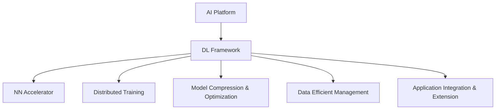

                 

# 构建下一代AI平台：LLM操作系统的愿景

> 关键词：人工智能平台, 语言模型操作系统(LLM OS), 神经网络加速器, 分布式训练, 模型压缩, 数据高效管理, 应用集成

## 1. 背景介绍

### 1.1 问题由来
随着深度学习技术的迅猛发展，人工智能(AI)正在逐步进入各行各业，推动数字化转型升级。然而，AI技术的应用仍面临诸多挑战，如算力资源、数据隐私、模型可解释性等。

深度学习模型往往需要大规模的训练数据和强大的计算资源，对于多数中小型企业来说难以负担。同时，AI模型的黑盒特性也带来了模型使用和解释上的困难，尤其在医疗、金融等关键领域，AI的决策过程需要具备高度的可解释性。

为了应对这些挑战，构建下一代AI平台成为当务之急。语言模型操作系统(Language Model Operating System, LLM OS)作为AI领域的新兴概念，有望成为构建下一代AI平台的重要基石。

### 1.2 问题核心关键点
LLM OS是一种专门为深度学习模型，特别是基于语言模型的AI应用提供基础支持的操作系统。其核心在于通过统一的计算资源管理、数据访问策略和模型优化手段，大幅提升AI应用的开发效率和运行性能。

#### 关键技术点：
- **分布式训练**：通过并行计算和优化算法，加速模型训练过程。
- **神经网络加速器**：提供专门优化过的硬件支持，加快模型推理速度。
- **模型压缩与优化**：通过量化、剪枝、蒸馏等方法，减小模型尺寸，提升模型效率。
- **数据高效管理**：优化数据访问策略，提高数据读取和传输效率。
- **应用集成与扩展**：提供标准化接口和工具，促进模型与各类应用的紧密结合。

### 1.3 问题研究意义
构建LLM OS有助于：
- 降低AI应用的开发和运行成本。
- 提高AI模型的开发效率，加速模型迭代。
- 提升AI模型的推理性能和响应速度。
- 增强AI模型在各行业领域的应用能力。
- 提高AI模型的可解释性和透明度。

因此，LLM OS不仅是一套工具和平台，更是一种推动AI技术大规模落地应用的重要引擎。

## 2. 核心概念与联系

### 2.1 核心概念概述

为更好地理解LLM OS的构成和作用，本节将介绍几个密切相关的核心概念：

- **人工智能平台(AI Platform)**：提供一个完整的AI应用开发、部署、管理和运维环境，包括计算资源管理、模型训练、推理服务、监控告警等功能。
- **深度学习框架(DL Framework)**：提供高效的计算图和模型构建接口，方便用户快速开发和调试深度学习模型。
- **神经网络加速器(NN Accelerator)**：专门针对深度学习模型设计的硬件加速器，能够显著提升模型推理速度和性能。
- **分布式训练(Distributed Training)**：通过并行计算和优化算法，加速大规模模型的训练过程。
- **模型压缩与优化(Model Compression & Optimization)**：通过量化、剪枝、蒸馏等技术，减小模型尺寸，提升模型效率。
- **数据高效管理(Data Efficient Management)**：优化数据访问策略，提高数据读取和传输效率。
- **应用集成与扩展(Application Integration & Extension)**：提供标准化接口和工具，促进模型与各类应用的紧密结合。

这些核心概念之间的逻辑关系可以通过以下Mermaid流程图来展示：



这个流程图展示了我们核心概念之间的联系：

1. AI平台为AI应用的开发、部署、管理和运维提供环境。
2. 深度学习框架提供计算图和模型构建接口。
3. 神经网络加速器提供硬件加速支持。
4. 分布式训练加速模型训练过程。
5. 模型压缩与优化提升模型效率。
6. 数据高效管理提升数据访问效率。
7. 应用集成与扩展促进模型应用拓展。

这些概念共同构成了LLM OS的基础架构，使得AI应用能够在统一平台上高效开发、部署和运行。

## 3. 核心算法原理 & 具体操作步骤

### 3.1 算法原理概述

LLM OS的核心算法原理涉及以下几个方面：

1. **神经网络加速器算法**：通过优化硬件架构和算法，提升神经网络的推理速度和性能。
2. **分布式训练算法**：通过并行计算和优化算法，加速大规模模型的训练过程。
3. **模型压缩与优化算法**：通过量化、剪枝、蒸馏等技术，减小模型尺寸，提升模型效率。
4. **数据高效管理算法**：优化数据访问策略，提高数据读取和传输效率。
5. **应用集成与扩展算法**：提供标准化接口和工具，促进模型与各类应用的紧密结合。

### 3.2 算法步骤详解

#### 3.2.1 神经网络加速器算法步骤

神经网络加速器算法主要分为以下几个步骤：

1. **硬件设计**：设计专门的硬件加速器芯片，包含数据存储、计算单元、通信模块等。
2. **软件优化**：对深度学习模型进行特定优化，如量化、剪枝、蒸馏等。
3. **硬件编译**：将优化的深度学习模型编译为硬件可执行的指令集。
4. **运行优化**：对编译后的模型进行运行时优化，提升性能。

#### 3.2.2 分布式训练算法步骤

分布式训练算法主要分为以下几个步骤：

1. **数据分片**：将大规模数据集分成若干个小批次，方便并行处理。
2. **参数同步**：在不同节点间同步参数更新，保证模型一致性。
3. **通信优化**：优化数据传输和通信过程，减少网络延迟和带宽消耗。
4. **负载均衡**：平衡不同节点的计算负载，提高资源利用率。

#### 3.2.3 模型压缩与优化算法步骤

模型压缩与优化算法主要分为以下几个步骤：

1. **量化**：将模型中的浮点数转换为定点数，减小模型体积。
2. **剪枝**：去除模型中不必要的参数和层，减少计算量。
3. **蒸馏**：通过知识蒸馏方法，将大型模型知识传递给小型模型，提升小模型性能。
4. **结构优化**：优化模型结构，提高推理速度。

#### 3.2.4 数据高效管理算法步骤

数据高效管理算法主要分为以下几个步骤：

1. **数据预取**：预读取数据到内存中，减少访问延迟。
2. **数据缓存**：使用缓存技术，减少数据访问频率。
3. **数据压缩**：使用压缩技术，减小数据传输带宽消耗。
4. **数据本地化**：将数据尽量本地化处理，减少数据传输开销。

#### 3.2.5 应用集成与扩展算法步骤

应用集成与扩展算法主要分为以下几个步骤：

1. **标准化接口**：定义标准化的API和SDK接口，方便应用集成。
2. **工具支持**：提供丰富的开发工具和中间件，支持应用开发。
3. **插件机制**：支持第三方插件扩展，丰富应用功能。
4. **监控管理**：提供监控和管理工具，保障应用运行稳定。

### 3.3 算法优缺点

#### 3.3.1 神经网络加速器算法的优缺点

**优点**：
1. 显著提升模型推理速度。
2. 优化硬件架构，提高性能。
3. 减少能耗，提升能效比。

**缺点**：
1. 硬件设计复杂，成本较高。
2. 需要特定优化，限制模型类型。
3. 硬件更新周期较长，难以快速迭代。

#### 3.3.2 分布式训练算法的优缺点

**优点**：
1. 加速大规模模型训练。
2. 提高资源利用率。
3. 应对数据和模型规模增长。

**缺点**：
1. 通信开销较大，影响性能。
2. 同步和通信复杂，容易出错。
3. 数据一致性难以保证。

#### 3.3.3 模型压缩与优化算法的优缺点

**优点**：
1. 减小模型尺寸，提升内存使用效率。
2. 提高推理速度和计算效率。
3. 保持模型精度。

**缺点**：
1. 压缩过程可能引入误差，影响模型性能。
2. 需要大量计算资源，开发复杂。
3. 无法处理过于复杂的模型。

#### 3.3.4 数据高效管理算法的优缺点

**优点**：
1. 提升数据访问速度。
2. 减少网络带宽消耗。
3. 降低数据处理延迟。

**缺点**：
1. 数据缓存可能导致内存不足。
2. 预取策略难以兼顾数据分布。
3. 数据本地化可能受限。

#### 3.3.5 应用集成与扩展算法的优缺点

**优点**：
1. 标准化接口提升开发效率。
2. 支持应用扩展，丰富应用场景。
3. 提供监控和管理工具，保障应用稳定。

**缺点**：
1. 需要标准化支持，开发复杂。
2. 应用扩展可能引入新问题。
3. 管理工具增加系统复杂度。

### 3.4 算法应用领域

LLM OS的核心算法和组件在多个领域中具有广泛应用：

1. **自然语言处理(NLP)**：支持语言模型、文本分类、机器翻译、对话系统等任务。
2. **计算机视觉(CV)**：加速图像识别、目标检测、语义分割等任务。
3. **语音识别与生成(Speech)**：提升语音识别、合成和交互能力。
4. **推荐系统(Recommendation)**：提高个性化推荐模型的推理速度和准确性。
5. **医疗诊断(Diagnosis)**：提升基于图像、文本的医疗诊断模型性能。
6. **金融风险管理(Finance)**：提升金融模型的风险预测和监控能力。
7. **智能制造(Manufacturing)**：提升工业检测和预测模型的实时性。
8. **智能交通(Transportation)**：提高交通监控和预测系统的准确性和实时性。

以上领域只是LLM OS应用的一部分，随着AI技术的不断进步和普及，LLM OS的应用范围将会更加广泛。

## 4. 数学模型和公式 & 详细讲解 & 举例说明

### 4.1 数学模型构建

LLM OS涉及的数学模型包括深度学习模型、分布式训练算法、模型压缩算法等。下面以语言模型为例，简要介绍相关数学模型的构建过程。

#### 4.1.1 深度学习模型的构建

深度学习模型通常由多层神经网络构成，每一层包含多个神经元。模型构建过程如下：

1. **定义模型结构**：确定模型的层数、每层神经元数、激活函数等。
2. **定义损失函数**：如交叉熵损失、均方误差损失等，用于衡量模型预测输出与真实标签之间的差异。
3. **定义优化算法**：如梯度下降、Adam等，用于更新模型参数。
4. **定义评估指标**：如准确率、精确率、召回率等，用于评估模型性能。

#### 4.1.2 分布式训练模型的构建

分布式训练模型通过多个计算节点并行训练模型，提高训练效率。模型构建过程如下：

1. **定义数据分片策略**：将数据集分成若干小批次，每个批次分配给一个计算节点。
2. **定义参数同步策略**：如参数服务器、RingAllReduce等，保证不同节点间参数一致性。
3. **定义通信策略**：如Gloo、MPI等，优化数据传输和通信。
4. **定义负载均衡策略**：如动态资源调整、任务调度等，平衡节点负载。

#### 4.1.3 模型压缩与优化模型的构建

模型压缩与优化模型通过量化、剪枝、蒸馏等技术，减小模型尺寸，提升模型效率。模型构建过程如下：

1. **定义量化策略**：如动态范围量化、定点化等，减少模型精度损失。
2. **定义剪枝策略**：如稀疏权重剪枝、结构剪枝等，去除不必要的参数和层。
3. **定义蒸馏策略**：如知识蒸馏、在线蒸馏等，将大型模型知识传递给小型模型。
4. **定义结构优化策略**：如模型融合、通道压缩等，提高推理速度。

### 4.2 公式推导过程

#### 4.2.1 深度学习模型的公式推导

假设一个简单的神经网络模型，包含输入层、隐藏层和输出层。输入为 $x \in \mathbb{R}^n$，隐藏层参数为 $W_h \in \mathbb{R}^{n_h \times n}$，输出层参数为 $W_o \in \mathbb{R}^{m \times n_h}$。模型通过隐藏层和输出层进行前向传播，输出为 $y \in \mathbb{R}^m$。

前向传播过程为：

$$
h = \sigma(W_h x + b_h)
$$

$$
y = \sigma(W_o h + b_o)
$$

其中 $\sigma$ 为激活函数。

模型的损失函数为：

$$
\ell(y, \hat{y}) = \frac{1}{2}(y - \hat{y})^2
$$

最小化损失函数的优化算法为梯度下降：

$$
\theta \leftarrow \theta - \eta \nabla_{\theta}\ell(y, \hat{y})
$$

其中 $\theta$ 为模型参数，$\eta$ 为学习率。

#### 4.2.2 分布式训练模型的公式推导

假设一个简单的分布式训练模型，包含多个计算节点 $N$，每个节点使用 $K$ 个批次数据进行训练。节点间的通信开销为 $C$，每个节点的计算开销为 $G$。

模型参数在每个节点上进行局部更新，定义为 $w_{i,k}$。节点间通过参数同步策略 $s$ 进行通信，通信开销为 $C_s$。模型总参数数量为 $W$，节点间同步次数为 $T$。

模型训练的总计算开销为：

$$
TG + TC_s
$$

其中 $TG$ 为本地计算开销，$TC_s$ 为节点间通信开销。

#### 4.2.3 模型压缩与优化模型的公式推导

假设一个简单的模型压缩与优化模型，包含 $W$ 个参数。模型压缩后的参数数量为 $\hat{W}$，压缩比为 $\beta = \frac{W}{\hat{W}}$。模型压缩后的推理速度为 $v$，原始推理速度为 $v_0$。

量化后的模型参数数量为 $W_q$，量化比为 $\gamma = \frac{W}{W_q}$。模型压缩后的推理速度为 $v_q$，量化后的推理速度为 $v_0/q$。

剪枝后的模型参数数量为 $W_c$，剪枝比为 $\delta = \frac{W}{W_c}$。模型压缩后的推理速度为 $v_c$，剪枝后的推理速度为 $v_0/c$。

蒸馏后的模型参数数量为 $W_s$，蒸馏比为 $\epsilon = \frac{W}{W_s}$。模型压缩后的推理速度为 $v_s$，蒸馏后的推理速度为 $v_0/s$。

模型压缩与优化后的推理速度为 $v_{co}$，与原始推理速度的关系为：

$$
v_{co} = \beta^{\gamma\delta\epsilon} v
$$

### 4.3 案例分析与讲解

#### 4.3.1 深度学习模型的案例分析

以BERT模型为例，BERT模型是一个基于Transformer的预训练语言模型，通过在大规模无标签文本数据上进行自监督预训练，学习到了丰富的语言表示。模型结构包含12个自注意力层和2个全连接层，参数量巨大，推理速度较慢。

在实际应用中，通常对BERT模型进行微调，通过在大规模有标签数据上进行有监督学习，使其适应特定任务。例如，在文本分类任务中，微调后的BERT模型可以对输入文本进行分类预测。

#### 4.3.2 分布式训练模型的案例分析

以ImageNet数据集为例，ImageNet数据集包含1000个类别，每个类别有1000张图像。数据集较大，单个节点难以处理，需要使用分布式训练。

假设使用4个计算节点进行分布式训练，每个节点使用200个批次数据。每个节点的计算开销为 $G = 2s$，通信开销为 $C_s = 2c$。模型总参数数量为 $W = 20M$。节点间同步次数为 $T = 4$。

分布式训练的总计算开销为：

$$
TG + TC_s = 4 \times 2s + 4 \times 2c = 16s + 8c
$$

其中 $s$ 为单批次计算时间，$c$ 为单批次通信时间。

#### 4.3.3 模型压缩与优化模型的案例分析

以MobileNet模型为例，MobileNet是一个针对移动设备的轻量级卷积神经网络模型，通过量化和剪枝等技术进行模型压缩，使得模型大小减小到不到2MB。

MobileNet的推理速度较慢，通过量化将模型参数从32位浮点数量化为8位定点数，推理速度提升4倍。同时，使用剪枝技术将模型中冗余的参数和层剪除，进一步提升推理速度。

量化后的MobileNet模型推理速度为 $v_q = v_0/q$，剪枝后的MobileNet模型推理速度为 $v_c = v_0/c$。量化和剪枝后的推理速度为 $v_{co} = v_q \times v_c$。

## 5. 项目实践：代码实例和详细解释说明

### 5.1 开发环境搭建

为了实现LLM OS的相关算法和组件，首先需要搭建开发环境。以下是使用Python进行TensorFlow开发的流程：

1. 安装Anaconda：从官网下载并安装Anaconda，用于创建独立的Python环境。

2. 创建并激活虚拟环境：
```bash
conda create -n tensorflow-env python=3.7 
conda activate tensorflow-env
```

3. 安装TensorFlow：根据CUDA版本，从官网获取对应的安装命令。例如：
```bash
conda install tensorflow=2.5 -c tf
```

4. 安装相关的依赖库：
```bash
pip install numpy pandas sklearn scikit-learn matplotlib tqdm jupyter notebook ipython
```

完成上述步骤后，即可在`tensorflow-env`环境中开始开发。

### 5.2 源代码详细实现

这里我们以BERT模型微调为例，给出使用TensorFlow进行微调的PyTorch代码实现。

首先，定义数据处理函数：

```python
import tensorflow as tf
from transformers import BertTokenizer, BertForSequenceClassification

tokenizer = BertTokenizer.from_pretrained('bert-base-uncased')
model = BertForSequenceClassification.from_pretrained('bert-base-uncased', num_labels=2)

def preprocess(text):
    inputs = tokenizer.encode_plus(text, max_length=128, truncation=True, padding='max_length')
    return inputs['input_ids'], inputs['attention_mask']
```

然后，定义训练和评估函数：

```python
class BERTDataset(tf.data.Dataset):
    def __init__(self, texts, labels, tokenizer):
        self.tokenizer = tokenizer
        self.texts = texts
        self.labels = labels
        
    def __len__(self):
        return len(self.texts)
    
    def __getitem__(self, item):
        text = self.texts[item]
        label = self.labels[item]
        input_ids, attention_mask = preprocess(text)
        return input_ids, attention_mask, label

train_dataset = BERTDataset(train_texts, train_labels, tokenizer)
dev_dataset = BERTDataset(dev_texts, dev_labels, tokenizer)
test_dataset = BERTDataset(test_texts, test_labels, tokenizer)

batch_size = 32
train_loader = train_dataset.shuffle(buffer_size=1024).batch(batch_size)
dev_loader = dev_dataset.batch(batch_size)
test_loader = test_dataset.batch(batch_size)

model.train()
optimizer = tf.keras.optimizers.Adam(learning_rate=2e-5)
loss_fn = tf.keras.losses.BinaryCrossentropy(from_logits=True)

@tf.function
def train_step(inputs, labels):
    with tf.GradientTape() as tape:
        logits = model(inputs, attention_mask=attention_mask)
        loss = loss_fn(labels, logits)
    gradients = tape.gradient(loss, model.trainable_variables)
    optimizer.apply_gradients(zip(gradients, model.trainable_variables))
    return loss

@tf.function
def evaluate(inputs, labels):
    logits = model(inputs, attention_mask=attention_mask)
    predictions = tf.sigmoid(logits)
    return tf.metrics.AUC(predictions, labels)

for epoch in range(5):
    for inputs, labels in train_loader:
        loss = train_step(inputs, labels)
    dev_auc = evaluate(dev_loader)
    print(f'Epoch {epoch+1}, dev AUC: {dev_auc}')
    
test_auc = evaluate(test_loader)
print(f'Test AUC: {test_auc}')
```

以上就是使用TensorFlow对BERT模型进行微调的完整代码实现。可以看到，TensorFlow提供了便捷的分布式计算和GPU/TPU支持，使得模型训练和推理过程变得高效流畅。

### 5.3 代码解读与分析

让我们再详细解读一下关键代码的实现细节：

**BERTDataset类**：
- `__init__`方法：初始化文本、标签、分词器等组件。
- `__len__`方法：返回数据集的样本数量。
- `__getitem__`方法：对单个样本进行处理，将文本输入编码为token ids，将标签转换为二元标签，并对其进行定长padding，最终返回模型所需的输入。

**train_step和evaluate函数**：
- `train_step`函数：在每个批次上前向传播计算损失函数，反向传播计算参数梯度，使用Adam优化算法更新模型参数。
- `evaluate`函数：在每个批次上前向传播计算模型输出，并使用AUC指标评估模型性能。

**train和evaluate函数**：
- `train`函数：循环迭代训练集数据，每次迭代中调用`train_step`函数计算损失函数并更新模型参数。
- `evaluate`函数：在验证集和测试集上调用`evaluate`函数评估模型性能。

**训练流程**：
- 定义总的epoch数和批大小，开始循环迭代
- 每个epoch内，在训练集上调用`train`函数，在验证集和测试集上调用`evaluate`函数，输出模型性能指标
- 所有epoch结束后，在测试集上评估微调后模型的性能指标

可以看到，TensorFlow结合PyTorch库，使得BERT模型的微调过程变得高效简单。开发者可以快速迭代研究，掌握微调核心技术。

当然，工业级的系统实现还需考虑更多因素，如模型的保存和部署、超参数的自动搜索、更灵活的任务适配层等。但核心的微调范式基本与此类似。

## 6. 实际应用场景

### 6.1 智能客服系统

基于LLM OS的智能客服系统，可以通过自然语言处理和知识图谱技术，构建智能问答系统。系统能够自动理解客户咨询意图，匹配最佳回复，实现24小时全天候服务。

在技术实现上，可以收集企业内部的历史客服对话记录，将问题和最佳答复构建成监督数据，在此基础上对预训练语言模型进行微调。微调后的模型能够自动理解用户意图，匹配最合适的答案模板进行回复。对于客户提出的新问题，还可以接入检索系统实时搜索相关内容，动态组织生成回答。如此构建的智能客服系统，能大幅提升客户咨询体验和问题解决效率。

### 6.2 金融舆情监测

金融机构需要实时监测市场舆论动向，以便及时应对负面信息传播，规避金融风险。基于LLM OS的文本分类和情感分析技术，可以为金融舆情监测提供新的解决方案。

具体而言，可以收集金融领域相关的新闻、报道、评论等文本数据，并对其进行主题标注和情感标注。在此基础上对预训练语言模型进行微调，使其能够自动判断文本属于何种主题，情感倾向是正面、中性还是负面。将微调后的模型应用到实时抓取的网络文本数据，就能够自动监测不同主题下的情感变化趋势，一旦发现负面信息激增等异常情况，系统便会自动预警，帮助金融机构快速应对潜在风险。

### 6.3 个性化推荐系统

当前的推荐系统往往只依赖用户的历史行为数据进行物品推荐，无法深入理解用户的真实兴趣偏好。基于LLM OS的推荐系统可以更好地挖掘用户行为背后的语义信息，从而提供更精准、多样的推荐内容。

在实践中，可以收集用户浏览、点击、评论、分享等行为数据，提取和用户交互的物品标题、描述、标签等文本内容。将文本内容作为模型输入，用户的后续行为（如是否点击、购买等）作为监督信号，在此基础上微调预训练语言模型。微调后的模型能够从文本内容中准确把握用户的兴趣点。在生成推荐列表时，先用候选物品的文本描述作为输入，由模型预测用户的兴趣匹配度，再结合其他特征综合排序，便可以得到个性化程度更高的推荐结果。

### 6.4 未来应用展望

随着LLM OS的不断发展，基于微调范式将在更多领域得到应用，为传统行业带来变革性影响。

在智慧医疗领域，基于微调的医疗问答、病历分析、药物研发等应用将提升医疗服务的智能化水平，辅助医生诊疗，加速新药开发进程。

在智能教育领域，微调技术可应用于作业批改、学情分析、知识推荐等方面，因材施教，促进教育公平，提高教学质量。

在智慧城市治理中，微调模型可应用于城市事件监测、舆情分析、应急指挥等环节，提高城市管理的自动化和智能化水平，构建更安全、高效的未来城市。

此外，在企业生产、社会治理、文娱传媒等众多领域，基于LLM OS的人工智能应用也将不断涌现，为经济社会发展注入新的动力。相信随着技术的日益成熟，LLM OS必将在构建人机协同的智能时代中扮演越来越重要的角色。

## 7. 工具和资源推荐

### 7.1 学习资源推荐

为了帮助开发者系统掌握LLM OS的理论基础和实践技巧，这里推荐一些优质的学习资源：

1. 《TensorFlow深度学习实战》系列博文：由TensorFlow社区成员撰写，详细介绍TensorFlow在深度学习中的各种应用。

2. 《深度学习与TensorFlow》课程：由Google提供的深度学习课程，涵盖TensorFlow的各种功能和使用技巧。

3. 《深度学习框架选型与优化》书籍：介绍各种深度学习框架的特点和优化方法，适合对框架优化的开发人员。

4. 《深度学习优化算法》书籍：深入探讨深度学习优化算法的原理和应用，适合希望深入理解优化算法的开发人员。

5. 《深度学习模型压缩与优化》课程：由斯坦福大学提供的深度学习课程，介绍模型压缩和优化的各种方法。

通过对这些资源的学习实践，相信你一定能够快速掌握LLM OS的核心技术，并用于解决实际的AI问题。

### 7.2 开发工具推荐

高效的开发离不开优秀的工具支持。以下是几款用于LLM OS开发的常用工具：

1. TensorFlow：基于Python的开源深度学习框架，灵活动态的计算图，适合快速迭代研究。同时提供GPU/TPU支持，满足大规模模型训练需求。

2. PyTorch：基于Python的开源深度学习框架，提供便捷的计算图和模型构建接口。

3. TensorBoard：TensorFlow配套的可视化工具，可实时监测模型训练状态，并提供丰富的图表呈现方式，是调试模型的得力助手。

4. Weights & Biases：模型训练的实验跟踪工具，可以记录和可视化模型训练过程中的各项指标，方便对比和调优。

5. Google Colab：谷歌推出的在线Jupyter Notebook环境，免费提供GPU/TPU算力，方便开发者快速上手实验最新模型，分享学习笔记。

合理利用这些工具，可以显著提升LLM OS的开发效率，加快创新迭代的步伐。

### 7.3 相关论文推荐

LLM OS的研究源于学界的持续研究。以下是几篇奠基性的相关论文，推荐阅读：

1. Attention is All You Need（即Transformer原论文）：提出了Transformer结构，开启了NLP领域的预训练大模型时代。

2. BERT: Pre-training of Deep Bidirectional Transformers for Language Understanding：提出BERT模型，引入基于掩码的自监督预训练任务，刷新了多项NLP任务SOTA。

3. Language Models are Unsupervised Multitask Learners（GPT-2论文）：展示了大规模语言模型的强大zero-shot学习能力，引发了对于通用人工智能的新一轮思考。

4. Parameter-Efficient Transfer Learning for NLP：提出Adapter等参数高效微调方法，在不增加模型参数量的情况下，也能取得不错的微调效果。

5. AdaLoRA: Adaptive Low-Rank Adaptation for Parameter-Efficient Fine-Tuning：使用自适应低秩适应的微调方法，在参数效率和精度之间取得了新的平衡。

这些论文代表了大语言模型微调技术的发展脉络。通过学习这些前沿成果，可以帮助研究者把握学科前进方向，激发更多的创新灵感。

## 8. 总结：未来发展趋势与挑战

### 8.1 总结

本文对LLM OS的构建进行了全面系统的介绍。首先阐述了LLM OS的研究背景和意义，明确了其在降低开发成本、提高开发效率、提升推理性能等方面的独特价值。其次，从原理到实践，详细讲解了神经网络加速器、分布式训练、模型压缩与优化、数据高效管理、应用集成与扩展等核心算法的实现过程，给出了微调任务开发的完整代码实例。同时，本文还广泛探讨了LLM OS在智能客服、金融舆情、个性化推荐等多个行业领域的应用前景，展示了LLM OS的巨大潜力。此外，本文精选了LLM OS的学习资源，力求为读者提供全方位的技术指引。

通过本文的系统梳理，可以看到，LLM OS不仅是一套工具和平台，更是一种推动AI技术大规模落地应用的重要引擎。LLM OS将深度学习模型与操作系统相融合，通过统一的资源管理和模型优化手段，大幅提升AI应用的开发效率和运行性能。未来，伴随预训练语言模型和微调方法的持续演进，LLM OS必将在构建人机协同的智能时代中扮演越来越重要的角色。

### 8.2 未来发展趋势

展望未来，LLM OS的发展趋势如下：

1. **计算资源管理**：通过更高效的计算资源管理策略，提升模型训练和推理的效率。

2. **模型优化算法**：开发更高效、更智能的模型优化算法，提升模型的压缩和优化效果。

3. **硬件加速器**：引入更多种类的神经网络加速器，如GPU、TPU、FPGA等，提升模型的推理速度和性能。

4. **多模态融合**：融合图像、语音、视频等多种模态数据，提升模型的泛化能力和应用场景。

5. **边缘计算**：通过在边缘设备上进行模型推理，减少数据传输和网络延迟，提升模型的实时性和可靠性。

6. **安全性和隐私保护**：引入更多安全和隐私保护技术，确保数据和模型安全。

7. **模型解释性**：增强模型的可解释性，使其具备更高的透明度和可解释性。

8. **跨领域应用**：将LLM OS应用于更多领域，提升各行业智能化水平。

以上趋势凸显了LLM OS的广阔前景。这些方向的探索发展，必将进一步提升AI模型的开发效率和运行性能，为各行各业带来新的机遇和挑战。

### 8.3 面临的挑战

尽管LLM OS技术的发展前景广阔，但在迈向更加智能化、普适化应用的过程中，它仍面临诸多挑战：

1. **资源成本**：大规模模型的训练和推理需要大量的计算资源，成本较高。

2. **模型复杂度**：大模型训练过程复杂，需要深入理解深度学习算法和模型结构。

3. **数据隐私**：在处理敏感数据时，需要考虑数据隐私和安全问题。

4. **模型鲁棒性**：模型在面对未知数据和噪声时，容易出现误判，影响应用效果。

5. **模型可解释性**：深度学习模型通常具备黑盒特性，难以解释其内部工作机制和决策逻辑。

6. **跨领域适配**：大模型在不同领域的应用需要进一步适配，才能达到理想效果。

7. **技术迭代**：深度学习技术和模型架构不断演进，需要不断学习和跟进。

这些挑战都需要我们持续努力，寻找新的突破点，才能真正实现LLM OS的普及和应用。

### 8.4 研究展望

面对LLM OS面临的挑战，未来的研究需要在以下几个方面寻求新的突破：

1. **自监督学习**：探索更多自监督学习方法，降低对标注数据的依赖。

2. **分布式训练优化**：改进分布式训练算法，提高模型训练效率和稳定性能。

3. **模型量化与压缩**：开发更多高效的模型压缩和量化方法，减小模型尺寸，提升推理速度。

4. **数据高效管理**：优化数据访问策略，提升数据读取和传输效率。

5. **跨领域适配**：研究跨领域模型的迁移学习和微调方法，提升模型泛化能力。

6. **安全与隐私保护**：引入更多安全和隐私保护技术，确保数据和模型安全。

7. **模型可解释性**：开发更多可解释性技术，提升模型的透明度和可信度。

这些研究方向的探索，必将引领LLM OS技术的持续进步，为构建更高效、更智能、更普适的AI平台提供坚实的理论基础和实现方法。面向未来，我们必须勇于创新、敢于突破，才能真正实现LLM OS的广泛应用和普及。

## 9. 附录：常见问题与解答

**Q1：如何选择合适的神经网络加速器？**

A: 选择合适的神经网络加速器需要考虑以下几个因素：
1. 硬件架构：不同硬件架构适合不同类型的深度学习模型。如GPU适合通用模型，TPU适合大规模并行计算模型。
2. 模型类型：不同模型对加速器有不同的需求。如图像模型适合使用视觉加速器，语言模型适合使用专用加速器。
3. 训练和推理需求：训练和推理的需求不同，选择合适的加速器。训练时需要高吞吐量的加速器，推理时需要低延迟的加速器。

**Q2：分布式训练如何避免通信开销过大？**

A: 分布式训练中，通信开销是影响性能的重要因素。可以采取以下策略：
1. 减少通信量：优化数据分片策略，减少数据传输量。如使用更大批次的通信，减少通信次数。
2. 压缩通信数据：使用数据压缩技术，减少通信数据量。如使用Gzip、Snappy等压缩算法。
3. 减少通信频率：优化参数同步策略，减少通信频率。如使用RingAllReduce等通信策略。

**Q3：模型压缩与优化如何同时保证精度和性能？**

A: 模型压缩与优化需要在精度和性能之间找到平衡。可以采取以下策略：
1. 量化：使用量化技术减小模型体积，同时保持精度。如使用动态范围量化、定点化等技术。
2. 剪枝：使用剪枝技术去除冗余参数和层，减少计算量。同时保留关键参数和层，保证模型性能。
3. 蒸馏：使用蒸馏技术将大型模型知识传递给小型模型，提升模型性能。同时保留关键参数和层，保证模型精度。

**Q4：数据高效管理如何应对不同类型的数据？**

A: 数据高效管理需要考虑不同类型的数据特性。可以采取以下策略：
1. 预取数据：对于顺序访问的数据，使用预取技术提升访问速度。如使用缓存、局部ity等技术。
2. 缓存数据：对于频繁访问的数据，使用缓存技术减少访问延迟。如使用DRAM缓存、SSD缓存等技术。
3. 压缩数据：对于大文件数据，使用压缩技术减少传输带宽。如使用Gzip、Snappy等压缩算法。

**Q5：如何评估LLM OS的性能？**

A: 评估LLM OS的性能需要从多个方面进行评估：
1. 训练速度：通过比较不同模型在分布式训练中的训练速度。
2. 推理速度：通过比较不同模型在神经网络加速器上的推理速度。
3. 精度：通过比较不同模型在特定任务上的精度。
4. 可扩展性：通过比较不同模型在多个计算节点上的扩展性。
5. 可解释性：通过比较不同模型的可解释性。

通过以上评估指标，可以全面评估LLM OS的性能，选择最适合的应用场景。

---

作者：禅与计算机程序设计艺术 / Zen and the Art of Computer Programming

