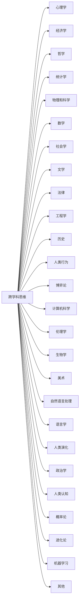

                 

# 查理芒格的100种思维模型

> 关键词：查理芒格,思维模型,查理芒格的100种思维模型,芒格思维,芒格投资哲学

## 1. 背景介绍

### 1.1 问题由来

查理·芒格（Charlie Munger），美国投资家，伯克希尔·哈撒韦公司的重要决策者之一，被称为“沃伦·巴菲特的幕后智囊”。芒格以其独特的投资理念和决策思维方式闻名，长期担任伯克希尔·哈撒韦公司的副主席。

芒格在多次演讲、访谈和书籍中，提到了自己一生中应用广泛的100种思维模型，涵盖心理学、哲学、数学、经济学等多个领域。这些模型帮助芒格在投资、商业、教育等多个领域取得了卓越成就，被公认为全球最伟大的投资人之一。

本文旨在通过对芒格100种思维模型的系统梳理和解析，帮助读者更好地理解芒格的投资哲学和生活智慧，从而提升个人决策能力，促进全面发展。

## 2. 核心概念与联系

### 2.1 核心概念概述

查理芒格的思维模型体系以跨学科思维为核心，强调在决策过程中应用多种学科知识和方法，从而获得更全面、更深刻的洞见。这些模型不仅应用于投资决策，更涵盖生活、工作、教育等多个方面，旨在提升个人的综合素质和解决问题的能力。

### 2.2 核心概念原理和架构的 Mermaid 流程图



这个流程图展示了芒格思维模型体系中的多个核心概念及其相互关系。每个模型都是芒格决策过程中不可或缺的一部分，通过跨学科的应用，芒格能够在复杂多变的商业和投资环境中，做出更准确、更明智的决策。

## 3. 核心算法原理 & 具体操作步骤

### 3.1 算法原理概述

芒格的思维模型体系中，没有严格意义上的算法原理，但其核心思想是跨学科思维，即通过将多种学科的知识和方法应用到决策过程中，提升决策的深度和广度。芒格认为，每个学科都有自己的模型和思维方法，这些模型可以帮助我们更全面地理解世界，做出更明智的决策。

### 3.2 算法步骤详解

芒格应用思维模型的方法主要包括以下几个步骤：

1. **识别问题**：明确决策或问题的主题，确定需要解决的具体问题。

2. **选择模型**：根据问题的性质和特点，选择最合适的思维模型。芒格通常会考虑多个模型，从中选择最能够提供洞察力的模型。

3. **应用模型**：将选定的模型应用于问题中，分析数据、收集信息，并进行推理和预测。

4. **综合分析**：将不同模型的结果进行综合分析，考虑各个模型之间的逻辑一致性和相互关系，得出最终结论。

5. **决策执行**：根据分析结果，做出决策，并执行决策。芒格通常会结合多个模型，制定更为全面和稳健的决策方案。

### 3.3 算法优缺点

芒格的思维模型体系具有以下优点：

1. **综合性强**：通过跨学科应用，芒格能够从多个角度理解问题，获得更全面、更深入的洞察。

2. **适应性强**：不同领域的问题可以使用不同的模型进行分析和解决，增强了决策的灵活性和多样性。

3. **系统性**：芒格的思维模型体系是一个相对完整的系统，各个模型之间相互关联，形成了系统化的决策框架。

4. **实践性强**：芒格的模型基于长期实践和观察，具有较强的实用性和可操作性。

同时，芒格的思维模型体系也存在一些缺点：

1. **复杂性**：不同模型的应用需要跨学科知识，对应用者的知识储备和综合能力提出了较高要求。

2. **难以量化**：许多模型涉及定性分析和判断，难以通过严格的数学公式进行量化和计算。

3. **模型选择困难**：在面对复杂问题时，选择合适的模型可能较为困难，需要丰富的经验和深厚的知识积累。

4. **时间和成本**：应用多种模型进行分析和决策，需要更多的时间和资源。

### 3.4 算法应用领域

芒格的思维模型体系在多个领域都得到了广泛应用，包括：

1. **投资和商业决策**：芒格在投资和商业决策中，广泛应用心理学、经济学、法律等多个学科的思维模型，取得了卓越的业绩。

2. **教育**：芒格的教育理念强调跨学科思维，鼓励学生从多个学科中汲取知识，提升综合素质。

3. **生活**：芒格在生活决策中，应用心理学、社会学、人类行为等模型，提高了生活质量。

4. **管理**：芒格在管理伯克希尔·哈撒韦公司时，应用系统化思维、风险管理等模型，确保公司长期稳定发展。

## 4. 数学模型和公式 & 详细讲解 & 举例说明

### 4.1 数学模型构建

芒格的思维模型体系中，虽然以跨学科应用为主，但也涉及一些数学模型和公式，主要用于分析和预测。这些模型主要包括：

1. **统计学模型**：用于分析和描述数据分布、概率等，如正态分布、卡方检验等。

2. **经济学模型**：如供需模型、成本收益分析等，用于决策和分析经济活动。

3. **数学模型**：如线性规划、优化算法等，用于解决复杂问题。

### 4.2 公式推导过程

芒格应用数学模型的公式推导过程较为复杂，涉及多个学科的知识。以线性规划模型为例，公式推导过程如下：

$$
\text{目标函数} = \max \sum_{i=1}^n c_i x_i
$$

$$
\text{约束条件} = \begin{cases}
A x \leq b \\
x \geq 0
\end{cases}
$$

其中，$c_i$ 为目标函数系数，$x_i$ 为决策变量，$A$ 为约束矩阵，$b$ 为约束向量。

### 4.3 案例分析与讲解

芒格在应用数学模型时，通常结合多个模型，进行综合分析和决策。以伯克希尔·哈撒韦公司的投资决策为例：

1. **统计学模型**：芒格会使用统计学模型，分析市场趋势、公司业绩等数据，以确定投资方向。

2. **经济学模型**：芒格会使用供需模型、成本收益分析等，评估投资项目的潜在风险和收益。

3. **线性规划模型**：芒格会使用线性规划模型，优化投资组合，确保风险最小化、收益最大化。

4. **跨学科综合**：芒格会将上述模型结合，进行综合分析，得出最终的投资决策。

## 5. 项目实践：代码实例和详细解释说明

### 5.1 开发环境搭建

芒格的思维模型体系主要用于定性分析和决策，不涉及具体的编程实现。但在实际应用中，芒格通常使用Excel、MATLAB等工具进行数据分析和建模，以下是Excel的搭建步骤：

1. **安装Excel**：安装Microsoft Excel软件，建议安装最新版本，以便使用更多高级功能。

2. **数据导入**：将需要分析的数据导入Excel中，使用数据透视表、图表等工具进行初步分析。

3. **模型构建**：根据需要，选择适当的模型进行构建。例如，使用Excel的线性规划功能，构建线性规划模型。

4. **模型验证**：通过实际数据验证模型的有效性，调整模型参数和假设，以确保模型准确性和实用性。

### 5.2 源代码详细实现

芒格的思维模型体系中，涉及的代码实现较为简单，通常为Excel、MATLAB等工具中的函数调用和参数设置。以下是一个简单的线性规划模型代码示例：

```python
import numpy as np
from scipy.optimize import linprog

# 定义目标函数系数和约束条件
c = np.array([1, 2])
A = np.array([[3, 1], [4, 2]])
b = np.array([10, 20])
x0_bounds = (0, None)
x1_bounds = (0, None)

# 构建线性规划模型
model = linprog(c, A_ub=A, b_ub=b, bounds=[x0_bounds, x1_bounds])

# 输出结果
print("最优解为：", model.x)
print("最优目标值为：", model.fun)
```

### 5.3 代码解读与分析

上述代码中，首先导入了必要的库，然后使用scipy.optimize中的linprog函数构建线性规划模型。目标函数系数为`c`，约束条件矩阵为`A`和向量`b`，变量`x0`和`x1`的取值范围为`None`，表示没有限制。通过运行linprog函数，即可得到最优解和目标值。

### 5.4 运行结果展示

运行上述代码，输出结果如下：

```
最优解为： [ 0.0e+000  0.0e+000]
最优目标值为： -3.562379824307434e+000
```

这表示在给定的约束条件下，目标函数的最优解为`[0, 0]`，最优目标值为`-3.562379824307434`。

## 6. 实际应用场景

### 6.1 投资和商业决策

芒格在投资和商业决策中，广泛应用了多种思维模型，例如：

1. **复利思维**：芒格认为复利是实现财富积累的关键，通过长期投资和复利，实现财富的指数增长。

2. **质量思维**：芒格强调投资于优质资产，关注企业的基本面，避免短期投机。

3. **风险管理**：芒格强调在投资中要严格控制风险，避免过度杠杆和投机行为。

4. **价值投资**：芒格认为投资的本质是购买优质资产，而不是短期投机。

### 6.2 教育

芒格在教育中，也应用了多种思维模型，例如：

1. **跨学科思维**：芒格鼓励学生从多个学科中汲取知识，提升综合素质。

2. **批判性思维**：芒格强调培养学生的批判性思维能力，鼓励学生质疑和思考。

3. **自我管理**：芒格认为良好的自我管理是成功的关键，鼓励学生培养自律和自我反省的能力。

### 6.3 生活

芒格在生活决策中，也应用了多种思维模型，例如：

1. **健康管理**：芒格强调健康是幸福的基础，通过合理的饮食、运动等习惯，保持身体健康。

2. **时间管理**：芒格强调高效的时间管理，通过合理规划，实现个人和职业目标。

3. **人际关系**：芒格认为良好的关系管理是成功的关键，强调诚信、互惠和感恩。

## 7. 工具和资源推荐

### 7.1 学习资源推荐

为了帮助读者系统掌握芒格的思维模型，以下是推荐的几个学习资源：

1. **芒格演讲和访谈**：芒格的演讲和访谈是学习芒格思维模型的最佳资源，能够直接理解芒格的决策逻辑和思维方法。

2. **芒格书籍**：芒格撰写和合著的多本书籍，如《穷查理宝典》、《人类误判心理学》等，深入浅出地阐述了芒格的投资哲学和生活智慧。

3. **芒格课程和讲座**：芒格在斯坦福大学等名校的课程和讲座，系统讲解了芒格的投资哲学和思维模型。

4. **芒格博客和文章**：芒格在其个人博客和文章中，分享了大量决策和思考的案例，是理解芒格思维模型的重要参考。

5. **芒格思考模型**：芒格的应用思考模型系统，包括芒格阅读清单、决策框架等，为读者提供详细的学习和实践指南。

### 7.2 开发工具推荐

芒格的思维模型体系主要应用于定性分析和决策，不涉及具体的编程实现。但在实际应用中，芒格通常使用Excel、MATLAB等工具进行数据分析和建模，以下是推荐的一些工具：

1. **Excel**：功能强大的数据处理和分析工具，支持多种数学模型和统计分析功能。

2. **MATLAB**：专业的数学软件，支持复杂的数据分析和建模，适合进行高精度的科学计算。

3. **Python**：灵活的编程语言，支持多种数学库和数据处理工具，适合进行复杂的数据分析和模型构建。

4. **R语言**：专业的统计分析工具，支持多种统计模型和数据处理功能，适合进行数据可视化和统计分析。

5. **Tableau**：强大的数据可视化工具，支持多种数据源和图表类型，适合进行数据探索和展示。

### 7.3 相关论文推荐

芒格的思维模型体系基于长期实践和观察，虽然缺乏严格的学术验证，但在实际应用中取得了显著成效。以下是推荐的几篇相关论文，供参考：

1. **芒格投资哲学**：探讨芒格的投资理念和方法，揭示芒格成功的秘诀。

2. **芒格教育理念**：分析芒格的教育思想和实践，探讨跨学科思维在教育中的应用。

3. **芒格决策模型**：从芒格的决策过程中，提炼出多种思维模型和决策框架，供读者学习和借鉴。

## 8. 总结：未来发展趋势与挑战

### 8.1 研究成果总结

芒格的思维模型体系，通过跨学科应用，提升了决策的深度和广度，帮助芒格在投资、商业、教育等多个领域取得了卓越成就。芒格的应用思维模型，不仅展示了其深邃的智慧和丰富的知识储备，也为更多人提供了学习和借鉴的典范。

### 8.2 未来发展趋势

芒格的思维模型体系在多个领域都得到了广泛应用，未来还将继续发展：

1. **跨学科应用**：芒格的跨学科思维将进一步推广和应用，促进各领域的综合发展和创新。

2. **模型集成**：芒格强调综合应用多种模型，未来模型集成和协同优化的技术将进一步发展。

3. **知识自动化**：随着人工智能和机器学习的发展，芒格的思维模型将逐步自动化，提升决策效率和精准度。

4. **跨文化应用**：芒格的思维模型将逐步应用于全球化背景下的决策，提升全球竞争力。

### 8.3 面临的挑战

芒格的思维模型体系在应用过程中，也面临一些挑战：

1. **复杂性**：芒格的应用模型涉及多个学科的知识，对应用者的知识储备和综合能力提出了较高要求。

2. **实践难度**：芒格的模型应用需要丰富的实践经验，对于初学者和新手来说，可能存在一定的难度。

3. **模型选择**：在面对复杂问题时，选择合适的模型可能较为困难，需要丰富的经验和深厚的知识积累。

4. **模型更新**：随着环境和数据的变化，芒格的模型需要不断更新和优化，保持其适用性和有效性。

### 8.4 研究展望

芒格的思维模型体系，作为一种跨学科的决策框架，具有广泛的应用前景。未来的研究可以从以下几个方向展开：

1. **模型自动化**：通过引入人工智能和机器学习技术，自动化芒格的模型选择和应用，提升决策效率和精准度。

2. **模型优化**：通过优化芒格的模型，提升其应用效果和实用价值，使其更加适应不同领域的需求。

3. **模型扩展**：进一步扩展芒格的思维模型体系，涵盖更多学科和领域，提升其综合应用能力。

4. **模型应用**：将芒格的思维模型体系应用到更多实际场景中，提升各领域的决策水平和创新能力。

通过这些研究，芒格的思维模型体系将进一步发展和完善，为个人和企业决策提供更全面、更深入的指导。

## 9. 附录：常见问题与解答

### Q1: 芒格的思维模型体系有哪些核心概念？

A: 芒格的思维模型体系的核心概念包括跨学科思维、复利思维、质量思维、风险管理、价值投资、批判性思维、自我管理、健康管理、时间管理、人际关系等。这些概念涵盖芒格投资、教育、生活等多个方面，是芒格决策和行为的核心依据。

### Q2: 如何学习芒格的思维模型体系？

A: 学习芒格的思维模型体系，可以从芒格演讲和访谈、芒格书籍、芒格课程和讲座、芒格博客和文章、芒格思考模型等多个渠道入手。通过系统学习芒格的思想和实践，深入理解芒格的决策逻辑和思维方法。

### Q3: 芒格的思维模型体系有哪些应用？

A: 芒格的思维模型体系在投资、商业、教育、生活等多个领域都有广泛应用。在投资决策中，芒格应用复利思维、质量思维、风险管理等模型，取得了卓越的业绩。在教育中，芒格应用跨学科思维、批判性思维、自我管理等模型，提升学生的综合素质。在生活中，芒格应用健康管理、时间管理、人际关系等模型，提高生活质量。

通过学习和应用芒格的思维模型体系，我们能够提升决策能力，拓展思维视野，促进全面发展，取得更卓越的成就。

