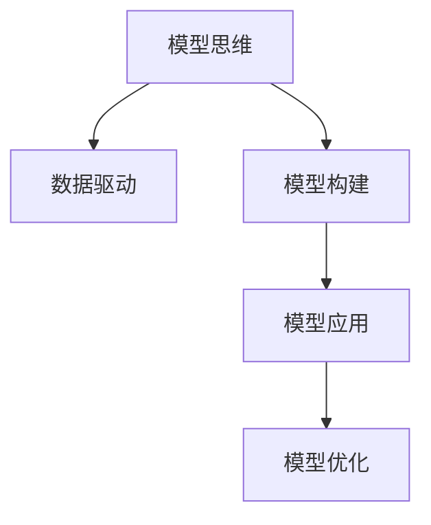

                 

# 模型思维与管理效率的优化

> 关键词：模型思维,管理效率,优化方法,数据分析,决策支持,人工智能,算法实践

## 1. 背景介绍

### 1.1 问题由来

在当今快速变化的商业环境中，管理效率的提升成为企业持续增长的关键。然而，传统管理模式往往面临决策过程复杂、信息孤岛严重、业务流程冗余等问题。如何在数据驱动的环境中，迅速获取洞察、优化流程、提升决策效率，成为了现代企业面临的重大挑战。模型思维作为一种以数据驱动决策的管理方法，近年来逐渐被企业重视。通过构建、应用和优化各类模型，可以帮助企业更好地应对复杂多变的商业环境，实现持续高效的运营。

### 1.2 问题核心关键点

模型思维的本质是利用数据分析和算法优化，以模型为工具，辅助企业进行数据驱动的决策和管理。其核心关键点包括：

- **数据驱动**：通过系统性采集和分析企业内外部数据，发现数据背后的业务模式和关联关系，为决策提供科学依据。
- **模型构建**：根据业务需求和数据特征，选择合适的算法和工具，构建高效的模型结构，确保模型输出的准确性和实用性。
- **模型应用**：将构建好的模型嵌入企业现有的信息系统，实现对业务流程和决策的自动化支持，提升管理效率。
- **模型优化**：通过持续的数据输入和反馈，优化模型参数，保持模型在动态环境下的有效性。

## 2. 核心概念与联系

### 2.1 核心概念概述

为更好地理解模型思维和管理效率的优化，本节将介绍几个密切相关的核心概念：

- **模型思维**：基于数据和算法，构建模型来辅助决策和管理的一种思维方式。模型思维强调利用数据驱动决策，以提高决策的科学性和效率。

- **管理效率**：衡量企业管理过程中资源配置、流程设计、决策制定等方面的效率和效果。高效的管理不仅能提升企业竞争力，还能提高员工的满意度和工作的质量。

- **数据驱动**：以数据为决策依据，减少主观判断和经验依赖，通过系统分析得出更加客观和精准的决策。

- **模型构建**：选择合适的算法和工具，构建符合业务需求的模型，确保模型的准确性和可靠性。

- **模型应用**：将模型嵌入企业的管理系统中，自动执行或辅助决策，实现数据驱动的自动化管理。

- **模型优化**：通过持续的数据输入和反馈，不断调整模型参数和结构，保持模型的有效性和适应性。

这些核心概念之间的逻辑关系可以通过以下Mermaid流程图来展示：



这个流程图展示了这个系统的工作流程：

1. 根据数据需求，构建模型。
2. 将模型应用于管理流程中，实现自动化决策。
3. 持续优化模型，提高其适应性和有效性。

## 3. 核心算法原理 & 具体操作步骤
### 3.1 算法原理概述

模型思维和管理效率的优化，本质上是通过构建、应用和优化模型，辅助企业实现更高效、更科学的管理。其核心算法原理主要包括：

- **数据采集与预处理**：通过各种数据采集手段，收集企业内外部数据，并对数据进行清洗、归一化等预处理，确保数据的准确性和完整性。
- **模型选择与构建**：根据业务需求，选择合适的算法和工具，构建高效、准确的模型。常见的算法包括回归分析、分类、聚类、推荐系统等。
- **模型评估与验证**：通过交叉验证、测试集验证等手段，评估模型的性能，确保模型的泛化能力和准确性。
- **模型集成与应用**：将构建好的模型嵌入企业的管理系统中，实现对业务流程的自动化辅助，提升管理效率。
- **模型持续优化**：通过持续的数据输入和反馈，不断优化模型参数和结构，提高模型的实时性和准确性。

### 3.2 算法步骤详解

以下是模型思维和管理效率优化的一般步骤：

**Step 1: 数据采集与预处理**

- 收集企业内外部数据，包括销售记录、客户反馈、生产数据、供应链信息等。
- 对数据进行清洗和预处理，去除噪声和异常值，进行归一化和特征工程。
- 使用数据仓库技术（如Hadoop、Spark）进行大规模数据存储和处理。

**Step 2: 模型选择与构建**

- 根据业务需求，选择合适的算法和工具。如回归分析、决策树、随机森林、深度学习等。
- 构建模型，包括特征选择、模型训练、参数调整等步骤。
- 使用开源工具（如Scikit-learn、TensorFlow、Keras等）进行模型构建。

**Step 3: 模型评估与验证**

- 使用交叉验证和测试集验证等手段，评估模型的性能。
- 通过AUC、RMSE、F1-score等指标，衡量模型的准确性和泛化能力。
- 进行模型调参，选择最优的模型参数。

**Step 4: 模型集成与应用**

- 将构建好的模型嵌入企业的管理系统中。
- 实现自动化决策功能，如销售预测、客户细分、库存管理等。
- 使用微服务架构和容器化技术（如Docker、Kubernetes）进行模型的部署和管理。

**Step 5: 模型持续优化**

- 持续收集新的数据，进行模型的实时更新和优化。
- 使用增量学习技术，实时调整模型参数，保持模型适应动态环境的能力。
- 建立监控机制，实时评估模型性能，及时发现并解决模型退化问题。

### 3.3 算法优缺点

模型思维和管理效率优化方法具有以下优点：

- **高效决策**：模型思维通过数据驱动决策，能够快速准确地发现业务问题，提供科学合理的决策依据。
- **自动化管理**：模型可以自动执行决策任务，减少人工干预，提高管理效率和质量。
- **持续优化**：模型在动态环境中持续学习，不断优化，保持决策的实时性和准确性。

然而，该方法也存在一些局限性：

- **数据依赖**：模型效果依赖于数据的完整性和质量，数据缺失或噪声较多时，模型性能会受到影响。
- **复杂性**：模型构建和调优过程复杂，需要一定的技术背景和资源投入。
- **模型过拟合**：模型可能过拟合于训练数据，导致泛化能力下降。

## 4. 数学模型和公式 & 详细讲解 & 举例说明（备注：数学公式请使用latex格式，latex嵌入文中独立段落使用 $$，段落内使用 $)
### 4.1 数学模型构建

本节将使用数学语言对模型思维和管理效率的优化过程进行更加严格的刻画。

假设企业有 $N$ 条销售记录 $D=\{(x_i,y_i)\}_{i=1}^N$，其中 $x_i$ 表示时间、促销活动、竞争对手等特征，$y_i$ 表示销售额。我们的目标是构建一个回归模型来预测未来的销售量。

首先，进行数据预处理，包括特征选择和归一化。假设经过预处理后，特征空间为 $\mathcal{X}$，输出空间为 $\mathcal{Y}$。定义回归模型的损失函数为均方误差（Mean Squared Error, MSE）：

$$
L(y,\hat{y}) = \frac{1}{N} \sum_{i=1}^N (y_i - \hat{y}_i)^2
$$

其中，$\hat{y}_i$ 为模型对第 $i$ 条记录的预测值。构建回归模型，目标是最小化损失函数：

$$
\theta^* = \mathop{\arg\min}_{\theta} \frac{1}{N} \sum_{i=1}^N (y_i - \hat{y}_i)^2
$$

其中，$\theta$ 为模型参数，可以是线性回归模型、多项式回归模型、决策树模型等。

### 4.2 公式推导过程

以线性回归模型为例，推导最小二乘法的参数更新公式。

假设线性回归模型的形式为：

$$
\hat{y}_i = \theta_0 + \sum_{j=1}^p \theta_j x_{ij}
$$

其中，$\theta_0$ 为截距，$\theta_j$ 为第 $j$ 个特征的权重。最小二乘法的目标是最小化损失函数：

$$
L(y,\hat{y}) = \frac{1}{N} \sum_{i=1}^N (y_i - \hat{y}_i)^2
$$

对 $\theta$ 求导，得：

$$
\frac{\partial L(y,\hat{y})}{\partial \theta_k} = \frac{2}{N} \sum_{i=1}^N (y_i - \hat{y}_i)x_{ik}
$$

根据梯度下降算法，参数更新公式为：

$$
\theta_k \leftarrow \theta_k - \eta \frac{\partial L(y,\hat{y})}{\partial \theta_k}
$$

其中，$\eta$ 为学习率。

### 4.3 案例分析与讲解

以某电商平台的销售预测为例，分析如何利用模型思维提升管理效率。

假设电商平台有大量历史销售数据，包括时间、促销活动、广告投入、用户行为等特征。通过构建线性回归模型，预测未来销售量，用于库存管理、广告投放、促销策略优化等决策支持。

1. **数据采集**：从电商平台的数据库中提取历史销售记录，包括时间、促销活动、广告投入、用户行为等特征。
2. **数据预处理**：对数据进行清洗、归一化和特征工程，去除噪声和异常值，进行特征选择和处理。
3. **模型构建**：使用线性回归模型，选择时间、促销活动、广告投入等特征，进行模型训练和参数调整。
4. **模型评估**：使用交叉验证和测试集验证，评估模型性能，选择最优模型参数。
5. **模型应用**：将模型嵌入库存管理系统，自动预测未来销售量，辅助库存管理决策。
6. **模型优化**：持续收集新的销售数据，进行模型实时更新和优化，保持预测的实时性和准确性。

通过模型思维，电商平台实现了更科学、更高效的库存管理，提升了用户满意度和销售效率。

## 5. 项目实践：代码实例和详细解释说明
### 5.1 开发环境搭建

在进行模型思维和管理效率优化实践前，我们需要准备好开发环境。以下是使用Python进行Pandas、Scikit-learn、TensorFlow等工具开发的环境配置流程：

1. 安装Anaconda：从官网下载并安装Anaconda，用于创建独立的Python环境。

2. 创建并激活虚拟环境：
```bash
conda create -n model-env python=3.8 
conda activate model-env
```

3. 安装依赖包：
```bash
pip install pandas scikit-learn tensorflow matplotlib
```

4. 安装各类工具包：
```bash
pip install numpy jupyter notebook ipython
```

完成上述步骤后，即可在`model-env`环境中开始模型构建实践。

### 5.2 源代码详细实现

这里以线性回归模型为例，给出使用Pandas、Scikit-learn等工具进行数据预处理和模型构建的PyTorch代码实现。

首先，导入必要的库和数据集：

```python
import pandas as pd
from sklearn.model_selection import train_test_split
from sklearn.linear_model import LinearRegression
from sklearn.metrics import mean_squared_error

# 读取数据集
data = pd.read_csv('sales_data.csv')
```

接着，进行数据预处理：

```python
# 选择特征和目标变量
X = data[['time', 'campaign', 'ad_spending']]
y = data['sales']

# 数据归一化
from sklearn.preprocessing import StandardScaler
scaler = StandardScaler()
X = scaler.fit_transform(X)

# 数据切分
X_train, X_test, y_train, y_test = train_test_split(X, y, test_size=0.2, random_state=42)
```

然后，构建和训练模型：

```python
# 构建线性回归模型
model = LinearRegression()

# 训练模型
model.fit(X_train, y_train)

# 预测和评估
y_pred = model.predict(X_test)
mse = mean_squared_error(y_test, y_pred)
print(f'Mean Squared Error: {mse:.4f}')
```

最后，评估模型效果并输出结果：

```python
# 评估模型效果
mse = mean_squared_error(y_test, y_pred)
print(f'Mean Squared Error: {mse:.4f}')
```

以上就是使用Python进行线性回归模型构建和评估的完整代码实现。可以看到，使用Pandas和Scikit-learn可以高效地进行数据预处理和模型构建，显著提升了模型的构建效率。

### 5.3 代码解读与分析

让我们再详细解读一下关键代码的实现细节：

**数据预处理**：
- `pd.read_csv('sales_data.csv')`：读取销售数据集。
- `X = data[['time', 'campaign', 'ad_spending']]`：选择时间、促销活动、广告投入等特征。
- `y = data['sales']`：选择销售量作为目标变量。
- `scaler = StandardScaler()`：创建归一化器。
- `X = scaler.fit_transform(X)`：对特征进行归一化处理。
- `X_train, X_test, y_train, y_test = train_test_split(X, y, test_size=0.2, random_state=42)`：将数据切分为训练集和测试集。

**模型构建**：
- `model = LinearRegression()`：创建线性回归模型。
- `model.fit(X_train, y_train)`：训练模型。
- `y_pred = model.predict(X_test)`：使用模型进行预测。

**模型评估**：
- `mse = mean_squared_error(y_test, y_pred)`：计算均方误差。
- `print(f'Mean Squared Error: {mse:.4f}')`：输出模型评估结果。

可以看到，通过Python和Scikit-learn，我们可以快速构建、训练和评估线性回归模型，处理业务问题。这些工具大大降低了模型构建的难度，提升了开发效率。

## 6. 实际应用场景
### 6.1 电商平台的库存管理

电商平台通过构建销售预测模型，可以实现更科学的库存管理，避免过度或不足的库存问题，减少缺货和积压。具体步骤如下：

1. **数据采集**：从电商平台的销售记录中提取时间、促销活动、广告投入等特征。
2. **数据预处理**：对数据进行清洗、归一化和特征工程。
3. **模型构建**：使用线性回归模型，选择时间、促销活动、广告投入等特征，进行模型训练和参数调整。
4. **模型评估**：使用交叉验证和测试集验证，评估模型性能，选择最优模型参数。
5. **模型应用**：将模型嵌入库存管理系统，自动预测未来销售量，辅助库存管理决策。
6. **模型优化**：持续收集新的销售数据，进行模型实时更新和优化，保持预测的实时性和准确性。

通过模型思维，电商平台实现了更科学、更高效的库存管理，提升了用户满意度和销售效率。

### 6.2 医疗机构的疾病预测

医疗机构通过构建疾病预测模型，可以更准确地预测疾病发病概率，提前预防和干预，降低医疗成本。具体步骤如下：

1. **数据采集**：从医疗机构的电子病历、体检记录中提取患者年龄、性别、生活习惯等特征。
2. **数据预处理**：对数据进行清洗、归一化和特征工程，去除噪声和异常值。
3. **模型构建**：使用逻辑回归模型，选择年龄、性别、生活习惯等特征，进行模型训练和参数调整。
4. **模型评估**：使用交叉验证和测试集验证，评估模型性能，选择最优模型参数。
5. **模型应用**：将模型嵌入医疗管理系统，自动预测疾病发病概率，辅助医生进行预防和干预。
6. **模型优化**：持续收集新的患者数据，进行模型实时更新和优化，保持预测的实时性和准确性。

通过模型思维，医疗机构实现了更科学、更高效的疾病预测，降低了医疗成本，提升了患者健康水平。

### 6.3 金融机构的信用评估

金融机构通过构建信用评估模型，可以更准确地预测客户的信用风险，降低贷款违约率。具体步骤如下：

1. **数据采集**：从金融机构的客户信息、贷款记录中提取客户年龄、收入、负债等特征。
2. **数据预处理**：对数据进行清洗、归一化和特征工程，去除噪声和异常值。
3. **模型构建**：使用随机森林模型，选择客户年龄、收入、负债等特征，进行模型训练和参数调整。
4. **模型评估**：使用交叉验证和测试集验证，评估模型性能，选择最优模型参数。
5. **模型应用**：将模型嵌入信用评估系统，自动预测客户信用风险，辅助贷款审批决策。
6. **模型优化**：持续收集新的客户数据，进行模型实时更新和优化，保持预测的实时性和准确性。

通过模型思维，金融机构实现了更科学、更高效的信用评估，降低了贷款违约率，提升了资产质量。

### 6.4 未来应用展望

随着模型思维的深入应用，未来将有以下发展趋势：

1. **数据驱动决策**：模型思维将成为企业决策的基础，通过系统性地采集和分析数据，发现数据背后的业务模式和关联关系，提供科学合理的决策依据。
2. **自动化管理**：模型思维将实现更自动化、更智能的管理流程，减少人工干预，提高管理效率和质量。
3. **实时优化**：模型将在动态环境中持续学习，不断优化，保持决策的实时性和准确性。
4. **跨领域应用**：模型思维将被广泛应用于金融、医疗、电商等多个领域，推动各行各业的智能化升级。
5. **人工智能融合**：模型思维将与人工智能技术深度融合，实现更全面、更深入的业务理解和优化。

## 7. 工具和资源推荐
### 7.1 学习资源推荐

为了帮助开发者系统掌握模型思维和管理效率优化的理论基础和实践技巧，这里推荐一些优质的学习资源：

1. 《数据分析与机器学习》系列博文：由数据分析专家撰写，涵盖数据分析、模型构建、模型评估等核心知识点，适合初学者入门。

2. 《Python数据科学手册》书籍：深入介绍Python在数据科学中的应用，包括数据处理、模型构建、可视化等，是数据科学入门的必备资料。

3. Coursera《机器学习》课程：由斯坦福大学开设的经典课程，系统讲解机器学习理论和算法，适合有一定基础的学习者。

4 Kaggle Kernels：Kaggle提供的Python代码库，包含大量开源数据集和模型代码，适合实践和创新。

5 《深度学习》系列论文：研究深度学习模型的论文合集，涵盖多个领域的深度学习应用，适合进阶学习。

通过对这些资源的学习实践，相信你一定能够快速掌握模型思维和管理效率优化的精髓，并用于解决实际的业务问题。

### 7.2 开发工具推荐

高效的开发离不开优秀的工具支持。以下是几款用于模型思维和管理效率优化开发的常用工具：

1. Jupyter Notebook：交互式Python环境，适合代码调试、数据可视化、模型构建等。

2. Pandas：Python的数据处理库，适合进行数据清洗、归一化、特征工程等预处理工作。

3. Scikit-learn：Python的机器学习库，适合构建多种算法模型，包括回归、分类、聚类等。

4. TensorFlow：谷歌主导的深度学习框架，适合构建和训练大规模神经网络模型。

5. PyTorch：Facebook开源的深度学习框架，适合快速迭代和实验新模型。

6. GitHub：代码托管平台，适合代码共享、协作和项目管理。

合理利用这些工具，可以显著提升模型构建和优化的效率，加快创新迭代的步伐。

### 7.3 相关论文推荐

模型思维和管理效率优化的研究源于学界的持续研究。以下是几篇奠基性的相关论文，推荐阅读：

1. 《大规模数据驱动的业务洞察》论文：研究如何通过数据驱动决策，提升企业运营效率。

2. 《基于机器学习的金融风险管理》论文：探讨机器学习在金融风险评估和管理中的应用。

3. 《医疗领域中的数据分析与模型构建》论文：研究如何利用数据分析和模型预测，提升医疗决策的准确性和效率。

4. 《智能制造中的机器学习应用》论文：探讨机器学习在智能制造中的具体应用和效果。

这些论文代表了大模型思维和管理效率优化的发展脉络。通过学习这些前沿成果，可以帮助研究者把握学科前进方向，激发更多的创新灵感。

## 8. 总结：未来发展趋势与挑战
### 8.1 总结

本文对模型思维与管理效率的优化方法进行了全面系统的介绍。首先阐述了模型思维在数据驱动决策和管理中的应用价值，明确了模型思维在提升管理效率、优化业务流程等方面的独特作用。其次，从原理到实践，详细讲解了模型思维的构建、应用和优化过程，给出了模型构建任务开发的完整代码实例。同时，本文还广泛探讨了模型思维在电商、医疗、金融等多个行业领域的应用前景，展示了模型思维的巨大潜力。此外，本文精选了模型思维相关的学习资源，力求为读者提供全方位的技术指引。

通过本文的系统梳理，可以看到，模型思维已经成为企业提升管理效率的重要工具，极大地拓展了数据驱动决策的应用范围，为企业管理带来了深刻变革。未来，伴随模型构建技术的不断演进，模型思维必将在更多领域得到应用，推动企业持续向数字化、智能化方向迈进。

### 8.2 未来发展趋势

展望未来，模型思维和管理效率优化技术将呈现以下几个发展趋势：

1. **数据驱动决策**：模型思维将成为企业决策的基础，通过系统性地采集和分析数据，发现数据背后的业务模式和关联关系，提供科学合理的决策依据。
2. **自动化管理**：模型思维将实现更自动化、更智能的管理流程，减少人工干预，提高管理效率和质量。
3. **实时优化**：模型将在动态环境中持续学习，不断优化，保持决策的实时性和准确性。
4. **跨领域应用**：模型思维将被广泛应用于金融、医疗、电商等多个领域，推动各行各业的智能化升级。
5. **人工智能融合**：模型思维将与人工智能技术深度融合，实现更全面、更深入的业务理解和优化。

以上趋势凸显了模型思维在管理效率优化中的广泛应用前景。这些方向的探索发展，必将进一步提升企业的决策科学性和管理效率，推动企业在快速变化的市场环境中持续成长。

### 8.3 面临的挑战

尽管模型思维在提升管理效率方面取得了显著成效，但在迈向更加智能化、普适化应用的过程中，它仍面临诸多挑战：

1. **数据质量问题**：数据缺失、噪声、不完整等问题，容易导致模型性能下降。如何获取高质量数据，提升数据质量，将是重要挑战。
2. **模型复杂性**：构建和优化复杂模型，需要较高的技术背景和资源投入。如何降低模型复杂性，简化模型构建过程，还需进一步探索。
3. **模型解释性**：模型黑盒特性，难以解释其内部工作机制和决策逻辑。如何提高模型可解释性，增强决策透明度，将是关键难题。
4. **模型鲁棒性**：模型可能在不同数据分布上表现不一致，如何提高模型鲁棒性，增强泛化能力，需要更多的研究。
5. **隐私和安全**：模型使用过程中涉及大量敏感数据，如何保护数据隐私和安全，避免数据泄露和滥用，将是重要的安全问题。

## 9. 附录：常见问题与解答

**Q1：模型思维适用于所有业务场景吗？**

A: 模型思维适用于大多数业务场景，特别是数据量较大、业务流程复杂、决策需求高的领域。但对于一些简单业务场景，如手工操作、批量处理等，可能不适用于模型思维。因此需要根据具体情况进行选择。

**Q2：模型构建需要哪些步骤？**

A: 模型构建需要以下步骤：
1. 数据采集与预处理：收集和清洗数据，进行归一化、特征工程等预处理。
2. 模型选择与构建：选择合适的算法和工具，构建高效、准确的模型。
3. 模型评估与验证：使用交叉验证和测试集验证，评估模型性能，选择最优模型参数。
4. 模型集成与应用：将模型嵌入企业管理系统，实现自动化决策功能。
5. 模型持续优化：持续收集新的数据，进行模型实时更新和优化，保持模型有效性。

**Q3：如何选择合适的模型算法？**

A: 选择合适的模型算法需要考虑以下几个方面：
1. 业务需求：根据业务需求选择适合的模型算法，如回归、分类、聚类、推荐系统等。
2. 数据特征：根据数据特征选择合适的算法，如线性回归、决策树、随机森林、深度学习等。
3. 数据量大小：数据量较小，可以选择简单的算法，如线性回归、逻辑回归等；数据量较大，可以选择复杂的算法，如深度学习、随机森林等。
4. 计算资源：计算资源有限，可以选择参数较少的算法，如线性回归、逻辑回归等；计算资源充足，可以选择复杂的算法，如深度学习、随机森林等。

**Q4：模型评估和验证的常用方法有哪些？**

A: 常用的模型评估和验证方法包括：
1. 交叉验证：将数据切分为训练集和验证集，使用交叉验证评估模型性能。
2. 测试集验证：使用独立测试集验证模型泛化能力。
3. 混淆矩阵：评估分类模型的准确率、召回率、F1-score等指标。
4. 均方误差、AUC等：评估回归模型的性能。
5. ROC曲线：评估分类模型的鲁棒性。

这些方法可以帮助我们全面评估模型的性能，选择最优模型参数。

**Q5：模型优化需要注意哪些问题？**

A: 模型优化需要注意以下问题：
1. 数据质量：保证数据完整、准确，减少噪声和异常值。
2. 模型复杂性：简化模型结构，减少不必要的参数。
3. 模型鲁棒性：提升模型鲁棒性，增强泛化能力。
4. 模型可解释性：提高模型可解释性，增强决策透明度。
5. 模型安全：保护数据隐私和安全，避免数据泄露和滥用。

模型优化是一个持续的过程，需要不断调整和改进，才能保持模型的实时性和准确性。

通过本文的系统梳理，可以看到，模型思维已成为提升管理效率的重要手段，但其在应用过程中仍需注意数据质量、模型复杂性、模型鲁棒性、模型可解释性和数据隐私等问题。相信随着技术的不断发展，模型思维必将在更多领域得到应用，推动企业管理向智能化、自动化方向迈进。

