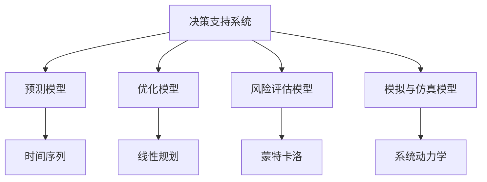

                 

# 模型思维在决策中的应用

> 关键词：决策支持系统, 机器学习, 模型选择, 模型融合, 不确定性分析, 决策树, 神经网络, 风险评估

## 1. 背景介绍

### 1.1 问题由来
在当今快速变化和高度复杂化的商业环境中，决策制定正变得越来越困难。从企业战略规划到日常运营管理，每个决策都可能关乎公司的成败。为了应对这一挑战，决策支持系统（DSS）应运而生。DSS利用数据分析和计算模型，为决策者提供科学、客观的辅助决策依据。

模型思维在DSS中的应用，是指通过建立数学或统计模型，对现实世界的问题进行模拟和预测，辅助决策者进行决策。模型思维不仅能够帮助决策者理解问题的本质，还能在复杂条件下提供高效、准确的解决方案。在实际应用中，模型思维主要通过以下几个方面来辅助决策：

1. **预测与规划**：通过建立预测模型，可以预估未来趋势，制定合理的战略规划。
2. **优化与调度**：利用优化模型，可以求解资源分配和任务调度的最优解。
3. **风险评估**：通过风险评估模型，可以识别潜在的风险点，采取防范措施。
4. **模拟与仿真**：通过仿真模型，可以在不承担真实损失的情况下，测试和优化决策方案。

模型思维的应用，使得决策过程更加科学、客观，从而减少了人为因素带来的偏差和失误，提升了决策的准确性和可靠性。

## 2. 核心概念与联系

### 2.1 核心概念概述

为了更好地理解模型思维在决策中的应用，本节将介绍几个密切相关的核心概念：

- **决策支持系统（DSS）**：一种利用信息技术辅助决策者进行决策的系统。通过分析数据、建立模型、模拟预测等方式，为决策者提供支持。
- **模型思维**：利用数学或统计模型，对现实世界问题进行分析和预测，辅助决策的过程。
- **预测模型**：用于预测未来趋势或结果的模型，如时间序列模型、回归模型等。
- **优化模型**：用于求解资源分配、任务调度等优化问题的模型，如线性规划、整数规划等。
- **风险评估模型**：用于识别和评估潜在风险的模型，如蒙特卡洛模拟、敏感性分析等。
- **模拟与仿真模型**：用于在虚拟环境中测试和优化决策方案的模型，如系统动力学模型、蒙特卡洛仿真等。

这些概念之间的逻辑关系可以通过以下Mermaid流程图来展示：



这个流程图展示了DSS中常见的模型类型及其相互关系：

1. DSS通过收集和分析数据，对预测、优化、风险评估和模拟与仿真模型进行构建和应用。
2. 预测模型能够帮助DSS预测未来趋势，如时间序列模型用于预测销售趋势，回归模型用于分析经济指标等。
3. 优化模型能够帮助DSS求解资源分配和任务调度的最优解，如线性规划用于优化供应链管理，整数规划用于优化调度排程等。
4. 风险评估模型能够帮助DSS识别和评估潜在风险，如蒙特卡洛模拟用于评估项目投资的风险，敏感性分析用于识别关键因素等。
5. 模拟与仿真模型能够帮助DSS在虚拟环境中测试和优化决策方案，如系统动力学用于模拟组织行为，蒙特卡洛仿真用于评估决策方案的风险等。

这些核心概念共同构成了DSS的工作原理和流程，使得模型思维在决策支持中发挥重要作用。

## 3. 核心算法原理 & 具体操作步骤
### 3.1 算法原理概述

模型思维在决策中的应用，主要通过以下几个步骤实现：

1. **问题建模**：将现实世界的问题抽象为数学或统计模型。
2. **数据收集**：收集相关的历史数据和环境数据，为模型提供数据支持。
3. **模型训练**：使用收集到的数据，训练模型参数，使其能够准确预测或优化决策结果。
4. **结果分析**：分析模型预测或优化的结果，为决策者提供参考依据。

### 3.2 算法步骤详解

以下详细讲解了模型思维在决策中应用的详细步骤：

**Step 1: 问题建模**
- 确定决策目标：明确需要解决的问题和目标，如预测市场需求、优化供应链等。
- 选择模型类型：根据问题特点选择合适的数学或统计模型，如回归模型、优化模型、风险评估模型等。
- 定义模型假设：确定模型的假设条件，如线性假设、独立性假设等。
- 确定模型参数：明确模型需要调整的参数，如回归模型的斜率和截距，优化模型的约束条件等。

**Step 2: 数据收集**
- 确定数据来源：收集与问题相关的历史数据和环境数据，如销售记录、供应链成本、市场趋势等。
- 数据清洗和预处理：对数据进行清洗和预处理，包括去除噪声、填补缺失值、标准化等。
- 特征选择和提取：选择对模型有用的特征，并进行特征提取和降维。

**Step 3: 模型训练**
- 模型训练和验证：使用历史数据对模型进行训练，并使用验证数据评估模型的性能。
- 超参数调优：调整模型超参数，如学习率、正则化系数等，以优化模型性能。
- 模型选择和比较：选择性能最佳的模型，并进行比较分析。

**Step 4: 结果分析**
- 结果预测和优化：利用训练好的模型进行预测或优化，并分析结果。
- 结果解释和报告：对预测或优化结果进行解释，并生成报告供决策者参考。
- 决策支持：根据预测或优化结果，辅助决策者进行决策，并调整决策策略。

### 3.3 算法优缺点

模型思维在决策中的应用，具有以下优点：

1. **客观性**：模型思维依赖于数据和算法，能够提供客观的决策依据，减少人为因素的干扰。
2. **效率高**：模型思维能够快速生成大量预测结果，辅助决策者快速做出决策。
3. **可重复性**：模型思维的过程和结果具有可重复性，可以多次应用并改进。
4. **灵活性**：模型思维可以应用于多种决策场景，如投资、运营、市场营销等。

同时，模型思维也存在一些缺点：

1. **数据依赖性**：模型思维的结果依赖于数据的准确性和完整性，数据质量问题可能导致模型预测不准确。
2. **假设限制性**：模型的预测结果受限于其假设条件，可能无法完全反映真实世界的复杂性。
3. **复杂性**：模型的构建和训练过程可能较为复杂，需要专业知识和技能。
4. **不确定性**：模型思维难以完全消除不确定性，预测结果可能存在误差。

尽管存在这些缺点，但就目前而言，模型思维在DSS中的应用仍是最主流的方法之一。未来相关研究的重点在于如何进一步提高模型的准确性和鲁棒性，降低对数据的依赖，同时兼顾模型的解释性和可操作性。

### 3.4 算法应用领域

模型思维在DSS中的应用，覆盖了多个领域，具体包括：

- **金融领域**：如投资组合优化、信用风险评估、市场趋势预测等。
- **制造业**：如供应链管理、生产调度、库存优化等。
- **医疗领域**：如疾病预测、治疗方案选择、医疗资源配置等。
- **物流领域**：如路线规划、车辆调度、仓库管理等。
- **市场营销**：如客户细分、广告投放、产品推荐等。
- **能源领域**：如电力需求预测、电网调度、能源分配等。

除了这些经典应用领域外，模型思维在更多领域中也能发挥重要作用，如城市管理、环境保护、农业生产等。随着技术的不断进步和应用场景的拓展，模型思维在决策支持中的应用将更加广泛和深入。

## 4. 数学模型和公式 & 详细讲解 & 举例说明

### 4.1 数学模型构建

在模型思维的应用中，常见的数学模型包括回归模型、优化模型、风险评估模型和模拟与仿真模型。以下是几个典型模型的数学构建方法：

- **线性回归模型**：
  \[
  y = \beta_0 + \beta_1x_1 + \beta_2x_2 + \ldots + \beta_nx_n + \epsilon
  \]
  其中，$y$ 为因变量，$x_i$ 为自变量，$\beta_i$ 为回归系数，$\epsilon$ 为误差项。

- **线性规划模型**：
  \[
  \min\sum_{i=1}^m c_ix_i
  \]
  \[
  \text{subject to} \quad A_{m\times n}x \leq b_m, \quad B_{p\times n}x = b_p
  \]
  其中，$x_i$ 为决策变量，$c_i$ 为成本系数，$A_{m\times n}$ 和 $B_{p\times n}$ 为约束矩阵，$b_m$ 和 $b_p$ 为约束向量。

- **蒙特卡洛模拟模型**：
  \[
  Y = \sum_{i=1}^n X_i
  \]
  其中，$Y$ 为模拟结果，$X_i$ 为随机变量。

### 4.2 公式推导过程

以下详细讲解几个典型模型的公式推导过程：

**线性回归模型**
- **模型假设**：
  - 因变量 $y$ 是自变量 $x$ 的线性组合。
  - 误差项 $\epsilon$ 服从均值为0，方差为 $\sigma^2$ 的正态分布。
  
- **最小二乘估计**：
  \[
  \hat{\beta} = (X^TX)^{-1}X^Ty
  \]
  其中，$X$ 为自变量矩阵，$y$ 为因变量向量，$\hat{\beta}$ 为回归系数估计值。

- **模型评估**：
  - 均方误差（MSE）：
    \[
    \text{MSE} = \frac{1}{n}\sum_{i=1}^n (y_i - \hat{y}_i)^2
    \]
    其中，$y_i$ 为实际观测值，$\hat{y}_i$ 为模型预测值。
  - 决定系数（R^2）：
    \[
    R^2 = 1 - \frac{\text{SSR}}{\text{SST}}
    \]
    其中，SSR为回归平方和，SST为总平方和。

**线性规划模型**
- **基本原理**：
  - 线性规划问题是一类最优化问题，目标函数和约束条件均为线性函数。
  - 使用单纯形法或内点法等求解器求解最优解。
  
- **约束矩阵和向量**：
  - 约束矩阵 $A_{m\times n}$ 和向量 $b_m$ 定义了线性约束条件。
  - 决策变量 $x_i$ 表示对每个约束条件的决策。
  
- **最优解求解**：
  - 使用求解器求解线性规划问题，得到最优解 $x^*$。

**蒙特卡洛模拟模型**
- **基本原理**：
  - 蒙特卡洛模拟通过模拟随机变量的抽样，生成一系列随机样本，进而得到随机变量的统计特性。
  - 通过模拟多次随机过程，计算期望值、方差等统计量。
  
- **随机变量的生成**：
  - 通过随机变量分布函数，生成随机样本。
  - 使用随机抽样方法，如蒙特卡洛抽样、拉丁超立方抽样等，生成随机样本序列。
  
- **模拟结果的计算**：
  - 通过计算随机变量的和，得到模拟结果 $Y$。
  - 重复多次模拟，计算模拟结果的均值、方差等统计特性。

### 4.3 案例分析与讲解

**案例1: 销售预测**
- **问题建模**：
  - 目标：预测未来销售量。
  - 模型：线性回归模型。
  - 数据：历史销售数据、季节性因素、市场趋势等。
  - 模型假设：销售量是季节性因素的线性组合，误差项服从正态分布。
  
- **数据收集**：
  - 收集历史销售数据、季节性因素（如节假日、季节等）和市场趋势数据。
  - 对数据进行清洗和预处理，如填补缺失值、标准化等。
  
- **模型训练**：
  - 使用历史数据训练线性回归模型。
  - 使用验证数据评估模型性能，调整回归系数和误差项方差。
  
- **结果分析**：
  - 根据模型预测未来销售量。
  - 分析模型预测误差，评估预测结果的准确性和可靠性。

**案例2: 供应链优化**
- **问题建模**：
  - 目标：最小化供应链成本，最大化库存水平。
  - 模型：线性规划模型。
  - 数据：供应链成本数据、库存数据、需求数据等。
  - 模型假设：供应链系统满足线性约束条件。
  
- **数据收集**：
  - 收集供应链成本数据、库存数据和需求数据。
  - 对数据进行清洗和预处理，如去除噪声、标准化等。
  
- **模型训练**：
  - 使用线性规划模型求解最优解。
  - 调整成本系数和约束条件，优化供应链系统。
  
- **结果分析**：
  - 根据优化结果，调整供应链策略。
  - 分析供应链优化结果，评估优化效果。

## 5. 项目实践：代码实例和详细解释说明

### 5.1 开发环境搭建

在进行模型思维的实际应用时，需要搭建一个开发环境。以下是使用Python进行Scikit-learn开发的Python环境配置流程：

1. 安装Anaconda：从官网下载并安装Anaconda，用于创建独立的Python环境。

2. 创建并激活虚拟环境：
```bash
conda create -n sklearn-env python=3.8 
conda activate sklearn-env
```

3. 安装Scikit-learn：
```bash
pip install scikit-learn
```

4. 安装必要的工具包：
```bash
pip install numpy pandas matplotlib scikit-learn matplotlib tqdm jupyter notebook ipython
```

完成上述步骤后，即可在`sklearn-env`环境中开始模型思维的实践。

### 5.2 源代码详细实现

以下以线性回归模型的应用为例，给出使用Scikit-learn进行销售预测的Python代码实现。

```python
import numpy as np
from sklearn.linear_model import LinearRegression
from sklearn.metrics import mean_squared_error, r2_score

# 创建模拟数据
np.random.seed(42)
n_samples = 100
X = np.random.rand(n_samples, 2)
y = 2 * X[:, 0] + 3 * X[:, 1] + np.random.randn(n_samples) * 0.1
X_train = X[:80]
y_train = y[:80]
X_test = X[80:]
y_test = y[80:]

# 训练模型
model = LinearRegression()
model.fit(X_train, y_train)

# 预测结果
y_pred = model.predict(X_test)

# 评估模型
mse = mean_squared_error(y_test, y_pred)
r2 = r2_score(y_test, y_pred)
print(f"MSE: {mse:.3f}, R^2: {r2:.3f}")
```

### 5.3 代码解读与分析

让我们再详细解读一下关键代码的实现细节：

**数据生成和预处理**
- 使用numpy生成随机数据集，模拟销售量与季节性因素的关系。
- 对数据进行标准化处理，以便于模型训练。

**模型训练**
- 使用Scikit-learn的LinearRegression模型训练线性回归模型。
- 使用训练数据拟合模型，得到回归系数和截距。

**结果预测和评估**
- 使用模型对测试数据进行预测，生成预测值。
- 使用均方误差和决定系数评估模型预测的准确性和可靠性。

## 6. 实际应用场景

### 6.1 智能金融

模型思维在金融领域的应用，主要体现在风险评估和投资组合优化两个方面。

**风险评估**：
- 通过建立信用评分模型，利用历史贷款数据和客户信息，预测客户的违约风险。
- 使用蒙特卡洛模拟模型，评估投资组合在不同市场环境下的风险和回报。

**投资组合优化**：
- 使用线性规划模型，优化投资组合的资产配置，最大化收益并最小化风险。
- 引入机器学习算法，如随机森林和支持向量机，预测股票价格和市场趋势，辅助决策。

### 6.2 制造业

模型思维在制造业的应用，主要体现在供应链优化和生产调度两个方面。

**供应链优化**：
- 使用线性规划模型，优化供应链网络，减少库存和运输成本。
- 引入机器学习算法，如深度学习，预测市场需求，辅助库存管理。

**生产调度**：
- 使用优化模型，优化生产线的机器调度，提高生产效率和设备利用率。
- 引入模拟与仿真模型，如系统动力学模型，模拟生产线运作，优化生产计划。

### 6.3 医疗领域

模型思维在医疗领域的应用，主要体现在疾病预测和医疗资源优化两个方面。

**疾病预测**：
- 使用线性回归模型，预测患者患病的概率，辅助医生诊断。
- 使用决策树模型，根据患者症状和病历数据，预测疾病类型和严重程度。

**医疗资源优化**：
- 使用优化模型，优化医院资源分配，提高医疗服务效率。
- 引入机器学习算法，如神经网络，预测患者病情变化，辅助医生决策。

### 6.4 未来应用展望

随着模型思维在决策支持中的应用日益深入，未来将呈现以下几个发展趋势：

1. **模型多样性**：将引入更多类型的模型，如神经网络、深度学习、强化学习等，以适应不同复杂度的决策场景。
2. **模型融合**：将多种模型进行融合，结合其优势，提升决策的准确性和鲁棒性。
3. **实时决策支持**：利用大数据和云计算技术，实现实时决策支持，提高决策效率和响应速度。
4. **用户友好性**：设计更加用户友好的界面和交互方式，提升决策者的使用体验。
5. **自适应决策**：结合因果分析和机器学习，构建自适应决策系统，动态调整决策策略。

## 7. 工具和资源推荐

### 7.1 学习资源推荐

为了帮助开发者系统掌握模型思维在决策中的应用，这里推荐一些优质的学习资源：

1. 《数据科学导论》系列课程：由斯坦福大学开设的在线课程，涵盖数据科学基础、机器学习和数据挖掘等知识点。
2. 《Python数据科学手册》书籍：由Jake VanderPlas编写，系统讲解了Python在数据科学中的应用。
3. 《机器学习实战》书籍：由Peter Harrington编写，提供了多个机器学习算法的实现示例。
4. 《统计学习方法》书籍：由李航编写，系统介绍了统计学习的基本理论和算法。
5. 《机器学习》课程：由吴恩达在Coursera上开设，深入讲解了机器学习的理论和应用。

通过对这些资源的学习实践，相信你一定能够快速掌握模型思维在决策中的应用，并用于解决实际的决策问题。

### 7.2 开发工具推荐

高效的开发离不开优秀的工具支持。以下是几款用于模型思维开发的常用工具：

1. Python：广泛使用的编程语言，拥有丰富的库和框架，适合进行数据科学和机器学习开发。
2. Scikit-learn：Python中最流行的机器学习库之一，提供了丰富的模型和工具，方便进行模型构建和评估。
3. TensorFlow：由Google开发的深度学习框架，适合进行大规模深度学习模型的开发。
4. Keras：高层次的深度学习库，易于上手，适合快速迭代开发。
5. PyTorch：由Facebook开发的深度学习框架，支持动态计算图，适合进行灵活的模型构建和优化。

合理利用这些工具，可以显著提升模型思维的开发效率，加快创新迭代的步伐。

### 7.3 相关论文推荐

模型思维的研究源于学界的持续研究。以下是几篇奠基性的相关论文，推荐阅读：

1. On the Shoulder of Giants（Hinton et al. 2006）：引入了深度学习神经网络，标志着深度学习时代的到来。
2. Gradient Boosting Machines（Freeman et al. 2014）：提出了梯度提升树算法，广泛应用于分类和回归任务。
3. Deep Learning（Goodfellow et al. 2016）：全面介绍了深度学习的基本概念和算法，是深度学习领域的经典教材。
4. Advances in Neural Information Processing Systems（NIPS）：深度学习领域最重要的学术会议之一，每年发布大量前沿论文。
5. Journal of Machine Learning Research（JMLR）：机器学习领域的顶级学术期刊，发表了大量高质量的研究论文。

这些论文代表了大模型思维的发展脉络。通过学习这些前沿成果，可以帮助研究者把握学科前进方向，激发更多的创新灵感。

## 8. 总结：未来发展趋势与挑战

### 8.1 总结

本文对模型思维在决策中的应用进行了全面系统的介绍。首先阐述了模型思维在决策支持系统中的重要作用，明确了其在预测、优化、风险评估和模拟与仿真等方面的应用场景。其次，从原理到实践，详细讲解了模型思维的数学模型和公式推导，给出了模型构建和评估的完整代码实例。同时，本文还广泛探讨了模型思维在多个行业领域的应用前景，展示了其在推动决策科学化和智能化的潜力。此外，本文精选了模型思维的相关学习资源和开发工具，力求为读者提供全方位的技术指引。

通过本文的系统梳理，可以看到，模型思维在决策支持中的应用正在不断扩展和深化，成为决策者不可或缺的辅助工具。随着技术的不断进步和应用场景的拓展，模型思维在决策支持中的应用将更加广泛和深入，为决策者提供更加科学、客观、高效的决策依据。

### 8.2 未来发展趋势

展望未来，模型思维在决策中的应用将呈现以下几个发展趋势：

1. **模型多样性**：引入更多类型的模型，如深度学习、强化学习等，以适应不同复杂度的决策场景。
2. **模型融合**：将多种模型进行融合，结合其优势，提升决策的准确性和鲁棒性。
3. **实时决策支持**：利用大数据和云计算技术，实现实时决策支持，提高决策效率和响应速度。
4. **用户友好性**：设计更加用户友好的界面和交互方式，提升决策者的使用体验。
5. **自适应决策**：结合因果分析和机器学习，构建自适应决策系统，动态调整决策策略。

### 8.3 面临的挑战

尽管模型思维在决策中的应用已经取得了显著进展，但在迈向更加智能化、普适化应用的过程中，仍面临以下挑战：

1. **数据依赖性**：模型思维的结果依赖于数据的准确性和完整性，数据质量问题可能导致模型预测不准确。
2. **模型复杂性**：模型构建和训练过程可能较为复杂，需要专业知识和技能。
3. **不确定性**：模型思维难以完全消除不确定性，预测结果可能存在误差。
4. **模型解释性**：部分模型难以提供清晰的解释，影响决策者的信任和使用。

尽管存在这些挑战，但就目前而言，模型思维在决策中的应用仍是最主流的方法之一。未来相关研究的重点在于如何进一步提高模型的准确性和鲁棒性，降低对数据的依赖，同时兼顾模型的解释性和可操作性。

### 8.4 研究展望

面对模型思维在决策应用中所面临的挑战，未来的研究需要在以下几个方面寻求新的突破：

1. **模型优化**：开发更加高效、准确的模型，如深度神经网络、强化学习等。
2. **数据增强**：利用数据增强技术，提高数据质量和模型泛化能力。
3. **模型解释性**：开发可解释的模型，提供清晰的决策依据，增强决策者的信任。
4. **自适应决策**：结合因果分析和机器学习，构建自适应决策系统，动态调整决策策略。
5. **跨领域应用**：将模型思维应用于更多领域，如城市管理、环境保护、农业生产等，推动多领域的智能化发展。

这些研究方向的探索，必将引领模型思维在决策支持中的应用迈向更高的台阶，为构建智能、可靠、高效的决策支持系统铺平道路。面向未来，模型思维还需要与其他人工智能技术进行更深入的融合，如知识表示、因果推理、强化学习等，多路径协同发力，共同推动决策科学化和智能化进程。只有勇于创新、敢于突破，才能不断拓展模型思维的边界，让智能决策系统更好地服务于人类社会。

## 9. 附录：常见问题与解答

**Q1: 模型思维在决策中的应用是否适用于所有决策场景？**

A: 模型思维在决策中的应用，主要适用于数据丰富且规律性较强的场景。对于模糊性、主观性强的决策，模型思维可能难以发挥作用。在实际应用中，需要根据决策场景的特点选择合适的模型和方法。

**Q2: 如何选择合适的模型？**

A: 选择合适的模型需要考虑以下几个因素：
1. 决策目标：明确需要解决的问题和目标。
2. 数据特征：了解数据的类型和分布，选择适合的模型。
3. 模型复杂度：评估模型的复杂度和计算资源需求。
4. 模型性能：通过实验评估模型的预测准确性和泛化能力。

**Q3: 模型思维在决策中的应用需要注意哪些问题？**

A: 模型思维在决策中的应用，需要注意以下问题：
1. 数据质量：确保数据的质量和完整性，避免数据偏差导致模型预测不准确。
2. 模型解释性：提供清晰的模型解释，增强决策者的信任和使用。
3. 模型复杂度：控制模型的复杂度，避免过度拟合和计算资源浪费。
4. 不确定性：评估模型的预测不确定性，合理应用模型的输出结果。

**Q4: 如何处理模型思维中的不确定性？**

A: 处理模型思维中的不确定性，可以采用以下方法：
1. 灵敏度分析：评估模型预测对输入数据的敏感度。
2. 蒙特卡洛模拟：通过模拟多次随机过程，计算模型输出的统计特性。
3. 区间估计：提供模型输出的上下限，评估预测的可靠性。

**Q5: 模型思维在决策中的应用如何保证安全性？**

A: 模型思维在决策中的应用，需要保证数据和模型的安全性，避免数据泄露和模型攻击。
1. 数据加密：对敏感数据进行加密处理，保护数据隐私。
2. 模型保护：使用模型水印和模型保护技术，防止模型被非法复制和篡改。
3. 安全评估：定期进行安全评估和漏洞扫描，及时修复安全漏洞。

**Q6: 模型思维在决策中的应用如何实现自适应性？**

A: 实现模型思维的自我适应性，可以采用以下方法：
1. 因果分析：识别模型的因果关系，增强模型输出的解释性。
2. 反馈机制：利用反馈机制，动态调整模型参数和决策策略。
3. 学习机制：结合机器学习技术，持续学习和优化模型，提高模型性能。

---

作者：禅与计算机程序设计艺术 / Zen and the Art of Computer Programming

