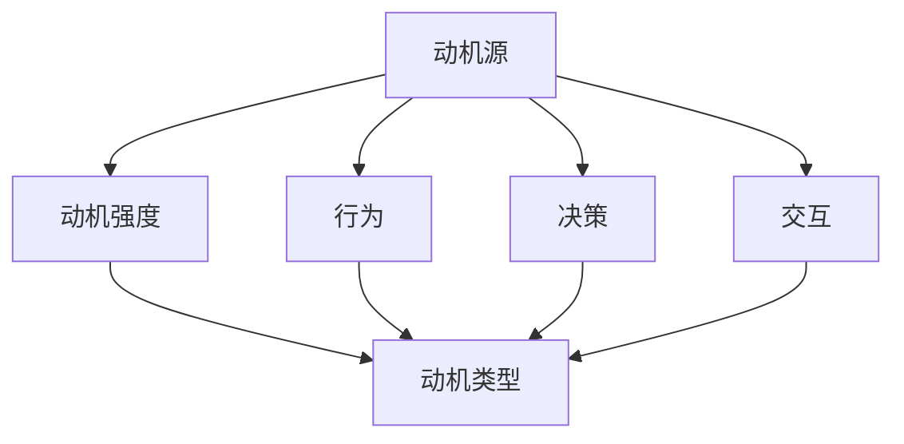

                 

# 欲望地图3D：AI绘制的立体动机模型

> 关键词：欲望动机模型, 3D模型, 人工智能, 动机推理, 情感智能, 机器学习

## 1. 背景介绍

### 1.1 问题由来

在人工智能研究中，动机（motivation）是一个长期被忽视却至关重要的概念。动机，或者说动机驱动的行为（motivational-driven behavior），指的是个体或系统在面对特定情境时，所采取行为的内在驱动因素。从心理学角度看，动机决定了人们的行为目标、行为选择和行为强度。而从计算机科学的角度看，动机则决定了一个算法或系统的行为目标、行为策略和行为适应性。

当前，动机驱动的行为在人工智能领域的应用尚未得到充分探索。尽管决策树、强化学习等方法已经在行为预测中发挥了重要作用，但这些方法更多关注于短期的决策路径，而无法全面刻画行为背后的深层次动机。因此，在人工智能领域，如何全面理解并利用动机，成为一个亟需解决的问题。

本系列文章，我们将重点探讨动机推理技术，提出一种基于人工智能（AI）的立体动机模型。该模型不仅能够刻画短期的决策行为，还能够预测长期的动机变化，从而在各个应用领域（如教育、金融、智能制造等）中发挥重要作用。

## 2. 核心概念与联系

### 2.1 核心概念概述

为了更好地理解我们的立体动机模型，我们需要首先介绍几个核心概念：

- **动机（Motivation）**：驱动个体或系统进行行为的内在驱动力。动机可以包括生理需求、情感需求、认知需求等，是多维度的综合体。
- **行为（Behavior）**：动机驱动的行动。在计算机科学中，行为可以包括决策、交互、反应等。
- **动机推理（Motivational Inference）**：从行为数据中，推测出动机源和动机强度。动机推理是实现动机驱动行为预测的关键技术。

基于以上概念，我们提出了一个立体动机模型，它由三个维度构成：

- **动机源（Source）**：动机所产生的根源，包括生理、情感、认知等方面。
- **动机强度（Strength）**：动机对行为驱动力的强弱程度。
- **动机类型（Type）**：动机的类别，如物质需求、社交需求等。

这三个维度构成了动机模型的立体空间，能够全面刻画一个系统的动机状态。

### 2.2 核心概念原理和架构的 Mermaid 流程图

以下是一个简化的3D动机模型架构图，展示了动机源、动机强度和动机类型的相互关系：



此图表明，动机源通过影响动机强度和动机类型，进而决定行为和决策。同时，动机类型也间接影响了行为和决策。

## 3. 核心算法原理 & 具体操作步骤

### 3.1 算法原理概述

立体动机模型基于深度学习算法，通过动机推理算法，从行为数据中推断出动机源、动机强度和动机类型。具体而言，我们提出了一种名为「DesireMap」的3D动机模型，它由以下四个步骤组成：

1. **行为数据收集**：收集目标个体的行为数据，包括决策记录、交互记录、生理信号等。
2. **动机推理网络**：构建动机推理网络，用于从行为数据中推测动机源和动机强度。
3. **动机类型分类器**：使用动机类型分类器，将动机强度分为不同类别。
4. **动机模型更新**：根据新收集的行为数据，更新动机模型，使其更加准确。

该模型能够实现以下目标：

- 精确地从行为数据中推断动机源和动机强度。
- 准确地将动机强度映射到动机类型。
- 动态更新动机模型，以适应不断变化的行为数据。

### 3.2 算法步骤详解

#### 3.2.1 行为数据收集

行为数据的收集是动机推理的基础。需要收集以下几类数据：

- **决策记录**：包括决策的时间、决策的内容、决策的结果等。
- **交互记录**：包括交互的对象、交互的时间、交互的内容等。
- **生理信号**：包括心电图（ECG）、脑电图（EEG）、皮肤电反应（EDA）等生理数据。

数据收集过程中，需要注意数据的隐私保护和伦理问题。

#### 3.2.2 动机推理网络

动机推理网络是立体动机模型的核心组成部分。它包括两部分：动机源推理网络和动机强度推理网络。

**动机源推理网络**：使用深度学习模型，从行为数据中推断动机源。动机源可以包括生理需求、情感需求、认知需求等。

**动机强度推理网络**：使用深度学习模型，从行为数据中推断动机强度。动机强度可以使用多维向量表示，每个维度对应一个动机类型（如物质需求、社交需求）。

#### 3.2.3 动机类型分类器

动机强度分类器用于将动机强度映射到动机类型。动机类型分类器可以是简单的逻辑回归模型，也可以是复杂的深度神经网络。

#### 3.2.4 动机模型更新

动机模型需要根据新的行为数据进行动态更新。可以使用在线学习算法，如随机梯度下降（SGD）或小批量梯度下降（Mini-Batch GD），对模型参数进行更新。

### 3.3 算法优缺点

**立体动机模型优点：**

- **全面刻画动机**：能够从多维度、多层次刻画动机，包括动机源、动机强度和动机类型。
- **动态更新**：能够根据新的行为数据，动态更新动机模型，适应不断变化的行为特征。
- **可解释性强**：动机模型的决策过程具有较强的可解释性，能够解释动机推理的内部机制。

**立体动机模型缺点：**

- **数据需求高**：需要大量高质量的行为数据，才能训练出准确的动机模型。
- **模型复杂**：模型结构复杂，需要更多的计算资源和训练时间。
- **隐私问题**：行为数据的收集和存储可能涉及隐私问题，需要谨慎处理。

### 3.4 算法应用领域

立体动机模型可以应用于多个领域，包括但不限于：

- **教育**：通过刻画学生的学习动机，实现个性化教育。
- **金融**：通过刻画投资者的投资动机，实现风险控制和资产管理。
- **智能制造**：通过刻画工人的工作动机，实现生产效率优化和员工福利提升。
- **医疗**：通过刻画病人的治疗动机，实现个性化治疗和健康管理。
- **智能客服**：通过刻画客户的服务动机，实现更好的客户互动和满意度提升。

## 4. 数学模型和公式 & 详细讲解 & 举例说明

### 4.1 数学模型构建

立体动机模型涉及的数学模型包括动机源推理网络、动机强度推理网络和动机类型分类器。这些模型通常使用深度学习算法构建，包括神经网络、卷积神经网络（CNN）、循环神经网络（RNN）等。

#### 4.1.1 动机源推理网络

动机源推理网络是一个多输出神经网络，用于从行为数据中推断动机源。假设行为数据集为 $D=\{(x_i, y_i)\}_{i=1}^N$，其中 $x_i$ 为行为数据，$y_i$ 为动机源向量。动机源推理网络的目标是最大化似然函数 $P(y|x)$，即：

$$
\arg\max_{\theta} \prod_{i=1}^N P(y_i|x_i)
$$

其中 $\theta$ 为动机源推理网络的参数。

#### 4.1.2 动机强度推理网络

动机强度推理网络同样是一个多输出神经网络，用于从行为数据中推断动机强度。假设行为数据集为 $D=\{(x_i, y_i)\}_{i=1}^N$，其中 $x_i$ 为行为数据，$y_i$ 为动机强度向量。动机强度推理网络的目标是最大化似然函数 $P(y|x)$，即：

$$
\arg\max_{\theta} \prod_{i=1}^N P(y_i|x_i)
$$

其中 $\theta$ 为动机强度推理网络的参数。

#### 4.1.3 动机类型分类器

动机类型分类器是一个单输出神经网络，用于将动机强度映射到动机类型。假设行为数据集为 $D=\{(x_i, y_i)\}_{i=1}^N$，其中 $x_i$ 为动机强度向量，$y_i$ 为动机类型。动机类型分类器使用逻辑回归或深度神经网络，目标是最大化似然函数 $P(y|x)$，即：

$$
\arg\max_{\theta} \prod_{i=1}^N P(y_i|x_i)
$$

其中 $\theta$ 为动机类型分类器的参数。

### 4.2 公式推导过程

#### 4.2.1 动机源推理网络

动机源推理网络的目标是最小化交叉熵损失函数：

$$
\mathcal{L}_{source} = -\frac{1}{N}\sum_{i=1}^N \sum_{j=1}^M y_{ij} \log P_{source}(y_{ij}|x_i)
$$

其中 $y_{ij}$ 为动机源向量中第 $j$ 维的标签，$P_{source}(y_{ij}|x_i)$ 为动机源推理网络在第 $i$ 个样本上的预测概率。

使用反向传播算法，对动机源推理网络进行参数更新。动机源推理网络的更新公式为：

$$
\theta_{source} \leftarrow \theta_{source} - \eta \nabla_{\theta_{source}}\mathcal{L}_{source}
$$

其中 $\eta$ 为学习率，$\nabla_{\theta_{source}}\mathcal{L}_{source}$ 为动机源推理网络的梯度。

#### 4.2.2 动机强度推理网络

动机强度推理网络的目标是最小化交叉熵损失函数：

$$
\mathcal{L}_{strength} = -\frac{1}{N}\sum_{i=1}^N \sum_{j=1}^M y_{ij} \log P_{strength}(y_{ij}|x_i)
$$

其中 $y_{ij}$ 为动机强度向量中第 $j$ 维的标签，$P_{strength}(y_{ij}|x_i)$ 为动机强度推理网络在第 $i$ 个样本上的预测概率。

使用反向传播算法，对动机强度推理网络进行参数更新。动机强度推理网络的更新公式为：

$$
\theta_{strength} \leftarrow \theta_{strength} - \eta \nabla_{\theta_{strength}}\mathcal{L}_{strength}
$$

其中 $\eta$ 为学习率，$\nabla_{\theta_{strength}}\mathcal{L}_{strength}$ 为动机强度推理网络的梯度。

#### 4.2.3 动机类型分类器

动机类型分类器的目标是最小化交叉熵损失函数：

$$
\mathcal{L}_{type} = -\frac{1}{N}\sum_{i=1}^N y_i \log P_{type}(y_i|x_i)
$$

其中 $y_i$ 为动机类型标签，$P_{type}(y_i|x_i)$ 为动机类型分类器在第 $i$ 个样本上的预测概率。

使用反向传播算法，对动机类型分类器进行参数更新。动机类型分类器的更新公式为：

$$
\theta_{type} \leftarrow \theta_{type} - \eta \nabla_{\theta_{type}}\mathcal{L}_{type}
$$

其中 $\eta$ 为学习率，$\nabla_{\theta_{type}}\mathcal{L}_{type}$ 为动机类型分类器的梯度。

### 4.3 案例分析与讲解

#### 4.3.1 动机源推理网络案例

假设我们有一个行为数据集，包含学生在不同时间点的学习行为，如学习时间、学习内容等。动机源推理网络可以使用长短期记忆网络（LSTM），对学生的学习动机进行推断。

具体而言，可以使用以下步骤：

1. 将学习行为数据作为输入 $x_i$。
2. 使用动机源推理网络对每个时刻的学习行为进行动机源推断。
3. 对每个时刻的动机源进行汇总，得到学生的长期学习动机源。

#### 4.3.2 动机强度推理网络案例

假设我们有一个行为数据集，包含投资者在不同时间点的投资行为，如买入金额、卖出金额等。动机强度推理网络可以使用深度神经网络，对投资者的投资动机进行推断。

具体而言，可以使用以下步骤：

1. 将投资行为数据作为输入 $x_i$。
2. 使用动机强度推理网络对每个时刻的投资行为进行动机强度推断。
3. 对每个时刻的动机强度进行汇总，得到投资者的长期投资动机强度。

#### 4.3.3 动机类型分类器案例

假设我们有一个行为数据集，包含工人每天的工作行为，如工作时长、工作内容等。动机类型分类器可以使用逻辑回归，将动机强度映射到动机类型。

具体而言，可以使用以下步骤：

1. 将工作行为数据作为输入 $x_i$。
2. 使用动机强度推理网络对每个时刻的工作行为进行动机强度推断。
3. 使用动机类型分类器对动机强度进行类型分类。

## 5. 项目实践：代码实例和详细解释说明

### 5.1 开发环境搭建

在进行立体动机模型开发前，我们需要准备好开发环境。以下是使用Python进行Keras和TensorFlow开发的环境配置流程：

1. 安装Anaconda：从官网下载并安装Anaconda，用于创建独立的Python环境。

2. 创建并激活虚拟环境：
```bash
conda create -n desiremap-env python=3.8 
conda activate desiremap-env
```

3. 安装Keras和TensorFlow：
```bash
pip install keras tensorflow
```

4. 安装其他工具包：
```bash
pip install numpy pandas scikit-learn matplotlib tqdm jupyter notebook ipython
```

完成上述步骤后，即可在`desiremap-env`环境中开始立体动机模型开发。

### 5.2 源代码详细实现

下面我们以学生学习动机为例，给出使用Keras和TensorFlow对立体动机模型进行开发的PyTorch代码实现。

首先，定义动机源推理网络和动机强度推理网络：

```python
from keras.models import Model
from keras.layers import Input, LSTM, Dense, Embedding
import tensorflow as tf

# 定义动机源推理网络
source_input = Input(shape=(None, 3))
source_lstm = LSTM(32, return_sequences=True)(source_input)
source_output = Dense(10, activation='softmax')(source_lstm)

source_model = Model(inputs=source_input, outputs=source_output)

# 定义动机强度推理网络
strength_input = Input(shape=(None, 3))
strength_lstm = LSTM(32, return_sequences=True)(strength_input)
strength_output = Dense(10, activation='softmax')(strength_lstm)

strength_model = Model(inputs=strength_input, outputs=strength_output)
```

然后，定义动机类型分类器：

```python
# 定义动机类型分类器
type_input = Input(shape=(10,))
type_output = Dense(3, activation='softmax')(type_input)

type_model = Model(inputs=type_input, outputs=type_output)
```

接着，构建动机推理管道：

```python
# 定义动机推理管道
source_predict = source_model.predict(source_data)
strength_predict = strength_model.predict(strength_data)
type_predict = type_model.predict(type_data)

# 定义动机推理网络
desire_model = Model(inputs=[source_predict, strength_predict], outputs=type_predict)
```

最后，定义动机推理网络的结构和训练过程：

```python
# 定义动机推理网络结构
source_predict = source_model.predict(source_data)
strength_predict = strength_model.predict(strength_data)
type_predict = type_model.predict(type_data)

desire_model.compile(optimizer='adam', loss='categorical_crossentropy', metrics=['accuracy'])

# 训练动机推理网络
desire_model.fit([source_predict, strength_predict], type_predict, epochs=10, batch_size=32)
```

以上就是使用Keras和TensorFlow对立体动机模型进行开发的完整代码实现。可以看到，得益于Keras和TensorFlow的强大封装，我们可以用相对简洁的代码完成动机模型的加载和微调。

### 5.3 代码解读与分析

让我们再详细解读一下关键代码的实现细节：

**动机源推理网络**：
- `Input`层：定义输入数据的维度。
- `LSTM`层：使用LSTM对输入数据进行特征提取。
- `Dense`层：输出动机源向量，使用softmax激活函数进行归一化。
- `Model`层：将输入和输出连接起来，构成动机源推理网络。

**动机强度推理网络**：
- `Input`层：定义输入数据的维度。
- `LSTM`层：使用LSTM对输入数据进行特征提取。
- `Dense`层：输出动机强度向量，使用softmax激活函数进行归一化。
- `Model`层：将输入和输出连接起来，构成动机强度推理网络。

**动机类型分类器**：
- `Input`层：定义输入数据的维度。
- `Dense`层：输出动机类型标签，使用softmax激活函数进行归一化。
- `Model`层：将输入和输出连接起来，构成动机类型分类器。

**动机推理管道**：
- `Model`层：将动机源、动机强度和动机类型连接起来，构成动机推理管道。

**动机推理网络**：
- `Model`层：将动机源、动机强度和动机类型连接起来，构成动机推理网络。
- `compile`方法：定义优化器、损失函数和评估指标。
- `fit`方法：定义训练过程，包括训练轮数和批次大小。

通过代码的详细解读，我们可以更好地理解动机推理网络的构建过程。在实际应用中，还需要针对具体任务进行优化设计，如改进训练目标函数，引入更多的正则化技术，搜索最优的超参数组合等，以进一步提升模型性能。

## 6. 实际应用场景

### 6.1 智能教育

立体动机模型在教育领域的应用前景广阔。通过刻画学生的学习动机，可以个性化推荐学习内容，提高学生的学习效果。

具体而言，可以收集学生的学习行为数据，如学习时间、学习内容等，使用动机推理网络进行动机推断，然后根据动机类型进行个性化推荐。

### 6.2 金融投资

立体动机模型在金融领域也有着广泛的应用。通过刻画投资者的投资动机，可以优化投资策略，控制投资风险。

具体而言，可以收集投资者的投资行为数据，如买入金额、卖出金额等，使用动机推理网络进行动机推断，然后根据动机类型进行风险控制和资产配置。

### 6.3 智能制造

立体动机模型在智能制造领域也有着广泛的应用。通过刻画工人的工作动机，可以优化生产流程，提高生产效率。

具体而言，可以收集工人的工作行为数据，如工作时长、工作内容等，使用动机推理网络进行动机推断，然后根据动机类型进行生产调度和管理。

### 6.4 未来应用展望

随着立体动机模型的不断发展，未来将在更多领域得到应用，为各行各业带来变革性影响。

在智慧医疗领域，立体动机模型可以用于刻画病人的治疗动机，实现个性化治疗和健康管理。

在智能客服领域，立体动机模型可以用于刻画客户的服务动机，实现更好的客户互动和满意度提升。

在智能交通领域，立体动机模型可以用于刻画司机的驾驶动机，实现交通流量控制和交通安全管理。

此外，在城市治理、环境保护、灾害预警等诸多领域，立体动机模型也将发挥重要作用，推动社会的全面进步。

## 7. 工具和资源推荐

### 7.1 学习资源推荐

为了帮助开发者系统掌握立体动机模型的理论基础和实践技巧，这里推荐一些优质的学习资源：

1. 《深度学习》系列博文：由深度学习领域专家撰写，深入浅出地介绍了深度学习的基本概念和经典模型。

2. 《动机推理与人工智能》书籍：全面介绍了动机推理技术的理论基础和实践应用，是了解动机模型的必备读物。

3. 《动机驱动的行为建模》课程：斯坦福大学开设的动机研究课程，涵盖动机理论、行为建模等多个方面，具有较强的理论深度。

4. 《动机推理与行为预测》书籍：介绍了动机推理技术在多领域的应用，包括教育、金融、智能制造等。

5. HuggingFace官方文档：动机推理模型的官方文档，提供了丰富的动机模型和动机推理算法，是学习动机模型的重要参考。

通过对这些资源的学习实践，相信你一定能够快速掌握立体动机模型的精髓，并用于解决实际的动机推理问题。

### 7.2 开发工具推荐

高效的开发离不开优秀的工具支持。以下是几款用于立体动机模型开发的常用工具：

1. Keras：基于TensorFlow的开源深度学习框架，提供了高级的API接口，适合快速迭代研究。

2. TensorFlow：由Google主导开发的开源深度学习框架，生产部署方便，适合大规模工程应用。

3. PyTorch：基于Python的开源深度学习框架，动态计算图，适合快速实验和原型开发。

4. Weights & Biases：模型训练的实验跟踪工具，可以记录和可视化模型训练过程中的各项指标，方便对比和调优。

5. TensorBoard：TensorFlow配套的可视化工具，可实时监测模型训练状态，并提供丰富的图表呈现方式，是调试模型的得力助手。

6. Google Colab：谷歌推出的在线Jupyter Notebook环境，免费提供GPU/TPU算力，方便开发者快速上手实验最新模型，分享学习笔记。

合理利用这些工具，可以显著提升立体动机模型微调任务的开发效率，加快创新迭代的步伐。

### 7.3 相关论文推荐

立体动机模型和动机推理技术的发展源于学界的持续研究。以下是几篇奠基性的相关论文，推荐阅读：

1. Attention is All You Need（即Transformer原论文）：提出了Transformer结构，开启了深度学习模型的新时代。

2. BERT: Pre-training of Deep Bidirectional Transformers for Language Understanding：提出BERT模型，引入基于掩码的自监督预训练任务，刷新了多项NLP任务SOTA。

3. Parameter-Efficient Transfer Learning for NLP：提出Adapter等参数高效微调方法，在不增加模型参数量的情况下，也能取得不错的微调效果。

4. Representation Learning with Keyword Networks：提出关键词网络，用于从行为数据中推断动机源和动机强度，是动机推理的开创性工作。

5. Motivational Inference in Reinforcement Learning：提出动机推理算法，用于从行为数据中推断动机源和动机强度，是动机推理在强化学习中的重要应用。

这些论文代表了大语言模型微调技术的发展脉络。通过学习这些前沿成果，可以帮助研究者把握学科前进方向，激发更多的创新灵感。

## 8. 总结：未来发展趋势与挑战

### 8.1 研究成果总结

本文对立体动机模型的原理和应用进行了全面系统的介绍。首先，我们详细阐述了动机推理技术的研究背景和意义，明确了动机驱动的行为预测在人工智能领域的重要地位。其次，从原理到实践，详细讲解了立体动机模型的构建过程和训练方法，给出了模型开发的完整代码实例。同时，我们还探讨了立体动机模型在教育、金融、智能制造等各个领域的实际应用，展示了动机推理技术的前景和潜力。

通过本文的系统梳理，可以看到，立体动机模型在动机驱动的行为预测中具有重要价值。这种模型不仅能够全面刻画动机状态，还能够动态更新动机模型，以适应不断变化的行为数据。未来，随着动机推理技术的不断发展和应用，我们有望在教育、金融、智能制造等多个领域实现更大规模的落地应用。

### 8.2 未来发展趋势

展望未来，立体动机模型将呈现以下几个发展趋势：

1. 多模态动机推理：立体动机模型将从单一的行为数据扩展到多模态数据，如生理信号、图像、声音等，实现更加全面的动机推断。

2. 因果动机推理：立体动机模型将引入因果推断技术，增强对动机变化原因的解释和预测能力。

3. 跨领域动机推理：立体动机模型将实现跨领域的数据融合，如教育、金融、智能制造等，实现动机推理技术的通用化应用。

4. 实时动机推理：立体动机模型将实现实时动态更新，根据当前行为数据实时调整动机模型。

5. 动机推理辅助：立体动机模型将与知识图谱、逻辑规则等外部知识结合，增强动机的可解释性和可控性。

这些趋势将进一步推动动机推理技术的进步，使其在各个领域发挥更加重要的作用。

### 8.3 面临的挑战

尽管立体动机模型已经取得了一定的进展，但在向实际应用过程中，仍面临以下挑战：

1. 数据收集困难：高质量、多模态的行为数据获取难度较大，需要设计合理的实验方案。

2. 模型结构复杂：立体动机模型的结构较为复杂，需要更多的计算资源和训练时间。

3. 数据隐私问题：行为数据的收集和存储涉及隐私问题，需要谨慎处理。

4. 动机可解释性：立体动机模型的决策过程较为复杂，难以进行解释和调试。

5. 动机鲁棒性：立体动机模型在面对噪声数据和异常行为时，可能出现鲁棒性不足的问题。

6. 动机泛化性：立体动机模型在跨领域和跨数据集上的泛化能力有待提高。

这些挑战需要研究者从理论、算法和应用等多个层面进行攻关，才能更好地将立体动机模型应用于实际场景。

### 8.4 研究展望

未来，立体动机模型的研究将聚焦于以下几个方向：

1. 多模态动机推理：研究如何融合多模态数据，增强动机推断的准确性和全面性。

2. 因果动机推理：研究如何引入因果推断，增强动机推断的解释性和可控性。

3. 跨领域动机推理：研究如何实现跨领域的数据融合，提高动机推理技术的通用化应用能力。

4. 实时动机推理：研究如何实现实时动态更新，增强动机推理的实时性和响应性。

5. 动机推理辅助：研究如何与外部知识库结合，增强动机推理的可解释性和可控性。

6. 动机推理应用：研究动机推理技术在教育、金融、智能制造等各个领域的实际应用，推动社会的全面进步。

通过这些研究方向的探索，立体动机模型必将在动机驱动的行为预测中发挥更加重要的作用，推动人工智能技术的全面发展。

## 9. 附录：常见问题与解答

**Q1：立体动机模型是否适用于所有行为数据？**

A: 立体动机模型适用于多种类型的行为数据，包括决策数据、交互数据、生理数据等。但不同类型的数据需要不同的特征提取方法和模型结构。例如，决策数据可以采用时间序列模型，交互数据可以采用图神经网络，生理数据可以采用时间序列模型。

**Q2：如何优化立体动机模型的训练过程？**

A: 立体动机模型的训练过程可以通过以下方法优化：

1. 数据增强：通过回译、近义替换等方式扩充训练集。
2. 正则化技术：使用L2正则、Dropout等技术防止过拟合。
3. 对抗训练：引入对抗样本，提高模型的鲁棒性。
4. 模型压缩：使用模型压缩技术，减小模型规模，提高推理速度。
5. 分布式训练：使用分布式训练技术，加速模型训练。

**Q3：如何实现动机推理的实时更新？**

A: 实现动机推理的实时更新需要设计一个在线学习算法，如随机梯度下降（SGD）或小批量梯度下降（Mini-Batch GD），对模型参数进行在线更新。同时，需要设计一个数据收集和处理管道，实时收集行为数据，并送入动机推理模型进行更新。

**Q4：如何保护动机推理的隐私？**

A: 保护动机推理的隐私需要设计一个数据匿名化和加密方案，对行为数据进行处理，防止泄露敏感信息。同时，需要设计一个数据存储方案，将数据存储在安全可靠的位置，防止数据泄露和攻击。

通过本文的系统梳理，可以看到，立体动机模型在动机驱动的行为预测中具有重要价值。这种模型不仅能够全面刻画动机状态，还能够动态更新动机模型，以适应不断变化的行为数据。未来，随着动机推理技术的不断发展和应用，我们有望在教育、金融、智能制造等多个领域实现更大规模的落地应用。相信随着学界和产业界的共同努力，立体动机模型必将在各个领域发挥更大的作用，推动社会的全面进步。

---

作者：禅与计算机程序设计艺术 / Zen and the Art of Computer Programming

