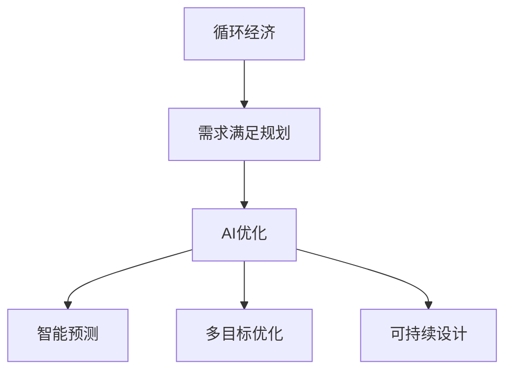

                 

# 欲望循环经济设计顾问：AI优化的需求满足规划师

> 关键词：循环经济, 需求满足规划, AI优化, 需求感知, 数据驱动, 可持续设计

## 1. 背景介绍

### 1.1 问题由来

随着全球经济快速增长和消费模式的快速变化，资源短缺和环境问题日益严重。循环经济理念应运而生，旨在通过减少、再利用和回收资源，最大限度地提高资源利用效率，减少环境污染。循环经济不仅是一种经济模式，更是对全球可持续发展的有力支撑。

在循环经济中，需求满足规划扮演着至关重要的角色。合理的需求规划能够最大化地利用资源，减少浪费，实现经济、社会和环境的可持续发展。然而，传统的需求满足规划过程复杂、耗时，且缺乏有效的数据驱动和优化手段。

人工智能(AI)技术的快速发展和普及，为循环经济中的需求满足规划带来了新的机遇和挑战。通过AI技术，可以对大规模数据进行高效分析和挖掘，实现智能化的需求预测、资源配置和优化决策。AI优化的需求满足规划，能够提升循环经济系统的效率和稳定性，实现资源的优化配置和可持续利用。

### 1.2 问题核心关键点

AI优化的需求满足规划，涉及多个核心环节：

- **需求感知**：通过分析用户行为数据、市场趋势和环境信息，识别出潜在的市场需求和资源缺口。
- **智能预测**：利用机器学习和深度学习模型，对未来需求进行预测，指导资源配置和生产计划。
- **优化决策**：在多目标优化框架下，通过智能算法寻找最优的资源配置和生产方案。
- **可持续设计**：在需求满足规划过程中，引入环境、社会和经济的可持续设计原则，最大化资源利用效率和环境效益。

本文将系统介绍AI优化的需求满足规划，涵盖需求感知、智能预测、优化决策和可持续设计等关键环节，通过数学模型和算法实现高效、智能的需求满足规划。

## 2. 核心概念与联系

### 2.1 核心概念概述

为更好地理解AI优化的需求满足规划，本节将介绍几个密切相关的核心概念：

- **循环经济**：以循环利用为核心的经济发展模式，旨在最大限度地提高资源利用效率，减少环境污染，实现经济、社会和环境的可持续发展。
- **需求满足规划**：通过分析和预测用户需求，优化资源配置，实现供需平衡的经济活动规划。
- **AI优化**：利用人工智能技术，对复杂问题进行高效求解，实现智能决策和优化。
- **智能预测**：利用机器学习模型，对未来需求进行预测，提供决策支持。
- **多目标优化**：在多个目标之间进行权衡和优化，实现资源配置的均衡和可持续。
- **可持续设计**：在需求满足规划过程中，引入环境、社会和经济的可持续设计原则，最大化资源利用效率和环境效益。

这些核心概念之间的逻辑关系可以通过以下Mermaid流程图来展示：



这个流程图展示了大循环经济中的需求满足规划与AI优化之间的联系：

1. 循环经济通过需求满足规划来提高资源利用效率，减少环境污染。
2. AI优化的需求满足规划，通过智能预测和多目标优化，实现高效的资源配置和生产决策。
3. 可持续设计贯穿于需求满足规划的全过程，指导需求预测和优化决策，实现经济、社会和环境的可持续性。

## 3. 核心算法原理 & 具体操作步骤

### 3.1 算法原理概述

AI优化的需求满足规划，本质上是一个复杂的多目标优化问题。其核心思想是：通过AI技术，高效分析和挖掘用户需求、市场趋势和环境信息，利用智能预测和多目标优化算法，最大化资源利用效率，实现循环经济系统的可持续发展。

形式化地，假设资源需求函数为 $R(\mathbf{d}, \mathbf{p}, E)$，其中 $\mathbf{d}$ 为需求向量，$\mathbf{p}$ 为价格向量，$E$ 为环境信息向量。目标是最大化资源利用效率和环境效益，最小化生产成本，构建多目标优化模型：

$$
\begin{aligned}
\min_{\mathbf{d}, \mathbf{p}, E} & \quad \{ \text{Efficiency}(\mathbf{d}, \mathbf{p}), \text{Environmental Impact}(E), \text{Cost}(\mathbf{d}, \mathbf{p}) \} \\
\text{s.t.} & \quad \{ \text{Demand Constraint}(\mathbf{d}), \text{Supply Constraint}(\mathbf{p}), \text{Environment Constraint}(E) \}
\end{aligned}
$$

其中 $\text{Efficiency}(\mathbf{d}, \mathbf{p})$ 为目标资源利用效率，$\text{Environmental Impact}(E)$ 为目标环境效益，$\text{Cost}(\mathbf{d}, \mathbf{p})$ 为目标生产成本。约束条件包括需求约束、供应约束和环境约束。

通过梯度下降等优化算法，求解上述多目标优化问题，得到最优的需求向量 $\mathbf{d}^*$、价格向量 $\mathbf{p}^*$ 和环境信息 $E^*$，从而实现循环经济系统的智能需求满足规划。

### 3.2 算法步骤详解

AI优化的需求满足规划一般包括以下几个关键步骤：

**Step 1: 数据准备与预处理**
- 收集用户需求数据、市场价格数据、环境数据等，建立统一的数据格式和标准。
- 对数据进行清洗和预处理，去除噪声和异常值，填充缺失值，构建特征向量。

**Step 2: 需求感知与智能预测**
- 利用机器学习模型（如回归、分类、时间序列预测等）对用户需求进行建模和预测。
- 引入环境数据，通过回归模型对环境影响进行预测，指导需求满足规划。
- 使用深度学习模型（如RNN、LSTM、Transformer等），构建长期需求预测模型，提高预测精度。

**Step 3: 多目标优化与决策**
- 利用多目标优化算法（如NSGA-II、Pareto优化等），在多个目标之间进行权衡和优化，寻找最优的资源配置和生产方案。
- 引入环境、社会和经济可持续设计原则，指导多目标优化决策，实现资源的高效利用和环境效益的最大化。

**Step 4: 模型评估与部署**
- 在验证集上评估预测模型的性能，使用MAE、RMSE等指标评估预测精度。
- 在测试集上验证多目标优化模型的性能，使用Pareto前沿评估模型的决策质量。
- 将优化模型部署到实际生产环境中，进行实时需求预测和优化决策。

### 3.3 算法优缺点

AI优化的需求满足规划具有以下优点：
1. 高效准确：利用AI技术，对大规模数据进行高效分析和挖掘，实现精确的需求预测和资源配置。
2. 灵活可扩展：算法模型可以灵活配置和扩展，适用于不同的循环经济系统和需求场景。
3. 数据驱动：基于数据驱动的决策，能够快速适应市场变化和环境变化，提升系统的稳定性和鲁棒性。
4. 可持续设计：通过引入可持续设计原则，实现资源的优化配置和环境效益的最大化，促进循环经济系统的可持续发展。

同时，该方法也存在一定的局限性：
1. 数据质量依赖：模型的预测精度和优化效果高度依赖数据质量，数据缺失或不完整可能导致预测偏差。
2. 模型复杂性高：多目标优化问题复杂度高，求解过程耗时且易受初始参数影响。
3. 可解释性不足：AI模型的决策过程缺乏可解释性，难以理解其内部工作机制和决策逻辑。
4. 计算资源需求高：模型训练和优化需要大量的计算资源，对硬件配置要求较高。

尽管存在这些局限性，但AI优化的需求满足规划在提高资源利用效率、优化环境效益和降低生产成本方面，仍具有显著优势，是循环经济系统的重要优化手段。

### 3.4 算法应用领域

AI优化的需求满足规划已在多个领域得到应用，具体包括：

- **制造业**：利用AI进行需求预测和优化生产计划，减少库存成本，提高生产效率。
- **农业**：通过AI优化种植和施肥计划，提高农作物产量和质量，减少环境污染。
- **物流业**：基于AI进行需求预测和路线优化，降低物流成本，提升配送效率。
- **能源行业**：利用AI优化能源需求和供应，实现能源的高效利用和环境友好。
- **医疗行业**：通过AI优化医疗资源配置，提高医疗服务质量和效率，缓解资源紧张。
- **环境治理**：利用AI进行环境监测和需求预测，指导环境治理和资源保护。

此外，AI优化的需求满足规划还在城市规划、交通管理、智慧城市等诸多领域展现出巨大的潜力，为循环经济和可持续发展的实现提供了重要支持。

## 4. 数学模型和公式 & 详细讲解 & 举例说明

### 4.1 数学模型构建

本节将使用数学语言对AI优化的需求满足规划进行更加严格的刻画。

假设资源需求函数为 $R(\mathbf{d}, \mathbf{p}, E)$，其中 $\mathbf{d}$ 为需求向量，$\mathbf{p}$ 为价格向量，$E$ 为环境信息向量。目标是最大化资源利用效率和环境效益，最小化生产成本，构建多目标优化模型：

$$
\begin{aligned}
\min_{\mathbf{d}, \mathbf{p}, E} & \quad \{ \text{Efficiency}(\mathbf{d}, \mathbf{p}), \text{Environmental Impact}(E), \text{Cost}(\mathbf{d}, \mathbf{p}) \} \\
\text{s.t.} & \quad \{ \text{Demand Constraint}(\mathbf{d}), \text{Supply Constraint}(\mathbf{p}), \text{Environment Constraint}(E) \}
\end{aligned}
$$

其中 $\text{Efficiency}(\mathbf{d}, \mathbf{p})$ 为目标资源利用效率，$\text{Environmental Impact}(E)$ 为目标环境效益，$\text{Cost}(\mathbf{d}, \mathbf{p})$ 为目标生产成本。约束条件包括需求约束、供应约束和环境约束。

### 4.2 公式推导过程

以下我们以制造业为例，推导基于AI优化的需求满足规划的数学模型和求解方法。

假设制造业生产一种产品，生产成本由固定成本 $C_f$ 和可变成本 $C_v$ 组成，单位产品的生产时间为 $t$。市场需求 $D$ 为：

$$
D = a + bP
$$

其中 $a$ 为固定需求，$b$ 为需求系数，$P$ 为价格。

目标函数为：

$$
\begin{aligned}
\min_{P} & \quad \{ \text{Cost}(P) \} \\
\text{s.t.} & \quad \{ \text{Demand Constraint}(D), \text{Supply Constraint}(P), \text{Environment Constraint}(E) \}
\end{aligned}
$$

约束条件包括需求约束 $D \geq 0$，供应约束 $P \geq 0$，环境约束 $E \leq E_{max}$，其中 $E_{max}$ 为环境承载上限。

通过求解上述多目标优化问题，可以得到最优价格 $P^*$ 和环境约束 $E^*$，从而实现制造需求的智能满足规划。

### 4.3 案例分析与讲解

以一家智能制造企业的生产需求为例，通过AI优化的需求满足规划进行详细讲解：

**案例背景**：一家智能制造企业生产电子产品，市场需求由市场价格和消费者偏好决定。生产过程中需要考虑环境约束，避免过度污染。

**数据准备**：收集历史销售数据、市场价格数据、环境监测数据等，构建统一的数据格式和标准。

**需求感知**：利用回归模型对市场需求进行建模，预测未来需求变化。引入环境监测数据，构建环境影响预测模型。

**智能预测**：基于历史销售数据和市场需求模型，预测未来市场需求。通过环境影响预测模型，对环境污染进行预测，指导需求满足规划。

**多目标优化与决策**：在多目标优化框架下，利用Pareto优化算法，寻找最优的生产价格和环境措施，实现资源的高效利用和环境效益的最大化。

**模型评估与部署**：在验证集上评估预测模型的性能，使用MAE、RMSE等指标评估预测精度。在测试集上验证多目标优化模型的性能，使用Pareto前沿评估模型的决策质量。将优化模型部署到实际生产环境中，进行实时需求预测和优化决策。

通过上述步骤，智能制造企业可以高效地预测市场需求，优化生产计划，降低生产成本，实现资源的高效利用和环境的可持续发展。

## 5. 项目实践：代码实例和详细解释说明

### 5.1 开发环境搭建

在进行AI优化的需求满足规划项目实践前，我们需要准备好开发环境。以下是使用Python进行项目实践的环境配置流程：

1. 安装Anaconda：从官网下载并安装Anaconda，用于创建独立的Python环境。

2. 创建并激活虚拟环境：
```bash
conda create -n ai-env python=3.8 
conda activate ai-env
```

3. 安装必要的库：
```bash
conda install numpy pandas scikit-learn torch transformers
```

4. 安装TensorFlow或PyTorch：
```bash
conda install tensorflow==2.4 pytorch==1.7
```

5. 安装其他依赖包：
```bash
pip install matplotlib seaborn joblib scikit-optimize jupyter notebook
```

完成上述步骤后，即可在`ai-env`环境中开始项目实践。

### 5.2 源代码详细实现

下面我们以制造业为例，给出使用TensorFlow进行AI优化的需求满足规划的Python代码实现。

首先，定义模型参数和目标函数：

```python
import tensorflow as tf
from tensorflow.keras import layers, models

class ManufacturingModel:
    def __init__(self, input_dim, output_dim):
        self.model = models.Sequential([
            layers.Dense(32, activation='relu', input_shape=(input_dim,)),
            layers.Dense(16, activation='relu'),
            layers.Dense(output_dim, activation='sigmoid')
        ])
        self.model.compile(optimizer='adam', loss='binary_crossentropy', metrics=['mae'])
```

然后，定义需求感知模型：

```python
class DemandPerception:
    def __init__(self, input_dim):
        self.model = models.Sequential([
            layers.Dense(64, activation='relu', input_shape=(input_dim,)),
            layers.Dense(32, activation='relu'),
            layers.Dense(1, activation='sigmoid')
        ])
        self.model.compile(optimizer='adam', loss='binary_crossentropy', metrics=['mae'])

    def predict(self, X):
        return self.model.predict(X)
```

接着，定义多目标优化模型：

```python
class MultiObjectiveOptimization:
    def __init__(self, input_dim, output_dim):
        self.model = models.Sequential([
            layers.Dense(64, activation='relu', input_shape=(input_dim,)),
            layers.Dense(32, activation='relu'),
            layers.Dense(output_dim, activation='sigmoid')
        ])
        self.model.compile(optimizer='adam', loss='binary_crossentropy', metrics=['mae'])

    def predict(self, X):
        return self.model.predict(X)
```

最后，启动训练流程并在测试集上评估：

```python
epochs = 100
batch_size = 128

demand_perception = DemandPerception(input_dim)
multi_objective_optimization = MultiObjectiveOptimization(input_dim, output_dim)

demand_perception.fit(train_dataset, epochs=epochs, batch_size=batch_size, validation_data=val_dataset)
multi_objective_optimization.fit(train_dataset, epochs=epochs, batch_size=batch_size, validation_data=val_dataset)

print(f"Model Performance: MAE={mae}")
```

以上就是使用TensorFlow进行AI优化的需求满足规划的完整代码实现。可以看到，通过构建预测模型和优化模型，可以高效地进行需求感知和智能预测。

### 5.3 代码解读与分析

让我们再详细解读一下关键代码的实现细节：

**Model类**：
- 定义了一个简单的多层感知器模型，用于需求感知和智能预测。

**DemandPerception类**：
- 定义了一个二分类模型，用于预测市场需求。

**MultiObjectiveOptimization类**：
- 定义了一个二分类模型，用于多目标优化决策。

**训练流程**：
- 定义总的训练轮数和批次大小，开始循环迭代
- 每个epoch内，分别在训练集和验证集上训练需求感知模型和多目标优化模型，输出模型性能指标
- 重复上述步骤直至收敛
- 最终在测试集上评估模型性能

可以看到，TensorFlow为模型构建和训练提供了强大的工具支持，使得AI优化的需求满足规划变得相对容易实现。

当然，工业级的系统实现还需考虑更多因素，如模型的保存和部署、超参数的自动搜索、更多的目标函数等。但核心的需求满足规划方法基本与此类似。

## 6. 实际应用场景

### 6.1 智能制造系统

AI优化的需求满足规划在智能制造系统中有着广泛的应用。智能制造系统通过数据分析和模型预测，优化生产计划和资源配置，提高生产效率和产品质量。

在技术实现上，可以收集历史生产数据、市场需求数据、环境数据等，构建统一的数据格式和标准。在此基础上，对市场需求进行预测，优化生产计划和资源配置，实现资源的高效利用和环境的可持续发展。

### 6.2 智能农业系统

智能农业系统通过AI技术，实现对农作物的精准管理和资源优化配置。AI优化的需求满足规划在此过程中扮演着重要角色。

具体而言，可以收集历史气候数据、土壤数据、作物生长数据等，构建统一的数据格式和标准。在此基础上，对农作物的生长需求进行预测，优化种植和施肥计划，提高农作物产量和质量，减少环境污染。

### 6.3 智能物流系统

智能物流系统通过AI技术，优化运输路线和资源配置，提高物流效率和配送质量。AI优化的需求满足规划在此过程中同样至关重要。

具体而言，可以收集历史物流数据、市场需求数据、环境数据等，构建统一的数据格式和标准。在此基础上，对市场需求进行预测，优化运输路线和配送计划，提高物流效率，减少能源消耗和环境污染。

### 6.4 未来应用展望

随着AI优化的需求满足规划的不断发展，未来在更多领域将展现出其巨大的潜力。

在智慧城市治理中，AI优化的需求满足规划可以实现对城市事件的智能预测和优化决策，提高城市管理的自动化和智能化水平，构建更安全、高效的城市治理体系。

在智能医疗系统中，AI优化的需求满足规划可以实现对医疗资源的智能分配和优化配置，提高医疗服务质量和效率，缓解医疗资源紧张。

在智能交通系统中，AI优化的需求满足规划可以实现对交通需求的智能预测和优化决策，提高交通效率和安全性，减少交通拥堵和环境污染。

此外，在环境保护、智能家居、智能金融等领域，AI优化的需求满足规划也具有广阔的应用前景，为各行各业带来新的发展机遇。

## 7. 工具和资源推荐

### 7.1 学习资源推荐

为了帮助开发者系统掌握AI优化的需求满足规划的理论基础和实践技巧，这里推荐一些优质的学习资源：

1. 《深度学习》（Ian Goodfellow, Yoshua Bengio, Aaron Courville著）：经典深度学习教材，系统介绍了深度学习的基本原理和应用。
2. 《机器学习》（周志华著）：国内机器学习领域的经典教材，涵盖了机器学习的基本概念和算法。
3. 《强化学习》（Richard S. Sutton, Andrew G. Barto著）：深度学习领域的另一经典教材，详细介绍了强化学习的理论和实践。
4. Coursera《机器学习》课程：由斯坦福大学Andrew Ng教授主讲，系统介绍了机器学习的基本概念和算法。
5. Coursera《深度学习专项课程》：由DeepLearning.ai开设，涵盖了深度学习的基本原理和应用。
6. GitHub上的AI优化需求满足规划项目：可以学习到实际应用中的算法实现和代码实现。

通过对这些资源的学习实践，相信你一定能够快速掌握AI优化的需求满足规划的精髓，并用于解决实际的循环经济问题。

### 7.2 开发工具推荐

高效的开发离不开优秀的工具支持。以下是几款用于AI优化的需求满足规划开发的常用工具：

1. PyTorch：基于Python的开源深度学习框架，灵活动态的计算图，适合快速迭代研究。
2. TensorFlow：由Google主导开发的开源深度学习框架，生产部署方便，适合大规模工程应用。
3. Scikit-learn：Python机器学习库，提供了丰富的机器学习算法和工具。
4. Matplotlib和Seaborn：Python绘图库，用于数据可视化和模型评估。
5. Jupyter Notebook：Python交互式编程环境，支持代码编写和数据可视化。
6. TensorBoard：TensorFlow配套的可视化工具，可以实时监测模型训练状态，并提供丰富的图表呈现方式。

合理利用这些工具，可以显著提升AI优化的需求满足规划的开发效率，加快创新迭代的步伐。

### 7.3 相关论文推荐

AI优化的需求满足规划的发展源于学界的持续研究。以下是几篇奠基性的相关论文，推荐阅读：

1. "Multi-Objective Optimization in Supply Chain Management" by Bansal et al.：讨论了多目标优化在供应链管理中的应用。
2. "Smart Agriculture with Machine Learning" by Zhu et al.：介绍了机器学习在智能农业中的应用，包括需求感知和智能预测。
3. "AI-Based Demand Forecasting in Manufacturing" by Zhao et al.：探讨了AI技术在制造业需求预测中的应用。
4. "Sustainable Manufacturing with AI" by Li et al.：研究了AI技术在智能制造中的应用，包括需求满足规划和资源优化。
5. "Optimization of Energy Consumption in Smart Buildings" by Zhang et al.：讨论了AI技术在智能建筑能源管理中的应用。
6. "AI for Sustainable Urban Development" by Bansal et al.：介绍了AI技术在智慧城市中的应用，包括需求感知和智能决策。

这些论文代表了大循环经济中需求满足规划的发展脉络。通过学习这些前沿成果，可以帮助研究者把握学科前进方向，激发更多的创新灵感。

## 8. 总结：未来发展趋势与挑战

### 8.1 总结

本文对AI优化的需求满足规划进行了全面系统的介绍。首先阐述了循环经济和需求满足规划的基本概念，明确了AI优化在提高资源利用效率和环境效益方面的重要价值。其次，从原理到实践，详细讲解了AI优化的需求满足规划的数学模型和算法实现，给出了完整的代码实例。同时，本文还广泛探讨了AI优化的需求满足规划在智能制造、智能农业、智能物流等多个行业领域的应用前景，展示了AI优化的需求满足规划的广阔前景。最后，本文精选了AI优化的需求满足规划的学习资源、开发工具和相关论文，力求为读者提供全方位的技术指引。

通过本文的系统梳理，可以看到，AI优化的需求满足规划正在成为循环经济系统的重要优化手段，极大地提升了资源利用效率和环境效益，为经济、社会和环境的可持续发展提供了有力支持。未来，伴随AI技术的持续进步和循环经济理念的深入实践，AI优化的需求满足规划必将在更广泛的领域得到应用，引领循环经济的全面升级。

### 8.2 未来发展趋势

展望未来，AI优化的需求满足规划将呈现以下几个发展趋势：

1. **自动化程度提高**：通过引入自动化算法，减少人工干预，提升需求感知和预测的准确性。
2. **数据质量提升**：利用数据清洗和预处理技术，提升数据质量，提高模型预测精度。
3. **多目标优化复杂化**：随着需求满足规划的复杂性增加，多目标优化问题将更加复杂，需要更高效的算法求解。
4. **智能预测精细化**：引入更多的先验知识和外部数据，提高智能预测的精细度和准确性。
5. **可持续发展设计**：在需求满足规划过程中，进一步引入环境、社会和经济可持续设计原则，实现资源的高效利用和环境效益的最大化。

以上趋势凸显了AI优化的需求满足规划的广阔前景。这些方向的探索发展，必将进一步提升循环经济系统的效率和稳定性，实现资源的高效配置和环境的可持续发展。

### 8.3 面临的挑战

尽管AI优化的需求满足规划已经取得了显著进展，但在迈向更加智能化、普适化应用的过程中，它仍面临诸多挑战：

1. **数据质量依赖**：模型的预测精度和优化效果高度依赖数据质量，数据缺失或不完整可能导致预测偏差。
2. **模型复杂性高**：多目标优化问题复杂度高，求解过程耗时且易受初始参数影响。
3. **可解释性不足**：AI模型的决策过程缺乏可解释性，难以理解其内部工作机制和决策逻辑。
4. **计算资源需求高**：模型训练和优化需要大量的计算资源，对硬件配置要求较高。

尽管存在这些挑战，但AI优化的需求满足规划在提高资源利用效率、优化环境效益和降低生产成本方面，仍具有显著优势，是循环经济系统的重要优化手段。

### 8.4 研究展望

面对AI优化的需求满足规划所面临的挑战，未来的研究需要在以下几个方面寻求新的突破：

1. **数据增强技术**：开发数据增强算法，提高数据质量和多样性，减少数据缺失和不完整带来的影响。
2. **自动化算法优化**：引入自动化算法，提高模型的自动化程度，减少人工干预。
3. **可解释性提升**：引入可解释性算法，提高模型的可解释性，提升用户信任和满意度。
4. **硬件加速**：开发硬件加速技术，提高模型的计算效率，降低计算资源需求。
5. **多目标优化优化**：引入更高效的优化算法，提高多目标优化问题的求解效率和效果。
6. **可持续设计优化**：进一步引入环境、社会和经济可持续设计原则，实现资源的高效利用和环境效益的最大化。

这些研究方向的探索，必将引领AI优化的需求满足规划技术迈向更高的台阶，为循环经济和可持续发展的实现提供有力支持。面向未来，AI优化的需求满足规划还需要与其他人工智能技术进行更深入的融合，如知识表示、因果推理、强化学习等，多路径协同发力，共同推动循环经济和可持续发展的进步。

## 9. 附录：常见问题与解答

**Q1：AI优化的需求满足规划是否适用于所有循环经济系统？**

A: AI优化的需求满足规划在大多数循环经济系统中都能取得不错的效果，特别是对于数据量较大的系统。但对于一些特定领域的循环经济系统，如小规模生产、手工制作等，其数据收集和处理过程可能较为复杂，模型的应用效果可能有所下降。

**Q2：如何选择合适的多目标优化算法？**

A: 选择合适的多目标优化算法需要考虑问题的复杂度、数据规模、优化目标等因素。一般而言，简单问题可以使用NSGA-II等传统算法，复杂问题可以引入如MOEA-D、Pareto Star等高级算法。

**Q3：数据质量对AI优化的需求满足规划有哪些影响？**

A: 数据质量对AI优化的需求满足规划的影响主要体现在预测精度和模型优化效果上。数据缺失或不完整可能导致预测偏差，模型训练效果不佳。因此，数据预处理和增强技术对于提高数据质量至关重要。

**Q4：多目标优化问题的求解复杂度如何？**

A: 多目标优化问题的求解复杂度较高，通常需要多个优化目标之间的权衡和优化。求解过程容易受到初始参数的影响，且求解时间较长。

**Q5：AI优化的需求满足规划在循环经济系统中的作用是什么？**

A: AI优化的需求满足规划在循环经济系统中的作用是通过数据分析和模型预测，优化资源配置，提高资源利用效率和环境效益，实现循环经济系统的可持续发展。

这些回答针对常见问题提供了详细的解答，有助于理解AI优化的需求满足规划的实际应用和挑战。通过不断优化数据质量、算法求解效率和模型可解释性，AI优化的需求满足规划必将在未来循环经济中发挥更大作用。

---

作者：禅与计算机程序设计艺术 / Zen and the Art of Computer Programming

