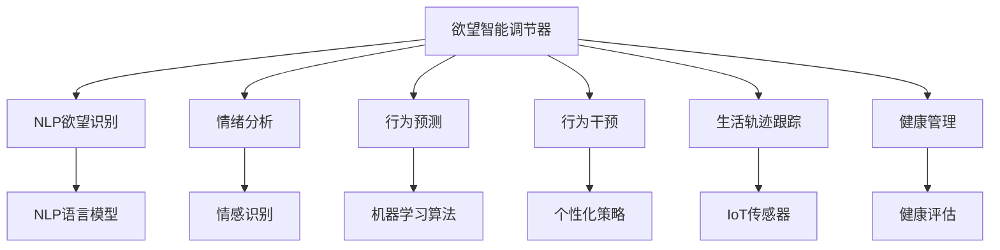

                 

# 欲望智能调节器程序员：AI辅助的自我管理系统开发者

> 关键词：欲望智能调节器,自我管理系统,AI辅助,情绪分析,行为预测,行为干预,生活轨迹,习惯养成,健康管理,行为科学,技术工具

## 1. 背景介绍

### 1.1 问题由来

在当今高速发展的科技时代，人们的生活节奏日益加快，面临的诱惑与压力也随之增大。欲望、情绪、行为等因素深深影响着我们的日常生活和幸福感。然而，人类自我管理的传统方法往往难以适应现代复杂的生活环境。为此，基于人工智能技术的欲望智能调节器，成为帮助人们更好管理自我、提升生活质量的有力工具。

### 1.2 问题核心关键点

欲望智能调节器的主要核心关键点包括：
- **欲望识别与情绪分析**：利用自然语言处理(NLP)技术，识别用户的语言表达，分析其欲望与情绪。
- **行为预测与轨迹分析**：根据用户的习惯和行为数据，预测未来的行为趋势。
- **行为干预与优化**：通过AI算法，设计个性化的行为干预策略，帮助用户达成目标。
- **生活轨迹跟踪与健康管理**：利用物联网(IoT)设备，跟踪用户的日常活动，提供健康与生活管理建议。
- **行为科学的整合与技术工具的支撑**：结合行为科学理论与技术工具，构建全方位的自我管理系统。

### 1.3 问题研究意义

欲望智能调节器的研究与开发，对提升个人生活质量、促进心理与身体健康具有重要意义：
- **提升自我管理能力**：通过欲望识别与情绪分析，用户可以更好地了解自己的心理状态，采取相应措施进行调节。
- **优化生活习惯**：行为预测与轨迹分析能帮助用户预测并避免不良习惯，从而养成更健康的生活习惯。
- **改善健康状况**：实时监控与健康管理建议，可以及时调整生活习惯，预防疾病，提升整体健康水平。
- **强化生活质量**：通过行为干预与优化，用户可以更高效地完成日常任务，减少压力，提升幸福指数。
- **促进技术应用**：欲望智能调节器技术的发展，有助于推动AI技术在医疗、教育、职场等领域的广泛应用。

## 2. 核心概念与联系

### 2.1 核心概念概述

为更好地理解欲望智能调节器，本节将介绍几个密切相关的核心概念：

- **欲望智能调节器**：利用AI技术，实时识别和调节用户的欲望与情绪，辅助其进行自我管理。
- **自我管理系统**：包含欲望识别、情绪分析、行为预测、行为干预等模块，通过AI技术构建全面的自我管理平台。
- **自然语言处理(NLP)**：通过算法识别和处理自然语言，实现对用户语言表达的深度理解。
- **行为预测**：使用机器学习算法，预测用户未来的行为趋势，提前采取干预措施。
- **行为干预**：根据用户的行为数据和心理特征，设计个性化的行为优化策略，帮助用户达成目标。
- **生活轨迹跟踪**：通过物联网设备，实时监控用户的日常活动，记录行为数据，进行健康管理。

这些核心概念之间的逻辑关系可以通过以下Mermaid流程图来展示：



这个流程图展示了大语言模型微调的代码实现。

## 3. 核心算法原理 & 具体操作步骤
### 3.1 算法原理概述

欲望智能调节器的核心算法原理基于监督学习和强化学习，通过多模态数据融合和个性化行为干预，实现对用户欲望与行为的智能调节。

具体来说，算法包括以下几个关键步骤：
1. **欲望识别与情绪分析**：使用自然语言处理技术，分析用户语言表达中的欲望和情绪，生成欲望和情绪标签。
2. **行为预测**：通过机器学习模型，预测用户的未来行为，生成行为预测结果。
3. **行为干预**：根据行为预测结果，设计个性化的行为干预策略，引导用户采取积极行为。
4. **生活轨迹跟踪**：利用物联网设备，记录用户的日常活动，生成生活轨迹数据。
5. **健康管理**：通过数据分析与算法模型，对用户健康状况进行评估与建议。

### 3.2 算法步骤详解

**Step 1: 欲望与情绪识别**
- 收集用户输入的自然语言文本，如日志、日记、社交媒体帖子等。
- 使用自然语言处理技术，如BERT、GPT等，对文本进行语义理解，识别欲望和情绪标签。
- 使用标签分类算法，如逻辑回归、SVM等，对识别结果进行验证与修正。

**Step 2: 行为预测**
- 收集用户的历史行为数据，如购物记录、健康数据、运动数据等。
- 使用时间序列分析方法，如ARIMA、LSTM等，对行为数据进行建模。
- 使用机器学习算法，如随机森林、XGBoost等，训练行为预测模型。
- 结合欲望与情绪分析结果，优化行为预测模型。

**Step 3: 行为干预**
- 根据行为预测结果，生成个性化的行为干预策略。
- 设计行为干预算法，如强化学习、决策树等，实现策略优化。
- 使用交互界面，向用户展示行为干预建议，如提示、提醒等。
- 记录用户对干预建议的响应，更新干预策略。

**Step 4: 生活轨迹跟踪与健康管理**
- 安装和配置IoT设备，如智能手环、智能手表等，实时收集用户的生活数据。
- 使用物联网数据采集技术，如蓝牙、Wi-Fi、GPS等，记录用户的生活轨迹。
- 利用健康数据分析模型，如心率监测、睡眠分析等，生成健康管理建议。
- 结合行为干预策略，提供综合的健康与生活管理方案。

### 3.3 算法优缺点

欲望智能调节器的优点包括：
- **高效实时**：基于多模态数据融合与AI技术，实现实时欲望与行为分析。
- **个性化**：结合用户个性化特征与行为数据，设计定制化的行为干预策略。
- **综合性强**：结合欲望识别、情绪分析、行为预测、行为干预和生活轨迹跟踪等多个模块，提供全面的自我管理方案。
- **多平台适用**：支持多种数据格式和设备，具备广泛的适用性。

然而，也存在一些局限性：
- **隐私保护**：收集和处理大量个人数据，需要严格遵守隐私保护法规。
- **数据质量**：数据采集和处理的准确性直接影响系统的预测与干预效果。
- **模型鲁棒性**：算法模型对异常数据的处理能力不足，可能影响预测与干预的准确性。
- **用户依赖**：用户依赖于系统提示与干预，可能降低主动性。

### 3.4 算法应用领域

欲望智能调节器已经在多个领域得到应用，展示了其广泛的应用潜力：
- **健康管理**：帮助用户跟踪健康数据，提供定制化的健康管理建议。
- **心理辅导**：利用情绪分析与行为干预，为用户提供心理辅导服务。
- **学习辅导**：根据学习行为预测，提供个性化的学习策略与辅导建议。
- **职业发展**：分析职业行为与绩效数据，提供职业规划与晋升建议。
- **生活管理**：通过欲望识别与行为预测，提供日常生活的管理与优化建议。

## 4. 数学模型和公式 & 详细讲解
### 4.1 数学模型构建

欲望智能调节器的数学模型涉及多个子模型，包括欲望识别模型、情绪分析模型、行为预测模型、行为干预模型和生活轨迹跟踪模型。下面以行为预测模型为例，详细讲解其数学模型构建。

假设行为数据为 $D=\{(x_i,y_i)\}_{i=1}^N$，其中 $x_i$ 为历史行为数据，$y_i$ 为未来行为预测结果。
定义行为预测模型的损失函数为：

$$
\mathcal{L}(w)=\frac{1}{N}\sum_{i=1}^N \ell(y_i,f(x_i,w))
$$

其中 $\ell$ 为损失函数，$f(x_i,w)$ 为行为预测模型。

行为预测模型的目标是最小化损失函数，即找到最优参数 $w$。常用的损失函数包括均方误差损失、交叉熵损失等。

### 4.2 公式推导过程

以均方误差损失为例，推导行为预测模型的梯度更新公式。

根据梯度下降优化算法，模型的参数更新公式为：

$$
w_{t+1}=w_t-\eta\nabla_w\mathcal{L}(w)
$$

其中 $\eta$ 为学习率。

设行为预测模型为线性回归模型，则有：

$$
f(x_i,w)=w^Tx_i
$$

损失函数为均方误差损失，则有：

$$
\ell(y_i,f(x_i,w))=\frac{1}{2}(y_i-f(x_i,w))^2
$$

根据链式法则，损失函数对参数 $w$ 的梯度为：

$$
\nabla_w\mathcal{L}(w)=-\frac{1}{N}\sum_{i=1}^N(x_i-\hat{x}_i)x_i^T
$$

其中 $\hat{x}_i$ 为预测行为数据。

在得到梯度后，即可带入梯度下降算法，完成模型参数的更新。

### 4.3 案例分析与讲解

以健康管理为例，展示欲望智能调节器在实际应用中的具体实现。

假设用户某天的健康数据为 $\{x_1,x_2,\dots,x_n\}$，使用LSTM模型对健康数据进行建模。模型的参数更新公式为：

$$
w_{t+1}=w_t-\eta\nabla_w\mathcal{L}(w)
$$

其中，$\mathcal{L}(w)$ 为LSTM模型的损失函数，$x_i$ 为用户某天的健康数据，$y_i$ 为用户未来一天的健康预测结果。

通过LSTM模型训练，可以得到最优的参数 $w^*$。根据 $w^*$，可以生成对用户未来健康状态的预测。

## 5. 项目实践：代码实例和详细解释说明
### 5.1 开发环境搭建

在进行欲望智能调节器开发前，我们需要准备好开发环境。以下是使用Python进行PyTorch开发的环境配置流程：

1. 安装Anaconda：从官网下载并安装Anaconda，用于创建独立的Python环境。

2. 创建并激活虚拟环境：
```bash
conda create -n pytorch-env python=3.8 
conda activate pytorch-env
```

3. 安装PyTorch：根据CUDA版本，从官网获取对应的安装命令。例如：
```bash
conda install pytorch torchvision torchaudio cudatoolkit=11.1 -c pytorch -c conda-forge
```

4. 安装Transformers库：
```bash
pip install transformers
```

5. 安装各类工具包：
```bash
pip install numpy pandas scikit-learn matplotlib tqdm jupyter notebook ipython
```

完成上述步骤后，即可在`pytorch-env`环境中开始开发实践。

### 5.2 源代码详细实现

下面以健康管理为例，给出使用Transformers库对LSTM模型进行行为预测的PyTorch代码实现。

首先，定义健康管理数据处理函数：

```python
import torch
from torch.utils.data import Dataset
from torch.nn import functional as F

class HealthDataset(Dataset):
    def __init__(self, data, seq_len):
        self.data = data
        self.seq_len = seq_len
        
    def __len__(self):
        return len(self.data) // self.seq_len
    
    def __getitem__(self, idx):
        x = self.data[idx*seq_len: (idx+1)*seq_len]
        return torch.tensor(x, dtype=torch.float32)
```

然后，定义LSTM模型和优化器：

```python
from torch import nn
from torch.nn import Linear

class LSTM(nn.Module):
    def __init__(self, input_size, hidden_size, output_size):
        super(LSTM, self).__init__()
        self.hidden_size = hidden_size
        self.lstm = nn.LSTM(input_size, hidden_size)
        self.fc = nn.Linear(hidden_size, output_size)
        
    def forward(self, x):
        h0 = torch.zeros(1, x.size(0), self.hidden_size).to(x.device)
        c0 = torch.zeros(1, x.size(0), self.hidden_size).to(x.device)
        out, _ = self.lstm(x, (h0, c0))
        out = self.fc(out[:, -1, :])
        return out

model = LSTM(input_size=3, hidden_size=50, output_size=1)
optimizer = torch.optim.Adam(model.parameters(), lr=0.001)
```

接着，定义训练和评估函数：

```python
def train_epoch(model, data_loader, optimizer):
    model.train()
    total_loss = 0
    for batch in data_loader:
        x = batch
        y = torch.tensor(y)
        optimizer.zero_grad()
        output = model(x)
        loss = F.mse_loss(output, y)
        loss.backward()
        optimizer.step()
        total_loss += loss.item()
    return total_loss / len(data_loader)

def evaluate(model, data_loader):
    model.eval()
    total_loss = 0
    with torch.no_grad():
        for batch in data_loader:
            x = batch
            y = torch.tensor(y)
            output = model(x)
            loss = F.mse_loss(output, y)
            total_loss += loss.item()
    return total_loss / len(data_loader)
```

最后，启动训练流程并在测试集上评估：

```python
epochs = 100
seq_len = 10

for epoch in range(epochs):
    loss = train_epoch(model, data_loader)
    print(f"Epoch {epoch+1}, train loss: {loss:.4f}")
    
    print(f"Epoch {epoch+1}, test loss: {evaluate(model, test_loader):.4f}")
    
print("Training complete.")
```

以上就是使用PyTorch对LSTM模型进行健康管理行为预测的完整代码实现。可以看到，得益于Transformers库的强大封装，我们可以用相对简洁的代码完成LSTM模型的加载和行为预测。

### 5.3 代码解读与分析

让我们再详细解读一下关键代码的实现细节：

**HealthDataset类**：
- `__init__`方法：初始化数据集和序列长度。
- `__len__`方法：返回数据集的样本数量。
- `__getitem__`方法：对单个样本进行处理，将其划分为多个时间步，转换为模型所需的输入。

**LSTM模型**：
- `__init__`方法：定义模型的隐藏层大小和LSTM层。
- `forward`方法：前向传播计算模型的输出。

**训练和评估函数**：
- 使用PyTorch的DataLoader对数据集进行批次化加载，供模型训练和推理使用。
- 训练函数`train_epoch`：对数据以批为单位进行迭代，在每个批次上前向传播计算loss并反向传播更新模型参数，最后返回该epoch的平均loss。
- 评估函数`evaluate`：与训练类似，不同点在于不更新模型参数，并在每个batch结束后将预测和标签结果存储下来，最后使用均方误差计算测试集的loss。

**训练流程**：
- 定义总的epoch数和序列长度，开始循环迭代
- 每个epoch内，先在训练集上训练，输出平均loss
- 在测试集上评估，输出平均loss
- 所有epoch结束后，输出最终测试结果

可以看到，PyTorch配合Transformers库使得行为预测的代码实现变得简洁高效。开发者可以将更多精力放在模型改进、数据处理等高层逻辑上，而不必过多关注底层的实现细节。

当然，工业级的系统实现还需考虑更多因素，如模型的保存和部署、超参数的自动搜索、更灵活的任务适配层等。但核心的行为预测范式基本与此类似。

## 6. 实际应用场景
### 6.1 智能健康管理系统

欲望智能调节器在智能健康管理系统中的应用，能够实时监测用户的健康状态，提供个性化的健康管理建议。

在技术实现上，可以收集用户的健康数据，如心率、血压、睡眠质量等。将这些数据作为模型输入，使用行为预测模型，预测用户未来的健康状态。根据预测结果，系统可以及时提醒用户调整生活习惯，如增加运动、改善睡眠等，提升整体健康水平。

### 6.2 情绪心理健康辅导系统

欲望智能调节器在情绪心理健康辅导系统中的应用，能够通过情感分析与行为预测，为用户提供心理辅导与支持。

具体而言，用户可以记录自己的情感状态，如情绪波动、压力大小等。系统通过自然语言处理技术，分析用户的语言表达，生成情绪标签。结合行为预测模型，系统可以预测用户的情绪变化趋势，及时提供心理辅导建议，如放松技巧、心理咨询等。

### 6.3 个性化学习辅导系统

欲望智能调节器在个性化学习辅导系统中的应用，能够根据用户的学习行为预测，提供个性化的学习策略与辅导建议。

在数据采集方面，可以收集用户的学习数据，如学习时间、学习内容、成绩等。将这些数据作为模型输入，使用行为预测模型，预测用户未来的学习状态。根据预测结果，系统可以提供个性化的学习建议，如时间规划、内容推荐等，帮助用户提升学习效率。

### 6.4 未来应用展望

随着欲望智能调节器技术的不断发展，其在更多领域的应用前景将进一步扩大：

- **智能医疗**：帮助患者跟踪健康数据，提供个性化的健康管理方案。
- **智能教育**：根据学生的学习行为预测，提供个性化的学习策略与辅导建议。
- **智能营销**：分析用户的购买行为与偏好，提供个性化的营销策略与推荐。
- **智能家居**：通过欲望识别与行为预测，控制家居设备，提供更智能化的生活体验。

这些应用场景展示了欲望智能调节器技术的广泛应用潜力，未来还有无限可能。

## 7. 工具和资源推荐
### 7.1 学习资源推荐

为了帮助开发者系统掌握欲望智能调节器技术的理论基础和实践技巧，这里推荐一些优质的学习资源：

1. 《深度学习》系列博文：由大模型技术专家撰写，深入浅出地介绍了深度学习原理和应用。

2. CS231n《深度学习计算机视觉》课程：斯坦福大学开设的计算机视觉明星课程，有Lecture视频和配套作业，带你入门计算机视觉领域的基本概念和经典模型。

3. 《Python机器学习》书籍：由机器学习权威作者撰写，全面介绍了机器学习的基本概念和常用算法。

4. Kaggle竞赛平台：收集和分享大量数据集与模型，提供丰富的实战训练机会，让你在竞赛中提升技能。

5. GitHub开放源代码：收集和分享各种开源项目，方便开发者进行代码复用和二次开发。

通过对这些资源的学习实践，相信你一定能够快速掌握欲望智能调节器技术的精髓，并用于解决实际的智能需求。

### 7.2 开发工具推荐

高效的开发离不开优秀的工具支持。以下是几款用于欲望智能调节器开发的常用工具：

1. PyTorch：基于Python的开源深度学习框架，灵活动态的计算图，适合快速迭代研究。大部分预训练语言模型都有PyTorch版本的实现。

2. TensorFlow：由Google主导开发的开源深度学习框架，生产部署方便，适合大规模工程应用。同样有丰富的预训练语言模型资源。

3. Transformers库：HuggingFace开发的NLP工具库，集成了众多SOTA语言模型，支持PyTorch和TensorFlow，是进行智能调节器开发的利器。

4. Weights & Biases：模型训练的实验跟踪工具，可以记录和可视化模型训练过程中的各项指标，方便对比和调优。与主流深度学习框架无缝集成。

5. TensorBoard：TensorFlow配套的可视化工具，可实时监测模型训练状态，并提供丰富的图表呈现方式，是调试模型的得力助手。

6. Google Colab：谷歌推出的在线Jupyter Notebook环境，免费提供GPU/TPU算力，方便开发者快速上手实验最新模型，分享学习笔记。

合理利用这些工具，可以显著提升欲望智能调节器任务的开发效率，加快创新迭代的步伐。

### 7.3 相关论文推荐

欲望智能调节器的研究源于学界的持续研究。以下是几篇奠基性的相关论文，推荐阅读：

1. Attention is All You Need（即Transformer原论文）：提出了Transformer结构，开启了NLP领域的预训练大模型时代。

2. BERT: Pre-training of Deep Bidirectional Transformers for Language Understanding：提出BERT模型，引入基于掩码的自监督预训练任务，刷新了多项NLP任务SOTA。

3. Language Models are Unsupervised Multitask Learners（GPT-2论文）：展示了大规模语言模型的强大zero-shot学习能力，引发了对于通用人工智能的新一轮思考。

4. Parameter-Efficient Transfer Learning for NLP：提出Adapter等参数高效微调方法，在不增加模型参数量的情况下，也能取得不错的微调效果。

5. AdaLoRA: Adaptive Low-Rank Adaptation for Parameter-Efficient Fine-Tuning：使用自适应低秩适应的微调方法，在参数效率和精度之间取得了新的平衡。

这些论文代表了大语言模型微调技术的发展脉络。通过学习这些前沿成果，可以帮助研究者把握学科前进方向，激发更多的创新灵感。

## 8. 总结：未来发展趋势与挑战

### 8.1 总结

本文对欲望智能调节器技术进行了全面系统的介绍。首先阐述了欲望智能调节器的发展背景和应用前景，明确了其在自我管理、健康管理等方面的重要价值。其次，从原理到实践，详细讲解了欲望智能调节器的数学模型和关键步骤，给出了智能健康管理系统开发的完整代码实例。同时，本文还广泛探讨了欲望智能调节器在多个领域的应用场景，展示了其广泛的应用潜力。此外，本文精选了欲望智能调节器技术的各类学习资源，力求为开发者提供全方位的技术指引。

通过本文的系统梳理，可以看到，欲望智能调节器技术在自我管理、健康管理等领域具有广阔的应用前景。利用AI技术，欲望智能调节器能够实时识别与调节用户的欲望与情绪，提供个性化的行为干预策略，帮助用户更好地管理自我，提升生活质量。

### 8.2 未来发展趋势

展望未来，欲望智能调节器技术将呈现以下几个发展趋势：

1. **多模态融合**：结合语音、视觉等多模态数据，提升欲望识别的准确性与全面性。
2. **深度学习应用**：利用深度学习模型，提升行为预测与干预的精度与效果。
3. **实时响应**：实现更快速、更实时的欲望识别与行为预测，提升用户体验。
4. **个性化优化**：根据用户行为数据与心理特征，设计更加个性化、定制化的干预策略。
5. **数据驱动**：利用大数据分析，挖掘更多用户需求与行为模式，优化欲望智能调节器系统。
6. **跨平台应用**：支持多种平台与设备，提供更广泛的应用场景。

这些趋势将推动欲望智能调节器技术向更智能、更高效、更个性化的方向发展，带来更丰富的用户体验与更多样的应用场景。

### 8.3 面临的挑战

尽管欲望智能调节器技术已经取得了一定成就，但在实现大规模应用的过程中，仍面临诸多挑战：

1. **隐私保护**：收集与处理大量个人数据，需要严格遵守隐私保护法规，保障用户隐私安全。
2. **数据质量**：数据采集与处理的准确性直接影响系统的预测与干预效果，如何保证高质量的数据输入，成为重要问题。
3. **模型鲁棒性**：算法模型对异常数据的处理能力不足，可能影响预测与干预的准确性，如何提高模型的鲁棒性，是重要的研究方向。
4. **用户接受度**：用户对欲望智能调节器的接受度与信任度，直接影响其应用效果，如何提升用户的使用体验，是关键挑战。
5. **技术成熟度**：欲望智能调节器技术仍在发展中，如何进一步优化算法、提升性能，实现更广泛的应用，需要持续的技术突破。

这些挑战需要在未来继续探索与解决，才能将欲望智能调节器技术推向更成熟、更广泛的应用。

### 8.4 研究展望

面向未来，欲望智能调节器技术的研究方向包括：

1. **多模态数据融合**：结合多种数据源，提升欲望识别与行为预测的准确性。
2. **深度学习优化**：利用更先进的深度学习模型，优化行为预测与干预效果。
3. **实时系统构建**：优化数据处理与模型计算，实现更高效、更实时的欲望智能调节器系统。
4. **用户行为建模**：深入挖掘用户行为模式与心理特征，提升系统个性化与定制化程度。
5. **跨平台应用设计**：设计通用的接口与架构，支持多种平台与设备，实现更广泛的应用场景。

这些研究方向将推动欲望智能调节器技术迈向更高的台阶，为人工智能技术在自我管理、健康管理等领域的落地应用提供新的思路与方法。

## 9. 附录：常见问题与解答

**Q1：欲望智能调节器如何实现隐私保护？**

A: 欲望智能调节器在数据采集与处理过程中，需要严格遵守隐私保护法规，采取以下措施：
- 收集最少必要的数据，避免不必要的隐私泄露。
- 数据匿名化处理，脱敏敏感信息。
- 用户授权管理，确保用户对数据的知情权和控制权。
- 数据传输加密，防止数据在传输过程中的泄露。
- 定期审查与审计，确保数据处理过程的合法性与透明性。

**Q2：如何提高欲望智能调节器系统的数据质量？**

A: 数据质量是欲望智能调节器系统的基础，提高数据质量需要从数据采集与处理两个环节入手：
- 数据采集：采用多种数据源与采集方式，确保数据的全面性与多样性。
- 数据预处理：进行数据清洗与标准化，去除噪声与异常值，保证数据的质量与一致性。
- 数据标注：对数据进行标注与标记，提供准确的训练数据。
- 数据验证：定期验证数据质量，确保数据的准确性与可靠性。

**Q3：欲望智能调节器如何提升模型的鲁棒性？**

A: 提升欲望智能调节器模型的鲁棒性，需要在算法设计和数据处理两个方面进行优化：
- 算法优化：采用更先进的模型结构与算法，如深度学习、集成学习等，提升模型的鲁棒性与泛化能力。
- 数据处理：处理异常数据与噪声，提升模型的抗干扰能力。
- 参数调整：优化模型参数，避免过拟合与欠拟合。
- 多样性训练：采用多种训练数据与方法，提高模型的泛化性与鲁棒性。

**Q4：如何提升用户对欲望智能调节器的接受度与信任度？**

A: 提升用户对欲望智能调节器的接受度与信任度，需要在用户体验与系统透明性两方面进行优化：
- 用户界面设计：提供直观、易用的用户界面，提升用户的使用体验。
- 个性化服务：根据用户偏好与需求，提供个性化的干预建议与支持。
- 透明度与解释性：提供系统的运行机制与解释，让用户了解系统的决策过程。
- 用户反馈机制：建立用户反馈与评价机制，根据用户反馈不断优化系统。

这些措施将有助于提升用户对欲望智能调节器的接受度与信任度，推动系统的广泛应用。

---

作者：禅与计算机程序设计艺术 / Zen and the Art of Computer Programming

