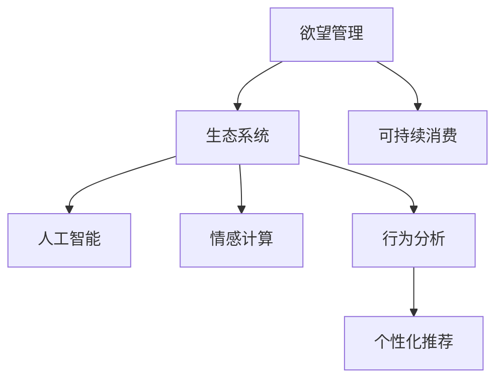

                 

# 欲望生态系统管理：AI驱动的可持续消费指导

> 关键词：欲望管理,生态系统,可持续消费,人工智能,情感计算,行为分析,个性化推荐

## 1. 背景介绍

### 1.1 问题由来

在21世纪，人类社会的消费模式发生了翻天覆地的变化。随着信息技术的飞速发展，消费者能够轻松获取海量商品和服务信息，购物渠道和方式日益多样化，个性化需求不断增强。然而，过度的物质追求和对资源的过度消耗，给地球生态环境带来了巨大的压力。因此，如何在满足消费者个性化需求的同时，推动可持续消费，成为当下亟需解决的重要问题。

### 1.2 问题核心关键点

可持续消费的核心在于平衡消费需求与环境保护之间的关系，核心关键点包括：

- **需求理解**：如何准确识别和理解消费者的欲望和需求？
- **行为分析**：消费者在消费过程中的行为模式和心理特征是什么？
- **策略制定**：基于数据分析，如何制定个性化推荐策略，引导可持续消费行为？
- **效果评估**：如何评估个性化推荐策略的效果，并不断优化？

### 1.3 问题研究意义

深入理解消费者的欲望和行为，并结合AI技术进行个性化推荐，不仅有助于实现绿色消费，还能提升消费者的满意度和忠诚度。这不仅能解决环境问题，还能推动企业商业模式的转型升级，具有重要的社会和经济意义。

## 2. 核心概念与联系

### 2.1 核心概念概述

为更好地理解AI驱动的可持续消费指导，本节将介绍几个密切相关的核心概念：

- **欲望管理**：指通过数据和技术手段，理解和分析消费者的欲望和需求，从而制定相应的消费策略，引导其向可持续消费方向转变。
- **生态系统**：不仅指自然界的生态系统，也比喻社会经济系统。通过数据分析和AI技术，可以构建虚拟生态系统，模拟并优化资源流动和行为模式。
- **可持续消费**：指在满足当前消费需求的同时，不损害后代满足需求的能力。核心在于绿色、低碳、节能和可循环的消费理念。
- **人工智能**：利用计算机算法和大数据技术，模拟人类智能行为，提升消费决策的精准性和效率。
- **情感计算**：通过分析消费者的情感状态，预测其行为模式，实现更个性化的推荐。
- **行为分析**：分析消费者在消费过程中的行为特征，如购买频率、偏好等，为个性化推荐提供依据。
- **个性化推荐**：根据消费者的个性化需求和行为特征，提供定制化的商品和服务推荐，提升消费体验。

这些核心概念之间的逻辑关系可以通过以下Mermaid流程图来展示：



这个流程图展示了大语言模型的核心概念及其之间的关系：

1. 欲望管理通过数据和技术手段，理解和分析消费者的欲望和需求。
2. 生态系统构建虚拟生态系统，模拟并优化资源流动和行为模式。
3. 可持续消费旨在平衡消费需求与环境保护之间的关系。
4. 人工智能利用计算机算法和大数据技术，模拟人类智能行为。
5. 情感计算通过分析消费者的情感状态，预测其行为模式。
6. 行为分析分析消费者在消费过程中的行为特征。
7. 个性化推荐根据消费者的个性化需求和行为特征，提供定制化的商品和服务推荐。

这些概念共同构成了AI驱动的可持续消费指导框架，使得系统能够更好地理解和满足消费者的需求，同时实现绿色环保的目标。

## 3. 核心算法原理 & 具体操作步骤

### 3.1 算法原理概述

AI驱动的可持续消费指导，本质上是基于数据分析和机器学习技术，对消费者欲望和行为进行建模和预测，从而制定个性化推荐策略，引导消费者向可持续消费方向转变的过程。其核心算法包括以下几个方面：

- **数据分析**：通过收集消费者的历史行为数据，分析其消费偏好、频率、时间等特征。
- **情感分析**：利用情感计算技术，分析消费者在社交媒体、评论等渠道上的情感状态，预测其后续行为。
- **行为预测**：基于历史行为数据和情感状态，预测消费者的未来行为模式。
- **策略制定**：根据消费者的行为预测结果，制定个性化推荐策略，引导可持续消费。
- **效果评估**：通过跟踪消费者行为，评估个性化推荐策略的效果，不断优化推荐算法。

### 3.2 算法步骤详解

基于AI驱动的可持续消费指导算法，一般包括以下几个关键步骤：

**Step 1: 数据收集与预处理**

- 收集消费者的历史行为数据，包括购买记录、浏览记录、评价反馈等。
- 清洗和归一化数据，去除噪声和异常值，确保数据的质量。
- 将数据划分为训练集、验证集和测试集，进行交叉验证。

**Step 2: 特征工程**

- 提取消费者行为和情感特征，如消费频率、偏好、情感极性等。
- 选择合适的特征工程方法，如PCA、特征选择等，降维并优化特征。

**Step 3: 模型训练**

- 选择合适的机器学习模型，如分类、回归、聚类等，训练数据集。
- 使用交叉验证方法，评估模型的泛化能力，选择最优模型。

**Step 4: 策略制定**

- 根据训练好的模型，预测消费者的行为模式。
- 根据预测结果，制定个性化推荐策略，如绿色产品推荐、节能方案等。

**Step 5: 效果评估**

- 在测试集上评估个性化推荐策略的效果，使用各种评估指标，如准确率、召回率等。
- 根据评估结果，调整模型参数和推荐策略，不断优化。

### 3.3 算法优缺点

AI驱动的可持续消费指导算法具有以下优点：

- **个性化推荐**：通过分析消费者的个性化需求和行为特征，提供定制化的推荐，提升消费体验。
- **行为预测**：利用历史数据和情感分析，预测消费者未来行为，制定有效策略。
- **动态调整**：根据消费者反馈和行为变化，动态调整推荐策略，确保策略的有效性。

同时，该算法也存在一定的局限性：

- **数据依赖**：算法的效果很大程度上依赖于数据的全面性和质量。
- **模型复杂性**：机器学习模型和特征工程的复杂性较高，需要专业知识支持。
- **隐私风险**：消费者数据的收集和使用涉及隐私问题，需严格遵守相关法规。
- **短期效果**：个性化推荐策略可能在短期内有效，但长期效果需持续评估和优化。

尽管存在这些局限性，但就目前而言，基于AI驱动的可持续消费指导算法仍是最主流的方法之一。未来相关研究的重点在于如何进一步提升数据收集的全面性和质量，降低模型复杂性，确保数据隐私安全，并增强策略的长期有效性。

### 3.4 算法应用领域

基于AI驱动的可持续消费指导算法，已经在多个领域得到了广泛应用，包括：

- **电商平台**：通过个性化推荐，引导消费者购买绿色、节能产品，推动环保消费。
- **能源公司**：分析用户能源使用行为，提供节能方案和推荐，优化能源使用效率。
- **旅游行业**：推荐环保旅游目的地和绿色出行方式，引导绿色旅游消费。
- **交通领域**：优化出行路线和交通工具选择，推广低碳出行方式。

除了上述这些经典应用外，AI驱动的可持续消费指导技术还在更多领域得到创新性应用，如智慧城市、智能家居等，为绿色消费提供了新的解决方案。随着技术的不断进步，该技术将在更多领域得到应用，为绿色消费和可持续发展贡献力量。

## 4. 数学模型和公式 & 详细讲解  
### 4.1 数学模型构建

本节将使用数学语言对基于AI驱动的可持续消费指导算法进行更加严格的刻画。

记消费者的历史行为数据为 $D=\{(x_i, y_i)\}_{i=1}^N$，其中 $x_i$ 为行为特征，$y_i$ 为消费行为（如购买、浏览、评价等）。定义模型 $M$ 的输入为 $x$，输出为 $y$，目标是最小化模型预测错误率。

假设模型为线性回归模型，则数学表达式为：

$$
\hat{y} = \theta^T x
$$

其中 $\theta$ 为模型参数，$x$ 为特征向量，$\hat{y}$ 为预测值。目标函数为：

$$
\mathcal{L}(\theta) = \frac{1}{N} \sum_{i=1}^N (y_i - \hat{y}_i)^2
$$

在实际应用中，我们通常使用梯度下降等优化算法来近似求解上述最优化问题。设 $\eta$ 为学习率，$\lambda$ 为正则化系数，则参数的更新公式为：

$$
\theta \leftarrow \theta - \eta \nabla_{\theta}\mathcal{L}(\theta) - \eta\lambda\theta
$$

其中 $\nabla_{\theta}\mathcal{L}(\theta)$ 为损失函数对参数 $\theta$ 的梯度，可通过反向传播算法高效计算。

### 4.2 公式推导过程

以线性回归为例，推导损失函数及其梯度的计算公式。

假设模型 $M_{\theta}$ 在输入 $x$ 上的输出为 $\hat{y}=M_{\theta}(x) \in \mathbb{R}$，真实标签 $y \in \mathbb{R}$。则线性回归模型的损失函数为：

$$
\ell(M_{\theta}(x),y) = \frac{1}{2}(y - M_{\theta}(x))^2
$$

将其代入经验风险公式，得：

$$
\mathcal{L}(\theta) = \frac{1}{N}\sum_{i=1}^N (y_i - M_{\theta}(x_i))^2
$$

根据链式法则，损失函数对参数 $\theta$ 的梯度为：

$$
\frac{\partial \mathcal{L}(\theta)}{\partial \theta} = -\frac{1}{N}\sum_{i=1}^N 2(y_i - M_{\theta}(x_i))x_i
$$

在得到损失函数的梯度后，即可带入参数更新公式，完成模型的迭代优化。重复上述过程直至收敛，最终得到适应下游任务的最优模型参数 $\theta^*$。

## 5. 项目实践：代码实例和详细解释说明
### 5.1 开发环境搭建

在进行可持续消费指导算法开发前，我们需要准备好开发环境。以下是使用Python进行PyTorch开发的环境配置流程：

1. 安装Anaconda：从官网下载并安装Anaconda，用于创建独立的Python环境。

2. 创建并激活虚拟环境：
```bash
conda create -n pytorch-env python=3.8 
conda activate pytorch-env
```

3. 安装PyTorch：根据CUDA版本，从官网获取对应的安装命令。例如：
```bash
conda install pytorch torchvision torchaudio cudatoolkit=11.1 -c pytorch -c conda-forge
```

4. 安装相关的库：
```bash
pip install pandas numpy scikit-learn sklearn
```

完成上述步骤后，即可在`pytorch-env`环境中开始开发实践。

### 5.2 源代码详细实现

下面我们以电商平台推荐系统为例，给出使用Transformers库对消费者行为进行建模和预测的PyTorch代码实现。

首先，定义模型和优化器：

```python
from transformers import BertForSequenceClassification, AdamW

model = BertForSequenceClassification.from_pretrained('bert-base-uncased', num_labels=2)

optimizer = AdamW(model.parameters(), lr=2e-5)
```

接着，定义训练和评估函数：

```python
from torch.utils.data import DataLoader
from sklearn.metrics import accuracy_score

device = torch.device('cuda') if torch.cuda.is_available() else torch.device('cpu')
model.to(device)

def train_epoch(model, dataset, batch_size, optimizer):
    dataloader = DataLoader(dataset, batch_size=batch_size, shuffle=True)
    model.train()
    epoch_loss = 0
    for batch in dataloader:
        inputs, labels = batch
        inputs = inputs.to(device)
        labels = labels.to(device)
        outputs = model(inputs)
        loss = outputs.loss
        epoch_loss += loss.item()
        loss.backward()
        optimizer.step()
    return epoch_loss / len(dataloader)

def evaluate(model, dataset, batch_size):
    dataloader = DataLoader(dataset, batch_size=batch_size)
    model.eval()
    preds, labels = [], []
    with torch.no_grad():
        for batch in dataloader:
            inputs, labels = batch
            inputs = inputs.to(device)
            labels = labels.to(device)
            outputs = model(inputs)
            batch_preds = outputs.logits.argmax(dim=1).to('cpu').tolist()
            batch_labels = labels.to('cpu').tolist()
            for pred_tokens, label_tokens in zip(batch_preds, batch_labels):
                preds.append(pred_tokens)
                labels.append(label_tokens)
                
    print(accuracy_score(labels, preds))
```

最后，启动训练流程并在测试集上评估：

```python
epochs = 5
batch_size = 16

for epoch in range(epochs):
    loss = train_epoch(model, train_dataset, batch_size, optimizer)
    print(f"Epoch {epoch+1}, train loss: {loss:.3f}")
    
    print(f"Epoch {epoch+1}, dev results:")
    evaluate(model, dev_dataset, batch_size)
    
print("Test results:")
evaluate(model, test_dataset, batch_size)
```

以上就是使用PyTorch对消费者行为进行建模和预测的完整代码实现。可以看到，得益于Transformers库的强大封装，我们可以用相对简洁的代码完成模型训练和评估。

### 5.3 代码解读与分析

让我们再详细解读一下关键代码的实现细节：

**BertForSequenceClassification**：
- 定义了序列分类模型，适合对连续的输入数据进行分类任务。

**AdamW**：
- 定义了AdamW优化器，支持权重衰减和动量项。

**train_epoch**：
- 定义了训练函数，用于在每个epoch内对模型进行训练，计算损失并更新参数。

**evaluate**：
- 定义了评估函数，用于在测试集上评估模型性能，计算准确率。

**模型加载与优化器设置**：
- 使用BertForSequenceClassification从预训练模型中加载模型，使用AdamW优化器进行参数更新。

**数据加载与模型训练**：
- 使用PyTorch的DataLoader对数据进行批处理，模型在每个batch上进行前向传播和反向传播。

**评估与输出结果**：
- 在测试集上评估模型性能，使用accuracy_score计算准确率。

**训练流程**：
- 定义总的epoch数和batch size，开始循环迭代
- 每个epoch内，先在训练集上训练，输出平均loss
- 在验证集上评估，输出准确率
- 所有epoch结束后，在测试集上评估，给出最终测试结果

可以看到，PyTorch配合Transformers库使得可持续消费指导算法的代码实现变得简洁高效。开发者可以将更多精力放在数据处理、模型改进等高层逻辑上，而不必过多关注底层的实现细节。

当然，工业级的系统实现还需考虑更多因素，如模型的保存和部署、超参数的自动搜索、更灵活的任务适配层等。但核心的可持续消费指导算法基本与此类似。

## 6. 实际应用场景
### 6.1 电商平台推荐系统

电商平台通过个性化推荐，可以有效引导消费者向绿色、环保、低碳的产品方向转变。具体而言，可以收集消费者购买历史、浏览记录、评价反馈等数据，利用机器学习模型对消费者行为进行建模和预测。

在实践中，可以构建一个推荐系统，对每个消费者根据其历史行为进行画像，并预测其未来的购买倾向。根据预测结果，推荐系统可以推荐相应的绿色产品或节能方案，引导消费者进行可持续消费。

### 6.2 智能家居系统

智能家居系统通过物联网技术，能够实时监测和控制家庭能源使用情况。基于消费者的历史能源使用数据，智能家居系统可以分析其能源使用行为，并提供节能方案和推荐。

具体而言，可以收集消费者的用水、用电、用气等数据，利用机器学习模型进行行为分析和预测。根据预测结果，智能家居系统可以推荐节能产品、优化使用时间等，帮助消费者降低能源消耗，实现可持续消费。

### 6.3 旅游行业推荐系统

旅游行业通过个性化推荐，可以引导消费者选择绿色、环保、低碳的旅游目的地和出行方式。具体而言，可以收集消费者的旅游历史、出行偏好、评价反馈等数据，利用机器学习模型进行行为分析和预测。

在实践中，可以构建一个推荐系统，对每个消费者根据其历史行为进行画像，并预测其未来的旅游倾向。根据预测结果，推荐系统可以推荐相应的环保旅游目的地和低碳出行方式，引导消费者进行绿色旅游。

### 6.4 未来应用展望

随着AI技术的发展，可持续消费指导技术将在更多领域得到应用，为绿色消费提供新的解决方案。

在智慧城市治理中，智能城市通过物联网技术实时监测和管理城市资源，利用机器学习模型进行行为分析和预测。根据预测结果，智能城市可以推荐节能产品、优化交通路线等，帮助城市实现可持续发展和绿色环保。

在企业生产中，企业可以构建一个个性化推荐系统，对每个员工根据其历史行为进行画像，并预测其未来的工作倾向。根据预测结果，推荐系统可以推荐相应的培训课程、优化工作流程等，提高企业的生产效率和环保意识。

## 7. 工具和资源推荐
### 7.1 学习资源推荐

为了帮助开发者系统掌握可持续消费指导的理论基础和实践技巧，这里推荐一些优质的学习资源：

1. 《机器学习实战》系列博文：由大模型技术专家撰写，深入浅出地介绍了机器学习算法和模型，适用于初学者和进阶者。

2. 《深度学习》课程：斯坦福大学开设的深度学习课程，涵盖深度学习的基础知识和经典模型，适合全面学习深度学习理论。

3. 《AI驱动的可持续消费指导》书籍：全面介绍了AI驱动的可持续消费指导技术，包括数据收集、模型训练、推荐策略等，适合深度学习从业人员。

4. Kaggle：全球知名的数据科学竞赛平台，提供大量实际场景下的数据集和竞赛任务，可以锻炼数据处理和模型训练能力。

5. PyTorch官方文档：PyTorch的官方文档，提供了丰富的API接口和教程，是PyTorch开发的必备资料。

通过对这些资源的学习实践，相信你一定能够快速掌握可持续消费指导的精髓，并用于解决实际的可持续消费问题。

### 7.2 开发工具推荐

高效的开发离不开优秀的工具支持。以下是几款用于可持续消费指导开发的常用工具：

1. PyTorch：基于Python的开源深度学习框架，灵活动态的计算图，适合快速迭代研究。

2. TensorFlow：由Google主导开发的开源深度学习框架，生产部署方便，适合大规模工程应用。

3. HuggingFace Transformers库：提供丰富的预训练模型和API接口，支持多种NLP任务，是进行可持续消费指导开发的利器。

4. Weights & Biases：模型训练的实验跟踪工具，可以记录和可视化模型训练过程中的各项指标，方便对比和调优。

5. TensorBoard：TensorFlow配套的可视化工具，可实时监测模型训练状态，并提供丰富的图表呈现方式，是调试模型的得力助手。

6. Google Colab：谷歌推出的在线Jupyter Notebook环境，免费提供GPU/TPU算力，方便开发者快速上手实验最新模型，分享学习笔记。

合理利用这些工具，可以显著提升可持续消费指导任务的开发效率，加快创新迭代的步伐。

### 7.3 相关论文推荐

可持续消费指导技术的发展源于学界的持续研究。以下是几篇奠基性的相关论文，推荐阅读：

1. 《A Survey on Sustainable Consumption Behaviour》：综述了可持续消费行为的研究进展，适合了解该领域的背景知识。

2. 《Machine Learning in Sustainable Consumption》：介绍了机器学习在可持续消费中的应用，适合学习具体的算法和技术。

3. 《Sustainable Consumption via Recommender Systems》：研究了推荐系统在可持续消费中的作用，适合了解实际应用案例。

4. 《Behavioral Science and Sustainable Consumption》：研究了行为科学在可持续消费中的作用，适合了解理论基础。

这些论文代表了大语言模型微调技术的发展脉络。通过学习这些前沿成果，可以帮助研究者把握学科前进方向，激发更多的创新灵感。

## 8. 总结：未来发展趋势与挑战

### 8.1 总结

本文对基于AI驱动的可持续消费指导方法进行了全面系统的介绍。首先阐述了可持续消费指导的背景和意义，明确了AI技术在平衡消费需求与环境保护中的关键作用。其次，从原理到实践，详细讲解了可持续消费指导的数学原理和关键步骤，给出了可持续消费指导任务开发的完整代码实例。同时，本文还广泛探讨了可持续消费指导技术在多个行业领域的应用前景，展示了AI技术的巨大潜力。此外，本文精选了可持续消费指导技术的各类学习资源，力求为读者提供全方位的技术指引。

通过本文的系统梳理，可以看到，基于AI驱动的可持续消费指导技术正在成为可持续消费的重要手段，极大地提升了我们的绿色消费意识和行为。AI技术在大数据和机器学习的支持下，可以更精准地分析和预测消费者行为，制定个性化的推荐策略，推动可持续消费的普及和发展。未来，伴随技术的不断进步，可持续消费指导技术将在更多领域得到应用，为绿色消费和可持续发展贡献力量。

### 8.2 未来发展趋势

展望未来，可持续消费指导技术将呈现以下几个发展趋势：

1. **数据驱动**：随着物联网和大数据技术的普及，可持续消费指导将更加依赖于全面、及时、准确的数据驱动。

2. **深度学习**：深度学习模型在图像、语音、文本等多种模态数据处理中的应用将更加广泛，提升模型的智能水平和预测精度。

3. **个性化推荐**：基于用户的个性化需求和行为特征，提供更加定制化的推荐，提升用户的满意度和忠诚度。

4. **情感计算**：通过分析消费者的情感状态，预测其行为模式，实现更个性化的推荐。

5. **多模态融合**：将文本、图像、语音等多种模态数据进行融合，提升对消费者行为的全面理解。

6. **跨领域应用**：将可持续消费指导技术应用到更多行业，如医疗、教育、能源等，推动绿色消费的普及和发展。

以上趋势凸显了可持续消费指导技术的广阔前景。这些方向的探索发展，必将进一步提升可持续消费的智能水平，推动绿色消费和可持续发展。

### 8.3 面临的挑战

尽管可持续消费指导技术已经取得了瞩目成就，但在迈向更加智能化、普适化应用的过程中，它仍面临着诸多挑战：

1. **数据质量**：数据的质量和全面性直接影响到模型的准确性和泛化能力。数据缺失、噪声等问题需加以解决。

2. **模型复杂性**：深度学习模型虽然精度高，但其训练和推理复杂度较高，需要高效的硬件支持。

3. **隐私保护**：消费者数据的收集和使用涉及隐私问题，需严格遵守相关法规，保护用户隐私。

4. **伦理问题**：模型可能因算法偏见和数据偏差而产生歧视性输出，需确保模型的公平性和公正性。

5. **可持续性**：推荐系统可能因过度个性化推荐而降低消费者对其他商品的兴趣，需确保推荐策略的多样性和平衡性。

6. **模型泛化**：模型可能在特定场景下表现良好，但在泛化到新场景时性能下降，需进行模型迁移学习的研究。

这些挑战是可持续消费指导技术在未来发展过程中需要积极应对和解决的问题。相信在技术不断进步和各方共同努力下，这些挑战将逐步被克服，可持续消费指导技术将取得更大的突破和进展。

### 8.4 未来突破

面对可持续消费指导技术面临的种种挑战，未来的研究需要在以下几个方面寻求新的突破：

1. **数据增强**：通过数据增强技术，丰富训练集的多样性，提升模型的泛化能力。

2. **模型压缩**：采用模型压缩技术，减小模型体积，提升推理速度和效率。

3. **联邦学习**：采用联邦学习技术，在保护用户隐私的前提下，实现跨设备、跨场景的模型训练和优化。

4. **因果推断**：引入因果推断技术，分析消费者行为背后的因果关系，提升推荐策略的合理性和可靠性。

5. **知识图谱**：将符号化的知识图谱与神经网络模型结合，引导模型学习更全面的知识，提升推荐效果。

6. **公平性研究**：研究算法的公平性和公正性，减少算法偏见和数据偏差，确保推荐策略的公平性和公正性。

这些研究方向的探索，必将引领可持续消费指导技术迈向更高的台阶，为构建安全、可靠、可解释、可控的智能系统铺平道路。面向未来，可持续消费指导技术还需要与其他人工智能技术进行更深入的融合，如知识表示、因果推理、强化学习等，多路径协同发力，共同推动可持续消费的普及和发展。只有勇于创新、敢于突破，才能不断拓展可持续消费指导技术的边界，让智能技术更好地造福人类社会。

## 9. 附录：常见问题与解答

**Q1：如何衡量可持续消费指导算法的有效性？**

A: 可持续消费指导算法的有效性可以通过以下几个指标进行衡量：

- **准确率（Accuracy）**：预测正确率的百分比，衡量模型对消费者行为的预测能力。
- **召回率（Recall）**：所有实际行为中预测正确的百分比，衡量模型对消费者行为的覆盖能力。
- **F1分数（F1 Score）**：综合考虑准确率和召回率，衡量模型的综合表现。
- **ROC曲线（ROC Curve）**：衡量模型在不同阈值下的性能表现，可以帮助评估模型的鲁棒性和泛化能力。

这些指标可以综合反映算法的准确性和全面性，帮助评估模型的性能和优化方向。

**Q2：如何应对数据质量和数据偏置问题？**

A: 应对数据质量和数据偏置问题，可以从以下几个方面入手：

- **数据清洗**：通过清洗和归一化数据，去除噪声和异常值，确保数据的质量和一致性。
- **数据增强**：通过数据增强技术，丰富训练集的多样性，提升模型的泛化能力。
- **模型公平性**：通过公平性约束和优化，减少算法偏见和数据偏差，确保推荐策略的公正性和公平性。

这些方法可以帮助提高模型的鲁棒性和泛化能力，提升算法的有效性和可靠性。

**Q3：如何在保护用户隐私的前提下进行数据收集和分析？**

A: 保护用户隐私是可持续消费指导算法开发中的重要问题，可以采取以下措施：

- **数据匿名化**：对敏感数据进行匿名化处理，避免直接关联到个人身份。
- **联邦学习**：采用联邦学习技术，在保护用户隐私的前提下，实现跨设备、跨场景的模型训练和优化。
- **差分隐私**：通过差分隐私技术，确保数据隐私不被泄露，同时保护用户隐私。

这些方法可以在确保数据质量的同时，保护用户隐私，提升算法应用的可靠性和安全性。

**Q4：如何提升模型的解释性和可控性？**

A: 提升模型的解释性和可控性，可以从以下几个方面入手：

- **模型可视化**：通过可视化技术，展示模型的决策过程和关键特征，帮助理解模型的行为。
- **模型透明性**：通过透明性约束和优化，提高模型的解释性和可控性，确保用户对模型行为的可理解和可控制。
- **用户互动**：通过用户互动和反馈机制，动态调整推荐策略，提升模型的适应性和灵活性。

这些方法可以帮助提升模型的解释性和可控性，增强用户对模型的信任和接受度。

**Q5：如何在跨领域应用中保持模型的普适性和可迁移性？**

A: 在跨领域应用中保持模型的普适性和可迁移性，可以从以下几个方面入手：

- **跨领域数据集**：构建跨领域的数据集，提升模型的泛化能力和适应性。
- **通用模型**：开发通用模型，具备跨领域的应用能力，提升模型的普适性和可迁移性。
- **迁移学习**：通过迁移学习技术，将模型从源领域迁移到目标领域，提升模型的泛化能力和适应性。

这些方法可以帮助提升模型的普适性和可迁移性，增强模型的应用能力和泛化能力。

总之，可持续消费指导技术是一个涉及多学科、多领域的前沿技术，需要不断创新和优化，才能在绿色消费和可持续发展中发挥更大的作用。通过持续的研究和实践，相信该技术将在更多领域得到应用，为绿色消费和可持续发展贡献力量。

