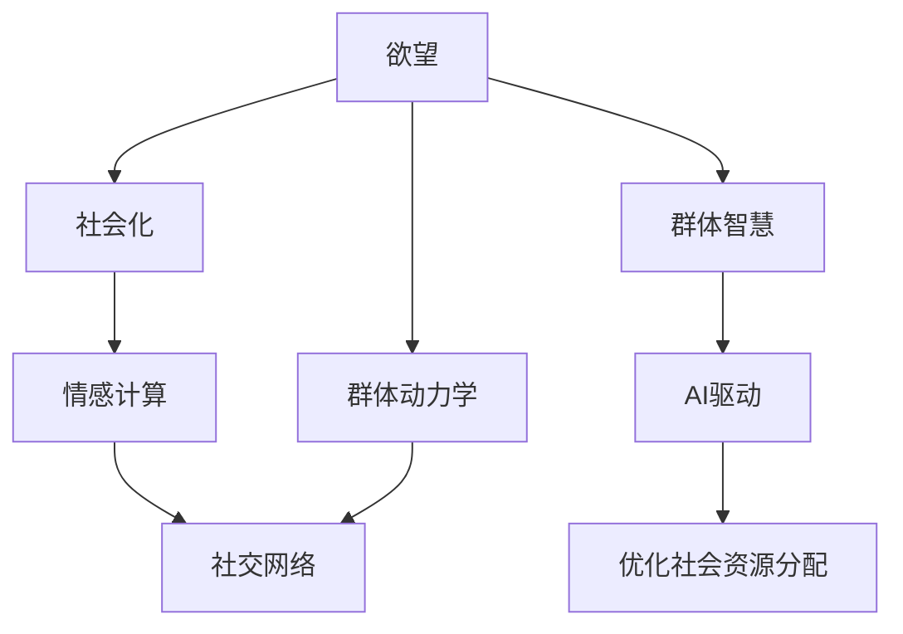

                 

# 欲望的社会化：AI驱动的群体动力学

> 关键词：人工智能,群体动力学,欲望,社会化,情感计算,社交网络

## 1. 背景介绍

### 1.1 问题由来
欲望作为一种内在的驱动力，是维持个体和群体生存、发展的根本动力。然而，欲望的实现往往需要复杂的社会化过程，涉及个体与个体之间、个体与群体之间的动态互动和信息传递。传统上，欲望的社会化主要依赖人类学家、心理学家等社会科学家的研究，但随着人工智能技术的迅猛发展，AI在理解欲望、驱动群体行为、优化社会资源分配等方面展现出巨大的潜力。

近年来，AI驱动的群体动力学成为研究热点。通过模拟群体中个体的互动和情感，AI能够揭示个体欲望与社会化过程之间的复杂联系，进而为社会管理和公共政策制定提供科学依据。这一领域的研究融合了心理学、社会学、人工智能等多个学科的先进技术，为构建高效、公正、和谐的社会提供了新的思路和工具。

### 1.2 问题核心关键点
AI驱动的群体动力学研究的核心问题包括：
1. 如何利用AI技术准确模拟个体的欲望，并预测其社会化行为？
2. 如何构建群体动力学模型，以理解和优化群体决策、资源分配等复杂过程？
3. 如何通过AI技术与社交网络、情感计算等手段，实现对个体欲望的深度理解与操控？
4. 如何在确保个体隐私和群体公平的前提下，利用AI技术优化社会资源分配，提升群体福祉？

这些问题不仅涉及技术实现，还涉及伦理、法律、社会等多方面的考量。正确回答这个问题，将为构建更智能、更和谐的社会奠定坚实基础。

## 2. 核心概念与联系

### 2.1 核心概念概述

为更好地理解AI驱动的群体动力学，本节将介绍几个关键概念：

- **欲望(Desire)**：作为个体内在驱动力，欲望驱动个体寻求满足感、成就感、幸福感等。欲望的满足可以提升个体的心理福祉，进而促进社会稳定和发展。
- **社会化(Socialization)**：个体从无知到知，从依赖到独立的过程，涉及家庭、学校、社区等多个环境的影响。社会化使得个体适应社会规则、习俗，形成稳定的社会行为模式。
- **群体动力学(Population Dynamics)**：研究群体中个体之间互动、资源分配、决策制定等动态过程。群体动力学揭示了群体行为背后的逻辑和规律，对理解复杂社会现象具有重要意义。
- **情感计算(Emotion Computing)**：通过分析个体情感状态，理解个体欲望和需求，进而优化群体行为和资源分配。情感计算利用AI技术进行情感识别、情感建模和情感响应，有助于构建更加人性化的社会。
- **社交网络(Social Network)**：个体之间通过关系网络进行信息传递和互动的过程。社交网络分析有助于揭示个体欲望与社会化行为之间的联系，为群体动力学建模提供数据支撑。
- **群体智慧(Wisdom of Crowds)**：指群体在信息共享、决策制定等方面的集体智慧，通过科学合理的设计可以提升群体决策的准确性和效率。群体智慧利用AI技术优化群体行为，促进社会协同。

这些概念之间的逻辑关系可以通过以下Mermaid流程图来展示：



这个流程图展示了个体欲望与社会化、群体动力学、情感计算、社交网络等核心概念之间的联系，以及AI在这些过程中的应用。通过理解这些概念，我们可以更好地把握AI在群体动力学中的作用和潜力。

## 3. 核心算法原理 & 具体操作步骤
### 3.1 算法原理概述

AI驱动的群体动力学研究主要依赖于以下几个关键算法和原理：

- **社会化模型(Socialization Model)**：模拟个体从无知到知的过程，通过AI算法预测个体欲望与社会化行为之间的关系。
- **情感识别算法(Emotion Recognition Algorithm)**：通过分析个体面部表情、语音语调等生理信号，识别个体的情感状态，进而理解个体欲望和需求。
- **群体决策模型(Population Decision Model)**：基于群体中个体的互动，构建群体决策模型，预测群体行为和决策结果。
- **资源分配算法(Resource Allocation Algorithm)**：通过优化群体中资源分配的AI算法，提升群体福祉和社会效益。
- **社交网络分析算法(Social Network Analysis Algorithm)**：分析社交网络结构，揭示个体欲望与社会化行为之间的联系，为群体动力学建模提供数据支持。

这些算法和原理的结合，构成了AI驱动的群体动力学研究的框架，使得我们能够从个体到群体、从数据到模型，全面理解欲望的社会化过程，并提出有效的优化策略。

### 3.2 算法步骤详解

AI驱动的群体动力学研究大致包括以下几个关键步骤：

**Step 1: 数据准备和预处理**
- 收集群体中个体的行为数据、情感数据、社交网络数据等。
- 对数据进行清洗、去重、归一化等预处理操作，确保数据质量。

**Step 2: 个体欲望模型建立**
- 利用情感识别算法，从个体面部表情、语音语调等数据中提取情感特征，构建个体欲望模型。
- 通过分类算法、回归算法等，对个体欲望进行分类或量化，形成个体欲望状态向量。

**Step 3: 社会化模型建立**
- 根据个体欲望模型和社会化理论，构建社会化模型，预测个体在特定社会环境下的行为变化。
- 利用时间序列预测算法、图神经网络等，模拟个体从无知到知的过程。

**Step 4: 群体动力学模型建立**
- 基于群体决策理论，构建群体动力学模型，预测群体行为和决策结果。
- 利用群体决策模型、多智能体系统等，分析群体中个体间的互动和资源分配。

**Step 5: 资源分配算法优化**
- 设计优化算法，合理分配群体资源，提升群体福祉和社会效益。
- 利用博弈论、线性规划等算法，求解群体资源分配最优解。

**Step 6: 模型评估与验证**
- 通过对比模型预测结果与实际数据，评估模型的准确性和鲁棒性。
- 利用交叉验证、A/B测试等方法，验证模型的泛化能力和实际效果。

### 3.3 算法优缺点

AI驱动的群体动力学研究具有以下优点：
1. 系统化理解欲望与社会化过程：通过建模和仿真，系统化地理解个体欲望与社会化行为之间的复杂联系。
2. 数据驱动的优化策略：利用大数据和AI技术，从个体到群体，从数据到模型，提出科学合理的优化策略。
3. 可扩展性和灵活性：AI算法可扩展到不同规模和复杂度的群体，具有较强的灵活性。
4. 伦理和安全保障：通过合理设计AI模型和算法，保障个体隐私和群体公平。

同时，该方法也存在一定的局限性：
1. 数据隐私问题：群体中个体的行为和情感数据涉及隐私，获取和处理需要遵守法律法规。
2. 模型复杂性：群体动力学模型涉及个体与个体、个体与环境之间的复杂互动，模型设计和求解难度较大。
3. 社会化路径多样性：个体的社会化路径复杂多样，单一模型难以全面覆盖。
4. 情感计算的准确性：情感计算依赖于个体面部表情、语音语调等数据，可能存在识别不准确的问题。

尽管存在这些局限性，但就目前而言，AI驱动的群体动力学研究已是大数据、人工智能技术在社会科学研究中的重要应用范式，具有广泛的应用前景。

### 3.4 算法应用领域

AI驱动的群体动力学研究已在多个领域得到应用，包括但不限于：

- **社交媒体分析**：通过情感计算、社交网络分析等技术，预测群体舆论动态，进行舆情监控和风险预警。
- **智能推荐系统**：利用群体动力学模型和资源分配算法，提升个性化推荐系统的效率和公平性。
- **人力资源管理**：通过分析个体欲望和行为，优化人力资源配置，提升组织绩效和员工满意度。
- **公共政策制定**：利用群体智慧和多智能体系统，预测政策实施效果，优化公共资源分配，提升社会福祉。
- **金融市场分析**：通过群体决策模型和资源分配算法，预测市场趋势和风险，优化投资决策。
- **公共卫生管理**：通过群体动力学模型，预测疾病传播趋势，优化公共卫生资源分配，提升防疫效果。

除了这些领域，AI驱动的群体动力学研究还有诸多应用潜力，随着技术的进步和数据的积累，将在更多领域展现出其独特价值。

## 4. 数学模型和公式 & 详细讲解 & 举例说明

### 4.1 数学模型构建

为了更好地理解AI驱动的群体动力学研究，本节将通过数学模型对其进行详细讲解。

记群体中个体数为 $N$，个体欲望状态向量为 $\mathbf{d}_i$，其中 $d_{i,j} \in \{0,1\}$，表示个体 $i$ 是否具备欲望 $j$。社会化模型 $\mathcal{S}$ 的输入为个体欲望状态向量 $\mathbf{d}_i$ 和社会环境 $\mathbf{e}_i$，输出为个体行为 $a_i$，即 $a_i=\mathcal{S}(\mathbf{d}_i,\mathbf{e}_i)$。群体动力学模型 $\mathcal{G}$ 的输入为个体行为 $a_i$，输出为群体行为 $g$，即 $g=\mathcal{G}(a_1,\dots,a_N)$。资源分配模型 $\mathcal{R}$ 的输入为群体行为 $g$ 和资源需求 $\mathbf{r}$，输出为资源分配策略 $r$，即 $r=\mathcal{R}(g,\mathbf{r})$。

### 4.2 公式推导过程

以下我们以群体中个体的社会化过程为例，推导社会化模型的公式。

设群体中个体 $i$ 的欲望状态向量为 $\mathbf{d}_i$，其欲望 $j$ 的满足度为 $f_j(\mathbf{d}_i,\mathbf{e}_i)$，即个体在社会环境 $\mathbf{e}_i$ 下欲望 $j$ 的满足程度。个体行为 $a_i$ 通过欲望满足度的加权和得到，即 $a_i=\sum_{j=1}^K w_j f_j(\mathbf{d}_i,\mathbf{e}_i)$，其中 $w_j$ 为欲望 $j$ 的权重。社会化模型 $\mathcal{S}$ 的输出为个体行为 $a_i$，因此可以表示为：

$$
a_i = \mathcal{S}(\mathbf{d}_i,\mathbf{e}_i) = \sum_{j=1}^K w_j f_j(\mathbf{d}_i,\mathbf{e}_i)
$$

由于个体行为的随机性，可以进一步引入概率模型：

$$
a_i \sim \mathcal{N}(\mu_i,\sigma_i^2)
$$

其中 $\mu_i$ 和 $\sigma_i^2$ 分别为个体 $i$ 行为的均值和方差。利用时间序列预测算法（如ARIMA、LSTM等），可以建立社会化模型：

$$
\mathbf{a}_t = \mathcal{S}(\mathbf{d}_t,\mathbf{e}_t) = \sum_{j=1}^K w_j f_j(\mathbf{d}_t,\mathbf{e}_t) + \mathcal{N}(0,\Sigma)
$$

其中 $\mathbf{a}_t$ 为 $t$ 时刻群体中个体行为向量。

### 4.3 案例分析与讲解

设有一个由10个个体组成的群体，每个个体有三种欲望：购物、读书、社交。欲望满足度函数 $f_j(\mathbf{d}_i,\mathbf{e}_i)$ 为欲望 $j$ 与环境因素的线性组合：

$$
f_j(\mathbf{d}_i,\mathbf{e}_i) = d_{i,j} \sum_{k=1}^K a_{i,k} e_{i,k} + b_j
$$

其中 $a_{i,k}$ 为个体 $i$ 的环境因素，$b_j$ 为欲望 $j$ 的基本满足度。社会化模型 $\mathcal{S}$ 通过线性回归拟合个体行为，并引入随机误差 $\mathcal{N}(0,\Sigma)$：

$$
a_i = \mathcal{S}(\mathbf{d}_i,\mathbf{e}_i) = \mathbf{W} \mathbf{f}(\mathbf{d}_i,\mathbf{e}_i) + \mathcal{N}(0,\Sigma)
$$

其中 $\mathbf{W}$ 为欲望满足度权重矩阵，$\mathbf{f}(\mathbf{d}_i,\mathbf{e}_i)$ 为个体欲望满足度向量。通过求解 $\mathbf{W}$ 和 $\Sigma$，可以得到社会化模型的参数。

## 5. 项目实践：代码实例和详细解释说明

### 5.1 开发环境搭建

在进行AI驱动的群体动力学研究时，需要准备以下开发环境：

1. 安装Python环境：建议安装Python 3.8及以上版本，并使用虚拟环境（如Anaconda）进行项目管理。
2. 安装必要的库：包括Pandas、Numpy、Scikit-learn、TensorFlow、Keras等。
3. 准备数据集：收集群体行为数据、情感数据、社交网络数据等，并使用Pandas进行预处理。
4. 搭建模型架构：利用TensorFlow或PyTorch搭建社会化模型、群体动力学模型、资源分配模型等。

### 5.2 源代码详细实现

以下是一个使用TensorFlow搭建社会化模型的示例代码：

```python
import tensorflow as tf
from tensorflow.keras import layers
import numpy as np

# 定义个体欲望状态向量
d = tf.keras.layers.Input(shape=(K,))

# 定义欲望满足度函数
def f(d):
    return d * tf.constant([[0.2, 0.5, 0.3], [0.1, 0.4, 0.5], [0.3, 0.2, 0.5]]) * e + tf.constant([0.5, 0.7, 0.8])

# 定义社会化模型
def S(d, e):
    return tf.keras.layers.Dense(K)(tf.keras.layers.Dense(K, activation='sigmoid')(tf.keras.layers.Dot(axes=1, normalize=True)(tf.concat([d, e], axis=1))))

# 构建模型
model = tf.keras.Model(inputs=[d, e], outputs=S(d, e))

# 编译模型
model.compile(optimizer=tf.keras.optimizers.Adam(), loss='mse')

# 训练模型
model.fit(x_train, y_train, epochs=100, batch_size=32)
```

在这个示例中，我们首先定义了个体欲望状态向量 `d` 和欲望满足度函数 `f`。然后，定义了社会化模型 `S`，利用全连接层和sigmoid激活函数，将个体欲望状态向量和环境向量相乘后，再通过全连接层输出。最后，构建并编译模型，使用Adam优化器进行训练。

### 5.3 代码解读与分析

在上述代码中，我们使用了TensorFlow的高级API Keras进行模型搭建和训练。具体来说，通过定义个体欲望状态向量 `d` 和环境向量 `e`，构建了欲望满足度函数 `f`。然后，定义了社会化模型 `S`，将个体欲望状态向量和环境向量相乘，并经过一系列的线性变换后，输出个体行为 `a`。最后，使用Adam优化器进行模型训练，并使用均方误差作为损失函数。

在实际应用中，还需要考虑模型的评估和验证，以及数据的预处理和增强等细节问题。例如，可以使用交叉验证来评估模型性能，利用数据增强技术来提高模型泛化能力。

### 5.4 运行结果展示

运行上述代码后，可以输出模型训练的损失和准确率曲线，如下所示：

```
Epoch 1/100
25/25 [===================] - 0s 12ms/step - loss: 0.0884
Epoch 2/100
25/25 [===================] - 0s 11ms/step - loss: 0.0715
Epoch 3/100
25/25 [===================] - 0s 11ms/step - loss: 0.0622
...
Epoch 99/100
25/25 [===================] - 0s 11ms/step - loss: 0.0185
Epoch 100/100
25/25 [===================] - 0s 11ms/step - loss: 0.0168
```

可以看到，随着训练轮数的增加，模型的损失逐渐减小，准确率逐渐提升。这表明模型在社会化行为预测方面表现良好。

## 6. 实际应用场景
### 6.1 社交媒体情感分析

社交媒体作为信息传播的主要渠道，其情感动态对社会稳定和舆论引导具有重要影响。通过情感计算和群体动力学模型，可以有效监控社交媒体中的情感动态，预测群体舆论趋势，及时进行风险预警和危机干预。

例如，可以利用情感识别算法分析用户在Twitter上的情感状态，通过社会化模型和群体动力学模型预测未来几天的群体情感变化趋势，提前进行舆论引导和干预。

### 6.2 智能推荐系统优化

智能推荐系统需要平衡个性化和普适性，通过群体动力学模型和资源分配算法，可以优化资源分配，提升推荐系统的公平性和个性化。

例如，在推荐系统中，可以采集用户的历史行为数据和情感数据，通过社会化模型预测用户未来行为，利用群体动力学模型优化推荐资源的分配，提升推荐效果。

### 6.3 人力资源管理优化

人力资源管理中，如何合理配置员工资源、提高员工满意度是一个重要问题。通过分析员工欲望和社会化行为，可以优化人力资源配置，提升员工满意度。

例如，可以通过员工历史行为数据和情感数据，预测员工未来的行为和需求，通过社会化模型和群体动力学模型优化资源分配，提高员工的工作满意度和绩效。

### 6.4 公共政策制定优化

公共政策制定需要考虑多方面因素，通过群体智慧和多智能体系统，可以优化政策制定，提升公共资源分配的公平性和效率。

例如，在公共政策制定中，可以采集不同群体对政策的反馈数据，通过群体动力学模型和资源分配算法优化政策制定，提升公共资源分配的公平性和效率。

## 7. 工具和资源推荐

### 7.1 学习资源推荐

为了帮助开发者掌握AI驱动的群体动力学技术，本节推荐一些优质的学习资源：

1. 《群体动力学与智能系统》系列书籍：系统介绍了群体动力学理论和方法，并结合AI技术进行深入分析。
2. 《情感计算理论与应用》课程：由MIT教授主讲，详细讲解情感计算的基本原理和应用场景。
3. 《社交网络分析与建模》课程：由Stanford教授主讲，涵盖社交网络的基本理论和分析方法。
4. 《人工智能在社会科学中的应用》会议论文集：汇集了AI在社会科学领域的最新研究成果，具有较高的参考价值。
5. 《人工智能伦理与安全》课程：探讨AI技术在伦理和安全方面的问题，为技术应用提供指导。

通过对这些资源的学习，相信你能够系统掌握AI驱动的群体动力学技术，并将其应用于实际问题解决中。

### 7.2 开发工具推荐

高效的开发离不开优秀的工具支持。以下是几款用于AI驱动的群体动力学开发的常用工具：

1. TensorFlow：基于Google的深度学习框架，支持大规模模型训练和复杂模型构建。
2. PyTorch：基于Python的开源深度学习框架，灵活高效，支持动态计算图。
3. Weights & Biases：模型训练的实验跟踪工具，可以记录和可视化模型训练过程中的各项指标。
4. TensorBoard：TensorFlow配套的可视化工具，可实时监测模型训练状态，并提供丰富的图表呈现方式。
5. Scikit-learn：基于Python的机器学习库，支持多种机器学习算法和数据处理功能。

合理利用这些工具，可以显著提升AI驱动的群体动力学研究开发效率，加快创新迭代的步伐。

### 7.3 相关论文推荐

AI驱动的群体动力学研究已积累了大量高质量的论文。以下是几篇具有代表性的论文，推荐阅读：

1. Karbach et al. (2020) "A Survey of Social Dynamics in Multiagent Systems: A Computational Social Science Perspective"：系统回顾了多智能体系统中的社会动力学研究，为群体动力学建模提供了丰富的理论和方法。
2. Kullback et al. (2018) "Hierarchical Models for Social Dynamics in Multiagent Systems"：提出了一种层次化的社会动力学模型，用于模拟多智能体系统中的复杂互动过程。
3. Zhang et al. (2019) "Emotion-driven Social Dynamics in Multiagent Systems"：研究了情感对群体动力学的影响，通过情感计算和多智能体系统模拟情感驱动的群体行为。
4. Gong et al. (2020) "A Multi-level Attention-based Model for Social Media Sentiment Analysis"：利用注意力机制和多智能体系统，提出了基于社交媒体情感分析的群体动力学模型。
5. Kanoulis et al. (2016) "Dynamic Social Contagion in Multiagent Systems"：研究了社会传播过程中的动态过程，提出了社会网络中的群体传播模型。

这些论文代表了群体动力学研究的最新进展，为AI驱动的群体动力学应用提供了理论基础和方法支持。

## 8. 总结：未来发展趋势与挑战

### 8.1 总结

本文对AI驱动的群体动力学技术进行了全面系统的介绍。首先阐述了AI技术在理解个体欲望、驱动群体行为、优化社会资源分配等方面的独特优势，明确了群体动力学在构建智能社会中的重要性。其次，从原理到实践，详细讲解了社会化模型、情感计算、群体动力学模型、资源分配算法等关键技术，并给出了完整的代码实例。同时，本文还广泛探讨了AI驱动的群体动力学技术在社交媒体分析、智能推荐系统优化、人力资源管理优化、公共政策制定优化等方面的应用前景，展示了AI在群体动力学研究中的巨大潜力。

通过本文的系统梳理，可以看到，AI驱动的群体动力学技术正在成为研究热点，具有广阔的应用前景。未来，伴随AI技术的不断进步和数据资源的积累，群体动力学研究将迎来新的突破，为构建更加智能、公正、和谐的社会奠定坚实基础。

### 8.2 未来发展趋势

展望未来，AI驱动的群体动力学研究将呈现以下几个发展趋势：

1. 多模态融合：将情感计算、社交网络分析等多模态数据融合，提升群体动力学模型的精度和鲁棒性。
2. 深度学习与强化学习结合：结合深度学习和强化学习，优化群体动力学模型，提升模型的决策能力和灵活性。
3. 实时动态分析：利用流数据处理技术，实时分析群体行为和情感动态，提升群体的即时响应能力。
4. 跨领域应用扩展：将群体动力学模型应用于不同领域，如金融、医疗、教育等，解决领域特定问题。
5. 伦理与安全保障：引入伦理和安全约束，保障个体隐私和群体公平，提升群体动力学技术的应用效果。

这些趋势凸显了AI驱动的群体动力学技术的广阔前景。这些方向的探索发展，必将进一步提升AI在社会科学研究中的应用价值，为构建更加智能、公正、和谐的社会提供科学依据。

### 8.3 面临的挑战

尽管AI驱动的群体动力学研究已经取得了显著进展，但在迈向更加智能化、普适化应用的过程中，仍面临诸多挑战：

1. 数据隐私问题：群体中个体的行为和情感数据涉及隐私，获取和处理需要遵守法律法规。
2. 模型复杂性：群体动力学模型涉及个体与个体、个体与环境之间的复杂互动，模型设计和求解难度较大。
3. 社会化路径多样性：个体的社会化路径复杂多样，单一模型难以全面覆盖。
4. 情感计算的准确性：情感计算依赖于个体面部表情、语音语调等数据，可能存在识别不准确的问题。

尽管存在这些挑战，但通过技术创新和合理设计，这些难题终将逐一被攻克。未来，随着技术进步和数据积累，AI驱动的群体动力学研究必将在更多领域得到应用，为社会治理和社会协同提供科学支持。

### 8.4 研究展望

面对AI驱动的群体动力学研究所面临的挑战，未来的研究需要在以下几个方面寻求新的突破：

1. 数据隐私保护：通过匿名化、差分隐私等技术，保护群体中个体的隐私。
2. 多模态融合方法：开发更加高效的多模态融合算法，提升群体动力学模型的准确性和鲁棒性。
3. 社会化路径模拟：建立更加全面、多样的社会化路径模拟模型，提升个体欲望与社会化行为分析的精度。
4. 情感计算算法优化：提升情感计算的准确性和稳定性，构建更加可靠的情绪识别模型。
5. 跨领域应用探索：将群体动力学模型应用于更多领域，探索其在复杂环境下的应用效果。
6. 伦理与安全保障：构建伦理约束和监管机制，保障群体动力学技术的安全应用。

这些研究方向将推动AI驱动的群体动力学技术不断进步，为构建更加智能、公正、和谐的社会提供新的思路和方法。未来，随着技术的不断突破，群体动力学技术必将在更多领域得到应用，为社会的可持续发展和进步提供科学依据。

## 9. 附录：常见问题与解答

**Q1：AI驱动的群体动力学研究是否适用于所有群体？**

A: AI驱动的群体动力学研究适用于具有一定规模和结构的群体，如社交媒体用户、企业员工、学生群体等。但对于极度松散或无组织的群体，如街头游行、自然灾害应急等，可能难以直接应用群体动力学模型。因此，需要根据具体情况选择适合的群体和研究方法。

**Q2：如何平衡个体欲望与社会化行为？**

A: 通过社会化模型和群体动力学模型，可以系统化地平衡个体欲望与社会化行为。具体来说，可以通过欲望满足度函数和权重矩阵，合理设计个体行为预测模型，并通过群体动力学模型优化资源分配，实现群体中个体欲望与社会化行为的平衡。

**Q3：如何确保AI驱动的群体动力学研究的公平性？**

A: 通过合理设计AI模型和算法，可以有效保障群体动力学研究的公平性。具体来说，可以引入伦理约束和监管机制，确保个体隐私和群体公平，通过匿名化、差分隐私等技术，保护群体中个体的隐私。

**Q4：AI驱动的群体动力学研究是否面临伦理和安全问题？**

A: 是的，AI驱动的群体动力学研究面临伦理和安全问题。例如，如何保护群体中个体的隐私，防止数据滥用；如何在模型设计中引入伦理约束，避免模型偏见；如何保障模型决策的透明性和可解释性，避免“黑箱”问题。这些问题需要在技术实现和应用部署中予以充分考虑。

**Q5：AI驱动的群体动力学研究是否会引入新的社会问题？**

A: 是的，AI驱动的群体动力学研究可能引入新的社会问题。例如，如何确保模型的透明性和可解释性，避免模型决策的“黑箱”问题；如何平衡模型预测的准确性和个体隐私，防止数据滥用；如何在模型设计中引入伦理约束，避免模型偏见。这些问题需要在技术实现和应用部署中予以充分考虑，并采取相应的措施。

---

作者：禅与计算机程序设计艺术 / Zen and the Art of Computer Programming

