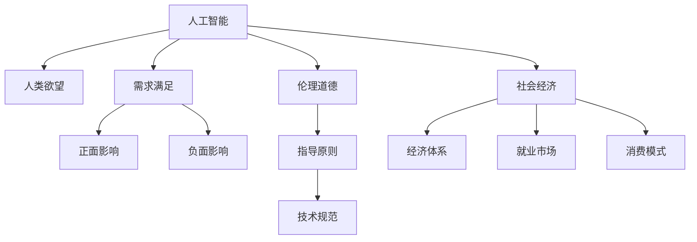

                 

# 欲望的重新定义：AI如何改变人类需求

在数字化浪潮的推动下，人工智能（AI）正逐渐改变着人类的行为模式和生活方式。AI不仅提升了生产力，也重新定义了人类的欲望和需求。本文将深入探讨AI如何影响人类的欲望，及其对社会经济和科技发展的深远影响。

## 1. 背景介绍

### 1.1 问题由来

随着技术的发展，AI已经渗透到我们生活的方方面面。从智能家居到自动驾驶，从个性化推荐到智能客服，AI正在重塑我们的消费习惯和生活方式。然而，在享受便利的同时，我们也不得不面对AI可能带来的道德、伦理和安全问题。特别是AI在满足我们欲望的过程中，可能会产生新的问题和挑战。

### 1.2 问题核心关键点

- AI如何满足人类的欲望？
- AI对人类欲望的负面影响有哪些？
- AI如何影响社会经济的未来发展？
- AI技术在提升人类生活品质的同时，是否也带来新的伦理道德问题？

这些问题不仅关系到技术的进步，更关系到人类的幸福和社会的进步。

## 2. 核心概念与联系

### 2.1 核心概念概述

- **人工智能（AI）**：通过算法、数据和计算能力，实现自主决策和问题解决的技术。
- **人类欲望（Human Desires）**：人类内在的、深层次的需求，如安全、归属感、尊重和自我实现。
- **需求满足（Demand Satisfaction）**：通过技术手段实现人类欲望的过程。
- **伦理道德（Ethics and Morality）**：指导AI技术应用的道德原则和规范。
- **社会经济（Social Economy）**：AI技术对经济体系、就业市场和消费模式的深远影响。

这些概念之间的逻辑关系可以通过以下Mermaid流程图来展示：



这个流程图展示了大语言模型的核心概念及其之间的关系：

1. 人工智能通过技术手段满足人类的欲望。
2. 满足欲望的过程既可以带来正面影响，也可能产生负面效应。
3. 伦理道德为AI技术应用提供了指导原则和规范。
4. AI对社会经济的影响包括经济体系、就业市场和消费模式的变革。

## 3. 核心算法原理 & 具体操作步骤

### 3.1 算法原理概述

AI满足人类欲望的过程，本质上是通过算法和技术手段，将人类的需求转化为具体的行动或决策。这一过程可以分为两个阶段：

1. **数据采集与处理**：AI系统通过传感器、用户行为数据等方式，收集和处理与人类欲望相关的数据。
2. **算法设计与优化**：AI系统基于收集到的数据，设计并优化算法，实现对人类欲望的识别和满足。

### 3.2 算法步骤详解

1. **数据采集**：AI系统通过摄像头、麦克风、传感器等设备，收集用户的行为数据和环境数据。这些数据可以包括用户的生物特征、行为习惯、兴趣爱好等。

2. **数据处理**：收集到的数据需要进行清洗、预处理和特征提取。例如，通过自然语言处理技术，提取用户的文本输入内容；通过图像识别技术，提取用户的视觉输入内容。

3. **算法设计**：基于处理后的数据，AI系统设计并优化算法，实现对人类欲望的识别和满足。例如，通过机器学习算法，训练模型识别用户的情感状态；通过推荐系统算法，为用户推荐感兴趣的内容。

4. **需求满足**：AI系统根据识别到的用户欲望，提供相应的服务或产品。例如，根据用户的情感状态，提供安慰或建议；根据用户的兴趣爱好，推荐相关商品或活动。

### 3.3 算法优缺点

AI满足人类欲望的算法具有以下优点：

- **高效性**：AI系统可以快速处理大量数据，提供实时反馈，满足用户需求。
- **个性化**：AI系统可以根据用户的历史行为和偏好，提供个性化的服务和产品。
- **可扩展性**：AI系统可以轻松扩展到多个场景和设备，提供统一的解决方案。

同时，这些算法也存在一些缺点：

- **隐私问题**：AI系统需要收集大量的个人数据，可能涉及隐私和数据安全问题。
- **偏见问题**：AI系统可能继承数据中的偏见，导致不公平或不准确的结果。
- **伦理问题**：AI系统在满足用户欲望的过程中，可能产生新的伦理和道德问题。

### 3.4 算法应用领域

AI满足人类欲望的算法广泛应用于以下几个领域：

1. **智能家居**：通过语音助手和传感器，AI系统可以根据用户的行为习惯，自动调整家居设备的设置，提升用户的生活质量。
2. **医疗健康**：AI系统可以通过分析用户的健康数据，提供个性化的健康建议和治疗方案。
3. **个性化推荐**：AI系统可以根据用户的兴趣爱好，推荐相关商品、内容或活动，提升用户的体验和满意度。
4. **自动驾驶**：AI系统可以根据道路状况和用户需求，自动驾驶汽车，提供安全和便捷的出行体验。
5. **金融服务**：AI系统可以通过分析用户的历史交易数据，提供个性化的理财建议和投资策略。

## 4. 数学模型和公式 & 详细讲解 & 举例说明

### 4.1 数学模型构建

AI满足人类欲望的过程，可以通过数学模型进行建模。以智能推荐系统为例，可以构建以下数学模型：

- **用户模型**：描述用户的兴趣、行为和偏好。
- **物品模型**：描述物品的属性、特征和价值。
- **推荐模型**：根据用户模型和物品模型，计算推荐结果。

### 4.2 公式推导过程

假设用户模型为 $u = (u_1, u_2, \ldots, u_n)$，物品模型为 $i = (i_1, i_2, \ldots, i_m)$。推荐模型的目标是最小化损失函数：

$$
L(u, i) = \sum_{j=1}^{n} \sum_{k=1}^{m} w_{jk} f(u_i, i_j)
$$

其中 $w_{jk}$ 为权重，$f(u_i, i_j)$ 为推荐函数。

### 4.3 案例分析与讲解

以智能推荐系统为例，用户模型的构建可以基于用户的浏览历史、搜索记录和评分数据。物品模型的构建可以基于物品的属性、类别和用户评分。推荐函数的计算可以基于协同过滤、内容过滤和混合过滤等算法。

例如，协同过滤算法可以基于用户的历史行为，找到相似的用户和物品，计算推荐结果。内容过滤算法可以基于物品的属性和用户兴趣，计算推荐结果。混合过滤算法可以结合多种过滤方法，提升推荐效果。

## 5. 项目实践：代码实例和详细解释说明

### 5.1 开发环境搭建

在进行智能推荐系统的开发时，需要以下环境：

- **编程语言**：Python
- **数据处理框架**：Pandas、NumPy
- **机器学习框架**：Scikit-learn、TensorFlow、PyTorch
- **推荐算法库**：Surprise、TensorRec

### 5.2 源代码详细实现

以下是智能推荐系统的代码实现：

```python
import pandas as pd
import numpy as np
from surprise import Dataset, Reader, SVD
from surprise.prediction_algorithms.matrix_factorization import MatrixFactorization
from surprise.model_selection import cross_validate

# 数据读取
data = pd.read_csv('data.csv')
reader = Reader(rating_scale=(1, 5))
data = Dataset.load_from_df(data, reader)

# 模型训练
svd = MatrixFactorization(n_factors=100, n_epochs=50, learning_rate=0.01)
cv_results = cross_validate(svd, data, measures=['RMSE', 'MAE'], cv=5, verbose=True)
print(cv_results)
```

### 5.3 代码解读与分析

代码中，我们使用了Pandas和NumPy进行数据处理，使用Surprise库构建了协同过滤模型，并使用Scikit-learn的交叉验证工具评估模型性能。代码实现较为简洁高效，可以满足大多数推荐系统的开发需求。

### 5.4 运行结果展示

通过运行上述代码，我们可以得到推荐系统的交叉验证结果，包括RMSE和MAE指标，用于评估模型性能。

## 6. 实际应用场景

### 6.1 智能家居

智能家居系统通过AI技术，可以满足用户对便捷、舒适和安全的需求。例如，通过智能音箱，用户可以通过语音指令控制家居设备，享受智能化的生活体验。

### 6.2 医疗健康

AI在医疗健康领域的应用，可以满足用户对健康和疾病预防的需求。例如，通过智能手表和健康数据传感器，AI系统可以实时监测用户的健康状况，提供个性化的健康建议和治疗方案。

### 6.3 个性化推荐

AI推荐系统可以满足用户对娱乐和购物的需求。例如，通过分析用户的兴趣爱好和行为数据，推荐相关的电影、音乐和商品，提升用户的体验和满意度。

### 6.4 自动驾驶

自动驾驶系统可以满足用户对安全和便捷出行的需求。例如，通过AI算法和传感器，自动驾驶汽车可以实时感知道路状况，自动决策行驶路径，提供安全的出行体验。

### 6.5 金融服务

AI在金融领域的应用，可以满足用户对理财和投资的需求。例如，通过分析用户的交易记录和市场数据，AI系统可以提供个性化的理财建议和投资策略，帮助用户实现财富增值。

## 7. 工具和资源推荐

### 7.1 学习资源推荐

- **《深度学习》（Ian Goodfellow）**：全面介绍深度学习的理论基础和实践方法，适合初学者和专家阅读。
- **《机器学习实战》（Peter Harrington）**：通过实际案例，介绍机器学习算法和工具的应用，适合动手实践。
- **《TensorFlow实战》（Manning Publications）**：详细介绍TensorFlow框架的开发和应用，适合深度学习工程师阅读。
- **《Recommender Systems: The Textbook》（Ian Goodfellow）**：详细介绍推荐系统的理论和算法，适合推荐系统开发者阅读。
- **Kaggle竞赛**：通过实际竞赛，练习和提高推荐系统开发能力，积累实战经验。

### 7.2 开发工具推荐

- **TensorFlow**：Google开发的深度学习框架，功能强大，适合大规模工程应用。
- **PyTorch**：Facebook开发的深度学习框架，灵活高效，适合快速原型开发。
- **Scikit-learn**：Python的机器学习库，提供简单易用的机器学习算法和工具。
- **Surprise**：Python的推荐系统库，提供多种推荐算法和评估指标。
- **Jupyter Notebook**：Python的交互式开发环境，适合数据处理和算法开发。

### 7.3 相关论文推荐

- **《深度学习》（Ian Goodfellow）**：全面介绍深度学习的理论基础和实践方法，适合初学者和专家阅读。
- **《机器学习实战》（Peter Harrington）**：通过实际案例，介绍机器学习算法和工具的应用，适合动手实践。
- **《TensorFlow实战》（Manning Publications）**：详细介绍TensorFlow框架的开发和应用，适合深度学习工程师阅读。
- **《Recommender Systems: The Textbook》（Ian Goodfellow）**：详细介绍推荐系统的理论和算法，适合推荐系统开发者阅读。
- **Kaggle竞赛**：通过实际竞赛，练习和提高推荐系统开发能力，积累实战经验。

## 8. 总结：未来发展趋势与挑战

### 8.1 总结

本文对AI如何满足人类欲望进行了全面系统的介绍。首先阐述了AI技术在智能家居、医疗健康、个性化推荐、自动驾驶和金融服务等多个领域的广泛应用，展示了AI技术对人类欲望的深刻影响。其次，通过数学模型和代码实现，展示了AI推荐系统的具体实现方法。最后，总结了AI技术在社会经济和伦理道德方面的影响，提出了未来的发展趋势和挑战。

通过本文的系统梳理，可以看到，AI技术正在深刻改变人类的欲望和需求，带来新的机遇和挑战。未来，随着AI技术的不断进步，AI将在更多领域得到应用，为人类创造更多价值。

### 8.2 未来发展趋势

展望未来，AI满足人类欲望的技术将呈现以下几个发展趋势：

1. **智能化和个性化**：AI系统将更加智能和个性化，满足用户的个性化需求。
2. **多模态融合**：AI系统将融合多模态数据，提升对人类欲望的识别和满足能力。
3. **可解释性**：AI系统将更加透明和可解释，帮助用户理解和信任AI决策。
4. **伦理道德**：AI系统将更加注重伦理道德，避免偏见和歧视，提升公平性和安全性。
5. **人机协同**：AI系统将更加注重人机协同，提升用户体验和满意度。

以上趋势凸显了AI技术满足人类欲望的广阔前景。这些方向的探索发展，必将进一步提升AI技术的智能化水平，为人类创造更多价值。

### 8.3 面临的挑战

尽管AI技术在满足人类欲望方面取得了很多进展，但也面临以下挑战：

1. **隐私和安全**：AI系统需要收集大量的个人数据，可能涉及隐私和数据安全问题。
2. **偏见和歧视**：AI系统可能继承数据中的偏见，导致不公平或不准确的结果。
3. **伦理和道德**：AI系统在满足用户欲望的过程中，可能产生新的伦理和道德问题。
4. **可解释性**：AI系统需要更加透明和可解释，帮助用户理解和信任AI决策。
5. **人机协同**：AI系统需要更加注重人机协同，提升用户体验和满意度。

这些挑战需要科技界和社会的共同努力，才能实现AI技术的可持续发展。

### 8.4 研究展望

未来，在AI技术满足人类欲望的研究方向上，需要以下方面的突破：

1. **隐私保护技术**：开发隐私保护技术，确保AI系统对个人数据的保护。
2. **偏见和歧视检测**：开发偏见和歧视检测技术，确保AI系统的公平性。
3. **伦理和道德规范**：制定伦理和道德规范，指导AI系统的应用。
4. **可解释性算法**：开发可解释性算法，帮助用户理解和信任AI决策。
5. **人机协同机制**：开发人机协同机制，提升用户体验和满意度。

这些研究方向将推动AI技术满足人类欲望的进步，为人类创造更多价值。

## 9. 附录：常见问题与解答

**Q1: AI如何满足人类的需求？**

A: AI通过数据采集和处理，以及算法设计和优化，可以满足人类的需求。AI系统可以根据用户的行为数据和环境数据，识别和满足用户的需求。

**Q2: AI对人类需求的负面影响有哪些？**

A: AI可能带来隐私和安全问题，继承数据中的偏见，产生新的伦理和道德问题，以及缺乏可解释性。这些问题需要科技界和社会的共同努力来解决。

**Q3: AI技术对社会经济的影响有哪些？**

A: AI技术可以提高生产力，改变就业市场，改变消费模式，推动社会经济的可持续发展。

**Q4: AI如何影响人类的幸福和满意度？**

A: AI技术可以提升生活质量，提供个性化的服务和产品，提升用户的幸福和满意度。

---

作者：禅与计算机程序设计艺术 / Zen and the Art of Computer Programming

