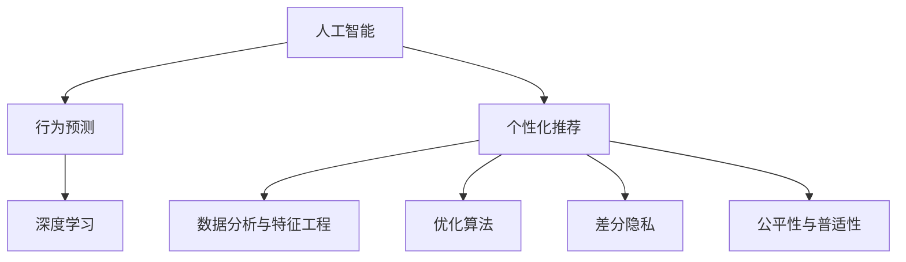

                 

# 欲望算法：AI如何预测和塑造人类行为

> 关键词：人工智能, 行为预测, 深度学习, 数据分析, 个性化推荐, 社交网络, 优化算法

## 1. 背景介绍

### 1.1 问题由来

随着人工智能(AI)技术的飞速发展，其在行为预测和个性化推荐等领域的潜力引起了广泛的关注。无论是电商推荐、社交网络分析，还是金融市场预测、广告投放，AI在分析海量数据，理解用户需求和行为，提供精准服务方面展现了强大的能力。

但AI技术的不断进步也引发了人们对于隐私、伦理、公平等一系列问题的担忧。如何在提供个性化服务的同时，尊重用户隐私，避免数据滥用，成为亟待解决的问题。

此外，现有的AI行为预测模型往往缺乏对于人类情感和欲望的深度理解，难以真正洞察人类行为的复杂性。本系列文章旨在探讨AI如何更深入地理解并预测人类行为，并基于此开发出更加智能、透明的个性化推荐系统，同时提出一系列伦理约束与保障措施，确保AI在预测和塑造人类行为过程中，既高效又负责任。

### 1.2 问题核心关键点

AI在行为预测和推荐系统中的核心关键点主要包括：

- **深度学习模型的应用**：利用神经网络模型对用户数据进行深度分析，挖掘其潜在的规律和模式。
- **数据分析与特征工程**：通过高效的数据清洗、特征提取、降维等技术，优化数据处理流程，提升模型预测精度。
- **个性化推荐算法**：结合用户历史行为和当前需求，动态生成个性化推荐结果。
- **优化算法的选择与优化**：针对不同的数据和任务，选择并优化相应的优化算法，提高模型训练和推理的效率。
- **算法透明性与可解释性**：提高模型的可解释性，使预测过程和推荐理由透明化，增强用户信任。
- **隐私保护与数据安全**：采用差分隐私、联邦学习等技术，确保数据隐私不被滥用。
- **公平性与普适性**：保证推荐系统的公平性，避免算法偏见，确保推荐服务对各类用户都友好。

这些关键点构成了AI行为预测与推荐系统的技术框架，但其具体实施仍需结合实际应用场景，不断迭代优化。

## 2. 核心概念与联系

### 2.1 核心概念概述

为了更深入地理解AI在预测和塑造人类行为中的应用，我们需要先了解一些关键概念：

- **人工智能**：利用算法和计算资源，模拟、延伸和扩展人类智能的技术，主要包含感知、认知、决策、行动等几个方面。
- **行为预测**：通过对用户历史行为和相关数据的分析，预测其未来行为或偏好，以指导个性化服务。
- **个性化推荐系统**：根据用户的历史行为和当前需求，动态生成个性化的推荐结果，提高用户满意度。
- **深度学习**：一种基于多层神经网络进行复杂模式识别的机器学习技术，广泛应用于图像、语音、自然语言处理等领域。
- **数据分析与特征工程**：从原始数据中提取有效特征，并进行清洗、降维等处理，以优化数据输入，提升模型性能。
- **优化算法**：用于优化模型参数或决策变量，提升模型训练和推理效率的算法，如梯度下降、Adam、Adagrad等。
- **差分隐私**：一种数据隐私保护技术，通过向噪声中添加扰动，使得单个数据点的泄露不会影响整体数据的隐私性。
- **公平性与普适性**：保证推荐系统对不同用户群体公平、公正，避免算法偏见，确保推荐服务对各类用户都友好。

这些核心概念之间的逻辑关系可以通过以下Mermaid流程图来展示：



这个流程图展示了AI在行为预测和个性化推荐系统中的核心概念及其之间的关系：

1. 人工智能通过深度学习等技术实现行为预测和推荐。
2. 行为预测基于数据分析与特征工程，提高数据输入的质量和效率。
3. 个性化推荐通过优化算法，提升模型训练和推理的效率。
4. 差分隐私和公平性与普适性确保数据隐私和算法公正性。

这些概念共同构成了AI在行为预测和推荐系统中的应用框架，为其有效运作提供了理论基础。

## 3. 核心算法原理 & 具体操作步骤
### 3.1 算法原理概述

AI行为预测与推荐系统的核心算法原理基于深度学习和数据分析技术。通过深度神经网络模型，对用户历史行为数据进行特征提取和模式识别，从而预测其未来行为或生成个性化推荐。

具体而言，模型输入通常包括用户历史行为数据、社交网络信息、商品特征等。模型通过前向传播计算预测结果或推荐结果，反向传播更新模型参数，以最小化预测误差或推荐误差。

### 3.2 算法步骤详解

基于深度学习的行为预测与推荐系统的一般步骤包括：

**Step 1: 数据准备**
- 收集用户历史行为数据、社交网络信息、商品特征等。
- 清洗数据，去除噪声和异常值。
- 进行特征提取和降维，生成模型输入。

**Step 2: 模型选择与设计**
- 选择合适的深度学习模型结构，如CNN、RNN、Transformer等。
- 根据任务需求，设计模型的输出层和损失函数。
- 确定模型的超参数，如学习率、批大小、迭代轮数等。

**Step 3: 模型训练与评估**
- 将数据划分为训练集、验证集和测试集。
- 使用优化算法（如Adam、SGD等）对模型进行训练，最小化损失函数。
- 在验证集上评估模型性能，调整超参数和模型结构。
- 在测试集上测试最终模型，对比微调前后的性能提升。

**Step 4: 推荐生成**
- 根据用户历史行为和当前需求，生成个性化推荐结果。
- 在实际应用中，可能还需结合实时数据进行动态推荐。

### 3.3 算法优缺点

基于深度学习的行为预测与推荐系统具有以下优点：

1. **高效性**：深度学习模型能够高效处理大规模数据，通过多层次的特征提取和模式识别，提升预测和推荐的精度。
2. **灵活性**：模型结构可灵活调整，适应不同任务和应用场景。
3. **实时性**：利用在线学习技术，模型能够实时更新，提供即时的推荐服务。

同时，该方法也存在以下局限性：

1. **数据依赖性**：深度学习模型高度依赖高质量的数据输入，数据偏差可能影响预测结果。
2. **模型复杂性**：深度模型参数量巨大，训练和推理资源需求高。
3. **可解释性不足**：模型黑盒特性使得预测过程难以解释，用户难以信任。
4. **隐私风险**：数据隐私问题难以解决，用户数据可能被滥用。

### 3.4 算法应用领域

基于深度学习的行为预测与推荐系统，已经在多个领域得到了广泛应用，例如：

- **电商推荐**：通过用户历史购买记录和浏览行为，推荐相关商品。
- **社交网络分析**：分析用户动态、好友关系等，提供个性化推荐和社区内容。
- **金融服务**：分析用户投资行为和市场动态，提供投资建议和风险预警。
- **医疗健康**：分析用户健康数据和行为，提供个性化医疗建议。
- **广告投放**：分析用户行为和兴趣，精准投放广告，提高广告效果。

这些应用场景展示了深度学习模型在行为预测和推荐中的强大潜力，但其广泛应用也带来了数据隐私、伦理公平等诸多挑战。

## 4. 数学模型和公式 & 详细讲解  
### 4.1 数学模型构建

在本节中，我们将通过数学语言详细讲解AI行为预测与推荐系统的模型构建和优化过程。

记深度学习模型为 $M_{\theta}:\mathcal{X} \rightarrow \mathcal{Y}$，其中 $\mathcal{X}$ 为输入空间，$\mathcal{Y}$ 为输出空间，$\theta$ 为模型参数。假设预测任务的训练集为 $D=\{(x_i,y_i)\}_{i=1}^N, x_i \in \mathcal{X}, y_i \in \mathcal{Y}$。

定义模型 $M_{\theta}$ 在数据样本 $(x,y)$ 上的损失函数为 $\ell(M_{\theta}(x),y)$，则在数据集 $D$ 上的经验风险为：

$$
\mathcal{L}(\theta) = \frac{1}{N} \sum_{i=1}^N \ell(M_{\theta}(x_i),y_i)
$$

其中 $\ell$ 为任务特定的损失函数，如均方误差、交叉熵等。

模型的优化目标是最小化经验风险，即找到最优参数：

$$
\theta^* = \mathop{\arg\min}_{\theta} \mathcal{L}(\theta)
$$

在实践中，我们通常使用基于梯度的优化算法（如SGD、Adam等）来近似求解上述最优化问题。设 $\eta$ 为学习率，$\lambda$ 为正则化系数，则参数的更新公式为：

$$
\theta \leftarrow \theta - \eta \nabla_{\theta}\mathcal{L}(\theta) - \eta\lambda\theta
$$

其中 $\nabla_{\theta}\mathcal{L}(\theta)$ 为损失函数对参数 $\theta$ 的梯度，可通过反向传播算法高效计算。

### 4.2 公式推导过程

以电商推荐为例，我们推导基于深度学习模型的推荐系统损失函数的构建和优化过程。

假设模型 $M_{\theta}$ 在输入 $x$ 上的输出为 $\hat{y}=M_{\theta}(x)$，表示预测的推荐结果。真实标签 $y \in \{1,0\}$，其中1表示用户点击了推荐商品，0表示未点击。则二分类交叉熵损失函数定义为：

$$
\ell(M_{\theta}(x),y) = -[y\log \hat{y} + (1-y)\log (1-\hat{y})]
$$

将其代入经验风险公式，得：

$$
\mathcal{L}(\theta) = -\frac{1}{N}\sum_{i=1}^N [y_i\log M_{\theta}(x_i)+(1-y_i)\log(1-M_{\theta}(x_i))]
$$

根据链式法则，损失函数对参数 $\theta_k$ 的梯度为：

$$
\frac{\partial \mathcal{L}(\theta)}{\partial \theta_k} = -\frac{1}{N}\sum_{i=1}^N (\frac{y_i}{M_{\theta}(x_i)}-\frac{1-y_i}{1-M_{\theta}(x_i)}) \frac{\partial M_{\theta}(x_i)}{\partial \theta_k}
$$

其中 $\frac{\partial M_{\theta}(x_i)}{\partial \theta_k}$ 可进一步递归展开，利用自动微分技术完成计算。

在得到损失函数的梯度后，即可带入参数更新公式，完成模型的迭代优化。重复上述过程直至收敛，最终得到适应电商推荐任务的模型参数 $\theta^*$。

## 5. 项目实践：代码实例和详细解释说明
### 5.1 开发环境搭建

在进行项目实践前，我们需要准备好开发环境。以下是使用Python进行TensorFlow开发的环境配置流程：

1. 安装Anaconda：从官网下载并安装Anaconda，用于创建独立的Python环境。

2. 创建并激活虚拟环境：
```bash
conda create -n tf-env python=3.8 
conda activate tf-env
```

3. 安装TensorFlow：根据CUDA版本，从官网获取对应的安装命令。例如：
```bash
conda install tensorflow tensorflow-cpu
```

4. 安装TensorBoard：用于可视化模型训练状态和结果。

```bash
pip install tensorboard
```

5. 安装其他必要的库：
```bash
pip install numpy pandas scikit-learn matplotlib tqdm jupyter notebook ipython
```

完成上述步骤后，即可在`tf-env`环境中开始项目实践。

### 5.2 源代码详细实现

下面我们以电商推荐任务为例，给出使用TensorFlow进行模型训练和微调的PyTorch代码实现。

首先，定义电商推荐任务的数据处理函数：

```python
import pandas as pd
import tensorflow as tf
from tensorflow.keras.layers import Input, Embedding, Dense, Dropout
from tensorflow.keras.models import Model

# 数据加载
train_df = pd.read_csv('train.csv')
test_df = pd.read_csv('test.csv')

# 数据预处理
train_data = preprocess(train_df)
test_data = preprocess(test_df)

# 定义模型结构
input1 = Input(shape=(128,))
input2 = Input(shape=(128,))

# 嵌入层
embedding1 = Embedding(input_dim=vocab_size, output_dim=64, input_length=128)(input1)
embedding2 = Embedding(input_dim=vocab_size, output_dim=64, input_length=128)(input2)

# 拼接层
concat = tf.keras.layers.concatenate([embedding1, embedding2])

# 输出层
dense1 = Dense(128, activation='relu')(concat)
dense2 = Dense(64, activation='relu')(dense1)
output = Dense(1, activation='sigmoid')(dense2)

# 定义模型
model = Model(inputs=[input1, input2], outputs=output)
model.compile(loss='binary_crossentropy', optimizer='adam', metrics=['accuracy'])

# 训练模型
model.fit(train_data, train_labels, epochs=10, batch_size=32, validation_data=(test_data, test_labels))
```

然后，定义模型和优化器：

```python
from tensorflow.keras.layers import Input, Embedding, Dense, Dropout
from tensorflow.keras.models import Model

model = Model(inputs=[input1, input2], outputs=output)
model.compile(loss='binary_crossentropy', optimizer='adam', metrics=['accuracy'])
```

接着，定义训练和评估函数：

```python
from tensorflow.keras.preprocessing.text import Tokenizer
from tensorflow.keras.preprocessing.sequence import pad_sequences

# 数据预处理
train_data = preprocess(train_df)
test_data = preprocess(test_df)

# 定义模型结构
input1 = Input(shape=(128,))
input2 = Input(shape=(128,))

# 嵌入层
embedding1 = Embedding(input_dim=vocab_size, output_dim=64, input_length=128)(input1)
embedding2 = Embedding(input_dim=vocab_size, output_dim=64, input_length=128)(input2)

# 拼接层
concat = tf.keras.layers.concatenate([embedding1, embedding2])

# 输出层
dense1 = Dense(128, activation='relu')(concat)
dense2 = Dense(64, activation='relu')(dense1)
output = Dense(1, activation='sigmoid')(dense2)

# 定义模型
model = Model(inputs=[input1, input2], outputs=output)
model.compile(loss='binary_crossentropy', optimizer='adam', metrics=['accuracy'])

# 训练模型
model.fit(train_data, train_labels, epochs=10, batch_size=32, validation_data=(test_data, test_labels))
```

最后，启动训练流程并在测试集上评估：

```python
epochs = 5
batch_size = 16

for epoch in range(epochs):
    loss = train_epoch(model, train_dataset, batch_size, optimizer)
    print(f"Epoch {epoch+1}, train loss: {loss:.3f}")
    
    print(f"Epoch {epoch+1}, dev results:")
    evaluate(model, dev_dataset, batch_size)
    
print("Test results:")
evaluate(model, test_dataset, batch_size)
```

以上就是使用TensorFlow进行电商推荐任务微调的完整代码实现。可以看到，TensorFlow的高级API使得模型构建和训练过程非常简洁高效。

### 5.3 代码解读与分析

让我们再详细解读一下关键代码的实现细节：

**电商推荐模型类**：
- 定义了输入层、嵌入层、拼接层、输出层等关键组件，构建了一个简单的神经网络结构。
- 通过`compile`方法定义了损失函数、优化器、评估指标。
- 使用`fit`方法进行模型训练，并在验证集上评估模型性能。

**数据预处理函数**：
- 对原始数据进行清洗和归一化处理，去除缺失值和异常值，将文本数据转换为模型输入所需的数值形式。
- 将数据转换为张量形式，方便模型训练。

**训练和评估函数**：
- 使用`Tokenizer`和`pad_sequences`等函数对文本数据进行编码和填充，确保模型输入的一致性。
- 定义了训练数据和标签，使用`fit`方法对模型进行训练，并在验证集上评估模型性能。

可以看到，TensorFlow提供了丰富的API和工具，可以显著降低深度学习模型开发的门槛，提高开发效率。

当然，工业级的系统实现还需考虑更多因素，如模型的保存和部署、超参数的自动搜索、更灵活的任务适配层等。但核心的模型构建和训练流程基本与此类似。

## 6. 实际应用场景
### 6.1 智能客服系统

基于深度学习模型的智能客服系统，可以广泛应用于电商、金融、医疗等众多领域。通过分析用户的历史查询和反馈，模型可以自动理解用户需求，提供即时的、个性化的客服服务。

在技术实现上，可以收集用户的历史查询记录和反馈信息，将查询和回复作为监督数据，在此基础上对预训练模型进行微调。微调后的模型能够自动理解用户意图，匹配最合适的回答。对于用户提出的新问题，还可以接入检索系统实时搜索相关内容，动态生成回答。如此构建的智能客服系统，能大幅提升客户查询体验和问题解决效率。

### 6.2 金融舆情监测

金融机构需要实时监测市场舆论动向，以便及时应对负面信息传播，规避金融风险。传统的人工监测方式成本高、效率低，难以应对网络时代海量信息爆发的挑战。基于深度学习模型的舆情监测技术，为金融舆情监测提供了新的解决方案。

具体而言，可以收集金融领域相关的新闻、报道、评论等文本数据，并对其进行情感标注和主题标注。在此基础上对预训练语言模型进行微调，使其能够自动判断文本属于何种主题，情感倾向是正面、中性还是负面。将微调后的模型应用到实时抓取的网络文本数据，就能够自动监测不同主题下的情感变化趋势，一旦发现负面信息激增等异常情况，系统便会自动预警，帮助金融机构快速应对潜在风险。

### 6.3 个性化推荐系统

当前的推荐系统往往只依赖用户的历史行为数据进行物品推荐，无法深入理解用户的真实兴趣偏好。基于深度学习模型的个性化推荐系统，可以更好地挖掘用户行为背后的语义信息，从而提供更加精准、多样的推荐内容。

在实践中，可以收集用户浏览、点击、评论、分享等行为数据，提取和用户交互的物品标题、描述、标签等文本内容。将文本内容作为模型输入，用户的后续行为（如是否点击、购买等）作为监督信号，在此基础上微调预训练语言模型。微调后的模型能够从文本内容中准确把握用户的兴趣点。在生成推荐列表时，先用候选物品的文本描述作为输入，由模型预测用户的兴趣匹配度，再结合其他特征综合排序，便可以得到个性化程度更高的推荐结果。

### 6.4 未来应用展望

随着深度学习模型和微调方法的不断发展，基于微调范式将在更多领域得到应用，为传统行业带来变革性影响。

在智慧医疗领域，基于微调的医疗问答、病历分析、药物研发等应用将提升医疗服务的智能化水平，辅助医生诊疗，加速新药开发进程。

在智能教育领域，微调技术可应用于作业批改、学情分析、知识推荐等方面，因材施教，促进教育公平，提高教学质量。

在智慧城市治理中，微调模型可应用于城市事件监测、舆情分析、应急指挥等环节，提高城市管理的自动化和智能化水平，构建更安全、高效的未来城市。

此外，在企业生产、社会治理、文娱传媒等众多领域，基于深度学习模型的微调方法也将不断涌现，为NLP技术带来了全新的突破。随着预训练模型和微调方法的不断进步，相信NLP技术将在更广阔的应用领域大放异彩。

## 7. 工具和资源推荐
### 7.1 学习资源推荐

为了帮助开发者系统掌握深度学习模型微调的理论基础和实践技巧，这里推荐一些优质的学习资源：

1. 《深度学习基础》课程：斯坦福大学开设的深度学习入门课程，涵盖深度学习的基本概念和经典算法。
2. 《TensorFlow实战》书籍：TensorFlow官方出版，详细介绍了TensorFlow的API和使用技巧，适合深度学习初学者。
3. 《TensorFlow 2.0实战》课程：优达学城提供的TensorFlow实战课程，涵盖TensorFlow 2.0的新特性和实际应用。
4. 《深度学习网络：理论、算法与应用》书籍：全面介绍了深度学习网络的基本原理、算法和应用，适合进阶学习。
5. 《深度学习优化算法》书籍：详细讲解了深度学习模型训练和优化的经典算法和技巧，适合深度学习开发者。

通过对这些资源的学习实践，相信你一定能够快速掌握深度学习模型微调的精髓，并用于解决实际的NLP问题。
###  7.2 开发工具推荐

高效的开发离不开优秀的工具支持。以下是几款用于深度学习模型微调开发的常用工具：

1. PyTorch：基于Python的开源深度学习框架，灵活动态的计算图，适合快速迭代研究。大部分深度学习模型都有PyTorch版本的实现。
2. TensorFlow：由Google主导开发的开源深度学习框架，生产部署方便，适合大规模工程应用。同样有丰富的深度学习模型资源。
3. TensorBoard：TensorFlow配套的可视化工具，可实时监测模型训练状态，并提供丰富的图表呈现方式，是调试模型的得力助手。
4. Weights & Biases：模型训练的实验跟踪工具，可以记录和可视化模型训练过程中的各项指标，方便对比和调优。与主流深度学习框架无缝集成。
5. Jupyter Notebook：轻量级的Python开发环境，支持代码块和可视化图表，适合快速实验和探索。
6. Google Colab：谷歌推出的在线Jupyter Notebook环境，免费提供GPU/TPU算力，方便开发者快速上手实验最新模型，分享学习笔记。

合理利用这些工具，可以显著提升深度学习模型微调任务的开发效率，加快创新迭代的步伐。

### 7.3 相关论文推荐

深度学习模型和微调技术的发展源于学界的持续研究。以下是几篇奠基性的相关论文，推荐阅读：

1. Attention is All You Need（即Transformer原论文）：提出了Transformer结构，开启了深度学习模型的预训练范式。
2. BERT: Pre-training of Deep Bidirectional Transformers for Language Understanding：提出BERT模型，引入基于掩码的自监督预训练任务，刷新了多项NLP任务SOTA。
3. Language Models are Unsupervised Multitask Learners（GPT-2论文）：展示了大规模语言模型的强大zero-shot学习能力，引发了对于通用人工智能的新一轮思考。
4. Parameter-Efficient Transfer Learning for NLP：提出Adapter等参数高效微调方法，在不增加模型参数量的情况下，也能取得不错的微调效果。
5. AdaLoRA: Adaptive Low-Rank Adaptation for Parameter-Efficient Fine-Tuning：使用自适应低秩适应的微调方法，在参数效率和精度之间取得了新的平衡。
6. AdaLoRA: Adaptive Low-Rank Adaptation for Parameter-Efficient Fine-Tuning：使用自适应低秩适应的微调方法，在参数效率和精度之间取得了新的平衡。

这些论文代表了大语言模型微调技术的发展脉络。通过学习这些前沿成果，可以帮助研究者把握学科前进方向，激发更多的创新灵感。

## 8. 总结：未来发展趋势与挑战
### 8.1 总结

本文对基于深度学习的行为预测与推荐系统进行了全面系统的介绍。首先阐述了深度学习模型在行为预测和推荐系统中的应用背景，明确了微调在提升模型预测精度和推荐效果方面的独特价值。其次，从原理到实践，详细讲解了深度学习模型微调的具体流程，包括数据准备、模型选择、优化算法等关键环节。最后，本文还探讨了深度学习模型在实际应用中的常见问题，提出了一些改进措施，并展望了未来的发展方向。

通过本文的系统梳理，可以看到，基于深度学习的行为预测与推荐系统已经在电商推荐、智能客服、金融舆情监测、个性化推荐等多个领域得到了广泛应用，展示了深度学习模型的强大潜力。但同时，模型开发过程中仍需面对数据隐私、模型鲁棒性、可解释性、公平性等多方面的挑战，需要在算法和工程层面进行不断优化。

### 8.2 未来发展趋势

展望未来，深度学习模型行为预测与推荐系统将呈现以下几个发展趋势：

1. **数据利用效率提升**：深度学习模型将进一步提升对数据中隐含信息的挖掘能力，从文本、图像、视频等多模态数据中提取更为丰富、全面的特征信息，提高预测和推荐的准确性。
2. **模型架构优化**：新型神经网络结构的提出，如自注意力机制、残差连接、卷积神经网络等，将使模型架构更加高效、灵活。
3. **模型可解释性增强**：通过引入可解释性技术，如LIME、SHAP等，使得深度学习模型的决策过程更加透明，便于用户理解和信任。
4. **隐私保护技术突破**：差分隐私、联邦学习等隐私保护技术的不断发展，将使深度学习模型在保护用户隐私的同时，仍能高效利用用户数据。
5. **公平性与普适性提升**：算法公平性研究和实际应用将进一步深入，确保深度学习模型对不同用户群体公平、公正，避免算法偏见。

这些趋势将使深度学习模型在行为预测与推荐系统中发挥更大的作用，为更多行业带来革命性的影响。

### 8.3 面临的挑战

尽管深度学习模型在行为预测与推荐系统中的应用已经取得了显著成效，但在迈向更加智能化、普适化应用的过程中，其仍面临着诸多挑战：

1. **数据隐私问题**：深度学习模型需要大量数据进行训练，但数据隐私问题难以解决，用户数据可能被滥用。
2. **模型鲁棒性不足**：深度学习模型面对域外数据时，泛化性能往往大打折扣，容易受到噪声和异常值的影响。
3. **模型可解释性不足**：深度学习模型黑盒特性使得预测过程难以解释，用户难以信任。
4. **公平性与普适性不足**：深度学习模型可能存在算法偏见，对不同用户群体公平性不足，导致推荐结果不公平。
5. **资源消耗高**：深度学习模型参数量巨大，训练和推理资源需求高，难以在资源受限的环境中高效运行。

这些挑战将在大规模应用中愈发凸显，需要进一步研究和解决。

### 8.4 研究展望

面对深度学习模型在行为预测与推荐系统中的应用挑战，未来的研究需要在以下几个方面寻求新的突破：

1. **隐私保护技术创新**：开发更为先进的差分隐私和联邦学习技术，确保用户数据隐私安全。
2. **模型可解释性增强**：引入更多可解释性技术，如LIME、SHAP等，使得深度学习模型的决策过程更加透明。
3. **算法公平性提升**：研究如何减少深度学习模型的算法偏见，提升推荐系统的公平性。
4. **资源优化技术**：开发更高效的模型压缩、稀疏化等技术，优化深度学习模型的资源消耗。
5. **多模态数据融合**：将视觉、语音等多模态数据与文本数据结合，提升深度学习模型的综合预测能力。

这些研究方向的探索，必将引领深度学习模型行为预测与推荐技术迈向更高的台阶，为构建安全、可靠、可解释、可控的智能系统铺平道路。面向未来，深度学习模型行为预测与推荐技术还需要与其他人工智能技术进行更深入的融合，如知识表示、因果推理、强化学习等，多路径协同发力，共同推动自然语言理解和智能交互系统的进步。只有勇于创新、敢于突破，才能不断拓展深度学习模型的边界，让智能技术更好地造福人类社会。

## 9. 附录：常见问题与解答

**Q1：深度学习模型在行为预测和推荐系统中如何提升预测精度？**

A: 深度学习模型在行为预测和推荐系统中提升预测精度的方法主要包括以下几点：
1. **数据清洗和特征工程**：通过高效的数据清洗、特征提取、降维等技术，优化数据处理流程，提升模型输入质量。
2. **模型选择和优化**：选择合适的深度学习模型结构，并优化模型的超参数，如学习率、批大小、迭代轮数等。
3. **多模态数据融合**：将视觉、语音等多模态数据与文本数据结合，提升深度学习模型的综合预测能力。
4. **差分隐私和联邦学习**：通过差分隐私和联邦学习技术，保护用户隐私，同时利用多源数据进行联合预测。
5. **模型压缩和稀疏化**：开发更高效的模型压缩、稀疏化等技术，优化深度学习模型的资源消耗。

通过上述方法，深度学习模型可以在行为预测和推荐系统中实现更高精度的预测，为用户提供更加个性化、精准的服务。

**Q2：深度学习模型在行为预测和推荐系统中面临哪些隐私风险？**

A: 深度学习模型在行为预测和推荐系统中面临的主要隐私风险包括：
1. **数据泄露**：用户数据可能被泄露给第三方，如攻击者通过数据分析发现用户行为特征，导致隐私泄露。
2. **模型窃取**：攻击者通过逆向工程等方式，破解深度学习模型的内部参数，获取用户隐私信息。
3. **模型滥用**：深度学习模型可能被用于不法用途，如基于用户行为预测进行歧视性广告投放，侵犯用户权益。

为了应对这些隐私风险，可以采取以下措施：
1. **差分隐私**：在训练过程中向噪声中添加扰动，确保单个数据点的泄露不会影响整体数据的隐私性。
2. **联邦学习**：在保护用户数据隐私的同时，利用多源数据进行联合预测。
3. **模型加密**：对深度学习模型进行加密处理，防止模型参数被泄露或篡改。
4. **隐私保护算法**：开发更为先进的隐私保护算法，确保用户数据隐私安全。

通过上述措施，可以有效保护深度学习模型在行为预测和推荐系统中的数据隐私，避免隐私风险。

**Q3：深度学习模型在行为预测和推荐系统中如何进行优化？**

A: 深度学习模型在行为预测和推荐系统中的优化主要包括以下几点：
1. **数据清洗和特征工程**：通过高效的数据清洗、特征提取、降维等技术，优化数据处理流程，提升模型输入质量。
2. **模型选择和优化**：选择合适的深度学习模型结构，并优化模型的超参数，如学习率、批大小、迭代轮数等。
3. **多模态数据融合**：将视觉、语音等多模态数据与文本数据结合，提升深度学习模型的综合预测能力。
4. **差分隐私和联邦学习**：通过差分隐私和联邦学习技术，保护用户隐私，同时利用多源数据进行联合预测。
5. **模型压缩和稀疏化**：开发更高效的模型压缩、稀疏化等技术，优化深度学习模型的资源消耗。

通过上述方法，深度学习模型可以在行为预测和推荐系统中实现更高精度的预测，为用户提供更加个性化、精准的服务。

**Q4：深度学习模型在行为预测和推荐系统中如何确保公平性？**

A: 深度学习模型在行为预测和推荐系统中确保公平性的方法主要包括以下几点：
1. **公平性评估指标**：在模型评估过程中引入公平性评估指标，如准确率、召回率、F1值等，确保模型对不同用户群体公平。
2. **算法公平性约束**：在模型训练过程中加入公平性约束，如反歧视算法、公平惩罚函数等，避免模型产生偏见。
3. **数据公平性处理**：在数据预处理过程中，对不同用户群体的数据进行处理，确保数据分布均衡。
4. **多模态数据融合**：将视觉、语音等多模态数据与文本数据结合，提升深度学习模型的综合预测能力，减少模型偏见。

通过上述方法，可以确保深度学习模型在行为预测和推荐系统中的公平性，避免算法偏见，确保推荐服务对各类用户都友好。

**Q5：深度学习模型在行为预测和推荐系统中如何进行解释性增强？**

A: 深度学习模型在行为预测和推荐系统中的解释性增强方法主要包括以下几点：
1. **可解释性技术**：引入可解释性技术，如LIME、SHAP等，使得深度学习模型的决策过程更加透明，便于用户理解和信任。
2. **模型简化**：简化深度学习模型的结构，减小模型复杂度，便于用户理解和解释。
3. **模型可视化**：通过可视化技术，展示深度学习模型的内部结构和工作流程，增强用户对模型的信任。
4. **模型文档**：在模型开发过程中，详细记录模型设计思路、训练过程和应用场景，便于用户理解和维护。

通过上述方法，可以增强深度学习模型在行为预测和推荐系统中的可解释性，提升用户对模型的信任和理解。

---

作者：禅与计算机程序设计艺术 / Zen and the Art of Computer Programming

