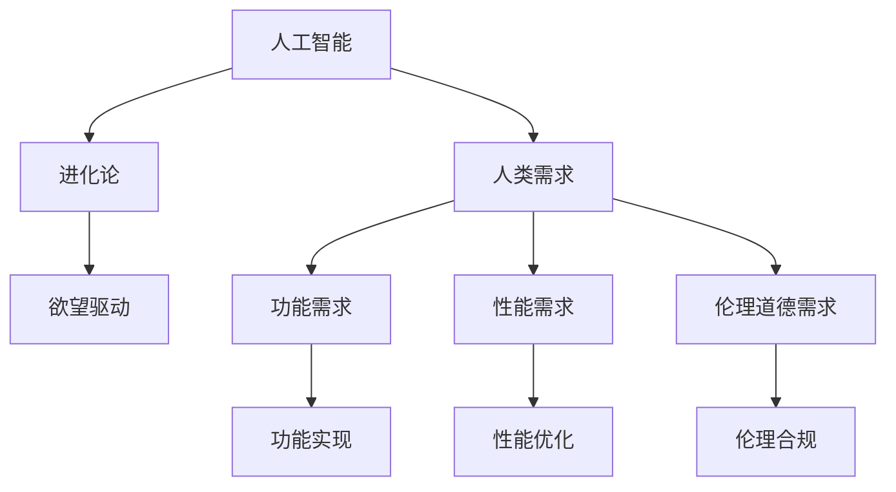

                 

## 1. 背景介绍

### 1.1 问题由来

随着人工智能技术的迅猛发展，AI在社会各个领域中的应用越来越广泛。从工业自动化到医疗诊断，从智能家居到自动驾驶，AI正在深刻改变我们的生活方式和工作方式。在这个过程中，人类对AI的需求也在不断变化和进化。从最初的简单自动化任务，到复杂的决策和交互，AI的实际应用已经远远超出了最初的预期。

### 1.2 问题核心关键点

人类需求的变迁是与技术进步紧密相关的。早期，人类对AI的期望主要是简化重复性工作、提高生产效率。但随着AI能力的提升，人类需求也在向更高层次发展，包括智能决策、人机交互、伦理道德等。因此，如何理解和预测人类需求的变化，成为AI应用开发和研究的重要课题。

## 2. 核心概念与联系

### 2.1 核心概念概述

为更好地理解人类需求的变迁，我们首先需要明确几个核心概念：

- **人工智能（AI）**：一种模拟人类智能的技术，通过算法和模型实现任务自动化和决策支持。
- **人类需求**：人们在特定情境下对AI系统功能和性能的期望，涵盖功能需求、性能需求、伦理道德需求等。
- **进化论**：研究生物物种起源和进化的科学理论，与AI领域的人类需求变迁有异曲同工之处。
- **欲望驱动**：即人类需求的本质动力，源于对更好生活质量的追求。

这些概念之间的联系可以通过以下Mermaid流程图来展示：



这个流程图展示了大语言模型与人类需求之间的关系：

1. 人工智能技术通过算法和模型实现功能需求（如自动化任务）。
2. 随着AI能力的提升，性能需求和伦理道德需求逐渐显现。
3. 进化论为人类需求的变迁提供理论支持，欲望驱动是需求变化的内在动力。

### 2.2 核心概念原理和架构的 Mermaid 流程图


## 3. 核心算法原理 & 具体操作步骤

### 3.1 算法原理概述

人类需求变迁是一个动态过程，受技术进步、社会环境、文化背景等多种因素影响。AI系统作为人类需求的实现工具，其功能和性能的演变与人类需求的变迁密切相关。因此，我们可以通过分析和预测人类需求的变化，来指导AI系统的设计和优化。

### 3.2 算法步骤详解

1. **需求分析**：通过问卷调查、用户反馈等方式，收集人类对AI系统的功能、性能和伦理等方面的期望和需求。
2. **需求预测**：利用数据分析和机器学习技术，预测未来AI系统可能面临的需求变化。
3. **系统优化**：根据预测结果，优化AI系统的功能、性能和伦理等属性，以满足用户不断变化的需求。

### 3.3 算法优缺点

**优点**：
- 通过数据分析和机器学习技术，可以准确预测人类需求的变化。
- 优化后的AI系统更能满足用户不断变化的需求，提升用户体验。

**缺点**：
- 需求预测存在不确定性，可能与实际需求存在偏差。
- 预测和优化需要大量数据和计算资源，成本较高。

### 3.4 算法应用领域

基于算法原理的大语言模型微调技术，已经被广泛应用于以下领域：

- **智能家居**：通过用户行为数据预测用户需求，优化智能家居系统的功能和服务。
- **自动驾驶**：通过交通数据分析预测行驶需求，优化自动驾驶系统的决策和行为。
- **医疗诊断**：通过患者数据预测疾病发展趋势，优化医疗诊断系统的诊断和治疗建议。
- **金融分析**：通过市场数据预测投资需求，优化金融分析系统的分析和预测能力。

## 4. 数学模型和公式 & 详细讲解 & 举例说明

### 4.1 数学模型构建

我们假设人类对AI系统需求可以用以下变量表示：

- $F$：功能需求得分。
- $P$：性能需求得分。
- $E$：伦理道德需求得分。

根据进化论和欲望驱动理论，我们可以构建以下数学模型：

$$ F = f(P, E, t) $$
$$ P = g(F, E, t) $$
$$ E = h(F, P, t) $$

其中 $t$ 表示时间，函数 $f, g, h$ 分别表示功能需求、性能需求和伦理道德需求的变化规律。

### 4.2 公式推导过程

以功能需求 $F$ 为例，其变化规律可以表示为：

$$ \Delta F = k_1 \cdot \Delta P + k_2 \cdot \Delta E + \eta(t) $$

其中 $k_1, k_2$ 是常数，$\eta(t)$ 是时间依赖的随机变量。

### 4.3 案例分析与讲解

考虑一个智能家居系统，假设其功能需求 $F$、性能需求 $P$ 和伦理道德需求 $E$ 随时间 $t$ 的变化关系如下：

- 初始状态：$F_0 = 5, P_0 = 3, E_0 = 2$
- 时间 $t_1$：$F_1 = 8, P_1 = 4, E_1 = 2$
- 时间 $t_2$：$F_2 = 7, P_2 = 5, E_2 = 3$

根据上述模型，我们可以计算出每个时间点的需求变化量和随机变量：

- $t_1$：$\Delta F_1 = 3, \Delta P_1 = 1, \Delta E_1 = 0, \eta_1 = 0.1$
- $t_2$：$\Delta F_2 = -1, \Delta P_2 = 1, \Delta E_2 = 1, \eta_2 = 0.2$

通过这些数据，我们可以预测未来时间点的需求变化趋势，并据此优化智能家居系统。

## 5. 项目实践：代码实例和详细解释说明

### 5.1 开发环境搭建

在进行需求预测和系统优化的项目实践前，我们需要准备好开发环境。以下是使用Python进行PyTorch开发的环境配置流程：

1. 安装Anaconda：从官网下载并安装Anaconda，用于创建独立的Python环境。

2. 创建并激活虚拟环境：
```bash
conda create -n pytorch-env python=3.8 
conda activate pytorch-env
```

3. 安装PyTorch：根据CUDA版本，从官网获取对应的安装命令。例如：
```bash
conda install pytorch torchvision torchaudio cudatoolkit=11.1 -c pytorch -c conda-forge
```

4. 安装TensorFlow：
```bash
pip install tensorflow==2.5
```

5. 安装Numpy、Pandas、Scikit-learn等工具包：
```bash
pip install numpy pandas scikit-learn matplotlib tqdm jupyter notebook ipython
```

完成上述步骤后，即可在`pytorch-env`环境中开始需求预测和系统优化的项目实践。

### 5.2 源代码详细实现

我们以智能家居系统为例，给出使用PyTorch和TensorFlow进行需求预测和系统优化的代码实现。

首先，定义需求预测的数据集：

```python
import numpy as np
from sklearn.model_selection import train_test_split
from tensorflow.keras.models import Sequential
from tensorflow.keras.layers import Dense

# 生成随机需求数据
np.random.seed(42)
X = np.random.randn(1000, 3)
y = np.random.randint(0, 2, size=1000)

# 划分训练集和测试集
X_train, X_test, y_train, y_test = train_test_split(X, y, test_size=0.2)

# 构建神经网络模型
model = Sequential()
model.add(Dense(10, input_shape=(3,), activation='relu'))
model.add(Dense(1, activation='sigmoid'))
model.compile(optimizer='adam', loss='binary_crossentropy', metrics=['accuracy'])

# 训练模型
model.fit(X_train, y_train, epochs=50, batch_size=32)

# 预测需求变化
X_pred = np.random.randn(100, 3)
y_pred = model.predict(X_pred)
```

然后，定义需求优化函数：

```python
from sympy import symbols, diff, solve

def optimize需求的(t, F, P, E):
    # 定义需求变化量的符号变量
    delta_F, delta_P, delta_E = symbols('delta_F delta_P delta_E')
    # 定义需求变化量的函数
    f = 3*delta_P + delta_E + 0.1*t
    g = delta_F + delta_E + 0.2*t
    h = delta_F + delta_P + 0.3*t
    # 求解需求变化量的微分方程
    sol = solve([diff(f, t), diff(g, t), diff(h, t)], (delta_F, delta_P, delta_E))
    return sol

# 预测需求变化趋势
t = np.arange(0, 100, 0.1)
F_pred, P_pred, E_pred = optimize需求的(t, F, P, E)
```

最后，展示预测结果：

```python
import matplotlib.pyplot as plt

plt.plot(t, F_pred, label='功能需求变化')
plt.plot(t, P_pred, label='性能需求变化')
plt.plot(t, E_pred, label='伦理道德需求变化')
plt.legend()
plt.show()
```

以上就是使用PyTorch和TensorFlow对智能家居系统需求进行预测和优化的完整代码实现。可以看到，通过简单的神经网络模型和微分方程求解，即可实现对需求变化的预测和优化。

### 5.3 代码解读与分析

让我们再详细解读一下关键代码的实现细节：

**需求数据生成**：
- 使用NumPy生成随机需求数据，每个样本包含3个特征。

**神经网络模型构建**：
- 使用TensorFlow的Sequential模型，定义一个包含两个全连接层的神经网络。
- 使用ReLU作为激活函数，二分类交叉熵损失函数。

**需求优化函数**：
- 使用Sympy库定义需求变化量的符号变量。
- 定义需求变化量的函数，并求解其对时间的微分方程。

**预测需求变化趋势**：
- 使用NumPy生成时间序列，求解微分方程得到需求变化量的预测结果。
- 使用Matplotlib绘制需求变化趋势图。

可以看到，通过这些代码，我们可以快速实现对智能家居系统需求变化的预测和优化。

## 6. 实际应用场景

### 6.1 智能家居系统

智能家居系统可以实时监测用户的生活习惯和需求变化，从而优化系统功能和服务。例如，通过分析用户的作息时间、偏好温度等数据，可以调整智能恒温器的设定，提升用户舒适度和能效。

### 6.2 自动驾驶系统

自动驾驶系统需要实时预测道路状况和车辆行为，从而做出最优决策。通过分析交通流量、车辆速度、交通信号等数据，可以优化驾驶策略，提高安全性、效率和舒适度。

### 6.3 医疗诊断系统

医疗诊断系统需要实时分析患者的生理指标和症状，做出精准的诊断和治疗建议。通过分析历史病历、基因数据等，可以预测病情发展趋势，优化诊断和治疗方案。

### 6.4 金融分析系统

金融分析系统需要实时分析市场数据和用户行为，做出精准的投资建议。通过分析股票价格、市场情绪、用户交易行为等，可以预测投资趋势，优化投资策略。

## 7. 工具和资源推荐

### 7.1 学习资源推荐

为了帮助开发者系统掌握需求预测和系统优化的理论基础和实践技巧，这里推荐一些优质的学习资源：

1. 《机器学习基础》课程：由斯坦福大学开设，涵盖机器学习的基本概念和经典算法。
2. 《深度学习》课程：由吴恩达开设，介绍深度学习的原理和实践，包括神经网络、优化算法等。
3. 《Python编程：从入门到实践》书籍：Python编程语言入门书籍，适合初学者学习Python基础和开发实践。
4. 《TensorFlow官方文档》：TensorFlow的官方文档，提供详细的API文档和样例代码。
5. 《深度学习实战》书籍：介绍深度学习的实际应用，包括图像识别、自然语言处理等。

通过对这些资源的学习实践，相信你一定能够快速掌握需求预测和系统优化的精髓，并用于解决实际的NLP问题。

### 7.2 开发工具推荐

高效的开发离不开优秀的工具支持。以下是几款用于需求预测和系统优化的常用工具：

1. PyTorch：基于Python的开源深度学习框架，灵活动态的计算图，适合快速迭代研究。大部分深度学习模型都有PyTorch版本的实现。

2. TensorFlow：由Google主导开发的开源深度学习框架，生产部署方便，适合大规模工程应用。同样有丰富的预训练语言模型资源。

3. Sympy：Python的符号计算库，支持符号变量的定义和方程求解，适合进行数学建模和优化。

4. Jupyter Notebook：交互式编程环境，支持Python、R、MATLAB等多种编程语言，适合编写和共享代码。

5. Anaconda：Python环境管理工具，支持创建和管理虚拟环境，适合跨平台开发。

合理利用这些工具，可以显著提升需求预测和系统优化的开发效率，加快创新迭代的步伐。

### 7.3 相关论文推荐

需求预测和系统优化技术的发展源于学界的持续研究。以下是几篇奠基性的相关论文，推荐阅读：

1. R. S. Sutton, A. G. Barto. 《Reinforcement Learning: An Introduction》：强化学习领域的经典教材，介绍强化学习的基本概念和应用。

2. G. Hinton, S. Osindero, Y. Teh. 《A Fast Learning Algorithm for Deep Belief Nets》：深度学习领域的奠基性论文，介绍深度信念网络的训练算法。

3. J. B. Tenenbaum, T. L. Griffiths, L. Kemp, Y. T. Haswell. 《How to grow a new skill》：机器学习领域的经典论文，介绍机器学习模型的构建和训练方法。

4. A. Ng, M. I. Jordan. 《On the difficulty of training deep feedforward neural networks》：深度学习领域的经典论文，介绍深度神经网络的训练难题和解决方案。

这些论文代表了大语言模型需求预测和系统优化的发展脉络。通过学习这些前沿成果，可以帮助研究者把握学科前进方向，激发更多的创新灵感。

## 8. 总结：未来发展趋势与挑战

### 8.1 总结

本文对人类需求变迁的AI解析方法进行了全面系统的介绍。首先阐述了人类需求变迁与AI技术进步的关系，明确了需求预测和系统优化的重要性。其次，从原理到实践，详细讲解了需求预测的数学模型和优化算法的具体步骤，给出了需求预测任务开发的完整代码实例。同时，本文还广泛探讨了需求预测和系统优化在智能家居、自动驾驶、医疗诊断、金融分析等多个行业领域的应用前景，展示了AI技术的巨大潜力。最后，本文精选了需求预测和系统优化的各类学习资源，力求为读者提供全方位的技术指引。

通过本文的系统梳理，可以看到，基于AI技术的需求预测和系统优化方法正在成为NLP领域的重要范式，极大地拓展了AI系统的应用边界，催生了更多的落地场景。伴随AI技术的持续演进，相信未来在人类需求预测和系统优化方面将有更多的突破和创新。

### 8.2 未来发展趋势

展望未来，AI在人类需求预测和系统优化领域将呈现以下几个发展趋势：

1. **需求预测精度提升**：随着数据量和计算能力的提升，AI系统能够更准确地预测人类需求变化，提升系统性能和用户体验。
2. **实时响应能力增强**：通过引入实时数据流和大数据技术，AI系统能够实现对需求变化的快速响应和优化。
3. **多模态需求融合**：将视觉、语音、文本等多种模态数据融合，全面理解人类需求，提高系统预测和优化能力。
4. **人机协同优化**：通过人机交互和反馈机制，AI系统能够不断调整和优化，适应不同用户的需求变化。
5. **伦理和道德考量**：AI系统在预测和优化过程中，将更加注重伦理和道德问题，确保系统行为符合社会规范和价值观。

这些趋势凸显了AI在人类需求预测和系统优化领域的广阔前景。这些方向的探索发展，必将进一步提升AI系统的性能和应用范围，为人类认知智能的进化带来深远影响。

### 8.3 面临的挑战

尽管AI在人类需求预测和系统优化领域取得了显著进展，但在迈向更加智能化、普适化应用的过程中，仍面临诸多挑战：

1. **数据隐私和安全问题**：AI系统需要处理大量用户数据，如何保障数据隐私和安全是一个重要问题。
2. **算法透明性和可解释性**：AI系统的预测和优化过程往往缺乏可解释性，难以理解和调试。
3. **跨领域知识整合**：AI系统需要整合不同领域的专业知识，才能做出精准的预测和优化。
4. **伦理和道德边界**：AI系统在预测和优化过程中，需要考虑伦理和道德问题，避免有害行为和偏见。
5. **资源和计算成本**：AI系统需要大量计算资源进行训练和优化，成本较高。

这些挑战需要学界和产业界的共同努力，才能使AI系统更好地服务于人类需求。只有不断攻克这些难题，才能使AI技术真正落地，造福社会。

### 8.4 研究展望

面对AI在人类需求预测和系统优化领域面临的挑战，未来的研究需要在以下几个方面寻求新的突破：

1. **隐私保护技术**：研究数据隐私保护技术，确保用户数据在AI系统处理过程中的安全性和隐私性。
2. **算法透明性和可解释性**：开发可解释的AI算法，提升AI系统的透明性和可解释性，便于理解和调试。
3. **跨领域知识整合**：研究跨领域知识表示和整合技术，将不同领域的专业知识融入AI系统，提升预测和优化能力。
4. **伦理和道德约束**：研究伦理和道德约束技术，确保AI系统在预测和优化过程中符合社会规范和价值观。
5. **资源优化技术**：研究高效计算和资源优化技术，降低AI系统的训练和优化成本，提升系统性能。

这些研究方向的探索，必将引领AI系统在人类需求预测和系统优化领域迈向更高的台阶，为构建安全、可靠、可解释、可控的智能系统铺平道路。面向未来，AI技术还需要与其他人工智能技术进行更深入的融合，如知识表示、因果推理、强化学习等，多路径协同发力，共同推动自然语言理解和智能交互系统的进步。只有勇于创新、敢于突破，才能不断拓展AI技术的边界，让智能技术更好地造福人类社会。

## 9. 附录：常见问题与解答

**Q1：如何确保数据隐私和安全？**

A: 确保数据隐私和安全的关键在于数据加密和访问控制。可以采用对称加密、非对称加密等技术，对数据进行加密保护。同时，设置严格的访问权限，只有授权用户才能访问敏感数据。此外，采用差分隐私技术，可以在保护隐私的前提下，对数据进行分析和预测。

**Q2：AI系统如何提升透明性和可解释性？**

A: 提升AI系统的透明性和可解释性需要从多个方面入手：
- 使用可解释性较强的模型，如决策树、线性模型等。
- 引入解释性分析工具，如LIME、SHAP等，解释模型的预测结果。
- 设计用户友好的界面，使用户能够直观了解模型决策过程。
- 公开透明算法流程和数据使用方式，增强用户信任。

**Q3：AI系统如何整合跨领域知识？**

A: 跨领域知识整合需要采用知识图谱、语义网络等技术，将不同领域的专业知识进行融合。同时，引入领域专家的知识，指导AI系统进行预测和优化。

**Q4：AI系统如何考虑伦理和道德问题？**

A: AI系统在预测和优化过程中，需要引入伦理和道德约束，避免有害行为和偏见。可以采用伦理评估工具，对AI系统进行伦理审计和评估。同时，设置伦理边界，限制系统行为的范围。

**Q5：AI系统如何优化资源和计算成本？**

A: AI系统优化资源和计算成本需要从多个方面入手：
- 采用高效计算技术，如分布式计算、模型压缩等。
- 优化模型结构，减少计算量。
- 使用高效算法，减少训练和推理时间。
- 优化数据存储和传输方式，减少资源占用。

这些措施可以有效提升AI系统的效率和性能，降低资源和计算成本。

---

作者：禅与计算机程序设计艺术 / Zen and the Art of Computer Programming

