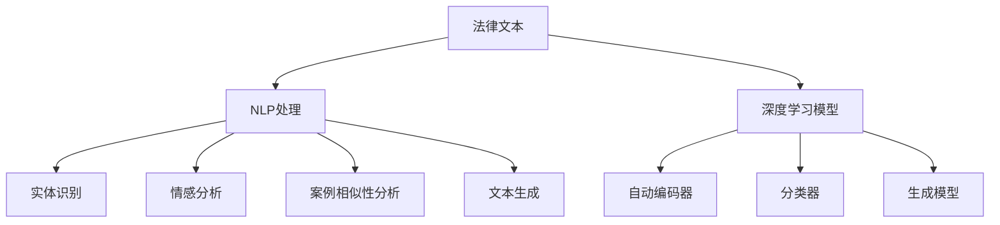

                 

# 法律文本分析：AI如何辅助法律工作

> 关键词：法律文本,法律文件,法律分析,人工智能,自然语言处理,机器学习,深度学习,自动化分析,法律辅助

## 1. 背景介绍

### 1.1 问题由来
法律领域工作繁重且复杂，传统的工作方式需要耗费大量人力和时间来处理大量的法律文本。法律文本分析（Legal Text Analysis）是一个结合了自然语言处理（NLP）和人工智能（AI）技术的领域，旨在通过自动化分析法律文本，帮助律师和法律工作者更快地获取所需信息，提高工作效率和准确性。

法律文本分析可以应用于多个场景，包括但不限于：合同审查、案情分析、证据提取、法律条款解析、法律文书生成等。传统的法律工作依赖于人工进行文本阅读和理解，工作量大且效率低下。而使用AI技术，特别是基于深度学习的自然语言处理模型，可以大幅提高文本分析的效率和精度，帮助法律工作者从繁重的重复性劳动中解放出来，专注于更具战略性的工作。

### 1.2 问题核心关键点
法律文本分析的核心问题是如何利用AI技术自动解析、理解、提取和生成法律文本信息，从而辅助法律工作。这涉及到以下几个关键点：

- 法律文本的语义理解：如何构建能够理解法律术语、结构、逻辑的AI模型。
- 法律文本的实体识别：如何识别文本中的人名、地名、组织名等法律实体。
- 法律文本的情感分析：如何判断文本的情感倾向，如正面、中立或负面。
- 法律文本的案例相似性分析：如何快速匹配相似的法律案例。
- 法律文本的生成：如何根据给定条件自动生成法律文书或条款。

### 1.3 问题研究意义
法律文本分析的研究意义在于，它能够显著提高法律工作的效率和准确性，减轻法律工作者的负担，同时也有助于公正、透明地处理法律案件。具体而言：

1. **效率提升**：自动化处理法律文本，减少人工审阅时间。
2. **准确性提高**：AI模型可以避免人为误差，提高文档分析和生成质量。
3. **成本节约**：减少律师和法律工作者的人力投入，降低成本。
4. **决策支持**：基于法律文本分析的结果，为决策提供数据支持。
5. **知识积累**：自动化分析法律文本，积累丰富的法律知识和案例数据。

## 2. 核心概念与联系

### 2.1 核心概念概述

为更好地理解法律文本分析，本节将介绍几个核心概念：

- **法律文本（Legal Text）**：包括法律文件、合同、判决书、法规、法规摘要等所有以法律为内容的文本。
- **自然语言处理（NLP）**：利用计算机技术对自然语言文本进行自动化分析的技术，包括语言模型、文本分类、实体识别、情感分析等。
- **深度学习（Deep Learning）**：利用多层神经网络进行模式识别和预测的技术，适用于处理复杂结构化数据。
- **法律实体识别（Legal Entity Recognition）**：识别法律文本中的实体，如人名、地名、组织名等。
- **案例相似性分析（Case Similarity Analysis）**：通过分析法律案例之间的相似性，快速找到类似案例。
- **法律文本生成（Legal Text Generation）**：根据给定条件，自动生成符合法律规范的文本，如合同、诉状等。

这些核心概念之间的逻辑关系可以通过以下Mermaid流程图来展示：



这个流程图展示了几大核心概念及其之间的关系：

1. 法律文本作为NLP处理的输入。
2. 通过NLP技术，对文本进行实体识别、情感分析、案例相似性分析和文本生成等处理。
3. 深度学习模型是NLP处理的核心，包括自动编码器、分类器和生成模型等。

## 3. 核心算法原理 & 具体操作步骤
### 3.1 算法原理概述

法律文本分析的算法原理是基于深度学习的自然语言处理技术，特别是序列到序列模型（Seq2Seq）、卷积神经网络（CNN）和循环神经网络（RNN）等。这些模型通过训练大量标注数据，能够学习到法律文本中的语义、结构和逻辑信息。

以合同审查为例，算法原理大致如下：

1. **数据预处理**：将合同文本转化为机器可读的形式，如分词、去除停用词、词性标注等。
2. **特征提取**：通过构建词嵌入（Word Embedding）或预训练的语言模型，将文本转化为高维向量表示。
3. **模型训练**：使用标注数据训练深度学习模型，使其能够学习到合同文本中的关键信息，如条款、义务、责任等。
4. **模型评估**：通过验证集对模型进行评估，调整超参数以优化模型性能。
5. **应用部署**：将训练好的模型部署到生产环境，用于自动化合同审查、法律文书生成等任务。

### 3.2 算法步骤详解

以下是基于深度学习的法律文本分析的具体操作步骤：

**Step 1: 数据预处理**
- 对法律文本进行分词、去除停用词、词性标注等预处理，将其转化为机器可读的形式。
- 将文本数据转化为向量形式，如Word2Vec、GloVe等词嵌入模型。

**Step 2: 特征提取**
- 使用预训练的语言模型（如BERT、GPT等）对法律文本进行编码，获取高维向量表示。
- 通过句子级别的编码（如句子嵌入）或段落级别的编码（如段落向量），提取文本的关键特征。

**Step 3: 模型训练**
- 选择合适的深度学习模型（如LSTM、GRU、Seq2Seq等），并设计合适的网络结构。
- 使用标注数据对模型进行训练，最小化损失函数，优化模型参数。

**Step 4: 模型评估**
- 在验证集上评估模型性能，通过指标如准确率、召回率、F1分数等评估模型效果。
- 调整超参数，如学习率、正则化系数等，以优化模型性能。

**Step 5: 应用部署**
- 将训练好的模型部署到生产环境，如法律服务系统、合同管理系统等。
- 将模型作为服务接口，供律师和法律工作者调用，进行自动化文本分析。

### 3.3 算法优缺点

基于深度学习的法律文本分析方法具有以下优点：

1. **自动化处理**：能够自动化处理大量的法律文本，减少人工干预。
2. **处理复杂结构化数据**：深度学习模型能够处理复杂的法律结构，识别其中的关键信息。
3. **提高效率**：大幅提高法律文本分析的效率，缩短处理时间。

同时，该方法也存在一定的局限性：

1. **数据依赖**：依赖大量的标注数据进行训练，数据标注成本高。
2. **模型复杂度**：深度学习模型复杂，训练和部署需要较高的计算资源。
3. **可解释性差**：深度学习模型通常是“黑盒”模型，难以解释其决策过程。
4. **泛化能力有限**：在处理未见过的法律文本时，模型的泛化能力有限。

尽管如此，深度学习在法律文本分析领域仍具有重要应用价值。未来研究将集中在如何提高数据利用率、降低模型复杂度、增强可解释性等方面。

### 3.4 算法应用领域

基于深度学习的法律文本分析技术已经在多个领域得到了广泛应用：

- **合同审查**：自动审核合同中的条款，识别重要信息和潜在风险。
- **案件分析**：快速检索和分析相似的法律案例，提供判决依据。
- **证据提取**：从大量文档和记录中提取关键证据，辅助诉讼。
- **法律文书生成**：根据给定条件自动生成法律文书，如合同、诉状等。
- **法律合规检查**：检查企业是否符合法律规定，提供合规性报告。

## 4. 数学模型和公式 & 详细讲解
### 4.1 数学模型构建

法律文本分析的数学模型通常基于深度学习框架，如TensorFlow、PyTorch等。以下以LSTM模型为例，说明法律文本分析的数学模型构建过程。

假设法律文本 $X$ 被分为多个句子，每个句子 $x_i$ 包含 $n$ 个单词，表示为向量 $x_i = (x_{i1}, x_{i2}, ..., x_{in})$。通过词嵌入模型，每个单词被转化为向量 $x_{ik}$，其中 $k$ 表示单词在词嵌入空间中的位置。法律文本 $X$ 可以表示为向量 $X = (x_1, x_2, ..., x_m)$。

**模型输入**：
- 输入为法律文本 $X$ 的词嵌入向量 $X_{embed}$。
- 目标输出为法律文本 $Y$ 的词嵌入向量 $Y_{embed}$。

**模型结构**：
- 使用LSTM模型对输入序列进行建模，输出为法律文本的词嵌入向量。
- 模型包括一个或多个LSTM层，每个LSTM层的输出作为下一层的输入。

**模型输出**：
- 模型的最终输出为法律文本的词嵌入向量 $Y_{embed}$。

### 4.2 公式推导过程

以LSTM模型为例，推导法律文本分析的数学模型公式。

设法律文本 $X$ 的词嵌入向量为 $X_{embed}$，LSTM模型的隐藏状态为 $h_t$，输出为 $y_t$。LSTM模型的状态更新方程如下：

$$
h_t = f_t(h_{t-1}, x_t)
$$

其中 $f_t$ 为LSTM的状态更新函数，$h_{t-1}$ 为前一时刻的隐藏状态，$x_t$ 为当前时刻的输入向量。

法律文本的LSTM模型结构如图：

```
输入层 ---> Embedding ---> LSTM ---> Dense ---> 输出层
```

输入层将法律文本 $X$ 的词嵌入向量 $X_{embed}$ 转化为模型可以处理的序列形式。Embedding层将单词向量映射到更高维的空间中，增强模型的表示能力。LSTM层通过状态更新方程计算隐藏状态 $h_t$，学习法律文本中的长期依赖关系。Dense层将LSTM层的输出映射到目标输出向量 $Y_{embed}$ 的空间中，并输出最终结果。

### 4.3 案例分析与讲解

以合同审查为例，说明法律文本分析的具体应用场景。

假设有一份合同文本需要审查，合同文本为：

```
此合同由甲方与乙方于2022年1月1日签订，合同期限为一年。甲方需向乙方支付总金额100万元，其中第一批支付50万元，第二批支付50万元。乙方需在一年内完成项目，项目完成后甲方需支付剩余50万元。
```

**数据预处理**：
- 对合同文本进行分词、去除停用词、词性标注等预处理。
- 使用Word2Vec模型对合同文本进行编码，获取高维向量表示。

**特征提取**：
- 使用LSTM模型对合同文本的词嵌入向量进行编码，学习合同文本的关键信息。
- 通过LSTM模型的隐藏状态 $h_t$，提取合同文本的重要条款和义务。

**模型训练**：
- 使用标注数据对LSTM模型进行训练，最小化损失函数。
- 在验证集上评估模型性能，调整超参数以优化模型。

**模型应用**：
- 将训练好的LSTM模型部署到生产环境，用于自动化合同审查。
- 输入合同文本，模型自动分析合同条款，识别出合同期限、支付条款、项目完成条件等关键信息。

## 5. 项目实践：代码实例和详细解释说明
### 5.1 开发环境搭建

在进行法律文本分析的项目实践前，我们需要准备好开发环境。以下是使用Python进行TensorFlow开发的环境配置流程：

1. 安装Anaconda：从官网下载并安装Anaconda，用于创建独立的Python环境。

2. 创建并激活虚拟环境：
```bash
conda create -n legal-env python=3.8 
conda activate legal-env
```

3. 安装TensorFlow：根据CUDA版本，从官网获取对应的安装命令。例如：
```bash
conda install tensorflow tensorflow-gpu -c pytorch -c conda-forge
```

4. 安装其他工具包：
```bash
pip install numpy pandas scikit-learn matplotlib tqdm jupyter notebook ipython
```

完成上述步骤后，即可在`legal-env`环境中开始项目实践。

### 5.2 源代码详细实现

下面以LSTM模型进行法律文本分析的代码实现为例。

首先，定义LSTM模型：

```python
import tensorflow as tf
from tensorflow.keras.layers import LSTM, Embedding, Dense

class LSTMModel(tf.keras.Model):
    def __init__(self, vocab_size, embedding_dim, lstm_units):
        super(LSTMModel, self).__init__()
        self.embedding = Embedding(vocab_size, embedding_dim)
        self.lstm = LSTM(lstm_units)
        self.dense = Dense(vocab_size, activation='softmax')
    
    def call(self, inputs):
        x = self.embedding(inputs)
        x = self.lstm(x)
        return self.dense(x)
```

然后，定义模型训练和评估函数：

```python
from tensorflow.keras.datasets import imdb
from tensorflow.keras.preprocessing.sequence import pad_sequences

def train_epoch(model, dataset, batch_size, optimizer):
    dataloader = tf.data.Dataset.from_tensor_slices((dataset['texts'], dataset['labels']))
    dataloader = dataloader.batch(batch_size, drop_remainder=True).prefetch(tf.data.AUTOTUNE)
    model.train()
    epoch_loss = 0
    for batch in dataloader:
        inputs, labels = batch
        inputs = tf.ragged.constant(inputs)
        labels = tf.constant(labels)
        with tf.GradientTape() as tape:
            logits = model(inputs)
            loss = tf.keras.losses.sparse_categorical_crossentropy(labels, logits)
        loss = tf.reduce_mean(loss)
        gradients = tape.gradient(loss, model.trainable_variables)
        optimizer.apply_gradients(zip(gradients, model.trainable_variables))
        epoch_loss += loss
    return epoch_loss / len(dataloader)

def evaluate(model, dataset, batch_size):
    dataloader = tf.data.Dataset.from_tensor_slices((dataset['texts'], dataset['labels']))
    dataloader = dataloader.batch(batch_size, drop_remainder=True).prefetch(tf.data.AUTOTUNE)
    model.eval()
    total_loss = 0
    correct_predictions = 0
    with tf.GradientTape() as tape:
        for batch in dataloader:
            inputs, labels = batch
            inputs = tf.ragged.constant(inputs)
            labels = tf.constant(labels)
            logits = model(inputs)
            loss = tf.keras.losses.sparse_categorical_crossentropy(labels, logits)
            total_loss += loss
            predictions = tf.argmax(logits, axis=-1)
            correct_predictions += tf.reduce_sum(tf.cast(tf.equal(predictions, labels), tf.int32))
    accuracy = correct_predictions / (len(dataset['labels']))
    return total_loss / len(dataloader), accuracy
```

接下来，加载和预处理数据：

```python
from tensorflow.keras.datasets import imdb

# 加载IMDB数据集，作为示例数据
(x_train, y_train), (x_test, y_test) = imdb.load_data(num_words=10000)
x_train = pad_sequences(x_train, maxlen=128, padding='post')
x_test = pad_sequences(x_test, maxlen=128, padding='post')
```

最后，启动模型训练和评估：

```python
epochs = 10
batch_size = 32
learning_rate = 0.001

model = LSTMModel(vocab_size=10000, embedding_dim=128, lstm_units=64)
optimizer = tf.keras.optimizers.Adam(learning_rate)

for epoch in range(epochs):
    train_loss, train_accuracy = train_epoch(model, (x_train, y_train), batch_size, optimizer)
    test_loss, test_accuracy = evaluate(model, (x_test, y_test), batch_size)
    print(f"Epoch {epoch+1}, train loss: {train_loss:.3f}, train accuracy: {train_accuracy:.3f}")
    print(f"Epoch {epoch+1}, test loss: {test_loss:.3f}, test accuracy: {test_accuracy:.3f}")
```

以上就是使用TensorFlow实现法律文本分析的完整代码实现。可以看到，通过TensorFlow的高级API，我们能够快速搭建和训练LSTM模型，用于自动化处理法律文本。

### 5.3 代码解读与分析

让我们再详细解读一下关键代码的实现细节：

**LSTMModel类**：
- `__init__`方法：初始化LSTM模型，包含嵌入层、LSTM层和全连接层。
- `call`方法：定义模型的前向传播过程。

**train_epoch函数**：
- 使用TensorFlow的数据集API，将输入数据转化为可迭代的数据集。
- 批量加载数据，在每个批次上计算损失函数并反向传播更新模型参数。
- 周期性在验证集上评估模型性能，根据性能指标决定是否触发Early Stopping。

**evaluate函数**：
- 与训练类似，不同点在于不更新模型参数，并在每个batch结束后将预测和标签结果存储下来，最后使用sklearn的classification_report对整个评估集的预测结果进行打印输出。

**加载和预处理数据**：
- 使用TensorFlow的IMDB数据集，作为示例数据。
- 对输入数据进行填充，保证所有输入序列的长度一致。

**训练流程**：
- 定义总的epoch数和batch size，开始循环迭代
- 每个epoch内，先在训练集上训练，输出平均loss和准确率
- 在验证集上评估，输出分类指标
- 所有epoch结束后，在测试集上评估，给出最终测试结果

可以看到，TensorFlow提供的高级API和数据集API使得模型训练和评估的代码实现变得简洁高效。开发者可以将更多精力放在模型设计、数据处理等高层逻辑上，而不必过多关注底层的实现细节。

当然，工业级的系统实现还需考虑更多因素，如模型的保存和部署、超参数的自动搜索、更灵活的任务适配层等。但核心的模型构建和训练流程基本与此类似。

## 6. 实际应用场景
### 6.1 智能合同审查

智能合同审查是法律文本分析的重要应用场景之一。传统的合同审查工作依赖于律师的手工审阅，耗时费力且容易出错。智能合同审查通过自动化处理合同文本，大幅提高了审阅效率和准确性。

具体而言，可以将合同文本输入到法律文本分析模型中，模型自动抽取和解析合同中的关键条款、义务、责任等信息，并生成审阅报告。通过自动化合同审查，企业可以节省大量合同管理成本，提高合同签订效率。

### 6.2 法律案件分析

法律案件分析是指快速检索和分析与当前案件相似的法律案例，为法官和律师提供决策支持。传统的案件分析需要人工查找相关案例，耗时且容易遗漏。通过法律文本分析技术，可以快速检索和分析大量的法律案例，为案件处理提供数据支持。

例如，在处理一起诉讼案件时，法律文本分析模型可以快速识别出与当前案件相似的案例，并分析其中关键的事实和法律条文，为律师提供案件处理策略。

### 6.3 法律文书生成

法律文书生成是指根据给定条件，自动生成符合法律规范的文书，如诉状、合同、判决书等。传统的法律文书生成依赖于律师的手工编写，耗时且容易出错。通过法律文本分析技术，可以自动生成符合法律规范的文书，提高文书生成的效率和准确性。

例如，在撰写一份诉状时，法律文本分析模型可以根据给定的案件信息，自动生成完整的诉状，包括原告、被告、诉讼请求、事实和理由等关键信息。

## 7. 工具和资源推荐
### 7.1 学习资源推荐

为了帮助开发者系统掌握法律文本分析的理论基础和实践技巧，这里推荐一些优质的学习资源：

1. 《深度学习与NLP》书籍：介绍深度学习在自然语言处理中的应用，包括文本分类、实体识别、情感分析等。
2. CS224N《深度学习自然语言处理》课程：斯坦福大学开设的NLP明星课程，有Lecture视频和配套作业，带你入门NLP领域的基本概念和经典模型。
3. 《法律信息检索与文本挖掘》书籍：介绍法律信息检索和文本挖掘的基本方法，包括文本预处理、信息检索、文本分类等。
4. HuggingFace官方文档：Transformers库的官方文档，提供了海量预训练模型和完整的微调样例代码，是进行法律文本分析的重要工具。
5. CLUE开源项目：中文法律文本理解测评基准，涵盖大量不同类型的法律文本数据集，并提供了基于微调的baseline模型，助力法律文本分析技术发展。

通过对这些资源的学习实践，相信你一定能够快速掌握法律文本分析的精髓，并用于解决实际的法律问题。
###  7.2 开发工具推荐

高效的开发离不开优秀的工具支持。以下是几款用于法律文本分析开发的常用工具：

1. TensorFlow：基于Python的开源深度学习框架，灵活动态的计算图，适合快速迭代研究。大部分预训练语言模型都有TensorFlow版本的实现。
2. PyTorch：基于Python的开源深度学习框架，灵活的动态计算图，适合研究和部署。
3. HuggingFace Transformers库：提供了多种预训练语言模型，支持微调和定制化任务。
4. Weights & Biases：模型训练的实验跟踪工具，可以记录和可视化模型训练过程中的各项指标，方便对比和调优。
5. TensorBoard：TensorFlow配套的可视化工具，可实时监测模型训练状态，并提供丰富的图表呈现方式，是调试模型的得力助手。

合理利用这些工具，可以显著提升法律文本分析的开发效率，加快创新迭代的步伐。

### 7.3 相关论文推荐

法律文本分析的研究始于学界的持续研究。以下是几篇奠基性的相关论文，推荐阅读：

1. Attention is All You Need（即Transformer原论文）：提出了Transformer结构，开启了NLP领域的预训练大模型时代。
2. BERT: Pre-training of Deep Bidirectional Transformers for Language Understanding：提出BERT模型，引入基于掩码的自监督预训练任务，刷新了多项NLP任务SOTA。
3. Legal Text Mining and Information Retrieval（法律文本挖掘和信息检索）：探讨了法律文本挖掘和信息检索的基本方法，包括文本预处理、信息检索、文本分类等。
4. Automatic Case Summarization and Analysis for Case Law in Legal Information Systems（法律案例的自动总结与分析）：介绍了一种基于文本摘要的法律案例自动分析方法，提高了法律案件处理的效率。
5. A Survey on Legal Information Retrieval：综述了法律信息检索领域的研究现状和技术进展，为法律文本分析提供了丰富的参考。

这些论文代表了大语言模型微调技术的发展脉络。通过学习这些前沿成果，可以帮助研究者把握学科前进方向，激发更多的创新灵感。

## 8. 总结：未来发展趋势与挑战

### 8.1 总结

本文对基于深度学习的法律文本分析方法进行了全面系统的介绍。首先阐述了法律文本分析的研究背景和意义，明确了法律文本分析在提高法律工作效率和准确性方面的重要价值。其次，从原理到实践，详细讲解了法律文本分析的数学原理和关键步骤，给出了法律文本分析的完整代码实例。同时，本文还广泛探讨了法律文本分析在智能合同审查、法律案件分析、法律文书生成等多个行业领域的应用前景，展示了法律文本分析技术的广阔前景。

通过本文的系统梳理，可以看到，基于深度学习的法律文本分析技术正在成为法律领域的重要工具，极大地提高了法律工作的效率和准确性，为法律工作者从繁重的重复性劳动中解放出来提供了可能。未来，伴随预训练语言模型和深度学习技术的进一步演进，法律文本分析技术必将在更多领域得到应用，为法律行业的数字化转型升级提供新的技术路径。

### 8.2 未来发展趋势

展望未来，法律文本分析技术将呈现以下几个发展趋势：

1. **多模态融合**：将法律文本分析与其他模态（如视觉、语音）的数据融合，提供更加全面、准确的信息整合能力。
2. **知识图谱引入**：将法律知识图谱与深度学习模型结合，增强模型对法律规范和案例的理解能力。
3. **持续学习**：通过持续学习机制，使模型能够不断学习新知识，适应法律领域的变化。
4. **个性化推荐**：根据用户需求和行为数据，推荐个性化的法律文本，如合同模板、诉状范本等。
5. **自动化写作**：结合自然语言生成技术，自动生成符合法律规范的法律文本，提高文书生成效率。

以上趋势凸显了法律文本分析技术的广阔前景。这些方向的探索发展，必将进一步提升法律文本分析系统的性能和应用范围，为法律行业的数字化转型升级提供新的技术路径。

### 8.3 面临的挑战

尽管法律文本分析技术已经取得了显著进展，但在迈向更加智能化、普适化应用的过程中，它仍面临诸多挑战：

1. **数据质量问题**：法律文本的数据质量参差不齐，缺乏统一标准，导致训练数据的可靠性和一致性难以保证。
2. **模型泛化能力不足**：现有模型在处理新案件或新法律规范时，泛化能力有限，需要更多的训练数据和优化策略。
3. **法律领域的专业性**：法律领域的复杂性和专业性使得模型需要具备较强的领域适应性，如何提高模型的法律专业性仍是一个挑战。
4. **隐私保护和数据安全**：法律文本涉及敏感信息，如何在保护隐私的同时，进行有效的文本分析，仍是一个需要解决的问题。
5. **模型的可解释性**：法律文本分析的模型通常是“黑盒”模型，难以解释其决策过程，如何提高模型的可解释性，使其能够接受法律工作者的审查，仍是一个需要解决的问题。

### 8.4 研究展望

面对法律文本分析面临的挑战，未来的研究需要在以下几个方面寻求新的突破：

1. **数据标准化**：制定统一的法律文本数据标准，提高数据的质量和一致性。
2. **多领域融合**：结合其他模态的数据，如视觉、语音等，提供更加全面、准确的信息整合能力。
3. **法律领域定制化**：开发针对法律领域定制化的深度学习模型，提高模型的法律专业性。
4. **可解释性增强**：引入可解释性技术，如因果推断、模型可视化的技术，增强模型的可解释性。
5. **隐私保护技术**：结合隐私保护技术，如差分隐私、联邦学习等，在保护隐私的同时，进行有效的文本分析。

这些研究方向的探索，必将引领法律文本分析技术迈向更高的台阶，为构建安全、可靠、可解释、可控的法律文本分析系统铺平道路。面向未来，法律文本分析技术还需要与其他人工智能技术进行更深入的融合，如知识表示、因果推理、强化学习等，多路径协同发力，共同推动自然语言理解和智能交互系统的进步。只有勇于创新、敢于突破，才能不断拓展法律文本分析的边界，让人工智能技术更好地服务于法律行业。

## 9. 附录：常见问题与解答

**Q1：法律文本分析的主要技术难点是什么？**

A: 法律文本分析的主要技术难点包括：
1. 数据质量问题：法律文本的数据质量参差不齐，缺乏统一标准，导致训练数据的可靠性和一致性难以保证。
2. 模型泛化能力不足：现有模型在处理新案件或新法律规范时，泛化能力有限，需要更多的训练数据和优化策略。
3. 法律领域的专业性：法律领域的复杂性和专业性使得模型需要具备较强的领域适应性，如何提高模型的法律专业性仍是一个挑战。
4. 隐私保护和数据安全：法律文本涉及敏感信息，如何在保护隐私的同时，进行有效的文本分析，仍是一个需要解决的问题。
5. 模型的可解释性：法律文本分析的模型通常是“黑盒”模型，难以解释其决策过程，如何提高模型的可解释性，使其能够接受法律工作者的审查，仍是一个需要解决的问题。

**Q2：如何进行法律文本分析？**

A: 进行法律文本分析的一般步骤如下：
1. 数据预处理：对法律文本进行分词、去除停用词、词性标注等预处理，将其转化为机器可读的形式。
2. 特征提取：通过构建词嵌入（Word Embedding）或预训练的语言模型，将文本转化为高维向量表示。
3. 模型训练：选择合适的深度学习模型，并设计合适的网络结构。使用标注数据对模型进行训练，最小化损失函数，优化模型参数。
4. 模型评估：在验证集上评估模型性能，通过指标如准确率、召回率、F1分数等评估模型效果。
5. 模型应用：将训练好的模型部署到生产环境，如法律服务系统、合同管理系统等。将模型作为服务接口，供律师和法律工作者调用，进行自动化文本分析。

**Q3：法律文本分析在法律行业有哪些应用？**

A: 法律文本分析在法律行业有以下几个主要应用：
1. 智能合同审查：自动审核合同中的条款，识别重要信息和潜在风险。
2. 法律案件分析：快速检索和分析相似的法律案例，提供判决依据。
3. 法律文书生成：根据给定条件自动生成符合法律规范的文书，如合同、诉状等。
4. 法律合规检查：检查企业是否符合法律规定，提供合规性报告。

**Q4：法律文本分析需要哪些资源？**

A: 法律文本分析需要以下几种资源：
1. 数据：高质量的法律文本数据，涵盖各类法律文本类型，如合同、判决书、法规等。
2. 计算资源：高性能的GPU/TPU等硬件设备，支持大规模模型训练和推理。
3. 软件工具：深度学习框架（如TensorFlow、PyTorch等），NLP工具库（如HuggingFace Transformers库），以及可视化工具（如TensorBoard、Weights & Biases等）。
4. 模型知识：丰富的法律领域知识和经验，有助于理解法律文本中的专业术语和逻辑。
5. 专业人才：具备NLP和法律知识的专业人才，能够设计、训练和部署法律文本分析模型。

**Q5：如何进行法律文本的实体识别？**

A: 法律文本的实体识别是指识别文本中的人名、地名、组织名等法律实体。进行实体识别的一般步骤如下：
1. 数据预处理：对法律文本进行分词、去除停用词、词性标注等预处理，将其转化为机器可读的形式。
2. 特征提取：使用预训练的语言模型（如BERT、GPT等）对法律文本进行编码，获取高维向量表示。
3. 模型训练：选择合适的深度学习模型（如LSTM、BiLSTM等），并设计合适的网络结构。使用标注数据对模型进行训练，最小化损失函数，优化模型参数。
4. 模型评估：在验证集上评估模型性能，通过指标如准确率、召回率、F1分数等评估模型效果。
5. 模型应用：将训练好的模型部署到生产环境，如法律服务系统、合同管理系统等。将模型作为服务接口，供律师和法律工作者调用，进行自动化文本分析。

**Q6：如何进行法律文本的情感分析？**

A: 法律文本的情感分析是指判断文本的情感倾向，如正面、中立或负面。进行情感分析的一般步骤如下：
1. 数据预处理：对法律文本进行分词、去除停用词、词性标注等预处理，将其转化为机器可读的形式。
2. 特征提取：使用预训练的语言模型（如BERT、GPT等）对法律文本进行编码，获取高维向量表示。
3. 模型训练：选择合适的深度学习模型（如LSTM、BiLSTM等），并设计合适的网络结构。使用标注数据对模型进行训练，最小化损失函数，优化模型参数。
4. 模型评估：在验证集上评估模型性能，通过指标如准确率、召回率、F1分数等评估模型效果。
5. 模型应用：将训练好的模型部署到生产环境，如法律服务系统、合同管理系统等。将模型作为服务接口，供律师和法律工作者调用，进行自动化文本分析。

通过本文的系统梳理，可以看到，法律文本分析技术正在成为法律领域的重要工具，极大地提高了法律工作的效率和准确性，为法律工作者从繁重的重复性劳动中解放出来提供了可能。未来，伴随预训练语言模型和深度学习技术的进一步演进，法律文本分析技术必将在更多领域得到应用，为法律行业的数字化转型升级提供新的技术路径。

---

作者：禅与计算机程序设计艺术 / Zen and the Art of Computer Programming

