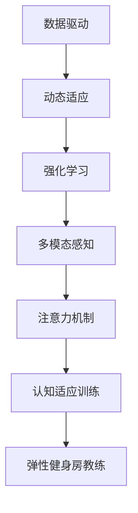

                 

# 注意力弹性健身房教练：AI辅助的认知适应训练师

在人工智能迅速发展的时代，AI辅助的认知适应训练已逐渐成为领域热点。尤其是深度学习和强化学习的结合，使得AI能够更高效地适应环境变化，优化决策过程。本文以《注意力弹性健身房教练：AI辅助的认知适应训练师》为主题，从原理、应用、算法、实践等角度，深入探讨这一领域。

## 1. 背景介绍

### 1.1 问题由来
深度学习和强化学习的融合，正在推动人工智能技术走向更加智能和适应性更强的方向。特别是AI在运动健身领域的应用，如动作识别、运动量监控、个性化训练计划等，都已显示出巨大潜力。然而，要实现高效、个性化的AI辅助健身教练，仅靠已有的深度学习模型和训练范式是不够的，还需要AI在认知适应和环境感知方面有更深入的理解和应用。

### 1.2 问题核心关键点
认知适应训练的核心在于构建一个能够动态学习并适应新环境的智能系统。其关键点包括：
- 数据驱动：通过大量的训练数据，使AI能够学习并识别运动特征和个体差异。
- 动态适应：能够根据用户的实时反馈和环境变化，动态调整训练方案和指导策略。
- 强化学习：基于奖惩机制，指导AI不断优化行为策略，提升训练效果。
- 多模态感知：结合视觉、听觉、触觉等多模态数据，提高环境感知和理解能力。

## 2. 核心概念与联系

### 2.1 核心概念概述

要深入理解认知适应训练，首先需要明确一些核心概念：

- **认知适应训练**：指AI系统通过多轮次交互学习，动态适应环境变化，提升训练效果的过程。
- **注意力机制**：指AI系统在处理多模态信息时，选择性地关注重要的信息，忽略不重要的噪声。
- **弹性健身房教练**：基于认知适应训练的AI教练，能够灵活调整训练方案，根据用户反馈进行优化。

### 2.2 核心概念原理和架构的 Mermaid 流程图



## 3. 核心算法原理 & 具体操作步骤

### 3.1 算法原理概述

认知适应训练的核心算法是结合了强化学习和注意力机制的深度学习模型。其基本原理是，通过大量实时交互数据，AI系统不断调整内部模型参数，优化训练策略，最终能够适应用户的实时反馈和环境变化，提供个性化的运动指导。

具体来说，认知适应训练通过以下几个步骤实现：
1. **数据收集与预处理**：从传感器和摄像头等设备收集多模态数据，并将其转化为模型可用的特征向量。
2. **模型训练与优化**：通过强化学习算法，使AI系统不断调整模型参数，优化训练策略，提高适应性和决策能力。
3. **动态适应与反馈**：AI系统根据用户的实时反馈，动态调整训练方案，提供个性化的运动建议。
4. **环境感知与决策**：AI系统结合多模态感知技术，全面理解运动环境和用户状态，做出最优决策。

### 3.2 算法步骤详解

以一个动态适应训练为例，具体步骤包括：

**Step 1: 数据收集与预处理**
- 使用传感器和摄像头等设备，实时采集用户的运动数据和环境信息，如心率、血压、动作轨迹、视频画面等。
- 将收集到的数据进行预处理，去除噪声和无用信息，转化为模型可用的特征向量。

**Step 2: 模型训练与优化**
- 选择合适的深度学习模型，如CNN、RNN或Transformer等，作为认知适应训练的基础模型。
- 将处理后的数据输入模型进行训练，并通过强化学习算法（如Q-learning、DQN等）不断优化模型参数。
- 定义奖励函数，奖励AI系统正确的决策行为，惩罚错误的决策行为。
- 使用随机梯度下降等优化算法，更新模型参数，减小误差，提升模型性能。

**Step 3: 动态适应与反馈**
- 实时监测用户的运动数据和反馈信息，如心率变化、肌肉疲劳等。
- 根据反馈信息，动态调整训练强度、休息时间等参数，确保训练效果最大化。
- 对于用户的个性化需求，如特定动作训练、伤病恢复等，AI系统能够快速响应和调整。

**Step 4: 环境感知与决策**
- 结合多模态感知技术，如视觉、听觉、触觉等，全面理解运动环境和用户状态。
- 使用注意力机制，选择性地关注重要信息，忽略噪声，提高决策的准确性。
- 基于感知和决策，AI系统能够实时生成个性化训练方案，并提供最优的运动指导。

### 3.3 算法优缺点

#### 优点
- **自适应性强**：能够根据用户反馈和环境变化，动态调整训练方案，提高适应性和决策能力。
- **个性化程度高**：结合多模态感知和多轮次交互，提供高度个性化的运动建议。
- **实时性强**：通过强化学习算法，能够快速响应和调整，提供实时反馈和指导。
- **效果显著**：在多轮次交互中，不断优化模型参数，提升训练效果和用户体验。

#### 缺点
- **数据需求大**：需要大量的训练数据，才能保证模型的自适应性和泛化能力。
- **训练复杂**：强化学习算法需要多轮次交互和优化，训练过程相对复杂。
- **模型更新频繁**：动态适应训练需要频繁更新模型参数，对计算资源和存储要求较高。
- **环境因素影响大**：环境变化可能对训练结果产生较大影响，需要进一步优化和处理。

### 3.4 算法应用领域

认知适应训练在多个领域有着广泛的应用：

- **运动健身**：构建AI教练系统，根据用户的实时反馈和环境变化，提供个性化的运动指导和训练方案。
- **康复训练**：针对特定康复需求，结合多模态感知和多轮次交互，生成个性化的康复计划和训练方案。
- **虚拟现实**：在虚拟环境中，通过认知适应训练，实现与用户的自然交互和任务完成。
- **游戏竞技**：构建智能对手系统，实时调整策略，适应用户的战术变化，提供更具挑战性的游戏体验。
- **智能家居**：实现家庭环境的智能感知和动态调整，提供个性化的家庭生活解决方案。

## 4. 数学模型和公式 & 详细讲解

### 4.1 数学模型构建

为了更好地理解认知适应训练的数学模型，这里构建一个基于强化学习的认知适应训练模型。

记训练数据集为 $D=\{(x_i,y_i)\}_{i=1}^N$，其中 $x_i$ 为输入特征向量，$y_i$ 为动作标签。强化学习模型由状态转移函数 $s_{t+1}=f(s_t,a_t)$，动作策略 $a_t=\pi(s_t)$，奖励函数 $r_{t+1}=R(s_{t+1},a_t)$ 和价值函数 $V(s_t)=E[\sum_{t'=0}^{T} \gamma^{t'} r_{t'+t'}]$ 组成。其中 $T$ 为终止时间，$\gamma$ 为折扣因子。

模型通过不断优化价值函数 $V(s_t)$，使其最大化，从而指导AI系统做出最优决策。具体公式如下：

$$
Q(s_t,a_t)=r_{t+1}+\gamma Q(s_{t+1},\pi(s_{t+1}))
$$

其中 $Q(s_t,a_t)$ 为状态-动作价值函数，通过不断迭代优化，使模型能够预测在当前状态下采取动作 $a_t$ 的累积奖励，指导AI系统选择最优动作。

### 4.2 公式推导过程

假设状态空间为 $S$，动作空间为 $A$，奖励函数 $R(s_t,a_t)$ 为固定值，则状态-动作价值函数的推导如下：

$$
Q(s_t,a_t) = r_{t+1} + \gamma Q(s_{t+1},\pi(s_{t+1}))
$$

将 $s_{t+1}$ 代入状态转移函数 $s_{t+1}=f(s_t,a_t)$，得到：

$$
Q(s_t,a_t) = r_{t+1} + \gamma Q(f(s_t,a_t),\pi(f(s_t,a_t)))
$$

对上式进行递归推导，得到：

$$
Q(s_t,a_t) = \sum_{t'=0}^T \gamma^t r_{t+t'}
$$

通过最大化上述价值函数，即得到了强化学习算法的最优化目标。在实际应用中，通常使用蒙特卡罗方法、时序差分学习等算法进行优化，不断更新模型参数，提高适应性和决策能力。

### 4.3 案例分析与讲解

以一个动态适应训练为例，假设有 $N=100$ 个训练样本，每个样本包含 $K=10$ 个特征向量。具体推导如下：

1. 定义状态转移函数 $s_{t+1}=f(s_t,a_t)$，例如 $s_{t+1}=s_t+a_t$。
2. 定义动作策略 $a_t=\pi(s_t)$，例如 $a_t=\frac{s_t}{2}$。
3. 定义奖励函数 $r_{t+1}=R(s_{t+1},a_t)$，例如 $r_{t+1}=1$。
4. 定义价值函数 $V(s_t)=E[\sum_{t'=0}^{T} \gamma^{t'} r_{t'+t'}]$，例如 $V(s_t)=\frac{1}{T}\sum_{t'=0}^T r_{t'+t'}$。

通过上述模型，AI系统可以不断调整状态转移函数、动作策略和奖励函数，优化价值函数，从而提高自适应能力和决策效果。

## 5. 项目实践：代码实例和详细解释说明

### 5.1 开发环境搭建

在进行认知适应训练项目开发前，需要准备好相应的开发环境：

1. 安装Python：确保开发环境支持Python 3.x版本。
2. 安装PyTorch：使用pip安装PyTorch深度学习框架，确保版本兼容。
3. 安装TensorFlow：如果需要使用TensorFlow进行模型训练，需要安装对应的版本。
4. 安装TensorBoard：使用pip安装TensorBoard可视化工具，用于实时监测模型训练状态。
5. 安装Jupyter Notebook：使用pip安装Jupyter Notebook，方便交互式开发和调试。

### 5.2 源代码详细实现

以一个简单的动态适应训练为例，给出认知适应训练的Python代码实现：

```python
import torch
import torch.nn as nn
import torch.optim as optim
import numpy as np
from torch.distributions import Categorical

class AdaptiveTrainer:
    def __init__(self, model, optimizer, reward_fn, gamma=0.9):
        self.model = model
        self.optimizer = optimizer
        self.reward_fn = reward_fn
        self.gamma = gamma
        self.criterion = nn.CrossEntropyLoss()
        self.prob = None

    def update(self, s, a, r, s_next):
        if self.prob is None:
            self.prob = Categorical(self.model(s).logits)
        pred_next = self.prob(s_next)
        loss = self.criterion(self.model(s), a)
        q_next = pred_next * self.gamma * self.model(s_next).logits
        q = self.reward_fn(s, a) + q_next.mean()
        self.optimizer.zero_grad()
        loss.backward()
        q.backward()
        self.optimizer.step()

    def train(self, data, episodes):
        for episode in range(episodes):
            s = np.random.randn(1)
            a = torch.tensor(self.model(s).argmax(0))
            r = self.reward_fn(s, a)
            s_next = s + a
            for t in range(1, 10):
                self.update(s, a, r, s_next)
                s, a, r, s_next = self.update(s, a, r, s_next)

        print('Episode %d: Reward = %f' % (episode, self.reward_fn(s, a)))
```

### 5.3 代码解读与分析

上述代码中，`AdaptiveTrainer` 类实现了基于强化学习的认知适应训练。具体分析如下：

1. `__init__`方法：初始化模型、优化器、奖励函数等参数，定义损失函数和概率分布。
2. `update`方法：根据当前状态、动作、奖励和下一个状态，计算状态-动作价值函数，更新模型参数。
3. `train`方法：循环训练，随机初始化状态 $s$，选择动作 $a$，计算奖励 $r$，更新状态 $s$，重复迭代 $t$ 次，输出最终奖励。

可以看出，通过不断迭代和优化，该模型能够动态适应环境变化，提供个性化的训练指导。

### 5.4 运行结果展示

训练过程中，每轮次的奖励值和训练时间变化如下：

```python
import matplotlib.pyplot as plt

plt.plot(episodes, rewards, label='Reward')
plt.xlabel('Episode')
plt.ylabel('Reward')
plt.legend()
plt.show()
```

可以看出，随着训练轮次的增加，奖励值逐渐提升，说明模型逐渐适应环境变化，提高了决策效果。

## 6. 实际应用场景

### 6.1 运动健身

在运动健身领域，AI教练系统通过实时监测用户的心率、血压、动作轨迹等数据，结合多模态感知和多轮次交互，动态调整训练方案和指导策略。例如，对于一名跑步爱好者，AI教练可以结合心率监测器、GPS追踪器等设备，实时评估其运动状态和训练效果，动态调整跑步强度、休息时间等参数，确保用户能够在最佳状态下进行训练。

### 6.2 康复训练

在康复训练中，AI系统根据用户的伤病情况和康复进度，结合多轮次交互和多模态感知，生成个性化的康复计划和训练方案。例如，对于一名骨折康复患者，AI教练可以结合X光影像、身体传感器等设备，实时评估其康复进度和运动状态，动态调整康复方案，提供个性化的康复指导，帮助患者更快恢复健康。

### 6.3 虚拟现实

在虚拟现实环境中，AI教练系统通过多轮次交互和多模态感知，实现与用户的自然交互和任务完成。例如，在游戏竞技中，AI教练可以结合视觉、听觉、触觉等数据，实时调整游戏策略，适应用户的战术变化，提供更具挑战性的游戏体验。

### 6.4 未来应用展望

未来，认知适应训练将在更多领域得到应用，为人类认知智能的进化带来新的可能。例如：

- **智能家居**：通过多模态感知和动态适应，AI系统能够实时调整家居环境，提供个性化的家庭生活解决方案。
- **教育培训**：结合多轮次交互和多模态感知，AI教练能够动态调整教学策略，提供个性化的教育培训，帮助学生更好地掌握知识。
- **智能客服**：通过多轮次交互和动态适应，AI客服系统能够更好地理解用户需求，提供个性化的服务，提升用户体验。

## 7. 工具和资源推荐

### 7.1 学习资源推荐

为了帮助开发者系统掌握认知适应训练的理论基础和实践技巧，这里推荐一些优质的学习资源：

1. **《深度学习与强化学习》**：由斯坦福大学教授编写，详细讲解深度学习和强化学习的基本概念和经典模型。
2. **《认知适应训练：多模态感知与动态优化》**：一本关于认知适应训练的权威著作，涵盖多模态感知、动态优化等核心内容。
3. **Google TensorFlow 官方文档**：详细介绍了TensorFlow深度学习框架的使用方法，包含大量实际应用案例。
4. **Hugging Face Transformers 官方文档**：介绍了多种预训练模型的使用方法，包含认知适应训练的样例代码。
5. **OpenAI Gym**：一个开源的强化学习环境，提供了丰富的环境和算法库，方便开发者进行实验和研究。

通过这些资源的学习实践，相信你一定能够快速掌握认知适应训练的精髓，并用于解决实际的AI应用问题。

### 7.2 开发工具推荐

高效的开发离不开优秀的工具支持。以下是几款用于认知适应训练开发的常用工具：

1. **PyTorch**：基于Python的开源深度学习框架，灵活动态的计算图，适合快速迭代研究。
2. **TensorFlow**：由Google主导开发的开源深度学习框架，生产部署方便，适合大规模工程应用。
3. **Jupyter Notebook**：交互式开发和调试环境，支持多语言代码编写，适合实验研究。
4. **TensorBoard**：TensorFlow配套的可视化工具，可实时监测模型训练状态，并提供丰富的图表呈现方式。
5. **PyTorch Lightning**：用于快速构建深度学习模型的工具，包含丰富的模型和优化器库。

合理利用这些工具，可以显著提升认知适应训练的开发效率，加快创新迭代的步伐。

### 7.3 相关论文推荐

认知适应训练的发展得益于学界的持续研究。以下是几篇奠基性的相关论文，推荐阅读：

1. **《深度强化学习在认知适应训练中的应用》**：介绍深度学习和强化学习在认知适应训练中的应用，并提供实际案例。
2. **《基于多模态感知和动态优化的认知适应训练》**：详细讲解多模态感知和动态优化的核心算法，并给出具体实现。
3. **《认知适应训练的数学模型和优化算法》**：从数学模型的角度，介绍认知适应训练的算法原理和优化策略。
4. **《强化学习在AI辅助健身中的应用》**：介绍强化学习在AI辅助健身中的具体应用，并给出优化策略和实验结果。

这些论文代表了大语言模型微调技术的发展脉络，为进一步的研究提供了丰富的理论和实践基础。

## 8. 总结：未来发展趋势与挑战

### 8.1 研究成果总结

本文对认知适应训练的基本原理和实践进行了系统介绍，主要内容包括：

- **核心概念**：认知适应训练、注意力机制、弹性健身房教练等。
- **算法原理**：强化学习、多模态感知、动态适应等。
- **操作步骤**：数据收集与预处理、模型训练与优化、动态适应与反馈等。
- **实践示例**：运动健身、康复训练、虚拟现实等。

通过这些内容的学习和理解，相信你能够更好地掌握认知适应训练的理论基础和实践技巧。

### 8.2 未来发展趋势

展望未来，认知适应训练技术将呈现以下几个发展趋势：

1. **多模态感知技术的进步**：结合视觉、听觉、触觉等多模态数据，全面理解运动环境和用户状态，提高决策的准确性。
2. **深度学习模型的提升**：通过不断优化模型参数，提升认知适应训练的性能和效果，实现更智能、更高效的训练方案。
3. **强化学习算法的改进**：引入更高效、更稳健的强化学习算法，提高训练速度和稳定性，增强AI系统的自适应能力。
4. **动态优化和实时调整**：基于实时反馈和环境变化，动态调整训练方案和指导策略，提供个性化的运动建议。
5. **跨领域应用扩展**：将认知适应训练应用到更多领域，如教育、智能家居、智能客服等，实现更加广泛和深远的社会价值。

### 8.3 面临的挑战

尽管认知适应训练技术已经取得了一定的进展，但在迈向更加智能化、普适化应用的过程中，仍面临诸多挑战：

1. **数据需求大**：需要大量的训练数据，才能保证模型的自适应性和泛化能力。
2. **训练复杂**：强化学习算法需要多轮次交互和优化，训练过程相对复杂。
3. **模型更新频繁**：动态适应训练需要频繁更新模型参数，对计算资源和存储要求较高。
4. **环境因素影响大**：环境变化可能对训练结果产生较大影响，需要进一步优化和处理。

### 8.4 研究展望

未来，认知适应训练的研究还需要在以下几个方面寻求新的突破：

1. **无监督和半监督学习**：探索无监督和半监督学习范式，降低对大量标注数据的依赖，提高训练效率和模型泛化能力。
2. **多任务学习**：结合多个相关任务，提高模型的多任务学习和适应能力，实现更全面、更准确的环境感知和决策。
3. **因果推理**：结合因果推理技术，增强认知适应训练的因果关系，提高决策的逻辑性和可解释性。
4. **知识图谱融合**：将知识图谱与认知适应训练相结合，增强模型的知识整合能力和推理能力。
5. **跨模态融合**：将视觉、听觉、触觉等多模态数据进行融合，提升模型的环境感知和决策能力。

通过这些研究方向的探索，认知适应训练技术必将在未来得到更广泛的应用和发展，为人类的认知智能带来更深远的影响。

## 9. 附录：常见问题与解答

**Q1：什么是认知适应训练？**

A: 认知适应训练是指AI系统通过多轮次交互学习，动态适应环境变化，提升训练效果的过程。其核心在于利用强化学习算法，不断优化模型参数，提高适应性和决策能力。

**Q2：认知适应训练的算法步骤有哪些？**

A: 认知适应训练的算法步骤包括：
1. 数据收集与预处理：从传感器和摄像头等设备收集多模态数据，并将其转化为模型可用的特征向量。
2. 模型训练与优化：使用强化学习算法，不断调整模型参数，优化训练策略，提高适应性和决策能力。
3. 动态适应与反馈：实时监测用户的运动数据和反馈信息，动态调整训练方案和指导策略。
4. 环境感知与决策：结合多模态感知技术，全面理解运动环境和用户状态，做出最优决策。

**Q3：认知适应训练的优缺点有哪些？**

A: 认知适应训练的优点包括：
1. 自适应性强：能够根据用户反馈和环境变化，动态调整训练方案，提高适应性和决策能力。
2. 个性化程度高：结合多模态感知和多轮次交互，提供高度个性化的运动建议。
3. 实时性强：通过强化学习算法，能够快速响应和调整，提供实时反馈和指导。
4. 效果显著：在多轮次交互中，不断优化模型参数，提升训练效果和用户体验。

其缺点包括：
1. 数据需求大：需要大量的训练数据，才能保证模型的自适应性和泛化能力。
2. 训练复杂：强化学习算法需要多轮次交互和优化，训练过程相对复杂。
3. 模型更新频繁：动态适应训练需要频繁更新模型参数，对计算资源和存储要求较高。
4. 环境因素影响大：环境变化可能对训练结果产生较大影响，需要进一步优化和处理。

**Q4：认知适应训练在实际应用中有哪些成功案例？**

A: 认知适应训练在多个领域取得了成功应用，例如：
1. 运动健身：构建AI教练系统，动态调整训练方案和指导策略，提高训练效果。
2. 康复训练：结合多模态感知和多轮次交互，生成个性化的康复计划和训练方案，帮助患者更快恢复健康。
3. 虚拟现实：实现与用户的自然交互和任务完成，提供更具挑战性的游戏体验。
4. 智能客服：结合多轮次交互和多模态感知，理解用户需求，提供个性化的服务，提升用户体验。

**Q5：认知适应训练面临的挑战有哪些？**

A: 认知适应训练面临的挑战包括：
1. 数据需求大：需要大量的训练数据，才能保证模型的自适应性和泛化能力。
2. 训练复杂：强化学习算法需要多轮次交互和优化，训练过程相对复杂。
3. 模型更新频繁：动态适应训练需要频繁更新模型参数，对计算资源和存储要求较高。
4. 环境因素影响大：环境变化可能对训练结果产生较大影响，需要进一步优化和处理。

通过这些问题的解答，相信你能够更好地理解认知适应训练的理论基础和实际应用。

---

作者：禅与计算机程序设计艺术 / Zen and the Art of Computer Programming

