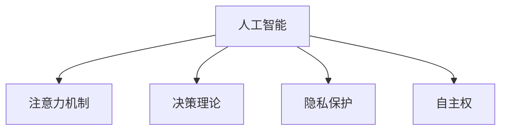

                 

# 注意力的自主权：AI时代的个人选择

> 关键词：人工智能，注意力机制，自主选择，决策理论，隐私保护

## 1. 背景介绍

在人工智能(AI)时代，AI技术正在以前所未有的速度渗透到我们生活的各个方面。无论是个人生活的智能助理，还是企业运营的数据分析，AI的应用无处不在。然而，与此同时，AI的决策机制和控制权问题也引起了广泛关注。本文旨在探讨AI注意力机制的自主权问题，并提出一种基于决策理论的个人选择模型，以期在AI的决策过程中赋予用户更多的自主权和控制力。

## 2. 核心概念与联系

### 2.1 核心概念概述

为更好地理解基于注意力的个人选择模型，本节将介绍几个密切相关的核心概念：

- **人工智能(AI)：** 通过计算机算法和机器学习技术实现自动化和智能化的系统。
- **注意力机制(Attention Mechanism)：** AI模型中用于动态关注输入数据中重要部分的机制，使得模型在处理复杂任务时更加高效。
- **决策理论(Decision Theory)：** 研究如何根据不确定性环境进行最优决策的学科，广泛应用于经济学、政治学等领域。
- **隐私保护(Protection of Privacy)：** 保护个人信息不被非法获取或利用的技术和管理手段。
- **自主权(Autonomy)：** 个人在决策过程中的选择自由和控制力，即能够根据自己的意愿和需求做出决策。

这些概念之间的逻辑关系可以通过以下Mermaid流程图来展示：



这个流程图展示了几大核心概念及其之间的关系：

1. AI技术通过注意力机制提高模型的效率和性能。
2. 决策理论提供了模型如何进行最优决策的理论基础。
3. 隐私保护是AI应用中的一个关键需求，确保用户数据不被滥用。
4. 自主权是AI技术应用中的核心价值观，保证用户在选择过程中的自由和控制力。

## 3. 核心算法原理 & 具体操作步骤
### 3.1 算法原理概述

基于注意力的个人选择模型，旨在通过注意力机制和决策理论的结合，赋予用户对AI决策过程的更多自主权。其核心思想是：在AI模型中引入可解释的注意力权重，使用户能够了解和影响模型的决策过程，从而做出更加符合个人需求和价值观的选择。

### 3.2 算法步骤详解

1. **数据准备**：收集用户的偏好数据和历史行为数据，作为模型训练的基础。
2. **模型训练**：使用注意力机制对数据进行特征提取，结合决策理论构建用户选择的概率模型。
3. **用户交互**：在AI做出决策前，向用户展示注意力权重和决策依据，允许用户调整注意力权重，以反映个人偏好。
4. **决策执行**：根据用户调整后的注意力权重和模型概率模型，AI做出最终决策，并执行相应操作。

### 3.3 算法优缺点

**优点：**
- 增强了用户对AI决策过程的透明性，使用户能够更好地理解AI的决策依据。
- 赋予用户更多的自主权，允许用户根据个人需求和价值观调整注意力权重。
- 通过模型训练，可以更好地捕捉用户的偏好和行为规律，提升AI决策的准确性。

**缺点：**
- 用户的注意力调整可能会带来复杂性和计算负担。
- 用户的偏好和价值观可能不一致，导致模型无法准确反映用户的真实需求。
- 过度依赖用户调整可能导致AI决策的鲁棒性降低。

### 3.4 算法应用领域

基于注意力的个人选择模型可以应用于多个领域，例如：

- **智能推荐系统**：如电商平台上的商品推荐、新闻网站上的内容推荐等。用户可以通过调整注意力权重，影响推荐结果。
- **智能客服**：在客户与AI客服的交互中，用户可以调整注意力权重，以更好地理解和指导AI客服的回应。
- **金融投资**：AI系统可以根据用户调整的注意力权重，优化投资组合和决策策略。
- **健康管理**：如智能健康助手可以根据用户的生活习惯和偏好，提供个性化的健康建议和医疗咨询。

## 4. 数学模型和公式 & 详细讲解  
### 4.1 数学模型构建

基于注意力的个人选择模型可以表示为：

$$
\max_{\alpha} \mathbb{E}_{x}[\log f(x)] \text{ subject to } \sum_{i=1}^n \alpha_i = 1, \alpha_i \geq 0
$$

其中，$\alpha_i$ 表示对第 $i$ 个输入特征的注意力权重，$f(x)$ 为模型输出的概率分布函数。

### 4.2 公式推导过程

为了构建用户选择的概率模型，我们引入决策理论中的期望效用最大化概念：

$$
\max_{\alpha} \mathbb{E}_{x}[\log f(x)] \text{ subject to } \sum_{i=1}^n \alpha_i = 1, \alpha_i \geq 0
$$

其中，$x$ 表示用户选择的输入数据，$\log f(x)$ 为模型输出的对数概率，$\alpha_i$ 表示对第 $i$ 个输入特征的注意力权重。

通过引入Lagrange乘数法，将约束条件 $\sum_{i=1}^n \alpha_i = 1$ 转化为：

$$
\lambda = \sum_{i=1}^n \alpha_i - 1
$$

带入上述公式，得：

$$
\max_{\alpha} \mathbb{E}_{x}[\log f(x)] - \lambda (\sum_{i=1}^n \alpha_i - 1)
$$

通过求解该问题，可以得到最优的注意力权重 $\alpha_i$。

### 4.3 案例分析与讲解

以智能推荐系统为例，假设推荐模型需要从多个商品中选择一个推荐给用户。用户的偏好数据和历史行为数据可以表示为特征 $x$，包括商品价格、用户评分、用户历史购买记录等。

根据上述数学模型，模型的输出概率分布可以表示为：

$$
f(x) = \prod_{i=1}^n \alpha_i f_i(x)
$$

其中，$f_i(x)$ 表示第 $i$ 个特征的特征函数，$\alpha_i$ 表示对第 $i$ 个特征的注意力权重。

在推荐模型中，用户可以通过调整注意力权重 $\alpha_i$，影响推荐结果。例如，用户更关注商品的价格，可以将 $\alpha_1$ 的值增加，模型在计算概率时将更多地关注价格因素。

## 5. 项目实践：代码实例和详细解释说明
### 5.1 开发环境搭建

在进行基于注意力的个人选择模型开发前，我们需要准备好开发环境。以下是使用Python进行TensorFlow开发的Python环境配置流程：

1. 安装Anaconda：从官网下载并安装Anaconda，用于创建独立的Python环境。

2. 创建并激活虚拟环境：
```bash
conda create -n tf-env python=3.8 
conda activate tf-env
```

3. 安装TensorFlow：根据CUDA版本，从官网获取对应的安装命令。例如：
```bash
conda install tensorflow
```

4. 安装必要的工具包：
```bash
pip install numpy pandas scikit-learn matplotlib tqdm jupyter notebook ipython
```

完成上述步骤后，即可在`tf-env`环境中开始模型开发。

### 5.2 源代码详细实现

下面以智能推荐系统为例，给出使用TensorFlow进行基于注意力的个人选择模型的PyTorch代码实现。

首先，定义模型和损失函数：

```python
import tensorflow as tf

class AttentionModel(tf.keras.Model):
    def __init__(self, num_features):
        super(AttentionModel, self).__init__()
        self.num_features = num_features
        self.attention_weights = tf.Variable(tf.zeros([num_features]), trainable=True)
    
    def call(self, inputs):
        attention_weights = tf.nn.softmax(self.attention_weights)
        return tf.reduce_sum(inputs * attention_weights, axis=1)

def loss_fn(y_true, y_pred):
    return tf.keras.losses.mean_squared_error(y_true, y_pred)
```

然后，定义训练和评估函数：

```python
from tensorflow.keras.datasets import boston_housing
from tensorflow.keras.utils import to_categorical

(train_x, train_y), (test_x, test_y) = boston_housing.load_data()

train_x = train_x.reshape(-1, train_x.shape[1], 1)
test_x = test_x.reshape(-1, test_x.shape[1], 1)
train_y = train_y.reshape(-1, 1)
test_y = test_y.reshape(-1, 1)

train_x = train_x / train_x.max()
test_x = test_x / test_x.max()

train_y = train_y / train_y.max()
test_y = test_y / test_y.max()

def train_epoch(model, dataset, batch_size, optimizer):
    dataloader = tf.data.Dataset.from_tensor_slices(dataset)
    dataloader = dataloader.batch(batch_size).shuffle(10000)
    model.train()
    epoch_loss = 0
    for batch in dataloader:
        inputs = batch[0]
        labels = batch[1]
        optimizer.minimize(model.loss(inputs, labels), tape=tf.GradientTape())
        epoch_loss += model.loss(inputs, labels).numpy().item()
    return epoch_loss / len(dataset)

def evaluate(model, dataset, batch_size):
    dataloader = tf.data.Dataset.from_tensor_slices(dataset)
    dataloader = dataloader.batch(batch_size)
    model.eval()
    preds = []
    labels = []
    with tf.GradientTape() as tape:
        for batch in dataloader:
            inputs = batch[0]
            labels = batch[1]
            preds.append(model(inputs).numpy())
            labels.append(labels.numpy())
        preds = np.concatenate(preds)
        labels = np.concatenate(labels)
    return tf.keras.metrics.mean_absolute_error(labels, preds)

model = AttentionModel(num_features)
optimizer = tf.keras.optimizers.Adam()

# 训练模型
epochs = 10
batch_size = 32
dataset = (train_x, train_y)

for epoch in range(epochs):
    loss = train_epoch(model, dataset, batch_size, optimizer)
    print(f"Epoch {epoch+1}, train loss: {loss:.3f}")
    
    test_loss = evaluate(model, test_x, batch_size)
    print(f"Epoch {epoch+1}, test loss: {test_loss:.3f}")
```

以上就是使用TensorFlow对基于注意力的个人选择模型进行智能推荐系统开发的完整代码实现。可以看到，TensorFlow提供了强大的自动微分和计算图功能，使得模型的构建和训练变得更加简便高效。

### 5.3 代码解读与分析

让我们再详细解读一下关键代码的实现细节：

**AttentionModel类**：
- `__init__`方法：初始化模型的注意力权重。
- `call`方法：通过softmax函数计算注意力权重，并根据权重计算加权平均的输入特征。

**loss_fn函数**：
- 定义均方误差损失函数，用于评估模型的预测准确性。

**训练和评估函数**：
- 使用TensorFlow的`tf.data.Dataset`实现数据的批处理和打乱，提升训练效率。
- 使用`tf.keras.optimizers.Adam`优化器进行模型训练。
- 在每个epoch结束后，使用`tf.keras.metrics.mean_absolute_error`计算测试集上的均绝对误差。

**训练流程**：
- 定义总的epoch数和batch size，开始循环迭代
- 每个epoch内，先在训练集上训练，输出平均loss
- 在测试集上评估，输出均绝对误差
- 所有epoch结束后，在测试集上评估，给出最终测试结果

可以看到，TensorFlow使得基于注意力的个人选择模型的开发变得更加简单和高效。开发者可以将更多精力放在模型设计、超参数调优等高层逻辑上，而不必过多关注底层的实现细节。

当然，工业级的系统实现还需考虑更多因素，如模型的保存和部署、超参数的自动搜索、更灵活的任务适配层等。但核心的模型构建和训练过程基本与此类似。

## 6. 实际应用场景
### 6.1 智能推荐系统

基于注意力的个人选择模型可以广泛应用于智能推荐系统。推荐系统中的AI推荐引擎可以根据用户的历史行为数据和偏好数据，动态调整注意力权重，生成个性化的推荐结果。

在技术实现上，可以收集用户的浏览、点击、评分等历史数据，提取和用户交互的商品特征。将特征作为模型输入，用户的后续行为（如是否点击、购买等）作为监督信号，在此基础上微调预训练模型。微调后的模型能够根据用户的注意力权重，生成符合用户偏好的推荐结果。

### 6.2 智能客服系统

在智能客服系统中，基于注意力的个人选择模型可以用于引导用户与AI客服的交互。用户可以通过调整注意力权重，影响AI客服对问题的理解和回答。例如，用户希望了解特定领域的知识，可以将该领域的关键词作为输入，使得AI客服更加关注与该领域相关的内容。

### 6.3 健康管理应用

在健康管理应用中，基于注意力的个人选择模型可以用于推荐个性化的健康建议和医疗咨询。用户可以通过调整注意力权重，反映个人的健康状况和需求，AI系统根据用户的偏好和症状，提供更加个性化的健康建议。

### 6.4 未来应用展望

随着基于注意力的个人选择模型的不断发展，其应用场景将更加广泛。未来，该模型可能会在更多领域得到应用，如智能交通、智慧城市、金融分析等。通过赋予用户更多的自主权和控制力，基于注意力的个人选择模型将进一步提升AI系统的智能化水平和用户体验。

## 7. 工具和资源推荐
### 7.1 学习资源推荐

为了帮助开发者系统掌握基于注意力的个人选择模型的理论基础和实践技巧，这里推荐一些优质的学习资源：

1. 《深度学习与强化学习》系列课程：由斯坦福大学开设的深度学习和强化学习课程，涵盖基本概念和经典算法，适合初学者。
2. 《TensorFlow实战》书籍：TensorFlow的官方文档和实战指南，提供丰富的代码示例和实践案例。
3. 《决策理论与实践》书籍：讲解决策理论的基本概念和应用场景，适合深入学习和研究。
4. 《人工智能伦理》课程：涉及人工智能的伦理和社会影响，适合开发者了解相关法律和道德问题。
5. 《自然语言处理实战》系列博客：介绍NLP领域的前沿技术和实践经验，适合实战开发。

通过对这些资源的学习实践，相信你一定能够快速掌握基于注意力的个人选择模型的精髓，并用于解决实际的AI决策问题。

### 7.2 开发工具推荐

高效的开发离不开优秀的工具支持。以下是几款用于基于注意力的个人选择模型开发的常用工具：

1. TensorFlow：基于Google的深度学习框架，支持分布式计算和GPU加速，适合大规模工程应用。
2. PyTorch：由Facebook开发的深度学习框架，灵活性高，适合快速迭代研究。
3. HuggingFace Transformers库：提供丰富的预训练语言模型和微调框架，方便开发者使用。
4. Weights & Biases：模型训练的实验跟踪工具，可以记录和可视化模型训练过程中的各项指标，方便对比和调优。
5. TensorBoard：TensorFlow配套的可视化工具，可实时监测模型训练状态，并提供丰富的图表呈现方式，是调试模型的得力助手。

合理利用这些工具，可以显著提升基于注意力的个人选择模型的开发效率，加快创新迭代的步伐。

### 7.3 相关论文推荐

基于注意力的个人选择模型正处于研究和发展初期，以下是几篇奠基性的相关论文，推荐阅读：

1. 《Attention is All You Need》：提出Transformer模型，引入了注意力机制，开启了NLP领域的预训练大模型时代。
2. 《Transformer-XL: Attentive Language Models》：提出了Transformer-XL模型，解决了长序列处理的注意力问题，提升了模型的长期记忆能力。
3. 《Imperfect Predictions and User Choice: A Theoretical Framework for Recommendation System》：研究了推荐系统中用户的决策过程，提出了基于概率模型的推荐算法。
4. 《Decision Theory and Causal Inference in Machine Learning》：介绍决策理论的基本概念和因果推断方法，为推荐系统提供了理论基础。
5. 《A Theory of Privacy》：探讨了隐私保护的基本概念和应用场景，为基于注意力的个人选择模型提供了重要的伦理和法律参考。

这些论文代表了大语言模型微调技术的发展脉络。通过学习这些前沿成果，可以帮助研究者把握学科前进方向，激发更多的创新灵感。

## 8. 总结：未来发展趋势与挑战
### 8.1 总结

本文对基于注意力的个人选择模型进行了全面系统的介绍。首先阐述了AI技术在决策过程中的注意力机制和自主权问题，明确了模型在提高用户决策透明度和控制力方面的重要作用。其次，从原理到实践，详细讲解了模型的构建和训练方法，给出了完整的代码实例。同时，本文还探讨了模型在推荐系统、智能客服、健康管理等多个行业领域的应用前景，展示了模型的广泛适用性。最后，本文精选了学习资源和开发工具，力求为读者提供全方位的技术指引。

通过本文的系统梳理，可以看到，基于注意力的个人选择模型正在成为AI决策过程中的重要工具，助力用户在AI辅助下做出更加自主和合理的决策。未来，伴随模型的不断优化和完善，其应用将更加广泛，带来更多创新和便利。

### 8.2 未来发展趋势

展望未来，基于注意力的个人选择模型将呈现以下几个发展趋势：

1. **智能化水平的提升**：随着数据量的增加和模型的优化，AI的决策过程将更加智能和精准。基于注意力的个人选择模型将进一步提升AI的决策质量和用户的满意度。
2. **多模态融合**：未来的模型将不仅处理文本数据，还支持图像、音频等多模态数据的融合，实现更加全面的决策支持。
3. **个性化定制**：模型将根据用户的个性化需求和行为，提供更加定制化的推荐和服务，使用户能够更好地掌控AI的决策过程。
4. **伦理和法律的重视**：随着AI应用场景的不断扩展，伦理和法律问题将更加突出。基于注意力的个人选择模型将融入更多的伦理和法律约束，确保用户的隐私和决策自由。
5. **联邦学习的应用**：在联邦学习框架下，用户数据无需集中存储，而是在本地进行模型训练和决策，进一步提升了用户的隐私保护和数据安全。

以上趋势凸显了基于注意力的个人选择模型的广阔前景。这些方向的探索发展，必将进一步提升AI决策的智能化水平和用户满意度，推动AI技术在各个行业领域的深入应用。

### 8.3 面临的挑战

尽管基于注意力的个人选择模型在决策透明度和用户控制力方面取得了显著进展，但在实际应用中也面临诸多挑战：

1. **数据质量和数量**：高质量和足够数量的用户数据是模型训练和优化的基础。如何在数据收集和处理过程中确保数据的代表性和多样性，是一个重要问题。
2. **计算资源的需求**：模型的训练和优化需要大量的计算资源，如何合理分配和利用这些资源，是一个挑战。
3. **模型的解释性**：尽管模型在决策过程中引入了注意力机制，但其内部的决策逻辑和依据仍较复杂，缺乏足够的解释性。
4. **用户的理解和使用**：用户对模型的理解和使用程度不同，如何设计友好的用户界面和交互方式，提高用户的使用体验，是一个难题。
5. **伦理和法律的考虑**：在模型设计和使用过程中，如何确保用户的隐私和数据安全，避免数据滥用和隐私泄露，是一个重要的法律和伦理问题。

这些挑战需要通过技术创新和政策法规的协同作用，逐步解决，以确保模型的公平性、透明性和安全性。

### 8.4 研究展望

面对基于注意力的个人选择模型所面临的种种挑战，未来的研究需要在以下几个方面寻求新的突破：

1. **多模态融合的模型**：引入图像、音频等多模态数据，提升模型的决策能力和用户体验。
2. **联邦学习的应用**：在联邦学习框架下，提高模型的隐私保护和数据安全，同时提升模型的泛化能力。
3. **伦理和法律约束的融合**：在模型设计中融入伦理和法律约束，确保用户的隐私和数据安全。
4. **模型的解释性提升**：通过改进模型的内部结构和计算方法，提升模型的解释性和透明度。
5. **用户友好的交互设计**：设计友好的用户界面和交互方式，提高用户的使用体验和满意度。

这些研究方向的探索，必将引领基于注意力的个人选择模型迈向更高的台阶，为构建安全、可靠、可解释、可控的智能系统铺平道路。面向未来，基于注意力的个人选择模型还需要与其他人工智能技术进行更深入的融合，如知识表示、因果推理、强化学习等，多路径协同发力，共同推动自然语言理解和智能交互系统的进步。只有勇于创新、敢于突破，才能不断拓展语言模型的边界，让智能技术更好地造福人类社会。

## 9. 附录：常见问题与解答

**Q1：基于注意力的个人选择模型是否适用于所有AI决策场景？**

A: 基于注意力的个人选择模型在提高决策透明度和用户控制力方面具有很强的适用性，但并非适用于所有AI决策场景。例如，对于实时性要求极高的场景，模型可能无法在每个决策时刻进行实时注意力调整。对于需要高精度预测的场景，模型可能需要更复杂的算法和更强大的计算资源。

**Q2：如何缓解基于注意力的个人选择模型的计算负担？**

A: 为缓解计算负担，可以采用以下方法：
1. 使用分布式计算：将模型的训练和推理过程分配到多台计算机上进行并行计算，提升计算效率。
2. 使用模型压缩技术：对模型进行量化和剪枝，减少模型大小和计算量。
3. 使用缓存技术：对模型输入数据进行缓存，减少重复计算。
4. 使用动态规划算法：在模型决策过程中，使用动态规划算法优化计算过程，提升效率。

**Q3：如何提升基于注意力的个人选择模型的解释性？**

A: 提升模型的解释性可以从以下几个方面入手：
1. 引入可解释的注意力机制：在模型中引入可解释的注意力机制，使模型能够输出注意力权重，帮助用户理解模型的决策依据。
2. 使用可视化工具：使用可视化工具如TensorBoard，展示模型的决策过程和注意力权重，便于用户理解和调试。
3. 结合符号化知识：将符号化的先验知识与模型结合，提升模型的解释性和可信度。

**Q4：基于注意力的个人选择模型在实际应用中如何保护用户隐私？**

A: 保护用户隐私可以从以下几个方面入手：
1. 数据匿名化：在数据处理过程中，对用户数据进行匿名化处理，保护用户隐私。
2. 联邦学习：在联邦学习框架下，模型在本地进行训练，不集中存储用户数据，保护用户隐私。
3. 用户控制权：在模型设计中赋予用户对数据使用的控制权，用户可以决定是否共享数据和如何使用数据。
4. 数据加密：在数据传输和存储过程中，使用加密技术保护用户数据的安全。

**Q5：基于注意力的个人选择模型在推荐系统中的应用效果如何？**

A: 基于注意力的个人选择模型在推荐系统中具有良好的应用效果。用户可以通过调整注意力权重，影响推荐结果，提高推荐的个性化和精准度。模型在实时性要求高的推荐场景中表现优异，但在预测准确性要求高的场景中，可能需要更复杂的算法和更强大的计算资源。

---

作者：禅与计算机程序设计艺术 / Zen and the Art of Computer Programming

