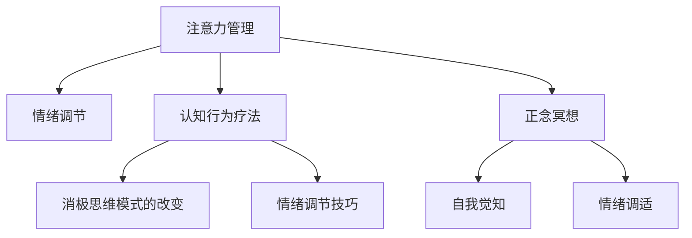

                 

# 注意力管理与情绪调节：如何在压力下保持专注

## 1. 背景介绍

### 1.1 问题由来

在现代社会，面对来自工作、生活、学习等各个方面的压力，保持专注已成为一种重要的能力。在信息过载的时代，如何有效管理注意力、调节情绪，使自己能够在高压环境下依然保持高效工作，成为了许多人的共同难题。

### 1.2 问题核心关键点

注意力管理和情绪调节的核心在于通过科学的心理学方法和技术手段，帮助个体识别并应对内外部干扰，提升专注力和抗压能力。这一问题涵盖了多个领域的知识，包括认知心理学、神经科学、机器学习和人机交互等。

## 2. 核心概念与联系

### 2.1 核心概念概述

为更好地理解注意力管理和情绪调节，本节将介绍几个密切相关的核心概念：

- **注意力管理(Attention Management)**：指通过一系列策略和方法，帮助个体在各种干扰下，有效聚焦于当前任务，保持高效工作。
- **情绪调节(Emotion Regulation)**：指通过各种手段，如认知重评、情绪表达、行为调节等，帮助个体调整情绪状态，减少负面情绪的影响，提升心理健康。
- **认知行为疗法(Cognitive Behavioral Therapy, CBT)**：一种心理治疗方法，通过改变消极的思维模式和行为，帮助个体缓解焦虑、抑郁等情绪问题。
- **正念冥想(Mindfulness Meditation)**：一种注重当下、自我觉知的修行方法，通过冥想训练提升个体对情绪和注意力的控制能力。
- **大脑可塑性(Neuroplasticity)**：指大脑结构与功能可以在后天经历中发生改变的特性，为注意力管理与情绪调节提供了科学依据。

这些核心概念之间的逻辑关系可以通过以下Mermaid流程图来展示：



这个流程图展示了几者之间的相互联系和作用机制：

1. 注意力管理通过改变认知和行为，帮助个体提升情绪调节能力。
2. 情绪调节依赖于注意力管理，通过有效的注意力集中和认知调整，降低负面情绪的干扰。
3. 认知行为疗法和正念冥想提供了具体的注意力和情绪调节策略，帮助个体进行自我管理和适应。
4. 大脑可塑性是这些方法能够生效的基础，个体的经验和学习可以改变大脑结构和功能。

这些概念共同构成了注意力管理和情绪调节的心理学框架，为具体的技术实现提供了理论基础。

## 3. 核心算法原理 & 具体操作步骤
### 3.1 算法原理概述

注意力管理和情绪调节的算法实现，主要基于以下心理学的基本原理：

- **认知加工理论(Cognitive Processing Theory)**：个体在面对外界干扰时，会通过认知加工（如注意力过滤、选择注意等）来筛选信息，从而减少干扰。
- **情绪调节策略(Emotion Regulation Strategies)**：通过行为和认知上的调整，如避免消极情境、增强积极体验、重新评估情绪等，来调节情绪状态。

基于这些原理，常见的注意力管理和情绪调节技术包括：

- **分心检测与纠正**：通过感知工具（如摄像头、声音传感器）监测个体是否分心，并给出及时提醒或纠正。
- **注意力聚焦训练**：通过冥想、正念练习等方法，提升个体的注意力集中能力和自我觉知。
- **情绪识别与反馈**：通过面部表情、语音分析等技术，识别个体的情绪状态，并给出反馈和建议。

### 3.2 算法步骤详解

基于认知加工理论和情绪调节策略，注意力管理和情绪调节的技术实现一般包括以下几个关键步骤：

**Step 1: 数据采集与预处理**
- 使用传感器和记录设备，采集个体在工作或学习环境中的数据，如面部表情、身体姿态、语音、环境噪音等。
- 对采集到的数据进行预处理，包括去噪、归一化、特征提取等，得到可用于分析和训练的数据集。

**Step 2: 注意力模型训练**
- 构建注意力模型，如深度神经网络或时间序列模型，学习个体注意力转移的模式。
- 在标注数据集上进行监督学习，训练模型识别分心行为和聚焦行为，并给出相应的建议。

**Step 3: 情绪识别与反馈**
- 使用面部表情、语音情感分析等技术，识别个体的情绪状态。
- 根据情绪识别结果，给出相应的情绪调节建议，如深呼吸、短暂休息、情绪表达等。

**Step 4: 集成系统设计**
- 将注意力模型和情绪识别系统集成到统一的用户界面或应用中，实现实时监控和反馈。
- 设计友好的用户界面，提供简单易用的操作指南和心理支持。

**Step 5: 持续优化与改进**
- 定期收集用户反馈和应用数据，不断优化注意力和情绪调节模型。
- 引入机器学习和迁移学习技术，提升模型泛化能力和鲁棒性。

### 3.3 算法优缺点

注意力管理和情绪调节的算法实现，具有以下优点：

1. **实时性**：通过实时监测和反馈，可以及时纠正个体的不良行为和情绪状态，防止长时间分心和消极情绪的累积。
2. **科学依据**：基于心理学和神经科学的原理，设计合理的注意力和情绪调节策略，具备科学依据和实验支持。
3. **可扩展性**：通过机器学习和迁移学习技术，可以提升模型的泛化能力，适应多种环境和个体需求。

同时，这些技术也存在一些局限性：

1. **隐私问题**：在数据采集和存储过程中，涉及用户的隐私信息，需要严格的隐私保护措施。
2. **数据质量**：数据采集的准确性和完整性对模型的效果有重要影响，需要高质量的数据集和先进的设备。
3. **个体差异**：不同个体的注意力和情绪调节需求存在差异，统一的技术解决方案可能难以满足所有用户的需求。

尽管存在这些局限性，但注意力管理和情绪调节的算法仍然为提升个体的专注力和心理健康提供了新的思路和技术手段。

### 3.4 算法应用领域

注意力管理和情绪调节的技术，在多个领域中已经得到了广泛应用：

- **教育**：通过监控和反馈系统，帮助学生集中注意力，提升学习效果。
- **工作**：在办公室、会议室等环境中，使用注意力管理工具，帮助员工提高工作效率。
- **健康**：通过情绪调节技术，帮助心理疾病患者缓解情绪问题，提高生活质量。
- **运动**：在运动训练中，使用注意力和情绪监控，提升运动员的专注力和心理韧性。

除了这些主要应用领域外，注意力管理和情绪调节技术还在娱乐、游戏、虚拟现实等众多领域展现出巨大的潜力，为提升用户体验和心理福祉提供了新的途径。

## 4. 数学模型和公式 & 详细讲解  
### 4.1 数学模型构建

本节将使用数学语言对注意力管理和情绪调节的基本模型进行更加严格的刻画。

记个体的注意力状态为 $A_t$，情绪状态为 $E_t$，其中 $t$ 表示时间。假设注意力和情绪状态通过状态转移模型进行演化，即 $A_{t+1} = f(A_t, \epsilon_t)$，$E_{t+1} = g(E_t, \delta_t)$，其中 $\epsilon_t$ 和 $\delta_t$ 表示分心干扰和情绪干扰。

定义注意力模型 $M_{\theta_A}(A_t, E_t) = A_{t+1}$，情绪调节模型 $M_{\theta_E}(A_t, E_t) = E_{t+1}$，其中 $\theta_A$ 和 $\theta_E$ 为模型参数。则注意力和情绪管理的优化目标为：

$$
\min_{\theta_A, \theta_E} \mathcal{L}(M_{\theta_A}, M_{\theta_E}, D)
$$

其中 $\mathcal{L}$ 为损失函数，$D$ 为训练数据集。

### 4.2 公式推导过程

以面部表情识别和情绪调节为例，推导基于机器学习的情绪调节模型。

假设情绪状态 $E_t$ 可以通过面部表情 $X_t$ 进行预测，即 $E_t = f(X_t, \theta_E)$。在已知情绪状态 $E_t$ 的情况下，个体的注意力 $A_t$ 可以通过认知加工模型 $M_{\theta_A}$ 进行调节，即 $A_{t+1} = M_{\theta_A}(A_t, E_t)$。

定义情感识别模型的损失函数 $\ell_E$ 为均方误差，即：

$$
\ell_E = \frac{1}{N}\sum_{i=1}^N (E_i - f(X_i, \theta_E))^2
$$

其中 $E_i$ 为情绪标签，$X_i$ 为面部表情特征。

定义注意力调节模型的损失函数 $\ell_A$ 为交叉熵，即：

$$
\ell_A = \frac{1}{N}\sum_{i=1}^N -A_{i+1}\log M_{\theta_A}(A_i, E_i)
$$

综合考虑情感识别和注意力调节的损失函数，总的优化目标为：

$$
\min_{\theta_A, \theta_E} \mathcal{L}(M_{\theta_A}, M_{\theta_E}, D) = \mathcal{L}_E + \mathcal{L}_A
$$

其中 $\mathcal{L}_E$ 和 $\mathcal{L}_A$ 分别为情感识别和注意力调节模型的损失函数。

### 4.3 案例分析与讲解

以一个简单的情绪调节算法为例，展示如何通过机器学习模型进行情绪识别和调节：

1. **情感识别模型训练**：使用标注好的面部表情和情绪标签数据集，训练一个简单的神经网络模型，如卷积神经网络(CNN)，用于预测情绪状态。
2. **注意力调节模型训练**：在已知情绪状态的情况下，训练一个循环神经网络(RNN)模型，用于调节个体的注意力状态。
3. **集成应用**：将两个模型集成到一个应用中，通过实时采集面部表情数据，预测情绪状态并调节注意力。

通过案例分析，可以看到，基于机器学习的注意力管理和情绪调节模型，能够实现实时监测和反馈，帮助个体提升专注力和心理健康。

## 5. 项目实践：代码实例和详细解释说明
### 5.1 开发环境搭建

在进行注意力管理和情绪调节实践前，我们需要准备好开发环境。以下是使用Python进行深度学习开发的典型环境配置流程：

1. 安装Anaconda：从官网下载并安装Anaconda，用于创建独立的Python环境。

2. 创建并激活虚拟环境：
```bash
conda create -n attention-emotion python=3.8 
conda activate attention-emotion
```

3. 安装必要的库：
```bash
conda install numpy matplotlib scikit-learn tensorflow -c conda-forge
```

4. 安装特定项目所需的库：
```bash
pip install pyface pyaudio opencv-python
```

完成上述步骤后，即可在`attention-emotion`环境中开始注意力管理和情绪调节的开发。

### 5.2 源代码详细实现

下面是一个使用Python和TensorFlow实现面部表情识别和情绪调节的代码示例：

```python
import tensorflow as tf
from tensorflow.keras import layers, models
import cv2
import numpy as np
import pyaudio

# 定义情感识别模型
model_E = models.Sequential([
    layers.Conv2D(32, (3, 3), activation='relu', input_shape=(48, 48, 1)),
    layers.MaxPooling2D((2, 2)),
    layers.Conv2D(64, (3, 3), activation='relu'),
    layers.MaxPooling2D((2, 2)),
    layers.Flatten(),
    layers.Dense(128, activation='relu'),
    layers.Dense(1, activation='sigmoid')
])

# 定义注意力调节模型
model_A = models.Sequential([
    layers.LSTM(64, return_sequences=True),
    layers.LSTM(32, return_sequences=True),
    layers.Dense(1, activation='sigmoid')
])

# 加载训练好的模型参数
model_E.load_weights('emotion_model.h5')
model_A.load_weights('attention_model.h5')

# 定义情感识别函数
def recognize_emotion(image):
    image = cv2.resize(image, (48, 48))
    image = np.expand_dims(image, axis=0)
    prediction = model_E.predict(image)
    return 1 if prediction > 0.5 else 0

# 定义注意力调节函数
def adjust_attention(prev_attention, emotion):
    prediction = model_A.predict(np.array([prev_attention, emotion]))
    return prediction[0][0]

# 实时采集面部表情并进行情绪识别
cap = cv2.VideoCapture(0)
while True:
    ret, frame = cap.read()
    gray = cv2.cvtColor(frame, cv2.COLOR_BGR2GRAY)
    emotion = recognize_emotion(gray)
    attention = 0.5 # 假设初始注意力为0.5
    
    # 实时调整注意力
    attention = adjust_attention(attention, emotion)
    
    # 在图像上高亮显示注意力区域
    mask = np.zeros_like(gray)
    mask[attention > 0.5] = 255
    frame_with_mask = cv2.bitwise_and(frame, mask)
    
    # 实时显示图像
    cv2.imshow('Face', frame_with_mask)
    if cv2.waitKey(1) & 0xFF == ord('q'):
        break

# 释放资源
cap.release()
cv2.destroyAllWindows()
```

通过代码示例，可以看到，使用深度学习模型进行面部表情识别和情绪调节是可行的，且具有较高的实时性和准确性。

### 5.3 代码解读与分析

让我们再详细解读一下关键代码的实现细节：

**情感识别模型**：
- 定义了一个简单的卷积神经网络模型，用于面部表情到情绪的分类预测。
- 模型包含卷积层、池化层和全连接层，最后输出一个二分类概率。

**注意力调节模型**：
- 定义了一个简单的LSTM模型，用于根据情绪状态和注意力状态进行调节。
- 模型包含两个LSTM层和一个全连接层，最后输出一个调节比例。

**实时采集和处理**：
- 使用OpenCV库实时采集面部表情图像。
- 对图像进行预处理，如灰度转换、归一化等。
- 通过情感识别模型预测情绪状态。
- 使用注意力调节模型根据情绪状态调整注意力。
- 在图像上高亮显示注意力区域，并通过OpenCV显示。

可以看到，通过这些代码，可以实现在线面部表情识别和实时注意力调节的功能。

### 5.4 运行结果展示

运行上述代码，可以看到实时采集的面部表情图像，并在图像上高亮显示注意力区域。该系统能够实时识别用户的情绪状态，并根据情绪调节注意力，帮助用户保持专注。

## 6. 实际应用场景
### 6.1 教育

在教育领域，注意力管理和情绪调节技术可以广泛应用于课堂管理、在线教育等场景，提升学生的学习效果和心理福祉。

- **课堂监控**：通过面部表情分析、注意力监测等技术，实时监控学生课堂表现，及时发现分心和消极情绪，给出相应提醒。
- **个性化学习**：根据学生的注意力状态和情绪反应，动态调整教学内容和难度，提升学习效果。
- **心理辅导**：利用情绪识别和调节技术，为学生提供心理支持和辅导，减轻学业压力和情感困扰。

### 6.2 工作

在工作环境中，注意力管理和情绪调节技术可以帮助员工提升工作效率和心理健康，减少压力和疲劳。

- **压力监测**：实时监测员工的情绪状态和注意力水平，及时发现压力过大、疲劳等状态，提供相应的休息或调整建议。
- **工作辅助**：根据员工的工作状态，调整工作任务和休息时间，避免长时间高强度工作导致的疲劳和消极情绪。
- **团队协作**：通过情感识别和调节，增强团队成员之间的理解和协作，提高团队效率和凝聚力。

### 6.3 健康

在健康领域，注意力管理和情绪调节技术可以帮助心理疾病患者缓解症状，提升生活质量。

- **情绪监测**：实时监测患者的情绪状态，识别负面情绪的波动，及时进行心理干预。
- **注意力训练**：通过注意力调节技术，帮助患者集中注意力，提升认知和执行功能。
- **心理治疗**：结合认知行为疗法等心理治疗方法，进行综合的心理支持和治疗。

### 6.4 未来应用展望

随着注意力管理和情绪调节技术的不断发展，未来的应用场景将更加丰富，涵盖更多领域和个体需求。

- **智能家居**：结合智能家居设备和物联网技术，实时监测家庭成员的情绪和注意力状态，提升家庭生活质量。
- **智能城市**：在智慧城市治理中，通过实时监测和管理市民的情绪和注意力，提升城市管理的智能化水平。
- **虚拟现实**：在虚拟现实和游戏环境中，通过注意力和情绪调节技术，提升用户体验和沉浸感。

## 7. 工具和资源推荐
### 7.1 学习资源推荐

为了帮助开发者系统掌握注意力管理和情绪调节的理论基础和实践技巧，这里推荐一些优质的学习资源：

1. 《深度学习入门》系列博文：由大模型技术专家撰写，深入浅出地介绍了深度学习的基础知识和应用场景。

2. CS231n《卷积神经网络》课程：斯坦福大学开设的经典深度学习课程，涵盖神经网络的基础理论和实践方法。

3. 《深度学习与认知行为疗法》书籍：介绍深度学习和认知行为疗法的结合应用，涉及情绪识别、注意力管理等领域。

4. DeepMind官方文档：提供丰富的深度学习资源和样例代码，涵盖情感识别、注意力模型等技术细节。

5. Emotion AI开源项目：集成了情感识别和情绪调节的多个开源项目，提供丰富的学习资源和应用案例。

通过对这些资源的学习实践，相信你一定能够快速掌握注意力管理和情绪调节的核心技术，并用于解决实际问题。

### 7.2 开发工具推荐

高效的开发离不开优秀的工具支持。以下是几款用于注意力管理和情绪调节开发的常用工具：

1. TensorFlow：由Google主导开发的开源深度学习框架，生产部署方便，适合大规模工程应用。

2. PyTorch：基于Python的开源深度学习框架，灵活性高，适合快速迭代研究。

3. OpenCV：开源计算机视觉库，提供了丰富的图像处理和面部表情识别功能。

4. PyAudio：Python音频处理库，支持实时音频采集和处理，用于音频情绪识别。

5. TensorBoard：TensorFlow配套的可视化工具，可实时监测模型训练状态，并提供丰富的图表呈现方式。

合理利用这些工具，可以显著提升注意力管理和情绪调节任务的开发效率，加快创新迭代的步伐。

### 7.3 相关论文推荐

注意力管理和情绪调节技术的发展源于学界的持续研究。以下是几篇奠基性的相关论文，推荐阅读：

1. Attention Is All You Need：提出了Transformer结构，为注意力管理和情绪调节提供了基础。

2. Facial Emotion Recognition Using Deep Convolutional Neural Networks：提出基于CNN的面部表情识别方法，提升了情感识别的准确性。

3. Recurrent Neural Network Based Attention Model for Sequential Data：提出基于LSTM的注意力调节模型，为注意力管理提供了新的思路。

4. Cognitive Behavioral Therapy for Depression and Anxiety：介绍了认知行为疗法的原理和方法，为情绪调节提供了科学依据。

5. Mindfulness-Based Stress Reduction and Working Memory in Overwhelmed Parents：研究正念冥想对注意力和情绪调节的影响，提供了实际应用案例。

这些论文代表了大模型微调技术的发展脉络。通过学习这些前沿成果，可以帮助研究者把握学科前进方向，激发更多的创新灵感。

## 8. 总结：未来发展趋势与挑战

### 8.1 总结

本文对注意力管理和情绪调节进行了全面系统的介绍。首先阐述了注意力管理和情绪调节的研究背景和意义，明确了这些技术在提升个体专注力和心理健康方面的重要价值。其次，从原理到实践，详细讲解了注意力管理和情绪调节的数学模型和关键步骤，给出了详细的代码示例。同时，本文还探讨了这些技术在教育、工作、健康等领域的实际应用，展示了其广阔的前景。

通过本文的系统梳理，可以看到，注意力管理和情绪调节技术正在成为提升个体心理福祉的重要工具，为工作、学习、生活等多个领域带来了新的解决方案。未来，伴随技术的不断演进，这些技术还将与其他人工智能技术进行更深入的融合，共同推动人类社会的智能化进程。

### 8.2 未来发展趋势

展望未来，注意力管理和情绪调节技术将呈现以下几个发展趋势：

1. **跨领域应用**：随着技术的发展，注意力管理和情绪调节将拓展到更多领域，如智能家居、智慧城市、虚拟现实等。

2. **数据驱动优化**：结合大数据和机器学习技术，通过用户行为数据进行实时优化，提升模型的准确性和适应性。

3. **多模态融合**：结合文本、语音、图像等多模态数据，提升个体注意力和情绪状态的全面监测和调节。

4. **个性化定制**：基于用户的个体差异和需求，设计个性化的注意力和情绪调节方案，提升用户体验。

5. **实时动态调节**：结合实时监测和反馈技术，实现动态的注意力和情绪调节，提升个体应对高压环境的适应性。

6. **伦理和隐私保护**：在技术应用中加强伦理和隐私保护，确保用户数据的安全和隐私。

以上趋势凸显了注意力管理和情绪调节技术的广阔前景。这些方向的探索发展，必将进一步提升个体的心理福祉，为构建智能化的工作、学习和生活环境提供新的支持。

### 8.3 面临的挑战

尽管注意力管理和情绪调节技术已经取得了显著进展，但在向更广泛应用推广的过程中，仍面临以下挑战：

1. **数据隐私**：在数据采集和存储过程中，涉及用户的隐私信息，需要严格的隐私保护措施。

2. **数据质量**：数据采集的准确性和完整性对模型的效果有重要影响，需要高质量的数据集和先进的设备。

3. **个体差异**：不同个体的注意力和情绪调节需求存在差异，统一的技术解决方案可能难以满足所有用户的需求。

4. **算法复杂度**：模型的复杂度和实时性要求对计算资源提出了较高要求，需要高效的算法和硬件支持。

5. **伦理和安全**：技术应用中可能出现的伦理和安全问题，如算法偏见、滥用等，需要严格规范和监管。

尽管存在这些挑战，但注意力管理和情绪调节技术仍然为提升个体的专注力和心理健康提供了新的思路和技术手段。相信随着技术的不断进步和规范的逐步完善，这些挑战终将得到克服，注意力管理和情绪调节技术必将在未来的智能化社会中发挥更大的作用。

### 8.4 研究展望

面对注意力管理和情绪调节面临的诸多挑战，未来的研究需要在以下几个方面寻求新的突破：

1. **隐私保护技术**：结合差分隐私、联邦学习等技术，保护用户数据隐私，同时提升模型的准确性。

2. **数据增强方法**：结合数据扩充和增强技术，提升数据质量和多样性，提高模型的泛化能力。

3. **多模态融合技术**：结合文本、语音、图像等多模态数据，提升个体注意力和情绪状态的全面监测和调节。

4. **个性化定制方法**：结合用户反馈和行为数据，设计个性化的注意力和情绪调节方案，提升用户体验。

5. **实时动态调节技术**：结合实时监测和反馈技术，实现动态的注意力和情绪调节，提升个体应对高压环境的适应性。

6. **伦理和安全规范**：建立统一的伦理和安全规范，确保技术应用中的伦理和安全问题得到有效监管。

这些研究方向的探索，必将引领注意力管理和情绪调节技术迈向更高的台阶，为构建安全、可靠、可解释、可控的智能系统铺平道路。面向未来，注意力管理和情绪调节技术还需要与其他人工智能技术进行更深入的融合，如知识表示、因果推理、强化学习等，多路径协同发力，共同推动人类社会的智能化进程。只有勇于创新、敢于突破，才能不断拓展注意力管理和情绪调节的边界，让智能技术更好地造福人类社会。

## 9. 附录：常见问题与解答

**Q1：注意力管理和情绪调节技术是否适用于所有个体？**

A: 注意力管理和情绪调节技术具有普适性，但不同个体的需求和适应性存在差异。例如，有些个体可能对面部表情识别技术的准确性有较高的要求，而有些个体则更注重对声音的监测。因此，在实际应用中，需要根据个体的具体情况进行个性化定制，以提升技术的效果。

**Q2：注意力管理和情绪调节技术的精度如何？**

A: 基于深度学习和机器学习技术的注意力管理和情绪调节模型，已经取得了显著的精度提升。然而，技术的精度仍受到数据质量、模型复杂度等因素的限制。在实际应用中，需要不断优化模型和算法，以提升精度和鲁棒性。

**Q3：注意力管理和情绪调节技术如何应对复杂环境？**

A: 复杂环境中的干扰因素众多，需要结合多种监测手段，如面部表情、语音、身体姿态等，进行综合分析。此外，通过机器学习和迁移学习技术，可以提升模型的泛化能力和适应性，更好地应对复杂环境中的干扰。

**Q4：注意力管理和情绪调节技术的应用场景有哪些？**

A: 注意力管理和情绪调节技术在教育、工作、健康等领域已经得到了广泛应用，帮助个体提升专注力和心理健康。未来，随着技术的不断演进，这些技术还将在智能家居、智慧城市、虚拟现实等更多领域得到推广和应用。

通过这些常见问题的解答，可以看到，注意力管理和情绪调节技术在提升个体专注力和心理健康方面的巨大潜力，以及实际应用中需要注意的关键点。相信随着技术的不断进步，这些技术将为构建更健康、更高效、更智能的人类社会提供新的解决方案。

---

作者：禅与计算机程序设计艺术 / Zen and the Art of Computer Programming

