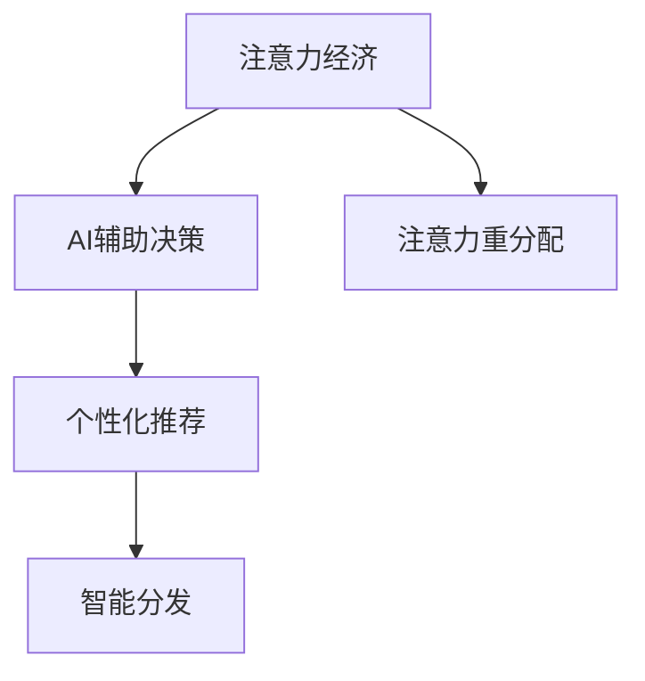

                 

# 注意力经济2.0：AI重塑的价值交换系统

在数字化时代的浪潮中，注意力成为了一种宝贵的资源，成为了一种新的“货币”。而人工智能（AI）正以其独特的力量，重塑着这个以注意力为核心的经济系统。本文将深入探讨AI如何在注意力经济2.0时代中扮演关键角色，重塑价值交换系统。

## 1. 背景介绍

### 1.1 问题的由来

进入21世纪，随着互联网的兴起，信息爆炸成为不可避免的趋势。无论是搜索引擎、社交媒体、电商平台，还是各类娱乐应用，都在争抢用户的注意力。注意力作为一种稀缺资源，开始被重新评估和利用。

过去，注意力往往被看作是用户主动选择的结果，但随着AI技术的发展，越来越多的系统开始能够主动捕捉用户的注意力。这种从“被动接收”到“主动引导”的转变，催生了“注意力经济2.0”时代的到来。

### 1.2 问题的核心关键点

注意力经济2.0的核心在于AI技术的应用，使得系统能够更精准、更高效地引导和利用用户的注意力。AI系统通过数据分析、机器学习等技术，洞察用户行为和偏好，并据此生成个性化的推荐和内容，从而极大地提升用户的注意力转化率和满意度。

AI重塑价值交换系统，主要体现在以下几个方面：

- **个性化推荐**：AI能够基于用户的历史行为数据，预测其未来的需求和兴趣，从而生成个性化的推荐内容。
- **智能分发**：AI可以根据不同用户的行为特征，智能调整内容的展示顺序和方式，提升用户体验。
- **数据驱动决策**：AI技术能够实时分析海量用户数据，帮助企业优化产品策略、广告投放等，提升营销效果。

## 2. 核心概念与联系

### 2.1 核心概念概述

为更好地理解AI如何重塑注意力经济2.0，本节将介绍几个关键概念：

- **注意力经济**：一种经济模式，以获取和引导用户注意力为手段，通过提供符合用户期望的内容和产品，实现价值交换。
- **AI辅助决策**：利用AI技术分析用户数据，辅助企业做出更精准的市场决策。
- **推荐系统**：通过数据分析和算法，生成个性化的推荐内容，提升用户满意度。
- **注意力重分配**：AI技术可以根据用户行为和偏好，动态调整内容的展示方式和顺序，优化用户注意力分配。

这些概念之间的逻辑关系可以通过以下Mermaid流程图来展示：



这个流程图展示了一些关键概念之间的关系：

1. 注意力经济以获取和引导用户注意力为核心，通过个性化推荐和智能分发实现。
2. AI辅助决策是支持个性化推荐和智能分发的重要手段。
3. 注意力重分配是智能分发的一个重要目标，旨在优化用户的注意力分配。

## 3. 核心算法原理 & 具体操作步骤

### 3.1 算法原理概述

AI重塑注意力经济的核心在于推荐系统，推荐系统通过分析用户的历史行为和兴趣，生成个性化的推荐内容。推荐系统的基本原理可以概括为：

- 收集用户的互动数据。
- 分析用户行为，生成用户画像。
- 根据用户画像，生成推荐内容。
- 实时更新推荐内容，保持个性化和时效性。

推荐系统主要包括两个核心模块：

- 用户画像模块：通过分析用户的历史行为、兴趣、偏好等数据，生成用户画像。
- 推荐算法模块：根据用户画像，生成个性化的推荐内容。

### 3.2 算法步骤详解

基于协同过滤和深度学习的推荐系统，一般包括以下几个步骤：

**Step 1: 数据预处理**
- 收集用户的历史行为数据，如浏览、点击、购买记录等。
- 对数据进行清洗、归一化等预处理。

**Step 2: 用户画像生成**
- 使用协同过滤算法，如矩阵分解、基于用户的协同过滤、基于物品的协同过滤等，生成用户画像。
- 使用深度学习模型，如因子分解机、神经协同过滤等，进一步优化用户画像。

**Step 3: 推荐算法训练**
- 选择合适的推荐算法，如基于内容的推荐、协同过滤、深度学习推荐等，并训练模型。
- 使用历史数据进行模型训练，优化推荐算法。

**Step 4: 推荐内容生成**
- 根据用户画像和推荐算法，生成个性化的推荐内容。
- 实时更新推荐内容，保持推荐的时效性。

**Step 5: 评估与优化**
- 使用A/B测试等方法，评估推荐系统的效果。
- 根据测试结果，不断优化推荐算法和策略。

### 3.3 算法优缺点

基于协同过滤和深度学习的推荐系统，具有以下优点：

- **个性化程度高**：能够根据用户的历史行为数据，生成个性化的推荐内容。
- **模型效果好**：深度学习算法具有强大的建模能力，能够处理复杂的数据结构。
- **实时性高**：通过实时更新推荐内容，保持推荐的时效性。

但该方法也存在一定的局限性：

- **数据依赖性强**：推荐系统的性能很大程度上依赖于用户的历史数据，缺少数据可能无法生成有效的推荐。
- **冷启动问题**：新用户的初期推荐效果较差，需要积累一定量的数据才能发挥作用。
- **易过拟合**：深度学习模型可能会过拟合历史数据，导致推荐效果不佳。

### 3.4 算法应用领域

基于协同过滤和深度学习的推荐系统，在电商、新闻媒体、社交媒体等领域得到了广泛应用：

- **电商推荐**：通过分析用户的历史购买记录，生成个性化的商品推荐。
- **新闻媒体**：基于用户的历史阅读数据，生成个性化的新闻推荐。
- **社交媒体**：通过分析用户的行为特征，生成个性化的内容推荐。
- **视频平台**：根据用户的历史观看记录，生成个性化的视频推荐。

除了上述应用领域，推荐系统还被应用于广告投放、内容创作、直播推荐等场景，为不同领域带来了巨大的价值。

## 4. 数学模型和公式 & 详细讲解 & 举例说明

### 4.1 数学模型构建

本节将使用数学语言对基于协同过滤的推荐系统进行更加严格的刻画。

记用户画像矩阵为 $\mathbf{U} \in \mathbb{R}^{m \times n}$，其中 $m$ 为用户数，$n$ 为物品数。用户对物品的评分矩阵为 $\mathbf{R} \in \mathbb{R}^{m \times n}$，其中 $r_{ij}$ 表示用户 $i$ 对物品 $j$ 的评分。

定义推荐算法为 $\mathbf{P} = \mathbf{U} \mathbf{V}^T$，其中 $\mathbf{V} \in \mathbb{R}^{n \times k}$ 为推荐因子矩阵，$k$ 为推荐因子数。$\mathbf{P}$ 为预测用户对物品的评分矩阵。

### 4.2 公式推导过程

推荐系统的主要目标是最小化预测评分与实际评分的差异，即最小化损失函数：

$$
\min_{\mathbf{U}, \mathbf{V}} \frac{1}{2} ||\mathbf{R} - \mathbf{U}\mathbf{V}^T||^2_F
$$

其中 $||\cdot||^2_F$ 为矩阵的 Frobenius 范数。

通过求解上述最小化问题，可以估计出推荐因子矩阵 $\mathbf{V}$，从而生成个性化的推荐内容。

### 4.3 案例分析与讲解

假设某电商平台收集了用户对不同商品的评分数据，记为 $\mathbf{R}$。我们使用协同过滤算法生成用户画像 $\mathbf{U}$，并通过深度学习模型优化推荐因子矩阵 $\mathbf{V}$。

具体步骤如下：

1. 使用矩阵分解算法，将评分矩阵 $\mathbf{R}$ 分解为用户画像矩阵 $\mathbf{U}$ 和推荐因子矩阵 $\mathbf{V}$ 的乘积。
2. 使用神经网络模型，如自编码器、神经协同过滤等，优化推荐因子矩阵 $\mathbf{V}$。
3. 根据优化后的 $\mathbf{U}$ 和 $\mathbf{V}$，生成用户对不同商品的预测评分。
4. 根据预测评分，生成个性化的推荐列表。

## 5. 项目实践：代码实例和详细解释说明

### 5.1 开发环境搭建

在进行推荐系统开发前，我们需要准备好开发环境。以下是使用Python进行TensorFlow开发的环境配置流程：

1. 安装Anaconda：从官网下载并安装Anaconda，用于创建独立的Python环境。

2. 创建并激活虚拟环境：
```bash
conda create -n tf-env python=3.8 
conda activate tf-env
```

3. 安装TensorFlow：根据CUDA版本，从官网获取对应的安装命令。例如：
```bash
conda install tensorflow tensorflow-gpu -c conda-forge -c pypi
```

4. 安装必要的依赖包：
```bash
pip install numpy pandas sklearn tensorflow-io tensorflow-hub
```

完成上述步骤后，即可在`tf-env`环境中开始推荐系统开发。

### 5.2 源代码详细实现

这里我们以电商推荐系统为例，给出使用TensorFlow进行协同过滤推荐系统开发的代码实现。

```python
import tensorflow as tf
import numpy as np
from tensorflow.keras.layers import Input, Embedding, Flatten, Dense, Add
from tensorflow.keras.models import Model

# 生成随机用户画像和评分矩阵
m, n = 100, 50
np.random.seed(0)
U = np.random.randn(m, n)
R = np.random.randn(m, n)

# 定义推荐系统模型
user_input = Input(shape=(n,), name='user')
item_input = Input(shape=(n,), name='item')
user_embed = Embedding(n, 10, name='user_embed')(user_input)
item_embed = Embedding(n, 10, name='item_embed')(item_input)
concat = Add()([user_embed, item_embed])
user_item_score = Dense(1, activation='sigmoid')(concat)

model = Model(inputs=[user_input, item_input], outputs=user_item_score)
model.compile(optimizer='adam', loss='binary_crossentropy', metrics=['accuracy'])

# 训练推荐系统模型
model.fit(x=[U, U], y=R, epochs=10, batch_size=32)
```

以上代码实现了基于协同过滤的推荐系统。我们首先生成了随机用户画像和评分矩阵，然后定义了推荐系统的模型架构，包括用户嵌入层、物品嵌入层、加法层和输出层。最后使用随机生成的数据进行模型训练。

### 5.3 代码解读与分析

让我们再详细解读一下关键代码的实现细节：

**生成随机用户画像和评分矩阵**：
- 使用`numpy`生成随机矩阵，模拟用户对不同物品的评分数据。

**定义推荐系统模型**：
- 使用`tf.keras`定义推荐系统模型，包括用户嵌入层、物品嵌入层和加法层。
- 输出层使用`sigmoid`激活函数，生成预测评分。

**模型训练**：
- 使用随机生成的数据进行模型训练，训练10个epoch，每次32个样本。

可以看到，TensorFlow提供了强大的工具和库，使得推荐系统开发变得更加便捷。开发者可以根据具体需求，灵活设计和优化模型架构。

## 6. 实际应用场景

### 6.1 智能广告投放

基于AI的推荐系统可以显著提升广告投放的效果。传统的广告投放方式往往采用粗粒度的定向策略，很难精准到达目标用户。而使用基于协同过滤的推荐系统，可以更精细地定位用户，生成个性化的广告推荐。

在技术实现上，可以收集用户在电商平台、社交媒体等平台上的行为数据，生成用户画像，并据此生成个性化的广告推荐。广告系统可以根据用户的行为特征，实时调整广告的展示方式和位置，从而提升广告的点击率和转化率。

### 6.2 个性化内容推荐

内容推荐系统是推荐系统的重要应用之一。传统的推荐方式往往依赖于编辑人员的主观判断，难以满足不同用户的需求。使用基于深度学习的推荐系统，可以根据用户的历史行为和兴趣，生成个性化的内容推荐。

在技术实现上，可以收集用户对不同内容（如文章、视频、音乐等）的互动数据，使用协同过滤算法或深度学习模型生成个性化推荐。内容推荐系统可以根据用户的行为特征，实时调整内容的展示顺序和方式，提升用户的满意度。

### 6.3 智能金融理财

金融理财领域需要精准的个性化推荐和决策支持。使用基于AI的推荐系统，可以更精准地为用户提供个性化的理财方案和产品推荐。

在技术实现上，可以收集用户在金融平台上的行为数据，使用深度学习模型生成个性化推荐，并据此优化产品策略、调整广告投放等。金融理财平台可以根据用户的行为特征，实时调整理财方案的推荐，提升用户的满意度和忠诚度。

### 6.4 未来应用展望

随着AI技术的不断发展，推荐系统将进一步渗透到更多领域，为各行各业带来变革性的影响。

在智慧医疗领域，基于AI的推荐系统可以推荐个性化的诊疗方案和药品，提升医疗服务的质量和效率。

在智能制造领域，基于AI的推荐系统可以推荐最优的生产方案和设备维护策略，提升生产效率和设备利用率。

在智能交通领域，基于AI的推荐系统可以推荐最优的出行方案和路线规划，提升交通系统的效率和安全性。

此外，在教育、娱乐、农业等领域，基于AI的推荐系统也将不断涌现，为不同行业带来更多的创新和价值。

## 7. 工具和资源推荐

### 7.1 学习资源推荐

为了帮助开发者系统掌握推荐系统的理论基础和实践技巧，这里推荐一些优质的学习资源：

1. 《推荐系统实战》系列博文：由推荐系统专家撰写，深入浅出地介绍了推荐系统的原理和算法，覆盖了协同过滤、深度学习等主流方法。

2. 《深度学习》课程：斯坦福大学开设的深度学习明星课程，涵盖推荐系统、神经网络等重要主题。

3. 《推荐系统》书籍：由推荐系统专家撰写，全面介绍了推荐系统的基本概念和算法，适合初学者入门。

4. Kaggle：推荐系统竞赛平台，提供大量的数据集和竞赛题目，供开发者进行实践和测试。

通过对这些资源的学习实践，相信你一定能够快速掌握推荐系统的精髓，并用于解决实际的推荐问题。

### 7.2 开发工具推荐

高效的开发离不开优秀的工具支持。以下是几款用于推荐系统开发的常用工具：

1. TensorFlow：由Google主导开发的开源深度学习框架，生产部署方便，适合大规模工程应用。推荐系统有TensorFlow官方的推荐库可供使用。

2. PyTorch：基于Python的开源深度学习框架，灵活动态的计算图，适合快速迭代研究。推荐系统有PyTorch官方的推荐库可供使用。

3. Surprise：Python推荐系统库，提供了多种协同过滤算法和深度学习算法的实现。

4. LightFM：由Amazon开发的推荐系统框架，支持多种深度学习算法和协同过滤算法，适合处理大规模数据。

5. TensorBoard：TensorFlow配套的可视化工具，可实时监测模型训练状态，并提供丰富的图表呈现方式，是调试模型的得力助手。

合理利用这些工具，可以显著提升推荐系统的开发效率，加快创新迭代的步伐。

### 7.3 相关论文推荐

推荐系统的发展源于学界的持续研究。以下是几篇奠基性的相关论文，推荐阅读：

1. "Collaborative Filtering for Implicit Feedback Datasets"：提出了协同过滤的基本框架，并给出了多项改进算法。

2. "BPR: Bayesian Personalized Ranking from Implicit Feedback"：提出了贝叶斯协同过滤算法，提高了协同过滤模型的准确性。

3. "Factorization Machines"：提出了因子分解机的概念，是一种高效的协同过滤算法。

4. "Wide & Deep Learning for Recommender Systems"：提出将深度学习和浅层模型结合的方法，提高了推荐系统的效果。

5. "DNN-Based Recommender Systems"：提出使用深度学习模型进行推荐，提高了推荐系统的效果和鲁棒性。

这些论文代表了大规模推荐系统的发展脉络。通过学习这些前沿成果，可以帮助研究者把握学科前进方向，激发更多的创新灵感。

## 8. 总结：未来发展趋势与挑战

### 8.1 总结

本文对基于协同过滤的推荐系统进行了全面系统的介绍。首先阐述了推荐系统在注意力经济2.0时代中的重要地位，明确了AI技术如何重塑价值交换系统。其次，从原理到实践，详细讲解了推荐系统的数学模型和关键步骤，给出了推荐系统开发的完整代码实例。同时，本文还广泛探讨了推荐系统在电商、广告、金融等领域的应用前景，展示了推荐系统的巨大潜力。此外，本文精选了推荐系统的各类学习资源，力求为读者提供全方位的技术指引。

通过本文的系统梳理，可以看到，AI技术在推荐系统中的应用，已经为不同行业带来了显著的变革。未来，伴随AI技术的持续发展，推荐系统将在更多领域大放异彩，为人类社会带来更多的价值。

### 8.2 未来发展趋势

展望未来，推荐系统的发展趋势主要体现在以下几个方面：

1. **多模态融合**：推荐系统将从纯文本推荐逐步拓展到图像、视频、音频等多模态数据的融合。多模态数据的整合，将显著提升推荐系统的精度和效果。

2. **实时推荐**：实时推荐系统将成为未来的重要方向。通过实时分析用户的行为数据，推荐系统可以动态调整推荐内容，提升用户满意度。

3. **跨域推荐**：跨域推荐系统将成为热门研究课题。通过在不同平台和场景间进行数据共享和融合，推荐系统可以提供更加个性化和全面的推荐。

4. **个性化与隐私保护**：推荐系统需要在个性化的同时，充分保护用户的隐私。如何在确保推荐效果的同时，降低隐私风险，将是重要的研究方向。

5. **模型的可解释性**：推荐系统的模型往往是"黑盒"系统，难以解释其内部工作机制和决策逻辑。如何赋予推荐系统更强的可解释性，将是重要的研究方向。

6. **动态推荐**：动态推荐系统将成为未来的重要方向。通过实时调整推荐算法和策略，推荐系统可以应对用户需求的变化，提供更加精准的推荐。

以上趋势凸显了推荐系统技术的广阔前景。这些方向的探索发展，必将进一步提升推荐系统的精度和效果，为不同行业带来更多的创新和价值。

### 8.3 面临的挑战

尽管推荐系统技术已经取得了显著进展，但在迈向更加智能化、普适化应用的过程中，仍面临诸多挑战：

1. **数据隐私问题**：推荐系统需要大量用户数据进行训练，数据隐私和安全问题不可忽视。如何在确保推荐效果的同时，保护用户隐私，将是重要的研究方向。

2. **冷启动问题**：新用户的初期推荐效果较差，需要积累一定量的数据才能发挥作用。如何通过少样本学习或基于知识图谱的推荐，提高冷启动效果，将是重要的研究方向。

3. **模型的可解释性**：推荐系统的模型往往是"黑盒"系统，难以解释其内部工作机制和决策逻辑。如何赋予推荐系统更强的可解释性，将是重要的研究方向。

4. **实时性问题**：实时推荐系统需要处理海量数据，实时性要求高。如何在保证推荐效果的同时，提高系统的实时性和可扩展性，将是重要的研究方向。

5. **模型的公平性**：推荐系统可能存在推荐偏差，对某些用户或群体的推荐不公平。如何通过算法优化，提升推荐系统的公平性，将是重要的研究方向。

6. **模型的稳定性**：推荐系统的模型需要应对数据分布的变化，保持稳定性。如何通过模型更新和参数调整，提高推荐系统的鲁棒性，将是重要的研究方向。

### 8.4 研究展望

面对推荐系统面临的这些挑战，未来的研究需要在以下几个方面寻求新的突破：

1. **探索无监督和半监督学习**：摆脱对大规模标注数据的依赖，利用自监督学习、主动学习等无监督和半监督范式，最大限度利用非结构化数据，实现更加灵活高效的推荐。

2. **研究参数高效和计算高效的推荐范式**：开发更加参数高效的推荐方法，在固定大部分预训练参数的同时，只更新极少量的任务相关参数。同时优化推荐模型的计算图，减少前向传播和反向传播的资源消耗，实现更加轻量级、实时性的部署。

3. **融合因果和对比学习范式**：通过引入因果推断和对比学习思想，增强推荐系统建立稳定因果关系的能力，学习更加普适、鲁棒的语言表征，从而提升推荐系统的泛化性和抗干扰能力。

4. **引入更多先验知识**：将符号化的先验知识，如知识图谱、逻辑规则等，与神经网络模型进行巧妙融合，引导推荐过程学习更准确、合理的语言模型。同时加强不同模态数据的整合，实现视觉、语音等多模态信息与文本信息的协同建模。

5. **结合因果分析和博弈论工具**：将因果分析方法引入推荐系统，识别出推荐决策的关键特征，增强输出解释的因果性和逻辑性。借助博弈论工具刻画人机交互过程，主动探索并规避推荐系统的脆弱点，提高系统稳定性。

6. **纳入伦理道德约束**：在推荐系统的训练目标中引入伦理导向的评估指标，过滤和惩罚有偏见、有害的输出倾向。同时加强人工干预和审核，建立推荐系统的监管机制，确保输出的合法合规。

这些研究方向的探索，必将引领推荐系统技术迈向更高的台阶，为构建安全、可靠、可解释、可控的智能系统铺平道路。面向未来，推荐系统技术还需要与其他人工智能技术进行更深入的融合，如知识表示、因果推理、强化学习等，多路径协同发力，共同推动推荐系统的进步。只有勇于创新、敢于突破，才能不断拓展推荐系统的边界，让智能技术更好地造福人类社会。

## 9. 附录：常见问题与解答

**Q1：推荐系统是否适用于所有NLP任务？**

A: 推荐系统在大多数NLP任务上都能取得不错的效果，特别是对于数据量较小的任务。但对于一些特定领域的任务，如医学、法律等，推荐系统可能无法很好地适应。此时需要在特定领域语料上进一步预训练，再进行推荐，才能获得理想效果。

**Q2：推荐系统中如何选择合适的模型？**

A: 选择合适的推荐模型需要根据具体任务和数据特点进行灵活选择。常见的推荐模型包括协同过滤、深度学习推荐、混合推荐等。对于冷启动问题，可以使用深度学习模型进行推荐；对于实时性要求高的任务，可以选择基于内容的推荐。需要根据数据特征和业务需求进行综合评估。

**Q3：推荐系统在落地部署时需要注意哪些问题？**

A: 将推荐系统转化为实际应用，还需要考虑以下因素：

1. 模型裁剪：去除不必要的层和参数，减小模型尺寸，加快推理速度。
2. 量化加速：将浮点模型转为定点模型，压缩存储空间，提高计算效率。
3. 服务化封装：将模型封装为标准化服务接口，便于集成调用。
4. 弹性伸缩：根据请求流量动态调整资源配置，平衡服务质量和成本。
5. 监控告警：实时采集系统指标，设置异常告警阈值，确保服务稳定性。

推荐系统需要开发者根据具体任务，不断迭代和优化模型、数据和算法，方能得到理想的效果。

---

作者：禅与计算机程序设计艺术 / Zen and the Art of Computer Programming

