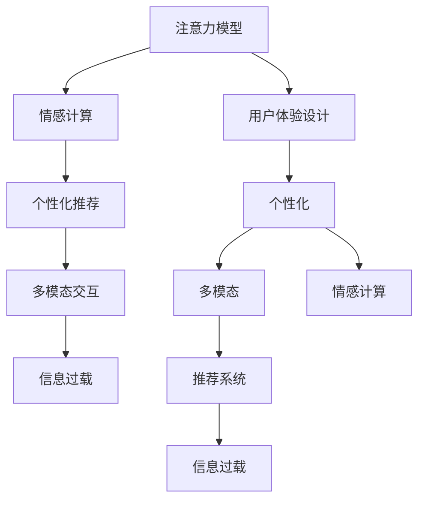

                 

# 注意力经济下的用户体验设计

> 关键词：用户体验, 注意力模型, 情感计算, 推荐系统, 个性化, 信息过载, 多模态交互

## 1. 背景介绍

随着互联网和移动互联网的飞速发展，用户可接触到的信息爆炸式增长。用户如何在海量信息中找到自己感兴趣的内容，以及如何有效利用这些信息提升自身的认知和情感体验，成为用户体验设计的重要课题。

**1.1 用户注意力现状分析**

用户的注意力是一种有限且宝贵资源，在各种交互场景中不断被分散和消耗。在复杂多变的用户行为下，如何精准抓住用户注意力，已成为产品设计和运营的难点。当前，用户注意力在以下几个方面表现出显著特征：

- **信息过载**：用户每天面临的信息量巨大，而其注意力资源有限，容易产生疲劳和信息淹没感。
- **短周期注意力**：用户注意力持续时间较短，容易在短时间内产生疲劳或兴趣转移。
- **多模态需求**：用户对多模态内容（文本、图片、视频等）的需求日益增长，单一模态的展示效果逐渐减弱。
- **个性化追求**：用户期望获得更加个性化的推荐和服务，避免千篇一律的信息。

**1.2 注意力经济价值**

注意力经济是指通过有效吸引和利用用户注意力，创造出经济价值的经济形态。在数字时代，注意力是一种宝贵的资产，通过合理的用户体验设计，能够提升用户参与度、增强品牌认知、促进产品传播。

**1.3 目标与挑战**

本文聚焦于在注意力经济背景下，如何通过改进用户体验设计，优化用户注意力资源分配，提升产品价值。具体目标包括：

- 了解用户注意力机制，分析用户行为和情感模式。
- 构建和应用个性化推荐系统，提高用户满意度。
- 探索多模态交互方式，增强用户沉浸感。
- 建立用户情感计算模型，提升用户情感体验。

## 2. 核心概念与联系

### 2.1 核心概念概述

为更好地理解注意力经济下的用户体验设计，本节将介绍几个关键概念：

- **注意力模型**：通过数学建模的方式，描述用户注意力在时间、空间、内容等方面的分布和变化规律。
- **情感计算**：应用计算机技术，对用户的情感状态进行量化和分析，以提升用户体验和满意度。
- **推荐系统**：根据用户历史行为和兴趣，推荐合适的内容或服务，以提高用户参与度和留存率。
- **个性化**：通过分析用户数据，制定个性化的内容推荐和产品设计策略，满足用户多样化的需求。
- **多模态交互**：在用户交互过程中，使用文字、图片、视频等多种媒介，丰富用户体验。
- **信息过载**：用户在面对大量信息时，注意力资源被分散，影响决策效率和用户体验。
- **用户体验设计**：通过交互设计、界面设计、视觉设计等手段，优化用户与产品的互动方式，提升用户满意度。

这些概念之间存在密切联系，共同构成了用户体验设计的核心框架。

### 2.2 核心概念原理和架构的 Mermaid 流程图



这个流程图展示了各概念之间的逻辑关系：

- 注意力模型为情感计算和推荐系统提供用户行为的基础数据。
- 情感计算和推荐系统提升用户满意度和参与度，增强用户体验。
- 多模态交互丰富用户体验，提高用户沉浸感。
- 个性化设计和情感计算通过精细化内容推荐，提升用户满意度。
- 信息过载问题需要通过用户注意力的合理分配来解决。

## 3. 核心算法原理 & 具体操作步骤

### 3.1 算法原理概述

用户体验设计涉及多个环节，包括注意力分析、情感计算、个性化推荐等。本节将从注意力模型的构建、情感计算模型的应用以及推荐系统的优化，介绍用户体验设计的关键算法原理。

### 3.2 算法步骤详解

#### 3.2.1 注意力模型构建

注意力模型用于量化用户在不同内容、时间和空间上的注意力分布。常用的注意力模型包括：

- **时间注意力模型**：描述用户对内容的关注时间变化。例如，通过计算用户阅读文本的时间分布，识别出用户关注的热点区域。
- **空间注意力模型**：分析用户在多模态内容（如图片、视频）中的注意力分布。例如，通过分析用户观看视频时的视点移动轨迹，确定用户关注的内容区域。
- **内容注意力模型**：评估用户对不同类型内容的偏好。例如，通过统计用户点击链接的次数和频率，了解用户对不同主题的兴趣。

注意力模型的构建步骤如下：

1. 收集用户行为数据，包括点击、滑动、观看等交互行为。
2. 对行为数据进行预处理，如数据清洗、归一化等。
3. 设计注意力计算公式，通常使用加权平均值、注意力权重等方法。
4. 利用机器学习算法，如时间序列分析、聚类分析等，对注意力数据进行建模。
5. 根据建模结果，可视化注意力分布情况，并提出改进建议。

#### 3.2.2 情感计算模型应用

情感计算模型通过对用户情感状态进行量化和分析，提升用户体验。常用的情感计算模型包括：

- **表情分析模型**：通过识别用户面部表情，判断其情感状态。例如，利用深度学习模型识别用户拍照时的面部表情。
- **情感语言模型**：通过分析用户文本内容，判断其情感倾向。例如，利用情感词典和机器学习算法，统计用户评论中的情感词频。
- **生理反馈模型**：通过分析用户生理指标（如心率、皮温），评估其情感状态。例如，利用可穿戴设备收集用户生理数据，计算其情绪波动。

情感计算模型的应用步骤如下：

1. 收集用户情感数据，包括面部表情、文本评论、生理反馈等。
2. 对情感数据进行预处理，如数据清洗、特征提取等。
3. 设计情感计算公式，通常使用情感词典、情感模型等方法。
4. 利用机器学习算法，如分类算法、回归算法等，对情感数据进行建模。
5. 根据建模结果，提供个性化情感推荐或情感干预措施。

#### 3.2.3 推荐系统优化

推荐系统通过分析用户历史行为和兴趣，推荐合适的内容或服务，以提高用户满意度。常用的推荐算法包括：

- **协同过滤算法**：基于用户历史行为和兴趣，推荐其他用户喜欢的内容。例如，通过分析用户浏览历史，推荐相关商品。
- **基于内容的推荐算法**：根据内容特征，推荐与用户兴趣相关的内容。例如，通过分析用户对某个类别的喜爱程度，推荐同类商品。
- **混合推荐算法**：结合多种推荐算法，提升推荐效果。例如，将协同过滤和基于内容的推荐算法结合，推荐相关商品。

推荐系统的优化步骤如下：

1. 收集用户历史行为数据，包括浏览历史、购买记录等。
2. 对行为数据进行预处理，如数据清洗、特征提取等。
3. 设计推荐计算公式，通常使用协同过滤、内容推荐等方法。
4. 利用机器学习算法，如协同过滤算法、矩阵分解等，对推荐数据进行建模。
5. 根据建模结果，提供个性化推荐服务。

### 3.3 算法优缺点

#### 3.3.1 注意力模型

**优点**：

- 能够量化用户注意力分布，为情感计算和推荐系统提供基础数据。
- 通过分析用户注意力变化，识别用户行为模式和兴趣偏好。
- 能够提升用户体验，通过个性化推荐提高用户满意度。

**缺点**：

- 数据采集难度大，需要大量的用户行为数据。
- 计算复杂度较高，需要高性能计算资源。
- 数据隐私问题，需要注意用户隐私保护。

#### 3.3.2 情感计算模型

**优点**：

- 能够量化用户情感状态，提升用户体验和满意度。
- 通过情感分析，发现用户情感波动，及时调整推荐策略。
- 能够提供情感干预措施，改善用户心理状态。

**缺点**：

- 数据采集难度大，需要用户积极配合。
- 情感计算准确度受限于数据质量，存在一定误差。
- 情感计算模型的效果，受限于用户情感表达的准确性。

#### 3.3.3 推荐系统

**优点**：

- 能够提高用户参与度和满意度，提升产品留存率。
- 通过个性化推荐，满足用户多样化的需求。
- 能够优化资源分配，提高运营效率。

**缺点**：

- 需要大量的用户历史数据，存在冷启动问题。
- 推荐算法复杂度较高，需要高性能计算资源。
- 数据隐私问题，需要注意用户隐私保护。

### 3.4 算法应用领域

#### 3.4.1 社交网络

社交网络平台通过注意力模型和情感计算模型，提升用户互动体验。具体应用包括：

- 社交推荐：根据用户关注对象和互动行为，推荐其他用户。
- 情感分析：通过分析用户评论和表情，识别用户情感状态，进行情感干预。

#### 3.4.2 电商平台

电商平台通过个性化推荐系统，提升用户购物体验。具体应用包括：

- 商品推荐：根据用户浏览和购买历史，推荐相关商品。
- 个性化广告：根据用户行为和情感状态，展示个性化广告。

#### 3.4.3 新闻媒体

新闻媒体通过推荐系统，提升用户阅读体验。具体应用包括：

- 内容推荐：根据用户兴趣，推荐相关新闻。
- 个性化订阅：根据用户阅读习惯，推荐个性化的新闻频道。

#### 3.4.4 内容平台

内容平台通过推荐系统和多模态交互，提升用户娱乐体验。具体应用包括：

- 视频推荐：根据用户观看历史，推荐相关视频。
- 个性化标签：根据用户兴趣，推荐个性化标签和内容。

## 4. 数学模型和公式 & 详细讲解 & 举例说明

### 4.1 数学模型构建

#### 4.1.1 注意力模型

注意力模型通常使用向量空间表示用户注意力分布。设用户对内容 $c_i$ 的注意力表示为 $a_i$，表示为向量形式：

$$
a_i = (a_{i1}, a_{i2}, \ldots, a_{in})
$$

其中 $a_{ik}$ 表示用户对内容 $c_i$ 的第 $k$ 个特征的关注度。通过计算 $a_i$，可以评估用户对不同内容的关注程度，从而优化推荐系统。

#### 4.1.2 情感计算模型

情感计算模型通常使用情感词典和向量空间表示用户情感状态。设用户情感状态 $e$ 的向量表示为 $e = (e_1, e_2, \ldots, e_m)$，其中 $e_k$ 表示用户对第 $k$ 个情感词的情感得分。通过计算 $e$，可以评估用户情感状态，从而提供情感干预措施。

#### 4.1.3 推荐系统模型

推荐系统模型通常使用协同过滤算法和内容推荐算法。设用户 $u$ 对内容 $c_i$ 的评分表示为 $r_{ui}$，表示为向量形式：

$$
r_{ui} = (r_{ui1}, r_{ui2}, \ldots, r_{uij})
$$

其中 $r_{uik}$ 表示用户 $u$ 对内容 $c_i$ 的第 $k$ 个特征的评分。通过计算 $r_{ui}$，可以评估用户对不同内容的偏好，从而优化推荐系统。

### 4.2 公式推导过程

#### 4.2.1 时间注意力模型

时间注意力模型用于计算用户对内容的时间分布。假设用户对内容 $c_i$ 的时间分布为 $t_i = (t_{i1}, t_{i2}, \ldots, t_{in})$，其中 $t_{ik}$ 表示用户对内容 $c_i$ 的第 $k$ 个时间段的关注度。时间注意力计算公式如下：

$$
t_{ik} = \frac{\alpha_i \beta_k}{\sum_{j=1}^{n} \alpha_j \beta_j}
$$

其中 $\alpha_i$ 和 $\beta_k$ 为时间注意力计算的权重，通常使用高斯分布等方法计算。通过计算 $t_i$，可以评估用户对不同内容的关注时间分布。

#### 4.2.2 空间注意力模型

空间注意力模型用于计算用户对多模态内容的注意力分布。假设用户对内容 $c_i$ 的空间分布为 $s_i = (s_{i1}, s_{i2}, \ldots, s_{im})$，其中 $s_{ik}$ 表示用户对内容 $c_i$ 的第 $k$ 个模态的关注度。空间注意力计算公式如下：

$$
s_{ik} = \frac{\gamma_i \delta_k}{\sum_{j=1}^{m} \gamma_j \delta_j}
$$

其中 $\gamma_i$ 和 $\delta_k$ 为空间注意力计算的权重，通常使用注意力机制等方法计算。通过计算 $s_i$，可以评估用户对不同模态内容的关注程度。

#### 4.2.3 内容注意力模型

内容注意力模型用于计算用户对不同类型内容的偏好。假设用户对内容 $c_i$ 的内容分布为 $d_i = (d_{i1}, d_{i2}, \ldots, d_{il})$，其中 $d_{ik}$ 表示用户对内容 $c_i$ 的第 $k$ 个内容的关注度。内容注意力计算公式如下：

$$
d_{ik} = \frac{\epsilon_i \zeta_k}{\sum_{j=1}^{l} \epsilon_j \zeta_j}
$$

其中 $\epsilon_i$ 和 $\zeta_k$ 为内容注意力计算的权重，通常使用内容推荐算法等方法计算。通过计算 $d_i$，可以评估用户对不同类型内容的偏好。

### 4.3 案例分析与讲解

#### 4.3.1 视频推荐系统

在视频推荐系统中，用户对不同视频的注意力和情感状态可以通过注意力模型和情感计算模型进行量化。设用户对视频 $v_i$ 的注意力表示为 $a_i = (a_{i1}, a_{i2}, \ldots, a_{in})$，情感状态表示为 $e = (e_1, e_2, \ldots, e_m)$。通过对 $a_i$ 和 $e$ 的计算，可以评估用户对视频的关注程度和情感状态，从而优化推荐算法。

例如，假设用户对视频 $v_i$ 的注意力和情感状态分别如下：

$$
a_i = (0.2, 0.5, 0.3)
$$
$$
e = (0.5, 0.4, 0.1)
$$

根据时间注意力模型，用户对视频 $v_i$ 的关注时间分布为：

$$
t_i = \frac{0.2 \times 0.5}{0.2 \times 0.5 + 0.5 \times 0.4 + 0.3 \times 0.1} = (0.25, 0.4, 0.35)
$$

根据空间注意力模型，用户对视频 $v_i$ 的关注模态分布为：

$$
s_i = \frac{0.2 \times 0.5}{0.2 \times 0.5 + 0.5 \times 0.4 + 0.3 \times 0.1} = (0.2, 0.4, 0.4)
$$

根据内容注意力模型，用户对视频 $v_i$ 的关注内容分布为：

$$
d_i = \frac{0.2 \times 0.5}{0.2 \times 0.5 + 0.5 \times 0.4 + 0.3 \times 0.1} = (0.2, 0.4, 0.4)
$$

通过计算 $t_i$、$s_i$ 和 $d_i$，可以评估用户对视频的关注程度和情感状态，从而提供个性化的视频推荐。

## 5. 项目实践：代码实例和详细解释说明

### 5.1 开发环境搭建

#### 5.1.1 数据采集

在实际应用中，需要采集用户行为数据和情感数据。常用的数据采集方法包括：

- **日志记录**：通过系统日志记录用户行为，如浏览、点击、观看等。
- **情感分析**：通过面部表情识别、文本情感分析等技术，采集用户情感数据。
- **问卷调查**：通过问卷调查，收集用户反馈和评价。

#### 5.1.2 数据预处理

采集到的数据需要进行预处理，包括：

- **数据清洗**：去除噪音和异常数据。
- **数据归一化**：将数据转换为标准格式。
- **特征提取**：提取有用的特征信息。

#### 5.1.3 数据存储

采集和预处理后的数据需要存储在数据库中，常用的数据库包括：

- **MySQL**：关系型数据库，适用于结构化数据的存储。
- **MongoDB**：非关系型数据库，适用于半结构化数据的存储。
- **Elasticsearch**：全文搜索引擎，适用于大规模数据的存储和查询。

### 5.2 源代码详细实现

#### 5.2.1 注意力模型代码

注意力模型的实现可以通过Python语言和相关库完成。以下是一个基于TensorFlow实现的时间注意力模型代码示例：

```python
import tensorflow as tf

class AttentionModel(tf.keras.Model):
    def __init__(self, num_features):
        super(AttentionModel, self).__init__()
        self.attention_weights = tf.keras.layers.Dense(num_features, activation='relu')

    def call(self, inputs):
        attention_weights = self.attention_weights(inputs)
        return tf.reduce_sum(attention_weights * inputs, axis=1)
```

#### 5.2.2 情感计算模型代码

情感计算模型的实现可以通过Python语言和相关库完成。以下是一个基于NLTK情感词典实现的语言情感分析模型代码示例：

```python
import nltk
from nltk.sentiment.vader import SentimentIntensityAnalyzer

def sentiment_analysis(text):
    sid = SentimentIntensityAnalyzer()
    sentiment_scores = sid.polarity_scores(text)
    return sentiment_scores['compound']
```

#### 5.2.3 推荐系统代码

推荐系统的实现可以通过Python语言和相关库完成。以下是一个基于PyTorch实现的协同过滤推荐系统代码示例：

```python
import torch
import torch.nn as nn
from torch import nn

class CollaborativeFiltering(nn.Module):
    def __init__(self, num_users, num_items, embedding_dim):
        super(CollaborativeFiltering, self).__init__()
        self.user_embeddings = nn.Embedding(num_users, embedding_dim)
        self.item_embeddings = nn.Embedding(num_items, embedding_dim)
        self.linear = nn.Linear(embedding_dim * 2, 1)

    def forward(self, user_ids, item_ids):
        user_embeddings = self.user_embeddings(user_ids)
        item_embeddings = self.item_embeddings(item_ids)
        x = torch.cat((user_embeddings, item_embeddings), dim=1)
        x = self.linear(x)
        return x
```

### 5.3 代码解读与分析

#### 5.3.1 注意力模型

注意力模型通过计算用户对内容的关注度，为情感计算和推荐系统提供基础数据。例如，在视频推荐系统中，可以计算用户对视频的关注时间、模态和内容分布，从而优化推荐算法。

#### 5.3.2 情感计算模型

情感计算模型通过量化用户情感状态，提升用户体验和满意度。例如，在社交网络平台中，可以通过分析用户评论和表情，识别用户情感状态，进行情感干预。

#### 5.3.3 推荐系统

推荐系统通过分析用户历史行为和兴趣，推荐合适的内容或服务，以提高用户满意度。例如，在电商平台中，可以根据用户浏览和购买历史，推荐相关商品，提升用户购物体验。

### 5.4 运行结果展示

在实际应用中，可以通过可视化工具展示注意力模型、情感计算模型和推荐系统的运行结果。例如，可以使用Matplotlib和Seaborn库绘制注意力分布图和情感得分图，使用Tableau等工具生成推荐结果报表。

## 6. 实际应用场景

### 6.1 社交网络平台

社交网络平台通过注意力模型和情感计算模型，提升用户互动体验。具体应用包括：

- 社交推荐：根据用户关注对象和互动行为，推荐其他用户。
- 情感分析：通过分析用户评论和表情，识别用户情感状态，进行情感干预。

### 6.2 电商平台

电商平台通过个性化推荐系统，提升用户购物体验。具体应用包括：

- 商品推荐：根据用户浏览和购买历史，推荐相关商品。
- 个性化广告：根据用户行为和情感状态，展示个性化广告。

### 6.3 新闻媒体

新闻媒体通过推荐系统，提升用户阅读体验。具体应用包括：

- 内容推荐：根据用户兴趣，推荐相关新闻。
- 个性化订阅：根据用户阅读习惯，推荐个性化的新闻频道。

### 6.4 内容平台

内容平台通过推荐系统和多模态交互，提升用户娱乐体验。具体应用包括：

- 视频推荐：根据用户观看历史，推荐相关视频。
- 个性化标签：根据用户兴趣，推荐个性化标签和内容。

## 7. 工具和资源推荐

### 7.1 学习资源推荐

为了帮助开发者系统掌握用户体验设计的方法和技能，这里推荐一些优质的学习资源：

1. **《用户体验设计基础》**：书籍全面介绍了用户体验设计的理论基础和实践方法，适合入门学习。
2. **《情感计算》**：介绍情感计算的理论和技术，涵盖面部表情分析、文本情感分析等内容，适合深入学习。
3. **《推荐系统》**：书籍介绍推荐系统的方法和应用，涵盖协同过滤、内容推荐、混合推荐等内容，适合系统学习。
4. **《多模态交互设计》**：介绍多模态交互的理论和技术，涵盖文本、图片、视频等多种媒介的设计方法，适合学习多模态交互。
5. **《数据科学基础》**：课程介绍数据科学的基础知识，涵盖数据采集、数据处理、机器学习等内容，适合跨领域学习。

通过对这些资源的学习实践，相信你一定能够掌握用户体验设计的精髓，并用于解决实际问题。

### 7.2 开发工具推荐

高效的开发离不开优秀的工具支持。以下是几款用于用户体验设计开发的常用工具：

1. **Sketch**：界面设计工具，支持矢量绘图和原型设计，适合界面设计。
2. **Axure**：原型设计工具，支持交互设计和动画效果，适合交互设计。
3. **Adobe XD**：界面设计工具，支持矢量绘图和原型设计，适合界面设计。
4. **Figma**：在线协作设计工具，支持实时协作和版本控制，适合团队设计。
5. **InVision**：原型设计和用户测试工具，支持用户研究和测试，适合用户体验测试。

合理利用这些工具，可以显著提升用户体验设计的效率，加速创新迭代的步伐。

### 7.3 相关论文推荐

用户体验设计领域的研究不断发展，以下是几篇奠基性的相关论文，推荐阅读：

1. **《用户界面设计原则》**：论文提出了一系列设计原则，涵盖可用性、可访问性、可理解性等内容，适合基础学习。
2. **《多模态交互设计》**：论文介绍多模态交互的理论和技术，涵盖文本、图片、视频等多种媒介的设计方法，适合深入学习。
3. **《推荐系统设计》**：论文介绍推荐系统的方法和应用，涵盖协同过滤、内容推荐、混合推荐等内容，适合系统学习。
4. **《情感计算的理论与应用》**：论文介绍情感计算的理论和技术，涵盖面部表情分析、文本情感分析等内容，适合深入学习。
5. **《用户体验设计的实践与挑战》**：论文讨论了用户体验设计的实践与挑战，适合学习实践经验。

这些论文代表了大用户体验设计的发展脉络。通过学习这些前沿成果，可以帮助研究者把握学科前进方向，激发更多的创新灵感。

## 8. 总结：未来发展趋势与挑战

### 8.1 总结

本文对在注意力经济背景下，如何通过改进用户体验设计，优化用户注意力资源分配，提升产品价值进行了全面系统的介绍。首先，了解用户注意力机制，分析用户行为和情感模式。其次，构建和应用个性化推荐系统，提高用户满意度。最后，探索多模态交互方式，增强用户沉浸感。此外，建立用户情感计算模型，提升用户情感体验。

通过本文的系统梳理，可以看到，用户体验设计在注意力经济背景下，对于吸引和利用用户注意力，提升产品价值具有重要意义。

### 8.2 未来发展趋势

展望未来，用户体验设计将呈现以下几个发展趋势：

1. **个性化推荐系统**：随着用户行为数据的积累和分析技术的发展，个性化推荐系统将进一步提升用户满意度，增强产品留存率。
2. **情感计算应用**：情感计算技术将广泛应用于社交网络、电商平台等场景，提升用户情感体验和满意度。
3. **多模态交互设计**：多模态交互设计将拓展用户沉浸感，增强用户与产品的互动体验。
4. **注意力经济**：注意力经济将成为未来商业模式的核心，通过优化用户注意力资源分配，提升产品价值。
5. **混合推荐算法**：混合推荐算法将融合多种推荐方式，提升推荐效果和用户满意度。

以上趋势凸显了用户体验设计的广阔前景。这些方向的探索发展，必将进一步提升用户体验，构建更加智能、高效、可控的产品和服务。

### 8.3 面临的挑战

尽管用户体验设计已经取得了显著进展，但在迈向更加智能化、普适化应用的过程中，仍面临诸多挑战：

1. **数据隐私问题**：用户行为和情感数据涉及隐私保护，需要设计合理的隐私保护机制。
2. **计算资源需求**：用户体验设计需要高性能计算资源，需要优化算法和数据处理流程。
3. **用户界面设计**：用户界面设计需要考虑不同用户群体的需求，需要进行灵活的个性化设计。
4. **用户体验测试**：用户体验测试需要大量用户参与，需要建立有效的测试流程和机制。
5. **跨平台兼容性**：用户体验设计需要考虑不同平台和设备的用户体验，需要进行适配设计。

正视用户体验设计面临的这些挑战，积极应对并寻求突破，将是大用户体验设计走向成熟的必由之路。

### 8.4 研究展望

面对用户体验设计所面临的挑战，未来的研究需要在以下几个方面寻求新的突破：

1. **数据隐私保护**：探索数据隐私保护机制，设计合理的隐私保护算法和机制。
2. **计算资源优化**：优化用户体验设计的算法和数据处理流程，减少计算资源消耗。
3. **用户界面优化**：设计灵活的个性化用户界面，满足不同用户群体的需求。
4. **用户体验测试**：建立有效的用户体验测试流程和机制，提高测试效率和可靠性。
5. **跨平台设计**：设计跨平台的用户体验，提高产品的兼容性和可扩展性。

这些研究方向的探索，必将引领用户体验设计技术迈向更高的台阶，为构建安全、可靠、可控的智能产品和服务提供坚实的基础。面向未来，用户体验设计需要与其他人工智能技术进行更深入的融合，如知识表示、因果推理、强化学习等，协同发力，共同推动智能交互系统的进步。只有勇于创新、敢于突破，才能不断拓展用户体验设计的边界，让智能技术更好地造福人类社会。

## 9. 附录：常见问题与解答

**Q1：用户体验设计是否适用于所有产品和服务？**

A: 用户体验设计适用于各种产品和服务，尤其是对于依赖用户互动和反馈的产品，如社交网络、电商平台、新闻媒体等。通过优化用户体验设计，可以提升用户满意度和参与度，增强产品竞争力。

**Q2：如何确定用户关注的特征？**

A: 确定用户关注的特征需要依赖数据分析和用户研究。可以通过用户行为数据、情感数据、问卷调查等方式，分析用户关注的内容和特征。常用的方法包括：

- **聚类分析**：通过聚类算法，识别出用户关注的特征。
- **相关性分析**：通过计算特征的相关性，识别出用户关注的特征。
- **回归分析**：通过回归算法，预测用户关注的特征。

**Q3：如何提高个性化推荐的效果？**

A: 提高个性化推荐的效果需要优化推荐算法和数据处理流程。常用的方法包括：

- **协同过滤算法**：结合多种协同过滤算法，提升推荐效果。
- **内容推荐算法**：结合多种内容推荐算法，提升推荐效果。
- **混合推荐算法**：融合多种推荐算法，提升推荐效果。
- **用户画像**：构建用户画像，提供更加精细化的推荐。
- **多模态推荐**：结合多模态数据，提升推荐效果。

**Q4：如何提高情感计算的准确度？**

A: 提高情感计算的准确度需要优化情感计算模型和数据质量。常用的方法包括：

- **情感词典**：使用高质量的情感词典，提升情感计算的准确度。
- **多模态情感分析**：结合面部表情、文本情感、生理反馈等多种数据源，提升情感计算的准确度。
- **机器学习算法**：使用先进的机器学习算法，提升情感计算的准确度。
- **用户反馈**：通过用户反馈，不断优化情感计算模型。

**Q5：如何设计跨平台的用户界面？**

A: 设计跨平台的用户界面需要考虑不同平台和设备的用户体验，需要进行适配设计。常用的方法包括：

- **响应式设计**：设计响应式界面，适应不同设备屏幕尺寸和分辨率。
- **平台兼容性**：测试和优化跨平台兼容性，确保在不同平台上的一致性。
- **用户测试**：进行跨平台的用户测试，发现和解决设计问题。
- **设计规范**：遵循设计规范，确保在不同平台上的统一性。

通过以上常见问题的解答，相信你一定能够更好地理解用户体验设计的关键方法和技巧，并用于解决实际问题。

---

作者：禅与计算机程序设计艺术 / Zen and the Art of Computer Programming

