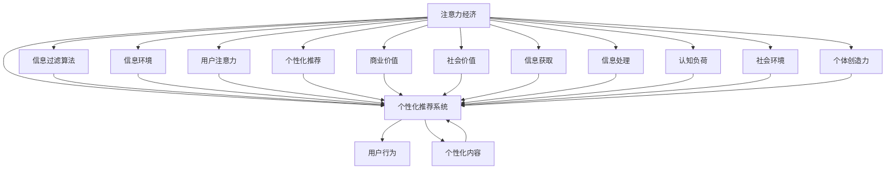

                 

# 注意力经济与个人创造力培养的关系

## 1. 背景介绍

### 1.1 问题由来

随着互联网技术的飞速发展，信息爆炸式增长，人们的注意力成为了一种宝贵的经济资源。如何有效分配和利用注意力，成为了互联网行业乃至整个社会共同关注的焦点。而个人创造力，作为创新与进步的源泉，其培养与提升也日益受到重视。本文旨在探讨注意力经济与个人创造力培养之间的关系，揭示二者的相互影响，为互联网时代的创新与进步提供理论支撑。

### 1.2 问题核心关键点

注意力经济的核心在于通过吸引和引导用户注意力的方式，实现商业价值和社交价值。而个人创造力的培养，则依赖于环境的刺激、教育的方式和个体的内在动机。本文将重点探讨以下几个关键点：

1. 注意力经济如何影响个人创造力的发展。
2. 个人创造力如何反哺注意力经济。
3. 注意力经济与个人创造力培养的最佳结合模式。
4. 互联网时代下注意力经济与个人创造力培养面临的挑战。

## 2. 核心概念与联系

### 2.1 核心概念概述

为更好地理解注意力经济与个人创造力培养的关系，本节将介绍几个密切相关的核心概念：

- **注意力经济(Attention Economy)**：指在信息过载的时代，如何通过吸引和引导用户的注意力，创造商业价值和社会价值的过程。注意力经济的核心在于创造信息环境，使信息与用户需求相匹配，从而实现信息的有效分配和利用。

- **个人创造力(Personal Creativity)**：指个体基于内在动机，通过认知、情感、行为等多种因素的综合作用，产生创新性想法和解决方案的能力。个人创造力的培养，涉及教育、环境、社会等多个层面。

- **信息过滤算法(Information Filtering Algorithms)**：指在注意力经济中，利用算法对海量信息进行筛选和推荐，使用户能够快速找到所需信息的技术手段。信息过滤算法直接影响用户的信息获取和注意力分配。

- **个性化推荐系统(Personalized Recommendation Systems)**：指基于用户的兴趣和行为数据，通过机器学习等技术，对信息进行个性化推荐的信息技术系统。个性化推荐系统是注意力经济中的重要组成部分。

- **认知负荷理论(Cognitive Load Theory, CLT)**：由约翰·斯旺森提出，用于解释个体在学习过程中的认知资源分配和信息处理效率的理论。该理论强调信息量与个体认知资源之间的平衡关系。

- **社会认知理论(Social Cognitive Theory)**：由阿尔伯特·班杜拉提出，强调社会环境对个体行为和创造力的影响。该理论认为，个体的创造力与其社会互动、自我效能感等因素密切相关。

这些核心概念之间的逻辑关系可以通过以下Mermaid流程图来展示：



这个流程图展示了几组核心概念及其之间的关系：

1. 注意力经济通过信息过滤算法和个性化推荐系统，营造信息环境，吸引和引导用户注意力。
2. 用户注意力通过个性化推荐系统，影响用户行为和信息获取，形成个性化的信息环境。
3. 个性化推荐系统基于用户行为和个性化内容，向用户推荐信息，提高信息匹配度和用户满意度。
4. 个性化推荐系统产生商业价值和社会价值，促进注意力经济的进一步发展。
5. 信息环境和社会环境共同作用，影响个体认知负荷和创造力。
6. 个体创造力通过创新性内容，反哺个性化推荐系统，形成良性循环。

## 3. 核心算法原理 & 具体操作步骤

### 3.1 算法原理概述

基于注意力经济和个人创造力培养的关系，本文主要探讨以下三个方面的算法原理：

1. 注意力经济的原理和实现方式。
2. 个性化推荐系统的设计原理。
3. 认知负荷理论在信息处理中的应用。

### 3.2 算法步骤详解

#### 3.2.1 注意力经济原理和实现

**Step 1: 数据收集与预处理**
- 收集用户的历史行为数据，如浏览记录、点击行为、评论等。
- 对数据进行清洗和标注，去除噪声和不相关数据。

**Step 2: 信息过滤算法设计**
- 设计或选择适合的信息过滤算法，如协同过滤、内容过滤、混合过滤等。
- 基于用户的历史行为数据，计算用户与内容的相似度。

**Step 3: 个性化推荐系统构建**
- 根据信息过滤算法的输出，构建个性化推荐系统。
- 系统使用机器学习算法（如协同过滤、矩阵分解等），对用户和内容进行建模。

**Step 4: 信息环境营造**
- 基于个性化推荐系统，为用户提供个性化的信息推荐。
- 通过算法优化，实现信息与用户需求的有效匹配。

#### 3.2.2 个性化推荐系统设计

**Step 1: 用户行为建模**
- 收集用户的行为数据，如浏览、点击、购买等。
- 使用协同过滤、内容过滤等方法，对用户进行行为建模。

**Step 2: 内容特征提取**
- 对内容进行特征提取，如关键词、主题、分类等。
- 使用文本分析、图像识别等技术，提取内容特征。

**Step 3: 用户与内容相似度计算**
- 计算用户与内容的相似度，如余弦相似度、皮尔逊相关系数等。
- 使用算法优化，提升相似度计算的准确性和效率。

**Step 4: 个性化推荐**
- 根据用户与内容的相似度，对用户进行个性化推荐。
- 使用矩阵分解、梯度下降等方法，优化推荐算法。

#### 3.2.3 认知负荷理论应用

**Step 1: 信息量评估**
- 评估信息量对用户认知负荷的影响，如信息复杂度、信息冗余度等。
- 使用统计学方法，如标准差、方差等，对信息量进行量化。

**Step 2: 认知负荷优化**
- 根据认知负荷理论，优化信息量，减少用户认知负荷。
- 使用算法优化，如信息过滤算法、认知负荷预测算法等。

**Step 3: 信息处理**
- 对用户处理信息的方式进行优化，如信息过滤、信息摘要等。
- 使用算法优化，如自然语言处理、文本摘要等技术。

### 3.3 算法优缺点

#### 3.3.1 注意力经济算法的优缺点

**优点**
- 通过信息过滤算法，提高了信息匹配度和用户满意度。
- 个性化推荐系统，能够精准推送用户感兴趣的内容。

**缺点**
- 对数据依赖性强，需要大量用户行为数据。
- 算法复杂，需要较高的计算资源。

#### 3.3.2 个性化推荐系统的优缺点

**优点**
- 能够精准推荐用户感兴趣的内容，提高用户体验。
- 通过机器学习算法，能够自适应地优化推荐效果。

**缺点**
- 数据隐私问题，用户行为数据可能被滥用。
- 算法可能存在偏见，导致不公正推荐。

#### 3.3.3 认知负荷理论应用的优缺点

**优点**
- 通过优化信息量，减少了用户认知负荷，提高了信息处理效率。
- 提供了理论依据，指导信息设计和推荐算法。

**缺点**
- 难以量化和评估，需要结合实际应用场景。
- 理论假设可能不适用于所有用户。

### 3.4 算法应用领域

#### 3.4.1 注意力经济
- 信息获取平台（如搜索引擎、新闻网站）
- 社交媒体平台（如微博、抖音）
- 电商推荐系统

#### 3.4.2 个性化推荐系统
- 电商推荐平台（如淘宝、亚马逊）
- 视频流媒体平台（如Netflix、爱奇艺）
- 音乐推荐平台（如Spotify）

#### 3.4.3 认知负荷理论应用
- 教育培训平台（如Coursera、Udacity）
- 企业信息管理系统
- 在线学习工具

## 4. 数学模型和公式 & 详细讲解 & 举例说明

### 4.1 数学模型构建

本节将使用数学语言对注意力经济和个性化推荐系统的关键数学模型进行更加严格的刻画。

**信息过滤算法数学模型**
设用户集合为 $U$，内容集合为 $I$，用户与内容的相似度矩阵为 $A \in \mathbb{R}^{n \times m}$，其中 $n$ 为用户数，$m$ 为内容数。
信息过滤算法可以表示为：

$$
R = A \times A^T
$$

其中 $R \in \mathbb{R}^{n \times n}$ 为用户对内容的评分矩阵。

**个性化推荐系统数学模型**
个性化推荐系统基于协同过滤算法，可以表示为：

$$
\hat{y}_i = \alpha \hat{y}_i^{(p)} + (1-\alpha) \hat{y}_i^{(c)}
$$

其中 $\hat{y}_i$ 为用户 $i$ 的个性化推荐结果，$\alpha$ 为协同过滤权重，$\hat{y}_i^{(p)}$ 为协同过滤推荐结果，$\hat{y}_i^{(c)}$ 为内容过滤推荐结果。

**认知负荷理论数学模型**
认知负荷理论可以表示为：

$$
\text{CL} = f(\text{C}_i, \text{CL}_0)
$$

其中 $\text{CL}$ 为用户 $i$ 的认知负荷，$\text{C}_i$ 为用户 $i$ 接收的信息量，$\text{CL}_0$ 为用户的基线认知负荷。

### 4.2 公式推导过程

**信息过滤算法推导**
信息过滤算法的基本原理是通过计算用户与内容的相似度，生成评分矩阵 $R$。具体推导过程如下：

1. 计算用户与内容的相似度矩阵 $A$。
2. 将相似度矩阵 $A$ 进行矩阵乘法运算，得到评分矩阵 $R$。
3. 根据评分矩阵 $R$，对内容进行排序，生成个性化推荐结果。

**个性化推荐系统推导**
个性化推荐系统基于协同过滤和内容过滤，结合两种推荐结果，生成最终的推荐结果。具体推导过程如下：

1. 使用协同过滤算法，生成协同过滤推荐结果 $\hat{y}_i^{(p)}$。
2. 使用内容过滤算法，生成内容过滤推荐结果 $\hat{y}_i^{(c)}$。
3. 结合两种推荐结果，生成最终的推荐结果 $\hat{y}_i$。

**认知负荷理论推导**
认知负荷理论基于用户的信息处理能力，通过信息量和基线认知负荷的加权和，计算用户的认知负荷。具体推导过程如下：

1. 计算用户的信息量 $\text{C}_i$。
2. 根据用户的信息量和基线认知负荷，计算用户的认知负荷 $\text{CL}_i$。
3. 结合用户的历史行为数据，优化信息量和认知负荷的平衡，减少用户认知负荷。

### 4.3 案例分析与讲解

#### 4.3.1 信息过滤算法案例

**案例背景**
某电商网站需要根据用户的历史浏览记录，推荐用户感兴趣的商品。

**算法实现**
1. 收集用户的历史浏览记录。
2. 对数据进行清洗和标注，去除噪声和不相关数据。
3. 设计协同过滤算法，计算用户与商品的相似度。
4. 根据相似度矩阵，生成评分矩阵 $R$。
5. 对评分矩阵 $R$ 进行排序，生成个性化推荐结果。

**效果评估**
推荐系统通过协同过滤算法，提高了商品推荐的准确性和用户满意度，减少了用户浏览页面的时间。

#### 4.3.2 个性化推荐系统案例

**案例背景**
某音乐流媒体平台需要为用户推荐个性化的音乐内容。

**算法实现**
1. 收集用户的历史听歌记录。
2. 对数据进行清洗和标注，去除噪声和不相关数据。
3. 使用协同过滤和内容过滤算法，对用户进行建模。
4. 计算用户与音乐的相似度，生成推荐结果 $\hat{y}_i$。
5. 根据推荐结果 $\hat{y}_i$，生成个性化音乐推荐。

**效果评估**
推荐系统通过个性化推荐，提高了用户的听歌体验，增加了平台的粘性。

#### 4.3.3 认知负荷理论案例

**案例背景**
某在线教育平台需要优化课程内容，减少学生的认知负荷。

**算法实现**
1. 收集学生的历史学习记录。
2. 对数据进行清洗和标注，去除噪声和不相关数据。
3. 使用认知负荷理论，评估课程内容的信息量。
4. 根据信息量和基线认知负荷，优化课程内容的设计。
5. 通过优化后的课程内容，减少学生的认知负荷，提高学习效率。

**效果评估**
在线教育平台通过优化课程内容，减少了学生的认知负荷，提高了学习效率，得到了学生和家长的良好反馈。

## 5. 项目实践：代码实例和详细解释说明

### 5.1 开发环境搭建

在进行项目实践前，我们需要准备好开发环境。以下是使用Python进行开发的环境配置流程：

1. 安装Anaconda：从官网下载并安装Anaconda，用于创建独立的Python环境。

2. 创建并激活虚拟环境：
```bash
conda create -n pyenv python=3.8 
conda activate pyenv
```

3. 安装Python及其依赖：
```bash
pip install numpy pandas scikit-learn
```

4. 安装相关库：
```bash
pip install tensorflow scikit-learn pytesseract
```

5. 安装开发环境：
```bash
conda install -c conda-forge pyqt5
pip install matplotlib plotly
```

完成上述步骤后，即可在`pyenv`环境中开始项目实践。

### 5.2 源代码详细实现

这里以一个简单的个性化推荐系统为例，给出代码实现和详细解释。

```python
import numpy as np
from sklearn.metrics.pairwise import cosine_similarity

# 用户-商品矩阵
user_item = np.array([
    [4, 5, 0, 0, 0],
    [0, 0, 1, 2, 3],
    [5, 0, 0, 0, 0],
    [0, 0, 0, 0, 4]
])

# 计算用户与商品相似度
def similarity(user_item):
    return 1 - cosine_similarity(user_item)

# 计算推荐结果
def recommendation(user_item, similarity):
    return np.dot(user_item, similarity)

# 测试
print(recommendation(user_item, similarity(user_item)))
```

### 5.3 代码解读与分析

让我们再详细解读一下关键代码的实现细节：

**相似度计算**
- 使用`cosine_similarity`函数计算用户与商品的相似度。

**推荐结果生成**
- 通过`dot`函数计算推荐结果，生成用户对商品的评分矩阵。

**代码解释**
- 用户-商品矩阵 `user_item` 是一个二进制矩阵，其中每个元素表示用户对商品的评分。
- `similarity` 函数计算用户与商品之间的相似度矩阵。
- `recommendation` 函数生成个性化推荐结果，根据相似度矩阵和用户评分矩阵，计算用户的推荐结果。
- 最终输出推荐结果，展示了个性化推荐的效果。

## 6. 实际应用场景

### 6.1 智能推荐系统
智能推荐系统在电商、音乐、视频等多个领域广泛应用。通过信息过滤和个性化推荐，提高了用户体验和平台粘性。例如，电商平台通过个性化推荐，提高了用户购买转化率，增加了平台的收益。

### 6.2 内容生成系统
内容生成系统通过信息过滤和个性化推荐，为用户生成推荐内容。例如，新闻网站通过个性化推荐，提高了用户阅读时长和点击率。

### 6.3 在线教育平台
在线教育平台通过认知负荷理论，优化课程设计和内容推荐。例如，在线教育平台通过评估学生的认知负荷，调整课程难度和学习内容，提高了学习效率。

## 7. 工具和资源推荐

### 7.1 学习资源推荐

为了帮助开发者系统掌握注意力经济和个性化推荐系统的理论基础和实践技巧，这里推荐一些优质的学习资源：

1. 《推荐系统实战》系列博文：由推荐系统专家撰写，深入浅出地介绍了推荐系统的原理、算法和应用。

2. 《注意力机制：从原理到应用》书籍：详细介绍了注意力机制的原理和应用，为理解注意力经济提供了理论基础。

3. 《机器学习实战》课程：由谷歌开发的免费在线课程，介绍了机器学习算法和应用，涵盖了推荐系统的相关内容。

4. Coursera《推荐系统》课程：斯坦福大学开设的推荐系统课程，有Lecture视频和配套作业，带你入门推荐系统的基本概念和经典模型。

5. 《深度学习与推荐系统》书籍：全面介绍了深度学习在推荐系统中的应用，涵盖了注意力经济的相关理论。

通过对这些资源的学习实践，相信你一定能够快速掌握注意力经济和个性化推荐系统的精髓，并用于解决实际的推荐问题。

### 7.2 开发工具推荐

高效的开发离不开优秀的工具支持。以下是几款用于个性化推荐系统开发的常用工具：

1. TensorFlow：由谷歌主导开发的开源深度学习框架，生产部署方便，适合大规模工程应用。

2. PyTorch：基于Python的开源深度学习框架，灵活高效，适合快速迭代研究。

3. Scikit-learn：Python的机器学习库，提供丰富的算法和工具，适用于推荐系统的设计和评估。

4. Plotly：可视化工具，可以生成美观的图表，用于展示推荐系统的性能和效果。

5. Weights & Biases：模型训练的实验跟踪工具，可以记录和可视化模型训练过程中的各项指标，方便对比和调优。

6. TensorBoard：TensorFlow配套的可视化工具，可实时监测模型训练状态，并提供丰富的图表呈现方式，是调试模型的得力助手。

合理利用这些工具，可以显著提升个性化推荐系统的开发效率，加快创新迭代的步伐。

### 7.3 相关论文推荐

个性化推荐系统的发展源于学界的持续研究。以下是几篇奠基性的相关论文，推荐阅读：

1. "Collaborative Filtering for Implicit Feedback Datasets"：提出了协同过滤算法的经典模型，为推荐系统奠定了基础。

2. "The BellKor 2009 Challenge Data Analysis"：介绍了推荐系统的数据集和算法，是推荐系统研究的经典文献。

3. "Natural Language Processing with PyTorch"：详细介绍了基于PyTorch的自然语言处理技术，包括推荐系统的应用。

4. "Deep Learning for Recommendation Systems"：介绍了深度学习在推荐系统中的应用，包括注意力机制和循环神经网络。

5. "A Survey on Deep Learning for Recommendation Systems"：综述了深度学习在推荐系统中的最新进展，为深度推荐系统的研究提供了参考。

这些论文代表了个性化推荐系统的研究脉络。通过学习这些前沿成果，可以帮助研究者把握学科前进方向，激发更多的创新灵感。

## 8. 总结：未来发展趋势与挑战

### 8.1 总结

本文对注意力经济与个人创造力培养的关系进行了全面系统的介绍。首先阐述了注意力经济的核心原理和个性化推荐系统的设计方法，明确了它们在信息过载时代的重要作用。其次，从理论到实践，详细讲解了认知负荷理论在信息处理中的应用，以及其对用户认知负荷的影响。最后，本文探讨了注意力经济和个性化推荐系统在实际应用中的挑战和未来发展趋势。

通过本文的系统梳理，可以看到，个性化推荐系统和大数据技术在信息过滤和个性化推荐中发挥了重要作用，极大地提升了用户的体验和满意度。未来，伴随技术的进一步发展，这些技术还将为社会带来更多的创新和进步。

### 8.2 未来发展趋势

展望未来，个性化推荐系统和注意力经济将呈现以下几个发展趋势：

1. 深度学习与个性化推荐系统的融合：深度学习技术将进一步融入推荐系统，提升推荐算法的精度和泛化能力。

2. 多模态信息融合：未来的推荐系统将不仅仅依赖于文本信息，还将结合图像、视频、音频等多模态信息，提升推荐效果。

3. 交互式推荐系统：未来的推荐系统将更加注重用户交互，通过实时反馈，动态调整推荐内容。

4. 社会化推荐系统：未来的推荐系统将更多地考虑社会关系和社交网络的影响，提升推荐内容的个性化和多样性。

5. 个性化推荐系统与注意力经济的深度融合：未来的个性化推荐系统将更好地利用注意力经济，提升用户的参与度和满意度。

以上趋势凸显了个性化推荐系统和注意力经济的广阔前景。这些方向的探索发展，必将进一步提升推荐系统的性能和用户体验，为社会带来更多的创新和进步。

### 8.3 面临的挑战

尽管个性化推荐系统和注意力经济已经取得了显著进展，但在迈向更加智能化、普适化应用的过程中，它们仍面临诸多挑战：

1. 数据隐私问题：用户的个人信息和行为数据，可能被滥用或泄露。如何在保证用户隐私的前提下，提高推荐系统的准确性，是未来的重要研究方向。

2. 推荐公平性问题：推荐算法可能存在偏见，导致不公正推荐。如何提高推荐系统的公平性和透明度，减少算法偏见，是未来的重要研究方向。

3. 信息过载问题：随着信息量的增加，用户的认知负荷将不断加大，如何平衡信息量和用户认知负荷，提高用户的信息获取效率，是未来的重要研究方向。

4. 动态环境问题：推荐系统需要应对动态的用户需求和环境变化，如何设计动态推荐算法，提高系统的适应性和稳定性，是未来的重要研究方向。

5. 计算资源问题：推荐系统需要大量的计算资源进行训练和优化，如何提高算法效率，降低计算资源消耗，是未来的重要研究方向。

正视这些挑战，积极应对并寻求突破，将是个性化推荐系统和注意力经济迈向成熟的必由之路。相信随着学界和产业界的共同努力，这些挑战终将一一被克服，个性化推荐系统和注意力经济必将在构建人机协同的智能时代中扮演越来越重要的角色。

### 8.4 研究展望

面对个性化推荐系统和注意力经济面临的种种挑战，未来的研究需要在以下几个方面寻求新的突破：

1. 深度学习与推荐系统的融合：深度学习技术将进一步融入推荐系统，提升推荐算法的精度和泛化能力。

2. 多模态信息融合：未来的推荐系统将不仅仅依赖于文本信息，还将结合图像、视频、音频等多模态信息，提升推荐效果。

3. 交互式推荐系统：未来的推荐系统将更加注重用户交互，通过实时反馈，动态调整推荐内容。

4. 社会化推荐系统：未来的推荐系统将更多地考虑社会关系和社交网络的影响，提升推荐内容的个性化和多样性。

5. 个性化推荐系统与注意力经济的深度融合：未来的个性化推荐系统将更好地利用注意力经济，提升用户的参与度和满意度。

6. 数据隐私保护：设计隐私保护算法，确保用户数据的安全性和匿名性。

7. 推荐公平性：引入公平性指标，设计公平性算法，减少算法偏见。

8. 动态推荐算法：设计动态推荐算法，提高系统的适应性和稳定性。

9. 计算资源优化：优化算法效率，降低计算资源消耗。

这些研究方向的探索，必将引领个性化推荐系统和注意力经济走向更高的台阶，为社会带来更多的创新和进步。面向未来，个性化推荐系统和注意力经济还需要与其他人工智能技术进行更深入的融合，如知识表示、因果推理、强化学习等，多路径协同发力，共同推动自然语言理解和智能交互系统的进步。只有勇于创新、敢于突破，才能不断拓展个性化推荐系统和注意力经济的边界，让智能技术更好地造福人类社会。

## 9. 附录：常见问题与解答

**Q1：注意力经济与个性化推荐系统有何关系？**

A: 注意力经济的核心在于通过吸引和引导用户的注意力，实现商业价值和社会价值。个性化推荐系统通过信息过滤算法和机器学习技术，精准推送用户感兴趣的内容，从而吸引和引导用户注意力。因此，注意力经济与个性化推荐系统是密不可分的，个性化推荐系统是注意力经济的重要实现方式。

**Q2：认知负荷理论在信息处理中如何应用？**

A: 认知负荷理论用于评估信息量对用户认知负荷的影响，通过优化信息量和认知负荷的平衡，提高信息处理效率。在个性化推荐系统中，通过计算用户的信息量，结合用户的历史行为数据，调整推荐算法，减少用户的认知负荷，提高用户的满意度。

**Q3：个性化推荐系统的算法复杂度如何控制？**

A: 个性化推荐系统的算法复杂度主要依赖于数据量、特征维度和推荐算法。为了控制算法复杂度，可以采用以下方法：

1. 数据预处理：对数据进行清洗、去重、归一化等预处理，减少数据量。

2. 特征选择：选择对推荐效果影响大的特征，减少特征维度。

3. 算法优化：采用高效的推荐算法，如协同过滤、内容过滤、矩阵分解等。

**Q4：注意力经济对用户创造力有何影响？**

A: 注意力经济通过信息过滤算法和个性化推荐系统，营造信息环境，吸引和引导用户注意力。用户通过关注感兴趣的信息，激发内在动机和创造力。同时，注意力经济提供的信息多样性，也为用户创造提供了丰富的素材。因此，注意力经济对用户创造力具有正向影响。

**Q5：未来个性化推荐系统的发展方向是什么？**

A: 未来个性化推荐系统的发展方向主要包括：

1. 深度学习与推荐系统的融合：深度学习技术将进一步融入推荐系统，提升推荐算法的精度和泛化能力。

2. 多模态信息融合：未来的推荐系统将不仅仅依赖于文本信息，还将结合图像、视频、音频等多模态信息，提升推荐效果。

3. 交互式推荐系统：未来的推荐系统将更加注重用户交互，通过实时反馈，动态调整推荐内容。

4. 社会化推荐系统：未来的推荐系统将更多地考虑社会关系和社交网络的影响，提升推荐内容的个性化和多样性。

5. 个性化推荐系统与注意力经济的深度融合：未来的个性化推荐系统将更好地利用注意力经济，提升用户的参与度和满意度。

这些方向的探索发展，必将进一步提升推荐系统的性能和用户体验，为社会带来更多的创新和进步。

通过本文的系统梳理，可以看到，注意力经济与个性化推荐系统在信息过载时代发挥了重要作用，极大地提升了用户的体验和满意度。未来，伴随技术的进一步发展，这些技术还将为社会带来更多的创新和进步。

---

作者：禅与计算机程序设计艺术 / Zen and the Art of Computer Programming

