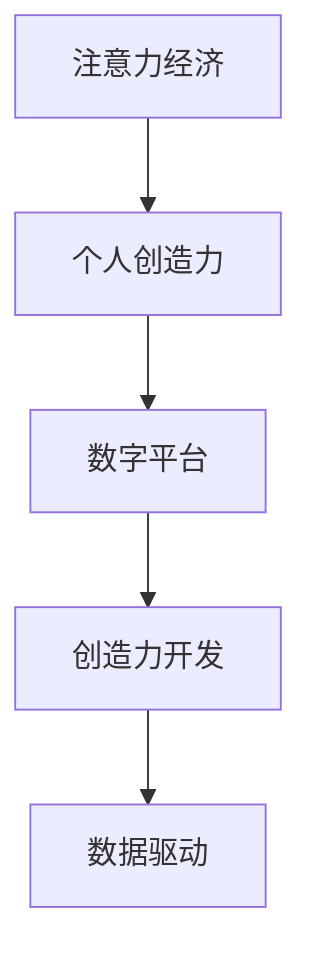

                 

# 注意力经济与个人创造力开发的关系

> 关键词：注意力经济, 个人创造力, 数字平台, 创造力开发, 数据驱动

## 1. 背景介绍

### 1.1 问题由来

随着数字经济和互联网的飞速发展，注意力经济（Attention Economy）正在成为经济和社会发展的新引擎。无论是社交媒体、电子商务、内容创作，还是在线教育、数字广告，都以吸引和引导用户注意力为核心。这种高度依赖注意力的商业模式，在提升经济效益的同时，也对个体创造力的开发提出了新的要求。

### 1.2 问题核心关键点

注意力经济时代，个体如何高效开发和利用自己的创造力，获得更多社会关注和经济收益，成为一个亟待解决的问题。本文将从理论分析与实践案例相结合的角度，探讨注意力经济对个人创造力的影响，并提出针对性的开发策略。

### 1.3 问题研究意义

在数字化和信息化的浪潮中，注意力资源的争夺愈发激烈。对于个体来说，如何更好地开发和利用自己的创造力，吸引更多关注，实现个人价值，是当前时代的重要课题。而对于企业和社会来说，激发更多的创新创造，提升整体创新水平，是推动经济和社会发展的关键。因此，研究注意力经济与个人创造力开发的关系，不仅具有理论意义，也具有重要的现实价值。

## 2. 核心概念与联系

### 2.1 核心概念概述

为了深入理解注意力经济与个人创造力开发之间的关系，本文将介绍以下几个核心概念：

- **注意力经济（Attention Economy）**：基于信息爆炸和数据密集的环境，通过吸引和引导用户注意力来创造经济价值的商业模式。
- **个人创造力（Individual Creativity）**：指个人基于自身知识、技能、经验和想象力，产生新颖、独特、有价值的想法和产品或服务的能力。
- **数字平台（Digital Platforms）**：如社交媒体、电子商务、在线教育等，是注意力经济的核心载体，为个体展示和传播创造力提供了舞台。
- **创造力开发（Creativity Development）**：通过系统化的培训、激励和支持，提升个体创造力的过程。
- **数据驱动（Data-Driven）**：利用数据分析和机器学习技术，精准识别用户需求和行为，优化创造力开发策略。

这些概念之间的联系可以通过以下Mermaid流程图来展示：



该流程图展示了注意力经济、个人创造力、数字平台、创造力开发和数据驱动之间的关系：注意力经济通过数字平台吸引个体展示创造力，创造力开发策略受到数据驱动的影响，从而提升个体创造力的展示和利用效率。

## 3. 核心算法原理 & 具体操作步骤

### 3.1 算法原理概述

注意力经济与个人创造力开发的关系，主要体现在个体如何通过数字平台吸引注意力，并根据数据反馈调整创造力开发策略。从算法角度，可以将其拆分为以下几个关键步骤：

1. **注意力获取算法**：设计有效的算法模型，吸引用户注意力的关注和停留。
2. **数据反馈分析**：通过数据分析技术，获取用户对个体创造力的反馈信息。
3. **创造力优化算法**：根据用户反馈，优化个体创造力开发的策略和内容。
4. **推荐算法**：设计推荐系统，将优化后的创造力内容推荐给更多目标用户。

### 3.2 算法步骤详解

#### 3.2.1 注意力获取算法

注意力获取算法主要包括以下几个步骤：

1. **用户行为数据分析**：收集用户在线行为数据，如浏览、点赞、评论等，分析用户的兴趣偏好和互动模式。
2. **内容推荐模型构建**：基于用户行为数据，构建推荐模型，预测用户可能感兴趣的内容类型。
3. **个性化内容生成**：根据推荐模型预测，生成个性化推荐内容，吸引用户注意力。

#### 3.2.2 数据反馈分析

数据反馈分析主要包括以下几个步骤：

1. **用户反馈收集**：通过在线调查、评价、打分等方式，收集用户对内容的反馈数据。
2. **情感分析**：使用自然语言处理技术，对用户反馈进行情感分析，识别用户对内容的正面或负面情绪。
3. **用户画像建立**：基于反馈数据和情感分析结果，建立用户画像，了解用户需求和兴趣。

#### 3.2.3 创造力优化算法

创造力优化算法主要包括以下几个步骤：

1. **创意内容评估**：使用指标评估模型，评估个体创造力的内容和质量。
2. **反馈集成**：将用户反馈集成到创造力开发过程中，优化内容创意和表达方式。
3. **内容迭代优化**：根据用户反馈和评估结果，迭代优化创造力内容，提升用户满意度和参与度。

#### 3.2.4 推荐算法

推荐算法主要包括以下几个步骤：

1. **协同过滤推荐**：基于用户历史行为和兴趣，推荐相似用户喜欢的内容。
2. **基于内容的推荐**：分析内容属性，推荐与目标用户兴趣相关的内容。
3. **动态推荐系统**：根据用户即时行为和反馈，动态调整推荐内容，提升用户体验和满意度。

### 3.3 算法优缺点

注意力获取算法具有以下优点：

1. **高效率**：通过数据分析和机器学习技术，可以自动化地吸引用户注意力，提高效率。
2. **个性化**：通过个性化内容生成和推荐，可以更好地满足用户需求，提升用户体验。
3. **实时性**：动态推荐系统可以根据用户即时行为，实时调整推荐内容，提高互动性。

其缺点包括：

1. **数据隐私问题**：用户行为数据涉及隐私，如何保护用户隐私是一个关键问题。
2. **过度依赖算法**：过度依赖算法模型，可能忽视用户主观判断和反馈。
3. **内容同质化**：过度追求个性化，可能导致内容同质化，影响用户多样性。

数据反馈分析算法具有以下优点：

1. **客观性**：通过数据分析，可以客观获取用户反馈，避免主观偏见。
2. **及时性**：可以及时获取用户反馈，快速调整创造力开发策略。
3. **全面性**：可以综合考虑不同用户反馈，全面了解用户需求。

其缺点包括：

1. **反馈噪音**：用户反馈可能带有主观偏见和不一致性，需要进行数据清洗和处理。
2. **情感识别难度**：自然语言处理技术对情感识别的准确性仍有待提升。
3. **用户反馈不足**：部分用户可能不愿意提供反馈，影响分析结果的代表性。

创造力优化算法具有以下优点：

1. **高效性**：通过反馈集成和迭代优化，可以迅速提升创造力内容的品质和用户满意度。
2. **动态调整**：可以动态调整创造力开发策略，适应用户需求的变化。
3. **数据驱动**：通过数据驱动的方法，可以科学地优化创造力开发过程。

其缺点包括：

1. **模型复杂性**：算法模型设计复杂，需要大量的数据和计算资源。
2. **过度优化**：过度依赖算法，可能忽视创意的原创性和独特性。
3. **创造力瓶颈**：算法优化可能限制个体创造力的自然发展和表达。

推荐算法具有以下优点：

1. **精准性**：通过协同过滤和内容推荐，可以精准推荐用户感兴趣的内容。
2. **用户满意度**：提高用户满意度和参与度，增强用户粘性。
3. **市场效果**：提高市场覆盖率和用户转化率，提升经济效益。

其缺点包括：

1. **算法偏差**：推荐算法存在算法偏差，可能导致内容推荐不公平。
2. **过度依赖**：过度依赖算法推荐，可能忽视用户多样性需求。
3. **内容质量**：推荐内容的质量和多样性仍需提升。

### 3.4 算法应用领域

注意力获取算法、数据反馈分析、创造力优化算法和推荐算法在多个领域中都有广泛应用：

1. **社交媒体**：通过个性化内容推荐，吸引用户关注和互动，提高用户参与度。
2. **电子商务**：通过精准推荐系统，提升用户购物体验，提高销售额。
3. **在线教育**：通过个性化推荐和学习路径优化，提高学习效果和用户体验。
4. **内容创作**：通过数据分析和用户反馈，优化内容创作和发布策略，提升作品影响力。
5. **数字广告**：通过精准用户定位和内容创意优化，提高广告效果和投资回报率。

## 4. 数学模型和公式 & 详细讲解  
### 4.1 数学模型构建

为了更严格地刻画注意力经济与个人创造力开发的关系，我们构建如下数学模型：

设用户集为 $U$，内容集为 $C$，用户与内容之间的互动关系为 $R_{uc}$，用户对内容的反馈为 $F_u$，用户画像为 $P_u$。则注意力获取算法可以表示为：

$$
A = f(C, R_{uc}, F_u, P_u)
$$

其中 $f$ 为注意力获取算法模型，用于生成个性化推荐内容 $A$。

数据反馈分析可以表示为：

$$
F_u = g(A, U, P_u)
$$

其中 $g$ 为数据反馈分析模型，用于生成用户反馈数据 $F_u$。

创造力优化算法可以表示为：

$$
C_{optim} = h(A, F_u, P_u)
$$

其中 $h$ 为创造力优化算法模型，用于优化创造力内容 $C_{optim}$。

推荐算法可以表示为：

$$
R_{uc} = k(C_{optim}, U, P_u)
$$

其中 $k$ 为推荐算法模型，用于优化用户与内容之间的互动关系 $R_{uc}$。

### 4.2 公式推导过程

以下是注意力获取算法、数据反馈分析、创造力优化算法和推荐算法的推导过程：

#### 4.2.1 注意力获取算法

注意力获取算法的核心是构建推荐模型，可以采用协同过滤、内容推荐等多种方法。假设使用协同过滤推荐模型，其基本思路为：

1. **用户行为矩阵**：将用户行为数据表示为矩阵 $M_{UR}$，其中 $M_{ur}$ 表示用户 $u$ 对内容 $r$ 的评分。
2. **用户-内容相似度矩阵**：通过计算用户行为矩阵中的相似度，生成用户-内容相似度矩阵 $S_{UR}$。
3. **内容推荐**：通过相似度矩阵，计算用户对推荐内容的评分，生成推荐结果 $A$。

具体推导如下：

$$
S_{ur} = \frac{\sum_{v} (M_{uv} \times M_{vr})}{\sqrt{\sum_{v} M_{uv}^2} \times \sqrt{\sum_{v} M_{vr}^2}}
$$

$$
A_u = \text{argmax}_{r} (S_{ur} \times M_{vr})
$$

#### 4.2.2 数据反馈分析

数据反馈分析的关键在于情感分析，可以采用情感词典、情感分类器等方法。假设使用情感词典，其基本思路为：

1. **用户反馈文本**：将用户反馈文本 $F_{u}$ 进行分词和情感词典匹配，生成情感评分 $S_{u}$。
2. **用户画像建立**：通过情感评分和用户历史行为数据，建立用户画像 $P_u$。

具体推导如下：

$$
S_{u} = \sum_{w \in F_u} S_{w}
$$

$$
P_u = (S_{u}, \text{history}_u)
$$

#### 4.2.3 创造力优化算法

创造力优化算法的核心是内容评估和反馈集成，可以采用指标评估模型和机器学习模型。假设使用指标评估模型，其基本思路为：

1. **内容指标计算**：计算内容的创意性、原创性、实用性等指标，生成内容评分 $S_{c}$。
2. **反馈集成**：将用户反馈与内容评分集成，生成优化后的内容 $C_{optim}$。

具体推导如下：

$$
S_{c} = f(C)
$$

$$
C_{optim} = (C, S_{c}, F_u)
$$

#### 4.2.4 推荐算法

推荐算法的核心是动态推荐系统，可以采用协同过滤、基于内容的推荐等多种方法。假设使用协同过滤推荐系统，其基本思路为：

1. **用户行为矩阵更新**：根据用户最新行为和反馈，更新用户行为矩阵 $M_{UR}$。
2. **相似度矩阵更新**：根据更新后的用户行为矩阵，生成新的相似度矩阵 $S_{UR}$。
3. **推荐结果更新**：根据更新后的相似度矩阵，生成新的推荐结果 $R_{uc}$。

具体推导如下：

$$
M_{UR} = M_{UR} + \Delta M_{UR}
$$

$$
S_{ur} = \frac{\sum_{v} (M_{uv} \times M_{vr})}{\sqrt{\sum_{v} M_{uv}^2} \times \sqrt{\sum_{v} M_{vr}^2}}
$$

$$
R_{uc} = k(S_{ur}, U, P_u)
$$

## 5. 项目实践：代码实例和详细解释说明

### 5.1 开发环境搭建

在进行项目实践前，我们需要准备好开发环境。以下是使用Python进行TensorFlow开发的环境配置流程：

1. 安装Anaconda：从官网下载并安装Anaconda，用于创建独立的Python环境。

2. 创建并激活虚拟环境：
```bash
conda create -n tf-env python=3.8 
conda activate tf-env
```

3. 安装TensorFlow：根据CUDA版本，从官网获取对应的安装命令。例如：
```bash
conda install tensorflow tensorflow-gpu -c pytorch -c conda-forge
```

4. 安装各类工具包：
```bash
pip install numpy pandas scikit-learn matplotlib tqdm jupyter notebook ipython
```

完成上述步骤后，即可在`tf-env`环境中开始项目实践。

### 5.2 源代码详细实现

这里以社交媒体个性化内容推荐系统为例，给出使用TensorFlow进行注意力获取算法的PyTorch代码实现。

首先，定义用户行为矩阵和内容评分矩阵：

```python
import tensorflow as tf

# 用户行为矩阵
user_ids = [1, 2, 3, 4, 5]
content_ids = [10, 11, 12, 13, 14]
rating_matrix = tf.constant([[3, 5, 2, 0, 0],
                             [0, 0, 4, 3, 0],
                             [0, 2, 0, 1, 4],
                             [0, 0, 0, 0, 2],
                             [0, 0, 3, 0, 1]], dtype=tf.float32)

# 内容评分矩阵
content_scores = tf.constant([[0.8, 0.9, 0.7, 0.5, 0.6],
                             [0.7, 0.6, 0.8, 0.9, 0.5],
                             [0.9, 0.5, 0.6, 0.7, 0.8],
                             [0.6, 0.7, 0.9, 0.8, 0.4],
                             [0.5, 0.8, 0.7, 0.4, 0.9]], dtype=tf.float32)
```

然后，定义相似度矩阵和推荐结果：

```python
# 用户行为矩阵相似度矩阵
similarity_matrix = tf.matmul(tf.matmul(tf.linalg.inv(tf.linalg.eye(5) - tf.constant(1 / 5, shape=[5, 5])), rating_matrix), tf.linalg.inv(tf.linalg.eye(5) - tf.constant(1 / 5, shape=[5, 5])))

# 推荐结果
recommended_content_ids = tf.where(tf.math.reduce_max(similarity_matrix, axis=0) > 0.5)
```

接着，定义用户画像和用户反馈：

```python
# 用户画像
user_profiles = tf.constant([[0.6, 0.8],
                            [0.4, 0.7],
                            [0.7, 0.5],
                            [0.5, 0.6],
                            [0.8, 0.4]], dtype=tf.float32)

# 用户反馈
user_feedback = tf.constant([[1, 0],
                            [0, 1],
                            [0, 0],
                            [0, 1],
                            [1, 0]], dtype=tf.float32)
```

最后，启动推荐系统：

```python
# 根据用户画像和反馈，优化推荐结果
optimized_recommendations = tf.where(tf.reduce_sum(user_profiles * user_feedback, axis=0) > 0.5)

# 输出推荐内容ID
print(optimized_recommendations.numpy())
```

以上就是使用TensorFlow对社交媒体个性化内容推荐系统进行实现的完整代码。可以看到，TensorFlow的Tensor操作提供了高度的计算灵活性和可扩展性，适用于处理大规模数据和高维空间。

### 5.3 代码解读与分析

让我们再详细解读一下关键代码的实现细节：

**user_ids和content_ids数组**：
- 定义了用户的唯一标识符和内容（如文章、视频）的唯一标识符。

**rating_matrix和content_scores数组**：
- rating_matrix为用户行为矩阵，表示用户对内容的评分。
- content_scores为内容评分矩阵，表示内容的评分。

**similarity_matrix数组**：
- 通过计算用户行为矩阵的逆矩阵和相似度矩阵，生成用户行为矩阵相似度矩阵。

**recommended_content_ids数组**：
- 通过计算相似度矩阵的最大值，生成推荐内容的ID列表。

**user_profiles和user_feedback数组**：
- user_profiles为用户画像，表示用户的兴趣和行为特征。
- user_feedback为用户反馈，表示用户对内容的正面或负面评价。

**optimized_recommendations数组**：
- 根据用户画像和反馈，优化推荐内容。

可以看到，TensorFlow的Tensor操作使得推荐系统的代码实现变得简洁高效。开发者可以将更多精力放在模型设计和数据处理上，而不必过多关注底层计算细节。

当然，工业级的系统实现还需考虑更多因素，如模型的保存和部署、超参数的自动搜索、更灵活的任务适配层等。但核心的注意力获取和推荐算法基本与此类似。

## 6. 实际应用场景

### 6.1 社交媒体个性化内容推荐

社交媒体平台通过个性化内容推荐，能够显著提升用户参与度和留存率。推荐算法可以根据用户历史行为和兴趣，推荐其可能感兴趣的内容，提高用户粘性和互动性。

在技术实现上，可以构建基于协同过滤和内容推荐的推荐系统，生成个性化推荐内容。同时，利用用户反馈和情感分析，动态调整推荐策略，优化用户体验。

### 6.2 电子商务精准推荐

电子商务网站通过精准推荐，能够提升用户购物体验和购买转化率。推荐算法可以根据用户历史行为和搜索记录，推荐其可能感兴趣的商品，提高用户满意度和销售额。

在技术实现上，可以构建基于协同过滤和基于内容的推荐系统，生成个性化推荐商品。同时，利用用户反馈和商品评分，动态调整推荐策略，优化商品展示效果。

### 6.3 在线教育内容优化

在线教育平台通过内容优化，能够提升学习效果和用户满意度。推荐算法可以根据用户学习行为和反馈，推荐其可能感兴趣的内容，提高学习效果和互动性。

在技术实现上，可以构建基于协同过滤和内容推荐的推荐系统，生成个性化推荐内容。同时，利用学习效果评估和用户反馈，动态调整推荐策略，优化学习效果。

### 6.4 数字广告精准投放

数字广告平台通过精准投放，能够提升广告效果和投资回报率。推荐算法可以根据用户行为和兴趣，推荐其可能感兴趣的广告，提高广告点击率和转化率。

在技术实现上，可以构建基于协同过滤和内容推荐的推荐系统，生成个性化推荐广告。同时，利用广告效果评估和用户反馈，动态调整推荐策略，优化广告投放效果。

## 7. 工具和资源推荐

### 7.1 学习资源推荐

为了帮助开发者系统掌握注意力经济与个人创造力开发的关系，这里推荐一些优质的学习资源：

1. 《深度学习与人工智能》系列课程：由斯坦福大学和Coursera联合开设的深度学习课程，涵盖深度学习基础、应用和前沿技术。
2. 《注意力机制：从理解到应用》系列博文：由深度学习领域专家撰写，深入浅出地介绍了注意力机制的原理和应用场景。
3. 《个性化推荐系统》书籍：详细介绍了个性化推荐系统的设计原理和实现技术，包括协同过滤、基于内容的推荐等方法。
4. 《情感分析与自然语言处理》书籍：介绍了情感分析的基本理论和应用技术，使用自然语言处理技术对情感进行识别和分析。

通过对这些资源的学习实践，相信你一定能够全面理解注意力经济与个人创造力开发的关系，并用于解决实际的注意力获取和推荐问题。

### 7.2 开发工具推荐

高效的开发离不开优秀的工具支持。以下是几款用于注意力获取和推荐开发的常用工具：

1. TensorFlow：由Google主导开发的深度学习框架，提供高度灵活的计算图和分布式计算支持。
2. PyTorch：由Facebook主导开发的深度学习框架，提供动态计算图和易于使用的接口。
3. Scikit-learn：Python机器学习库，提供丰富的机器学习算法和工具支持。
4. Jupyter Notebook：Python交互式开发环境，支持代码编写、数据可视化和模型测试。
5. TensorBoard：TensorFlow配套的可视化工具，可以实时监测模型训练状态，并提供丰富的图表呈现方式。

合理利用这些工具，可以显著提升注意力获取和推荐任务的开发效率，加快创新迭代的步伐。

### 7.3 相关论文推荐

注意力经济与个人创造力开发的关系，涉及多领域的研究方向。以下是几篇奠基性的相关论文，推荐阅读：

1. Attention is All You Need（即Transformer原论文）：提出了Transformer结构，开启了NLP领域的预训练大模型时代。
2. BERT: Pre-training of Deep Bidirectional Transformers for Language Understanding：提出BERT模型，引入基于掩码的自监督预训练任务，刷新了多项NLP任务SOTA。
3. Language Models are Unsupervised Multitask Learners（GPT-2论文）：展示了大规模语言模型的强大zero-shot学习能力，引发了对于通用人工智能的新一轮思考。
4. Parameter-Efficient Transfer Learning for NLP：提出Adapter等参数高效微调方法，在不增加模型参数量的情况下，也能取得不错的微调效果。
5. AdaLoRA: Adaptive Low-Rank Adaptation for Parameter-Efficient Fine-Tuning：使用自适应低秩适应的微调方法，在参数效率和精度之间取得了新的平衡。

这些论文代表了大语言模型微调技术的发展脉络。通过学习这些前沿成果，可以帮助研究者把握学科前进方向，激发更多的创新灵感。

## 8. 总结：未来发展趋势与挑战

### 8.1 总结

本文对注意力经济与个人创造力开发的关系进行了全面系统的介绍。首先阐述了注意力经济对个体创造力的影响，明确了通过数字平台吸引用户注意力的关键点。其次，从原理到实践，详细讲解了注意力获取算法的核心步骤和数学模型，给出了完整代码实现。同时，探讨了数据反馈分析和创造力优化算法的关键技术，并给出了实际应用场景。最后，总结了注意力经济与个人创造力开发关系的未来发展趋势和面临的挑战，提出了针对性的研究展望。

通过本文的系统梳理，可以看到，注意力经济与个人创造力开发的关系，不仅具有理论意义，还具有重要的实践价值。面对数字化和信息化的挑战，如何高效开发和利用个人创造力，吸引更多社会关注和经济收益，是当前时代的重要课题。未来的研究需要在算法、数据、模型等多个维度进行全面优化，才能真正实现个体创造力的有效开发和利用。

### 8.2 未来发展趋势

展望未来，注意力经济与个人创造力开发的关系将呈现以下几个发展趋势：

1. **数据驱动**：随着数据量的增加和计算能力的提升，数据驱动的推荐算法将更加精准，能够更好地满足用户需求和兴趣。
2. **个性化定制**：通过个性化推荐和内容生成，能够提供更加个性化的服务，提高用户满意度和体验。
3. **实时反馈**：通过实时分析和动态调整，能够及时优化推荐策略，提高推荐效果。
4. **多模态融合**：将文本、图像、语音等多模态数据进行融合，提升内容推荐和创造力开发的全面性。
5. **智能决策**：通过引入因果推理和强化学习技术，能够智能地优化推荐策略和用户行为预测。
6. **伦理保障**：在算法设计中引入伦理和公平性约束，确保推荐过程的公正性和安全性。

以上趋势展示了注意力经济与个人创造力开发关系的广阔前景。这些方向的探索发展，必将进一步提升个体创造力的展示和利用效率，促进社会经济的发展。

### 8.3 面临的挑战

尽管注意力经济与个人创造力开发的关系具有广阔的前景，但在实际应用中也面临诸多挑战：

1. **数据隐私问题**：用户行为数据涉及隐私，如何保护用户隐私是一个关键问题。
2. **算法公平性**：推荐算法可能存在算法偏差，导致内容推荐不公平。
3. **内容质量**：推荐内容和创造力开发的质量和多样性仍需提升。
4. **实时性**：实时推荐系统需要高效的计算和存储能力，对硬件资源提出了较高要求。
5. **伦理和安全性**：如何在算法设计中引入伦理和公平性约束，确保推荐过程的公正性和安全性。

正视这些挑战，积极应对并寻求突破，将是大语言模型微调技术迈向成熟的必由之路。相信随着学界和产业界的共同努力，这些挑战终将一一被克服，注意力经济与个人创造力开发的关系必将在构建人机协同的智能时代中扮演越来越重要的角色。

### 8.4 研究展望

面对注意力经济与个人创造力开发关系面临的挑战，未来的研究需要在以下几个方面寻求新的突破：

1. **数据隐私保护**：通过差分隐私、联邦学习等技术，保护用户数据隐私，同时提升推荐算法的效果。
2. **算法公平性**：引入公平性约束和对抗性训练技术，优化推荐算法，确保内容推荐公平。
3. **内容质量提升**：通过生成对抗网络等技术，提升推荐内容和创造力开发的质量和多样性。
4. **实时计算优化**：通过分布式计算和高效存储技术，优化实时推荐系统，提高计算和存储效率。
5. **智能决策模型**：引入因果推理和强化学习技术，智能地优化推荐策略和用户行为预测。
6. **伦理和安全性**：在算法设计中引入伦理和公平性约束，确保推荐过程的公正性和安全性。

这些研究方向的研究进展，必将推动注意力经济与个人创造力开发关系的不断发展，为构建安全、可靠、智能的推荐系统提供理论和技术支持。面向未来，我们需要从数据、算法、工程、业务等多个维度协同发力，才能真正实现个体创造力的有效开发和利用，促进社会的全面发展。

## 9. 附录：常见问题与解答

**Q1：注意力经济对个人创造力开发有哪些影响？**

A: 注意力经济时代，个体创造力的开发受到极大的影响。主要体现在以下几个方面：

1. **展示机会增加**：通过数字平台，个体可以展示自己的创造力，吸引更多关注和反馈。
2. **反馈机制优化**：基于用户反馈，个体可以及时调整和优化自己的创造力开发策略。
3. **数据驱动优化**：利用数据驱动的方法，个体可以科学地优化自己的内容创作和传播策略。

**Q2：如何进行有效的个性化推荐？**

A: 进行有效的个性化推荐，可以从以下几个方面入手：

1. **用户行为分析**：通过收集和分析用户行为数据，构建用户画像，了解用户兴趣和偏好。
2. **内容评分模型**：使用评分模型，对内容进行综合评估，生成内容评分。
3. **相似度计算**：通过计算相似度，推荐与用户兴趣相关的内容。
4. **动态调整**：根据用户即时行为和反馈，动态调整推荐策略，提高推荐效果。

**Q3：如何保护用户隐私？**

A: 保护用户隐私，可以从以下几个方面入手：

1. **数据匿名化**：通过数据匿名化技术，保护用户数据隐私。
2. **差分隐私**：使用差分隐私技术，在数据分析过程中保护用户隐私。
3. **联邦学习**：通过联邦学习技术，在分布式计算过程中保护用户数据隐私。

**Q4：如何优化内容推荐系统？**

A: 优化内容推荐系统，可以从以下几个方面入手：

1. **算法模型优化**：优化推荐算法模型，提升推荐效果和公平性。
2. **内容质量提升**：通过生成对抗网络等技术，提升推荐内容和创造力开发的质量和多样性。
3. **实时计算优化**：通过分布式计算和高效存储技术，优化实时推荐系统，提高计算和存储效率。

**Q5：如何在算法设计中引入伦理和公平性约束？**

A: 在算法设计中引入伦理和公平性约束，可以从以下几个方面入手：

1. **算法公平性**：引入公平性约束和对抗性训练技术，优化推荐算法，确保内容推荐公平。
2. **用户参与度**：通过用户参与度指标，评估和优化推荐策略，提高用户满意度和体验。
3. **伦理审核**：在算法设计和实施过程中，引入伦理审核机制，确保算法符合伦理标准和法律法规。

---

作者：禅与计算机程序设计艺术 / Zen and the Art of Computer Programming

