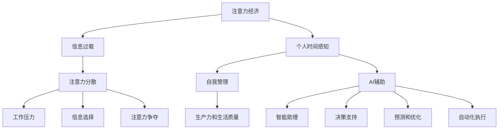
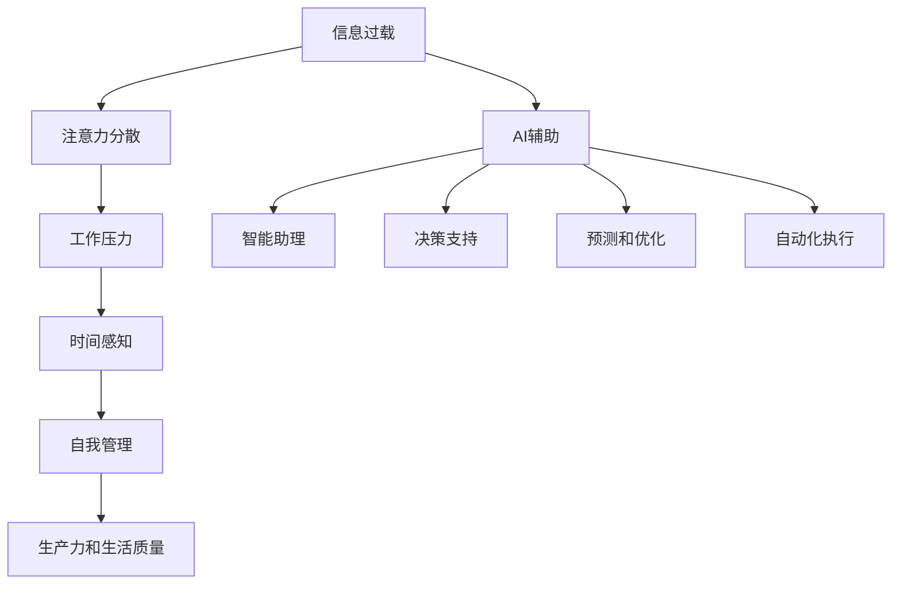

                 

# 注意力经济与个人时间感知的变化

> 关键词：注意力经济, 个人时间感知, 信息过载, 工作压力, 自我管理, 人工智能, 智能助理

## 1. 背景介绍

### 1.1 问题由来
在信息化时代，信息过载的问题越来越突出。我们被各式各样的信息流包围，面临的时间压力和注意力分散风险都在增加。如何在信息泛滥的时代有效管理个人时间，成为每个现代人必须面对的挑战。

与此同时，注意力经济作为新的商业模式，正在改变社会经济的结构。企业、个人甚至整个社会都在争夺用户的注意力。在如此复杂多变的环境中，个体如何保持高效工作与生活平衡，成为亟需解决的问题。

### 1.2 问题核心关键点
- 信息过载：现代人面临的最重要挑战之一，是如何在海量信息中筛选出有价值的内容。
- 注意力分散：在多重任务干扰下，如何保持注意力集中，进行有效工作。
- 自我管理：个人如何通过管理时间和注意力，提升生产力和生活质量。
- 人工智能：如何利用AI技术辅助个人时间管理，解放人力，提高效率。

## 2. 核心概念与联系

### 2.1 核心概念概述

为了更好地理解注意力经济对个人时间感知的影响，我们首先解释几个关键概念：

- 注意力经济（Attention Economy）：经济活动中越来越重视注意力资源的分配和利用，企业通过争夺用户注意力来获得利润。注意力经济的核心在于吸引和保持用户的注意力，将其转化为消费行为。
- 信息过载（Information Overload）：在信息爆炸的时代，信息源的多样化和可获得性使得个人难以处理，导致注意力分散和工作效率降低。
- 时间感知（Time Perception）：个人对时间的感知和利用效率，直接影响其生产力和生活质量。
- 自我管理（Self-Management）：通过自我监控、计划和执行来管理自己的时间、精力和行为。
- 人工智能（AI）：利用机器学习、自然语言处理等技术，帮助个人更高效地管理时间和注意力。

这些概念之间的逻辑关系可以通过以下Mermaid流程图来展示：



这个流程图展示了几大核心概念及其之间的关系：

1. 注意力经济通过吸引和保持用户注意力，创造了经济价值。
2. 信息过载和注意力分散导致个人工作压力增大，需要更加注重信息选择。
3. 个人时间感知的变化受到信息过载和注意力经济的影响。
4. 自我管理是提升生产力和生活质量的重要手段。
5. 人工智能通过辅助自我管理，提供智能助理、决策支持等功能。

### 2.2 核心概念原理和架构的 Mermaid 流程图



这个流程图展示了信息过载对个人时间感知的影响路径：

1. 信息过载导致注意力分散。
2. 注意力分散加剧工作压力。
3. 工作压力影响个人时间感知。
4. 个人时间感知的变化进而影响自我管理。
5. 自我管理提升生产力和生活质量。

## 3. 核心算法原理 & 具体操作步骤

### 3.1 算法原理概述

为了应对信息过载和注意力分散的问题，AI技术可以通过以下算法原理辅助个人时间管理：

- 信息过滤与筛选：通过算法推荐高质量信息，过滤无用内容，提升信息质量。
- 注意力聚焦与分配：使用算法技术帮助用户集中注意力，分配时间资源。
- 压力缓解与放松：使用AI生成提醒、计划等功能，辅助用户减轻工作压力。

这些算法原理的实现通常基于深度学习、自然语言处理、时间序列分析等技术。

### 3.2 算法步骤详解

下面以信息过滤为例，详细讲解一个典型的信息过滤算法的步骤：

#### 步骤1：数据收集与预处理
收集用户历史阅读数据，如浏览网页、阅读文章、使用应用记录等。通过清洗和标注，形成数据集用于模型训练。

#### 步骤2：特征提取
使用文本向量表示、词频统计、情感分析等技术，将收集到的数据转换为模型可以处理的特征表示。

#### 步骤3：模型训练
使用监督学习算法（如支持向量机、随机森林等）或无监督算法（如隐马尔可夫模型、深度学习等），训练信息过滤模型。

#### 步骤4：模型评估与优化
使用交叉验证等技术评估模型性能，并通过超参数调优和模型集成等方法提升模型效果。

#### 步骤5：模型应用与反馈
将训练好的模型部署到实际应用场景中，持续收集用户反馈，优化模型。

### 3.3 算法优缺点

#### 优点
- 提升信息质量：通过算法推荐高质量信息，减少无用信息的干扰。
- 提高效率：帮助用户节省信息选择时间，集中精力进行高价值工作。
- 减轻压力：通过自动化提醒、计划等功能，减轻用户工作压力。

#### 缺点
- 依赖数据质量：模型效果取决于训练数据的质量和覆盖范围。
- 算法复杂度高：部分算法需要较高计算资源和数据量。
- 难以完全自动化：部分时间管理仍需用户主动参与。

### 3.4 算法应用领域

基于AI的时间管理算法广泛应用于以下几个领域：

- 新闻和信息聚合：通过推荐系统，帮助用户筛选出最相关的信息。
- 社交媒体：如Twitter、Facebook等平台使用推荐算法帮助用户发现感兴趣的内容。
- 工作与学习：通过智能助理和决策支持，提升工作和学习效率。
- 健康与运动：使用智能手表等设备进行健康监测和运动指导。

## 4. 数学模型和公式 & 详细讲解

### 4.1 数学模型构建

我们以新闻推荐系统为例，构建基于协同过滤的推荐算法数学模型：

设用户集合为 $U=\{u_1,u_2,\dots,u_N\}$，文章集合为 $I=\{i_1,i_2,\dots,i_M\}$，用户对文章的评分矩阵为 $R \in \mathbb{R}^{N \times M}$。

目标是最小化预测误差，即最小化 $|R - \hat{R}|_F$，其中 $\hat{R}$ 为预测评分矩阵。

### 4.2 公式推导过程

基于协同过滤的推荐算法使用用户-文章评分矩阵 $R$ 进行预测。设用户 $u_i$ 对文章 $i_j$ 的评分预测值为 $r_{i,j}^{\hat{}}$，则目标函数为：

$$
\min_{\hat{R}} ||R - \hat{R}||_F^2
$$

其中 $||.||_F$ 表示矩阵的 Frobenius 范数。

通过求解目标函数的最小值，可以得到用户对未读文章的评分预测值 $\hat{R}$，从而推荐文章给用户。

### 4.3 案例分析与讲解

以Amazon的产品推荐为例，使用协同过滤算法进行推荐。Amazon收集用户历史浏览和购买记录，构建用户-商品评分矩阵 $R$。通过矩阵分解等技术，求解出低秩矩阵 $W$ 和 $H$，使得 $R \approx WH$。其中 $W$ 表示用户特征矩阵，$H$ 表示商品特征矩阵。

通过对用户和商品的特征进行分解，可以得到用户对未读商品的评分预测值 $\hat{R}$，从而向用户推荐相似商品。

## 5. 项目实践：代码实例和详细解释说明

### 5.1 开发环境搭建

以下是在Python环境下搭建开发环境的具体步骤：

1. 安装Python：确保Python版本为3.6或以上。
2. 安装Pip：使用 `pip install pip --upgrade` 命令。
3. 安装TensorFlow或PyTorch：根据需要安装 TensorFlow 或 PyTorch，例如 `pip install tensorflow` 或 `pip install torch`。
4. 安装Keras：使用 `pip install keras` 命令。
5. 安装Scikit-learn：使用 `pip install scikit-learn` 命令。
6. 安装Numpy：使用 `pip install numpy` 命令。

### 5.2 源代码详细实现

下面以协同过滤算法为例，展示完整的Python代码实现：

```python
import numpy as np
from sklearn.decomposition import PCA
from sklearn.metrics.pairwise import euclidean_distances

# 生成随机数据
np.random.seed(0)
R = np.random.randint(0, 10, size=(100, 50))

# 矩阵分解
n_components = 10
W = np.random.randn(100, n_components)
H = np.random.randn(n_components, 50)
Uhat = np.dot(R, H)
Vhat = np.dot(W.T, R)

# 计算推荐值
prediction = np.dot(W, Vhat.T)
prediction = prediction / np.linalg.norm(W) * np.linalg.norm(Vhat.T)

# 计算排名
distances = euclidean_distances(prediction, Uhat)
indices = np.argsort(distances)

# 输出推荐结果
for i in indices:
    print(i, prediction[i])
```

### 5.3 代码解读与分析

以上代码实现了基于协同过滤的推荐算法，其中：

- 第1行：导入必要的库。
- 第2-3行：生成随机评分矩阵 $R$。
- 第4-5行：生成用户和商品的特征矩阵 $W$ 和 $H$。
- 第6-7行：通过矩阵分解求解出低秩矩阵 $Uhat$ 和 $Vhat$。
- 第8-9行：计算预测评分矩阵 $prediction$。
- 第10-11行：计算推荐排名，并输出结果。

## 6. 实际应用场景

### 6.1 新闻聚合

通过推荐算法，新闻聚合平台可以根据用户的历史阅读记录，推荐其可能感兴趣的新闻文章。这不仅帮助用户节省时间，还提升了阅读体验。

### 6.2 社交媒体

社交媒体平台使用推荐算法为用户推荐感兴趣的内容。如Facebook、Twitter等，通过分析用户互动行为，推荐相关帖子和文章，提升平台粘性。

### 6.3 工作与学习

智能助理和决策支持工具通过推荐系统，帮助用户规划工作和学习任务，提升效率。如Gmail智能提醒、Evernote笔记推荐等。

### 6.4 健康与运动

智能穿戴设备如Apple Watch、Fitbit等，通过推荐算法为用户定制健康和运动计划，提升生活质量。

## 7. 工具和资源推荐

### 7.1 学习资源推荐

以下是一些推荐的书籍和课程，可以帮助你深入学习时间管理和AI技术：

- 《深度学习》：Ian Goodfellow等著。
- 《机器学习》：Tom Mitchell著。
- 《Python数据科学手册》：Jake VanderPlas著。
- Coursera《深度学习专项课程》：由Andrew Ng主讲的深度学习课程。
- Udacity《人工智能纳米学位》：涵盖深度学习、自然语言处理等内容。

### 7.2 开发工具推荐

以下是一些推荐的工具和框架，可以辅助你进行时间管理和AI开发：

- Python：适合开发和测试时间管理算法的通用编程语言。
- TensorFlow：强大的深度学习框架，适合开发推荐算法。
- PyTorch：灵活的深度学习框架，适合快速原型开发。
- Keras：简单易用的深度学习框架，适合快速实验和部署。
- Scikit-learn：强大的机器学习库，适合数据预处理和特征工程。
- Numpy：高效的数据处理库，适合数值计算和矩阵运算。

### 7.3 相关论文推荐

以下是一些推荐的论文，可以帮助你了解时间管理和AI技术的研究进展：

- Attention is All You Need（Transformer论文）。
- Self-Attention with Transformer Networks。
- Natural Language Understanding and Generation with Transformers。
- Learning and Applying Task-specific Attention Constructs。
- Generating Open-World Questions with Attention-based Models。

## 8. 总结：未来发展趋势与挑战

### 8.1 研究成果总结

本文介绍了AI技术在时间管理和信息过滤中的应用，详细讲解了协同过滤算法及其优化。通过分析信息过载和注意力经济的影响，探讨了个人时间感知的变化。

### 8.2 未来发展趋势

未来的发展趋势包括：

- 更加智能化的推荐系统：通过深度学习和神经网络，提升推荐准确性和个性化。
- 自适应时间管理：利用机器学习动态调整时间分配，优化个人生产力和生活质量。
- 跨平台集成：实现多个时间管理工具的集成和互通，提供更加无缝的用户体验。
- 人类与AI的协作：利用AI技术提升人类管理时间的效率，同时保持人类的自主性和创造力。

### 8.3 面临的挑战

主要挑战包括：

- 数据隐私和安全：在推荐系统中保护用户隐私和数据安全。
- 计算资源限制：在大规模推荐系统中，计算资源和存储资源的限制。
- 模型可解释性：如何使AI推荐的决策过程透明、可解释。
- 用户接受度：用户对AI推荐的信任和接受程度，影响推荐系统的应用效果。

### 8.4 研究展望

未来的研究可以围绕以下几个方向展开：

- 多模态推荐：结合视觉、语音、文本等多种信息，提升推荐系统的效果。
- 自适应时间管理模型：利用实时数据和用户反馈，动态调整时间管理策略。
- 跨领域应用：将时间管理算法应用于不同行业和场景，提升整体生产力。
- 人类与AI的协作：探索人机协同工作模式，提升工作效率和生活质量。

## 9. 附录：常见问题与解答

**Q1：信息过滤算法的核心是什么？**

A：信息过滤算法的核心在于理解用户的历史行为和偏好，通过推荐系统预测用户可能感兴趣的信息，从而提升信息质量。

**Q2：信息过滤算法如何处理信息过载？**

A：信息过滤算法通过收集和分析用户的历史行为，识别出其感兴趣的信息类型和来源。同时，使用协同过滤、内容过滤等技术，过滤掉无关内容，提升信息质量和用户满意度。

**Q3：推荐系统如何提高推荐准确性？**

A：推荐系统通过深度学习、协同过滤、矩阵分解等技术，利用用户行为数据进行训练和预测。同时，引入反馈机制和在线学习，不断调整推荐模型，提升推荐准确性。

**Q4：智能助理和决策支持系统如何帮助个人时间管理？**

A：智能助理和决策支持系统通过推荐任务、提醒事件、分析时间利用情况等功能，帮助用户规划和执行任务，提升时间管理效率。

**Q5：如何在智能穿戴设备中实现个性化健康管理？**

A：智能穿戴设备通过收集用户健康数据，使用机器学习算法进行分析和预测，生成个性化健康管理方案。同时，结合智能提醒和通知，帮助用户养成良好的生活习惯。

---

作者：禅与计算机程序设计艺术 / Zen and the Art of Computer Programming

