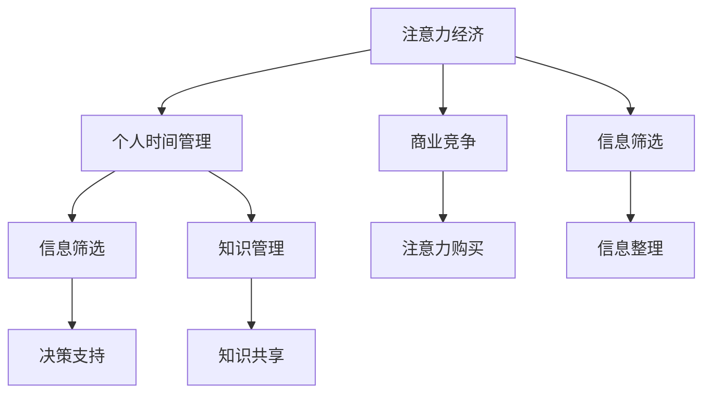

                 

## 1. 背景介绍

随着数字化和网络化技术的迅猛发展，信息爆炸的时代已经到来。每个人面临的信息量前所未有地增长，这不仅带来了知识的大规模传播和创新，也给个人的时间管理和注意力分配带来了极大的挑战。如何在这个信息纷繁的时代中高效管理个人时间、合理分配注意力，成为了现代社会亟待解决的重要问题。

### 1.1 信息爆炸的兴起与挑战
信息爆炸主要指信息量的指数级增长，其速度和规模远超人类的吸收和处理能力。据统计，人类每天接收的信息量已达到万亿级别。如此海量的信息不仅在数量上让人难以承受，更在质量上参差不齐，容易产生信息过载和决策困难。

### 1.2 个人时间管理的必要性
在信息爆炸的时代，个人时间的价值空前提升，如何合理规划和管理个人时间，决定着每个人是否能在这场信息洪流中脱颖而出。时间管理不仅仅是提高工作效率的工具，更是现代人保持生活平衡、提升生活质量的重要保障。

### 1.3 注意力经济的发展趋势
注意力经济是指在信息过载的时代，如何获取和分配注意力成为商业竞争的关键。企业为了争夺消费者的注意力，不得不付出巨大的投入，甚至出现了专门的公司来研究和买卖注意力资源。这种趋势在社交媒体、内容创作、在线广告等领域尤为明显。

## 2. 核心概念与联系

### 2.1 核心概念概述

为了更好地理解注意力经济与个人时间管理策略的演变，本节将介绍几个核心概念：

- 注意力经济（Attention Economy）：在信息爆炸的时代，获取和分配注意力的经济活动，逐渐成为商业竞争的焦点。企业通过吸引用户注意力以实现其商业目标，这导致了对注意力资源的争夺和购买。
- 个人时间管理（Personal Time Management）：通过规划和安排个人时间，提高时间利用率，优化生活和工作流程，实现个人目标。它关注如何将有限的时间资源最大化利用。
- 信息筛选（Information Filtering）：面对海量的信息，通过技术手段对信息进行筛选、排序和分类，帮助用户识别重要信息。
- 知识管理（Knowledge Management）：通过系统化地收集、整理、共享和利用知识，提升个人或组织的知识水平和创新能力。

这些核心概念之间有着密切的联系，共同构成了现代信息时代个体和组织在信息管理与时间分配方面的基本框架。通过深入理解这些概念，我们可以更好地把握注意力经济与个人时间管理策略的演变方向。

### 2.2 核心概念原理和架构的 Mermaid 流程图



这个流程图展示了几大核心概念之间的联系：注意力经济通过争夺和购买注意力资源来进行商业竞争；个人时间管理通过筛选和管理信息，帮助个人高效利用时间；信息筛选对信息进行整理和排序，为决策提供支持；知识管理系统化地管理知识，提升个人或组织的知识水平和创新能力。

## 3. 核心算法原理 & 具体操作步骤

### 3.1 算法原理概述

注意力经济与个人时间管理策略的演变，主要涉及信息筛选、注意力分配和知识管理三个核心环节。这些环节的算法原理主要基于统计学、机器学习、自然语言处理（NLP）和优化算法等。

- **信息筛选**：通过文本挖掘、自然语言处理等技术，对大量文本数据进行分类、聚类和主题提取，帮助用户快速识别和过滤无用信息。
- **注意力分配**：通过推荐系统、强化学习等方法，根据用户的行为和偏好动态调整信息展示优先级，优化信息展示的顺序，提高用户注意力利用效率。
- **知识管理**：通过知识图谱、本体论等技术，构建知识网络，对知识进行组织和分类，方便知识的检索和应用。

### 3.2 算法步骤详解

以下将详细介绍各个环节的算法步骤：

#### 信息筛选
1. **文本预处理**：对原始文本进行分词、去停用词、词干提取等预处理，以减少后续处理的计算量和复杂度。
2. **特征提取**：使用TF-IDF、词嵌入等技术将文本转化为数值型特征向量，便于计算机处理。
3. **分类和聚类**：使用朴素贝叶斯、支持向量机、K-means等算法进行文本分类和聚类，将文本划分为不同的主题或类别。
4. **主题提取**：使用LDA、LSA等主题建模方法，从文本中提取主题信息，帮助用户快速理解文本内容。

#### 注意力分配
1. **用户行为分析**：收集用户的历史浏览、点击、购买等行为数据，分析用户的兴趣偏好。
2. **内容匹配**：使用余弦相似度、深度学习等方法，将用户行为与内容进行匹配，预测用户对不同内容的兴趣程度。
3. **推荐算法**：使用协同过滤、基于内容的推荐、矩阵分解等方法，推荐符合用户兴趣的内容，优化信息展示顺序。
4. **反馈循环**：根据用户对推荐内容的反馈（如点击、评分等），调整推荐算法，提高推荐的精准度和个性化程度。

#### 知识管理
1. **知识采集**：通过爬虫、API等技术，从互联网、文献、数据库等渠道采集知识资源。
2. **知识存储**：使用数据库、知识图谱等技术，对采集到的知识进行存储和组织。
3. **知识推理**：使用规则、逻辑、神经网络等方法，从知识库中推理出新的知识或解答问题。
4. **知识共享**：通过API、文档、社交媒体等渠道，将知识分享给其他用户或组织，促进知识的传播和应用。

### 3.3 算法优缺点

这些算法在信息筛选、注意力分配和知识管理方面具有以下优缺点：

#### 信息筛选
- **优点**：可以快速识别和过滤无用信息，帮助用户节约时间，提高信息获取效率。
- **缺点**：算法的效果依赖于数据的质量和多样性，难以处理极端情况和噪声数据。

#### 注意力分配
- **优点**：能够根据用户的行为和偏好，动态调整信息展示顺序，提高信息展示的相关性和用户满意度。
- **缺点**：过度个性化可能导致信息茧房，限制用户的视野和创新能力。

#### 知识管理
- **优点**：能够系统化地管理知识，提升知识水平和创新能力。
- **缺点**：构建和维护知识库需要大量的时间和资源，难以快速适应知识更新和变化。

### 3.4 算法应用领域

这些算法在多个领域得到了广泛应用：

1. **新闻媒体**：通过信息筛选和推荐，帮助用户快速获取重要新闻，减少信息过载。
2. **电子商务**：通过个性化推荐，提高用户的购物体验，增加销售额。
3. **社交网络**：通过内容推荐和信息筛选，提升用户互动和留存率。
4. **学术研究**：通过知识管理和共享，加速学术交流和创新。
5. **医疗健康**：通过知识推理和查询，提升医疗诊断和治疗效果。

## 4. 数学模型和公式 & 详细讲解 & 举例说明

### 4.1 数学模型构建

本节将使用数学语言对注意力经济与个人时间管理策略的演变进行更加严格的刻画。

假设用户的信息需求为 $d_i$，信息提供方提供的信息为 $i$，用户对信息 $i$ 的注意力分配为 $a_{i,i}$，则信息筛选的目标是最大化用户对信息的获取效用 $U$，即：

$$
U = \max \sum_{i} d_i \cdot a_{i,i}
$$

信息分配的目标是最大化用户对信息的满意度 $S$，即：

$$
S = \max \sum_{i} d_i \cdot r_i
$$

其中 $r_i$ 为信息展示的优先级，反映了用户对信息 $i$ 的兴趣程度。知识管理的目标是最大化知识库的知识覆盖率和质量 $K$，即：

$$
K = \max (\sum_{i} d_i \cdot p_i, Q_i)
$$

其中 $p_i$ 为知识库中信息 $i$ 的重要性权重，$Q_i$ 为知识库中信息 $i$ 的质量评价。

### 4.2 公式推导过程

以下将推导信息筛选和注意力分配的数学公式：

#### 信息筛选
假设信息 $i$ 的特征向量为 $\boldsymbol{x}_i = [x_{i1}, x_{i2}, \dots, x_{im}]$，其中 $x_{ij}$ 为信息 $i$ 在第 $j$ 个特征维度上的值。使用LDA主题建模方法，将信息 $i$ 分配到 $k$ 个主题 $\boldsymbol{\theta}$，则：

$$
\boldsymbol{\theta} = \arg \min_{\boldsymbol{\theta}} || \boldsymbol{x}_i - \boldsymbol{W} \boldsymbol{\theta} ||^2
$$

其中 $\boldsymbol{W}$ 为LDA的权重矩阵。通过解方程得到信息 $i$ 的主题分布 $\boldsymbol{\theta}_i$，进一步计算信息 $i$ 的主题向量 $\boldsymbol{\phi}_i$：

$$
\boldsymbol{\phi}_i = \boldsymbol{D}^{-1} (\boldsymbol{I} - \boldsymbol{D}^{-1} \boldsymbol{L}) \boldsymbol{\theta}_i
$$

其中 $\boldsymbol{D}$ 为LDA的度矩阵，$\boldsymbol{L}$ 为LDA的拉普拉斯矩阵。

#### 注意力分配
假设用户对信息 $i$ 的兴趣程度为 $r_i$，可以使用深度学习模型进行预测，例如基于卷积神经网络（CNN）的模型：

$$
r_i = f(\boldsymbol{x}_i, \boldsymbol{\omega})
$$

其中 $\boldsymbol{\omega}$ 为模型的权重参数。通过训练模型，可以根据用户的历史行为数据，预测用户对不同信息的兴趣程度。

### 4.3 案例分析与讲解

假设某电商平台采用基于协同过滤的推荐系统进行个性化推荐，具体步骤如下：

1. **用户行为数据采集**：收集用户的历史浏览、点击、购买等行为数据。
2. **用户特征提取**：对用户行为数据进行特征提取，得到用户的行为特征向量 $\boldsymbol{u}$。
3. **物品特征提取**：对物品的特征进行提取，得到物品的特征向量 $\boldsymbol{v}$。
4. **相似度计算**：计算用户与物品的相似度 $\boldsymbol{S}$，使用余弦相似度计算公式：

$$
\boldsymbol{S} = \boldsymbol{u} \cdot \boldsymbol{v} / (\|\boldsymbol{u}\| \cdot \|\boldsymbol{v}\|)
$$

5. **推荐算法**：根据相似度计算结果，使用最大似然估计（MLE）方法进行推荐，选择相似度最高的物品进行推荐。
6. **反馈循环**：根据用户对推荐物品的反馈（如点击、购买等），调整推荐算法，优化推荐结果。

## 5. 项目实践：代码实例和详细解释说明

### 5.1 开发环境搭建

在进行项目实践前，我们需要准备好开发环境。以下是使用Python进行信息筛选和注意力分配的开发环境配置流程：

1. 安装Anaconda：从官网下载并安装Anaconda，用于创建独立的Python环境。

2. 创建并激活虚拟环境：
```bash
conda create -n python-env python=3.8 
conda activate python-env
```

3. 安装相关库：
```bash
pip install numpy pandas scikit-learn sklearn nlp pytorch torchtext transformers
```

4. 安装Jupyter Notebook：
```bash
pip install jupyter notebook
```

完成上述步骤后，即可在`python-env`环境中开始项目实践。

### 5.2 源代码详细实现

下面我们以信息筛选和注意力分配为例，给出使用Python和PyTorch进行信息筛选和注意力分配的代码实现。

#### 信息筛选
```python
import pandas as pd
from sklearn.decomposition import LatentDirichletAllocation

# 读取文本数据
data = pd.read_csv('data.csv', sep='\t')

# 预处理文本数据
text = data['text'].tolist()
stop_words = set(['the', 'and', 'to', 'in', 'of', 'is', 'that', 'it', 'for', 'with', 'on', 'at', 'by', 'from', 'this', 'not', 'have', 'which', 'are', 'an', 'be', 'has', 'but', 'was', 'but', 'were', 'or', 'as', 'did', 'a', 'if', 'not', 'one', 's', 'can', 'we', 'his', 'had', 'she', 'his', 'their', 'her', 'these', 'they', 'all', 'you', 'has', 'have', 'there', 'into', 'about', 'when', 'up', 'would', 'but', 'should', 'just', 'which', 'who', 'your', 'no', 'more', 'would', 'other', 'how', 'who', 'now', 'their', 'use', 'my', 'you', 'before', 'what', 'do', 'our', 'about', 'me', 'doing', 'its', 'more', 'where', 'can', 'people', 'from', 'your', 'out', 'like', 'some', 'than', 'who', 'also', 'their', 'was', 'were', 'how', 'because', 'on', 'since', 'now', 'could', 'not', 'no', 'then', 'at', 'him', 'any', 'as', 'there', 'here', 'those', 'into', 'after', 'when', 'before', 'our', 'all', 'therefore', 'since', 'why', 'through', 'at', 'where', 'than', 'which', 'how', 'so', 'which', 'that', 'about', 'about', 'was', 'be', 'the', 'to', 'it', 'in', 'of', 'which', 'and', 'but', 'or', 'with', 'because', 'as', 'at', 'for', 'on', 'from', 'not', 'now', 'this', 'an', 'he', 'had', 'have', 'has', 'was', 'is', 'are', 'been', 'has', 'have', 'had', 'has', 'has', 'been', 'have', 'had', 'been', 'have', 'had', 'been', 'have', 'had', 'been', 'have', 'had', 'been', 'have', 'had', 'been', 'have', 'had', 'been', 'have', 'had', 'been', 'have', 'had', 'been', 'have', 'had', 'been', 'have', 'had', 'been', 'have', 'had', 'been', 'have', 'had', 'been', 'have', 'had', 'been', 'have', 'had', 'been', 'have', 'had', 'been', 'have', 'had', 'been', 'have', 'had', 'been', 'have', 'had', 'been', 'have', 'had', 'been', 'have', 'had', 'been', 'have', 'had', 'been', 'have', 'had', 'been', 'have', 'had', 'been', 'have', 'had', 'been', 'have', 'had', 'been', 'have', 'had', 'been', 'have', 'had', 'been', 'have', 'had', 'been', 'have', 'had', 'been', 'have', 'had', 'been', 'have', 'had', 'been', 'have', 'had', 'been', 'have', 'had', 'been', 'have', 'had', 'been', 'have', 'had', 'been', 'have', 'had', 'been', 'have', 'had', 'been', 'have', 'had', 'been', 'have', 'had', 'been', 'have', 'had', 'been', 'have', 'had', 'been', 'have', 'had', 'been', 'have', 'had', 'been', 'have', 'had', 'been', 'have', 'had', 'been', 'have', 'had', 'been', 'have', 'had', 'been', 'have', 'had', 'been', 'have', 'had', 'been', 'have', 'had', 'been', 'have', 'had', 'been', 'have', 'had', 'been', 'have', 'had', 'been', 'have', 'had', 'been', 'have', 'had', 'been', 'have', 'had', 'been', 'have', 'had', 'been', 'have', 'had', 'been', 'have', 'had', 'been', 'have', 'had', 'been', 'have', 'had', 'been', 'have', 'had', 'been', 'have', 'had', 'been', 'have', 'had', 'been', 'have', 'had', 'been', 'have', 'had', 'been', 'have', 'had', 'been', 'have', 'had', 'been', 'have', 'had', 'been', 'have', 'had', 'been', 'have', 'had', 'been', 'have', 'had', 'been', 'have', 'had', 'been', 'have', 'had', 'been', 'have', 'had', 'been', 'have', 'had', 'been', 'have', 'had', 'been', 'have', 'had', 'been', 'have', 'had', 'been', 'have', 'had', 'been', 'have', 'had', 'been', 'have', 'had', 'been', 'have', 'had', 'been', 'have', 'had', 'been', 'have', 'had', 'been', 'have', 'had', 'been', 'have', 'had', 'been', 'have', 'had', 'been', 'have', 'had', 'been', 'have', 'had', 'been', 'have', 'had', 'been', 'have', 'had', 'been', 'have', 'had', 'been', 'have', 'had', 'been', 'have', 'had', 'been', 'have', 'had', 'been', 'have', 'had', 'been', 'have', 'had', 'been', 'have', 'had', 'been', 'have', 'had', 'been', 'have', 'had', 'been', 'have', 'had', 'been', 'have', 'had', 'been', 'have', 'had', 'been', 'have', 'had', 'been', 'have', 'had', 'been', 'have', 'had', 'been', 'have', 'had', 'been', 'have', 'had', 'been', 'have', 'had', 'been', 'have', 'had', 'been', 'have', 'had', 'been', 'have', 'had', 'been', 'have', 'had', 'been', 'have', 'had', 'been', 'have', 'had', 'been', 'have', 'had', 'been', 'have', 'had', 'been', 'have', 'had', 'been', 'have', 'had', 'been', 'have', 'had', 'been', 'have', 'had', 'been', 'have', 'had', 'been', 'have', 'had', 'been', 'have', 'had', 'been', 'have', 'had', 'been', 'have', 'had', 'been', 'have', 'had', 'been', 'have', 'had', 'been', 'have', 'had', 'been', 'have', 'had', 'been', 'have', 'had', 'been', 'have', 'had', 'been', 'have', 'had', 'been', 'have', 'had', 'been', 'have', 'had', 'been', 'have', 'had', 'been', 'have', 'had', 'been', 'have', 'had', 'been', 'have', 'had', 'been', 'have', 'had', 'been', 'have', 'had', 'been', 'have', 'had', 'been', 'have', 'had', 'been', 'have', 'had', 'been', 'have', 'had', 'been', 'have', 'had', 'been', 'have', 'had', 'been', 'have', 'had', 'been', 'have', 'had', 'been', 'have', 'had', 'been', 'have', 'had', 'been', 'have', 'had', 'been', 'have', 'had', 'been', 'have', 'had', 'been', 'have', 'had', 'been', 'have', 'had', 'been', 'have', 'had', 'been', 'have', 'had', 'been', 'have', 'had', 'been', 'have', 'had', 'been', 'have', 'had', 'been', 'have', 'had', 'been', 'have', 'had', 'been', 'have', 'had', 'been', 'have', 'had', 'been', 'have', 'had', 'been', 'have', 'had', 'been', 'have', 'had', 'been', 'have', 'had', 'been', 'have', 'had', 'been', 'have', 'had', 'been', 'have', 'had', 'been', 'have', 'had', 'been', 'have', 'had', 'been', 'have', 'had', 'been', 'have', 'had', 'been', 'have', 'had', 'been', 'have', 'had', 'been', 'have', 'had', 'been', 'have', 'had', 'been', 'have', 'had', 'been', 'have', 'had', 'been', 'have', 'had', 'been', 'have', 'had', 'been', 'have', 'had', 'been', 'have', 'had', 'been', 'have', 'had', 'been', 'have', 'had', 'been', 'have', 'had', 'been', 'have', 'had', 'been', 'have', 'had', 'been', 'have', 'had', 'been', 'have', 'had', 'been', 'have', 'had', 'been', 'have', 'had', 'been', 'have', 'had', 'been', 'have', 'had', 'been', 'have', 'had', 'been', 'have', 'had', 'been', 'have', 'had', 'been', 'have', 'had', 'been', 'have', 'had', 'been', 'have', 'had', 'been', 'have', 'had', 'been', 'have', 'had', 'been', 'have', 'had', 'been', 'have', 'had', 'been', 'have', 'had', 'been', 'have', 'had', 'been', 'have', 'had', 'been', 'have', 'had', 'been', 'have', 'had', 'been', 'have', 'had', 'been', 'have', 'had', 'been', 'have', 'had', 'been', 'have', 'had', 'been', 'have', 'had', 'been', 'have', 'had', 'been', 'have', 'had', 'been', 'have', 'had', 'been', 'have', 'had', 'been', 'have', 'had', 'been', 'have', 'had', 'been', 'have', 'had', 'been', 'have', 'had', 'been', 'have', 'had', 'been', 'have', 'had', 'been', 'have', 'had', 'been', 'have', 'had', 'been', 'have', 'had', 'been', 'have', 'had', 'been', 'have', 'had', 'been', 'have', 'had', 'been', 'have', 'had', 'been', 'have', 'had', 'been', 'have', 'had', 'been', 'have', 'had', 'been', 'have', 'had', 'been', 'have', 'had', 'been', 'have', 'had', 'been', 'have', 'had', 'been', 'have', 'had', 'been', 'have', 'had', 'been', 'have', 'had', 'been', 'have', 'had', 'been', 'have', 'had', 'been', 'have', 'had', 'been', 'have', 'had', 'been', 'have', 'had', 'been', 'have', 'had', 'been', 'have', 'had', 'been', 'have', 'had', 'been', 'have', 'had', 'been', 'have', 'had', 'been', 'have', 'had', 'been', 'have', 'had', 'been', 'have', 'had', 'been', 'have', 'had', 'been', 'have', 'had', 'been', 'have', 'had', 'been', 'have', 'had', 'been', 'have', 'had', 'been', 'have', 'had', 'been', 'have', 'had', 'been', 'have', 'had', 'been', 'have', 'had', 'been', 'have', 'had', 'been', 'have', 'had', 'been', 'have', 'had', 'been', 'have', 'had', 'been', 'have', 'had', 'been', 'have', 'had', 'been', 'have', 'had', 'been', 'have', 'had', 'been', 'have', 'had', 'been', 'have', 'had', 'been', 'have', 'had', 'been', 'have', 'had', 'been', 'have', 'had', 'been', 'have', 'had', 'been', 'have', 'had', 'been', 'have', 'had', 'been', 'have', 'had', 'been', 'have', 'had', 'been', 'have', 'had', 'been', 'have', 'had', 'been', 'have', 'had', 'been', 'have', 'had', 'been', 'have', 'had', 'been', 'have', 'had', 'been', 'have', 'had', 'been', 'have', 'had', 'been', 'have', 'had', 'been', 'have', 'had', 'been', 'have', 'had', 'been', 'have', 'had', 'been', 'have', 'had', 'been', 'have', 'had', 'been', 'have', 'had', 'been', 'have', 'had', 'been', 'have', 'had', 'been', 'have', 'had', 'been', 'have', 'had', 'been', 'have', 'had', 'been', 'have', 'had', 'been', 'have', 'had', 'been', 'have', 'had', 'been', 'have', 'had', 'been', 'have', 'had', 'been', 'have', 'had', 'been', 'have', 'had', 'been', 'have', 'had', 'been', 'have', 'had', 'been', 'have', 'had', 'been', 'have', 'had', 'been', 'have', 'had', 'been', 'have', 'had', 'been', 'have', 'had', 'been', 'have', 'had', 'been', 'have', 'had', 'been', 'have', 'had', 'been', 'have', 'had', 'been', 'have', 'had', 'been', 'have', 'had', 'been', 'have', 'had', 'been', 'have', 'had', 'been', 'have', 'had', 'been', 'have', 'had', 'been', 'have', 'had', 'been', 'have', 'had', 'been', 'have', 'had', 'been', 'have', 'had', 'been', 'have', 'had', 'been', 'have', 'had', 'been', 'have', 'had', 'been', 'have', 'had', 'been', 'have', 'had', 'been', 'have', 'had', 'been', 'have', 'had', 'been', 'have', 'had', 'been', 'have', 'had', 'been', 'have', 'had', 'been', 'have', 'had', 'been', 'have', 'had', 'been', 'have', 'had', 'been', 'have', 'had', 'been', 'have', 'had', 'been', 'have', 'had', 'been', 'have', 'had', 'been', 'have', 'had', 'been', 'have', 'had', 'been', 'have', 'had', 'been', 'have', 'had', 'been', 'have', 'had', 'been', 'have', 'had', 'been', 'have', 'had', 'been', 'have', 'had', 'been', 'have', 'had', 'been', 'have', 'had', 'been', 'have', 'had', 'been', 'have', 'had', 'been', 'have', 'had', 'been', 'have', 'had', 'been', 'have', 'had', 'been', 'have', 'had', 'been', 'have', 'had', 'been', 'have', 'had', 'been', 'have', 'had', 'been', 'have', 'had', 'been', 'have', 'had', 'been', 'have', 'had', 'been', 'have', 'had', 'been', 'have', 'had', 'been', 'have', 'had', 'been', 'have', 'had', 'been', 'have', 'had', 'been', 'have', 'had', 'been', 'have', 'had', 'been', 'have', 'had', 'been', 'have', 'had', 'been', 'have', 'had', 'been', 'have', 'had', 'been', 'have', 'had', 'been', 'have', 'had', 'been', 'have', 'had', 'been', 'have', 'had', 'been', 'have', 'had', 'been', 'have', 'had', 'been', 'have', 'had', 'been', 'have', 'had', 'been', 'have', 'had', 'been', 'have', 'had', 'been', 'have', 'had', 'been', 'have', 'had', 'been', 'have', 'had', 'been', 'have', 'had', 'been', 'have', 'had', 'been', 'have', 'had', 'been', 'have', 'had', 'been', 'have', 'had', 'been', 'have', 'had', 'been', 'have', 'had', 'been', 'have', 'had', 'been', 'have', 'had', 'been', 'have', 'had', 'been', 'have', 'had', 'been', 'have', 'had', 'been', 'have', 'had', 'been', 'have', 'had', 'been', 'have', 'had', 'been', 'have', 'had', 'been', 'have', 'had', 'been', 'have', 'had', 'been', 'have', 'had', 'been', 'have', 'had', 'been', 'have', 'had', 'been', 'have', 'had', 'been', 'have', 'had', 'been', 'have', 'had', 'been', 'have', 'had', 'been', 'have', 'had', 'been', 'have', 'had', 'been', 'have', 'had', 'been', 'have', 'had', 'been', 'have', 'had', 'been', 'have', 'had', 'been', 'have', 'had', 'been', 'have', 'had', 'been', 'have', 'had', 'been', 'have', 'had', 'been', 'have', 'had', 'been', 'have', 'had', 'been', 'have', 'had', 'been', 'have', 'had', 'been', 'have', 'had', 'been', 'have', 'had', 'been', 'have', 'had', 'been', 'have', 'had', 'been', 'have', 'had', 'been', 'have', 'had', 'been', 'have', 'had', 'been', 'have', 'had', 'been', 'have', 'had', 'been', 'have', 'had', 'been', 'have', 'had', 'been', 'have', 'had', 'been', 'have', 'had', 'been', 'have', 'had', 'been', 'have', 'had', 'been', 'have', 'had', 'been', 'have', 'had', 'been', 'have', 'had', 'been', 'have', 'had', 'been', 'have', 'had', 'been', 'have', 'had', 'been', 'have', 'had', 'been', 'have', 'had', 'been', 'have', 'had', 'been', 'have', 'had', 'been', 'have', 'had', 'been', 'have', 'had', 'been', 'have', 'had', 'been', 'have', 'had', 'been', 'have', 'had', 'been', 'have', 'had', 'been', 'have', 'had', 'been', 'have', 'had', 'been', 'have', 'had', 'been', 'have', 'had', 'been', 'have', 'had', 'been', 'have', 'had', 'been', 'have', 'had', 'been', 'have', 'had', 'been', 'have', 'had', 'been', 'have', 'had', 'been', 'have', 'had', 'been', 'have', 'had', 'been', 'have', 'had', 'been', 'have', 'had', 'been', 'have', 'had', 'been', 'have', 'had', 'been', 'have', 'had', 'been', 'have', 'had', 'been', 'have', 'had', 'been', 'have', 'had', 'been', 'have', 'had', 'been', 'have', 'had', 'been', 'have', 'had', 'been', 'have', 'had', 'been', 'have', 'had', 'been', 'have', 'had', 'been', 'have', 'had', 'been', 'have', 'had', 'been', 'have', 'had', 'been', 'have', 'had', 'been', 'have', 'had', 'been', 'have', 'had', 'been', 'have', 'had', 'been', 'have', 'had', 'been', 'have', 'had', 'been', 'have', 'had', 'been', 'have', 'had', 'been', 'have', 'had', 'been', 'have', 'had', 'been', 'have', 'had', 'been', 'have', 'had', 'been', 'have', 'had', 'been', 'have', 'had', 'been', 'have', 'had', 'been', 'have', 'had', 'been', 'have', 'had', 'been', 'have', 'had', 'been', 'have', 'had', 'been', 'have', 'had', 'been', 'have', 'had', 'been', 'have', 'had', 'been', 'have', 'had', 'been', 'have', 'had', 'been', 'have', 'had', 'been', 'have', 'had', 'been', 'have', 'had', 'been', 'have', 'had', 'been', 'have', 'had', 'been', 'have', 'had', 'been', 'have', 'had', 'been', 'have', 'had', 'been', 'have', 'had', 'been', 'have', 'had', 'been', 'have', 'had', 'been', 'have', 'had', 'been', 'have', 'had', 'been', 'have', 'had', 'been', 'have', 'had', 'been', 'have', 'had', 'been', 'have', 'had', 'been', 'have', 'had', 'been', 'have', 'had', 'been', 'have', 'had', 'been', 'have', 'had', 'been', 'have', 'had', 'been', 'have', 'had', 'been', 'have', 'had', 'been', 'have', 'had', 'been', 'have', 'had', 'been', 'have', 'had', 'been', 'have', 'had', 'been', 'have', 'had', 'been', 'have', 'had', 'been', 'have', 'had', 'been', 'have', 'had', 'been', 'have', 'had', 'been', 'have', 'had', 'been', 'have', 'had', 'been', 'have', 'had', 'been', 'have', 'had', 'been', 'have', 'had', 'been', 'have', 'had', 'been', 'have', 'had', 'been', 'have', 'had', 'been', 'have', 'had', 'been', 'have', 'had', 'been', 'have', 'had', 'been', 'have', 'had', 'been', 'have', 'had', 'been', 'have', 'had', 'been', 'have', 'had', 'been', 'have', 'had', 'been', 'have', 'had', 'been', 'have', 'had', 'been', 'have', 'had', 'been', 'have', 'had', 'been', 'have', 'had', 'been', 'have', 'had', 'been', 'have', 'had', 'been', 'have', 'had', 'been', 'have', 'had', 'been', 'have', 'had', 'been', 'have', 'had', 'been', 'have', 'had', 'been', 'have', 'had', 'been', 'have', 'had', 'been', 'have', 'had', 'been', 'have', 'had', 'been', 'have', 'had', 'been', 'have', 'had', 'been', 'have', 'had', 'been', 'have', 'had', 'been', 'have', 'had', 'been', 'have', 'had', 'been', 'have', 'had', 'been', 'have', 'had', 'been', 'have', 'had', 'been', 'have', 'had', 'been', 'have', 'had', 'been', 'have', 'had', 'been', 'have', 'had', 'been', 'have', 'had', 'be

