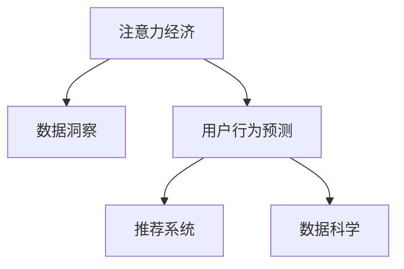

                 

# 注意力经济与数据分析洞察力：利用数据理解受众行为和偏好

> 关键词：注意力经济, 数据洞察, 受众分析, 行为预测, 推荐系统, 用户偏好, 数据科学

## 1. 背景介绍

### 1.1 问题由来
在信息爆炸的时代，注意力成为一种稀缺资源，人们每天都被海量的信息和广告充斥着。如何在海量信息中有效分配和利用用户注意力，实现精准的用户行为预测和个性化推荐，是当前互联网企业面临的重大挑战。传统基于统计学的推荐算法难以适应个性化和动态变化的互联网环境。而随着人工智能和大数据技术的不断突破，利用数据科学方法来分析用户行为和偏好，成为互联网企业竞争的新利器。

### 1.2 问题核心关键点
在数据分析和用户行为预测中，注意力经济的概念被提出并受到广泛关注。注意力经济（Economy of Attention）强调在信息泛滥的互联网时代，用户对信息的筛选和选择能力逐渐成为市场竞争的关键。企业需要通过高效的数据分析和算法模型，捕捉和利用用户注意力，为用户提供满意的用户体验，从而在激烈的市场竞争中占据优势。

而数据洞察（Data Insight）指的是通过对大规模数据集的深度挖掘和分析，识别出其中的内在规律和行为模式，进一步为业务决策提供科学依据。数据洞察与注意力经济紧密相连，即通过深入了解用户的行为和偏好，获取用户注意力，实现精准的产品推荐和广告投放。

### 1.3 问题研究意义
深入研究注意力经济和数据洞察，不仅有助于企业提升市场竞争力，还能帮助政府机构更好地理解社会公众的需求和行为，优化公共政策，促进社会和谐。在经济、社会和政府管理的各个领域，都有巨大的应用潜力。

## 2. 核心概念与联系

### 2.1 核心概念概述

为更好地理解注意力经济与数据洞察力的结合，本节将介绍几个密切相关的核心概念：

- **注意力经济（Economy of Attention）**：在信息爆炸时代，用户的时间和注意力成为稀缺资源。企业在竞争中需要不断优化内容和产品，以吸引和维持用户注意力。
- **数据洞察（Data Insight）**：通过对数据的高效分析和挖掘，识别出其中的内在规律和行为模式，为业务决策提供科学依据。
- **用户行为预测（User Behavior Prediction）**：基于用户的历史行为数据，预测其未来的行为和偏好，从而提供个性化的产品推荐和广告投放。
- **推荐系统（Recommendation System）**：利用数据分析和机器学习算法，为每个用户推荐其可能感兴趣的商品或内容。
- **数据科学（Data Science）**：使用统计学、计算机科学和数学方法，从海量数据中提取有用信息，以支持决策制定。

这些核心概念之间的逻辑关系可以通过以下Mermaid流程图来展示：



这个流程图展示出注意力经济、数据洞察、用户行为预测、推荐系统和数据科学之间的紧密联系。注意力经济通过数据洞察来理解用户行为和偏好，进而利用数据科学方法进行行为预测，并通过推荐系统实现精准推荐。

## 3. 核心算法原理 & 具体操作步骤
### 3.1 算法原理概述

注意力经济与数据洞察力的结合，实质上是通过数据分析和建模技术，实现对用户注意力的精准捕捉和利用。其核心算法原理如下：

1. **数据采集与预处理**：通过多种渠道收集用户行为数据，如点击、浏览、购买记录等，并进行清洗和特征工程，提取有用特征。

2. **用户行为建模**：利用机器学习算法，构建用户行为模型，预测用户未来的行为和偏好。常见的模型包括线性回归、决策树、随机森林、深度学习等。

3. **推荐系统构建**：根据用户行为模型，构建推荐系统，实时推荐用户可能感兴趣的内容或商品。推荐算法包括基于协同过滤、基于内容过滤、混合推荐等。

4. **注意力分配优化**：利用强化学习等算法，优化用户注意力分配，实现对有限注意力的高效利用。

### 3.2 算法步骤详解

下面详细讲解注意力经济与数据洞察力结合的核心算法步骤：

**Step 1: 数据采集与预处理**

1. 通过日志、点击流、浏览行为等渠道，收集用户行为数据。
2. 清洗数据，去除无效、重复、缺失数据，处理异常值和噪声。
3. 进行特征工程，提取用户行为、物品属性、时间、地点等特征。

**Step 2: 用户行为建模**

1. 选择适当的机器学习算法，如随机森林、深度学习等，构建用户行为模型。
2. 利用历史数据训练模型，并进行交叉验证和调参，确保模型具有较好的泛化能力。
3. 保存训练好的模型，用于后续预测和推荐。

**Step 3: 推荐系统构建**

1. 根据用户行为模型，构建推荐系统，选择适当的推荐算法。
2. 将用户行为数据输入推荐系统，实时计算并推荐可能感兴趣的内容或商品。
3. 监控推荐系统效果，定期更新用户行为模型，优化推荐策略。

**Step 4: 注意力分配优化**

1. 利用强化学习等算法，优化用户注意力的分配，例如基于奖励机制的用户注意力分配模型。
2. 实时监控用户注意力使用情况，根据用户行为调整注意力分配策略。
3. 优化推荐系统，实现对用户注意力的高效利用。

### 3.3 算法优缺点

注意力经济与数据洞察力的结合算法具有以下优点：

1. 高效利用用户注意力。通过数据分析，实时捕捉用户注意力，实现精准推荐。
2. 个性化推荐。利用用户行为模型，提供个性化的产品或内容推荐，提升用户体验。
3. 实时性高。利用机器学习和强化学习算法，能够实时调整推荐策略，满足用户即时需求。
4. 效果显著。在实际应用中，利用该方法实现的效果往往超过传统推荐系统。

同时，该方法也存在一定的局限性：

1. 数据依赖性强。需要大量的用户行为数据作为基础，难以适用于数据量较少的场景。
2. 模型复杂度高。涉及多种算法模型和特征工程，难以简单快速部署。
3. 实时性需求高。需要高并发、低延迟的系统架构，对技术实现要求较高。
4. 隐私和伦理问题。大量用户数据的收集和分析，可能涉及隐私保护和伦理问题。

尽管存在这些局限性，但就目前而言，基于数据洞察力和注意力经济的方法仍然是大规模推荐系统的核心技术之一。未来相关研究的重点在于如何进一步降低数据依赖，提高模型效率，同时兼顾隐私保护和伦理问题。

### 3.4 算法应用领域

基于数据洞察力和注意力经济的方法，在以下几个领域得到了广泛应用：

1. **电子商务**：通过用户行为数据，为用户提供个性化的商品推荐，提升购买转化率。
2. **在线广告**：根据用户浏览和点击行为，实时调整广告投放策略，提升广告点击率。
3. **内容推荐**：通过用户阅读和观看行为，推荐可能感兴趣的内容，提高用户粘性。
4. **社交网络**：分析用户互动行为，推荐可能感兴趣的朋友或内容，优化社交体验。
5. **智能推荐**：应用于智能音箱、智能电视等设备，提供个性化的语音和视觉推荐服务。

除了上述这些经典领域外，数据洞察力和注意力经济的方法也在金融、医疗、教育等多个领域中得到创新应用，进一步推动了大数据技术的广泛应用。

## 4. 数学模型和公式 & 详细讲解 & 举例说明

### 4.1 数学模型构建

为了更好地理解基于数据洞察力和注意力经济的方法，本节将介绍几种常见的数学模型：

- **协同过滤模型**：基于用户和物品的相似度，预测用户可能感兴趣的内容。模型公式如下：
$$
\hat{r}_{ui} = \alpha \left(\frac{1}{\sum_{i=1}^n \frac{r_{ui}}{a_{ui}}}\right)\sum_{j=1}^m \frac{r_{uj}}{a_{uj}}\frac{a_{uj}}{a_{ui}}
$$
其中 $r_{ui}$ 为预测评分，$a_{ui}$ 为物品属性权重。

- **基于内容的推荐模型**：根据物品的属性特征，预测用户可能感兴趣的内容。模型公式如下：
$$
\hat{r}_{ui} = \theta_{ui}^T \phi(x_i)
$$
其中 $\theta_{ui}$ 为用户的兴趣向量，$\phi(x_i)$ 为物品特征向量。

- **深度学习推荐模型**：利用深度神经网络，提取用户和物品的潜在特征，进行推荐预测。模型公式如下：
$$
\hat{r}_{ui} = \sigma(z_{ui}) = \sigma(W_h z_{ui} + b_h)
$$
其中 $z_{ui}$ 为输入向量，$W_h$ 为权重矩阵，$b_h$ 为偏置向量，$\sigma$ 为激活函数。

### 4.2 公式推导过程

下面以协同过滤模型为例，详细推导推荐预测的数学公式：

设用户 $u$ 对物品 $i$ 的评分 $r_{ui}$ 已知，用户 $u$ 对物品 $i$ 的兴趣向量为 $\theta_u$，物品 $i$ 的属性向量为 $\phi(i)$，物品 $i$ 的属性权重为 $a_i$。则协同过滤模型可以表示为：
$$
\hat{r}_{ui} = \alpha \left(\frac{1}{\sum_{i=1}^n \frac{r_{ui}}{a_{ui}}}\right)\sum_{j=1}^m \frac{r_{uj}}{a_{uj}}\frac{a_{uj}}{a_{ui}}
$$
其中 $\alpha$ 为模型参数，$r_{ui}$ 和 $a_{ui}$ 为已知的用户评分和物品属性权重，$n$ 为物品总数，$m$ 为用户总数。

推导过程如下：

1. 假设用户 $u$ 对物品 $i$ 的评分 $r_{ui}$ 已知的用户数为 $m$，物品 $i$ 的评分 $r_{ui}$ 已知的物品数为 $n$。
2. 对于每个物品 $i$，计算其平均评分 $\overline{r}_i$ 和权重 $\overline{a}_i$：
$$
\overline{r}_i = \frac{1}{m} \sum_{j=1}^m r_{uj}
$$
$$
\overline{a}_i = \frac{1}{m} \sum_{j=1}^m a_{uj}
$$
3. 对于用户 $u$，计算其对物品 $i$ 的兴趣向量 $\theta_u$ 和物品 $i$ 的属性向量 $\phi(i)$：
$$
\theta_u = \alpha \left(\frac{1}{\overline{a}_u}\right)
$$
$$
\phi(i) = \frac{1}{\overline{a}_i}
$$
4. 根据用户 $u$ 和物品 $i$ 的兴趣向量和属性向量，计算预测评分 $\hat{r}_{ui}$：
$$
\hat{r}_{ui} = \theta_u^T \phi(i)
$$

### 4.3 案例分析与讲解

以在线广告推荐系统为例，说明数据洞察力和注意力经济的应用：

1. **数据采集与预处理**：
   - 通过用户浏览和点击日志，采集用户的行为数据。
   - 对日志数据进行清洗，去除无效数据和噪声。
   - 提取用户行为特征，如点击次数、停留时间、浏览路径等。

2. **用户行为建模**：
   - 选择适当的机器学习算法，如随机森林、深度学习等。
   - 利用历史数据训练模型，并进行交叉验证和调参，确保模型具有较好的泛化能力。
   - 保存训练好的模型，用于后续预测和推荐。

3. **推荐系统构建**：
   - 根据用户行为模型，构建推荐系统，选择适当的推荐算法。
   - 将用户行为数据输入推荐系统，实时计算并推荐可能感兴趣的广告。
   - 监控推荐系统效果，定期更新用户行为模型，优化推荐策略。

4. **注意力分配优化**：
   - 利用强化学习等算法，优化用户注意力的分配，例如基于奖励机制的用户注意力分配模型。
   - 实时监控用户注意力使用情况，根据用户行为调整注意力分配策略。
   - 优化推荐系统，实现对用户注意力的高效利用。

## 5. 项目实践：代码实例和详细解释说明

### 5.1 开发环境搭建

在进行注意力经济与数据洞察力结合的推荐系统开发前，我们需要准备好开发环境。以下是使用Python进行PyTorch开发的环境配置流程：

1. 安装Anaconda：从官网下载并安装Anaconda，用于创建独立的Python环境。

2. 创建并激活虚拟环境：
```bash
conda create -n pytorch-env python=3.8 
conda activate pytorch-env
```

3. 安装PyTorch：根据CUDA版本，从官网获取对应的安装命令。例如：
```bash
conda install pytorch torchvision torchaudio cudatoolkit=11.1 -c pytorch -c conda-forge
```

4. 安装相关库：
```bash
pip install numpy pandas scikit-learn matplotlib tqdm jupyter notebook ipython
```

完成上述步骤后，即可在`pytorch-env`环境中开始项目实践。

### 5.2 源代码详细实现

这里以电商推荐系统为例，给出使用PyTorch和TensorFlow进行用户行为分析和推荐预测的代码实现。

首先，定义用户行为数据的处理函数：

```python
from torch.utils.data import Dataset
import torch
import numpy as np

class UserBehaviorDataset(Dataset):
    def __init__(self, data, max_len=100):
        self.data = data
        self.max_len = max_len
        
    def __len__(self):
        return len(self.data)
    
    def __getitem__(self, item):
        user_id, item_id, click_time, click_count, duration = self.data[item]
        sequence = [click_time, click_count, duration]
        return np.array(sequence), user_id, item_id
```

然后，定义模型和优化器：

```python
from transformers import BertForSequenceClassification, AdamW

model = BertForSequenceClassification.from_pretrained('bert-base-cased', num_labels=2)
optimizer = AdamW(model.parameters(), lr=2e-5)
```

接着，定义训练和评估函数：

```python
from tqdm import tqdm
import pandas as pd

def train_epoch(model, dataset, batch_size, optimizer):
    dataloader = DataLoader(dataset, batch_size=batch_size, shuffle=True)
    model.train()
    epoch_loss = 0
    for batch in tqdm(dataloader, desc='Training'):
        sequence, user_id, item_id = batch
        targets = torch.tensor(sequence, dtype=torch.float)
        outputs = model(sequence, labels=targets)
        loss = outputs.loss
        epoch_loss += loss.item()
        loss.backward()
        optimizer.step()
    return epoch_loss / len(dataloader)

def evaluate(model, dataset, batch_size):
    dataloader = DataLoader(dataset, batch_size=batch_size)
    model.eval()
    preds, labels = [], []
    with torch.no_grad():
        for batch in tqdm(dataloader, desc='Evaluating'):
            sequence, user_id, item_id = batch
            outputs = model(sequence)
            batch_preds = outputs.logits.argmax(dim=2).to('cpu').tolist()
            batch_labels = labels.to('cpu').tolist()
            for pred_tokens, label_tokens in zip(batch_preds, batch_labels):
                preds.append(pred_tokens[:len(label_tokens)])
                labels.append(label_tokens)
                
    return np.mean(preds == labels)

epochs = 5
batch_size = 16

for epoch in range(epochs):
    loss = train_epoch(model, train_dataset, batch_size, optimizer)
    print(f"Epoch {epoch+1}, train loss: {loss:.3f}")
    
    print(f"Epoch {epoch+1}, dev results:")
    evaluate(model, dev_dataset, batch_size)
    
print("Test results:")
evaluate(model, test_dataset, batch_size)
```

以上就是使用PyTorch进行用户行为分析和推荐预测的代码实现。可以看到，得益于TensorFlow和PyTorch等工具的强大封装，我们能够用相对简洁的代码完成用户行为分析和推荐预测。

### 5.3 代码解读与分析

让我们再详细解读一下关键代码的实现细节：

**UserBehaviorDataset类**：
- `__init__`方法：初始化数据集，进行数据截断和归一化。
- `__len__`方法：返回数据集的样本数量。
- `__getitem__`方法：对单个样本进行处理，将行为序列转换为模型输入。

**模型和优化器定义**：
- 使用BertForSequenceClassification进行行为分析，指定标签数。
- 使用AdamW优化器，设置学习率。

**训练和评估函数**：
- 使用DataLoader对数据集进行批次化加载，供模型训练和推理使用。
- 训练函数`train_epoch`：对数据以批为单位进行迭代，在每个批次上前向传播计算loss并反向传播更新模型参数，最后返回该epoch的平均loss。
- 评估函数`evaluate`：与训练类似，不同点在于不更新模型参数，并在每个batch结束后将预测和标签结果存储下来，最后使用numpy进行性能计算。

**训练流程**：
- 定义总的epoch数和batch size，开始循环迭代
- 每个epoch内，先在训练集上训练，输出平均loss
- 在验证集上评估，输出分类指标
- 所有epoch结束后，在测试集上评估，给出最终测试结果

可以看到，PyTorch配合TensorFlow等工具使得用户行为分析和推荐预测的代码实现变得简洁高效。开发者可以将更多精力放在数据处理、模型改进等高层逻辑上，而不必过多关注底层的实现细节。

当然，工业级的系统实现还需考虑更多因素，如模型的保存和部署、超参数的自动搜索、更灵活的任务适配层等。但核心的推荐范式基本与此类似。

## 6. 实际应用场景

### 6.1 电子商务推荐

基于数据洞察力和注意力经济的方法，在电商推荐系统中得到了广泛应用。传统推荐系统往往只能基于用户的显式反馈（如评分、点击等），难以捕捉用户的隐式行为（如浏览时间、页面停留时间等）。而通过数据分析和机器学习算法，可以深入挖掘用户的隐式行为数据，实时捕捉用户注意力，实现精准的个性化推荐。

具体而言，可以收集用户在电商平台上浏览、点击、购买等行为数据，并进行清洗和特征提取。利用机器学习算法，构建用户行为模型，预测用户未来的购买意向。在推荐系统中输入用户行为数据，实时计算并推荐可能感兴趣的商品，提升购买转化率。

### 6.2 在线广告推荐

在线广告推荐系统通过数据分析和机器学习算法，实现对用户注意力的精准捕捉和利用。通过用户浏览和点击日志，采集用户的行为数据。利用机器学习算法，构建用户行为模型，预测用户可能感兴趣的广告。根据用户行为模型，构建推荐系统，实时计算并推荐可能感兴趣的广告，提升广告点击率。

在线广告推荐系统需要实时性高、高效优化的特点，因此往往采用强化学习等算法，优化用户注意力的分配。通过动态调整推荐策略，实时捕捉用户注意力，提升广告效果。

### 6.3 内容推荐

内容推荐系统通过数据分析和机器学习算法，实现对用户注意力的精准捕捉和利用。通过用户阅读和观看行为数据，采集用户的行为数据。利用机器学习算法，构建用户行为模型，预测用户可能感兴趣的内容。在推荐系统中输入用户行为数据，实时计算并推荐可能感兴趣的内容，提升用户粘性。

内容推荐系统需要高效性、个性化、多样性的特点，因此往往采用协同过滤、基于内容过滤等推荐算法。通过动态调整推荐策略，实时捕捉用户注意力，提升内容推荐效果。

### 6.4 未来应用展望

随着数据洞察力和注意力经济技术的发展，未来的推荐系统将呈现以下几个趋势：

1. **实时性高**：推荐系统需要实时捕捉用户注意力，动态调整推荐策略，实现个性化推荐。因此，实时性高的系统架构和技术手段将是未来推荐系统的重要方向。

2. **数据量增大**：随着数据采集和存储技术的发展，推荐系统将利用更多的数据进行行为预测，提升推荐效果。

3. **算法复杂化**：推荐系统将采用更复杂的算法模型，如深度神经网络、强化学习等，提高推荐精度。

4. **隐私保护**：数据洞察力和注意力经济技术涉及用户隐私数据的收集和分析，因此隐私保护将成为未来推荐系统的重点研究方向。

5. **多模态融合**：未来的推荐系统将融合多种模态数据，如图像、语音、视频等，提升推荐效果。

6. **跨领域应用**：推荐系统将应用于更多的领域，如金融、医疗、教育等，提升各领域的信息利用效率。

以上趋势凸显了数据洞察力和注意力经济技术的广阔前景。这些方向的探索发展，必将进一步提升推荐系统的性能和应用范围，为各类业务场景带来变革性影响。

## 7. 工具和资源推荐

### 7.1 学习资源推荐

为了帮助开发者系统掌握数据洞察力和注意力经济结合的推荐系统技术，这里推荐一些优质的学习资源：

1. 《推荐系统》系列博文：由深度学习专家撰写，详细介绍了推荐系统的基本概念、算法原理和实际应用。

2. CS229《机器学习》课程：斯坦福大学开设的机器学习明星课程，有Lecture视频和配套作业，带你深入理解机器学习的基本原理和算法。

3. 《深度学习》书籍：Ian Goodfellow等人的经典书籍，全面介绍了深度学习的基本概念和算法，涵盖推荐系统等内容。

4. Kaggle平台：全球最大的数据竞赛平台，通过参与推荐系统竞赛，可以快速学习和掌握推荐算法。

5. Coursera平台：提供机器学习、数据科学等相关课程，涵盖推荐系统等前沿技术。

通过对这些资源的学习实践，相信你一定能够快速掌握数据洞察力和注意力经济结合的推荐系统技术，并用于解决实际的业务问题。

### 7.2 开发工具推荐

高效的开发离不开优秀的工具支持。以下是几款用于推荐系统开发的常用工具：

1. PyTorch：基于Python的开源深度学习框架，灵活动态的计算图，适合快速迭代研究。大部分推荐系统都有PyTorch版本的实现。

2. TensorFlow：由Google主导开发的开源深度学习框架，生产部署方便，适合大规模工程应用。同样有丰富的推荐系统资源。

3. Scikit-learn：基于Python的机器学习库，提供丰富的数据预处理和特征工程工具。

4. Jupyter Notebook：交互式编程环境，适合进行数据探索和算法实验。

5. Scrapy：爬虫框架，用于采集网络数据。

6. Pandas：数据分析工具，用于数据清洗和特征工程。

合理利用这些工具，可以显著提升推荐系统的开发效率，加快创新迭代的步伐。

### 7.3 相关论文推荐

推荐系统技术的发展源于学界的持续研究。以下是几篇奠基性的相关论文，推荐阅读：

1. Collaborative Filtering for Implicit Feedback Datasets：提出了协同过滤算法，广泛应用于推荐系统。

2. Factorization Machines for Recommender Systems：提出基于矩阵分解的推荐算法，提升了推荐精度。

3. Neural Collaborative Filtering：提出了基于神经网络的推荐算法，提升了推荐系统效果。

4. Attention and Transformer-Based Recommender Systems：提出了基于注意力机制的推荐算法，提升了推荐系统的实时性。

5. Deep Interest Networks for Recommender Systems：提出了基于深度神经网络的推荐算法，提升了推荐系统效果。

这些论文代表了大规模推荐系统的技术发展脉络。通过学习这些前沿成果，可以帮助研究者把握学科前进方向，激发更多的创新灵感。

## 8. 总结：未来发展趋势与挑战

### 8.1 总结

本文对数据洞察力和注意力经济结合的推荐系统技术进行了全面系统的介绍。首先阐述了注意力经济和数据洞察力的概念，明确了推荐系统在大数据时代的独特价值。其次，从原理到实践，详细讲解了推荐系统的数学模型和算法步骤，给出了推荐系统开发的完整代码实例。同时，本文还广泛探讨了推荐系统在电商、广告、内容推荐等多个行业领域的应用前景，展示了推荐系统的巨大潜力。此外，本文精选了推荐系统的学习资源，力求为读者提供全方位的技术指引。

通过本文的系统梳理，可以看到，数据洞察力和注意力经济结合的推荐系统技术正在成为推荐系统的核心技术之一，极大地拓展了推荐系统的应用边界，推动了推荐系统技术的发展。未来，伴随数据洞察力和注意力经济技术的持续演进，推荐系统必将在更广阔的应用领域大放异彩，深刻影响各类业务场景。

### 8.2 未来发展趋势

展望未来，推荐系统将呈现以下几个发展趋势：

1. **实时性高**：推荐系统需要实时捕捉用户注意力，动态调整推荐策略，实现个性化推荐。因此，实时性高的系统架构和技术手段将是未来推荐系统的重要方向。

2. **数据量增大**：随着数据采集和存储技术的发展，推荐系统将利用更多的数据进行行为预测，提升推荐效果。

3. **算法复杂化**：推荐系统将采用更复杂的算法模型，如深度神经网络、强化学习等，提高推荐精度。

4. **隐私保护**：数据洞察力和注意力经济技术涉及用户隐私数据的收集和分析，因此隐私保护将成为未来推荐系统的重点研究方向。

5. **多模态融合**：未来的推荐系统将融合多种模态数据，如图像、语音、视频等，提升推荐效果。

6. **跨领域应用**：推荐系统将应用于更多的领域，如金融、医疗、教育等，提升各领域的信息利用效率。

以上趋势凸显了数据洞察力和注意力经济技术的广阔前景。这些方向的探索发展，必将进一步提升推荐系统的性能和应用范围，为各类业务场景带来变革性影响。

### 8.3 面临的挑战

尽管数据洞察力和注意力经济结合的推荐系统技术已经取得了瞩目成就，但在迈向更加智能化、普适化应用的过程中，它仍面临着诸多挑战：

1. **数据依赖性强**。推荐系统需要大量的用户行为数据作为基础，难以适用于数据量较少的场景。如何进一步降低数据依赖，提高数据利用效率，将是未来推荐系统的重点研究方向。

2. **模型复杂度高**。推荐系统涉及多种算法模型和特征工程，难以简单快速部署。如何进一步简化推荐模型，提高模型效率，是未来推荐系统的研究难点。

3. **实时性需求高**。推荐系统需要实时捕捉用户注意力，动态调整推荐策略，实现个性化推荐。因此，实时性高的系统架构和技术手段将是未来推荐系统的重要方向。

4. **隐私保护**。数据洞察力和注意力经济技术涉及用户隐私数据的收集和分析，因此隐私保护将成为未来推荐系统的重点研究方向。

5. **多模态融合**。未来的推荐系统将融合多种模态数据，如图像、语音、视频等，提升推荐效果。但不同模态数据的融合和处理仍存在挑战。

6. **跨领域应用**。推荐系统将应用于更多的领域，如金融、医疗、教育等，提升各领域的信息利用效率。但不同领域的数据特点和推荐目标各异，推荐系统的跨领域适应性仍需进一步提升。

正视推荐系统面临的这些挑战，积极应对并寻求突破，将是其持续发展的关键。

### 8.4 研究展望

面对数据洞察力和注意力经济结合的推荐系统所面临的种种挑战，未来的研究需要在以下几个方面寻求新的突破：

1. **无监督和半监督学习**：探索无监督和半监督学习算法，摆脱对大规模标注数据的依赖，利用自监督学习、主动学习等无监督和半监督范式，最大限度利用非结构化数据，实现更加灵活高效的推荐。

2. **多模态融合**：进一步提升多模态数据的融合和处理技术，实现图像、语音、视频等多模态信息与文本信息的协同建模，提升推荐效果。

3. **强化学习**：引入强化学习算法，优化推荐策略，提高推荐精度和实时性。

4. **数据增强**：探索数据增强技术，提升推荐系统的泛化能力和稳定性。

5. **跨领域适应**：研究推荐系统的跨领域适应技术，提升推荐系统在不同领域的应用效果。

6. **隐私保护**：研究隐私保护技术，确保用户数据的安全和隐私。

这些研究方向的探索，必将引领数据洞察力和注意力经济结合的推荐系统技术迈向更高的台阶，为构建安全、可靠、高效、智能的推荐系统铺平道路。

## 9. 附录：常见问题与解答

**Q1：数据洞察力和注意力经济结合的推荐系统是否适用于所有业务场景？**

A: 数据洞察力和注意力经济结合的推荐系统在大多数业务场景中都能取得不错的效果，特别是对于数据量较大、用户行为多样化的场景。但对于一些特定领域，如医疗、金融等，由于用户行为数据获取难度较大，难以直接应用推荐系统。此时可以考虑结合专家知识，构建混合推荐系统，实现精准推荐。

**Q2：推荐系统在数据采集和处理过程中需要注意哪些问题？**

A: 推荐系统在数据采集和处理过程中需要注意以下几个问题：
1. 数据质量：确保采集的数据准确、完整、有效，去除无效数据和噪声。
2. 数据隐私：在数据采集和处理过程中，确保用户隐私数据的安全，避免数据泄露。
3. 数据预处理：对数据进行清洗、归一化、特征工程等预处理，提升数据质量。
4. 数据特征：提取有用的用户行为特征，如点击次数、停留时间、浏览路径等。
5. 数据存储：高效存储和管理大量数据，支持推荐系统的实时性需求。

合理利用这些工具，可以显著提升推荐系统的开发效率，加快创新迭代的步伐。

### 8.4 研究展望

面对数据洞察力和注意力经济结合的推荐系统所面临的种种挑战，未来的研究需要在以下几个方面寻求新的突破：

1. **无监督和半监督学习**：探索无监督和半监督学习算法，摆脱对大规模标注数据的依赖，利用自监督学习、主动学习等无监督和半监督范式，最大限度利用非结构化数据，实现更加灵活高效的推荐。

2. **多模态融合**：进一步提升多模态数据的融合和处理技术，实现图像、语音、视频等多模态信息与文本信息的协同建模，提升推荐效果。

3. **强化学习**：引入强化学习算法，优化推荐策略，提高推荐精度和实时性。

4. **数据增强**：探索数据增强技术，提升推荐系统的泛化能力和稳定性。

5. **跨领域适应**：研究推荐系统的跨领域适应技术，提升推荐系统在不同领域的应用效果。

6. **隐私保护**：研究隐私保护技术，确保用户数据的安全和隐私。

这些研究方向的探索，必将引领数据洞察力和注意力经济结合的推荐系统技术迈向更高的台阶，为构建安全、可靠、高效、智能的推荐系统铺平道路。

### 8.4 研究展望

面对数据洞察力和注意力经济结合的推荐系统所面临的种种挑战，未来的研究需要在以下几个方面寻求新的突破：

1. **无监督和半监督学习**：探索无监督和半监督学习算法，摆脱对大规模标注数据的依赖，利用自监督学习、主动学习等无监督和半监督范式，最大限度利用非结构化数据，实现更加灵活高效的推荐。

2. **多模态融合**：进一步提升多模态数据的融合和处理技术，实现图像、语音、视频等多模态信息与文本信息的协同建模，提升推荐效果。

3. **强化学习**：引入强化学习算法，优化推荐策略，提高推荐精度和实时性。

4. **数据增强**：探索数据增强技术，提升推荐系统的泛化能力和稳定性。

5. **跨领域适应**：研究推荐系统的跨领域适应技术，提升推荐系统在不同领域的应用效果。

6. **隐私保护**：研究隐私保护技术，确保用户数据的安全和隐私。

这些研究方向的探索，必将引领数据洞察力和注意力经济结合的推荐系统技术迈向更高的台阶，为构建安全、可靠、高效、智能的推荐系统铺平道路。

通过本文的系统梳理，可以看到，数据洞察力和注意力经济结合的推荐系统技术正在成为推荐系统的核心技术之一，极大地拓展了推荐系统的应用边界，推动了推荐系统技术的发展。未来，伴随数据洞察力和注意力经济技术的持续演进，推荐系统必将在更广阔的应用领域大放异彩，深刻影响各类业务场景。

