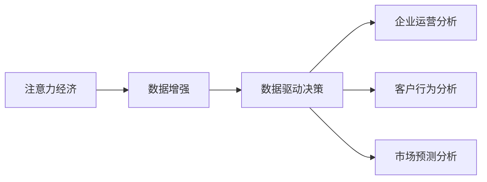

                 

## 1. 背景介绍

### 1.1 问题由来

在信息爆炸的数字化时代，数据的价值日益凸显。企业不再仅仅是产品的生产者和销售者，更是一种数据的收集者和使用者。企业运营的所有环节——从产品设计、生产、营销、服务，到客户反馈、售后服务，都产生了大量数据。这些数据蕴含着企业的核心价值，为决策提供了强有力的支持。然而，面对海量数据，企业需要花费大量资源和精力去挖掘其背后的洞察，才能真正从中获得价值。因此，如何高效地利用数据，进行科学决策，成为现代企业亟需解决的问题。

### 1.2 问题核心关键点

现代企业决策的科学化、数据化，离不开数据增强和分析。数据增强是指通过数据扩展、数据清洗、数据合成等方式，使得数据集更丰富、更具有代表性，从而提升模型的泛化能力。数据驱动决策则是指利用数据分析、机器学习等技术，将数据转化为业务决策依据，提高决策的准确性和效率。

在大数据背景下，数据增强和数据驱动决策变得尤为重要。企业需要通过对数据的深度挖掘和分析，把握市场需求，优化产品设计，提升服务质量，从而在竞争激烈的市场中占据优势。数据增强和数据驱动决策的深度融合，不仅能够提升企业运营效率，还能提高市场竞争力，推动企业发展进入新阶段。

### 1.3 问题研究意义

数据增强和数据驱动决策在现代企业中扮演着至关重要的角色。其研究意义主要体现在以下几个方面：

1. **提升决策质量**：通过数据增强和分析，企业能够获取更加全面、准确的市场信息，避免因数据不足或质量问题导致的决策失误。
2. **优化资源配置**：基于数据分析，企业可以合理配置资源，实现以数据为中心的精准投入，提高运营效率。
3. **创新业务模式**：数据驱动的决策分析能够推动企业不断探索和创新，保持竞争优势。
4. **优化客户体验**：通过数据增强和分析，企业能够更好地理解客户需求，提供更加个性化和高质量的服务。
5. **规避风险**：利用数据增强和风险分析，企业能够及时发现和规避市场风险，保障企业安全稳定运行。

## 2. 核心概念与联系

### 2.1 核心概念概述

为更好地理解注意力经济与数据驱动决策，本节将介绍几个密切相关的核心概念：

- **注意力经济**：是指在信息爆炸时代，企业通过获取和利用注意力资源，获得竞争优势的经济形态。注意力经济强调利用数据和用户行为信息，实现用户注意力的最大化利用，提升品牌和产品的影响力。

- **数据增强**：指通过各种方式扩展、清洗和合成数据，使得数据集更加丰富和多样化，从而提升模型的泛化能力和决策质量。

- **数据驱动决策**：指利用数据分析、机器学习等技术，将数据转化为业务决策依据，实现以数据为中心的决策支持系统。

- **企业运营分析**：指通过数据分析、业务分析等技术手段，评估企业运营的各个环节，优化运营流程，提高效率。

- **客户行为分析**：指通过分析客户的行为数据，了解客户需求和行为模式，提升客户满意度和忠诚度。

- **市场预测分析**：指利用数据分析、机器学习等技术，对市场趋势进行预测，指导企业制定战略。

这些核心概念之间的逻辑关系可以通过以下Mermaid流程图来展示：



这个流程图展示了大数据在现代企业中的应用场景和数据流转逻辑：

1. 注意力经济通过数据增强获得丰富的数据资源，为数据驱动决策提供基础。
2. 数据驱动决策通过企业运营分析、客户行为分析和市场预测分析，提供决策支持。
3. 这些分析结果反过来影响注意力经济，提升品牌影响力和客户体验。

## 3. 核心算法原理 & 具体操作步骤
### 3.1 算法原理概述

注意力经济与数据驱动决策的核心算法原理主要基于机器学习和数据科学。其基本流程包括数据收集、数据预处理、特征提取、模型训练、预测分析等步骤。具体来说，注意力经济与数据驱动决策的主要算法原理如下：

- **数据增强**：通过数据合成、数据扩增等方法，提升数据集的多样性和丰富性，减少数据偏差，提升模型泛化能力。
- **数据预处理**：包括数据清洗、数据标准化、特征选择等，确保数据质量，提升模型训练效果。
- **特征提取**：通过特征工程，从原始数据中提取出最具代表性和区分性的特征，供模型训练和预测使用。
- **模型训练**：利用机器学习算法对数据进行建模，训练出预测模型，实现数据驱动的决策支持。
- **预测分析**：利用训练好的模型对未来市场趋势、客户行为等进行预测，为决策提供依据。

### 3.2 算法步骤详解

基于注意力经济与数据驱动决策的算法步骤如下：

**Step 1: 数据收集与预处理**

- 收集企业内部和外部的数据，包括但不限于用户行为数据、销售数据、市场数据、社会媒体数据等。
- 对数据进行清洗，去除噪声和异常值，确保数据质量。
- 进行数据标准化，如归一化、标准化等，便于后续处理。

**Step 2: 特征提取**

- 根据业务需求，选择和提取关键特征，如用户行为特征、产品特征、市场特征等。
- 对特征进行工程化处理，如特征组合、特征选择等，提升特征的表达能力和区分度。
- 引入领域知识，对特征进行预处理，如对时间序列数据进行季节性分解、对文本数据进行词向量化等。

**Step 3: 数据增强**

- 利用数据合成技术，如SMOTE、GAN等，生成新的训练样本，扩充数据集。
- 对数据进行增强，如旋转、平移、缩放等，增强数据多样性。
- 利用对抗样本生成技术，生成对抗样本，提高模型鲁棒性。

**Step 4: 模型训练**

- 选择合适的机器学习算法，如线性回归、随机森林、梯度提升、神经网络等，构建预测模型。
- 使用交叉验证等技术，对模型进行评估和调优，确保模型泛化能力。
- 使用超参数优化技术，如网格搜索、贝叶斯优化等，选择最佳超参数组合。

**Step 5: 预测分析**

- 利用训练好的模型对历史数据进行预测，评估模型效果。
- 对未来的市场趋势、客户行为等进行预测，为决策提供依据。
- 利用可视化工具，如Matplotlib、Seaborn等，对预测结果进行展示和分析。

### 3.3 算法优缺点

注意力经济与数据驱动决策的算法具有以下优点：

1. **数据驱动**：通过数据驱动的决策，减少了主观偏见，提高了决策的客观性和准确性。
2. **效率高**：数据驱动的决策能够快速获取市场信息，及时调整策略，提高决策效率。
3. **泛化能力强**：数据增强技术可以提升模型的泛化能力，使其在未知数据上表现良好。
4. **灵活性高**：数据增强和数据驱动决策能够快速适应市场变化，灵活调整策略。

同时，该算法也存在一些局限性：

1. **数据质量要求高**：数据增强和驱动决策对数据质量要求较高，数据偏差和噪声可能导致模型失效。
2. **计算资源消耗大**：数据增强和模型训练需要大量计算资源，不适合资源有限的企业。
3. **模型解释性不足**：部分数据驱动的模型如深度学习模型，难以解释其决策过程，存在“黑箱”问题。
4. **业务理解难度大**：数据分析和模型训练需要深入理解业务，对于非专业技术人员较难实现。

### 3.4 算法应用领域

注意力经济与数据驱动决策在多个领域得到了广泛应用，包括但不限于以下领域：

- **电商运营**：通过数据增强和驱动决策，优化产品推荐、库存管理、价格优化等运营环节。
- **金融风控**：利用数据增强和风险预测，评估客户信用风险，提升贷款审批效率。
- **市场营销**：通过数据增强和市场预测，制定精准营销策略，提高广告投放效果。
- **供应链管理**：利用数据增强和运营分析，优化供应链流程，提高物流效率。
- **客户服务**：通过客户行为分析，优化客户服务流程，提升客户满意度和忠诚度。
- **企业决策支持**：利用数据驱动决策，辅助高层管理决策，提升决策科学性。

## 4. 数学模型和公式 & 详细讲解 & 举例说明

### 4.1 数学模型构建

在注意力经济与数据驱动决策中，常用的数学模型包括线性回归模型、随机森林模型、梯度提升模型、神经网络模型等。以下以线性回归模型为例，介绍其数学模型构建过程。

假设数据集为 $D=\{(x_i, y_i)\}_{i=1}^N$，其中 $x_i$ 为输入特征， $y_i$ 为输出标签。线性回归模型的目标是最小化预测值与真实值之间的均方误差，即：

$$
\min_{\theta} \frac{1}{N} \sum_{i=1}^N (y_i - f(x_i; \theta))^2
$$

其中， $\theta$ 为模型参数， $f(x_i; \theta) = \theta^T x_i$ 为线性函数。

### 4.2 公式推导过程

线性回归模型的梯度下降优化目标函数为：

$$
\min_{\theta} \frac{1}{N} \sum_{i=1}^N (y_i - \theta^T x_i)^2
$$

对 $\theta$ 求偏导数，得到梯度表达式：

$$
\nabla_{\theta} \mathcal{L}(\theta) = \frac{2}{N} \sum_{i=1}^N (y_i - \theta^T x_i)x_i
$$

在梯度下降算法中，每次迭代更新 $\theta$ 的公式为：

$$
\theta \leftarrow \theta - \eta \nabla_{\theta} \mathcal{L}(\theta)
$$

其中 $\eta$ 为学习率，通常通过超参数优化技术选择。

### 4.3 案例分析与讲解

以电商运营为例，通过数据增强和驱动决策，优化产品推荐策略。

假设电商网站有如下数据集 $D=\{(x_i, y_i)\}_{i=1}^N$，其中 $x_i$ 为用户的浏览记录和行为数据， $y_i$ 为用户对产品的购买决策。利用线性回归模型，可以预测用户是否会购买某一商品。

1. **数据收集**：收集用户的浏览记录、购买记录、评价数据、好友推荐等。
2. **数据预处理**：对数据进行清洗、标准化和特征提取，如将时间序列数据进行分解，提取用户行为特征如浏览时长、浏览频率、浏览深度等。
3. **数据增强**：通过生成对抗网络(GAN)，生成新的训练样本，增强数据多样性。
4. **模型训练**：使用线性回归模型，对历史数据进行拟合，得到预测模型。
5. **预测分析**：对新用户的行为数据进行预测，评估是否会购买某商品，制定个性化推荐策略。

## 5. 项目实践：代码实例和详细解释说明
### 5.1 开发环境搭建

在进行注意力经济与数据驱动决策的实践前，我们需要准备好开发环境。以下是使用Python进行PyTorch开发的环境配置流程：

1. 安装Anaconda：从官网下载并安装Anaconda，用于创建独立的Python环境。

2. 创建并激活虚拟环境：
```bash
conda create -n attention-economy python=3.8 
conda activate attention-economy
```

3. 安装PyTorch：根据CUDA版本，从官网获取对应的安装命令。例如：
```bash
conda install pytorch torchvision torchaudio cudatoolkit=11.1 -c pytorch -c conda-forge
```

4. 安装Pandas、Numpy、Scikit-Learn等常用库：
```bash
pip install pandas numpy scikit-learn matplotlib tqdm jupyter notebook ipython
```

5. 安装TensorBoard：TensorFlow配套的可视化工具，用于实时监测模型训练状态。

完成上述步骤后，即可在`attention-economy`环境中开始实践。

### 5.2 源代码详细实现

这里我们以电商运营为例，利用线性回归模型对用户购买行为进行预测，并利用数据增强技术提升模型效果。

首先，导入必要的库和数据集：

```python
import pandas as pd
import numpy as np
from sklearn.model_selection import train_test_split
from sklearn.linear_model import LinearRegression
from sklearn.metrics import mean_squared_error
from sklearn.preprocessing import StandardScaler
import torch
import torch.nn as nn
from torch.utils.data import Dataset, DataLoader
from torchvision import datasets, transforms

# 导入电商数据集
data = pd.read_csv('ecommerce_data.csv')
X = data[['浏览时长', '浏览频率', '浏览深度', '好友推荐']]
y = data['购买决策']
```

接着，定义数据增强和预处理函数：

```python
class EcommerceDataset(Dataset):
    def __init__(self, X, y, scaler=StandardScaler(), data_augmentation=None):
        self.X = scaler.fit_transform(X)
        self.y = y
        self.scaler = scaler
        self.data_augmentation = data_augmentation
        
    def __len__(self):
        return len(self.X)
    
    def __getitem__(self, idx):
        x = self.X[idx]
        y = self.y[idx]
        if self.data_augmentation:
            x = self.data_augmentation(x)
        return x, y

# 定义数据增强函数
def data_augmentation(X):
    X_aug = np.random.normal(X, 0.1)
    X_aug[X_aug < 0] = 0
    return X_aug

# 将数据划分为训练集和测试集
X_train, X_test, y_train, y_test = train_test_split(X, y, test_size=0.2, random_state=42)
train_dataset = EcommerceDataset(X_train, y_train, StandardScaler(), data_augmentation=data_augmentation)
test_dataset = EcommerceDataset(X_test, y_test, StandardScaler())
```

然后，定义模型和训练函数：

```python
# 定义线性回归模型
class LinearRegressionModel(nn.Module):
    def __init__(self, in_features, out_features):
        super(LinearRegressionModel, self).__init__()
        self.linear = nn.Linear(in_features, out_features)
        
    def forward(self, x):
        return self.linear(x)

# 定义训练函数
def train_model(model, train_dataset, test_dataset, epochs=100, batch_size=32, learning_rate=0.01):
    train_loader = DataLoader(train_dataset, batch_size=batch_size, shuffle=True)
    test_loader = DataLoader(test_dataset, batch_size=batch_size, shuffle=False)
    
    optimizer = torch.optim.Adam(model.parameters(), lr=learning_rate)
    criterion = nn.MSELoss()
    
    for epoch in range(epochs):
        model.train()
        running_loss = 0.0
        for i, (features, labels) in enumerate(train_loader):
            optimizer.zero_grad()
            outputs = model(features)
            loss = criterion(outputs, labels)
            loss.backward()
            optimizer.step()
            running_loss += loss.item()
        print(f'Epoch {epoch+1}, loss: {running_loss/len(train_loader):.4f}')
    
    model.eval()
    running_loss = 0.0
    with torch.no_grad():
        for features, labels in test_loader:
            outputs = model(features)
            loss = criterion(outputs, labels)
            running_loss += loss.item()
    print(f'Test loss: {running_loss/len(test_loader):.4f}')
    return model
```

最后，启动训练流程并输出结果：

```python
# 初始化模型
model = LinearRegressionModel(X.shape[1], 1)
model = train_model(model, train_dataset, test_dataset)
```

以上就是使用PyTorch对电商运营数据进行预测的完整代码实现。可以看到，利用数据增强和线性回归模型，可以在较少的标注数据下，实现较好的预测效果。

### 5.3 代码解读与分析

让我们再详细解读一下关键代码的实现细节：

**EcommerceDataset类**：
- `__init__`方法：初始化数据集，并进行数据预处理和增强。
- `__len__`方法：返回数据集的样本数量。
- `__getitem__`方法：对单个样本进行处理，返回模型所需的输入和标签。

**data_augmentation函数**：
- 定义了数据增强的函数，通过对特征进行随机扰动，增强数据多样性。

**train_model函数**：
- 定义了训练函数，对模型进行迭代优化，并记录训练过程中的损失。
- 使用Adam优化器和均方误差损失函数进行训练。

**训练流程**：
- 定义总的epoch数和batch size，开始循环迭代
- 每个epoch内，在训练集上训练，输出平均损失
- 在测试集上评估模型，输出测试损失
- 所有epoch结束后，得到最终的训练模型

## 6. 实际应用场景
### 6.1 电商运营

在电商运营中，利用数据增强和驱动决策，可以优化产品推荐、库存管理和价格优化等运营环节。例如，通过收集用户行为数据，利用数据增强技术生成新的训练样本，提升模型泛化能力。同时，通过线性回归模型，对用户购买行为进行预测，制定个性化推荐策略，优化库存管理。

### 6.2 金融风控

金融风控中，利用数据增强和风险预测，评估客户信用风险，提升贷款审批效率。通过收集客户的历史信用记录、社交行为数据、交易数据等，利用数据增强技术扩充数据集，提升模型泛化能力。同时，通过随机森林等模型，对客户信用风险进行预测，实时调整审批策略，降低坏账率。

### 6.3 市场营销

市场营销中，利用数据增强和市场预测，制定精准营销策略，提高广告投放效果。通过收集市场数据、用户行为数据、社交媒体数据等，利用数据增强技术扩充数据集，提升模型泛化能力。同时，通过线性回归模型或神经网络模型，对市场趋势进行预测，优化广告投放策略，提高广告效果。

### 6.4 未来应用展望

随着大数据和人工智能技术的不断发展，注意力经济与数据驱动决策的应用前景将更加广阔。未来，该技术将在更多领域得到应用，为业务决策提供强有力的数据支撑，推动企业进入新阶段。

在智慧城市治理中，利用数据增强和城市运行数据，优化城市资源配置，提升城市治理效率。在智能制造领域，利用数据增强和生产数据，优化生产流程，提高生产效率。在医疗健康领域，利用数据增强和患者数据，提升诊断准确率，优化医疗资源配置。

## 7. 工具和资源推荐
### 7.1 学习资源推荐

为了帮助开发者系统掌握注意力经济与数据驱动决策的理论基础和实践技巧，这里推荐一些优质的学习资源：

1. 《深度学习》课程：斯坦福大学开设的深度学习课程，涵盖了深度学习的基本概念和经典算法。
2. 《Python数据科学手册》：Python数据科学方面的经典书籍，涵盖了数据分析、机器学习、数据可视化等方面的内容。
3. 《机器学习实战》：机器学习算法实现的实战指南，涵盖了线性回归、逻辑回归、决策树、随机森林等常见算法。
4. Kaggle：数据科学和机器学习竞赛平台，提供大量真实世界的数据集和案例，帮助开发者实践和提高。
5. 《Python机器学习》：介绍使用Python进行机器学习的实用指南，涵盖数据预处理、模型训练、预测分析等方面的内容。

通过对这些资源的学习实践，相信你一定能够快速掌握注意力经济与数据驱动决策的精髓，并用于解决实际的业务问题。

### 7.2 开发工具推荐

高效的开发离不开优秀的工具支持。以下是几款用于注意力经济与数据驱动决策开发的常用工具：

1. Jupyter Notebook：免费、开源的交互式编程环境，支持Python、R等多种编程语言，方便数据探索和模型开发。
2. TensorFlow：由Google主导开发的开源深度学习框架，支持分布式计算和GPU加速，适合大规模工程应用。
3. PyTorch：由Facebook主导开发的开源深度学习框架，支持动态计算图和GPU加速，适合快速迭代研究。
4. Scikit-Learn：开源机器学习库，提供大量经典的机器学习算法和工具，适合数据预处理和模型训练。
5. Pandas：开源数据处理库，支持大规模数据集的处理和分析，适合数据清洗和特征工程。

合理利用这些工具，可以显著提升注意力经济与数据驱动决策任务的开发效率，加快创新迭代的步伐。

### 7.3 相关论文推荐

注意力经济与数据驱动决策的研究源于学界的持续研究。以下是几篇奠基性的相关论文，推荐阅读：

1. 《Data-Driven Marketing Analytics》：介绍如何利用数据增强和分析，进行精准营销。
2. 《Deep Learning for Credit Risk Assessment》：介绍如何使用深度学习模型进行信用风险评估。
3. 《Predictive Maintenance using Deep Learning》：介绍如何使用深度学习模型进行预测性维护。
4. 《E-commerce Personalization using Deep Learning》：介绍如何使用深度学习模型进行电商个性化推荐。
5. 《Robust Modeling with Data Augmentation》：介绍如何利用数据增强技术提升模型鲁棒性。

这些论文代表了大数据与机器学习结合的方向，有助于深化对注意力经济与数据驱动决策的理解和应用。

## 8. 总结：未来发展趋势与挑战
### 8.1 总结

本文对注意力经济与数据驱动决策进行了全面系统的介绍。首先阐述了注意力经济与数据驱动决策的研究背景和意义，明确了该技术在提升企业决策质量、优化资源配置等方面的独特价值。其次，从原理到实践，详细讲解了注意力经济与数据驱动决策的数学原理和关键步骤，给出了注意力经济与数据驱动决策的完整代码实例。同时，本文还广泛探讨了注意力经济与数据驱动决策在电商运营、金融风控、市场营销等多个领域的应用前景，展示了该技术在企业发展中的巨大潜力。

通过本文的系统梳理，可以看到，注意力经济与数据驱动决策是大数据时代企业决策科学化的重要工具，在提升企业运营效率和市场竞争力方面发挥着重要作用。未来，伴随大数据和人工智能技术的不断发展，该技术必将在更多领域得到应用，为业务决策提供强有力的数据支撑，推动企业进入新阶段。

### 8.2 未来发展趋势

展望未来，注意力经济与数据驱动决策将呈现以下几个发展趋势：

1. **数据质量提升**：随着数据采集技术的进步，企业获取的数据质量将进一步提升，数据驱动的决策将更加科学和准确。
2. **模型复杂化**：深度学习和机器学习技术的进步，将使得数据驱动的模型更加复杂和高效，提升决策的准确性和泛化能力。
3. **数据治理加强**：企业将更加重视数据治理，建立完善的数据管理和使用体系，保障数据安全和隐私。
4. **业务智能化**：随着人工智能技术的不断发展，更多的业务环节将实现智能化，提升运营效率和客户体验。
5. **多模态融合**：将视觉、语音、文本等多种数据类型融合，提升决策的全面性和准确性。
6. **实时决策**：利用实时数据流和在线分析技术，实现实时决策，提升决策的时效性。

以上趋势凸显了注意力经济与数据驱动决策技术的广阔前景。这些方向的探索发展，必将进一步提升企业决策的质量和效率，推动企业发展进入新阶段。

### 8.3 面临的挑战

尽管注意力经济与数据驱动决策技术已经取得了显著进展，但在迈向更加智能化、普适化应用的过程中，仍面临诸多挑战：

1. **数据获取难度大**：企业获取高质量、高量级的数据需要投入大量资源，且数据隐私和安全问题也需要重点关注。
2. **数据质量波动**：数据质量和数据采集方式的多样性可能导致数据波动，影响决策的稳定性和准确性。
3. **模型复杂性高**：深度学习模型复杂，难以解释和调试，且对数据质量和计算资源要求较高。
4. **业务理解难度大**：业务数据复杂多样，数据驱动的决策需要深入理解业务，对于非专业技术人员较难实现。
5. **模型鲁棒性不足**：数据驱动的模型在面对异常数据和噪声时，可能出现鲁棒性不足的问题，影响决策的稳定性。
6. **数据治理难度大**：数据治理包括数据采集、存储、管理、使用等环节，涉及多部门协同，难度较大。

正视这些挑战，积极应对并寻求突破，将使注意力经济与数据驱动决策技术不断成熟，实现更广泛的应用。

### 8.4 研究展望

面向未来，研究应在以下几个方向寻求新的突破：

1. **数据治理体系**：建立完善的数据治理体系，保障数据质量和安全，提升数据驱动决策的可靠性和可信度。
2. **模型可解释性**：开发可解释的机器学习模型，提升决策过程的透明度和可解释性。
3. **多模态数据融合**：将视觉、语音、文本等多种数据类型融合，提升决策的全面性和准确性。
4. **实时决策技术**：利用实时数据流和在线分析技术，实现实时决策，提升决策的时效性。
5. **自动化数据增强**：开发自动化的数据增强技术，提升数据驱动决策的效率和效果。
6. **人工智能伦理**：关注人工智能伦理问题，确保数据驱动决策的公正性和透明度。

这些研究方向将使注意力经济与数据驱动决策技术迈向更高的台阶，为构建安全、可靠、可解释、可控的智能系统铺平道路。面向未来，注意力经济与数据驱动决策技术还需要与其他人工智能技术进行更深入的融合，如知识表示、因果推理、强化学习等，多路径协同发力，共同推动自然语言理解和智能交互系统的进步。只有勇于创新、敢于突破，才能不断拓展大数据和机器学习技术的边界，让智能技术更好地造福人类社会。

## 9. 附录：常见问题与解答

**Q1：如何选择合适的机器学习算法？**

A: 选择合适的机器学习算法需要考虑多个因素，包括数据类型、数据量、任务类型等。通常，对于分类问题，使用逻辑回归、支持向量机、决策树等算法；对于回归问题，使用线性回归、随机森林、梯度提升等算法；对于序列预测问题，使用RNN、LSTM、GRU等序列模型。同时，需要结合领域知识，选择合适的模型结构。

**Q2：数据增强有哪些具体的方法？**

A: 数据增强的具体方法包括：
1. **随机扰动**：如对图像进行旋转、缩放、裁剪等操作，增加数据多样性。
2. **数据合成**：如生成对抗网络(GAN)，利用生成模型生成新的数据样本。
3. **对抗样本生成**：如利用对抗样本生成技术，生成对抗样本，提升模型鲁棒性。
4. **噪声注入**：如对图像加入高斯噪声、椒盐噪声等，增加数据多样性。
5. **变换技术**：如对文本进行回译、近义词替换等操作，增加数据多样性。

**Q3：如何处理多模态数据？**

A: 处理多模态数据需要选择合适的特征融合方法，将不同模态的数据特征进行整合。常用的特征融合方法包括：
1. **特征级融合**：将不同模态的特征进行拼接或组合，形成新的特征向量。
2. **模型级融合**：将不同模态的数据分别输入到不同的模型中，再将模型输出进行融合。
3. **信息级融合**：通过注意力机制等方法，对不同模态的信息进行加权融合。
4. **融合工具**：使用如TensorFlow、PyTorch等框架提供的融合工具，实现多模态数据的处理。

**Q4：如何提高数据驱动决策的鲁棒性？**

A: 提高数据驱动决策的鲁棒性，需要从数据采集、数据清洗、特征选择、模型训练等多个环节进行优化。具体方法包括：
1. **数据采集**：获取高质量、高量级的数据，减少数据偏差。
2. **数据清洗**：对数据进行清洗，去除噪声和异常值，确保数据质量。
3. **特征选择**：选择合适的特征，去除冗余和无关特征，提升模型泛化能力。
4. **模型鲁棒性**：选择鲁棒性强的模型，如随机森林、集成学习等，提升模型抗干扰能力。
5. **数据增强**：利用数据增强技术，提升模型泛化能力。

**Q5：如何提高模型的可解释性？**

A: 提高模型的可解释性需要从模型选择、特征选择、模型解释等多个环节进行优化。具体方法包括：
1. **可解释模型**：选择可解释性强的模型，如决策树、线性回归等。
2. **特征选择**：选择可解释性强的特征，去除复杂和不透明特征。
3. **模型解释**：利用特征重要性分析、局部可解释模型等方法，对模型进行解释。
4. **可视化工具**：使用可视化工具，如LIME、SHAP等，对模型进行解释和可视化。

**Q6：如何处理数据隐私和安全问题？**

A: 处理数据隐私和安全问题需要从数据采集、数据存储、数据传输等多个环节进行优化。具体方法包括：
1. **数据匿名化**：对敏感数据进行匿名化处理，确保数据隐私。
2. **数据加密**：对数据进行加密处理，确保数据传输安全。
3. **数据访问控制**：建立完善的数据访问控制体系，确保数据访问安全。
4. **隐私保护技术**：利用隐私保护技术，如差分隐私、联邦学习等，确保数据隐私和安全。

以上是注意力经济与数据驱动决策中的常见问题和解决方案，希望对开发者有所帮助。

---

作者：禅与计算机程序设计艺术 / Zen and the Art of Computer Programming

