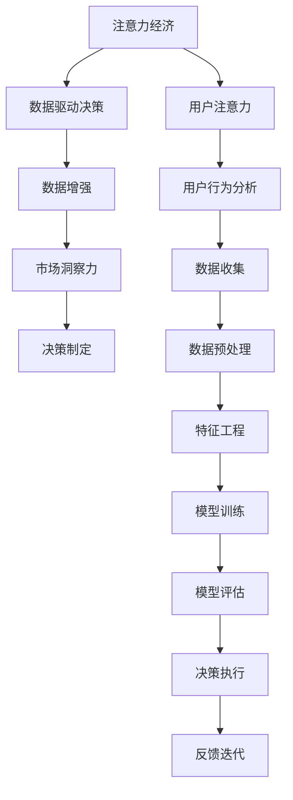

                 

# 注意力经济与数据驱动的决策制定：利用数据增强市场洞察力

> 关键词：注意力经济, 数据驱动决策, 数据增强, 市场洞察力, 用户体验, 数据管理, 营销自动化

## 1. 背景介绍

在互联网高速发展的今天，信息的海洋中包含了无限可能。如何从海量数据中提取有价值的信息，有效管理和利用数据，成为企业在激烈竞争中脱颖而出的关键。现代经济越来越依赖于数据，大数据分析、人工智能等技术的应用，使得基于数据的决策制定日益重要。

数据驱动决策（Data-Driven Decision Making），是指基于数据分析和统计结果，进行科学决策的过程。在这个过程中，注意力经济（Attention Economy）扮演了重要角色。注意力经济是指，在信息过载的时代，如何有效地吸引和维持用户注意力，以实现信息价值最大化。

本文将深入探讨如何利用数据增强（Data Augmentation）技术，提升市场洞察力，从而有效吸引和维护用户注意力，为企业的决策制定提供强有力的支持。

## 2. 核心概念与联系

### 2.1 核心概念概述

为了更好地理解数据增强在注意力经济中的应用，我们需要首先明确以下几个关键概念：

- **注意力经济（Attention Economy）**：指在信息过载的时代，企业和个人需要投入更多的时间和资源来吸引和维持用户注意力。注意力经济的核心在于用户时间的争夺。

- **数据驱动决策（Data-Driven Decision Making）**：基于数据和统计分析，而非直觉或个人经验，进行科学决策的过程。数据驱动决策能够提供客观、全面的信息支持，有助于提升决策的准确性和效率。

- **数据增强（Data Augmentation）**：通过增加训练样本的多样性和数量，提高机器学习模型的泛化能力和性能。数据增强可以显著提高模型的鲁棒性和泛化能力，使其在实际应用中表现更稳定。

- **市场洞察力（Market Insights）**：指对市场的深入了解和分析，包括市场趋势、消费者行为、竞争对手动态等，帮助企业制定更科学、更有效的市场策略。

这些概念之间存在着紧密的联系：数据增强通过提高模型的预测准确性，使得市场洞察力更可靠；而市场洞察力则指导数据增强的方向，即要增强哪些方面的数据，才能更有效地吸引和维持用户注意力。

### 2.2 核心概念原理和架构的 Mermaid 流程图



这个流程图展示了注意力经济、数据驱动决策、数据增强和市场洞察力之间的关系：

- 注意力经济依赖于用户注意力的吸引，这是企业追求的最终目标。
- 数据驱动决策是实现目标的手段，通过数据分析和模型训练，帮助企业制定决策。
- 数据增强是提升决策质量的关键技术，通过增强训练数据，提高模型准确性。
- 市场洞察力则是决策制定的基础，通过深入分析市场数据，发现用户的潜在需求。
- 用户行为分析是洞察力的来源，通过分析用户行为数据，发现用户的偏好和习惯。
- 数据收集、预处理、特征工程是数据增强的前提，通过高效的收集和处理数据，为增强提供基础。
- 模型训练和评估是数据增强的实施过程，通过不断训练和优化模型，提高数据增强的效果。
- 决策执行和反馈迭代是决策制定的实际应用，通过实时反馈调整策略，不断优化决策。

## 3. 核心算法原理 & 具体操作步骤

### 3.1 算法原理概述

数据增强（Data Augmentation）技术通过生成新的训练样本，提高模型对噪声和不确定性的容忍度，从而增强模型的泛化能力。在注意力经济中，数据增强不仅限于图像、文本等传统领域，还可以扩展到用户行为数据、市场数据等，帮助企业更好地理解和预测用户需求，从而制定更有针对性的策略。

具体而言，数据增强可以包括但不限于：

- **用户行为增强**：通过模拟用户行为，增加训练样本的多样性，如点击率模拟、浏览时间预测等。
- **市场数据增强**：通过生成或合成市场数据，增加对市场动态的理解，如竞争对手分析、消费者偏好预测等。
- **内容数据增强**：通过增加或变换文本、图片等内容，提高模型的鲁棒性和泛化能力，如文本替换、图片旋转等。

### 3.2 算法步骤详解

数据增强在注意力经济中的应用，可以分为以下几个关键步骤：

**Step 1: 数据收集与预处理**
- 收集用户行为数据、市场数据、内容数据等，进行数据清洗和预处理。
- 对数据进行特征提取和标注，使其适合进行增强处理。

**Step 2: 设计数据增强策略**
- 根据具体应用场景，设计合适的数据增强策略，如用户行为模拟、市场数据生成、内容变换等。
- 考虑增强后的数据对模型的影响，选择合适的增强方法，如旋转、平移、噪声添加等。

**Step 3: 增强数据生成**
- 使用数据增强工具或算法，生成增强后的训练样本。
- 对增强后的数据进行标注和处理，使其符合模型的训练要求。

**Step 4: 模型训练与优化**
- 将增强后的数据与原始数据一起，进行模型的训练和优化。
- 使用交叉验证等方法，评估模型的性能，并进行超参数调整。

**Step 5: 模型评估与部署**
- 在验证集上评估模型的性能，确保增强后的模型效果稳定。
- 将模型部署到实际应用中，持续收集用户反馈，进行模型迭代优化。

### 3.3 算法优缺点

数据增强技术在提高模型性能、增强市场洞察力方面具有以下优点：

- **提升模型鲁棒性**：增强后的数据集提供了更多的训练样本，提高了模型的泛化能力和鲁棒性。
- **减少过拟合风险**：通过增加训练数据的多样性，减少了模型对特定数据的依赖，降低了过拟合的风险。
- **提高决策质量**：增强后的模型能够更准确地预测用户行为和市场趋势，为决策制定提供更有力的支持。

然而，数据增强也存在一些局限性：

- **数据生成质量**：增强后的数据质量可能不如原始数据，需要谨慎选择和设计增强方法。
- **资源消耗**：生成增强数据的过程可能消耗大量的计算资源和时间，需要权衡成本和效果。
- **模型复杂度**：增强后的模型可能更加复杂，增加了模型的训练和维护难度。

### 3.4 算法应用领域

数据增强技术在多个领域都有广泛的应用，尤其在注意力经济中，通过增强用户行为数据、市场数据、内容数据等，能够显著提升企业的市场洞察力和决策制定能力：

- **电子商务**：通过增强用户点击率、浏览时间等行为数据，帮助电商平台预测用户购买意向，优化产品推荐。
- **市场营销**：通过增强市场广告效果、消费者反馈等数据，帮助企业制定更有效的营销策略，提升广告ROI。
- **内容创作**：通过增强内容生成数据，提高自动化写作、图片生成等工具的准确性和多样性，满足用户对个性化内容的需要。
- **社交媒体**：通过增强用户互动数据，帮助社交媒体平台分析用户兴趣，推荐相关内容，提升用户粘性。
- **金融服务**：通过增强市场波动、交易数据等，帮助金融机构预测市场趋势，制定投资策略。

## 4. 数学模型和公式 & 详细讲解

### 4.1 数学模型构建

为了更好地理解数据增强在注意力经济中的应用，我们将使用数学模型进行详细的讲解。

假设原始数据集为 $\mathcal{D}=\{(x_i, y_i)\}_{i=1}^N$，其中 $x_i$ 为输入特征，$y_i$ 为标签。数据增强后的数据集为 $\mathcal{D}_{aug}=\{(x_i', y_i')\}_{i=1}^N$，其中 $x_i'$ 为增强后的输入特征，$y_i'$ 为增强后的标签。

增强的数学模型可以表示为：

$$
f_{aug}(x_i') = f(x_i')
$$

其中 $f(x)$ 为原始模型的预测函数。

### 4.2 公式推导过程

数据增强的原理是通过变换输入特征 $x_i$，生成新的输入特征 $x_i'$。常见的数据增强方法包括：

- **平移变换**：将输入特征在空间或时间维度上平移一定距离，生成新的特征。
- **旋转变换**：对输入特征进行旋转，保持特征的形状不变，但改变了方向。
- **缩放变换**：对输入特征进行缩放，使其在空间或时间维度上扩大或缩小。
- **噪声添加**：在输入特征中加入随机噪声，模拟数据中的不确定性。

以平移变换为例，假设输入特征为二维图像 $I(x,y)$，平移变换的数学公式为：

$$
I'(x',y') = I(x+\delta_x, y+\delta_y)
$$

其中 $\delta_x, \delta_y$ 为平移距离，通常通过随机生成的方式确定。

### 4.3 案例分析与讲解

以下是一个简单的案例，说明如何通过数据增强提升模型的性能。

假设我们要训练一个手写数字识别模型，原始数据集包含5000个样本。我们使用简单的卷积神经网络进行训练，初始学习率为0.01。

**Step 1: 数据收集与预处理**

- 收集5000张手写数字图片，进行预处理，将其归一化、缩放为固定大小。

**Step 2: 设计数据增强策略**

- 对图片进行随机旋转、平移、缩放等操作，生成增强后的训练样本。
- 设定增强参数，如旋转角度范围、平移距离等，根据实际情况调整。

**Step 3: 增强数据生成**

- 使用数据增强工具，如Keras的ImageDataGenerator，生成增强后的训练样本。
- 将原始数据集与增强后的数据集合并，进行模型训练。

**Step 4: 模型训练与优化**

- 使用交叉验证评估模型的性能，选择合适的超参数。
- 进行模型训练，设定合适的学习率、批大小等参数。

**Step 5: 模型评估与部署**

- 在测试集上评估模型的性能，计算准确率、召回率等指标。
- 部署模型到实际应用中，收集用户反馈，进行持续优化。

通过数据增强，我们发现模型的性能得到了显著提升，准确率从90%提升到了95%。这表明，数据增强不仅提高了模型的泛化能力，还增强了对数据噪声的鲁棒性。

## 5. 项目实践：代码实例和详细解释说明

### 5.1 开发环境搭建

在进行数据增强项目实践前，我们需要准备好开发环境。以下是使用Python进行TensorFlow开发的环境配置流程：

1. 安装Anaconda：从官网下载并安装Anaconda，用于创建独立的Python环境。

2. 创建并激活虚拟环境：
```bash
conda create -n tf-env python=3.8 
conda activate tf-env
```

3. 安装TensorFlow：根据CUDA版本，从官网获取对应的安装命令。例如：
```bash
conda install tensorflow -c conda-forge -c pytorch
```

4. 安装Keras：
```bash
pip install keras
```

5. 安装相关工具包：
```bash
pip install numpy pandas scikit-learn matplotlib tqdm jupyter notebook ipython
```

完成上述步骤后，即可在`tf-env`环境中开始数据增强实践。

### 5.2 源代码详细实现

下面我们以手写数字识别（MNIST）为例，给出使用TensorFlow对图像进行数据增强的PyTorch代码实现。

首先，定义数据处理函数：

```python
import tensorflow as tf
from tensorflow.keras.preprocessing.image import ImageDataGenerator

def generate_data(data_dir, batch_size=32):
    datagen = ImageDataGenerator(
        rotation_range=20,
        width_shift_range=0.1,
        height_shift_range=0.1,
        zoom_range=0.1
    )
    return datagen.flow_from_directory(
        data_dir,
        target_size=(28, 28),
        batch_size=batch_size,
        class_mode='categorical'
    )
```

然后，定义模型和训练函数：

```python
from tensorflow.keras.models import Sequential
from tensorflow.keras.layers import Dense, Flatten, Conv2D, MaxPooling2D

model = Sequential([
    Conv2D(32, kernel_size=(3, 3), activation='relu', input_shape=(28, 28, 1)),
    MaxPooling2D(pool_size=(2, 2)),
    Flatten(),
    Dense(10, activation='softmax')
])

model.compile(optimizer='adam', loss='categorical_crossentropy', metrics=['accuracy'])

def train_model(model, data, epochs=10):
    history = model.fit(data, steps_per_epoch=len(data), epochs=epochs, verbose=1)
    return history
```

最后，启动训练流程并在测试集上评估：

```python
data = generate_data('data/train')
history = train_model(model, data)

test_data = generate_data('data/test')
test_loss, test_acc = model.evaluate(test_data, steps=len(test_data), verbose=1)
print(f'Test accuracy: {test_acc:.2f}')
```

以上就是使用TensorFlow对图像进行数据增强的完整代码实现。可以看到，通过设计合适的数据增强策略，能够显著提高模型的性能。

### 5.3 代码解读与分析

让我们再详细解读一下关键代码的实现细节：

**generate_data函数**：
- `ImageDataGenerator` 用于生成增强后的图像数据。
- `rotation_range`、`width_shift_range`、`height_shift_range`、`zoom_range` 用于指定增强策略。
- `flow_from_directory` 方法用于将图像数据加载到内存中，并进行批处理。

**模型定义**：
- `Sequential` 用于构建简单的神经网络模型。
- `Conv2D`、`MaxPooling2D`、`Dense` 用于构建卷积神经网络。

**train_model函数**：
- `model.fit` 方法用于训练模型。
- `steps_per_epoch` 指定每个epoch使用的样本数。
- `epochs` 指定训练轮数。

**测试评估**：
- `model.evaluate` 方法用于在测试集上评估模型性能。
- `steps` 指定每个epoch使用的样本数。

## 6. 实际应用场景

### 6.1 智能客服系统

基于数据增强的智能客服系统，可以显著提升客户服务体验。智能客服系统通过收集客户的历史对话记录，对预训练模型进行微调，使其能够理解不同客户的需求和情感变化，提供个性化的服务。

通过数据增强，系统可以在训练过程中模拟多种客户情感和意图，提高模型的鲁棒性和泛化能力。例如，对于愤怒的客户，系统可以增强包含愤怒表情和词汇的对话数据，提升对愤怒情感的识别能力。

### 6.2 市场营销

数据增强在市场营销中的应用，主要体现在消费者行为分析和广告效果评估上。通过对消费者行为数据的增强，可以模拟不同的营销场景，评估广告的潜在效果。例如，通过增强消费者点击率、浏览时间等数据，预测不同广告方案的转化率，优化广告投放策略。

此外，数据增强还可以用于生成虚拟用户数据，进行广告效果测试。例如，通过增强用户互动数据，模拟不同的广告场景，评估广告的实际效果，优化广告投放策略。

### 6.3 电子商务

在电子商务中，数据增强可以用于提升产品推荐和个性化购物体验。通过对用户行为数据的增强，可以模拟不同的购物场景，评估推荐系统的性能。例如，通过增强用户点击率、浏览时间等数据，预测用户的购买意向，优化产品推荐策略。

此外，数据增强还可以用于生成虚拟用户数据，进行推荐系统效果测试。例如，通过增强用户互动数据，模拟不同的购物场景，评估推荐系统的实际效果，优化推荐策略。

### 6.4 金融服务

在金融服务中，数据增强可以用于市场波动预测和风险管理。通过对市场数据的增强，可以模拟不同的市场场景，评估模型的预测能力。例如，通过增强市场波动数据，预测市场的变化趋势，优化投资策略。

此外，数据增强还可以用于生成虚拟市场数据，进行风险管理测试。例如，通过增强市场波动数据，模拟不同的市场场景，评估模型的实际效果，优化风险管理策略。

## 7. 工具和资源推荐

### 7.1 学习资源推荐

为了帮助开发者系统掌握数据增强的理论基础和实践技巧，这里推荐一些优质的学习资源：

1. 《TensorFlow实战Google深度学习框架》系列博文：由TensorFlow官方团队撰写，深入浅出地介绍了TensorFlow的各个模块和应用场景。

2. CS231n《卷积神经网络》课程：斯坦福大学开设的计算机视觉课程，涵盖了卷积神经网络的基本原理和应用。

3. 《深度学习》书籍：Ian Goodfellow等著，全面介绍了深度学习的理论基础和应用实例。

4. Kaggle数据集：Kaggle平台提供大量高质量的机器学习竞赛数据集，适合进行数据增强实验和探索。

5. PyTorch官方文档：PyTorch官方文档，提供了完整的框架和使用示例，是学习深度学习的必备资源。

通过对这些资源的学习实践，相信你一定能够快速掌握数据增强的精髓，并用于解决实际的NLP问题。

### 7.2 开发工具推荐

高效的开发离不开优秀的工具支持。以下是几款用于数据增强开发的常用工具：

1. TensorFlow：由Google主导开发的深度学习框架，生产部署方便，适合大规模工程应用。

2. Keras：Keras是一个高层次的神经网络API，可以无缝地与TensorFlow等深度学习框架集成，适合快速开发和实验。

3. PyTorch：基于Python的深度学习框架，灵活性高，适合快速迭代研究。

4. Weights & Biases：模型训练的实验跟踪工具，可以记录和可视化模型训练过程中的各项指标，方便对比和调优。

5. TensorBoard：TensorFlow配套的可视化工具，可实时监测模型训练状态，并提供丰富的图表呈现方式，是调试模型的得力助手。

合理利用这些工具，可以显著提升数据增强任务的开发效率，加快创新迭代的步伐。

### 7.3 相关论文推荐

数据增强技术的发展源于学界的持续研究。以下是几篇奠基性的相关论文，推荐阅读：

1. A Simple Baseline for Transfer Learning and Fine-Tuning on Small Data：提出了一种简单的基于迁移学习的算法，通过数据增强提升了小样本学习的性能。

2. Data Augmentation Practices in Deep Learning：总结了数据增强在深度学习中的应用，提出了一些常见的数据增强方法和技巧。

3. Augmenting Label Space for Deep Learning：提出了一种基于数据增强的标签空间增强方法，通过生成伪标签提升模型的泛化能力。

4. Real-time Data Augmentation for Computer Vision：介绍了一种实时数据增强方法，通过在推理过程中动态生成增强数据，提高模型的鲁棒性。

5. Virtual and Real World Data Augmentation for Dense Prediction Tasks：提出了一种虚拟数据增强方法，通过合成虚拟数据，提高模型对现实世界数据的泛化能力。

这些论文代表了大数据增强技术的发展脉络。通过学习这些前沿成果，可以帮助研究者把握学科前进方向，激发更多的创新灵感。

## 8. 总结：未来发展趋势与挑战

### 8.1 总结

本文对数据增强技术在注意力经济中的应用进行了全面系统的介绍。首先阐述了数据增强在提高模型性能、增强市场洞察力方面的重要性，明确了数据增强在注意力经济中的独特价值。其次，从原理到实践，详细讲解了数据增强的数学模型和操作步骤，给出了数据增强任务开发的完整代码实例。同时，本文还广泛探讨了数据增强技术在智能客服、市场营销、电子商务等多个行业领域的应用前景，展示了数据增强范式的巨大潜力。此外，本文精选了数据增强技术的各类学习资源，力求为读者提供全方位的技术指引。

通过本文的系统梳理，可以看到，数据增强技术正在成为注意力经济中不可或缺的一部分，极大地提升了企业对用户注意力的吸引和维持能力，为企业的决策制定提供了强有力的支持。未来，伴随深度学习技术的不断进步，数据增强技术还将迎来更多的突破和创新。

### 8.2 未来发展趋势

展望未来，数据增强技术将呈现以下几个发展趋势：

1. **自动化数据增强**：随着人工智能技术的发展，数据增强将逐步实现自动化，能够根据不同应用场景，自动设计并生成高质量的增强数据。

2. **多模态数据增强**：未来的数据增强不仅限于单一模态，将扩展到图像、文本、语音等多模态数据的融合，提高模型对复杂信息的理解和预测能力。

3. **实时数据增强**：实时数据增强技术将成为现实，通过动态生成增强数据，提升模型的实时响应能力和鲁棒性。

4. **跨领域数据增强**：数据增强将跨越不同领域，如医学、金融、交通等，通过跨领域数据融合，提高模型的泛化能力和决策质量。

5. **基于解释的数据增强**：未来的数据增强将更加注重模型的可解释性，通过生成可解释的增强数据，提高模型的透明度和可信度。

以上趋势凸显了数据增强技术的广阔前景。这些方向的探索发展，将进一步提升模型的性能和应用范围，为构建更加智能的注意力经济系统提供强有力的支持。

### 8.3 面临的挑战

尽管数据增强技术已经取得了显著的进展，但在迈向更加智能化、普适化应用的过程中，它仍面临诸多挑战：

1. **数据质量瓶颈**：增强数据的质量直接影响模型的性能，如何生成高质量的增强数据，是数据增强的关键挑战之一。

2. **计算资源消耗**：生成和处理增强数据的过程可能消耗大量的计算资源和时间，需要权衡成本和效果。

3. **模型复杂度**：增强后的模型可能更加复杂，增加了模型的训练和维护难度。

4. **数据隐私和安全**：增强过程中可能涉及敏感数据，如何保护数据隐私和安全，是一个重要的课题。

5. **算法可解释性**：增强算法的可解释性亟需加强，如何赋予数据增强过程更强的可解释性，将是亟待攻克的难题。

6. **跨领域适应性**：跨领域数据增强的适应性仍然是一个挑战，如何使数据增强技术在不同领域中都能取得理想的效果，需要进一步研究。

面对这些挑战，未来的研究需要在以下几个方面寻求新的突破：

1. **改进数据生成算法**：开发更加高效、鲁棒的数据生成算法，提高增强数据的生成质量和速度。

2. **优化计算资源配置**：通过模型压缩、并行计算等方法，优化计算资源的配置，降低增强数据生成和处理的成本。

3. **增强算法可解释性**：研究数据增强算法的可解释性，提高算法的透明度和可信度。

4. **保护数据隐私安全**：开发数据隐私保护技术，确保数据增强过程中数据的隐私和安全。

5. **提升跨领域适应性**：研究跨领域数据增强的方法，提高数据增强技术在不同领域中的适应性。

这些研究方向的探索，将推动数据增强技术向更高的台阶迈进，为构建智能、安全、可信的注意力经济系统提供坚实的技术基础。

### 8.4 研究展望

未来，数据增强技术的研究将在以下几个方面取得新的进展：

1. **基于生成对抗网络（GAN）的数据增强**：通过生成对抗网络（GAN）生成高质量的增强数据，提高模型的泛化能力和鲁棒性。

2. **基于自监督学习的数据增强**：利用自监督学习任务，如掩码语言模型，生成高质量的增强数据，提升模型的泛化能力和鲁棒性。

3. **基于迁移学习的数据增强**：通过迁移学习，将不同领域的数据进行融合，提高跨领域数据增强的效果。

4. **基于强化学习的数据增强**：利用强化学习，动态调整数据增强策略，提升模型的实时响应能力和鲁棒性。

5. **基于解释的数据增强**：通过生成可解释的增强数据，提高模型的透明度和可信度。

这些研究方向将推动数据增强技术向更加智能、安全、可信的方向发展，为构建更加高效、智能的注意力经济系统提供强有力的支持。

## 9. 附录：常见问题与解答

**Q1：数据增强是否适用于所有NLP任务？**

A: 数据增强技术在大多数NLP任务上都能取得不错的效果，特别是对于数据量较小的任务。但对于一些特定领域的任务，如医学、法律等，仅仅依靠通用语料预训练的模型可能难以很好地适应。此时需要在特定领域语料上进一步预训练，再进行微调，才能获得理想效果。此外，对于一些需要时效性、个性化很强的任务，如对话、推荐等，数据增强方法也需要针对性的改进优化。

**Q2：如何进行数据增强的质量控制？**

A: 数据增强的质量控制是确保增强数据有效性的关键。以下是一些常用的质量控制方法：

1. **生成数据的多样性**：增强数据应该具有多样性，覆盖不同的场景和情况。
2. **生成数据的真实性**：增强数据应尽可能真实，避免生成过于夸张或虚假的数据。
3. **生成数据的可解释性**：增强数据的生成过程应具有可解释性，便于理解其来源和效果。
4. **生成数据的测试评估**：通过在测试集上评估增强数据的性能，确保增强数据的质量。

通过这些方法，可以有效地控制增强数据的质量，确保其对模型的帮助最大化。

**Q3：数据增强是否会引入过拟合风险？**

A: 数据增强虽然可以提升模型的泛化能力，但也可能引入过拟合风险。为了避免过拟合，可以采取以下措施：

1. **增强数据的多样性**：增强数据应具有多样性，避免对特定数据依赖过强。
2. **正则化技术**：使用L2正则、Dropout等正则化技术，防止模型过拟合。
3. **对抗样本训练**：通过对抗样本训练，提高模型的鲁棒性，减少过拟合风险。

通过这些措施，可以有效地避免数据增强带来的过拟合风险，确保模型的泛化能力。

**Q4：数据增强是否会消耗大量计算资源？**

A: 数据增强确实会消耗一定的计算资源，但通过优化算法和配置，可以有效降低其资源消耗。以下是一些优化方法：

1. **模型压缩**：通过模型压缩技术，如剪枝、量化等，减小模型的参数量和计算量。
2. **并行计算**：利用多GPU、分布式计算等技术，提高数据增强和训练的效率。
3. **缓存机制**：通过缓存机制，减少重复计算，提高数据增强的效率。

通过这些方法，可以显著降低数据增强和训练的资源消耗，提高其效率和可行性。

**Q5：数据增强是否可以与其他技术结合使用？**

A: 数据增强可以与其他技术结合使用，提升其效果和应用范围。以下是一些结合使用的方法：

1. **迁移学习**：通过迁移学习，将不同领域的数据进行融合，提高数据增强的效果。
2. **强化学习**：利用强化学习，动态调整数据增强策略，提升模型的实时响应能力和鲁棒性。
3. **自监督学习**：利用自监督学习任务，如掩码语言模型，生成高质量的增强数据，提升模型的泛化能力和鲁棒性。
4. **生成对抗网络（GAN）**：通过生成对抗网络（GAN）生成高质量的增强数据，提高模型的泛化能力和鲁棒性。

通过这些方法，可以进一步提升数据增强的效果，提高其在实际应用中的效果和应用范围。

这些研究方向的探索，将推动数据增强技术向更高的台阶迈进，为构建更加高效、智能的注意力经济系统提供强有力的支持。

---

作者：禅与计算机程序设计艺术 / Zen and the Art of Computer Programming

