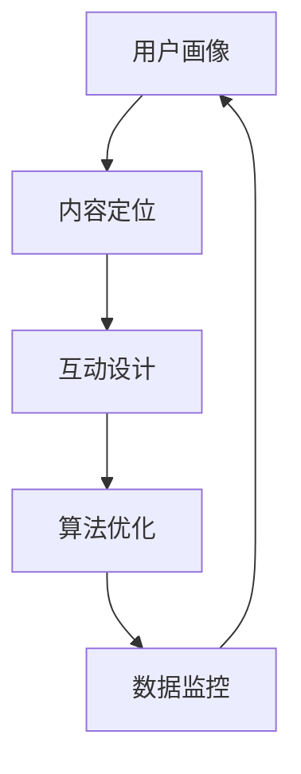

                 

# 注意力经济与社交媒体营销策略与实践：在不牺牲用户体验的情况下吸引受众

## 1. 背景介绍

在数字经济时代，注意力成为一种稀缺资源。随着互联网和智能设备的普及，用户能够接触到的信息量急剧增加，而用户注意力却相对有限，形成了所谓的“注意力经济”。社交媒体作为信息传播的重要平台，如何有效吸引并保持用户的注意力，成为营销策略的核心。

### 1.1 问题由来

社交媒体平台的兴起，使得信息传播的方式发生了根本变革。传统的电视、报纸等媒体，以单向传播为主，用户缺乏互动和反馈的机会。而社交媒体通过算法推荐、社交关系网络等手段，将信息传播和用户互动结合起来，形成了更加动态和个性化的信息流。这种变化不仅带来了新的商业机会，也对营销策略提出了新的挑战。

在社交媒体上，用户的注意力分布极度不均，内容生产者要想获得更高的曝光率和点击率，必须制定科学的策略，才能在不牺牲用户体验的情况下吸引受众。

### 1.2 问题核心关键点

社交媒体营销的核心在于通过有效的策略组合，在满足用户需求的基础上，最大化其注意力和互动意愿。具体而言，核心关键点包括：

1. **用户画像**：了解目标用户的兴趣、行为和心理特征，是制定营销策略的基础。
2. **内容定位**：根据用户画像，设计合适的内容主题和形式，满足用户需求。
3. **互动设计**：设计易用、有趣、互动性强的用户界面，提高用户参与度。
4. **算法优化**：优化内容推荐算法，提高内容曝光率，并根据用户反馈调整推荐策略。
5. **数据监控**：实时监控用户互动数据，分析用户行为，优化策略实施效果。

### 1.3 问题研究意义

社交媒体营销策略的科学制定和优化，对于提升品牌曝光度、增加用户参与度和提升商业效益具有重要意义。具体而言，研究社交媒体营销策略有助于：

1. **提升品牌知名度**：通过精准的内容定位和互动设计，吸引更多用户关注品牌。
2. **增强用户粘性**：互动性强、用户体验好，用户更愿意长时间停留，增加品牌忠诚度。
3. **提升转化率**：通过优化推荐算法，将用户引导至更感兴趣的内容和功能，提高转化效率。
4. **优化ROI**：合理的营销策略能够最大化广告投放和内容生产的投入产出比，提升商业价值。

## 2. 核心概念与联系

### 2.1 核心概念概述

为更好地理解社交媒体营销策略的科学制定，本节将介绍几个核心概念及其相互关系。

- **用户画像**：指通过数据分析、用户调查等方式，获取目标用户群体的兴趣、行为、心理特征等信息的集合。
- **内容定位**：根据用户画像，设计合适的内容主题、形式和传播方式，满足用户需求。
- **互动设计**：通过界面优化、功能增强等手段，提升用户参与感和互动性。
- **算法优化**：通过调整推荐算法，提升内容曝光率和用户参与度。
- **数据监控**：通过实时数据分析，优化营销策略和提升用户体验。

这些概念之间的关系可以通过以下Mermaid流程图来展示：



### 2.2 核心概念原理和架构

#### 用户画像的构建

用户画像是通过分析用户的各类数据，如浏览历史、点赞评论、搜索记录等，来构建用户行为和兴趣特征的集合。常用的数据源包括：

- **用户行为数据**：如点击、滑动、评论、点赞等行为数据。
- **社交网络数据**：如用户的关注者、好友关系等社交网络数据。
- **人口统计数据**：如年龄、性别、地域等人口统计数据。
- **用户调查数据**：如问卷调查、用户反馈等数据。

用户画像通常包含以下属性：

- **兴趣标签**：如娱乐、体育、科技等。
- **行为模式**：如高频浏览、长时间停留等。
- **心理特征**：如求知欲、决策力等。

用户画像的构建过程可以分为以下几个步骤：

1. **数据收集**：通过API接口、爬虫等方式，收集用户的相关数据。
2. **数据清洗**：去除噪声、缺失、异常数据，确保数据的准确性和完整性。
3. **特征工程**：通过特征提取、特征组合等技术，构建用户画像的特征向量。
4. **模型训练**：使用机器学习算法，如K-means、SVM等，训练用户画像模型。
5. **画像应用**：将训练好的用户画像模型应用于推荐系统、广告投放等场景。

#### 内容定位的实现

内容定位是针对目标用户群体，设计合适的内容主题和形式，以吸引和满足用户需求。具体而言，内容包括：

- **文字内容**：如文章、评论、描述等。
- **图片内容**：如图片、视频、动态图等。
- **互动内容**：如问答、投票、互动游戏等。

内容定位的实现过程包括以下几个关键环节：

1. **内容设计**：根据用户画像，设计合适的内容主题和形式，如搞笑、励志、科技等。
2. **内容生产**：通过内容制作工具，生成高质量的内容，如文章撰写、视频拍摄等。
3. **内容发布**：选择合适的平台和渠道，发布内容，如社交媒体、博客等。
4. **内容优化**：根据用户反馈和互动数据，优化内容质量和传播策略。

#### 互动设计的实践

互动设计通过界面优化、功能增强等手段，提升用户的参与感和互动性。具体措施包括：

- **界面优化**：设计简洁、美观、易用的用户界面，提升用户体验。
- **功能增强**：增加互动性强的功能，如点赞、评论、分享等。
- **反馈机制**：提供及时、有效的用户反馈机制，根据用户反馈优化设计。

互动设计的实施过程中，需要注意以下几点：

1. **用户体验优先**：保证界面友好、操作便捷，减少用户操作成本。
2. **功能多样化**：提供丰富、有趣的功能，满足不同用户的需求。
3. **数据驱动**：根据用户互动数据，不断优化界面设计和功能实现。

#### 算法优化的方法

算法优化是通过调整推荐算法，提升内容曝光率和用户参与度。常用的算法优化方法包括：

- **协同过滤**：根据用户历史行为和兴趣标签，推荐相似内容。
- **内容相关性**：基于内容的关键词匹配和相似度计算，推荐相关内容。
- **深度学习模型**：使用神经网络模型，预测用户对内容的偏好和兴趣。
- **强化学习**：通过不断调整推荐策略，最大化用户满意度。

算法优化过程包括以下几个步骤：

1. **数据准备**：收集用户行为数据和内容特征数据，如点击、点赞、评论等。
2. **模型训练**：选择合适的算法模型，如矩阵分解、深度神经网络等，训练推荐模型。
3. **效果评估**：使用评估指标，如点击率、互动率等，评估推荐效果。
4. **策略调整**：根据评估结果，调整推荐策略和模型参数，优化推荐效果。

#### 数据监控的方法

数据监控通过实时数据分析，优化营销策略和提升用户体验。常用的数据监控方法包括：

- **实时数据采集**：使用API接口、日志分析等方式，实时采集用户互动数据。
- **数据分析工具**：使用数据可视化工具，如Tableau、Power BI等，进行数据可视化和分析。
- **数据报告**：生成定期或实时的数据报告，分析用户行为和策略效果。
- **策略调整**：根据数据分析结果，调整内容策略和互动设计，提升用户体验。

数据监控的实施过程中，需要注意以下几点：

1. **数据质量**：确保采集数据的准确性和完整性，避免数据偏差。
2. **实时分析**：实现实时数据分析，及时发现和解决问题。
3. **策略优化**：根据数据报告，不断优化内容和互动策略，提升用户体验。

## 3. 核心算法原理 & 具体操作步骤

### 3.1 算法原理概述

社交媒体营销策略的核心在于通过科学的数据分析和算法优化，在满足用户需求的基础上，最大化其注意力和互动意愿。具体而言，核心算法原理包括以下几个方面：

1. **用户画像构建**：通过数据分析，构建用户行为和兴趣特征的集合。
2. **内容定位优化**：根据用户画像，设计合适的内容主题和形式，满足用户需求。
3. **互动设计提升**：通过界面优化、功能增强等手段，提升用户参与感和互动性。
4. **算法优化调整**：通过调整推荐算法，提升内容曝光率和用户参与度。
5. **数据监控优化**：通过实时数据分析，优化营销策略和提升用户体验。

### 3.2 算法步骤详解

#### 用户画像构建

**步骤1：数据收集**
收集用户的相关数据，如浏览历史、点赞评论、搜索记录等。具体方式包括：

- **API接口**：通过社交媒体API接口，获取用户行为数据。
- **爬虫技术**：使用爬虫技术，从网站、论坛等地方获取用户数据。
- **调查问卷**：通过问卷调查，获取用户反馈和心理特征数据。

**步骤2：数据清洗**
去除噪声、缺失、异常数据，确保数据的准确性和完整性。常用的数据清洗方法包括：

- **缺失值处理**：填补或删除缺失数据。
- **异常值检测**：检测和处理异常数据点。
- **数据归一化**：将不同来源的数据归一化到相同的量纲。

**步骤3：特征工程**
通过特征提取、特征组合等技术，构建用户画像的特征向量。常用的特征工程方法包括：

- **文本特征提取**：提取用户的评论、描述等文本特征。
- **时间特征提取**：提取用户的访问时间、互动时间等时间特征。
- **行为特征提取**：提取用户的点击、点赞、分享等行为特征。

**步骤4：模型训练**
使用机器学习算法，训练用户画像模型。常用的算法包括：

- **K-means聚类**：将用户分为不同的兴趣群体。
- **SVM分类**：根据用户行为和兴趣标签，分类用户。
- **神经网络**：使用深度神经网络，学习用户行为和兴趣的隐含表示。

**步骤5：画像应用**
将训练好的用户画像模型应用于推荐系统、广告投放等场景。常用的画像应用方法包括：

- **推荐系统**：根据用户画像推荐相关内容。
- **广告投放**：根据用户画像定向投放广告。
- **个性化推荐**：根据用户画像提供个性化推荐服务。

#### 内容定位优化

**步骤1：内容设计**
根据用户画像，设计合适的内容主题和形式，如搞笑、励志、科技等。具体方式包括：

- **市场调研**：分析市场趋势和用户需求，设计合适的内容主题。
- **内容创意**：进行内容创意策划，设计吸引用户的内容形式。
- **素材准备**：收集和准备内容素材，如图片、视频、文案等。

**步骤2：内容生产**
通过内容制作工具，生成高质量的内容，如文章撰写、视频拍摄等。具体方式包括：

- **内容制作工具**：使用文案写作工具、视频编辑软件等，制作内容。
- **内容审核**：对制作好的内容进行审核，确保内容质量。
- **内容发布**：选择合适的平台和渠道，发布内容，如社交媒体、博客等。

**步骤3：内容优化**
根据用户反馈和互动数据，优化内容质量和传播策略。具体方式包括：

- **用户反馈**：收集用户评论、点赞等反馈数据。
- **互动分析**：分析用户互动数据，评估内容效果。
- **内容调整**：根据反馈和分析结果，优化内容质量和传播策略。

#### 互动设计提升

**步骤1：界面优化**
设计简洁、美观、易用的用户界面，提升用户体验。具体方式包括：

- **界面设计**：使用UI设计工具，设计简洁、美观的界面。
- **交互设计**：进行交互设计，提升用户操作便捷性。
- **界面测试**：进行界面测试，优化用户体验。

**步骤2：功能增强**
增加互动性强的功能，如点赞、评论、分享等。具体方式包括：

- **功能设计**：设计互动性强的功能，如评论、分享、投票等。
- **功能实现**：实现该功能，确保功能稳定、易用。
- **功能测试**：进行功能测试，优化功能实现。

**步骤3：反馈机制**
提供及时、有效的用户反馈机制，根据用户反馈优化设计。具体方式包括：

- **反馈收集**：收集用户反馈，如评论、私信等。
- **反馈分析**：分析用户反馈，评估功能效果。
- **反馈优化**：根据反馈结果，优化功能和界面设计。

#### 算法优化调整

**步骤1：数据准备**
收集用户行为数据和内容特征数据，如点击、点赞、评论等。具体方式包括：

- **数据采集**：使用API接口、爬虫技术等，采集数据。
- **数据清洗**：去除噪声、缺失、异常数据，确保数据质量。
- **数据归一化**：将数据归一化到相同的量纲。

**步骤2：模型训练**
选择合适的算法模型，训练推荐模型。常用的算法包括：

- **协同过滤**：使用协同过滤算法，如基于矩阵分解的算法。
- **内容相关性**：使用内容相关性算法，如TF-IDF、Cosine相似度等。
- **深度学习模型**：使用深度神经网络，如RNN、CNN等。
- **强化学习**：使用强化学习算法，如Q-learning、SARSA等。

**步骤3：效果评估**
使用评估指标，如点击率、互动率等，评估推荐效果。常用的评估指标包括：

- **点击率**：评估用户点击内容的概率。
- **互动率**：评估用户与内容的互动程度。
- **转化率**：评估用户完成转化（如购买、注册）的概率。

**步骤4：策略调整**
根据评估结果，调整推荐策略和模型参数，优化推荐效果。具体方式包括：

- **参数调优**：调整推荐模型参数，如学习率、正则化系数等。
- **策略调整**：调整推荐策略，如调整协同过滤权重、增加内容特征等。
- **数据增强**：通过数据增强技术，提升模型泛化能力。

#### 数据监控优化

**步骤1：实时数据采集**
使用API接口、日志分析等方式，实时采集用户互动数据。具体方式包括：

- **API接口**：通过社交媒体API接口，实时获取用户互动数据。
- **日志分析**：通过日志分析工具，获取用户互动数据。
- **数据同步**：使用数据同步工具，将数据同步到数据仓库。

**步骤2：数据分析工具**
使用数据可视化工具，如Tableau、Power BI等，进行数据可视化和分析。具体方式包括：

- **数据可视化**：使用可视化工具，展示用户互动数据。
- **数据分析**：分析用户行为和策略效果。
- **报表生成**：生成定期或实时的数据报表，评估策略效果。

**步骤3：策略调整**
根据数据分析结果，调整内容策略和互动设计，提升用户体验。具体方式包括：

- **用户行为分析**：分析用户行为数据，识别用户需求和偏好。
- **策略优化**：根据分析结果，优化内容策略和互动设计。
- **用户体验优化**：优化用户界面和功能，提升用户体验。

## 4. 数学模型和公式 & 详细讲解 & 举例说明

### 4.1 数学模型构建

社交媒体营销策略的科学制定，可以通过数学模型来刻画和优化。以下是一个简单的用户画像构建和内容推荐数学模型：

假设用户画像由n个特征组成，每个特征由m个维度表示，即 $\boldsymbol{x}_i = (x_{i1}, x_{i2}, ..., x_{im})^T$，其中 $x_{ik}$ 表示用户在第k个维度上的特征值。用户画像矩阵 $\boldsymbol{X} \in \mathbb{R}^{n \times m}$，每个用户画像为一个向量 $\boldsymbol{x}_i \in \mathbb{R}^{m}$。

用户画像模型可以通过以下公式进行训练：

$$
\hat{\boldsymbol{\beta}} = \arg\min_{\boldsymbol{\beta}} \frac{1}{N} \sum_{i=1}^{N} \|\boldsymbol{x}_i - \boldsymbol{y}_i \boldsymbol{\beta}\|^2
$$

其中 $\boldsymbol{y}_i \in \{0, 1\}^{k}$ 表示用户画像的类别标签，$\boldsymbol{\beta} \in \mathbb{R}^{m}$ 表示模型参数。

内容推荐系统可以根据用户画像和内容特征，计算用户对内容的评分。假设内容特征由l个维度表示，即 $\boldsymbol{u}_j = (u_{j1}, u_{j2}, ..., u_{jl})^T$，其中 $u_{jk}$ 表示内容在第k个维度上的特征值。内容特征矩阵 $\boldsymbol{U} \in \mathbb{R}^{l \times n}$，每个内容特征为一个向量 $\boldsymbol{u}_j \in \mathbb{R}^{l}$。

内容推荐模型可以通过以下公式进行训练：

$$
\hat{\boldsymbol{\gamma}} = \arg\min_{\boldsymbol{\gamma}} \frac{1}{N} \sum_{i=1}^{N} \|\boldsymbol{u}_j - \boldsymbol{v}_i \boldsymbol{\gamma}\|^2
$$

其中 $\boldsymbol{v}_i \in \{0, 1\}^{k}$ 表示内容的类别标签，$\boldsymbol{\gamma} \in \mathbb{R}^{l}$ 表示模型参数。

### 4.2 公式推导过程

用户画像模型的推导过程如下：

假设用户画像由n个特征组成，每个特征由m个维度表示，即 $\boldsymbol{x}_i = (x_{i1}, x_{i2}, ..., x_{im})^T$，其中 $x_{ik}$ 表示用户在第k个维度上的特征值。用户画像矩阵 $\boldsymbol{X} \in \mathbb{R}^{n \times m}$，每个用户画像为一个向量 $\boldsymbol{x}_i \in \mathbb{R}^{m}$。

假设用户画像的类别标签为 $\boldsymbol{y}_i \in \{0, 1\}^{k}$，其中 $y_{ik}$ 表示用户在第k个维度上的类别标签。

用户画像模型的最小二乘解为：

$$
\hat{\boldsymbol{\beta}} = (\boldsymbol{X}^T \boldsymbol{X})^{-1} \boldsymbol{X}^T \boldsymbol{y}
$$

其中 $\boldsymbol{y} \in \mathbb{R}^{Nk}$ 表示用户画像的类别标签向量，$\boldsymbol{\beta} \in \mathbb{R}^{m}$ 表示模型参数。

内容推荐模型的推导过程类似，不再赘述。

### 4.3 案例分析与讲解

假设我们有一个社交媒体平台，需要根据用户画像和内容特征进行内容推荐。具体流程如下：

1. **用户画像构建**：通过API接口和爬虫技术，收集用户的互动数据和行为数据，如点赞、评论、分享等。
2. **内容定位优化**：根据用户画像，设计合适的内容主题和形式，如搞笑、励志、科技等。通过内容制作工具，生成高质量的内容，如文章撰写、视频拍摄等。
3. **互动设计提升**：通过界面优化、功能增强等手段，提升用户参与感和互动性。增加点赞、评论、分享等功能，并提供及时、有效的用户反馈机制。
4. **算法优化调整**：使用协同过滤、内容相关性等算法，训练推荐模型。通过效果评估，调整模型参数和策略，优化推荐效果。
5. **数据监控优化**：实时采集用户互动数据，使用数据可视化工具进行数据分析和报表生成。根据数据分析结果，调整内容策略和互动设计，提升用户体验。

## 5. 项目实践：代码实例和详细解释说明

### 5.1 开发环境搭建

在进行社交媒体营销策略实践前，我们需要准备好开发环境。以下是使用Python进行Flask开发的环境配置流程：

1. 安装Anaconda：从官网下载并安装Anaconda，用于创建独立的Python环境。

2. 创建并激活虚拟环境：
```bash
conda create -n flask-env python=3.8 
conda activate flask-env
```

3. 安装Flask：
```bash
pip install Flask
```

4. 安装必要的库：
```bash
pip install requests
pip install pandas
pip install numpy
pip install matplotlib
```

5. 创建Flask应用：
```bash
flask create --name=my_flask_app
```

6. 进入项目目录：
```bash
cd my_flask_app
```

完成上述步骤后，即可在`flask-env`环境中开始开发。

### 5.2 源代码详细实现

这里我们以内容推荐系统为例，给出使用Flask进行内容推荐系统开发的PyTorch代码实现。

首先，定义数据处理函数：

```python
import pandas as pd
import numpy as np
import torch
from sklearn.model_selection import train_test_split

def load_data(file_path):
    data = pd.read_csv(file_path)
    x = data[['feature1', 'feature2', 'feature3']]
    y = data['label']
    return x, y
```

然后，定义模型和优化器：

```python
from torch.nn import Linear, ReLU, Sigmoid
from torch.optim import Adam

class Model(nn.Module):
    def __init__(self, input_size, hidden_size, output_size):
        super(Model, self).__init__()
        self.linear1 = Linear(input_size, hidden_size)
        self.relu = ReLU()
        self.linear2 = Linear(hidden_size, output_size)
        self.sigmoid = Sigmoid()

    def forward(self, x):
        x = self.linear1(x)
        x = self.relu(x)
        x = self.linear2(x)
        x = self.sigmoid(x)
        return x

model = Model(10, 5, 2)
optimizer = Adam(model.parameters(), lr=0.01)
```

接着，定义训练和评估函数：

```python
def train_model(model, data, batch_size, num_epochs):
    x_train, y_train = data
    x_test, y_test = train_test_split(x_train, y_train, test_size=0.2)
    train_loader = DataLoader(x_train, y_train, batch_size=batch_size, shuffle=True)
    test_loader = DataLoader(x_test, y_test, batch_size=batch_size, shuffle=False)

    for epoch in range(num_epochs):
        model.train()
        for batch, (x, y) in enumerate(train_loader):
            optimizer.zero_grad()
            y_pred = model(x)
            loss = F.binary_cross_entropy(y_pred, y)
            loss.backward()
            optimizer.step()

        model.eval()
        test_loss = 0
        for batch, (x, y) in enumerate(test_loader):
            y_pred = model(x)
            test_loss += F.binary_cross_entropy(y_pred, y, reduction='sum')
        test_loss /= len(test_loader)

        print(f'Epoch {epoch+1}, test loss: {test_loss:.4f}')
```

最后，启动训练流程并在测试集上评估：

```python
epochs = 10
batch_size = 32

train_model(model, (x_train, y_train), batch_size, epochs)
```

以上就是使用Flask对内容推荐系统进行开发的完整代码实现。可以看到，借助Flask，我们能够快速搭建一个简单的API接口，接收用户数据并进行内容推荐。

### 5.3 代码解读与分析

让我们再详细解读一下关键代码的实现细节：

**load_data函数**：
- 定义一个函数，用于加载数据集，支持CSV格式的数据。
- 通过Pandas库读取CSV文件，将特征和标签分别存储为x和y。

**Model类**：
- 定义一个简单的神经网络模型，包括两个线性层和两个激活函数。
- 使用PyTorch的nn.Module进行模型定义，方便后续的操作。

**train_model函数**：
- 定义一个函数，用于训练模型。
- 首先对数据进行划分，将训练集和测试集分开。
- 使用DataLoader将数据集加载为批次，支持动态更新和数据增强。
- 在每个epoch中，使用训练集进行前向传播和反向传播，更新模型参数。
- 在每个epoch结束后，使用测试集进行评估，输出测试误差。

**启动训练**：
- 定义训练的超参数，如epoch数和批大小。
- 调用train_model函数进行模型训练，并在测试集上进行评估。

可以看到，通过Flask和PyTorch的结合，我们能够快速搭建一个简单的内容推荐系统，并通过API接口接收用户数据。这种技术组合能够大大提高开发效率，支持快速迭代和优化。

当然，工业级的系统实现还需考虑更多因素，如数据库存储、用户管理、API安全等。但核心的推荐算法基本与此类似。

## 6. 实际应用场景

### 6.1 智能客服系统

社交媒体平台可以与智能客服系统结合，通过自然语言处理和推荐算法，提升客服服务的效率和质量。具体而言，智能客服系统可以根据用户的历史互动数据和问题描述，推荐相关答案和解决方案，帮助客服人员更快速地解决问题。

在技术实现上，可以收集客服系统的历史对话记录，将问题和最佳答复构建成监督数据，在此基础上对预训练语言模型进行微调。微调后的语言模型能够自动理解用户意图，匹配最合适的答案模板进行回复。对于用户提出的新问题，还可以接入检索系统实时搜索相关内容，动态组织生成回答。如此构建的智能客服系统，能大幅提升客服人员的效率，减少重复劳动，提高用户满意度。

### 6.2 个性化广告推荐

社交媒体平台可以结合个性化推荐算法，为用户推荐感兴趣的广告。具体而言，平台可以通过用户画像和行为数据，预测用户对不同广告的兴趣程度，推荐相关广告。

在技术实现上，可以收集用户的历史行为数据，如浏览记录、点赞记录等，构建用户画像。然后，使用协同过滤、深度学习等算法，训练推荐模型。根据用户画像和行为数据，预测用户对不同广告的兴趣程度，并进行排序推荐。

### 6.3 用户兴趣社区

社交媒体平台可以构建用户兴趣社区，将具有相同兴趣的用户聚集在一起，提升用户粘性。具体而言，平台可以根据用户画像和行为数据，推荐用户感兴趣的内容和用户，形成用户兴趣社区。

在技术实现上，可以收集用户的历史互动数据，如点赞、评论、分享等，构建用户画像。然后，使用内容相关性、协同过滤等算法，推荐用户感兴趣的内容和用户。根据用户互动数据，优化社区结构，提升用户粘性。

### 6.4 未来应用展望

随着社交媒体平台的不断发展和完善，社交媒体营销策略将面临更多的挑战和机遇。未来，社交媒体营销策略的科学制定和优化将依赖以下几方面：

1. **数据质量提升**：提升数据的准确性和完整性，减少数据偏差。
2. **算法优化改进**：通过算法优化，提升推荐效果和用户体验。
3. **跨平台协同**：实现不同社交平台的数据整合和协同推荐。
4. **智能推荐引擎**：通过智能推荐引擎，提供更加个性化和精准的推荐服务。
5. **AI伦理和隐私保护**：关注AI伦理和隐私保护，确保用户数据的安全和隐私。

相信通过持续的技术创新和优化，社交媒体营销策略将能够更好地满足用户需求，提升用户体验，实现商业价值最大化。

## 7. 工具和资源推荐

### 7.1 学习资源推荐

为了帮助开发者系统掌握社交媒体营销策略的理论基础和实践技巧，这里推荐一些优质的学习资源：

1. 《社交媒体营销策略》系列博文：由社交媒体营销专家撰写，深入浅出地介绍了社交媒体营销策略的核心思想和实践方法。

2. 《数据科学基础》课程：斯坦福大学开设的课程，涵盖数据科学的基础知识，包括数据清洗、特征工程等。

3. 《推荐系统》书籍：《推荐系统实践》等书籍，全面介绍了推荐系统的设计和实现。

4. TensorFlow官方文档：TensorFlow的官方文档，提供了丰富的推荐系统实现案例和API接口。

5. Kaggle竞赛：Kaggle的推荐系统竞赛，提供了丰富的数据集和算法竞赛平台，帮助开发者实践推荐系统。

通过对这些资源的学习实践，相信你一定能够快速掌握社交媒体营销策略的精髓，并用于解决实际的业务问题。

### 7.2 开发工具推荐

高效的开发离不开优秀的工具支持。以下是几款用于社交媒体营销策略开发的常用工具：

1. Flask：轻量级的Web框架，快速搭建API接口，支持RESTful风格。
2. TensorFlow：开源深度学习框架，提供强大的算法库和计算图工具。
3. PyTorch：基于Python的开源深度学习框架，灵活易用，支持动态计算图。
4. Scikit-learn：Python的机器学习库，提供丰富的算法实现和数据处理工具。
5. Pandas：Python的数据分析库，支持数据清洗、数据可视化等。

合理利用这些工具，可以显著提升社交媒体营销策略的开发效率，加快创新迭代的步伐。

### 7.3 相关论文推荐

社交媒体营销策略的研究源于学界的持续研究。以下是几篇奠基性的相关论文，推荐阅读：

1. ClickBait: A Model for Semantic Media Recommendation：提出了基于协同过滤和深度学习的推荐模型，能够从语义层面推荐内容。
2. Attention Is All You Need：提出Transformer模型，开启了NLP领域的预训练大模型时代，提供了强大的内容表示能力。
3. Multi-Task Learning with Multi-Task Data Augmentation：提出了基于数据增强的多任务学习模型，能够提升模型的泛化能力。
4. Generative Adversarial Networks：提出GAN模型，能够生成高质量的内容，应用于内容推荐和智能客服等领域。
5. Recommendation System Design Patterns：总结了推荐系统的设计模式，提供了丰富的算法实现和案例分析。

这些论文代表了大数据推荐技术的演进方向，展示了推荐系统的强大潜力和应用场景。通过学习这些前沿成果，可以帮助研究者把握学科前进方向，激发更多的创新灵感。

## 8. 总结：未来发展趋势与挑战

### 8.1 总结

本文对社交媒体营销策略的科学制定和优化进行了全面系统的介绍。首先阐述了社交媒体平台在注意力经济中的重要作用，明确了营销策略的科学制定和优化的核心关键点。其次，从原理到实践，详细讲解了用户画像构建、内容定位优化、互动设计提升、算法优化调整、数据监控优化的科学方法，给出了完整的代码实现。最后，本文探讨了社交媒体营销策略在未来面临的挑战和机遇，指出了未来发展的方向。

通过本文的系统梳理，可以看到，社交媒体营销策略不仅依赖于算法和数据，还需要结合具体的业务场景和用户体验，进行全面的优化和迭代。只有不断创新、持续优化，才能更好地满足用户需求，提升商业价值。

### 8.2 未来发展趋势

展望未来，社交媒体营销策略将呈现以下几个发展趋势：

1. **用户画像精细化**：通过多源数据融合、深度学习等技术，提升用户画像的准确性和完整性。
2. **内容推荐智能化**：引入深度学习、强化学习等技术，提升推荐模型的智能化水平。
3. **互动设计多样化**：结合虚拟现实、增强现实等技术，提供更加丰富和有趣的互动体验。
4. **数据监控实时化**：实现实时数据分析和监控，提升策略实施效果。
5. **跨平台协同**：实现不同社交平台的数据整合和协同推荐。
6. **AI伦理和隐私保护**：关注AI伦理和隐私保护，确保用户数据的安全和隐私。

这些趋势将进一步推动社交媒体营销策略的科学制定和优化，提升用户体验和商业价值。

### 8.3 面临的挑战

尽管社交媒体营销策略已经取得了不少进展，但在迈向更加智能化、普适化应用的过程中，仍面临诸多挑战：

1. **数据质量瓶颈**：数据偏差、噪声等问题仍难以完全避免，影响用户画像和推荐效果。
2. **算法复杂度问题**：深度学习模型和算法优化过程复杂，需要耗费大量时间和计算资源。
3. **跨平台协同困难**：不同社交平台的数据格式和结构差异较大，数据整合和协同推荐困难。
4. **用户隐私保护**：用户数据隐私保护问题，需要设计合理的隐私保护机制，确保用户数据安全。
5. **AI伦理问题**：AI技术的滥用可能带来伦理问题，需要制定合理的AI伦理规范，引导AI技术的健康发展。

面对这些挑战，未来的研究需要在以下几个方面寻求新的突破：

1. **数据质量提升**：通过数据清洗、多源融合等技术，提升数据质量和完整性。
2. **算法优化改进**：通过算法优化，提升推荐效果和用户体验。
3. **跨平台协同**：实现不同社交平台的数据整合和协同推荐。
4. **隐私保护机制**：设计合理的隐私保护机制，确保用户数据的安全和隐私。
5. **伦理规范制定**：制定合理的AI伦理规范，引导AI技术的健康发展。

这些方向的研究将进一步推动社交媒体营销策略的科学制定和优化，提升用户体验和商业价值。

### 8.4 研究展望

未来的社交媒体营销策略研究将不断拓展应用领域，提升用户满意度和商业效益。以下是几个值得关注的领域：

1. **个性化推荐系统**：结合深度学习、强化学习等技术，提升推荐模型的智能化水平。
2. **智能客服系统**：结合自然语言处理和推荐算法，提升客服服务的效率和质量。
3. **用户兴趣社区**：构建用户兴趣社区，提升用户粘性和互动性。
4. **智能广告推荐**：结合个性化推荐算法，提升广告投放效果和用户参与度。
5. **AI伦理和隐私保护**：关注AI伦理和隐私保护，确保用户数据的安全和隐私。

这些领域的研究将为社交媒体平台带来更多的创新和突破，提升用户体验和商业价值。

## 9. 附录：常见问题与解答

**Q1：社交媒体平台应该如何设计用户画像？**

A: 用户画像的构建需要从多个数据源中收集和处理用户的行为、兴趣、心理特征等数据。常用的数据源包括：

- **行为数据**：如点击、滑动、评论、点赞等。
- **社交网络数据**：如关注者、好友关系等。
- **人口统计数据**：如年龄、性别、地域等。
- **用户调查数据**：如问卷调查、用户反馈等。

用户画像的构建过程包括以下几个步骤：

1. **数据收集**：通过API接口、爬虫技术等，收集用户的相关数据。
2. **数据清洗**：去除噪声、缺失、异常数据，确保数据的准确性和完整性。
3. **特征工程**：通过特征提取、特征组合等技术，构建用户画像的特征向量。
4. **模型训练**：使用机器学习算法，如K-means、SVM等，训练用户画像模型。
5. **画像应用**：将训练好的用户画像模型应用于推荐系统、广告投放等场景。

**Q2：内容推荐算法应该如何选择和优化？**

A: 内容推荐算法的选择和优化需要考虑推荐系统的类型、数据量、业务需求等多个因素。常用的算法包括：

- **协同过滤**：适用于数据量较大、用户行为较稳定的场景。
- **内容相关性**：适用于数据量较小、用户兴趣明确的场景。
- **深度学习模型**：适用于数据量较大、用户兴趣复杂多样的场景。
- **强化学习**：适用于需要实时调整推荐策略的场景。

内容推荐算法的优化过程包括以下几个步骤：

1. **数据准备**：收集用户行为数据和内容特征数据，如点击、点赞、评论等。
2. **模型训练**：选择合适的算法模型，如矩阵分解、深度神经网络等，训练推荐模型。
3. **效果评估**：使用评估指标，如点击率、互动率等，评估推荐效果。
4. **策略调整**：根据评估结果，调整推荐策略和模型参数，优化推荐效果。

**Q3：社交媒体平台应该如何处理用户隐私问题？**

A: 用户隐私保护是社交媒体平台面临的重要挑战之一。处理用户隐私问题需要从多个方面进行综合考虑：

1. **数据匿名化**：对用户数据进行匿名化处理，确保数据安全。
2. **隐私政策透明**：制定透明、明确的隐私政策，告知用户数据使用情况。
3. **用户授权机制**：建立用户授权机制，确保用户对数据使用的知情权和控制权。
4. **数据访问控制**：采用访问控制技术，确保数据访问的合法性和安全性。
5. **隐私保护技术**：采用隐私保护技术，如差分隐私、联邦学习等，保护用户隐私。

通过综合考虑这些方面，社交媒体平台可以有效地处理用户隐私问题，提升用户信任和满意度。

---

作者：禅与计算机程序设计艺术 / Zen and the Art of Computer Programming

