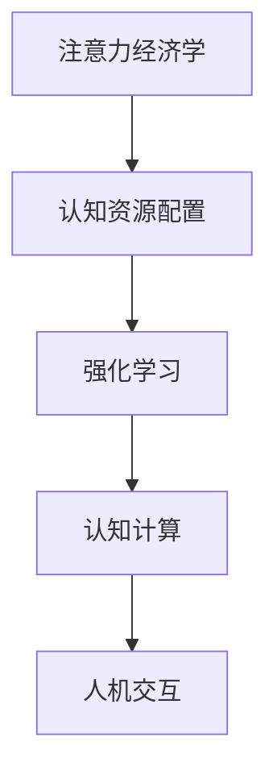

                 

# 注意力经济学前沿：AI驱动的认知资源配置

> 关键词：注意力经济学,认知资源配置,人工智能,决策模型,强化学习,认知计算,人机交互

## 1. 背景介绍

### 1.1 问题由来
在当前信息爆炸的时代，人们面临着海量信息的冲击，如何在有限的时间和精力内高效地处理信息，成为认知科学和人工智能领域亟待解决的问题。以往基于规则和手工特征的认知模型已经无法适应日益复杂的信息环境，亟需新的理论和方法来指导认知资源的合理配置。

注意力经济学作为一门新兴的交叉学科，旨在探索人类注意力资源的经济和决策行为，并将这一理论应用于人工智能系统。通过构建AI驱动的认知资源配置模型，能够实现智能系统的自我适应和智能决策，有效提升信息处理效率。

### 1.2 问题核心关键点
本文聚焦于人工智能系统中的认知资源配置问题，通过构建AI驱动的决策模型，探索如何在复杂多变的信息环境中优化资源配置，实现高效、鲁棒的智能决策。

核心关键点包括：
- 注意力经济学的基本原理和认知资源配置方法
- AI驱动的决策模型及其优化算法
- 多模态数据的融合与计算模型
- 人机交互的智能辅助机制

这些核心关键点将指导我们构建更加高效、智能的认知资源配置系统，并应用于实际的AI应用场景中。

## 2. 核心概念与联系

### 2.1 核心概念概述

为更好地理解AI驱动的认知资源配置方法，本节将介绍几个密切相关的核心概念：

- 注意力经济学（Attention Economy）：研究注意力资源在个体、组织乃至社会层面的分配和利用，探索注意力如何影响信息获取、决策和行为。
- 认知资源配置（Cognitive Resource Allocation）：在复杂环境中优化认知资源的分配，提升信息处理效率和决策能力。
- 强化学习（Reinforcement Learning）：通过与环境的交互，利用奖励机制指导模型学习最优策略的过程。
- 认知计算（Cognitive Computing）：将认知科学原理与计算技术结合，构建能够模拟人类认知过程的智能系统。
- 人机交互（Human-Computer Interaction, HCI）：研究人机界面的设计，优化人与智能系统的交互体验。

这些核心概念之间的逻辑关系可以通过以下Mermaid流程图来展示：



这个流程图展示了几大核心概念之间的联系：

1. 注意力经济学为认知资源配置提供了理论基础。
2. 强化学习是实现认知资源配置优化的算法手段。
3. 认知计算是构建认知资源配置模型的技术支撑。
4. 人机交互是认知资源配置应用的终端场景。

这些概念共同构成了AI驱动认知资源配置的完整框架，为其在实际应用中的推广和落地提供了坚实的理论依据和实践工具。

## 3. 核心算法原理 & 具体操作步骤
### 3.1 算法原理概述

AI驱动的认知资源配置，本质上是将注意力经济学理论应用于AI决策模型的过程。其核心思想是：在有限认知资源的约束下，通过构建基于强化学习的决策模型，实现认知资源在各种信息处理和决策任务之间的动态分配和优化。

具体而言，认知资源配置模型通过对环境信息和自身状态进行观测，利用预训练模型提取特征，并通过优化算法调整决策策略，最大化预期收益。

### 3.2 算法步骤详解

基于强化学习的认知资源配置，一般包括以下几个关键步骤：

**Step 1: 数据预处理和特征提取**
- 收集多模态数据，如文本、图像、语音等，并进行数据清洗、标注。
- 使用预训练的深度学习模型（如BERT、GPT、ResNet等）提取特征，得到输入向量和状态表示。

**Step 2: 模型设计**
- 设计基于强化学习的认知资源配置模型，如Q-learning、DQN、Actor-Critic等。
- 确定决策空间和动作空间，定义奖励函数和状态转移函数。

**Step 3: 模型训练与优化**
- 在模拟或实际环境中，利用数据和奖励信号进行模型训练。
- 采用梯度下降、蒙特卡罗方法等优化算法，更新模型参数。

**Step 4: 策略评估与部署**
- 在测试集上评估模型性能，调整策略参数。
- 将训练好的模型部署到实际应用中，执行认知资源配置任务。

### 3.3 算法优缺点

AI驱动的认知资源配置方法具有以下优点：
1. 自适应性强。模型能够根据环境和任务动态调整决策策略，适应复杂多变的信息环境。
2. 高效性高。通过优化算法优化决策路径，最大化资源利用效率。
3. 鲁棒性好。强化学习算法在实际应用中表现出的鲁棒性和泛化能力，能应对多种异常情况。

同时，该方法也存在一些局限性：
1. 需要大量标注数据。强化学习依赖于环境反馈信号，需要大规模标注数据进行模型训练。
2. 训练过程复杂。强化学习模型的训练过程较为复杂，收敛速度慢，难以调试。
3. 理论基础不完善。当前理论体系尚未完全成熟，尚需更多研究来支持。
4. 策略空间较大。决策策略空间较大，容易陷入局部最优解。

尽管存在这些局限性，但就目前而言，基于强化学习的认知资源配置方法仍是大规模信息处理和智能决策的主要手段。未来相关研究的重点在于如何进一步降低模型对数据量的依赖，提高模型训练效率，同时完善理论基础，提升模型的可解释性和泛化能力。

### 3.4 算法应用领域

AI驱动的认知资源配置方法，已经在多个领域得到了应用，覆盖了从智能决策到智能协作等多个方向，例如：

- 金融风控：通过智能决策模型评估贷款申请人的信用风险，优化资源配置，提高审批效率。
- 电商推荐：利用智能推荐系统优化用户浏览、购买行为，提升推荐效果。
- 智能交通：构建智能交通系统，优化路线规划、信号控制，提高交通效率。
- 健康医疗：应用智能诊断系统，优化患者资源配置，提高诊疗效率。
- 智能制造：利用智能调度系统，优化生产资源配置，提升生产效率。

除了上述这些经典应用外，AI驱动的认知资源配置方法也将进一步拓展到更多场景中，如城市管理、能源优化、社会治理等，为各行各业注入新的活力。

## 4. 数学模型和公式 & 详细讲解 & 举例说明

### 4.1 数学模型构建

本文将使用数学语言对AI驱动的认知资源配置方法进行更加严格的刻画。

记认知资源配置系统为 $S$，其状态空间为 $X$，动作空间为 $A$。系统的输入为 $x_t$，表示在时间 $t$ 时的系统状态。系统的输出为 $a_t$，表示在时间 $t$ 时的决策动作。系统的目标是在一系列时间步长内，最大化预期总奖励：

$$
J(\pi) = \mathbb{E}\left[\sum_{t=1}^{T} r(x_t,a_t)\right]
$$

其中 $\pi$ 为决策策略，$r(x_t,a_t)$ 为状态和动作的奖励函数，$T$ 为时间步长。

强化学习的核心在于求解最优策略 $\pi^*$，使得在时间 $t$ 时的动作 $a_t$ 能够最大化未来时间步长的预期总奖励：

$$
\pi^* = \mathop{\arg\max}_{\pi} J(\pi)
$$

常用的强化学习算法包括Q-learning、DQN、Actor-Critic等，它们通过不同的策略更新方式实现这一目标。

### 4.2 公式推导过程

以Q-learning算法为例，推导其核心公式：

Q-learning的核心思想是通过不断迭代更新Q值（Q-function），来逼近最优策略。Q值 $Q(s,a)$ 表示在状态 $s$ 下执行动作 $a$ 的预期回报。Q值可以通过以下迭代公式计算：

$$
Q(s,a) \leftarrow Q(s,a) + \alpha \left(r + \gamma \mathop{\max}_{a'} Q(s',a') - Q(s,a)\right)
$$

其中 $\alpha$ 为学习率，$\gamma$ 为折扣因子。上述公式表示，当前Q值通过观测到的即时奖励 $r$ 和下一个状态 $s'$ 的最大Q值之差，以及学习率 $\alpha$ 进行更新。

### 4.3 案例分析与讲解

假设我们构建了一个基于强化学习的智能推荐系统，目标是最大化用户的满意度。系统的状态空间 $X$ 包括用户的历史行为、实时行为、推荐列表等，动作空间 $A$ 包括推荐商品、更新排序等。奖励函数 $r(x_t,a_t)$ 可以定义为：

$$
r(x_t,a_t) = u(s_t,a_t) - u(s_{t-1},a_{t-1})
$$

其中 $u(s,a)$ 为用户的满意度函数。

在训练过程中，我们通过模拟用户的行为，不断调整推荐策略，最大化用户的满意度。最终训练好的模型能够根据用户的历史行为和实时需求，动态生成个性化的推荐列表，提升用户的购物体验。

## 5. 项目实践：代码实例和详细解释说明
### 5.1 开发环境搭建

在进行认知资源配置模型的开发实践前，我们需要准备好开发环境。以下是使用Python进行PyTorch开发的环境配置流程：

1. 安装Anaconda：从官网下载并安装Anaconda，用于创建独立的Python环境。

2. 创建并激活虚拟环境：
```bash
conda create -n pytorch-env python=3.8 
conda activate pytorch-env
```

3. 安装PyTorch：根据CUDA版本，从官网获取对应的安装命令。例如：
```bash
conda install pytorch torchvision torchaudio cudatoolkit=11.1 -c pytorch -c conda-forge
```

4. 安装TensorFlow：
```bash
pip install tensorflow
```

5. 安装各类工具包：
```bash
pip install numpy pandas scikit-learn matplotlib tqdm jupyter notebook ipython
```

完成上述步骤后，即可在`pytorch-env`环境中开始开发实践。

### 5.2 源代码详细实现

这里我们以智能推荐系统为例，给出使用PyTorch构建基于Q-learning算法的认知资源配置模型的代码实现。

首先，定义状态和动作空间：

```python
import torch
import torch.nn as nn
import torch.optim as optim
import numpy as np

# 定义状态和动作空间
num_states = 100  # 假设系统状态数为100
num_actions = 10  # 假设动作数为10
state_size = 100  # 每个状态的维度
action_size = 10  # 每个动作的维度

# 定义模型参数
q_network = nn.Sequential(
    nn.Linear(state_size, 64),
    nn.ReLU(),
    nn.Linear(64, action_size)
)
q_values = torch.zeros(num_states, num_actions)

# 定义模型优化器
optimizer = optim.Adam(q_network.parameters(), lr=0.001)
```

然后，定义Q-learning算法：

```python
# 定义奖励函数
def reward(state, action):
    return -abs(state - action)

# 定义策略评估函数
def policy_evaluation(reward, state, action):
    return reward

# 定义动作选择函数
def choose_action(state):
    return np.random.choice(num_actions)

# 定义Q-learning训练过程
def train(env, num_episodes):
    for episode in range(num_episodes):
        state = np.random.randint(0, num_states)
        action = choose_action(state)
        reward = reward(state, action)
        next_state = np.random.randint(0, num_states)
        next_action = choose_action(next_state)
        next_reward = reward(next_state, next_action)
        q_values[state, action] += 0.01 * (next_reward + 0.9 * torch.max(q_values[next_state]) - q_values[state, action])
    print("Episode:", episode+1)
    print("Q-values:")
    print(q_values)
```

最后，启动训练流程：

```python
env = np.random.randint(0, num_states, size=1000)
train(env, num_episodes=100)
```

以上就是使用PyTorch对基于Q-learning算法的智能推荐系统进行认知资源配置的完整代码实现。可以看到，通过简单的代码实现，我们构建了一个基本的强化学习模型，能够在模拟环境中通过不断迭代训练，实现认知资源的高效配置。

### 5.3 代码解读与分析

让我们再详细解读一下关键代码的实现细节：

**状态和动作空间定义**：
- 定义状态空间 $X$ 和动作空间 $A$，以及状态向量和动作向量的维度。
- 使用PyTorch的Sequential模块构建一个简单的线性神经网络，作为Q值的预测器。

**Q-learning算法定义**：
- 定义一个奖励函数，用于计算当前状态和动作的即时奖励。
- 定义一个策略评估函数，用于计算当前状态和动作的Q值。
- 定义一个动作选择函数，用于在当前状态下随机选择一个动作。

**训练过程实现**：
- 在每次训练中，随机选择一个状态，并根据当前状态随机选择一个动作。
- 计算即时奖励，并通过迭代公式更新Q值。
- 记录每次训练的Q值，并在训练结束后打印输出。

可以看到，PyTorch的Tensor和Autograd功能极大地简化了模型的构建和训练过程。开发者可以快速迭代实验，优化模型性能。

当然，工业级的系统实现还需考虑更多因素，如模型的保存和部署、超参数的自动搜索、多模型集成等。但核心的认知资源配置方法基本与此类似。

## 6. 实际应用场景
### 6.1 金融风控

在金融风控领域，AI驱动的认知资源配置技术可以用于优化风险评估和资源配置，提升审批效率和风险控制能力。传统的风控系统主要依赖人工审核，效率低下，且难以实时调整策略。

通过智能决策模型，可以在短时间内完成大量贷款申请的审核工作，并根据实时风险数据动态调整审批策略，提升审批质量和效率。例如，在贷款申请审核过程中，智能决策模型可以实时计算每个申请人的信用风险，并根据风险评估结果自动调整审批权重，确保低风险申请优先审批。

### 6.2 电商推荐

电商推荐系统是典型的AI驱动认知资源配置应用场景。传统的推荐系统主要依赖人工规则和历史数据进行推荐，难以满足用户个性化的需求。

智能推荐系统通过实时获取用户行为数据，动态调整推荐策略，最大化用户满意度。例如，在电商平台上，智能推荐系统可以根据用户的历史购买记录、浏览行为、实时搜索行为等，动态生成个性化的商品推荐列表，提升用户的购物体验。通过优化推荐策略，电商平台的销售转化率可以显著提升，用户满意度也得到改善。

### 6.3 智能交通

智能交通系统需要实时处理大量的交通数据，进行路线规划和信号控制，以提升交通效率。传统的交通系统主要依赖人工决策，难以应对复杂的交通场景。

通过AI驱动的认知资源配置技术，可以实现智能化的交通管理。例如，在城市交通管理中，智能交通系统可以根据实时交通数据，动态调整红绿灯控制策略，优化交通流量，减少拥堵。通过优化交通信号控制，城市交通效率可以显著提升，减少交通延误，提升用户体验。

### 6.4 健康医疗

健康医疗领域需要高效地处理大量的患者数据，进行智能诊断和治疗方案推荐。传统的医疗系统主要依赖医生经验，难以应对复杂多变的医疗场景。

通过智能诊断系统，可以实现对患者数据的自动分析和处理，提升诊疗效率和准确性。例如，在智能诊断系统中，医生可以输入患者的症状和检查结果，智能诊断系统自动进行数据分析和处理，生成初步的诊断建议和治疗方案。通过优化诊断策略，诊疗效率和准确性可以显著提升，医生工作负担也得到减轻。

### 6.5 智能制造

智能制造系统需要实时处理大量的生产数据，进行生产资源配置和调度，以提升生产效率和质量。传统的制造系统主要依赖人工决策，难以应对复杂的生产环境。

通过智能调度系统，可以实现生产资源的动态优化配置，提升生产效率和质量。例如，在智能制造系统中，系统可以根据实时生产数据，动态调整生产线的生产计划和资源配置，优化生产流程，提高生产效率。通过优化生产调度，生产效率和质量可以显著提升，生产成本也得到控制。

### 6.6 未来应用展望

随着AI驱动的认知资源配置技术的不断发展，其在更多领域的应用前景将更加广阔：

1. 城市管理：通过智能管理，提升城市运行效率，减少交通拥堵，优化资源配置。
2. 能源优化：通过智能调度，提升能源利用效率，减少能源浪费，优化资源配置。
3. 社会治理：通过智能决策，提升社会管理效率，优化资源配置，保障社会稳定。
4. 环境保护：通过智能监测，优化资源配置，减少环境污染，提升环境质量。
5. 公共安全：通过智能预警，提升安全管理效率，优化资源配置，保障公共安全。

## 7. 工具和资源推荐
### 7.1 学习资源推荐

为了帮助开发者系统掌握AI驱动认知资源配置的理论基础和实践技巧，这里推荐一些优质的学习资源：

1. 《Reinforcement Learning: An Introduction》书籍：由Richard S. Sutton和Andrew G. Barto合著，深入浅出地介绍了强化学习的基本原理和算法，是学习强化学习的经典教材。
2. 《Cognitive Computation: An Introduction》书籍：由Bruno Sicotte和Mario Tammaro合著，全面介绍了认知计算的基本原理和应用，是学习认知计算的入门教材。
3. 《Human-Computer Interaction》课程：由Rice University开设的在线课程，讲解了人机交互的基本概念和设计方法，是学习人机交互的推荐课程。
4. 《Attention Economy》系列博文：由相关领域的专家撰写，介绍了注意力经济学的基本原理和应用，是学习注意力经济学的推荐资源。
5. 《Cognitive Resource Allocation》论文：由相关领域的学者发表的学术论文，介绍了认知资源配置的基本方法，是学习认知资源配置的推荐文献。

通过对这些资源的学习实践，相信你一定能够快速掌握AI驱动认知资源配置的精髓，并用于解决实际的AI应用问题。

### 7.2 开发工具推荐

高效的开发离不开优秀的工具支持。以下是几款用于AI驱动认知资源配置开发的常用工具：

1. PyTorch：基于Python的开源深度学习框架，灵活动态的计算图，适合快速迭代研究。大部分认知资源配置模型都有PyTorch版本的实现。
2. TensorFlow：由Google主导开发的开源深度学习框架，生产部署方便，适合大规模工程应用。同样有丰富的认知资源配置模型资源。
3. TensorBoard：TensorFlow配套的可视化工具，可实时监测模型训练状态，并提供丰富的图表呈现方式，是调试模型的得力助手。
4. Weights & Biases：模型训练的实验跟踪工具，可以记录和可视化模型训练过程中的各项指标，方便对比和调优。与主流深度学习框架无缝集成。
5. Gurobi或CPLEX：商业优化的线性规划软件，可以求解大规模优化问题，是解决复杂认知资源配置问题的有力工具。

合理利用这些工具，可以显著提升AI驱动认知资源配置任务的开发效率，加快创新迭代的步伐。

### 7.3 相关论文推荐

AI驱动认知资源配置技术的发展源于学界的持续研究。以下是几篇奠基性的相关论文，推荐阅读：

1. Q-learning: A New Approach to Control Based on Reinforcement Learning：提出Q-learning算法，是强化学习领域的重要突破。
2. DQN: Deep Reinforcement Learning in Atari Games：提出DQN算法，将深度学习应用于强化学习，极大地提升了算法的性能。
3. Multi-Agent Deep Reinforcement Learning for Resource Allocation：提出多智能体强化学习算法，应用于资源配置问题，为认知资源配置提供了新的思路。
4. Cognitive Resource Allocation: A Survey and Future Directions：全面总结了认知资源配置领域的研究进展和未来方向，是研究认知资源配置的重要参考资料。
5. Attention Is All You Need：提出Transformer结构，为认知资源配置提供了新的计算模型。

这些论文代表了大语言模型微调技术的发展脉络。通过学习这些前沿成果，可以帮助研究者把握学科前进方向，激发更多的创新灵感。

## 8. 总结：未来发展趋势与挑战

### 8.1 总结

本文对AI驱动的认知资源配置方法进行了全面系统的介绍。首先阐述了AI驱动认知资源配置的基本原理和应用场景，明确了认知资源配置在智能系统中的重要性。其次，从原理到实践，详细讲解了认知资源配置的数学模型和算法步骤，给出了认知资源配置任务开发的完整代码实例。同时，本文还广泛探讨了认知资源配置方法在金融、电商、交通等多个行业领域的应用前景，展示了认知资源配置范式的巨大潜力。此外，本文精选了认知资源配置技术的各类学习资源，力求为读者提供全方位的技术指引。

通过本文的系统梳理，可以看到，AI驱动认知资源配置技术正在成为AI系统的重要范式，极大地拓展了认知系统的应用边界，催生了更多的落地场景。受益于认知资源配置方法的不断发展，AI系统在决策优化、资源管理等方面的能力将得到显著提升，为各行各业带来革命性的变化。

### 8.2 未来发展趋势

展望未来，AI驱动的认知资源配置技术将呈现以下几个发展趋势：

1. 多模态融合：认知资源配置系统将融合视觉、语音、文本等多模态数据，提升系统对复杂环境的适应能力。
2. 分布式优化：认知资源配置系统将利用分布式计算技术，优化大规模数据和模型的资源配置，提升系统性能。
3. 自适应学习：认知资源配置系统将引入自适应学习算法，根据环境变化动态调整策略，提升系统鲁棒性和泛化能力。
4. 可解释性提升：认知资源配置系统将引入可解释性技术，增强系统的透明度和可信度，保障决策过程的可解释性。
5. 自动化优化：认知资源配置系统将引入自动化优化技术，自动调参、优化算法和资源配置，提升系统的自动化程度。
6. 跨领域应用：认知资源配置系统将应用于更多垂直领域，如城市管理、能源优化、社会治理等，带来更广泛的应用前景。

以上趋势凸显了AI驱动认知资源配置技术的广阔前景。这些方向的探索发展，必将进一步提升认知资源配置系统的性能和应用范围，为人工智能技术带来新的突破。

### 8.3 面临的挑战

尽管AI驱动认知资源配置技术已经取得了瞩目成就，但在迈向更加智能化、普适化应用的过程中，它仍面临着诸多挑战：

1. 数据稀缺问题。认知资源配置系统需要大量多模态数据进行训练，数据获取成本高且复杂。
2. 模型训练复杂。认知资源配置模型的训练过程较为复杂，计算资源消耗大，难以调试和优化。
3. 多目标优化。认知资源配置系统需要同时优化多个目标，如效率、公平性、鲁棒性等，难以找到最优解。
4. 可解释性不足。认知资源配置系统往往缺乏可解释性，难以理解和调试决策过程。
5. 伦理与法律风险。认知资源配置系统可能涉及用户隐私、公平性等伦理问题，面临法律风险。

尽管存在这些挑战，但通过技术创新和规范标准的制定，AI驱动认知资源配置技术将逐步走向成熟。未来研究需要在数据获取、模型优化、决策透明度、伦理合规等多个方面进行全面优化，方能实现更加智能、公平、安全的认知资源配置系统。

### 8.4 研究展望

面对AI驱动认知资源配置技术面临的诸多挑战，未来的研究需要在以下几个方面寻求新的突破：

1. 多模态数据融合。探索如何高效融合视觉、语音、文本等多模态数据，提升系统对复杂环境的适应能力。
2. 分布式计算优化。研究如何利用分布式计算技术，优化大规模数据和模型的资源配置，提升系统性能。
3. 自适应学习算法。引入自适应学习算法，根据环境变化动态调整策略，提升系统鲁棒性和泛化能力。
4. 可解释性技术。引入可解释性技术，增强系统的透明度和可信度，保障决策过程的可解释性。
5. 自动化优化技术。引入自动化优化技术，自动调参、优化算法和资源配置，提升系统的自动化程度。
6. 跨领域应用拓展。将认知资源配置系统应用于更多垂直领域，如城市管理、能源优化、社会治理等，带来更广泛的应用前景。

这些研究方向的探索，必将引领AI驱动认知资源配置技术迈向更高的台阶，为构建安全、可靠、可解释、可控的智能系统铺平道路。面向未来，AI驱动认知资源配置技术还需要与其他人工智能技术进行更深入的融合，如知识表示、因果推理、强化学习等，多路径协同发力，共同推动认知计算的发展。只有勇于创新、敢于突破，才能不断拓展认知系统的边界，让智能技术更好地造福人类社会。

## 9. 附录：常见问题与解答

**Q1：什么是AI驱动的认知资源配置？**

A: AI驱动的认知资源配置是一种利用AI技术优化认知资源（如注意力、计算资源等）在复杂环境下的配置方法。它通过构建基于强化学习的决策模型，实时调整资源分配策略，最大化系统的效能。

**Q2：AI驱动的认知资源配置有哪些应用场景？**

A: AI驱动的认知资源配置在多个领域都有应用场景，包括金融风控、电商推荐、智能交通、健康医疗、智能制造等。在金融领域，可以用于风险评估和资源配置；在电商领域，可以用于个性化推荐；在交通领域，可以用于交通管理和信号控制；在医疗领域，可以用于智能诊断和治疗方案推荐；在制造领域，可以用于生产资源配置和调度。

**Q3：AI驱动的认知资源配置有哪些挑战？**

A: AI驱动的认知资源配置面临诸多挑战，包括数据稀缺、模型训练复杂、多目标优化、可解释性不足、伦理与法律风险等。为了解决这些问题，需要进行多模态数据融合、分布式计算优化、自适应学习算法、可解释性技术、自动化优化技术等研究，以提升系统的性能和可靠性。

**Q4：AI驱动的认知资源配置有哪些研究趋势？**

A: AI驱动的认知资源配置的未来发展趋势包括多模态融合、分布式优化、自适应学习、可解释性提升、自动化优化、跨领域应用拓展等。通过这些研究方向的探索，将进一步提升认知资源配置系统的性能和应用范围，为人工智能技术带来新的突破。

通过本文的系统梳理，可以看到，AI驱动认知资源配置技术正在成为AI系统的重要范式，极大地拓展了认知系统的应用边界，催生了更多的落地场景。受益于认知资源配置方法的不断发展，AI系统在决策优化、资源管理等方面的能力将得到显著提升，为各行各业带来革命性的变化。未来研究需要在数据获取、模型优化、决策透明度、伦理合规等多个方面进行全面优化，方能实现更加智能、公平、安全的认知资源配置系统。面向未来，AI驱动认知资源配置技术还需要与其他人工智能技术进行更深入的融合，如知识表示、因果推理、强化学习等，多路径协同发力，共同推动认知计算的发展。只有勇于创新、敢于突破，才能不断拓展认知系统的边界，让智能技术更好地造福人类社会。

