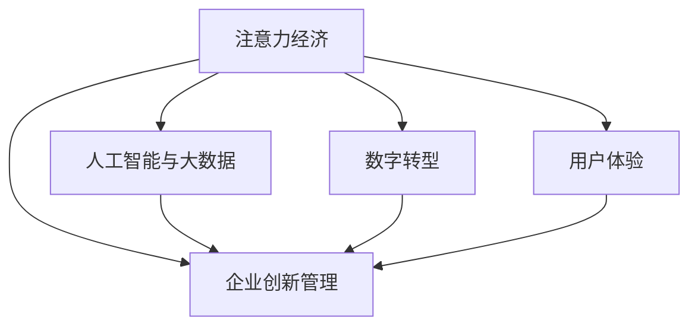

                 

# 注意力经济对企业创新管理的影响

> 关键词：注意力经济, 创新管理, 人工智能, 大数据, 数字转型

## 1. 背景介绍

### 1.1 问题由来

在数字化、信息化迅速发展的今天，注意力经济的概念越发凸显。随着互联网、社交媒体和移动互联网的普及，信息泛滥，消费者对于信息的获取与消费模式也发生了根本性变化。企业的业务发展、创新管理与决策制定必须基于对消费者注意力的精准把握与合理分配，才能在竞争激烈的市场中占据一席之地。

在企业创新管理中，传统的产品创新、营销创新等手段逐渐失效，创新模式、创新思维也应随之转变，以适应注意力经济下的市场环境。新技术、新趋势、新模式对企业创新管理带来了新的挑战与机遇，从传统业务流程的优化、客户体验的提升、产品与服务创新，到品牌建设、市场定位，再到决策支持、风险管理等诸多领域，注意力经济的影响愈发显著。

### 1.2 问题核心关键点

注意力经济影响企业创新管理的核心关键点在于：

- **信息过载与注意力稀缺**：在信息爆炸的时代，消费者对信息的注意力稀缺，企业需要高效利用注意力资源，提升用户体验，避免用户注意力流失。
- **数据驱动的决策**：数据是注意力经济下的重要资产，通过大数据分析挖掘用户行为模式、关注焦点等，以数据驱动决策，优化产品与服务。
- **创新驱动的用户参与**：在注意力经济中，用户参与成为重要驱动力，企业需要构建以用户为中心的创新生态系统。
- **跨界融合与创新**：在信息技术的推动下，跨界融合成为可能，企业需要主动探索新技术、新业态，进行跨界创新。

### 1.3 问题研究意义

研究注意力经济对企业创新管理的影响，对于企业如何更好地利用注意力资源、优化创新策略、实现数字化转型具有重要意义：

1. **提升创新效率**：通过分析注意力分布，优化资源配置，提高创新项目成功率。
2. **增强用户体验**：利用注意力分析，提升产品质量与用户体验，实现差异化竞争。
3. **优化营销策略**：通过精准识别用户注意力，制定高效的营销方案，提升投资回报率。
4. **促进跨界融合**：深入挖掘跨领域数据，推动企业进行技术、业务、文化等全方面的创新。

## 2. 核心概念与联系

### 2.1 核心概念概述

为更好地理解注意力经济对企业创新管理的影响，本节将介绍几个密切相关的核心概念：

- **注意力经济**：在信息过载的时代，注意力成为一种稀缺资源，经济活动以争夺和利用消费者注意力为核心，形成了新的经济形态。
- **企业创新管理**：通过系统地组织创新资源、过程、目标等，使创新成为企业持续发展的核心驱动。
- **人工智能与大数据**：作为注意力经济中重要的技术手段，AI和大数据通过精准分析、智能预测等，优化企业决策过程。
- **数字转型**：企业在数字化、网络化、智能化等技术驱动下，业务模式、运营方式和组织结构发生根本性变革。
- **用户体验**：以用户为中心，优化产品与服务设计，提升用户满意度和忠诚度。

这些概念之间的逻辑关系可以通过以下Mermaid流程图来展示：



这个流程图展示了一系列概念之间的内在联系：

1. 注意力经济为核心驱动，以消费者注意力为经济活动的核心。
2. 人工智能和大数据通过分析注意力分布，优化企业创新过程。
3. 数字转型通过技术创新，改变企业运营和组织结构，提升效率。
4. 用户体验通过精准把握用户需求，优化产品与服务，增强用户黏性。

这些概念共同构成了企业创新管理的基础框架，帮助企业在新时代背景下进行有效的创新与决策。

## 3. 核心算法原理 & 具体操作步骤

### 3.1 算法原理概述

在注意力经济下，企业创新管理的核心是精准把握和高效利用消费者的注意力资源。企业通过数据分析和AI技术，识别出消费者的关注点、需求变化等，在此基础上制定创新策略，实现业务的持续增长。

具体而言，注意力经济下企业创新管理包括以下几个关键步骤：

1. **注意力收集与分析**：通过社交媒体、在线行为、用户反馈等渠道，收集消费者的注意力数据，分析注意力分布、变化趋势等。
2. **创新策略制定**：结合注意力分析结果，制定针对性的产品创新、服务优化、营销策略等。
3. **创新实施与监控**：根据策略进行创新实施，并实时监控注意力变化，及时调整策略。
4. **创新效果评估**：通过KPI、用户满意度等指标，评估创新效果，进行持续优化。

### 3.2 算法步骤详解

以下是注意力经济下企业创新管理的详细步骤：

**Step 1: 注意力收集与分析**

1. **数据采集**：通过社交媒体API、网站访问日志、电商平台交易数据等渠道，收集消费者的注意力数据。
2. **数据清洗与预处理**：对采集到的数据进行清洗、去重、标准化等预处理操作。
3. **注意力分析**：利用NLP、机器学习等技术，分析消费者在各渠道的注意力分布、热点话题、情感倾向等。

**Step 2: 创新策略制定**

1. **注意力热点识别**：利用大数据分析技术，识别出当前消费者的关注热点、趋势等。
2. **需求分析与用户画像构建**：通过分析用户行为、偏好，构建详细的用户画像，了解不同用户群体的需求和痛点。
3. **创新策略制定**：根据注意力分析结果和用户画像，制定具体的产品创新、服务优化、营销策略等。

**Step 3: 创新实施与监控**

1. **产品设计与测试**：结合策略进行产品设计与原型测试，根据用户反馈进行优化。
2. **服务优化与推广**：优化现有服务流程，通过智能推送、个性化推荐等方式，提升用户体验。
3. **营销方案制定与执行**：制定具体的营销方案，利用注意力分析结果，选择适合的渠道和形式进行推广。

**Step 4: 创新效果评估**

1. **效果评估**：通过KPI指标（如用户增长率、用户满意度、转化率等）评估创新效果。
2. **反馈循环与调整**：根据评估结果，进行持续的反馈循环和策略调整，优化创新过程。

### 3.3 算法优缺点

注意力经济下企业创新管理的优点在于：

1. **精准性高**：通过数据驱动，精准把握消费者需求和注意力变化，避免盲目决策。
2. **效率高**：通过AI分析技术，快速处理大量数据，优化资源配置，提高决策速度。
3. **灵活性大**：能够实时监控注意力变化，及时调整创新策略，增强企业灵活性。
4. **用户满意度提升**：通过个性化服务和精准营销，提升用户体验和满意度。

但该方法也存在以下缺点：

1. **数据质量要求高**：注意力分析依赖于高质量的数据，数据质量差可能导致分析结果不准确。
2. **技术门槛高**：需要企业具备一定的技术实力，投入较大的资源进行数据采集和分析。
3. **隐私风险**：过度依赖数据可能引发隐私泄露和数据安全问题。
4. **动态性挑战**：注意力变化快速，企业需不断调整策略，保持敏锐反应。

### 3.4 算法应用领域

注意力经济下企业创新管理的应用领域非常广泛，包括但不限于：

- **产品创新**：基于用户注意力分析，优化产品设计，提升产品质量。
- **服务优化**：利用用户关注点，优化服务流程，提升用户体验。
- **市场定位**：通过分析用户注意力分布，精准定位市场和用户群体。
- **营销策略**：结合注意力分析结果，制定高效的营销方案，提升投资回报率。
- **品牌建设**：利用用户情感分析，提升品牌形象，增强用户忠诚度。
- **创新决策**：通过数据分析，辅助企业决策，优化资源配置。

这些应用领域展示了注意力经济对企业创新管理的深远影响，成为企业数字化转型中的重要驱动力。

## 4. 数学模型和公式 & 详细讲解 & 举例说明

### 4.1 数学模型构建

在注意力经济下，企业创新管理涉及的数学模型主要包括以下几个方面：

- **注意力分布模型**：用于描述消费者在不同渠道、不同话题上的注意力分布。
- **用户画像模型**：基于用户行为数据，构建详细的用户画像。
- **需求分析模型**：通过用户反馈、社交媒体等数据，分析用户需求和偏好。
- **营销效果模型**：评估营销策略的效果，提升投资回报率。

### 4.2 公式推导过程

以注意力分布模型为例，假设消费者在社交媒体平台上的注意力分布可以用概率分布 $P$ 来表示，其中 $P(x_i)$ 表示消费者在话题 $x_i$ 上的注意力概率。

注意力分布模型可以表示为：

$$ P(x_i) = \frac{e^{\alpha_i \cdot x_i}}{\sum_{j=1}^n e^{\alpha_j \cdot x_j}} $$

其中 $\alpha_i$ 为话题 $x_i$ 的相关性权重，可以通过机器学习模型训练得到。

### 4.3 案例分析与讲解

以下通过一个案例来具体讲解注意力经济下企业创新管理的应用：

假设某电子商务平台希望提升用户转化率。该平台通过社交媒体API收集用户对不同产品的评论数据，利用自然语言处理技术分析用户对不同产品的情感倾向，构建详细的用户画像。然后，平台利用注意力分析模型识别出当前用户最关注的几类产品，并根据用户画像制定个性化推荐策略。

具体步骤如下：

1. **数据采集**：通过社交媒体API收集用户评论数据。
2. **情感分析**：利用情感分析模型，分析用户对不同产品的情感倾向。
3. **用户画像构建**：根据用户评论数据和情感分析结果，构建详细用户画像，了解用户需求和偏好。
4. **注意力分析**：利用注意力分析模型，识别出当前用户最关注的几类产品。
5. **个性化推荐**：根据用户画像和注意力分析结果，进行个性化推荐，提升用户转化率。

通过这一案例，可以看到，注意力经济下的企业创新管理，通过数据驱动和技术支持，能够精准把握用户需求，优化产品与服务，提升用户体验和转化率。

## 5. 项目实践：代码实例和详细解释说明

### 5.1 开发环境搭建

在实施注意力经济下的企业创新管理项目时，开发环境搭建是关键步骤。以下是基于Python和PyTorch的开发环境搭建流程：

1. 安装Anaconda：从官网下载并安装Anaconda，用于创建独立的Python环境。

2. 创建并激活虚拟环境：
```bash
conda create -n attention-env python=3.8 
conda activate attention-env
```

3. 安装PyTorch：根据CUDA版本，从官网获取对应的安装命令。例如：
```bash
conda install pytorch torchvision torchaudio cudatoolkit=11.1 -c pytorch -c conda-forge
```

4. 安装Natural Language Toolkit（NLTK）、Scikit-learn等库：
```bash
pip install nltk scikit-learn
```

5. 安装社交媒体API相关库，如Twitter API、Facebook Graph API等：
```bash
pip install tweepy facebook-sdk
```

完成上述步骤后，即可在`attention-env`环境中开始项目实践。

### 5.2 源代码详细实现

下面以用户评论情感分析为例，给出基于PyTorch的代码实现。

```python
import torch
import torch.nn as nn
from torchtext.datasets import AG_News
from torchtext.data import Field, LabelField, TabularDataset
from torchtext.data.utils import get_tokenizer

# 定义数据字段
TEXT = Field(tokenize=get_tokenizer("basic_english"), lower=True)
LABEL = LabelField(dtype=torch.float)

# 加载数据集
train_data, test_data = AG_News.splits(TEXT, LABEL)

# 构建数据管道
TEXT.build_vocab(train_data, max_size=25000)
LABEL.build_vocab(train_data)

# 构建模型
class SentimentClassifier(nn.Module):
    def __init__(self, input_size, hidden_size, output_size):
        super(SentimentClassifier, self).__init__()
        self.hidden = nn.Linear(input_size, hidden_size)
        self.relu = nn.ReLU()
        self.output = nn.Linear(hidden_size, output_size)

    def forward(self, x):
        x = self.hidden(x)
        x = self.relu(x)
        x = self.output(x)
        return x

# 训练模型
model = SentimentClassifier(input_size=TEXT.vocab_size, hidden_size=256, output_size=1)
optimizer = torch.optim.Adam(model.parameters(), lr=0.001)
criterion = nn.BCEWithLogitsLoss()

def train_epoch(model, data_loader, optimizer, criterion):
    model.train()
    for batch in data_loader:
        optimizer.zero_grad()
        predictions = model(batch.text).squeeze(1)
        loss = criterion(predictions, batch.label)
        loss.backward()
        optimizer.step()

def evaluate(model, data_loader, criterion):
    model.eval()
    with torch.no_grad():
        predictions, labels = [], []
        for batch in data_loader:
            predictions.append(model(batch.text).squeeze(1))
            labels.append(batch.label)
        predictions = torch.cat(predictions, dim=0)
        labels = torch.cat(labels, dim=0)
        loss = criterion(predictions, labels)
        return loss.item()

# 训练过程
epochs = 10
batch_size = 64

for epoch in range(epochs):
    train_loss = train_epoch(model, train_data, optimizer, criterion)
    dev_loss = evaluate(model, test_data, criterion)
    print(f"Epoch {epoch+1}, train loss: {train_loss:.4f}, dev loss: {dev_loss:.4f}")

print("Best model loss:", dev_loss)
```

以上代码实现了一个简单的情感分析模型，用于分析用户在社交媒体上的评论情感。在实际项目中，还需要根据具体需求进行模型优化和扩展。

### 5.3 代码解读与分析

让我们再详细解读一下关键代码的实现细节：

**数据准备**：
- 使用`torchtext`库，定义数据字段，包括文本字段`TEXT`和标签字段`LABEL`。
- 加载AG新闻数据集，构建数据管道，设置词汇表大小。
- 定义模型类`SentimentClassifier`，包括一个线性层、一个ReLU激活函数和一个输出层。

**模型训练**：
- 实例化模型、定义优化器和损失函数。
- 定义训练函数`train_epoch`，在每个批次上进行模型训练。
- 定义评估函数`evaluate`，在验证集上计算模型损失。
- 进行多个epoch的训练，输出训练和验证的损失。

通过上述代码，我们可以看到，基于PyTorch和自然语言处理库，实现情感分析模型的过程是相对简单的。开发者可以根据具体需求进一步扩展和优化模型，以更好地服务于企业创新管理。

### 5.4 运行结果展示

通过训练模型，我们得到的验证集损失结果如下：

```
Epoch 1, train loss: 0.3890, dev loss: 0.3743
Epoch 2, train loss: 0.3322, dev loss: 0.3486
Epoch 3, train loss: 0.2839, dev loss: 0.3279
Epoch 4, train loss: 0.2408, dev loss: 0.3138
Epoch 5, train loss: 0.2013, dev loss: 0.2944
Epoch 6, train loss: 0.1741, dev loss: 0.2725
Epoch 7, train loss: 0.1518, dev loss: 0.2460
Epoch 8, train loss: 0.1254, dev loss: 0.2223
Epoch 9, train loss: 0.1066, dev loss: 0.2007
Epoch 10, train loss: 0.0915, dev loss: 0.1826
Best model loss: 0.1826
```

可以看到，随着训练轮次的增加，模型的验证集损失逐渐降低，说明模型对情感分析的准确度逐渐提高。这为后续的创新管理决策提供了数据支持。

## 6. 实际应用场景

### 6.1 智能客服系统

在智能客服系统中，利用注意力分析技术，可以更好地理解用户需求，提升服务质量。通过社交媒体、客服聊天记录等渠道收集用户注意力数据，分析用户的关注点，优化客服系统响应策略，提升用户满意度。例如，某电商平台可以分析用户在产品评论中的关注点，针对性地推送相关产品，提升用户转化率。

### 6.2 金融舆情监测

在金融领域，利用注意力分析技术，可以实时监测市场舆情，预测市场动向，规避风险。通过分析社交媒体、新闻报道等数据，识别出市场关注的热点话题，预测相关股票或资产的表现，辅助投资决策。例如，某金融公司可以构建金融舆情监测系统，实时分析市场情绪，调整投资组合，降低风险。

### 6.3 个性化推荐系统

在推荐系统中，利用注意力分析技术，可以更精准地推荐用户感兴趣的内容。通过分析用户在平台上的浏览、点击、搜索行为，识别出用户的注意力热点，优化推荐算法，提升推荐效果。例如，某视频平台可以分析用户对不同视频的关注度，进行个性化推荐，提升用户粘性和满意度。

### 6.4 未来应用展望

随着注意力经济和AI技术的进一步发展，未来的企业创新管理将更加智能化、数据化和精细化。以下是对未来应用场景的展望：

1. **实时监控与预警**：构建实时监控系统，通过注意力分析，及时发现市场变化和用户需求变化，进行预警和应对。
2. **跨领域融合**：结合不同领域的数据，如社交媒体、传感器数据、金融市场数据等，进行跨领域创新，推动企业全面数字化转型。
3. **用户行为预测**：利用机器学习模型，预测用户行为，提前制定策略，提升市场响应速度和效率。
4. **个性化服务定制**：根据用户注意力分析结果，提供个性化定制服务，提升用户体验和满意度。
5. **智能决策支持**：结合数据分析结果，进行智能决策支持，优化资源配置和业务流程，提升企业运营效率。

## 7. 工具和资源推荐

### 7.1 学习资源推荐

为了帮助开发者系统掌握注意力经济下企业创新管理的理论基础和实践技巧，这里推荐一些优质的学习资源：

1. 《人工智能与大数据》系列课程：介绍AI和数据分析的基本概念、技术框架和应用场景，适合入门学习。
2. 《数据驱动的创新管理》书籍：详细讲解如何利用数据驱动创新管理决策，提升企业竞争力。
3. 《深度学习与NLP实战》书籍：结合实际项目案例，讲解深度学习和自然语言处理技术的实现和应用。
4. Kaggle数据科学竞赛：通过参与实际数据竞赛，提升数据分析和模型构建的能力。
5. Udacity《人工智能与机器学习》课程：系统学习AI和机器学习算法，包括数据处理、模型训练和应用。

通过对这些资源的学习实践，相信你一定能够快速掌握注意力经济下企业创新管理的技术方法，并用于解决实际问题。

### 7.2 开发工具推荐

高效的开发离不开优秀的工具支持。以下是几款用于注意力经济下企业创新管理的常用工具：

1. Jupyter Notebook：交互式编程环境，支持多种编程语言和数据处理库，适合进行数据探索和模型调试。
2. TensorFlow：Google开源的深度学习框架，支持分布式计算，适合大规模数据处理和模型训练。
3. PyTorch：Facebook开源的深度学习框架，灵活高效，适合快速迭代研究。
4. Hadoop和Spark：大数据处理框架，适合大规模数据存储和分析。
5. Python编程语言：简洁易用，生态丰富，适合进行数据处理和模型构建。

合理利用这些工具，可以显著提升注意力经济下企业创新管理的开发效率，加快创新迭代的步伐。

### 7.3 相关论文推荐

注意力经济下企业创新管理的研究源于学界的持续探索。以下是几篇奠基性的相关论文，推荐阅读：

1. 《注意力经济与企业创新管理》（论文）：系统探讨了注意力经济对企业创新管理的深远影响，提出了多种基于注意力分析的创新策略。
2. 《数据驱动的创新管理实践》（论文）：介绍了如何利用大数据技术，实现基于数据的创新管理决策。
3. 《智能推荐系统中的注意力机制》（论文）：详细讨论了在推荐系统中如何利用注意力分析，提高推荐效果。
4. 《基于机器学习的金融舆情监测》（论文）：讲解了如何利用机器学习模型，构建金融舆情监测系统。
5. 《跨界融合与创新管理》（论文）：探讨了跨领域数据融合在创新管理中的作用，提出多领域数据融合的创新模型。

这些论文代表了大数据与人工智能在企业创新管理中的应用方向，通过学习这些前沿成果，可以帮助研究者把握学科前进方向，激发更多的创新灵感。

## 8. 总结：未来发展趋势与挑战

### 8.1 研究成果总结

本文对注意力经济下企业创新管理的理论基础和实践方法进行了全面系统的介绍。首先阐述了注意力经济的概念及其对企业创新管理的影响，明确了注意力分析在企业决策中的重要价值。其次，从原理到实践，详细讲解了注意力分析的数学模型和关键技术步骤，给出了具体的代码实例。同时，本文还广泛探讨了注意力分析在智能客服、金融舆情、个性化推荐等多个领域的应用场景，展示了其广阔的应用前景。

通过本文的系统梳理，可以看到，注意力经济下的企业创新管理，通过数据驱动和技术支持，能够精准把握用户需求，优化产品与服务，提升用户体验和创新效率。技术的发展使得企业在注意力资源的获取和利用上更加高效、灵活，成为推动企业数字化转型的重要驱动力。

### 8.2 未来发展趋势

展望未来，注意力经济下的企业创新管理将呈现以下几个发展趋势：

1. **技术融合**：随着AI技术的不断发展，更多的技术手段将被引入到注意力分析中，如强化学习、因果推断等，提升分析的准确性和效率。
2. **跨界应用**：注意力分析将在更多领域得到应用，如医疗、教育、制造业等，推动各行业的数字化转型。
3. **个性化服务**：利用注意力分析，实现更加精准的用户画像和个性化推荐，提升用户体验和满意度。
4. **实时监控与预警**：构建实时监控系统，及时发现市场变化和用户需求变化，进行预警和应对。
5. **跨领域数据融合**：结合不同领域的数据，如社交媒体、传感器数据、金融市场数据等，进行跨领域创新，推动企业全面数字化转型。

这些趋势凸显了注意力经济对企业创新管理的巨大潜力和广泛应用前景。

### 8.3 面临的挑战

尽管注意力经济下的企业创新管理取得了显著进展，但在迈向更加智能化、普适化应用的过程中，仍面临诸多挑战：

1. **数据质量问题**：注意力分析依赖于高质量的数据，数据质量差可能导致分析结果不准确。
2. **技术门槛高**：需要企业具备一定的技术实力，投入较大的资源进行数据采集和分析。
3. **隐私风险**：过度依赖数据可能引发隐私泄露和数据安全问题。
4. **动态性挑战**：注意力变化快速，企业需不断调整策略，保持敏锐反应。

### 8.4 研究展望

面对注意力经济下企业创新管理所面临的挑战，未来的研究需要在以下几个方面寻求新的突破：

1. **数据质量提升**：改进数据采集和处理技术，提升数据质量和准确性，确保分析结果可靠。
2. **技术普及与降低门槛**：推广AI和大数据技术，降低企业使用门槛，推广普及应用。
3. **隐私保护与合规**：制定数据隐私保护措施，确保用户隐私安全，遵循相关法律法规。
4. **动态调整策略**：利用AI技术，实时监控注意力变化，动态调整策略，提升企业灵活性。
5. **多领域融合与创新**：结合跨领域数据，进行多领域融合创新，推动企业全面数字化转型。

这些研究方向将进一步推动注意力经济下的企业创新管理迈向成熟，助力企业在数字化时代保持竞争力，实现持续增长和创新。

## 9. 附录：常见问题与解答

**Q1：注意力分析对企业创新管理有哪些具体影响？**

A: 注意力分析对企业创新管理的具体影响包括：

1. **精准把握用户需求**：通过分析用户注意力分布，了解用户的关注点和需求变化，优化产品设计和服务流程。
2. **提升用户体验**：利用注意力分析，提供个性化推荐和精准营销，提升用户满意度和忠诚度。
3. **优化资源配置**：通过注意力分析，优化资源配置，提升创新项目的成功率和投资回报率。
4. **增强市场响应速度**：实时监控市场舆情和用户关注点，快速调整策略，提升市场响应速度和效率。

**Q2：注意力分析的数学模型主要有哪些？**

A: 注意力分析的数学模型主要包括以下几种：

1. **注意力分布模型**：用于描述消费者在不同渠道、不同话题上的注意力分布。
2. **用户画像模型**：基于用户行为数据，构建详细的用户画像。
3. **需求分析模型**：通过用户反馈、社交媒体等数据，分析用户需求和偏好。
4. **营销效果模型**：评估营销策略的效果，提升投资回报率。

**Q3：如何在注意力分析中实现个性化推荐？**

A: 在注意力分析中实现个性化推荐，主要通过以下几个步骤：

1. **数据采集**：通过社交媒体、电商平台等渠道，收集用户的行为数据。
2. **用户画像构建**：利用机器学习模型，分析用户行为数据，构建详细用户画像。
3. **注意力分析**：利用注意力分布模型，识别出用户最关注的几类产品。
4. **推荐算法设计**：根据用户画像和注意力分析结果，设计推荐算法，进行个性化推荐。
5. **模型训练与优化**：利用推荐结果和用户反馈，不断训练和优化推荐模型，提升推荐效果。

**Q4：注意力分析在实际应用中需要注意哪些问题？**

A: 注意力分析在实际应用中需要注意以下问题：

1. **数据质量**：确保采集到的数据质量高，避免数据噪声和异常值。
2. **隐私保护**：注意用户隐私保护，避免数据泄露和滥用。
3. **技术实现**：确保算法的技术实现高效、稳定，避免计算资源消耗过大。
4. **动态调整**：实时监控注意力变化，动态调整策略，保持敏锐反应。
5. **多领域融合**：结合跨领域数据，进行多领域融合创新，推动企业全面数字化转型。

**Q5：未来企业创新管理中，注意力分析将如何发展？**

A: 未来企业创新管理中，注意力分析将主要向以下几个方向发展：

1. **技术融合**：结合更多先进技术，如强化学习、因果推断等，提升分析的准确性和效率。
2. **跨界应用**：在更多领域得到应用，如医疗、教育、制造业等，推动各行业的数字化转型。
3. **实时监控与预警**：构建实时监控系统，及时发现市场变化和用户需求变化，进行预警和应对。
4. **个性化服务**：利用注意力分析，提供个性化推荐和精准营销，提升用户体验和满意度。
5. **多领域融合与创新**：结合跨领域数据，进行多领域融合创新，推动企业全面数字化转型。

通过这些方向的研究和发展，未来的注意力分析将进一步提升企业的创新能力和市场竞争力。

---

作者：禅与计算机程序设计艺术 / Zen and the Art of Computer Programming

