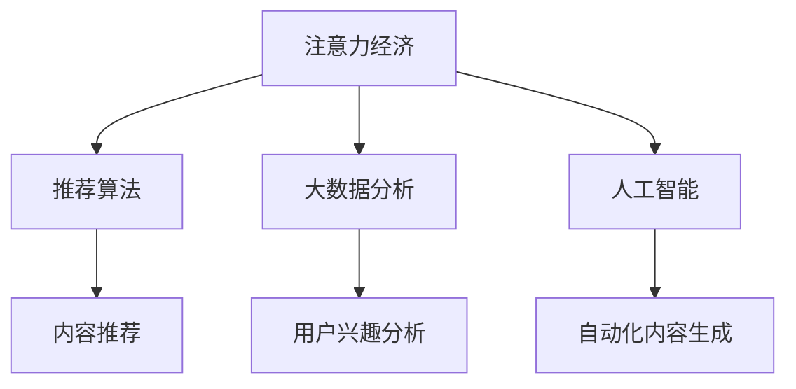

                 

# 注意力经济对传统媒体内容生产的影响

> 关键词：注意力经济, 传统媒体, 内容生产, 推荐算法, 大数据, 人工智能

## 1. 背景介绍

### 1.1 问题由来

在信息爆炸的时代，用户对内容的注意力资源变得愈发稀缺。媒体企业为了争夺用户的注意力资源，不得不从传统的内容生产模式向以数据和算法为驱动力的内容运营模式转变。这种转变，我们称之为“注意力经济”。

### 1.2 问题核心关键点

注意力经济的核心在于如何高效地获取、利用和引导用户的注意力资源，使其转化为商业价值。在注意力经济时代，传统媒体内容生产需要与推荐算法、大数据分析等新兴技术相结合，从而实现精准的内容推荐、提高用户参与度、实现商业变现。

### 1.3 问题研究意义

对注意力经济的研究，有助于传统媒体企业理解当前的市场趋势和用户需求变化，优化内容生产策略，提升竞争力。同时，这种研究也揭示了数字时代媒体内容生产的新模式，为未来的媒体融合发展提供了新的思路和方法。

## 2. 核心概念与联系

### 2.1 核心概念概述

为更好地理解注意力经济对传统媒体内容生产的影响，本节将介绍几个密切相关的核心概念：

- **注意力经济**：以用户注意力资源为核心，通过精准的内容推荐和个性化运营，实现内容价值最大化的一种经济形态。
- **推荐算法**：基于用户行为数据和兴趣模型，为用户提供个性化的内容推荐，从而提升用户参与度和满意度。
- **大数据分析**：利用海量的用户行为数据，分析用户兴趣和需求，指导内容生产与分发策略。
- **人工智能**：通过机器学习、自然语言处理等技术，提升内容生成、推荐和运营的自动化水平。

这些核心概念之间的逻辑关系可以通过以下Mermaid流程图来展示：



这个流程图展示了大数据、人工智能、推荐算法与注意力经济之间的逻辑关系：

1. 注意力经济通过推荐算法和大数据分析，精准地获取和利用用户注意力资源。
2. 人工智能技术通过自动化内容生成和推荐，提升内容生产效率和个性化程度。
3. 这些技术的融合，实现了精准的用户定位和内容匹配，从而最大化内容的商业价值。

## 3. 核心算法原理 & 具体操作步骤
### 3.1 算法原理概述

注意力经济的核心算法是推荐算法，其基本原理在于通过分析用户的行为数据和兴趣模型，预测用户可能感兴趣的内容，并优先推荐给用户。推荐算法可以大致分为三类：基于协同过滤的推荐、基于内容的推荐、基于混合模型的推荐。

在推荐过程中，系统会根据用户的历史行为数据和兴趣标签，计算出每个用户对不同内容的相关度评分，然后将评分较高的内容推荐给用户。这种方法在提升用户参与度和满意度方面表现出色，成为当前推荐系统的主流算法。

### 3.2 算法步骤详解

基于协同过滤的推荐算法步骤如下：

1. **数据收集**：从用户行为数据（如浏览、点击、评分等）中提取用户对不同内容的评分。
2. **用户建模**：基于用户的历史行为数据，构建用户兴趣模型，通常使用用户-内容矩阵或用户-内容协同矩阵。
3. **内容建模**：分析内容特征（如标题、关键词、分类等），构建内容-用户矩阵或内容-内容协同矩阵。
4. **计算评分**：通过矩阵乘法或其他方法，计算每个用户对每个内容的评分。
5. **排序推荐**：将计算出的评分进行排序，选取评分较高的内容进行推荐。

### 3.3 算法优缺点

基于协同过滤的推荐算法具有以下优点：

1. **个性化推荐**：能够根据用户历史行为数据和兴趣模型，实现个性化推荐，提升用户满意度。
2. **可扩展性强**：推荐系统可以处理海量用户和内容，适合大规模应用。
3. **用户隐私保护**：不需要了解用户的具体喜好，保护用户隐私。

同时，该算法也存在一定的局限性：

1. **数据稀疏性**：用户-内容矩阵或内容-内容协同矩阵通常比较稀疏，难以充分利用。
2. **冷启动问题**：新用户或新内容缺乏足够的历史数据，难以进行有效推荐。
3. **过拟合风险**：推荐系统容易过拟合用户的历史行为，导致推荐结果偏差。

### 3.4 算法应用领域

基于协同过滤的推荐算法已经在电子商务、新闻媒体、社交网络等多个领域得到了广泛应用，成为内容推荐系统的主流算法。在传统媒体领域，推荐算法同样具有广阔的应用前景，例如：

- 新闻推荐：根据用户的历史阅读数据，推荐相关新闻文章。
- 视频推荐：分析用户对视频的观看行为，推荐相似或相关视频。
- 活动推荐：根据用户对活动的参与和评价，推荐相关活动或内容。

## 4. 数学模型和公式 & 详细讲解
### 4.1 数学模型构建

推荐系统通常采用协同过滤模型，该模型的核心在于构建用户-内容评分矩阵，然后通过矩阵计算得到推荐结果。

设用户-内容矩阵为 $R$，内容-内容协同矩阵为 $I$，用户兴趣模型为 $U$，内容特征模型为 $V$。则推荐模型可以表示为：

$$
R = U \cdot I \cdot V^T
$$

其中 $U$ 和 $V$ 为低维向量，表示用户兴趣和内容特征。$I$ 为相似度矩阵，表示内容间的相似度。

### 4.2 公式推导过程

在协同过滤模型中，用户对内容 $i$ 的评分 $r_{ui}$ 可以表示为：

$$
r_{ui} = \sum_{j=1}^n U_j \cdot I_{ij} \cdot V_j^T
$$

其中 $U_j$ 和 $V_j$ 分别表示用户 $j$ 对内容 $i$ 的评分，$I_{ij}$ 表示内容 $i$ 和内容 $j$ 的相似度。

在实际应用中，为了提升推荐效果，可以对评分进行归一化处理：

$$
\hat{r}_{ui} = \frac{r_{ui}}{\sqrt{\sum_{k=1}^n U_k^2 \cdot V_k^2}}
$$

其中 $\hat{r}_{ui}$ 表示归一化后的评分。

### 4.3 案例分析与讲解

以视频推荐系统为例，假设有 $m$ 个用户和 $n$ 个视频，用户对视频的评分矩阵为 $R$。用户兴趣模型 $U$ 和视频特征模型 $V$ 均为低维向量。相似度矩阵 $I$ 表示视频间的相似度，可以通过余弦相似度、皮尔逊相关系数等方式计算。

推荐系统通过计算每个用户对每个视频的评分，并根据评分排序，推荐评分较高的视频。例如，对于用户 $i$，推荐评分较高的 $k$ 个视频，可以使用以下公式：

$$
\text{Recommendations}_i = \text{argmax}_j \left( \frac{R_{ij}}{\sqrt{\sum_{k=1}^n U_i^2 \cdot V_k^2}} \right), j=1,...,k
$$

## 5. 项目实践：代码实例和详细解释说明
### 5.1 开发环境搭建

在进行推荐系统开发前，我们需要准备好开发环境。以下是使用Python进行Scikit-learn开发的环境配置流程：

1. 安装Anaconda：从官网下载并安装Anaconda，用于创建独立的Python环境。

2. 创建并激活虚拟环境：
```bash
conda create -n recommendation-env python=3.8 
conda activate recommendation-env
```

3. 安装Scikit-learn和其他相关库：
```bash
pip install scikit-learn numpy pandas matplotlib sklearn tqdm
```

完成上述步骤后，即可在`recommendation-env`环境中开始推荐系统开发。

### 5.2 源代码详细实现

下面我们以协同过滤推荐系统为例，给出使用Scikit-learn库构建推荐系统的PyTorch代码实现。

首先，定义数据处理函数：

```python
import pandas as pd
from sklearn.metrics.pairwise import cosine_similarity

def load_data(file_path):
    data = pd.read_csv(file_path)
    user = data['user']
    item = data['item']
    rating = data['rating']
    return user, item, rating

def generate_item_matrix(user, item, rating, threshold=3):
    matrix = pd.DataFrame(rating, columns=item, index=user)
    matrix = matrix[matrix > threshold]
    return matrix
```

然后，定义模型和优化器：

```python
from sklearn.decomposition import TruncatedSVD
from scipy.sparse import csr_matrix

def train_model(matrix):
    svd = TruncatedSVD(n_components=50, random_state=42)
    U, V = svd.fit_transform(matrix)
    return U, V

def predict_user_item(matrix, U, V):
    matrix = matrix.tocsr()
    return matrix.dot(U.T).dot(V)

user, item, rating = load_data('ratings.csv')
item_matrix = generate_item_matrix(user, item, rating)
U, V = train_model(item_matrix)
```

接着，定义推荐函数：

```python
def recommend(user, matrix, U, V, k=5):
    user_index = user
    user_row = matrix[user_index].tocsr()
    user_score = predict_user_item(matrix, U, V).todense()
    user_row = user_row.todense()
    user_score = user_score[user_index]
    recommendations = user_row.argsort()[::-1].tolist()[:k]
    return item.reindex(recommendations).tolist()
```

最后，启动推荐流程：

```python
user = 1001  # 假设用户ID为1001
recommendations = recommend(user, item_matrix, U, V)
print(recommendations)
```

以上就是使用Scikit-learn对协同过滤推荐系统进行实现的完整代码。可以看到，Scikit-learn提供了简单易用的API接口，可以高效地实现协同过滤推荐算法。

### 5.3 代码解读与分析

让我们再详细解读一下关键代码的实现细节：

**load_data函数**：
- `load_data`方法：加载评分数据，将用户、内容、评分分别存储在`user`、`item`、`rating`变量中，返回给调用者。

**generate_item_matrix函数**：
- `generate_item_matrix`方法：对评分矩阵进行过滤和归一化，只保留评分大于阈值的数据，返回过滤后的评分矩阵。

**train_model函数**：
- `train_model`方法：使用TruncatedSVD算法对评分矩阵进行降维，得到用户兴趣模型`U`和内容特征模型`V`。

**predict_user_item函数**：
- `predict_user_item`方法：通过矩阵计算得到用户对每个内容的评分，返回评分矩阵。

**recommend函数**：
- `recommend`方法：根据用户ID、评分矩阵、用户兴趣模型和内容特征模型，生成推荐结果。

**启动推荐流程**：
- 定义一个具体的用户ID，调用`recommend`函数，生成推荐内容列表。

可以看到，Scikit-learn的推荐系统代码实现相对简洁高效，开发者可以将更多精力放在数据处理和模型改进等高层逻辑上，而不必过多关注底层的实现细节。

当然，工业级的系统实现还需考虑更多因素，如模型的保存和部署、超参数的自动搜索、更灵活的推荐算法等。但核心的推荐范式基本与此类似。

## 6. 实际应用场景
### 6.1 新闻媒体

在新闻媒体领域，推荐算法可以显著提升用户阅读体验和平台粘性。传统的新闻推荐系统多采用基于内容的推荐方法，根据文章的主题、关键词、作者等特征，对新闻进行分类和标签化，然后基于用户的历史阅读行为和兴趣模型，进行个性化推荐。

例如，某新闻平台可以根据用户阅读历史数据，构建用户兴趣模型，然后根据文章的内容特征（如标题、作者、标签等），生成个性化新闻推荐列表。同时，系统还可以根据用户的即时反馈（如点击、阅读、分享等），动态调整推荐算法，提升推荐效果。

### 6.2 视频平台

视频平台需要高效地为用户推荐视频内容，提高平台活跃度和用户满意度。视频推荐系统通常采用基于协同过滤的推荐算法，根据用户的历史观看行为和内容标签，进行个性化推荐。

例如，某视频平台可以根据用户的历史观看数据，构建用户兴趣模型，然后根据视频的内容特征（如标题、时长、分类等），生成个性化视频推荐列表。同时，系统还可以根据用户的即时反馈（如点赞、评论、分享等），动态调整推荐算法，提升推荐效果。

### 6.3 电商购物

电商平台需要为用户推荐商品，提高用户购买率和平台销售额。电商推荐系统通常采用基于协同过滤的推荐算法，根据用户的历史购买行为和商品特征，进行个性化推荐。

例如，某电商平台可以根据用户的历史购买记录，构建用户兴趣模型，然后根据商品的内容特征（如价格、品牌、评分等），生成个性化商品推荐列表。同时，系统还可以根据用户的即时反馈（如点击、购买、评价等），动态调整推荐算法，提升推荐效果。

### 6.4 未来应用展望

随着推荐算法和大数据分析技术的不断发展，基于注意力经济的推荐系统将在更多领域得到应用，为传统行业带来变革性影响。

在智慧城市治理中，推荐算法可以用于智能交通、公共服务、环境监测等环节，提升城市管理的智能化水平，构建更安全、高效的城市运行系统。

在医疗健康领域，推荐算法可以用于疾病诊断、药品推荐、健康咨询等环节，辅助医生诊疗，提高医疗服务的智能化水平。

在金融理财领域，推荐算法可以用于股票推荐、理财建议、金融产品推荐等环节，帮助用户做出更好的投资决策。

此外，在教育培训、旅游旅游、农业农业等领域，推荐算法也有广泛的应用前景，为各行各业带来新的发展机遇。相信随着技术的日益成熟，推荐系统必将逐步融入各行各业的数字化转型，为社会经济的发展注入新的活力。

## 7. 工具和资源推荐
### 7.1 学习资源推荐

为了帮助开发者系统掌握注意力经济和推荐算法的理论基础和实践技巧，这里推荐一些优质的学习资源：

1. 《推荐系统基础》系列书籍：由推荐算法专家撰写，系统介绍了推荐系统的基本概念、算法和应用。

2. 《Python推荐系统实践》课程：由Coursera平台提供的推荐系统在线课程，涵盖了推荐算法、数据处理、模型训练等各个方面。

3. 《Deep Learning for Recommendation Systems》书籍：由深度学习专家撰写，介绍了深度学习在推荐系统中的应用和实现方法。

4. 《Kaggle推荐系统竞赛》项目：Kaggle平台上的推荐系统竞赛项目，提供了丰富的数据集和模型样例，适合实战练习。

通过对这些资源的学习实践，相信你一定能够快速掌握推荐算法的精髓，并用于解决实际的推荐问题。
###  7.2 开发工具推荐

高效的开发离不开优秀的工具支持。以下是几款用于推荐系统开发的常用工具：

1. Scikit-learn：基于Python的机器学习库，提供了丰富的算法和工具，适合推荐系统开发。

2. TensorFlow和PyTorch：主流的深度学习框架，支持大规模推荐系统的训练和部署。

3. Jupyter Notebook：免费的交互式编程环境，支持代码编写、调试和数据可视化，适合数据分析和算法实验。

4. Apache Spark：大规模数据处理框架，适合处理和分析海量的用户行为数据，支持分布式推荐系统开发。

5. Elasticsearch：全文搜索引擎，适合构建推荐系统的索引和查询系统。

合理利用这些工具，可以显著提升推荐系统开发的效率，加快创新迭代的步伐。

### 7.3 相关论文推荐

推荐系统的发展源于学界的持续研究。以下是几篇奠基性的相关论文，推荐阅读：

1. "Trustworthy Recommendation Algorithms" by Wiseman et al.：介绍了推荐系统的信任度评价方法，解决推荐系统中的信任度问题。

2. "Latent Feature Analysis using Singular Value Decomposition" by Halko et al.：提出了奇异值分解算法，用于推荐系统中的矩阵分解和降维。

3. "Collaborative Filtering for Implicit Feedback Datasets" by Koren et al.：介绍了协同过滤算法的基本原理和实现方法，成为推荐系统的主流算法。

4. "Item-Based Collaborative Filtering Recommendation Algorithms" by Resh et al.：介绍了基于内容的推荐算法，适用于推荐系统中的特征建模。

5. "Deep Learning Recommendation Systems: A Survey and Tasks" by Zhang et al.：综述了深度学习在推荐系统中的应用，探讨了深度学习算法的未来方向。

这些论文代表了大数据、推荐系统的发展脉络。通过学习这些前沿成果，可以帮助研究者把握学科前进方向，激发更多的创新灵感。

## 8. 总结：未来发展趋势与挑战
### 8.1 总结

本文对注意力经济和推荐算法的理论基础进行了系统介绍，并结合具体实例，展示了推荐算法在传统媒体内容生产中的应用。推荐算法的广泛应用，标志着传统媒体内容生产方式的深刻变革，为媒体企业带来了新的机遇和挑战。

通过本文的系统梳理，可以看到，注意力经济和推荐算法的发展，正在引领传统媒体内容生产走向智能化、个性化、精准化，为媒体融合发展提供了新的思路和方法。

### 8.2 未来发展趋势

展望未来，推荐算法和大数据分析技术将呈现以下几个发展趋势：

1. **个性化推荐**：随着用户数据的积累和算法的进步，推荐系统将能够实现更加精准、个性化的推荐，提升用户满意度和平台粘性。

2. **多模态推荐**：推荐系统将融合图像、视频、语音等多模态信息，提供更加全面、丰富的推荐内容，满足用户的多样化需求。

3. **动态推荐**：推荐系统将实时监测用户行为，动态调整推荐策略，实现更高效、实时的推荐服务。

4. **实时反馈机制**：推荐系统将引入即时反馈机制，实时调整推荐算法，提升推荐效果和用户体验。

5. **智能推荐引擎**：推荐系统将集成更多的智能技术，如自然语言处理、机器学习、知识图谱等，提升推荐算法的智能化水平。

这些趋势凸显了推荐算法的巨大潜力，将进一步推动媒体内容生产的智能化转型，为传统媒体行业带来新的变革。

### 8.3 面临的挑战

尽管推荐算法在实际应用中取得了显著效果，但仍面临诸多挑战：

1. **数据隐私问题**：推荐系统需要收集大量用户数据，涉及隐私保护问题。如何在保护用户隐私的同时，提高推荐效果，成为一大难题。

2. **冷启动问题**：新用户和新内容缺乏足够的历史数据，难以进行有效推荐。如何解决冷启动问题，是推荐系统的重要研究方向。

3. **过拟合问题**：推荐系统容易过拟合用户的历史行为，导致推荐结果偏差。如何避免过拟合，提高推荐系统的泛化能力，仍需进一步研究。

4. **推荐多样性**：推荐系统可能倾向于推荐相似内容，导致用户体验单一。如何在推荐结果中引入多样性，是推荐系统的重要优化方向。

5. **计算资源消耗**：推荐系统的计算复杂度高，大规模部署需要高算力支持。如何提高推荐算法的计算效率，降低资源消耗，仍需进一步研究。

6. **推荐系统的公平性**：推荐系统可能存在偏见，导致某些用户或内容被忽视。如何确保推荐系统的公平性，避免偏见和歧视，成为推荐系统的重要研究课题。

### 8.4 研究展望

未来，推荐算法的研究方向将更加广泛和深入，重点关注以下几个方面：

1. **跨模态推荐**：融合多种模态信息，提升推荐系统的准确性和用户体验。

2. **因果推断**：通过因果推断技术，揭示用户行为背后的原因，提升推荐算法的可解释性和鲁棒性。

3. **深度学习融合**：将深度学习技术与推荐系统结合，提升推荐算法的智能化水平。

4. **联邦学习**：在保护用户隐私的前提下，实现跨平台的数据共享和推荐系统优化。

5. **公平性研究**：探索推荐系统中的公平性问题，构建无偏见的推荐算法。

这些研究方向将推动推荐算法的不断进步，为传统媒体内容生产提供更加智能、精准、个性化的解决方案，引领媒体融合发展的未来趋势。

## 9. 附录：常见问题与解答

**Q1：推荐算法如何缓解冷启动问题？**

A: 冷启动问题通常通过以下方法缓解：
1. **新用户/内容推荐**：对新用户和新内容，推荐系统可以基于用户的兴趣模型或内容特征，进行初始化推荐，逐步学习用户行为。
2. **用户行为增强**：通过用户行为记录、社交网络、兴趣爱好等方式，增强新用户的历史行为数据。
3. **协同过滤融合**：结合基于协同过滤的推荐和基于内容的推荐，提升推荐效果。

**Q2：推荐系统如何保护用户隐私？**

A: 推荐系统通常通过以下方式保护用户隐私：
1. **数据匿名化**：对用户数据进行去标识化处理，保护用户隐私。
2. **差分隐私**：在推荐算法中加入噪声，降低用户隐私泄露的风险。
3. **数据加密**：对用户数据进行加密存储和传输，防止数据泄露。
4. **隐私保护算法**：采用隐私保护算法，如联邦学习、差分隐私等，保护用户隐私。

**Q3：推荐系统如何应对过拟合问题？**

A: 推荐系统通常通过以下方式应对过拟合问题：
1. **正则化**：在推荐算法中加入L1或L2正则项，防止过拟合。
2. **dropout**：在推荐系统中加入dropout机制，减少过拟合风险。
3. **样本增强**：通过数据增强、对抗样本等方式，提高推荐算法的鲁棒性。
4. **模型融合**：结合多种推荐算法，提升推荐系统的泛化能力。

**Q4：推荐系统如何提升推荐多样性？**

A: 推荐系统通常通过以下方式提升推荐多样性：
1. **多样性约束**：在推荐算法中加入多样性约束，确保推荐结果的多样性。
2. **多模态融合**：融合多种模态信息，提升推荐结果的多样性。
3. **推荐序列生成**：通过生成推荐序列，增加推荐结果的多样性。

**Q5：推荐系统如何提高计算效率？**

A: 推荐系统通常通过以下方式提高计算效率：
1. **特征压缩**：通过特征降维、稀疏化等方式，减少计算量。
2. **分布式计算**：利用分布式计算框架，提升推荐系统的计算效率。
3. **缓存机制**：通过缓存机制，减少重复计算，提高计算效率。

这些问题的回答，揭示了推荐系统在实际应用中面临的诸多挑战，同时也展示了应对这些挑战的研究方向和方法。通过深入理解这些关键问题，可以更好地掌握推荐算法的精髓，为实际应用提供有力的技术支撑。

---

作者：禅与计算机程序设计艺术 / Zen and the Art of Computer Programming

