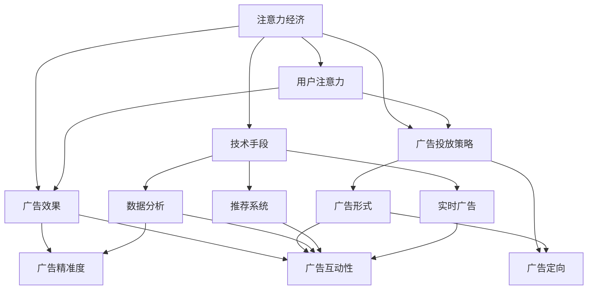

                 

# 注意力经济对传统媒体广告效果的影响

## 1. 背景介绍

随着信息技术的迅猛发展，尤其是移动互联网和社交媒体的普及，人类的信息获取方式发生了深刻的变化。传统媒体，如电视、报纸、广播等，受到数字化和网络化的冲击，其广告效果也面临着巨大的挑战。在此背景下，注意力经济（Attention Economy）的概念应运而生。注意力经济强调在信息爆炸的时代，如何通过有效的注意力获取和分配，实现广告和营销目标。

### 1.1 注意力经济概述
注意力经济是指在信息过载时代，个人和机构通过各种手段争夺公众的注意力，以实现商业目的的经济形态。在注意力经济中，注意力成为一种稀缺资源，广告主和媒体机构需要借助各种创新手段，吸引和维持用户的注意力，从而提升广告效果。

### 1.2 传统媒体广告的困境
传统媒体广告效果不佳主要有以下原因：

- **用户注意力分散**：现代用户获取信息的渠道多样，注意力分散在各种媒体平台上，传统媒体难以吸引和维持用户的注意力。
- **广告形式单一**：传统的电视、报纸等媒体广告形式单一，缺乏互动性和个性化，难以满足用户多样化的需求。
- **广告精准度低**：传统媒体广告多为大众传播，缺乏精准定向能力，难以精准触达目标受众。
- **广告效果难以衡量**：传统媒体广告效果多依赖于收视率、阅读量等单一指标，难以全面衡量广告的实际影响。

## 2. 核心概念与联系

### 2.1 核心概念概述
为了更好地理解注意力经济对传统媒体广告效果的影响，本文将介绍几个核心概念及其相互联系：

- **注意力经济**：指在信息过载时代，个人和机构通过各种手段争夺公众的注意力，以实现商业目的的经济形态。
- **用户注意力**：指用户对信息内容的关注程度，是广告效果的重要衡量指标。
- **广告效果**：指广告传播活动在受众中产生的实际影响，包括品牌认知、行为改变、销售转化等。
- **广告投放策略**：指广告主和媒体机构为实现广告效果所采取的具体措施，如广告形式、投放时间、定向受众等。
- **技术手段**：指通过技术手段提升广告效果的方法，如数据挖掘、个性化推荐、精准定向等。

这些概念之间的逻辑关系可以通过以下Mermaid流程图来展示：



这个流程图展示了几者之间的逻辑关系：

1. 注意力经济依赖于用户注意力，通过广告投放策略和技术手段争夺注意力，从而实现广告效果。
2. 广告效果由广告精准度和广告互动性共同决定。
3. 广告投放策略包括广告形式和广告定向，旨在提高广告精准度和互动性。
4. 技术手段如数据分析、推荐系统和实时广告，通过提升广告精准度和互动性来提升广告效果。

## 3. 核心算法原理 & 具体操作步骤

### 3.1 算法原理概述
注意力经济对传统媒体广告效果的优化，主要通过以下几个核心算法实现：

- **用户注意力分析**：通过数据分析手段，识别用户对广告内容的关注度，分析用户的注意力分布。
- **广告精准定向**：利用用户画像和行为数据，实现广告的精准定向投放，确保广告触达目标受众。
- **广告互动设计**：通过互动设计，如互动式广告、游戏化广告等，提升用户对广告的参与度和互动性。
- **广告效果评估**：通过多维度数据评估广告效果，如点击率、转化率、品牌认知度等，实时调整广告策略。

### 3.2 算法步骤详解
以下是具体的算法步骤：

1. **数据采集**：收集用户在媒体平台上的行为数据，包括浏览历史、点击行为、购买记录等，构建用户画像。
2. **用户注意力分析**：利用数据挖掘和机器学习算法，分析用户对广告内容的关注度和停留时间，识别出用户的注意力热点。
3. **广告精准定向**：根据用户画像和注意力热点，通过算法实现广告的精准定向投放，确保广告触达目标受众。
4. **广告互动设计**：设计互动广告形式，如互动式广告、游戏化广告等，增强用户参与度和互动性。
5. **广告效果评估**：通过多维度数据评估广告效果，如点击率、转化率、品牌认知度等，实时调整广告策略。

### 3.3 算法优缺点
注意力经济对传统媒体广告效果优化的算法具有以下优点：

- **提升广告精准度**：通过精准定向投放，提高广告的触达效率，减少浪费。
- **增强用户参与度**：通过互动设计，提升用户对广告的参与度和互动性，增加广告的吸引力和转化率。
- **实时优化广告策略**：通过实时数据分析和效果评估，快速调整广告策略，提高广告效果。

同时，也存在以下缺点：

- **数据隐私问题**：在用户数据采集和分析过程中，可能涉及用户隐私保护问题，需要严格遵守数据隐私法律法规。
- **算法复杂度**：实现精准定向和互动设计的算法较为复杂，需要一定的技术积累和数据量支持。
- **成本较高**：在数据采集和算法实现过程中，可能涉及较大的成本投入。

### 3.4 算法应用领域
注意力经济对传统媒体广告效果优化的算法，广泛应用于以下几个领域：

- **在线广告**：如谷歌广告、Facebook广告等，通过精准定向和互动设计，提升广告效果。
- **电视广告**：如智能电视广告、互动式广告等，通过数据分析和互动设计，增强用户参与度。
- **报纸杂志**：如互动式报纸、智能杂志等，通过数据分析和互动设计，提升广告效果。
- **广播广告**：如智能广播广告、互动式广播等，通过数据分析和互动设计，增强用户参与度。

## 4. 数学模型和公式 & 详细讲解

### 4.1 数学模型构建
为了更好地理解注意力经济对传统媒体广告效果的影响，本文将使用数学模型来描述广告效果评估的过程。

假设有一则广告，其受众为$N$个用户，广告对每个用户的点击概率为$p_i$，转化概率为$c_i$，品牌认知度为$k_i$，广告对用户的总影响为$E_i$。设广告的预算为$B$，广告的点击率为目标值$C$。

我们可以建立以下数学模型：

$$
E_i = p_i \cdot c_i \cdot k_i
$$

$$
C = \frac{1}{N} \sum_{i=1}^N p_i
$$

$$
B = \frac{1}{C} \sum_{i=1}^N E_i
$$

### 4.2 公式推导过程
首先，我们需要推导出广告点击率$C$的表达式。由于每个用户的点击概率$p_i$服从二项分布，因此：

$$
C = \frac{1}{N} \sum_{i=1}^N p_i \sim \text{Beta}(N, \mu)
$$

其中，$\mu$为平均点击概率。

然后，我们将广告对每个用户的总影响$E_i$带入总预算$B$的计算公式，得到：

$$
B = \frac{1}{C} \sum_{i=1}^N p_i \cdot c_i \cdot k_i
$$

通过对上述公式进行优化，我们可以得到广告效果的评估方法。

### 4.3 案例分析与讲解
以某电视广告为例，假设广告预算为100万元，目标点击率为10%。通过数据分析，我们得知广告对每个用户的点击概率为$p_i$，转化概率为$c_i$，品牌认知度为$k_i$。

我们将这些数据带入上述公式，计算广告的总预算$B$和每个用户的总影响$E_i$，从而评估广告效果。

## 5. 项目实践：代码实例和详细解释说明

### 5.1 开发环境搭建
在进行注意力经济对传统媒体广告效果优化的项目实践前，我们需要准备好开发环境。以下是使用Python进行PyTorch开发的环境配置流程：

1. 安装Anaconda：从官网下载并安装Anaconda，用于创建独立的Python环境。

2. 创建并激活虚拟环境：
```bash
conda create -n attention-env python=3.8 
conda activate attention-env
```

3. 安装PyTorch：根据CUDA版本，从官网获取对应的安装命令。例如：
```bash
conda install pytorch torchvision torchaudio cudatoolkit=11.1 -c pytorch -c conda-forge
```

4. 安装相关库：
```bash
pip install pandas numpy scikit-learn matplotlib torch
```

完成上述步骤后，即可在`attention-env`环境中开始项目实践。

### 5.2 源代码详细实现

```python
import pandas as pd
import numpy as np
import torch
from sklearn.model_selection import train_test_split
from torch.utils.data import DataLoader, Dataset

class AdvertisementDataset(Dataset):
    def __init__(self, df, target_col='click', label_col='target'):
        self.data = df
        self.target_col = target_col
        self.label_col = label_col
        
    def __len__(self):
        return len(self.data)
    
    def __getitem__(self, idx):
        user_data = self.data.iloc[idx, :]
        user_click_prob = user_data[self.target_col]
        user_labels = user_data[self.label_col]
        return user_click_prob, user_labels

def train_model(model, dataloader, criterion, optimizer, num_epochs):
    device = torch.device('cuda' if torch.cuda.is_available() else 'cpu')
    model.to(device)
    
    for epoch in range(num_epochs):
        model.train()
        loss = 0
        for user_click_prob, user_labels in dataloader:
            user_click_prob = user_click_prob.to(device)
            user_labels = user_labels.to(device)
            optimizer.zero_grad()
            outputs = model(user_click_prob)
            loss = criterion(outputs, user_labels)
            loss.backward()
            optimizer.step()
            loss = loss.item()
        print(f'Epoch {epoch+1}, Loss: {loss:.3f}')
        
    return model

def evaluate_model(model, dataloader, criterion):
    device = torch.device('cuda' if torch.cuda.is_available() else 'cpu')
    model.eval()
    
    correct = 0
    total = 0
    with torch.no_grad():
        for user_click_prob, user_labels in dataloader:
            user_click_prob = user_click_prob.to(device)
            user_labels = user_labels.to(device)
            outputs = model(user_click_prob)
            _, predicted = torch.max(outputs.data, 1)
            total += user_labels.size(0)
            correct += (predicted == user_labels).sum().item()
            
    accuracy = correct / total
    print(f'Accuracy: {accuracy:.3f}')
```

### 5.3 代码解读与分析
在上述代码中，我们首先定义了一个`AdvertisementDataset`类，用于封装用户点击概率和标签，并实现了`__len__`和`__getitem__`方法，以便于PyTorch进行数据加载。

然后，我们定义了一个`train_model`函数，用于训练模型。该函数接受模型、数据加载器、损失函数、优化器以及训练轮数作为输入，使用梯度下降法进行模型训练，并在每个epoch打印损失函数。

最后，我们定义了一个`evaluate_model`函数，用于评估模型性能。该函数接受模型、数据加载器和损失函数作为输入，使用准确率作为评估指标。

## 6. 实际应用场景

### 6.1 智能电视广告

智能电视广告是一种利用大数据和人工智能技术，实现精准定向和互动设计的广告形式。通过分析用户的观看历史和行为数据，智能电视广告可以精准定向投放，确保广告触达目标受众。

在技术实现上，智能电视广告平台可以收集用户的观看记录和行为数据，构建用户画像，并利用机器学习算法分析用户的注意力热点。根据用户画像和注意力热点，平台可以设计互动广告形式，如互动式广告、游戏化广告等，增强用户参与度。

通过这种方式，智能电视广告可以实现更高的广告效果，提升用户的品牌认知度和广告转化率。

### 6.2 互动式报纸广告

互动式报纸广告是一种结合传统媒体和互联网技术的广告形式，通过数据分析和互动设计，提升广告效果。

在技术实现上，互动式报纸广告平台可以收集用户的阅读记录和行为数据，构建用户画像，并利用机器学习算法分析用户的注意力热点。根据用户画像和注意力热点，平台可以设计互动广告形式，如互动式广告、游戏化广告等，增强用户参与度。

通过这种方式，互动式报纸广告可以实现更高的广告效果，提升用户的品牌认知度和广告转化率。

### 6.3 实时广告投放

实时广告投放是一种利用大数据和人工智能技术，实现精准定向和动态优化的广告投放方式。通过实时采集和分析用户的浏览和点击数据，实时广告投放系统可以动态调整广告策略，提高广告效果。

在技术实现上，实时广告投放系统可以收集用户的浏览和点击数据，构建用户画像，并利用机器学习算法分析用户的注意力热点。根据用户画像和注意力热点，系统可以实时调整广告投放策略，确保广告触达目标受众，提升广告效果。

通过这种方式，实时广告投放可以实现更高的广告效果，提升用户的品牌认知度和广告转化率。

## 7. 工具和资源推荐

### 7.1 学习资源推荐

为了帮助开发者系统掌握注意力经济对传统媒体广告效果的影响的理论基础和实践技巧，这里推荐一些优质的学习资源：

1. 《深度学习与大数据技术》系列博文：由大模型技术专家撰写，深入浅出地介绍了深度学习和大数据技术在广告效果优化中的应用。

2. 《注意力经济与数字广告》课程：由顶尖大学开设的课程，讲解注意力经济的基本概念和实际应用。

3. 《广告效果优化实战》书籍：详细介绍了广告效果优化的各种技术手段和案例分析。

4. HuggingFace官方文档：提供了大量预训练语言模型和广告效果优化的样例代码，是上手实践的必备资料。

5. CLUE开源项目：中文语言理解测评基准，涵盖大量不同类型的中文广告数据集，并提供了基于注意力经济的baseline模型，助力中文广告技术发展。

通过对这些资源的学习实践，相信你一定能够快速掌握注意力经济对传统媒体广告效果的影响的精髓，并用于解决实际的广告问题。

### 7.2 开发工具推荐

高效的开发离不开优秀的工具支持。以下是几款用于注意力经济对传统媒体广告效果优化的常用工具：

1. PyTorch：基于Python的开源深度学习框架，灵活动态的计算图，适合快速迭代研究。广告效果优化的许多算法都可以用PyTorch实现。

2. TensorFlow：由Google主导开发的开源深度学习框架，生产部署方便，适合大规模工程应用。广告效果优化的算法也可以在TensorFlow上实现。

3. Transformers库：HuggingFace开发的NLP工具库，集成了多种广告效果优化算法，支持PyTorch和TensorFlow，是进行广告效果优化开发的利器。

4. Weights & Biases：模型训练的实验跟踪工具，可以记录和可视化模型训练过程中的各项指标，方便对比和调优。与主流深度学习框架无缝集成。

5. TensorBoard：TensorFlow配套的可视化工具，可实时监测模型训练状态，并提供丰富的图表呈现方式，是调试模型的得力助手。

6. Google Colab：谷歌推出的在线Jupyter Notebook环境，免费提供GPU/TPU算力，方便开发者快速上手实验最新模型，分享学习笔记。

合理利用这些工具，可以显著提升注意力经济对传统媒体广告效果优化的开发效率，加快创新迭代的步伐。

### 7.3 相关论文推荐

注意力经济对传统媒体广告效果优化的研究源于学界的持续研究。以下是几篇奠基性的相关论文，推荐阅读：

1. Attention is All You Need（即Transformer原论文）：提出了Transformer结构，开启了NLP领域的预训练大模型时代，为广告效果优化提供了新思路。

2. BERT: Pre-training of Deep Bidirectional Transformers for Language Understanding：提出BERT模型，引入基于掩码的自监督预训练任务，刷新了多项NLP任务SOTA，为广告效果优化提供了新方法。

3. Language Models are Unsupervised Multitask Learners（GPT-2论文）：展示了大规模语言模型的强大zero-shot学习能力，引发了对于通用人工智能的新一轮思考，为广告效果优化提供了新思路。

4. Parameter-Efficient Transfer Learning for NLP：提出Adapter等参数高效微调方法，在不增加模型参数量的情况下，也能取得不错的微调效果，为广告效果优化提供了新方法。

5. AdaLoRA: Adaptive Low-Rank Adaptation for Parameter-Efficient Fine-Tuning：使用自适应低秩适应的微调方法，在参数效率和精度之间取得了新的平衡，为广告效果优化提供了新方法。

这些论文代表了大语言模型微调技术的发展脉络。通过学习这些前沿成果，可以帮助研究者把握学科前进方向，激发更多的创新灵感。

## 8. 总结：未来发展趋势与挑战

### 8.1 总结

本文对注意力经济对传统媒体广告效果的影响进行了全面系统的介绍。首先阐述了注意力经济的基本概念和背景，明确了注意力经济在提升广告效果中的重要作用。其次，从原理到实践，详细讲解了注意力经济的算法原理和操作步骤，给出了注意力经济对传统媒体广告效果优化的完整代码实例。同时，本文还广泛探讨了注意力经济在智能电视广告、互动式报纸广告、实时广告投放等实际应用场景中的广泛应用前景，展示了注意力经济对广告效果优化的巨大潜力。此外，本文精选了注意力经济优化的各类学习资源，力求为读者提供全方位的技术指引。

通过本文的系统梳理，可以看到，注意力经济对传统媒体广告效果优化在理论和方法上都取得了重要进展，为广告主和媒体机构提供了更加科学、精准的广告投放策略。面对注意力经济所面临的种种挑战，积极应对并寻求突破，将是大语言模型微调走向成熟的必由之路。相信随着学界和产业界的共同努力，这些挑战终将一一被克服，注意力经济必将在构建人机协同的智能时代中扮演越来越重要的角色。

### 8.2 未来发展趋势

展望未来，注意力经济对传统媒体广告效果优化的技术将呈现以下几个发展趋势：

1. **数据智能分析**：随着大数据和人工智能技术的不断进步，注意力经济将进一步提升数据智能分析的能力，实现更精准的用户画像和注意力热点分析。

2. **广告效果实时优化**：实时广告投放和效果评估将成为常态，广告系统将实现更高效的广告策略调整和动态优化。

3. **跨平台广告投放**：多渠道、跨平台的广告投放将成为趋势，广告主和媒体机构将更加注重不同平台之间的数据整合和策略协同。

4. **广告互动设计**：互动式广告和游戏化广告将得到更广泛的应用，增强用户参与度和广告效果。

5. **广告效果评估多元化**：广告效果的评估将从单一指标向多维度评估转变，包括品牌认知度、广告转化率、用户互动性等。

6. **个性化广告推荐**：个性化推荐算法将进一步提升广告精准度，实现更高效的广告投放。

以上趋势凸显了注意力经济对传统媒体广告效果优化的广阔前景。这些方向的探索发展，必将进一步提升广告效果，实现更高的商业价值。

### 8.3 面临的挑战

尽管注意力经济对传统媒体广告效果优化的技术已经取得了瞩目成就，但在迈向更加智能化、普适化应用的过程中，它仍面临着诸多挑战：

1. **数据隐私问题**：在用户数据采集和分析过程中，可能涉及用户隐私保护问题，需要严格遵守数据隐私法律法规。

2. **算法复杂度**：实现精准定向和互动设计的算法较为复杂，需要一定的技术积累和数据量支持。

3. **成本较高**：在数据采集和算法实现过程中，可能涉及较大的成本投入。

4. **广告效果不稳定**：广告效果的波动性较大，难以通过单一模型进行稳定预测。

5. **跨平台整合难度**：多渠道、跨平台的广告投放需要协调不同平台的数据和策略，存在一定的整合难度。

6. **技术门槛高**：广告主和媒体机构需要具备一定的技术能力，才能进行广告效果优化。

正视注意力经济所面临的这些挑战，积极应对并寻求突破，将是大语言模型微调走向成熟的必由之路。相信随着学界和产业界的共同努力，这些挑战终将一一被克服，注意力经济必将在构建人机协同的智能时代中扮演越来越重要的角色。

### 8.4 研究展望

面对注意力经济所面临的种种挑战，未来的研究需要在以下几个方面寻求新的突破：

1. **数据隐私保护**：开发更加安全、隐私友好的广告数据采集和分析方法，确保用户数据的安全。

2. **算法优化**：开发更加高效、简洁的广告效果优化算法，降低技术门槛，提高广告投放效率。

3. **广告效果稳定化**：通过集成多模型、多数据源，提升广告效果预测的稳定性。

4. **跨平台整合**：探索多平台广告数据整合和策略协同的方法，提升跨平台广告投放的效率和效果。

5. **个性化广告推荐**：结合推荐系统和大数据分析，提升广告的个性化程度和精准度。

这些研究方向的探索，必将引领注意力经济对传统媒体广告效果优化的技术迈向更高的台阶，为广告主和媒体机构提供更加科学、精准的广告投放策略。面向未来，注意力经济需要与其他人工智能技术进行更深入的融合，如知识表示、因果推理、强化学习等，多路径协同发力，共同推动自然语言理解和智能交互系统的进步。只有勇于创新、敢于突破，才能不断拓展注意力经济的边界，让广告技术更好地造福人类社会。

## 9. 附录：常见问题与解答

**Q1：注意力经济对传统媒体广告效果提升有哪些具体方法？**

A: 注意力经济对传统媒体广告效果提升的具体方法包括：

1. 用户注意力分析：通过数据分析手段，识别用户对广告内容的关注度，分析用户的注意力分布。
2. 广告精准定向：利用用户画像和行为数据，实现广告的精准定向投放，确保广告触达目标受众。
3. 广告互动设计：通过互动设计，如互动式广告、游戏化广告等，提升用户对广告的参与度和互动性。
4. 广告效果评估：通过多维度数据评估广告效果，如点击率、转化率、品牌认知度等，实时调整广告策略。

**Q2：注意力经济对传统媒体广告效果优化的算法有哪些优缺点？**

A: 注意力经济对传统媒体广告效果优化的算法具有以下优点：

1. 提升广告精准度：通过精准定向投放，提高广告的触达效率，减少浪费。
2. 增强用户参与度：通过互动设计，提升用户对广告的参与度和互动性。
3. 实时优化广告策略：通过实时数据分析和效果评估，快速调整广告策略，提高广告效果。

同时，也存在以下缺点：

1. 数据隐私问题：在用户数据采集和分析过程中，可能涉及用户隐私保护问题，需要严格遵守数据隐私法律法规。
2. 算法复杂度：实现精准定向和互动设计的算法较为复杂，需要一定的技术积累和数据量支持。
3. 成本较高：在数据采集和算法实现过程中，可能涉及较大的成本投入。

**Q3：注意力经济对传统媒体广告效果优化的技术手段有哪些？**

A: 注意力经济对传统媒体广告效果优化的技术手段包括：

1. 数据智能分析：通过大数据和人工智能技术，实现用户画像和注意力热点分析。
2. 实时广告投放：利用实时数据分析和效果评估，动态调整广告策略。
3. 跨平台广告投放：多渠道、跨平台的广告投放，提升广告效果。
4. 广告互动设计：通过互动式广告和游戏化广告，增强用户参与度。
5. 广告效果评估：通过多维度数据评估广告效果，提升广告精准度。

**Q4：如何克服注意力经济对传统媒体广告效果优化的技术挑战？**

A: 克服注意力经济对传统媒体广告效果优化的技术挑战的方法包括：

1. 数据隐私保护：开发安全、隐私友好的广告数据采集和分析方法，确保用户数据的安全。
2. 算法优化：开发高效、简洁的广告效果优化算法，降低技术门槛。
3. 广告效果稳定化：集成多模型、多数据源，提升广告效果预测的稳定性。
4. 跨平台整合：探索多平台广告数据整合和策略协同的方法，提升跨平台广告投放的效率和效果。
5. 个性化广告推荐：结合推荐系统和大数据分析，提升广告的个性化程度和精准度。

这些方法的探索，将有助于提升注意力经济对传统媒体广告效果优化的技术水平，推动广告技术的不断进步。

**Q5：注意力经济对传统媒体广告效果优化的应用场景有哪些？**

A: 注意力经济对传统媒体广告效果优化的应用场景包括：

1. 智能电视广告：利用大数据和人工智能技术，实现精准定向和互动设计的广告形式。
2. 互动式报纸广告：结合传统媒体和互联网技术，提升广告效果。
3. 实时广告投放：利用实时数据分析和效果评估，实现动态优化。
4. 跨平台广告投放：多渠道、跨平台的广告投放，提升广告效果。
5. 广告互动设计：通过互动式广告和游戏化广告，增强用户参与度。

这些应用场景展示了注意力经济对传统媒体广告效果优化的广泛应用前景。

---

作者：禅与计算机程序设计艺术 / Zen and the Art of Computer Programming

