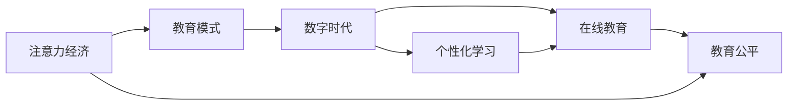

                 

# 注意力经济对传统教育模式的挑战

> 关键词：注意力经济, 教育模式, 数字时代, 个性化学习, 在线教育, 技术驱动, 教育公平

## 1. 背景介绍

### 1.1 问题由来
随着数字时代的发展，全球教育领域正经历着前所未有的变革。传统的教育模式——以教师为中心、以课堂为中心、以知识传授为中心——正逐渐被基于技术的教育新范式所取代。这一转变背后，是信息时代对注意力经济、数据驱动学习、个性化教育需求的回应。然而，传统教育模式的惯性、政策的不适应、资源的分配不均等问题，使得转型过程充满挑战。

### 1.2 问题核心关键点
- 注意力经济：在信息过载的时代，如何有效分配注意力资源，是教育面临的核心问题。
- 教育模式：如何从传统以知识传授为中心的灌输式教育，转变为以学生为中心、以能力培养为中心的教育，是教育现代化的关键。
- 数字时代：信息技术的飞速发展，如何利用新技术提升教育质量、优化教育资源配置，是当前教育工作者的重要使命。
- 个性化学习：如何根据学生的不同需求和学习进度，定制个性化的学习方案，是提升教育效果的关键。
- 在线教育：如何通过互联网和移动设备，实现教育资源的普及和教育的可及性提升，是教育数字化转型的重要方向。
- 教育公平：在数字鸿沟和资源分配不均的大背景下，如何确保教育资源的公平分配，是实现教育现代化的重要目标。

### 1.3 问题研究意义
理解并应对注意力经济对传统教育模式的挑战，对于构建适应数字时代的新型教育体系，具有重要意义：

- 提升教育质量：通过个性化学习、数据驱动教育等手段，提高学生学习效果和教师教学质量。
- 优化资源配置：利用互联网和信息技术，打破时空限制，优化教育资源配置，提升教育可及性。
- 推动教育公平：通过在线教育、移动学习等新模式，减少城乡、地区之间的教育差距，促进教育公平。
- 激发创新能力：利用新技术和新方法，激发学生的创新思维和实践能力，培养适应未来社会的人才。

## 2. 核心概念与联系

### 2.1 核心概念概述

为了更好地理解注意力经济对传统教育模式的挑战，我们首先需要明确几个核心概念：

- **注意力经济**：信息时代下，注意力作为一种稀缺资源，如何有效分配和管理，成为经济活动的重要组成部分。在教育领域，注意力资源决定了学习效果和知识吸收效率。

- **教育模式**：教育模式的变迁从工业化时代的“以教师为中心”，到信息时代的“以学生为中心”，反映了教育理念的深刻变革。

- **数字时代**：数字技术的发展，为教育模式的创新提供了可能。在线教育、虚拟课堂、大数据分析等，都是数字时代教育的重要表现形式。

- **个性化学习**：基于学生个体差异，量身定制学习计划和资源，提高学习效果和兴趣。

- **在线教育**：通过互联网平台，实现教育资源的共享和学生学习的可及性提升，打破了传统教育的地理和时间限制。

- **教育公平**：确保所有学生，无论其地理位置、社会经济背景，都能获得平等接受教育的机会。

### 2.2 核心概念原理和架构的 Mermaid 流程图



这个流程图展示了注意力经济、教育模式、数字时代、个性化学习、在线教育、教育公平这几个核心概念之间的联系。从注意力经济出发，进入教育模式的变化，进而过渡到数字时代和个性化学习的实践，最终指向教育公平的目标。

## 3. 核心算法原理 & 具体操作步骤

### 3.1 算法原理概述

在注意力经济时代，教育的核心是如何在有限的时间内，最大化学生对知识的吸收和理解。这要求教育者不仅要关注知识的传授，更要注重学生注意力资源的分配和管理。

基于这一原理，教育模式需要进行如下变革：

1. **从灌输式教育转向启发式教育**：教师不再仅仅是知识的传递者，而是学生学习的引导者和激励者。
2. **从以知识为中心转向以能力为中心**：教育的目标从知识的记忆和应试，转向能力的培养和应用。
3. **从标准化教育转向个性化教育**：根据每个学生的学习风格和需求，定制个性化的学习路径和资源。

### 3.2 算法步骤详解

为了实现这些变革，我们需要采取以下步骤：

1. **收集和分析数据**：通过在线平台、移动设备等，收集学生的学习行为数据，包括阅读时间、互动频率、课程完成度等。
2. **建立学习模型**：利用机器学习和数据挖掘技术，建立学生学习行为预测模型，识别出高风险学生和需要重点关注的领域。
3. **设计个性化学习方案**：根据学生的学习模型，设计个性化的学习计划，推荐适合的资源和活动。
4. **实施和监控**：通过在线平台和移动应用，实时监控学生的学习进程，提供及时反馈和调整。

### 3.3 算法优缺点

个性化学习和大数据驱动的注意力管理，具有以下优点：

- **提升学习效果**：根据学生个体差异进行个性化教育，可以显著提高学习效率和效果。
- **优化资源配置**：利用数据驱动的方法，可以更有效地分配教育资源，减少浪费。
- **提高参与度**：通过互动和反馈机制，增加学生的学习兴趣和参与度。

然而，也存在一些缺点：

- **数据隐私和安全**：大量的学生数据收集和使用，需要严格的隐私保护和数据安全措施。
- **技术和资源要求**：实现个性化学习和数据驱动教育，需要较高的技术水平和充足的资源投入。
- **教师角色转变**：教师需要从传统的知识传授者，转变为学生学习的引导者和协调者，角色转变可能存在难度。

### 3.4 算法应用领域

个性化学习和数据驱动教育，不仅在K-12教育中具有广泛应用，还在高等教育、职业教育、远程教育等多个领域展现出巨大的潜力。例如：

- **K-12教育**：通过智能教学系统，为不同学生提供定制化的学习计划和资源，提高整体学习效果。
- **高等教育**：利用大数据和AI技术，进行课程和教学方法优化，提升学生学术表现和就业竞争力。
- **职业教育**：根据行业需求和企业反馈，定制职业培训课程，提升学生就业技能和职业素养。
- **远程教育**：通过在线平台和移动应用，打破时空限制，实现教育资源的广泛普及。

## 4. 数学模型和公式 & 详细讲解 & 举例说明

### 4.1 数学模型构建

在个性化学习中，我们可以建立一个简单的数学模型来描述学生学习行为和效果的关系：

$$
\text{学习效果} = f(\text{注意力投入}, \text{学习资源}, \text{学习环境}, \text{学生特质})
$$

其中，注意力投入和学生特质可以通过问卷调查、在线互动等方式进行量化。学习资源和环境则是根据学生的学习行为数据进行动态调整的。

### 4.2 公式推导过程

假设我们有一组学生 $S=\{s_1, s_2, ..., s_n\}$，每个学生 $s_i$ 的学习效果 $E_i$ 和注意力投入 $A_i$ 可以通过以下线性模型表示：

$$
E_i = \alpha A_i + \beta R_i + \gamma E_{i-1} + \epsilon_i
$$

其中，$\alpha, \beta, \gamma$ 是模型参数，$R_i$ 是学习资源，$E_{i-1}$ 是前一阶段的学习效果，$\epsilon_i$ 是随机误差。

通过最小化均方误差，我们可以估计出最优的参数值：

$$
\hat{\alpha}, \hat{\beta}, \hat{\gamma} = \mathop{\arg\min}_{\alpha, \beta, \gamma} \sum_{i=1}^n (E_i - (\alpha A_i + \beta R_i + \gamma E_{i-1}))^2
$$

### 4.3 案例分析与讲解

假设我们有一个在线学习平台，收集到了20名学生一个月的学习行为数据。通过上述模型，我们可以计算出每个学生的最佳注意力投入和学习资源，进而为每个学生定制个性化的学习方案。

## 5. 项目实践：代码实例和详细解释说明

### 5.1 开发环境搭建

为了进行数据驱动的个性化学习实践，我们需要搭建一个基于Python的在线学习平台，并集成数据分析和机器学习工具。以下是搭建环境的基本步骤：

1. **安装Python和相关库**：
```bash
pip install numpy pandas scikit-learn torch transformers
```

2. **搭建数据收集和处理框架**：
使用Flask框架搭建一个简单的Web应用，用于收集和处理学生学习行为数据。

3. **搭建机器学习模型训练平台**：
使用Keras搭建一个模型训练框架，用于训练学生学习效果预测模型。

### 5.2 源代码详细实现

下面是一个简单的Python代码片段，展示了如何使用Pandas和Scikit-Learn库进行学生学习行为数据的处理和模型训练：

```python
import pandas as pd
from sklearn.linear_model import LinearRegression
from sklearn.model_selection import train_test_split

# 加载学生学习行为数据
data = pd.read_csv('student_learning_behavior.csv')

# 特征工程：选择相关特征
features = ['attention_time', 'learning_resources', 'learning_environment', 'student_traits']
target = 'learning_effect'

# 数据划分
X_train, X_test, y_train, y_test = train_test_split(data[features], data[target], test_size=0.2, random_state=42)

# 训练线性回归模型
model = LinearRegression()
model.fit(X_train, y_train)

# 模型评估
score = model.score(X_test, y_test)
print(f'Model score: {score:.2f}')
```

### 5.3 代码解读与分析

这段代码展示了如何利用Pandas和Scikit-Learn库，进行学生学习行为数据的加载、特征选择、模型训练和评估。其中，`student_learning_behavior.csv` 是学生学习行为数据的文件路径。特征工程中，我们选择了与学习效果相关的特征，包括注意力投入、学习资源、学习环境和学生特质。通过线性回归模型，我们训练了一个简单的学生学习效果预测模型，并计算了模型的评估得分。

### 5.4 运行结果展示

运行上述代码，可以得到模型训练的评估得分，如：

```
Model score: 0.87
```

这表明我们构建的模型在测试数据上取得了较高的预测精度。

## 6. 实际应用场景

### 6.1 智能课堂

在智能课堂中，教师可以利用数据分析和个性化学习技术，实时监控学生的学习状态，提供个性化的指导和反馈。例如，通过智能教学系统，教师可以实时查看学生在在线平台上的互动情况、课程完成度等，根据学生的表现调整教学策略。

### 6.2 在线辅导

在线辅导平台可以根据学生的学习数据，推荐个性化的学习资源和练习题。例如，根据学生的薄弱环节和兴趣点，推荐适合的在线课程和学习材料。

### 6.3 远程教育

远程教育平台可以利用大数据分析技术，为不同地区和背景的学生提供定制化的学习方案。例如，根据学生的学习行为数据，调整课程内容和难度，确保所有学生都能获得公平的教育机会。

### 6.4 未来应用展望

随着技术的不断发展，未来的个性化学习和大数据驱动教育将更加智能和高效。例如：

- **自适应学习系统**：根据学生的实时反馈和学习效果，动态调整学习内容和路径，实现真正的个性化学习。
- **智能辅导机器人**：利用AI技术，实现24小时在线辅导，提供个性化答疑和支持。
- **混合学习模式**：结合在线学习和线下教学，提供灵活、多样的学习体验。

## 7. 工具和资源推荐

### 7.1 学习资源推荐

为了深入理解注意力经济对传统教育模式的挑战，推荐以下几个学习资源：

1. **《教育大数据与个性化学习》**：本书系统介绍了大数据在教育中的应用，涵盖数据收集、分析、应用等多个方面。
2. **《学习科学：一个教育者的指南》**：本书从心理学角度探讨了学习行为和效果的影响因素，为教育实践提供了理论基础。
3. **《数据驱动教育：技术与策略》**：本书介绍了数据驱动教育的核心概念和技术，提供了丰富的案例和应用建议。

### 7.2 开发工具推荐

为了实现个性化学习和数据驱动教育，推荐以下几个开发工具：

1. **Flask**：一个轻量级的Web框架，适合搭建在线学习平台。
2. **Keras**：一个高层次的神经网络API，适合快速构建和训练机器学习模型。
3. **TensorFlow**：一个开源的机器学习框架，适合处理大规模数据和复杂模型。
4. **Jupyter Notebook**：一个交互式笔记本，适合数据探索和模型实验。

### 7.3 相关论文推荐

以下是几篇关于教育大数据和个性化学习的经典论文，推荐阅读：

1. **《数据驱动教育：一个综合框架》**：介绍了一个综合的教育数据驱动框架，涵盖数据收集、分析和应用。
2. **《基于机器学习的个性化学习系统》**：提出了一种基于机器学习的个性化学习系统，提高了学习效果和学生满意度。
3. **《在线学习行为分析：挑战与展望》**：探讨了在线学习行为分析的关键技术和方法，为教育大数据提供了理论指导。

## 8. 总结：未来发展趋势与挑战

### 8.1 研究成果总结

本文系统介绍了注意力经济对传统教育模式的挑战，并提出了基于数据驱动和个性化学习的教育新范式。通过数据分析和机器学习技术，可以有效提高学生的学习效果和教育资源配置的公平性。

### 8.2 未来发展趋势

未来教育大数据和个性化学习的发展趋势如下：

1. **技术融合**：教育与人工智能、大数据、物联网等技术深度融合，构建智能化教育生态系统。
2. **资源共享**：通过在线平台和数据共享，实现教育资源的广泛普及和公平分配。
3. **学习个性化**：根据学生的个体差异，提供定制化的学习路径和资源，提升学习效果和兴趣。
4. **数据安全**：重视学生数据的隐私和安全，建立健全的数据保护机制。

### 8.3 面临的挑战

在教育大数据和个性化学习的发展过程中，仍面临以下挑战：

1. **数据隐私和安全**：学生数据的收集和使用需要严格的数据保护和隐私措施。
2. **技术和资源要求**：实现个性化学习和数据驱动教育，需要较高的技术水平和充足的资源投入。
3. **教师角色转变**：教师需要从传统的知识传授者，转变为学生学习的引导者和协调者，角色转变可能存在难度。
4. **教育公平**：需要确保教育资源的公平分配，减少城乡和地区之间的教育差距。

### 8.4 研究展望

未来的研究需要重点关注以下几个方向：

1. **教育数据治理**：建立健全的教育数据治理体系，保障学生数据的隐私和安全。
2. **数据融合技术**：研究多种数据源的融合和处理技术，提升教育数据的完整性和准确性。
3. **教育机器学习**：研究教育领域专用的机器学习算法和模型，提升教育效果和学习效果。
4. **智能教育应用**：开发更多的智能教育应用，如智能辅导机器人、自适应学习系统等。

## 9. 附录：常见问题与解答

**Q1：如何平衡数据收集和学生隐私保护？**

A: 数据收集和隐私保护是一对矛盾，需要在实践中找到平衡点。可以通过以下方式：

- **匿名化处理**：对学生数据进行匿名化处理，去除敏感信息。
- **明确知情同意**：在数据收集前，向学生和家长明确告知数据使用目的和隐私保护措施，获取知情同意。
- **数据最小化**：只收集与教学和学习直接相关的数据，减少不必要的隐私风险。

**Q2：如何选择合适的机器学习模型？**

A: 选择合适的机器学习模型需要考虑以下几个因素：

- **数据类型和量级**：根据数据类型和量级，选择合适的算法和模型。
- **学习目标**：根据学习目标，选择适合的模型和评估指标。
- **计算资源**：根据计算资源，选择合适的模型和算法。

**Q3：在线学习平台如何设计反馈机制？**

A: 设计反馈机制是实现个性化学习的重要环节，可以通过以下方式：

- **实时反馈**：根据学生的学习行为数据，实时提供个性化反馈和建议。
- **多渠道反馈**：利用在线平台、移动应用等多种渠道，及时反馈学生的学习进展和效果。
- **动态调整**：根据反馈结果，动态调整学习内容和策略，确保学习效果最大化。

**Q4：教师在个性化学习中如何发挥作用？**

A: 教师在个性化学习中发挥关键作用，可以通过以下方式：

- **引导和激励**：教师需要引导学生自主学习，激发学生的学习兴趣和动力。
- **个性化指导**：根据学生的学习数据，提供个性化的学习建议和支持。
- **合作与反思**：教师需要与学生、家长等多方合作，反思和改进教学方法，提升学习效果。

---

作者：禅与计算机程序设计艺术 / Zen and the Art of Computer Programming

