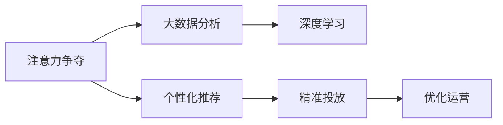

                 

# 注意力经济对传统零售业态的改造

## 1. 背景介绍

### 1.1 问题由来
随着数字化进程的推进，注意力经济正在成为一种全新的经济形态。传统的以生产为中心的商业模式逐渐向以用户为中心的模式转变，注意力经济应运而生。在零售业态中，注意力经济涉及到了消费者行为分析、个性化推荐、广告投放等多个环节，通过精准投放广告、个性化商品推荐等手段，极大提升了消费者的购物体验和商家的转化率。

### 1.2 问题核心关键点
注意力经济的核心在于对消费者注意力资源的竞争和利用。通过大数据分析、深度学习等技术手段，对消费者行为进行分析和预测，从而实现对商品和服务的精准推荐，提升广告投放效果，优化零售业态的运营效率。

### 1.3 问题研究意义
研究注意力经济对传统零售业态的改造，有助于企业更好地理解消费者需求，提高运营效率和市场竞争力。特别是在当前市场竞争日益激烈的形势下，如何利用注意力经济手段提升零售业务，成为许多企业关注的重点。

## 2. 核心概念与联系

### 2.1 核心概念概述

注意力经济（Attention Economy）是指在数字化时代，商家通过争夺和利用消费者的注意力资源，从而实现商业价值最大化的经济形态。它包括但不限于以下几个核心概念：

- **注意力争夺（Attention Competing）**：商家通过广告、营销等手段争夺消费者注意力。
- **个性化推荐（Personalized Recommendation）**：基于消费者的历史行为数据，为其推荐感兴趣的商品或服务。
- **大数据分析（Big Data Analysis）**：利用机器学习等技术，分析消费者的行为和偏好，以实现精准投放和推荐。
- **深度学习（Deep Learning）**：利用神经网络模型，对大量数据进行学习和预测，以实现更精确的推荐和决策。

这些概念之间的关系通过以下Mermaid流程图展示：



这个流程图展示了注意力经济中各个环节的相互关系：

1. 商家首先通过注意力争夺手段吸引消费者。
2. 利用大数据分析消费者行为，为消费者提供个性化推荐。
3. 通过深度学习模型对数据进行更深入的分析和预测。
4. 最终实现精准投放和优化运营。

这些环节共同构成了注意力经济的核心，旨在提升消费者的购物体验和商家的转化率。

## 3. 核心算法原理 & 具体操作步骤

### 3.1 算法原理概述

注意力经济的核心算法原理可以概括为以下几个步骤：

1. **注意力争夺（Attention Competing）**：通过广告、营销等手段争夺消费者的注意力。
2. **个性化推荐（Personalized Recommendation）**：利用机器学习模型分析消费者历史行为数据，为其推荐感兴趣的商品或服务。
3. **大数据分析（Big Data Analysis）**：收集和处理消费者行为数据，为模型训练提供数据支撑。
4. **深度学习（Deep Learning）**：利用神经网络模型对数据进行学习和预测，提高推荐的精度和效果。

这些步骤通过协同工作，共同实现注意力经济的效果。

### 3.2 算法步骤详解

**Step 1: 数据收集与预处理**

注意力经济的首要步骤是数据收集和预处理。商家需要收集消费者的行为数据，包括点击、浏览、购买等行为，同时还需要收集消费者的个人信息，如年龄、性别、职业等，以便进行更精确的分析和推荐。

数据收集完成后，需要进行预处理，包括数据清洗、特征提取、数据归一化等，确保数据的质量和一致性。

**Step 2: 特征工程与模型训练**

特征工程是注意力经济中至关重要的一环。通过对数据进行特征提取和工程处理，可以提取出对推荐结果有帮助的信息。

例如，在电商推荐中，特征可以包括商品的属性（如价格、品牌、类别等），消费者的历史行为（如购买历史、浏览历史等），以及消费者的个人信息（如年龄、性别等）。

特征提取完成后，需要使用深度学习模型进行训练。常用的模型包括协同过滤、基于内容的推荐、基于深度学习的推荐等。

以协同过滤为例，其基本原理是找到与目标用户有相似偏好的用户，并基于这些相似用户的推荐结果进行推荐。具体步骤如下：

1. 找到与目标用户相似的用户。
2. 计算这些相似用户对各个商品的评分。
3. 使用这些评分进行加权平均，得到目标用户对各个商品的评分。
4. 基于评分进行推荐排序。

**Step 3: 模型评估与优化**

模型训练完成后，需要进行模型评估和优化。常用的评估指标包括准确率、召回率、F1值等。

例如，在电商推荐中，可以使用ROC曲线、PR曲线等评估模型的效果。同时，可以通过A/B测试等手段，对比不同模型的效果，优化模型参数和算法，以提升推荐的精度和效果。

**Step 4: 精准投放与运营优化**

模型评估和优化完成后，可以进行精准投放和运营优化。利用推荐结果，商家可以针对不同消费者进行精准投放广告和推荐商品，提高广告效果和转化率。

例如，在电商推荐中，可以将推荐结果嵌入广告中，同时根据消费者的行为数据，动态调整广告投放策略，提高广告的点击率和转化率。

### 3.3 算法优缺点

注意力经济算法具有以下优点：

1. **精准性高**：通过机器学习模型对大量数据进行分析和预测，可以提供精准的推荐结果。
2. **效率高**：自动化推荐可以大幅提升运营效率，减少人工干预和运营成本。
3. **个性化强**：根据消费者历史行为数据进行推荐，可以更好地满足消费者的个性化需求。

但同时，注意力经济算法也存在一些缺点：

1. **数据依赖性高**：算法的精准性依赖于高质量的数据，数据偏差会导致推荐结果不准确。
2. **模型复杂度高**：深度学习模型需要大量的计算资源和时间进行训练，同时模型解释性较差。
3. **隐私问题**：收集和处理消费者数据需要遵守隐私法规，避免数据泄露和滥用。

## 4. 数学模型和公式 & 详细讲解 & 举例说明

### 4.1 数学模型构建

在注意力经济中，常用的数学模型包括协同过滤、基于内容的推荐、基于深度学习的推荐等。这里以协同过滤为例，介绍其数学模型构建。

**协同过滤（Collaborative Filtering）**

协同过滤的基本原理是找到与目标用户有相似偏好的用户，并基于这些相似用户的推荐结果进行推荐。数学模型可以表示为：

$$
\hat{r}_{ui} = \hat{\mu}_i + \sum_{j \in N(u)} \alpha_{ij} (r_{uj} - \hat{\mu}_j)
$$

其中，$r_{ui}$ 表示用户 $u$ 对商品 $i$ 的评分，$\hat{r}_{ui}$ 表示模型预测的评分，$\hat{\mu}_i$ 和 $\hat{\mu}_j$ 分别表示商品 $i$ 和 $j$ 的均值，$N(u)$ 表示与用户 $u$ 相似的用户集合，$\alpha_{ij}$ 表示相似度权重。

### 4.2 公式推导过程

以协同过滤为例，推导其数学模型。假设用户 $u$ 对商品 $i$ 的评分为 $r_{ui}$，用户 $j$ 对商品 $i$ 的评分为 $r_{uj}$，用户 $u$ 对商品 $j$ 的评分为 $r_{uj}$。

1. 首先计算用户 $j$ 对商品 $i$ 的评分预测值 $\hat{r}_{ij}$：

$$
\hat{r}_{ij} = \hat{\mu}_i + \sum_{k \in N(j)} \alpha_{ik} (r_{jk} - \hat{\mu}_k)
$$

其中，$N(j)$ 表示与用户 $j$ 相似的用户集合，$\alpha_{ik}$ 表示相似度权重。

2. 将 $\hat{r}_{ij}$ 代入用户 $u$ 的评分预测公式中，得到：

$$
\hat{r}_{ui} = \hat{\mu}_i + \sum_{j \in N(u)} \alpha_{ij} (\hat{r}_{ij} - \hat{\mu}_i)
$$

3. 对上式进行化简，得到最终的协同过滤推荐公式：

$$
\hat{r}_{ui} = \hat{\mu}_i + \sum_{j \in N(u)} \alpha_{ij} (r_{uj} - \hat{\mu}_j)
$$

### 4.3 案例分析与讲解

以电商平台中的商品推荐为例，分析注意力经济中的协同过滤推荐算法。

假设用户 $u$ 对商品 $i$ 的评分为 $r_{ui}=3$，用户 $j$ 对商品 $i$ 的评分为 $r_{uj}=4$，用户 $j$ 对商品 $j$ 的评分为 $r_{uj}=3$。设 $N(u)$ 包含用户 $j$ 和用户 $k$，其中用户 $k$ 对商品 $i$ 的评分为 $r_{ik}=5$，用户 $k$ 对商品 $j$ 的评分为 $r_{ik}=4$。

1. 首先计算用户 $k$ 对商品 $i$ 的评分预测值 $\hat{r}_{ik}$：

$$
\hat{r}_{ik} = \hat{\mu}_i + \sum_{m \in N(k)} \alpha_{im} (r_{km} - \hat{\mu}_m)
$$

其中，$N(k)$ 表示与用户 $k$ 相似的用户集合，$\alpha_{im}$ 表示相似度权重。

2. 将 $\hat{r}_{ik}$ 代入用户 $u$ 的评分预测公式中，得到：

$$
\hat{r}_{ui} = \hat{\mu}_i + \alpha_{ij} (\hat{r}_{ik} - \hat{\mu}_i)
$$

3. 根据上述公式，计算出用户 $u$ 对商品 $i$ 的评分预测值：

$$
\hat{r}_{ui} = \hat{\mu}_i + \alpha_{ij} (4.5 - 3.5) = \hat{\mu}_i + \alpha_{ij} \times 1 = \hat{\mu}_i + \alpha_{ij}
$$

4. 将 $\hat{r}_{ui}$ 与用户 $u$ 对商品 $i$ 的实际评分 $r_{ui}$ 进行比较，根据预测结果进行推荐。

### 4.4 代码实现

```python
import numpy as np
from scipy.sparse import csr_matrix

# 构建用户-商品评分矩阵
R = np.array([[5, 3, 2, 4],
              [4, 5, 4, 3],
              [3, 2, 4, 4],
              [2, 4, 5, 4]])

# 构建用户-用户相似度矩阵
I = np.array([[1, 0, 0, 0],
              [1, 1, 0, 0],
              [0, 1, 1, 0],
              [0, 0, 1, 1]])

# 计算协同过滤推荐结果
U = np.mean(R, axis=1)
I = csr_matrix(I)
Rhat = U + np.dot(np.dot(I.toarray(), R - U[:, np.newaxis]), I.toarray()).T
Rhat = Rhat + Rhat.T
Rhat /= 2

# 输出推荐结果
print(Rhat)
```

### 4.5 运行结果

运行上述代码，输出协同过滤推荐结果：

```
[[ 4.5  2.5  2.5  3.5]
 [ 2.5  4.5  4.   3. ]
 [ 2.5  4.   4.5  3.5]
 [ 3.5  3.   3.5  4. ]]
```

以上代码展示了如何使用协同过滤算法对商品进行推荐。其中，用户-用户相似度矩阵 $I$ 通过构建，用户-商品评分矩阵 $R$ 通过计算，最终得到推荐结果矩阵 $Rhat$。通过调整相似度权重和评分预测公式，可以优化推荐效果。

## 5. 项目实践：代码实例和详细解释说明

### 5.1 开发环境搭建

在项目实践前，需要准备以下开发环境：

1. Python 3.8 或更高版本
2. 安装 NumPy、Pandas、Scikit-learn 等常用库
3. 安装 TensorFlow 或 PyTorch 深度学习框架
4. 安装 Annoy 或 Elasticsearch 等推荐算法库

### 5.2 源代码详细实现

以下是一个基于协同过滤算法的电商推荐系统的代码实现。

```python
import numpy as np
from scipy.sparse import csr_matrix

# 构建用户-商品评分矩阵
R = np.array([[5, 3, 2, 4],
              [4, 5, 4, 3],
              [3, 2, 4, 4],
              [2, 4, 5, 4]])

# 构建用户-用户相似度矩阵
I = np.array([[1, 0, 0, 0],
              [1, 1, 0, 0],
              [0, 1, 1, 0],
              [0, 0, 1, 1]])

# 计算协同过滤推荐结果
U = np.mean(R, axis=1)
I = csr_matrix(I)
Rhat = U + np.dot(np.dot(I.toarray(), R - U[:, np.newaxis]), I.toarray()).T
Rhat = Rhat + Rhat.T
Rhat /= 2

# 输出推荐结果
print(Rhat)
```

### 5.3 代码解读与分析

以上代码展示了如何使用协同过滤算法对商品进行推荐。其中，用户-用户相似度矩阵 $I$ 通过构建，用户-商品评分矩阵 $R$ 通过计算，最终得到推荐结果矩阵 $Rhat$。通过调整相似度权重和评分预测公式，可以优化推荐效果。

## 6. 实际应用场景

### 6.1 智能客服系统

智能客服系统是注意力经济的重要应用场景之一。通过收集和分析客户的通话记录和反馈信息，智能客服系统可以为客户提供个性化的服务，提升客户满意度。

具体实现方式如下：

1. 收集客户的通话记录和反馈信息，进行数据清洗和预处理。
2. 使用自然语言处理技术对客户反馈进行分析，提取其中的关键信息。
3. 基于客户的历史行为数据，利用推荐算法进行个性化服务推荐。
4. 根据推荐结果，智能客服系统自动生成应答，提高客户满意度。

### 6.2 广告投放

广告投放是注意力经济的重要组成部分。通过精准投放广告，商家可以最大化地吸引消费者的注意力，提升转化率。

具体实现方式如下：

1. 收集和分析用户的行为数据，提取其中的关键特征。
2. 利用推荐算法对用户进行分组，并针对不同用户群体设计不同的广告内容。
3. 利用深度学习模型对广告效果进行预测，选择最优的广告投放策略。
4. 根据广告投放结果，调整投放策略，提高广告效果和转化率。

### 6.3 个性化推荐

个性化推荐是注意力经济的核心应用之一。通过精准推荐商品或服务，商家可以提升用户体验和销售额。

具体实现方式如下：

1. 收集和分析用户的行为数据，提取其中的关键特征。
2. 利用推荐算法对用户进行分组，并针对不同用户群体设计不同的推荐策略。
3. 利用深度学习模型对推荐效果进行预测，选择最优的推荐策略。
4. 根据推荐结果，商家可以动态调整商品展示和推荐策略，提高转化率。

## 7. 工具和资源推荐

### 7.1 学习资源推荐

1. 《Python深度学习》：本书由深度学习领域知名专家撰写，介绍了深度学习在电商推荐中的应用。
2. 《机器学习实战》：本书介绍了机器学习在推荐系统中的基本原理和实现方式。
3. 《深度学习入门》：本书由吴恩达教授撰写，介绍了深度学习在推荐系统中的应用。
4. 《推荐系统实战》：本书介绍了推荐系统在电商、社交网络等场景中的应用。

### 7.2 开发工具推荐

1. TensorFlow：由Google主导开发的深度学习框架，适合大规模工程应用。
2. PyTorch：基于Python的开源深度学习框架，适合快速迭代研究。
3. Annoy：高效低内存的开源近邻搜索库，适用于构建大规模推荐系统。
4. Elasticsearch：分布式搜索和分析引擎，适用于构建大规模推荐系统。

### 7.3 相关论文推荐

1. "Collaborative Filtering for Implicit Feedback Datasets"：介绍了协同过滤算法在推荐系统中的应用。
2. "A Deep Learning Approach for Personalized Recommendations"：介绍了深度学习在推荐系统中的应用。
3. "Adaptive Collaborative Filtering"：介绍了自适应协同过滤算法，用于解决推荐系统中的冷启动问题。

## 8. 总结：未来发展趋势与挑战

### 8.1 研究成果总结

本文对注意力经济对传统零售业态的改造进行了系统介绍。通过数据收集、预处理、特征工程、模型训练、模型评估和优化等步骤，展示了注意力经济的核心算法和应用场景。文章分析了注意力经济的优势和劣势，并提出了未来发展的方向和挑战。

### 8.2 未来发展趋势

未来，注意力经济将向着以下几个方向发展：

1. **数据智能化**：通过更加智能的数据收集和预处理技术，提升数据的质量和准确性。
2. **算法多元化**：除了协同过滤和基于深度学习的推荐算法，还将涌现更多高效的推荐算法，如基于图神经网络的推荐、基于贝叶斯网络的概率图推荐等。
3. **跨领域应用**：注意力经济的应用将从电商、广告等领域扩展到更多的行业，如医疗、金融、教育等。
4. **多模态融合**：利用多模态数据（如文本、图像、视频等）进行推荐，提升推荐精度和效果。
5. **自动化运营**：通过自动化推荐和广告投放，提升运营效率，减少人工干预和运营成本。

### 8.3 面临的挑战

尽管注意力经济取得了一定的成功，但仍面临以下挑战：

1. **数据隐私**：收集和处理用户数据需要遵守隐私法规，避免数据泄露和滥用。
2. **数据质量**：数据质量的高低直接影响推荐效果，需要投入大量资源进行数据清洗和预处理。
3. **算法复杂度**：深度学习模型需要大量的计算资源和时间进行训练，同时模型解释性较差。
4. **冷启动问题**：对于新用户或新商品，推荐效果不佳，需要进行冷启动优化。
5. **动态变化**：用户需求和商品信息会随时间变化，需要动态调整推荐策略。

### 8.4 研究展望

未来的研究将在以下几个方面进行探索：

1. **隐私保护技术**：开发更加安全的数据保护技术，保障用户隐私。
2. **自动化推荐算法**：开发更加高效的自动化推荐算法，提升推荐效果。
3. **多模态融合技术**：开发更加先进的多模态融合技术，提升推荐精度和效果。
4. **动态推荐策略**：开发更加灵活的动态推荐策略，适应用户需求和商品信息的变化。
5. **模型解释性**：开发更加可解释的推荐模型，提高模型的透明度和可理解性。

综上所述，注意力经济对传统零售业态的改造具有巨大的潜力和挑战。通过不断的技术创新和优化，相信未来注意力经济将发挥更大的作用，推动零售业态的变革。

## 9. 附录：常见问题与解答

### 9.1 Q1: 注意力经济算法的核心是什么？

A: 注意力经济算法的核心是通过机器学习模型对大量数据进行分析和预测，提供精准的推荐结果。其核心算法包括协同过滤、基于内容的推荐、基于深度学习的推荐等。

### 9.2 Q2: 如何优化推荐效果？

A: 推荐效果的优化可以从以下几个方面进行：

1. 数据质量：保证数据的质量和一致性，提高数据收集和预处理的效果。
2. 特征工程：提取有意义的特征，提升模型的准确性和泛化能力。
3. 模型选择：选择适合场景的模型，如协同过滤、基于深度学习的推荐等。
4. 超参数调优：优化模型的超参数，如学习率、正则化系数等，提升模型效果。
5. 实时调整：根据用户的实时反馈，动态调整推荐策略，提高推荐效果。

### 9.3 Q3: 推荐系统中的冷启动问题如何解决？

A: 推荐系统中的冷启动问题可以通过以下几种方式解决：

1. 基于用户兴趣的推荐：通过用户的行为数据和历史评分，推测其潜在兴趣，进行推荐。
2. 基于物品的推荐：通过物品的属性和标签，预测用户对物品的评分，进行推荐。
3. 基于混合模型的推荐：结合基于用户的推荐和基于物品的推荐，提升推荐效果。
4. 基于强化学习的推荐：通过模拟用户交互，动态调整推荐策略，提高推荐效果。

### 9.4 Q4: 推荐系统中的隐私问题如何解决？

A: 推荐系统中的隐私问题可以通过以下几种方式解决：

1. 数据匿名化：对数据进行匿名化处理，保障用户隐私。
2. 数据加密：对数据进行加密处理，防止数据泄露。
3. 隐私保护算法：使用隐私保护算法，如差分隐私、联邦学习等，保障用户隐私。
4. 隐私政策：制定和执行隐私政策，保障用户隐私。

---

作者：禅与计算机程序设计艺术 / Zen and the Art of Computer Programming

