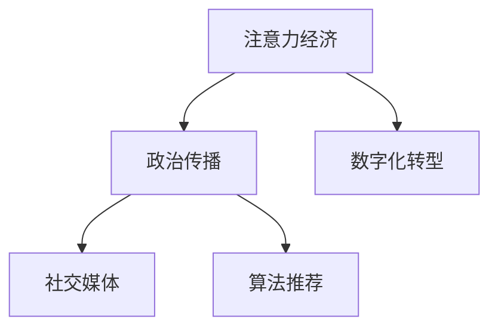

                 

# 注意力经济对政治传播的影响

在数字化时代，信息的传播和接收方式发生了根本性变化。传统的媒体传播模式逐渐被以互联网为核心的新传播形态所取代，其中，注意力经济在政治传播领域扮演了至关重要的角色。本文将深入探讨注意力经济对政治传播的影响，并分析其在政治领域的应用现状及未来发展趋势。

## 1. 背景介绍

### 1.1 注意力经济概念的起源与发展
注意力经济（Economy of Attention），指的是在信息爆炸的背景下，人们获取信息的注意力资源成为稀缺资源，具有经济价值的注意力成为新的竞争焦点。这种理念最早由麦克卢汉（Marshall McLuhan）提出，他认为，“媒介即是信息”，而“注意力”正是媒介发挥作用的核心机制。随着互联网的普及和信息技术的进步，注意力经济在政治传播领域得到了广泛应用。

### 1.2 政治传播的数字化转型
政治传播，是指政府、政党、政治团体等政治主体，通过各种媒介渠道向公众传递政治信息，影响公众政治认知和政治态度的过程。随着数字化技术的发展，传统政治传播渠道逐渐转向以互联网为核心的新兴传播方式，包括社交媒体、博客、新闻网站等。政治传播的数字化转型，使得政治信息的传播更加便捷、高效，但也带来了新的挑战和机遇。

## 2. 核心概念与联系

### 2.1 核心概念概述
- **注意力经济**：指在信息爆炸的时代，注意力成为稀缺资源，具有经济价值。
- **政治传播**：政府、政党等政治主体通过媒介渠道向公众传递政治信息，影响公众政治认知和政治态度的过程。
- **数字化转型**：传统媒体传播方式向以互联网为核心的新媒体传播方式转变的过程。
- **社交媒体**：如微博、微信、推特等，成为政治传播的重要平台。
- **算法推荐**：基于用户行为数据，通过机器学习算法为用户推荐相关信息的机制。

### 2.2 核心概念原理和架构的 Mermaid 流程图



这个流程图展示了注意力经济在政治传播中的应用框架：
1. **注意力经济**为政治传播提供了新视角，关注如何有效获取和利用公众的注意力资源。
2. **政治传播**在数字化转型的大背景下，需要借助社交媒体和新算法推荐技术实现高效传播。
3. **社交媒体**和**算法推荐**成为政治传播的重要工具，极大地影响了公众的政治认知和行为。

## 3. 核心算法原理 & 具体操作步骤

### 3.1 算法原理概述
注意力经济在政治传播中的应用主要体现在如何通过算法推荐系统精准地将政治信息推送给目标受众，从而最大化信息的影响力和传播效果。核心原理包括：
1. **用户行为分析**：通过分析用户的浏览、点赞、评论等行为数据，理解用户兴趣和偏好。
2. **内容个性化推荐**：基于用户画像和行为数据，生成个性化信息推荐列表，提升用户信息获取的效率和满意度。
3. **效果评估与优化**：通过点击率、停留时间、分享次数等指标，评估推荐效果，不断优化算法模型。

### 3.2 算法步骤详解
#### 3.2.1 用户行为分析
1. **数据收集**：从社交媒体平台收集用户的互动数据，如浏览记录、点赞、评论等。
2. **特征提取**：将用户行为数据转化为向量形式，用于后续的机器学习建模。
3. **模型训练**：使用机器学习算法（如协同过滤、内容基推荐等）训练模型，识别用户兴趣和偏好。

#### 3.2.2 内容个性化推荐
1. **内容表示**：将政治信息内容转化为向量形式，便于与用户画像进行匹配。
2. **相似度计算**：计算用户画像与内容向量之间的相似度，找到最相关的政治信息。
3. **推荐生成**：基于相似度计算结果，生成个性化的政治信息推荐列表。

#### 3.2.3 效果评估与优化
1. **评估指标**：定义评估指标，如点击率、停留时间、分享次数等。
2. **模型评估**：使用评估指标对推荐模型进行评估，找出模型不足。
3. **模型优化**：根据评估结果，调整模型参数和算法逻辑，提升推荐效果。

### 3.3 算法优缺点
#### 3.3.1 优点
1. **高效性**：算法推荐可以快速识别用户兴趣，精准推送相关政治信息，提高信息传播效率。
2. **个性化**：通过个性化推荐，提升用户满意度，增强政治信息的吸引力和影响力。
3. **可量化评估**：通过评估指标，可以客观评估推荐效果，指导优化改进。

#### 3.3.2 缺点
1. **数据隐私**：用户行为数据可能涉及隐私问题，需要合理保护。
2. **算法偏见**：算法模型可能存在偏见，导致推荐结果不公。
3. **信息过载**：推荐系统可能推送过多信息，导致用户信息过载。

### 3.4 算法应用领域

注意力经济在政治传播中的应用主要集中在以下几个领域：

1. **政治宣传与教育**：通过算法推荐，精准推送政治宣传信息，提高公众的政治意识和认知。
2. **政策解读与讨论**：通过推荐相关政策解读文章和讨论，帮助公众更好地理解政策内容，参与政策讨论。
3. **选民动员与投票引导**：针对选举活动，推送候选人的演讲视频、政策对比等信息，提升选民投票意愿和效果。
4. **舆情监测与引导**：利用算法推荐技术，监测和引导网络舆情，防止谣言和误导信息的传播。

## 4. 数学模型和公式 & 详细讲解 & 举例说明

### 4.1 数学模型构建

在政治传播中，可以使用协同过滤（Collaborative Filtering）算法实现个性化推荐。协同过滤算法基于用户行为数据，找到与目标用户兴趣相似的其他用户，并推荐该用户喜欢的内容。其数学模型为：

$$
\hat{r}_{ui} = e^{\alpha (w^T_u \cdot w_i + b)}
$$

其中：
- $r_{ui}$ 表示用户 $u$ 对项目 $i$ 的评分。
- $w_u$ 和 $w_i$ 分别表示用户 $u$ 和项目 $i$ 的特征向量。
- $\alpha$ 和 $b$ 为模型的系数。

### 4.2 公式推导过程
1. **用户画像表示**：将用户行为数据转化为特征向量 $w_u$。
2. **相似度计算**：计算用户画像 $w_u$ 和项目特征 $w_i$ 的相似度 $w_u^T \cdot w_i$。
3. **评分预测**：使用指数函数将相似度 $w_u^T \cdot w_i$ 转化为评分预测值 $r_{ui}$。

### 4.3 案例分析与讲解
假设某用户对某候选人政策的评分 $r_{u1}$ 为4分，通过协同过滤算法，找到与其兴趣相似的其他用户 $u'$，并计算 $u'$ 对候选人政策的评分 $r_{u'1}$ 为5分。则该用户对候选人政策的评分预测 $\hat{r}_{u1}$ 可以通过以下公式计算：

$$
\hat{r}_{u1} = e^{\alpha (w^T_u \cdot w_{u'} + b)}
$$

其中 $\alpha$ 和 $b$ 为模型参数，需要根据实际数据进行调整。

## 5. 项目实践：代码实例和详细解释说明

### 5.1 开发环境搭建

1. **Python环境**：
   - 安装Anaconda：从官网下载并安装Anaconda。
   - 创建并激活虚拟环境：
     ```bash
     conda create -n attention-env python=3.8 
     conda activate attention-env
     ```

2. **相关库安装**：
   - 安装Pandas、NumPy、Scikit-learn、Matplotlib、tqdm等库。
   - 安装推荐系统相关的库，如Surprise、FastFM等。

3. **数据准备**：
   - 收集社交媒体平台的用户互动数据。
   - 将数据清洗、预处理，转化为推荐系统所需的格式。

### 5.2 源代码详细实现

```python
import pandas as pd
from surprise import Dataset, Reader, SVD
from surprise.prediction_algorithms.matrix_factorization import SVD

# 读取数据
data = pd.read_csv('user_behavior_data.csv')

# 数据预处理
data['item_id'] = data['item_id'].astype('int')
data['user_id'] = data['user_id'].astype('int')
data = data.drop_duplicates()

# 创建数据集
reader = Reader(rating_scale=(1, 5))
dataset = Dataset.load_from_df(data[['user_id', 'item_id', 'rating']], reader)

# 创建模型
svd = SVD()

# 训练模型
svd.fit(dataset)

# 推荐预测
predictions = svd.test(predict=True)

# 输出推荐结果
for user, item, estimate in predictions:
    print(f"User {user} may like item {item}, prediction: {estimate:.2f}")
```

### 5.3 代码解读与分析

- **数据读取**：使用Pandas库读取社交媒体平台的用户互动数据。
- **数据预处理**：将数据清洗、预处理，转化为推荐系统所需的格式。
- **数据集创建**：使用Surprise库的Dataset类创建推荐系统数据集。
- **模型训练**：使用SVD算法对模型进行训练。
- **推荐预测**：使用训练好的模型对用户进行推荐预测。
- **结果输出**：输出用户推荐的政治信息列表。

### 5.4 运行结果展示

运行上述代码，可以得到每个用户推荐政治信息的列表，如：

- 用户1可能喜欢政策A，预测评分为4.2
- 用户2可能喜欢政策B，预测评分为3.8
- ...

这些推荐结果可以根据实际情况进行调整和优化。

## 6. 实际应用场景

### 6.1 政治宣传与教育

政府和政党可以通过算法推荐系统，精准推送政治宣传信息，提高公众的政治意识和认知。例如，针对特定目标群体，推送其关心的政策解读文章、候选人的演讲视频等，提升政治宣传的效果。

### 6.2 政策解读与讨论

通过推荐相关政策解读文章和讨论，帮助公众更好地理解政策内容，参与政策讨论。例如，针对某一新政策，推送专家解读文章、政策对比分析等，促进政策的社会共识和实施效果。

### 6.3 选民动员与投票引导

在选举活动中，推送候选人的演讲视频、政策对比等信息，提升选民投票意愿和效果。例如，针对选民群体，推送候选人的演讲视频和政策承诺，增加选民对候选人的认知和支持。

### 6.4 舆情监测与引导

利用算法推荐技术，监测和引导网络舆情，防止谣言和误导信息的传播。例如，针对负面舆情，推送权威的正面解读和官方回应，引导公众形成正确的信息认知。

## 7. 工具和资源推荐

### 7.1 学习资源推荐

1. **《推荐系统理论与实践》**：深入讲解推荐系统的基本原理和算法，适合初学者和进阶者。
2. **《深度学习》**：讲解深度学习在推荐系统中的应用，涵盖协同过滤、内容基推荐等方法。
3. **《Python机器学习》**：讲解机器学习在推荐系统中的应用，包括数据处理、模型评估等。
4. **《自然语言处理与深度学习》**：讲解自然语言处理在政治传播中的应用，包括文本情感分析、实体识别等。

### 7.2 开发工具推荐

1. **Anaconda**：提供Python环境，支持虚拟环境管理和依赖库安装。
2. **Jupyter Notebook**：提供交互式编程环境，适合数据探索和算法实验。
3. **TensorFlow**：提供深度学习框架，支持多种推荐算法实现。
4. **FastFM**：提供高效的推荐系统库，支持矩阵分解、深度学习等推荐方法。

### 7.3 相关论文推荐

1. **《基于协同过滤的推荐系统研究综述》**：介绍协同过滤算法的原理和应用。
2. **《深度学习在推荐系统中的应用》**：讲解深度学习在推荐系统中的各种应用。
3. **《自然语言处理与深度学习》**：讲解自然语言处理在政治传播中的应用，包括文本分类、情感分析等。

## 8. 总结：未来发展趋势与挑战

### 8.1 研究成果总结

本文详细探讨了注意力经济在政治传播中的应用，包括算法推荐系统的原理、操作步骤和应用领域。通过实际项目实践，展示了算法推荐系统的具体实现和运行效果。同时，分析了注意力经济在政治传播中的应用现状及未来发展趋势。

### 8.2 未来发展趋势

1. **智能化水平提升**：随着深度学习技术的不断进步，推荐系统的智能化水平将进一步提升，实现更加精准的个性化推荐。
2. **跨平台整合**：推荐系统将逐渐整合多个平台的数据，实现全场景下的智能推荐。
3. **实时化推荐**：基于实时数据流，实现动态推荐，提升用户体验和系统响应速度。
4. **多模态融合**：结合文本、图片、视频等多模态信息，提升推荐系统的综合效果。
5. **隐私保护**：通过差分隐私、联邦学习等技术，保护用户隐私。

### 8.3 面临的挑战

1. **数据隐私**：推荐系统需要处理大量用户数据，如何保护用户隐私是重要挑战。
2. **算法偏见**：推荐系统可能存在偏见，导致推荐结果不公。
3. **信息过载**：推荐系统可能推送过多信息，导致用户信息过载。
4. **鲁棒性问题**：推荐系统可能对噪声和异常数据敏感，需要提高鲁棒性。

### 8.4 研究展望

未来，推荐系统需要在隐私保护、算法公平、信息过载等方面进行更多研究。同时，结合多模态信息、实时数据流，实现更加智能和高效的推荐系统。此外，还需要更多研究探索推荐系统的跨平台整合和跨领域应用。

## 9. 附录：常见问题与解答

**Q1: 如何保护用户隐私？**

A: 推荐系统需要在数据处理和存储过程中，采取差分隐私、联邦学习等技术，保护用户隐私。例如，通过匿名化处理、数据脱敏等方法，防止用户行为数据被滥用。

**Q2: 如何避免推荐算法偏见？**

A: 推荐系统需要定期对模型进行评估和优化，避免偏见和歧视。例如，通过多样性约束、公平性评估等方法，确保推荐结果的公平性。

**Q3: 如何缓解信息过载？**

A: 推荐系统可以通过限制推荐数量、引入推荐多样性等方法，缓解信息过载。例如，根据用户行为数据，动态调整推荐列表的长度和内容。

**Q4: 如何提高推荐系统的鲁棒性？**

A: 推荐系统需要引入鲁棒性优化方法，例如，使用噪声注入、异常检测等技术，提高系统对噪声和异常数据的容忍度。

综上所述，注意力经济在政治传播中的应用前景广阔，通过算法推荐系统，可以实现高效、个性化的政治信息传播。未来，随着技术不断进步，推荐系统将在政治传播中发挥更加重要的作用。

