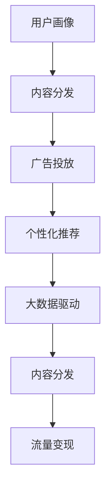

                 

# 注意力经济对新闻传播模式的改变

> 关键词：注意力经济、新闻传播模式、算法推荐、大数据、内容分发、流量变现

## 1. 背景介绍

### 1.1 问题由来

在信息爆炸的现代社会，新闻传播模式经历了从传统媒体时代到互联网时代的转变，尤其是在大数据、算法推荐、内容分发的推动下，新闻行业逐渐步入了注意力经济时代。这一时期的注意力经济，意味着在激烈竞争的市场环境中，新闻机构必须通过精准的目标受众定位和内容分发策略，吸引并锁定受众的注意力，从而实现流量变现和品牌价值的提升。

### 1.2 问题核心关键点

当前新闻传播模式主要面临以下几个关键问题：
1. 用户注意力分散：海量信息源导致用户注意力难以集中，如何有效锁定用户注意力成为一大难题。
2. 个性化推荐：基于大数据和机器学习，如何为不同用户推荐更贴合其兴趣和需求的新闻内容。
3. 流量变现：如何通过广告、付费订阅等方式实现内容的商业价值。
4. 内容分发：在多元化的信息传播渠道中，如何高效分发优质内容以获得最大曝光率。
5. 用户体验：如何在内容丰富度和用户体验之间取得平衡，避免过度商业化对用户体验的损害。

### 1.3 问题研究意义

研究注意力经济对新闻传播模式的影响，对于揭示信息时代新闻产业的演化规律、提升新闻传播效率、优化广告投放策略、实现内容分发的精准化和智能化，具有重要意义：

1. 提升新闻传播效率。通过深度学习和大数据技术，实现内容推荐和分发的智能化，提高新闻机构的传播效率和覆盖面。
2. 优化广告投放策略。通过精准的用户画像和兴趣预测，实现广告的精准投放，最大化广告效益。
3. 实现内容分发的精准化。通过算法推荐技术，将合适的内容推荐给合适的人，实现内容的最大化曝光。
4. 强化用户体验。通过用户行为分析和反馈收集，不断优化新闻平台的用户体验，增强用户粘性。
5. 实现流量变现。通过精准的用户定位和内容推荐，吸引更多高质量流量，实现更高的商业价值。

## 2. 核心概念与联系

### 2.1 核心概念概述

注意力经济是基于用户注意力的经济模式，旨在通过吸引和锁定用户注意力，实现商业价值的最大化。在新闻传播领域，注意力经济主要涉及以下几个核心概念：

- 注意力：用户对信息的关注程度，是衡量新闻价值的重要指标。
- 用户画像：通过用户行为和社交网络数据，构建详尽的个性化用户画像，实现精准推荐。
- 内容分发：在多渠道的信息传播中，如何高效、精准地分发内容，以获得最大曝光率。
- 广告投放：通过精准的目标用户定位和兴趣预测，实现广告的精准投放，最大化广告效益。
- 个性化推荐：基于用户兴趣和行为，实时推荐新闻内容，提升用户体验和内容点击率。
- 数据驱动：利用大数据和深度学习技术，驱动内容推荐和分发的智能化和精准化。

这些概念之间的逻辑关系可以通过以下Mermaid流程图来展示：



这个流程图展示了大数据和深度学习在新闻传播中的作用链条：

1. 用户画像通过对用户行为数据的分析，构建个性化用户画像。
2. 内容分发利用用户画像和兴趣预测，将合适的内容推荐给合适的人。
3. 广告投放结合用户画像，实现广告的精准投放。
4. 个性化推荐通过大数据和深度学习算法，实现实时内容推荐。
5. 大数据驱动利用多渠道数据，驱动内容推荐和分发的智能化。
6. 流量变现通过精准的用户定位和内容推荐，吸引高质量流量，实现商业价值。

## 3. 核心算法原理 & 具体操作步骤
### 3.1 算法原理概述

基于深度学习的注意力经济框架，主要涉及以下核心算法原理：

1. **深度学习模型**：利用深度神经网络模型，捕捉新闻内容与用户兴趣之间的复杂关系。
2. **用户画像**：通过用户行为数据，构建详尽的个性化用户画像。
3. **推荐算法**：结合内容特征和用户画像，实现个性化新闻内容的推荐。
4. **内容分发**：通过多渠道分发策略，实现内容的最大化曝光。
5. **广告投放**：利用广告算法，实现广告的精准投放。
6. **流量变现**：通过流量分析，实现基于用户行为的变现策略。

### 3.2 算法步骤详解

基于深度学习的注意力经济框架的构建，主要分为以下几个关键步骤：

**Step 1: 数据准备**

- 收集用户行为数据，包括浏览历史、点击记录、评论等。
- 构建用户画像，通过用户基本信息、行为偏好、社交网络等数据，描述用户特征。
- 准备新闻数据，包括标题、摘要、标签、作者等属性。
- 收集广告数据，包括广告位、广告内容、投放时间等属性。

**Step 2: 用户画像构建**

- 利用用户行为数据，提取用户兴趣特征，如点击偏好、阅读时长、转发行为等。
- 将用户画像表示为向量形式，用于后续推荐算法和广告投放。

**Step 3: 内容特征提取**

- 对新闻内容进行预处理，包括分词、去除停用词、提取关键词等。
- 利用TF-IDF、词嵌入等技术，提取新闻内容的特征向量。

**Step 4: 推荐算法设计**

- 设计推荐模型，如基于协同过滤、内容基推荐、深度学习推荐等算法。
- 结合用户画像和内容特征，计算新闻与用户的匹配度。
- 输出推荐结果，排序推荐新闻列表。

**Step 5: 内容分发策略**

- 选择合适的分发渠道，如网页、APP、社交媒体等。
- 设计多渠道分发策略，优化内容曝光率。
- 实时监控分发效果，调整分发策略。

**Step 6: 广告投放策略**

- 结合用户画像和广告特征，预测广告投放效果。
- 利用强化学习算法，优化广告投放策略。
- 实时监控广告效果，调整投放参数。

**Step 7: 流量变现分析**

- 收集用户点击、购买等行为数据。
- 分析用户行为数据，挖掘潜在变现机会。
- 设计变现策略，如付费订阅、广告变现等。

### 3.3 算法优缺点

基于深度学习的注意力经济框架具有以下优点：

1. **个性化精准化**：通过深度学习和大数据技术，实现个性化的内容推荐和广告投放，提升用户体验和广告效益。
2. **智能化分发**：利用多渠道分发策略和实时监控，实现内容的高效分发，提升内容曝光率。
3. **实时优化**：通过实时反馈和调整策略，不断优化推荐算法和广告投放，提高系统效果。
4. **高覆盖率**：通过精准的用户定位和内容推荐，实现高覆盖率的流量变现。

但同时也存在以下缺点：

1. **数据依赖**：依赖高质量的用户行为数据和广告数据，数据质量和数据量不足可能导致推荐效果不佳。
2. **模型复杂**：深度学习模型较为复杂，训练和部署成本较高，需要强大的计算资源支持。
3. **隐私风险**：用户行为数据的收集和处理可能涉及隐私问题，需遵守相关法律法规。
4. **用户信任**：过度商业化可能导致用户对平台的信任度下降，影响用户粘性。

### 3.4 算法应用领域

基于深度学习的注意力经济框架，已经在新闻传播的多个领域得到了广泛应用，包括但不限于：

1. **内容推荐系统**：如今日头条、微博热搜、网易新闻等，通过深度学习模型和推荐算法，实现个性化新闻内容的推荐。
2. **广告投放平台**：如百度竞价广告、腾讯广点通、Google AdSense，利用大数据和机器学习，实现广告的精准投放。
3. **内容分发平台**：如抖音、快手、YouTube，通过多渠道分发策略，实现内容的高效曝光和分发。
4. **流量变现渠道**：如付费订阅、广告收入、电商变现，通过深度学习和大数据分析，实现精准变现策略。
5. **用户行为分析**：通过用户行为数据的收集和分析，提升用户体验和平台粘性。

这些应用领域的实践，展示了深度学习和大数据在新闻传播中的强大作用，带来了新闻行业的新一轮变革。

## 4. 数学模型和公式 & 详细讲解 & 举例说明

### 4.1 数学模型构建

在基于深度学习的注意力经济框架中，主要涉及到以下几个数学模型：

1. **用户画像模型**：$u(x)$，表示用户特征的向量表示，其中$x$为用户的兴趣数据。
2. **内容特征模型**：$c(v)$，表示新闻内容的特征向量，其中$v$为新闻内容。
3. **推荐模型**：$f(u,c)$，表示用户和内容的匹配度。
4. **广告投放模型**：$a(u,p)$，表示广告与用户的匹配度，其中$p$为广告特征。
5. **流量变现模型**：$p(c)$，表示新闻内容的变现潜力，其中$c$为内容特征。

### 4.2 公式推导过程

#### 用户画像模型

用户画像模型$u(x)$可以表示为：

$$
u(x) = f(x; \theta_u) = \mathbf{W}_u \cdot x + \mathbf{b}_u
$$

其中，$\theta_u$为模型参数，$\mathbf{W}_u$为权重矩阵，$\mathbf{b}_u$为偏置向量。

#### 内容特征模型

内容特征模型$c(v)$可以表示为：

$$
c(v) = f(v; \theta_c) = \mathbf{W}_c \cdot v + \mathbf{b}_c
$$

其中，$\theta_c$为模型参数，$\mathbf{W}_c$为权重矩阵，$\mathbf{b}_c$为偏置向量。

#### 推荐模型

推荐模型$f(u,c)$可以表示为：

$$
f(u,c) = g(u,c; \theta_f) = \mathbf{W}_f \cdot (u \cdot c) + \mathbf{b}_f
$$

其中，$g(\cdot)$为激活函数，$\theta_f$为模型参数，$\mathbf{W}_f$为权重矩阵，$\mathbf{b}_f$为偏置向量。

#### 广告投放模型

广告投放模型$a(u,p)$可以表示为：

$$
a(u,p) = h(u,p; \theta_a) = \mathbf{W}_a \cdot (u \cdot p) + \mathbf{b}_a
$$

其中，$h(\cdot)$为激活函数，$\theta_a$为模型参数，$\mathbf{W}_a$为权重矩阵，$\mathbf{b}_a$为偏置向量。

#### 流量变现模型

流量变现模型$p(c)$可以表示为：

$$
p(c) = k(c; \theta_p) = \mathbf{W}_p \cdot c + \mathbf{b}_p
$$

其中，$k(\cdot)$为激活函数，$\theta_p$为模型参数，$\mathbf{W}_p$为权重矩阵，$\mathbf{b}_p$为偏置向量。

### 4.3 案例分析与讲解

以今日头条的新闻推荐系统为例，介绍其深度学习和大数据框架的具体实现：

**Step 1: 数据准备**

- 收集用户点击历史、阅读时长、收藏行为等数据，构建用户画像。
- 准备新闻标题、摘要、标签、作者等属性，提取关键词和TF-IDF特征。
- 收集广告位、广告内容、投放时间等属性，设计广告投放策略。

**Step 2: 用户画像构建**

- 利用用户行为数据，提取用户兴趣特征，如点击偏好、阅读时长、收藏行为等。
- 将用户画像表示为向量形式，用于后续推荐算法和广告投放。

**Step 3: 内容特征提取**

- 对新闻内容进行预处理，包括分词、去除停用词、提取关键词等。
- 利用TF-IDF、词嵌入等技术，提取新闻内容的特征向量。

**Step 4: 推荐算法设计**

- 设计推荐模型，如基于协同过滤、内容基推荐、深度学习推荐等算法。
- 结合用户画像和内容特征，计算新闻与用户的匹配度。
- 输出推荐结果，排序推荐新闻列表。

**Step 5: 内容分发策略**

- 选择合适的分发渠道，如网页、APP、社交媒体等。
- 设计多渠道分发策略，优化内容曝光率。
- 实时监控分发效果，调整分发策略。

**Step 6: 广告投放策略**

- 结合用户画像和广告特征，预测广告投放效果。
- 利用强化学习算法，优化广告投放策略。
- 实时监控广告效果，调整投放参数。

**Step 7: 流量变现分析**

- 收集用户点击、购买等行为数据。
- 分析用户行为数据，挖掘潜在变现机会。
- 设计变现策略，如付费订阅、广告变现等。

## 5. 项目实践：代码实例和详细解释说明

### 5.1 开发环境搭建

在进行新闻推荐系统的开发前，我们需要准备好开发环境。以下是使用Python进行TensorFlow开发的环境配置流程：

1. 安装Anaconda：从官网下载并安装Anaconda，用于创建独立的Python环境。

2. 创建并激活虚拟环境：
```bash
conda create -n tf-env python=3.8 
conda activate tf-env
```

3. 安装TensorFlow：根据CUDA版本，从官网获取对应的安装命令。例如：
```bash
conda install tensorflow tensorflow-gpu=2.6 -c pytorch -c conda-forge
```

4. 安装TensorBoard：
```bash
pip install tensorboard
```

5. 安装TensorFlow Addons：
```bash
pip install tensorflow-addons
```

完成上述步骤后，即可在`tf-env`环境中开始新闻推荐系统的开发。

### 5.2 源代码详细实现

下面我们以用户画像和推荐系统为例，给出使用TensorFlow构建新闻推荐系统的PyTorch代码实现。

首先，定义用户画像模型：

```python
import tensorflow as tf
from tensorflow.keras.layers import Input, Embedding, Dense
from tensorflow.keras.models import Model

user_input = Input(shape=(1,), name='user')
user_vec = Embedding(input_dim=1000, output_dim=64, name='user_embedding')(user_input)
user_vec = Dense(64, activation='relu')(user_vec)

user_profile = Model(inputs=user_input, outputs=user_vec)
```

然后，定义内容特征模型：

```python
content_input = Input(shape=(1,), name='content')
content_vec = Embedding(input_dim=10000, output_dim=64, name='content_embedding')(content_input)
content_vec = Dense(64, activation='relu')(content_vec)

content_profile = Model(inputs=content_input, outputs=content_vec)
```

接着，定义推荐模型：

```python
user_profile_out = user_profile(user_input)
content_profile_out = content_profile(content_input)
match_score = tf.keras.layers.Dot(axes=(1, 1), normalize=True)([user_profile_out, content_profile_out])
match_score = Dense(1, activation='sigmoid')(match_score)
recommender = Model(inputs=[user_input, content_input], outputs=match_score)
```

最后，定义用户画像和推荐系统的训练和评估函数：

```python
def train_step(user_input, content_input, user_profile_out, content_profile_out, match_score):
    with tf.GradientTape() as tape:
        predictions = recommender([user_input, content_input])
        loss = tf.keras.losses.BCELoss()(predictions, match_score)
    gradients = tape.gradient(loss, recommender.trainable_variables)
    optimizer.apply_gradients(zip(gradients, recommender.trainable_variables))

def evaluate_step(user_input, content_input, user_profile_out, content_profile_out, match_score):
    predictions = recommender([user_input, content_input])
    acc = tf.keras.metrics.Accuracy()(predictions, match_score)
    acc.update_state(match_score)
    return acc.result()

model.compile(optimizer=tf.keras.optimizers.Adam(), loss=tf.keras.losses.BCELoss(), metrics=['accuracy'])
```

## 6. 实际应用场景

### 6.1 智能新闻推荐系统

智能新闻推荐系统是新闻机构利用大数据和深度学习技术，为用户推荐个性化新闻内容的核心手段。通过用户画像和推荐算法，可以实现精准的内容推荐，提升用户体验和内容点击率。

在技术实现上，可以收集用户的历史点击记录、阅读时长、收藏行为等数据，构建详尽的用户画像。基于内容特征模型，提取新闻内容的关键词和TF-IDF特征。通过用户画像和内容特征的匹配，计算新闻与用户的匹配度，输出推荐结果。

### 6.2 广告精准投放平台

广告精准投放平台利用用户画像和广告特征，实现广告的精准投放，最大化广告效益。通过深度学习模型和强化学习算法，预测广告投放效果，实时调整投放策略，实现广告的智能优化。

在技术实现上，收集用户的基本信息、兴趣偏好、历史广告行为等数据，构建用户画像。基于广告特征和用户画像，设计广告投放模型，计算广告与用户的匹配度。利用强化学习算法，实时监控广告效果，调整投放参数，实现广告的精准投放。

### 6.3 内容分发多渠道策略

内容分发多渠道策略通过多渠道分发策略，实现内容的高效曝光。选择不同的分发渠道，如网页、APP、社交媒体等，设计多样化的分发策略，优化内容曝光率。

在技术实现上，基于用户画像和内容特征，设计多渠道分发策略。实时监控各渠道的内容曝光和点击数据，调整分发策略，实现内容的高效分发。

### 6.4 流量变现策略优化

流量变现策略优化通过用户行为数据分析，挖掘潜在变现机会，设计变现策略，如付费订阅、广告变现等。

在技术实现上，收集用户点击、购买等行为数据，分析用户行为数据，挖掘潜在变现机会。设计变现策略，如付费订阅、广告变现等。利用用户画像和内容特征，设计个性化变现策略，最大化变现效益。

## 7. 工具和资源推荐

### 7.1 学习资源推荐

为了帮助开发者系统掌握深度学习和大数据技术，以下推荐一些优质的学习资源：

1. 《深度学习》课程：斯坦福大学开设的深度学习课程，涵盖深度学习的基本概念和经典模型。

2. 《TensorFlow教程》：TensorFlow官方提供的官方教程，详细介绍了TensorFlow的基本用法和高级功能。

3. 《PyTorch教程》：PyTorch官方提供的官方教程，详细介绍了PyTorch的基本用法和高级功能。

4. 《机器学习实战》：Kaggle平台上丰富的机器学习竞赛数据集和解决方案，提供了大量实战案例。

5. 《推荐系统》书籍：《推荐系统实战》，该书系统介绍了推荐系统的构建和优化方法，涵盖了推荐算法、特征工程、模型评估等内容。

通过对这些资源的学习实践，相信你一定能够快速掌握深度学习和大数据技术，并用于解决实际的推荐问题。

### 7.2 开发工具推荐

高效的开发离不开优秀的工具支持。以下是几款用于新闻推荐系统开发的常用工具：

1. TensorFlow：由Google主导开发的开源深度学习框架，生产部署方便，适合大规模工程应用。

2. PyTorch：基于Python的开源深度学习框架，灵活动态的计算图，适合快速迭代研究。

3. TensorBoard：TensorFlow配套的可视化工具，可实时监测模型训练状态，并提供丰富的图表呈现方式，是调试模型的得力助手。

4. Weights & Biases：模型训练的实验跟踪工具，可以记录和可视化模型训练过程中的各项指标，方便对比和调优。

5. Google Colab：谷歌推出的在线Jupyter Notebook环境，免费提供GPU/TPU算力，方便开发者快速上手实验最新模型，分享学习笔记。

合理利用这些工具，可以显著提升新闻推荐系统的开发效率，加快创新迭代的步伐。

### 7.3 相关论文推荐

深度学习和大数据在新闻推荐系统中的应用已经取得了丰硕的成果，以下是几篇奠基性的相关论文，推荐阅读：

1. "A Survey on Deep Learning for News Recommendation"：综述了深度学习在新闻推荐系统中的应用，提供了系统的背景知识和最新进展。

2. "Personalized News Recommendation Using Deep Learning"：介绍了基于深度学习的个性化新闻推荐系统，展示了其在用户画像构建和内容特征提取方面的应用。

3. "DNN-based News Recommendation with Visual and Textual Features"：展示了利用深度学习模型处理多模态数据，提升新闻推荐的性能。

4. "Improving News Recommendation Using Deep Learning"：介绍了通过深度学习改进新闻推荐系统的最新技术，如上下文感知模型、多任务学习等。

5. "Real-time News Recommendation using Deep Learning"：展示了利用深度学习进行实时新闻推荐的方法，利用流式数据和实时优化技术，实现高效的推荐效果。

这些论文代表了大数据和深度学习在新闻推荐系统中的应用方向和最新进展，通过学习这些前沿成果，可以帮助研究者把握学科前进方向，激发更多的创新灵感。

## 8. 总结：未来发展趋势与挑战

### 8.1 总结

本文对基于深度学习的注意力经济框架进行了全面系统的介绍。首先阐述了注意力经济对新闻传播模式的影响，明确了深度学习和大数据在新闻推荐系统中的核心作用。其次，从原理到实践，详细讲解了深度学习和大数据在用户画像构建、内容特征提取、推荐算法设计等方面的实现细节，给出了新闻推荐系统的代码实现。同时，本文还广泛探讨了深度学习和大数据在新闻推荐系统的多个应用场景，展示了其广泛的适用性和强大的性能。

通过本文的系统梳理，可以看到，深度学习和大数据在新闻推荐系统中的应用，带来了新闻行业的新一轮变革。用户画像、推荐算法、内容分发、广告投放和流量变现等环节的深度学习和大数据分析，使得新闻机构能够更精准地定位用户需求，更高效地分发优质内容，更智能地实现广告投放和流量变现，极大地提升了新闻传播效率和商业价值。

### 8.2 未来发展趋势

展望未来，基于深度学习的注意力经济框架将呈现以下几个发展趋势：

1. **多模态数据融合**：利用图像、音频、视频等多模态数据，提升推荐系统的丰富度和准确性。

2. **个性化推荐优化**：通过深度学习算法，实现个性化推荐模型的优化和提升，提高用户满意度和点击率。

3. **实时数据处理**：利用流式数据处理技术，实现实时推荐和广告投放，提升系统响应速度。

4. **跨平台协同**：通过跨平台的用户画像和推荐算法，实现多渠道的协同推荐和广告投放，提升内容曝光率。

5. **隐私保护**：采用隐私保护技术，保护用户数据安全，确保用户隐私权益。

6. **联邦学习**：利用联邦学习技术，在保护用户隐私的前提下，提升推荐系统的性能。

以上趋势展示了深度学习和大数据在新闻推荐系统中的应用前景，将进一步推动新闻行业的智能化和精准化。

### 8.3 面临的挑战

尽管深度学习和大数据在新闻推荐系统中的应用已经取得了瞩目成就，但在迈向更加智能化、普适化应用的过程中，仍面临诸多挑战：

1. **数据质量问题**：高质量的新闻推荐系统需要大量高质量的数据，数据质量和数据量不足可能导致推荐效果不佳。

2. **算法复杂度**：深度学习模型较为复杂，训练和部署成本较高，需要强大的计算资源支持。

3. **隐私保护**：用户行为数据的收集和处理可能涉及隐私问题，需遵守相关法律法规。

4. **用户信任**：过度商业化可能导致用户对平台的信任度下降，影响用户粘性。

5. **系统可解释性**：推荐系统的决策过程较为复杂，难以解释其内部工作机制和决策逻辑，不利于用户理解和信任。

6. **多模态数据融合**：多模态数据的融合和处理较为复杂，需要更多的技术支持。

7. **实时优化**：实时推荐和广告投放需要高吞吐量的数据处理能力，系统扩展性需要进一步提升。

8. **跨平台协同**：多平台的用户画像和推荐算法协同需要更多的技术支持，提高协同效率。

9. **联邦学习**：联邦学习技术需要解决模型收敛性、数据同步等问题，技术挑战较大。

正视这些挑战，积极应对并寻求突破，将是大数据和深度学习在新闻推荐系统中走向成熟的必由之路。相信随着技术的发展和市场的成熟，深度学习和大数据将为新闻推荐系统带来更大的突破和创新。

### 8.4 研究展望

面向未来，深度学习和大数据在新闻推荐系统中的应用需要进一步深化研究，以下是几个研究展望：

1. **多模态数据融合**：探索如何更好地融合多模态数据，提升推荐系统的丰富度和准确性。

2. **个性化推荐优化**：通过深度学习算法，实现个性化推荐模型的优化和提升，提高用户满意度和点击率。

3. **实时数据处理**：利用流式数据处理技术，实现实时推荐和广告投放，提升系统响应速度。

4. **跨平台协同**：通过跨平台的用户画像和推荐算法，实现多渠道的协同推荐和广告投放，提升内容曝光率。

5. **隐私保护**：采用隐私保护技术，保护用户数据安全，确保用户隐私权益。

6. **联邦学习**：利用联邦学习技术，在保护用户隐私的前提下，提升推荐系统的性能。

7. **系统可解释性**：通过可解释性技术，提升推荐系统的透明度和用户信任度。

8. **推荐系统的伦理和公平性**：研究推荐系统的伦理和公平性问题，避免推荐算法中的偏见和歧视。

这些研究方向将推动深度学习和大数据在新闻推荐系统中的应用，进一步提升新闻行业的智能化和精准化水平，为新闻机构和用户带来更大的价值。

## 9. 附录：常见问题与解答

**Q1：新闻推荐系统如何处理冷启动问题？**

A: 冷启动问题是指用户在平台上停留时间较短，没有足够的历史行为数据时，推荐系统难以准确推荐。解决冷启动问题的方法包括：
1. 利用兴趣图谱，通过用户的兴趣图谱来推断用户的行为，实现冷启动推荐。
2. 利用协同过滤算法，通过类似用户的推荐来实现冷启动推荐。
3. 利用基于内容的推荐算法，通过相似内容的推荐来实现冷启动推荐。
4. 利用人工干预，通过用户反馈和人工干预来优化推荐结果。

**Q2：如何评估新闻推荐系统的性能？**

A: 评估新闻推荐系统的性能主要包括以下几个指标：
1. 点击率（Click-Through Rate, CTR）：表示用户点击新闻的比例，用于衡量推荐系统的效果。
2. 覆盖率（Coverage）：表示推荐系统中不同新闻的曝光量，用于衡量系统的多样性。
3. 准确率（Precision）：表示推荐系统推荐的正确新闻比例，用于衡量推荐的准确性。
4. 召回率（Recall）：表示推荐系统中正确新闻的曝光量，用于衡量系统的完整性。
5. F1分数（F1 Score）：综合考虑准确率和召回率，用于衡量系统的综合性能。

通过对这些指标的评估，可以全面了解推荐系统的性能表现，并进行优化改进。

**Q3：如何优化新闻推荐系统的推荐算法？**

A: 优化新闻推荐系统的推荐算法主要包括以下几个方法：
1. 特征工程：通过增加新的特征，提升模型的准确性和泛化能力。
2. 模型选择：选择适合任务的推荐算法，如协同过滤、内容基推荐、深度学习推荐等。
3. 模型调参：通过调参，优化模型的超参数，提升模型效果。
4. 数据清洗：清洗不完整、不准确、噪声数据，提升模型性能。
5. 模型集成：通过模型集成，提升系统的稳定性和泛化能力。
6. 实时优化：利用实时数据和反馈，不断优化推荐算法和策略。

通过以上方法，可以不断提升推荐系统的推荐效果和用户体验。

**Q4：如何在新闻推荐系统中实现广告精准投放？**

A: 在新闻推荐系统中实现广告精准投放，主要包括以下几个步骤：
1. 用户画像：通过用户行为数据，构建详尽的个性化用户画像。
2. 广告特征：提取广告的特征，如广告位、广告内容、投放时间等。
3. 广告投放模型：设计广告投放模型，计算广告与用户的匹配度。
4. 强化学习：利用强化学习算法，实时调整广告投放策略。
5. 实时监控：实时监控广告效果，调整投放参数，实现广告的精准投放。

通过以上步骤，可以实现广告的精准投放，最大化广告效益。

**Q5：新闻推荐系统如何处理用户隐私问题？**

A: 处理用户隐私问题，主要包括以下几个方法：
1. 数据匿名化：对用户数据进行匿名化处理，保护用户隐私。
2. 数据加密：对用户数据进行加密，防止数据泄露。
3. 数据访问控制：控制数据的访问权限，防止数据被非法访问。
4. 隐私保护算法：采用隐私保护算法，如差分隐私、联邦学习等，保护用户隐私。

通过以上方法，可以保护用户隐私，确保数据安全和用户权益。

总之，新闻推荐系统作为深度学习和大数据应用的典型场景，已经带来了新闻行业的新一轮变革。随着技术的不断发展，新闻推荐系统将在用户画像构建、内容推荐、广告投放、流量变现等方面取得更大的突破，为用户带来更好的体验和价值。

