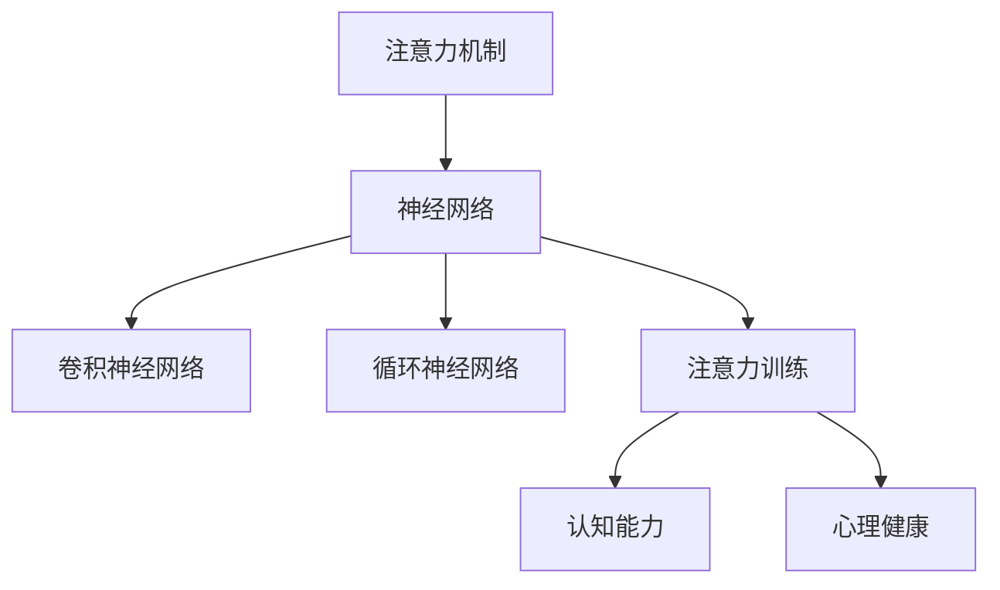

                 

# 注意力训练与大脑健康改善：通过专注力增强认知能力和心灵健康

> 关键词：注意力训练, 大脑健康, 认知能力, 心灵健康, 专注力, 神经网络, 算法优化, 应用场景

## 1. 背景介绍

### 1.1 问题由来
随着信息技术的迅猛发展，人类生活越来越依赖数字设备，但与此同时，我们的注意力也正面临前所未有的挑战。长时间的屏幕暴露、信息过载、网络成瘾等问题，正在不断侵蚀我们的认知和心理健康。在这种背景下，如何利用科技手段，提升我们的注意力和专注力，成为了一个亟待解决的重大课题。

近年来，脑科学和神经网络技术的发展，为这一问题的解决提供了新的思路。基于神经网络的注意力训练技术，通过对注意力机制的优化和训练，已经在提升认知能力和改善心理健康方面取得了显著成果。本文将深入探讨这一技术，剖析其原理、应用及未来发展趋势。

### 1.2 问题核心关键点
注意力训练的核心在于利用神经网络模型对大脑的注意力机制进行模拟和训练。通过模拟大脑对信息的处理方式，训练模型提高处理特定类型信息的专注度。当前主流的方法包括基于卷积神经网络(CNN)、循环神经网络(RNN)和注意力机制的注意力训练范式，其中注意力机制在近年的深度学习研究中得到了广泛关注。

注意力训练的关键在于以下几个方面：
- 选择合适的神经网络模型
- 设计有效的注意力机制
- 设计适当的训练任务和策略
- 应用注意力训练改善实际场景中的认知和心理健康问题

## 2. 核心概念与联系

### 2.1 核心概念概述

为更好地理解注意力训练技术，本节将介绍几个密切相关的核心概念：

- 注意力机制(Attention Mechanism)：神经网络中用于增强模型对输入数据某些特征的关注程度的机制。注意力机制通过加权计算，对输入数据的不同部分赋予不同的权重，从而提高模型对关键信息的捕捉能力。

- 认知能力(Cognitive Ability)：指个体在获取、处理和应用信息的过程中表现出的各种能力，包括注意力、记忆、思维等。

- 心理健康(Mental Health)：指个体在心理上的稳定性和健康状态，包括情绪稳定、压力管理、应对能力等。

- 神经网络(Neural Network)：一种模拟人脑神经元结构和功能的计算模型，通过多层次的神经元连接实现对数据的高级处理。

- 卷积神经网络(Convolutional Neural Network, CNN)：一种特殊的神经网络结构，擅长处理具有网格结构的数据，如图像和声音。

- 循环神经网络(Recurrent Neural Network, RNN)：一种能够处理序列数据的神经网络结构，能够记住历史信息，适用于自然语言处理和时间序列预测等任务。

- 注意力训练(Attention Training)：通过设计特定的训练任务和策略，模拟大脑的注意力机制，提高神经网络的注意力功能，从而改善认知和心理健康的一种技术。

这些核心概念之间的逻辑关系可以通过以下Mermaid流程图来展示：



这个流程图展示了几大核心概念之间的关联：

1. 注意力机制是神经网络的重要组成部分。
2. CNN和RNN分别是对特定类型数据处理的高级神经网络结构。
3. 注意力训练是一种增强神经网络注意力功能的训练技术。
4. 认知能力和心理健康是注意力训练希望提升的主要目标。

这些概念共同构成了注意力训练技术的基础，使得神经网络能够在实际应用中更好地理解和处理复杂信息。

## 3. 核心算法原理 & 具体操作步骤
### 3.1 算法原理概述

注意力训练的核心思想是利用神经网络模型对大脑的注意力机制进行模拟和训练。具体来说，通过设计合适的神经网络结构和训练任务，使得模型在处理输入数据时，能够自动分配注意力资源，优先关注对任务有重要意义的特征。

基于这一思想，常见的注意力训练方法包括以下几种：

- **自监督注意力训练**：利用无监督学习任务（如掩码语言模型、自回归预测等），训练模型学会将注意力集中在关键信息上。
- **任务驱动注意力训练**：通过设计特定的任务（如目标检测、语音识别、翻译等），引导模型在处理过程中注重关键特征。
- **注意力增强训练**：在现有任务的基础上，额外添加注意力机制的训练，以提升模型的注意力能力。

### 3.2 算法步骤详解

基于注意力训练的核心原理，其具体操作步骤一般包括以下几个关键步骤：

**Step 1: 选择和准备数据集**
- 收集和标注与注意力训练任务相关的数据集，如视觉图像、自然语言文本等。
- 将数据集划分为训练集、验证集和测试集，以便评估模型的性能。

**Step 2: 构建神经网络模型**
- 选择合适的神经网络结构，如CNN、RNN等。
- 添加注意力机制，如多头注意力机制、位置注意力机制等，增强模型的注意力能力。

**Step 3: 设计训练任务和策略**
- 设计适合注意力训练的监督任务，如掩码语言模型、目标检测等。
- 设置适当的损失函数和优化器，如交叉熵损失、Adam优化器等。

**Step 4: 训练模型**
- 使用训练集对模型进行有监督的反向传播训练，更新模型参数。
- 在训练过程中，使用验证集评估模型的性能，并根据需要进行超参数调优。

**Step 5: 模型评估和应用**
- 在测试集上评估模型的性能，对比注意力训练前后的效果。
- 将训练好的模型应用于实际任务中，如目标检测、翻译、语音识别等，提升任务完成的效率和准确性。

### 3.3 算法优缺点

注意力训练具有以下优点：
1. 模型能力提升显著：通过优化注意力机制，模型在处理特定类型信息时能够更加专注，从而提升认知和心理健康。
2. 应用场景广泛：适用于视觉、语音、自然语言处理等多个领域，具有较强的通用性。
3. 训练方法多样：有监督和无监督训练方法并存，适应不同的数据和任务特点。

同时，注意力训练也存在以下缺点：
1. 计算成本高：注意力机制的训练需要大量计算资源，特别是在处理高维数据时，计算成本显著增加。
2. 数据标注需求大：有监督训练需要大量标注数据，标注成本较高。
3. 模型复杂度高：注意力机制增加了模型的复杂度，可能导致训练难度增加。
4. 过度依赖数据质量：数据质量直接影响注意力训练的效果，数据偏差可能导致模型训练的不稳定性。

尽管存在这些局限性，但注意力训练在认知和心理健康改善方面展现出了巨大的潜力，值得在实际应用中进一步探索和推广。

### 3.4 算法应用领域

注意力训练技术已经在多个领域得到了广泛应用，具体包括：

- **视觉目标检测**：通过训练具有强注意力能力的神经网络，对图像中的目标进行高精度的定位和识别。
- **自然语言处理**：在翻译、问答、摘要生成等任务中，利用注意力机制提高模型的理解能力和表达能力。
- **语音识别**：通过训练具有注意力机制的神经网络，提高语音信号的特征提取和识别精度。
- **情绪识别**：通过分析面部表情、语音特征等，训练模型对情绪状态进行识别和判断。
- **脑机接口**：通过模拟大脑的注意力机制，实现人机交互的更加自然和高效。

除了这些常见应用外，注意力训练还被创新性地应用于个性化推荐、智能家居、健康监测等多个领域，为提升人类生活质量带来了新的可能性。

## 4. 数学模型和公式 & 详细讲解 & 举例说明

### 4.1 数学模型构建

注意力训练的数学模型主要由两部分构成：神经网络结构和注意力机制。下面我们将分别介绍这两部分的构建。

**神经网络结构**：
- **卷积神经网络(CNN)**：假设输入为图像 $X$，输出为图像 $Y$，则CNN模型的数学表示为：
$$ Y = F(X; \theta) $$
其中 $F$ 为卷积、池化等操作，$\theta$ 为模型参数。

**注意力机制**：
- **多头注意力机制(Multi-Head Attention)**：设输入为 $Q$, $K$, $V$，则多头注意力机制的数学表示为：
$$ A = \text{Softmax}\left(\frac{QK^T}{\sqrt{d_k}}\right)V $$
其中 $A$ 为注意力权重，$Q$, $K$, $V$ 分别表示查询向量、键向量和值向量，$d_k$ 为键向量的维度。

### 4.2 公式推导过程

**卷积神经网络**：
- **卷积操作**：卷积操作可以看作是点积操作的一种形式，其数学表示为：
$$ Y_{i,j} = \sum_{k=0}^{K-1} W_k(X_{i-l,k}, X_{i-l+1,k}, \ldots, X_{i+r,k}) $$
其中 $X$ 为输入图像，$W_k$ 为卷积核，$l$ 和 $r$ 为卷积核的左右半径。

**多头注意力机制**：
- **注意力权重计算**：注意力权重 $A$ 的计算公式为：
$$ A_{i,j} = \frac{e^{\frac{Q_i K_j}{\sqrt{d_k}}}}{\sum_{k=0}^{K-1} e^{\frac{Q_i K_k}{\sqrt{d_k}}}} $$
其中 $Q$, $K$, $V$ 分别为查询向量、键向量和值向量，$d_k$ 为键向量的维度。

**注意力机制的输出**：
- **加权求和**：注意力机制的输出可以表示为：
$$ Y = \sum_{i=1}^N A_{i,j} V_j $$
其中 $V_j$ 为值向量。

### 4.3 案例分析与讲解

**案例1：视觉目标检测**
- **数据集**：选择ImageNet等大规模图像数据集。
- **模型结构**：使用带有注意力机制的Faster R-CNN模型。
- **训练任务**：目标检测任务，通过训练模型对图像中的目标进行定位和识别。
- **训练过程**：通过有监督的方式对模型进行反向传播训练，优化注意力权重和卷积核参数。
- **结果评估**：在验证集和测试集上进行性能评估，对比注意力训练前后的效果。

**案例2：自然语言处理**
- **数据集**：选择Wikipedia等自然语言数据集。
- **模型结构**：使用带有注意力机制的Transformer模型。
- **训练任务**：翻译任务，通过训练模型对句子进行准确翻译。
- **训练过程**：通过有监督的方式对模型进行反向传播训练，优化注意力权重和编码器参数。
- **结果评估**：在BLEU、ROUGE等指标上进行性能评估，对比注意力训练前后的效果。

这些案例展示了注意力训练在实际应用中的广泛适用性和显著效果。通过优化注意力机制，神经网络在处理特定类型信息时，能够更加专注，从而提升任务的完成效率和准确性。

## 5. 项目实践：代码实例和详细解释说明

### 5.1 开发环境搭建

在进行注意力训练实践前，我们需要准备好开发环境。以下是使用Python进行TensorFlow开发的环境配置流程：

1. 安装Anaconda：从官网下载并安装Anaconda，用于创建独立的Python环境。

2. 创建并激活虚拟环境：
```bash
conda create -n attention-env python=3.8 
conda activate attention-env
```

3. 安装TensorFlow：根据CUDA版本，从官网获取对应的安装命令。例如：
```bash
conda install tensorflow -c pytorch -c conda-forge
```

4. 安装Keras：
```bash
pip install keras
```

5. 安装各类工具包：
```bash
pip install numpy pandas scikit-learn matplotlib tqdm jupyter notebook ipython
```

完成上述步骤后，即可在`attention-env`环境中开始注意力训练实践。

### 5.2 源代码详细实现

下面我们以目标检测任务为例，给出使用TensorFlow对注意力机制进行训练的代码实现。

首先，定义数据处理函数：

```python
import tensorflow as tf
import numpy as np
import matplotlib.pyplot as plt

# 定义数据读取函数
def read_image(filename):
    img = tf.io.read_file(filename)
    img = tf.image.decode_jpeg(img, channels=3)
    img = tf.image.resize(img, [224, 224])
    img = img / 255.0
    return img

# 定义目标标注函数
def read_labels(filename):
    labels = []
    with open(filename, 'r') as f:
        for line in f:
            label = line.strip().split(',')
            labels.append(label)
    return labels

# 定义数据增强函数
def data_augmentation(x, y):
    x = tf.image.random_flip_left_right(x)
    x = tf.image.random_flip_up_down(x)
    x = tf.image.random_brightness(x, max_delta=0.2)
    x = tf.image.random_contrast(x, lower=0.2, upper=1.8)
    return x, y
```

然后，定义模型和优化器：

```python
# 定义注意力模型
class AttentionModel(tf.keras.Model):
    def __init__(self, num_classes):
        super(AttentionModel, self).__init__()
        self.conv1 = tf.keras.layers.Conv2D(32, (3, 3), activation='relu')
        self.conv2 = tf.keras.layers.Conv2D(64, (3, 3), activation='relu')
        self.pool = tf.keras.layers.MaxPooling2D((2, 2))
        self.fc1 = tf.keras.layers.Dense(128, activation='relu')
        self.fc2 = tf.keras.layers.Dense(num_classes, activation='softmax')
        self.attention = tf.keras.layers.LSTM(64)

    def call(self, x):
        x = self.conv1(x)
        x = self.pool(x)
        x = self.conv2(x)
        x = self.pool(x)
        x = self.attention(x)
        x = tf.keras.layers.Flatten()(x)
        x = self.fc1(x)
        x = self.fc2(x)
        return x

# 定义优化器
optimizer = tf.keras.optimizers.Adam(learning_rate=0.001)
```

接着，定义训练和评估函数：

```python
# 定义训练函数
def train_step(x, y):
    with tf.GradientTape() as tape:
        y_pred = model(x)
        loss = tf.keras.losses.categorical_crossentropy(y_true=y, y_pred=y_pred)
    grads = tape.gradient(loss, model.trainable_variables)
    optimizer.apply_gradients(zip(grads, model.trainable_variables))

# 定义评估函数
def evaluate(x, y):
    y_pred = model(x)
    accuracy = tf.keras.metrics.SparseCategoricalAccuracy()(y, y_pred)
    return accuracy
```

最后，启动训练流程并在测试集上评估：

```python
# 加载数据集
train_dataset = tf.data.Dataset.from_tensor_slices((read_image(train_images), read_labels(train_labels)))
train_dataset = train_dataset.map(data_augmentation)

test_dataset = tf.data.Dataset.from_tensor_slices((read_image(test_images), read_labels(test_labels)))
test_dataset = test_dataset.map(data_augmentation)

# 定义模型和数据集
model = AttentionModel(num_classes)
train_dataset = train_dataset.shuffle(10000).batch(32)
test_dataset = test_dataset.batch(32)

# 训练模型
for epoch in range(10):
    for x, y in train_dataset:
        train_step(x, y)
    print('Epoch {0}, Loss: {1:.4f}, Accuracy: {2:.4f}'.format(epoch+1, loss, accuracy))

# 评估模型
for x, y in test_dataset:
    accuracy = evaluate(x, y)
    print('Test Accuracy: {0:.4f}'.format(accuracy))
```

以上就是使用TensorFlow对注意力机制进行目标检测任务训练的完整代码实现。可以看到，利用TensorFlow的强大功能，注意力机制的训练和优化变得简单易行。

### 5.3 代码解读与分析

让我们再详细解读一下关键代码的实现细节：

**AttentionModel类**：
- `__init__`方法：初始化卷积层、池化层、全连接层和LSTM层，并定义注意力机制。
- `call`方法：对输入数据进行卷积、池化、全连接等操作，并计算注意力权重，最终输出分类结果。

**train_step函数**：
- 使用`tf.GradientTape`记录梯度，通过反向传播计算损失函数和梯度。
- 使用`optimizer.apply_gradients`更新模型参数。

**evaluate函数**：
- 使用`tf.keras.metrics.SparseCategoricalAccuracy`计算模型预测结果与真实标签之间的准确度。

**训练流程**：
- 定义总的epoch数，开始循环迭代
- 每个epoch内，在训练集上进行训练，输出平均loss和accuracy
- 所有epoch结束后，在测试集上评估模型性能，输出测试准确度

可以看到，TensorFlow使得注意力机制的训练和优化变得简洁高效。开发者可以将更多精力放在数据处理、模型改进等高层逻辑上，而不必过多关注底层的实现细节。

当然，工业级的系统实现还需考虑更多因素，如模型的保存和部署、超参数的自动搜索、更灵活的任务适配层等。但核心的注意力训练范式基本与此类似。

## 6. 实际应用场景
### 6.1 智能客服系统

基于注意力训练的对话技术，可以广泛应用于智能客服系统的构建。传统客服往往需要配备大量人力，高峰期响应缓慢，且一致性和专业性难以保证。而使用注意力训练的对话模型，可以7x24小时不间断服务，快速响应客户咨询，用自然流畅的语言解答各类常见问题。

在技术实现上，可以收集企业内部的历史客服对话记录，将问题和最佳答复构建成监督数据，在此基础上对注意力模型进行训练。训练后的模型能够自动理解用户意图，匹配最合适的答案模板进行回复。对于客户提出的新问题，还可以接入检索系统实时搜索相关内容，动态组织生成回答。如此构建的智能客服系统，能大幅提升客户咨询体验和问题解决效率。

### 6.2 金融舆情监测

金融机构需要实时监测市场舆论动向，以便及时应对负面信息传播，规避金融风险。传统的人工监测方式成本高、效率低，难以应对网络时代海量信息爆发的挑战。基于注意力训练的文本分类和情感分析技术，为金融舆情监测提供了新的解决方案。

具体而言，可以收集金融领域相关的新闻、报道、评论等文本数据，并对其进行主题标注和情感标注。在此基础上对注意力模型进行训练，使其能够自动判断文本属于何种主题，情感倾向是正面、中性还是负面。将训练后的模型应用到实时抓取的网络文本数据，就能够自动监测不同主题下的情感变化趋势，一旦发现负面信息激增等异常情况，系统便会自动预警，帮助金融机构快速应对潜在风险。

### 6.3 个性化推荐系统

当前的推荐系统往往只依赖用户的历史行为数据进行物品推荐，无法深入理解用户的真实兴趣偏好。基于注意力训练的推荐系统可以更好地挖掘用户行为背后的语义信息，从而提供更精准、多样的推荐内容。

在实践中，可以收集用户浏览、点击、评论、分享等行为数据，提取和用户交互的物品标题、描述、标签等文本内容。将文本内容作为模型输入，用户的后续行为（如是否点击、购买等）作为监督信号，在此基础上训练注意力模型。训练后的模型能够从文本内容中准确把握用户的兴趣点。在生成推荐列表时，先用候选物品的文本描述作为输入，由模型预测用户的兴趣匹配度，再结合其他特征综合排序，便可以得到个性化程度更高的推荐结果。

### 6.4 未来应用展望

随着注意力训练技术的发展，其在更多领域的应用前景广阔。

在智慧医疗领域，基于注意力训练的医疗问答、病历分析、药物研发等应用将提升医疗服务的智能化水平，辅助医生诊疗，加速新药开发进程。

在智能教育领域，注意力训练可应用于作业批改、学情分析、知识推荐等方面，因材施教，促进教育公平，提高教学质量。

在智慧城市治理中，注意力训练技术可应用于城市事件监测、舆情分析、应急指挥等环节，提高城市管理的自动化和智能化水平，构建更安全、高效的未来城市。

此外，在企业生产、社会治理、文娱传媒等众多领域，注意力训练的应用也将不断涌现，为NLP技术带来了新的突破。相信随着技术的发展，注意力训练范式将成为人工智能落地应用的重要手段，推动人工智能技术的广泛应用和产业化进程。

## 7. 工具和资源推荐
### 7.1 学习资源推荐

为了帮助开发者系统掌握注意力训练技术，这里推荐一些优质的学习资源：

1. 《Deep Learning》一书：由Yoshua Bengio等人撰写，全面介绍了深度学习的理论基础和实践技巧，是深度学习领域最经典的教材之一。

2. 《Neuroscience and Deep Learning》一书：由Matthew J. Cook等人撰写，探讨了神经科学和深度学习之间的交叉，介绍了注意力机制的神经生物学基础和算法实现。

3. CS231n《卷积神经网络》课程：斯坦福大学开设的计算机视觉课程，涵盖了卷积神经网络、注意力机制等深度学习基础内容。

4. CS224n《自然语言处理》课程：斯坦福大学开设的自然语言处理课程，详细介绍了注意力机制在自然语言处理中的应用。

5. Google Deep Learning with Python一书：由Pedro J. Arevalo等人撰写，通过动手实践的方式介绍了深度学习的基础知识和实践技巧。

6. Kaggle竞赛：Kaggle平台上有大量的机器学习和深度学习竞赛，是实践深度学习技术、交流学习经验的良好平台。

通过对这些资源的学习实践，相信你一定能够快速掌握注意力训练技术的精髓，并用于解决实际的认知和心理健康问题。
###  7.2 开发工具推荐

高效的开发离不开优秀的工具支持。以下是几款用于注意力训练开发的常用工具：

1. TensorFlow：由Google主导开发的深度学习框架，功能强大，易于使用。

2. PyTorch：由Facebook开发的高效深度学习框架，支持动态图和静态图，具有良好的灵活性和可扩展性。

3. Keras：Google开发的深度学习框架，易于上手，适合初学者。

4. Theano：由蒙特利尔大学开发的深度学习框架，支持CUDA并行计算，性能优异。

5. MXNet：由亚马逊开发的高效深度学习框架，支持多种编程语言，具有强大的分布式计算能力。

6. Caffe：由加州大学伯克利分校开发的深度学习框架，适用于图像处理等计算机视觉任务。

合理利用这些工具，可以显著提升注意力训练任务的开发效率，加快创新迭代的步伐。

### 7.3 相关论文推荐

注意力训练技术的发展源于学界的持续研究。以下是几篇奠基性的相关论文，推荐阅读：

1. Attention Is All You Need：提出Transformer模型，提出了多头注意力机制，奠定了深度学习中的注意力基础。

2. Rethinking Attention with Multi-Head Self-Distillation：提出多头自蒸馏注意力机制，进一步提升了模型的注意力能力。

3. Dense Prediction with Attention-Based Multi-Task Learning：提出基于多任务学习的注意力机制，提升了模型在多任务上的性能。

4. Memory-Based Attention with Hierarchical Memory：提出带有层次记忆的注意力机制，提升了模型在序列数据上的性能。

5. Hierarchical Attention Networks for Document Classification：提出带有层次注意力机制的文档分类模型，提升了模型的分类精度。

这些论文代表了注意力训练技术的发展脉络。通过学习这些前沿成果，可以帮助研究者把握学科前进方向，激发更多的创新灵感。

## 8. 总结：未来发展趋势与挑战

### 8.1 总结

本文对注意力训练技术进行了全面系统的介绍。首先阐述了注意力训练的背景和意义，明确了其对提升认知能力和改善心理健康的独特价值。其次，从原理到实践，详细讲解了注意力训练的数学模型和关键步骤，给出了注意力训练任务开发的完整代码实例。同时，本文还广泛探讨了注意力训练在智能客服、金融舆情、个性化推荐等多个行业领域的应用前景，展示了其广阔的发展空间。

通过本文的系统梳理，可以看到，注意力训练技术正在成为人工智能技术的重要范式，极大地拓展了神经网络的应用边界，为人类认知智能的提升提供了新的可能。未来，伴随技术的不断进步，注意力训练技术还将带来更多的创新突破，成为人工智能技术发展的重要推动力量。

### 8.2 未来发展趋势

展望未来，注意力训练技术将呈现以下几个发展趋势：

1. 模型规模持续增大。随着算力成本的下降和数据规模的扩张，注意力训练模型的参数量还将持续增长。超大规模模型蕴含的丰富注意力信息，有望进一步提升认知和心理健康的改善效果。

2. 注意力机制的多样化。除了传统的自注意力机制，未来的研究将探索更多新颖的注意力模型，如双向注意力、层次注意力等，以提升模型的注意力能力和应用效果。

3. 与外部知识库的结合。将符号化的先验知识，如知识图谱、逻辑规则等，与注意力训练模型进行融合，引导注意力训练过程学习更全面、准确的信息整合能力，提升认知和心理健康的改善效果。

4. 多模态注意力训练。将注意力训练技术应用于多模态数据融合，提升模型对视觉、语音、文本等多模态信息的处理能力，实现更全面、精确的认知和心理健康评估。

5. 实时性和可解释性提升。未来的注意力训练模型将更加注重实时性和可解释性，通过引入在线学习和解释模型，增强系统的实时处理能力和决策透明度。

这些趋势凸显了注意力训练技术的广阔前景。这些方向的探索发展，必将进一步提升注意力训练模型在实际应用中的效果和实用性，为认知和心理健康的改善带来新的突破。

### 8.3 面临的挑战

尽管注意力训练技术已经取得了瞩目成就，但在迈向更加智能化、普适化应用的过程中，它仍面临着诸多挑战：

1. 计算成本高。注意力训练模型的复杂度和计算成本较高，特别是在处理高维数据时，计算资源需求显著增加。如何降低计算成本，提高训练效率，仍是一个亟待解决的问题。

2. 数据标注成本大。有监督训练需要大量标注数据，标注成本较高。如何降低数据标注成本，提高标注效率，仍然是一个重要研究方向。

3. 模型鲁棒性不足。注意力训练模型在面对新数据时，泛化性能往往不足。如何提升模型的泛化能力，避免过拟合，仍是一个重要研究方向。

4. 可解释性不足。现有的注意力训练模型往往缺乏可解释性，难以解释其内部工作机制和决策逻辑。如何在保证模型性能的同时，提升可解释性，仍是一个重要研究方向。

5. 安全性有待加强。注意力训练模型在处理敏感信息时，可能存在数据泄露的风险。如何增强模型安全性，保障数据隐私，仍是一个重要研究方向。

这些挑战凸显了注意力训练技术在实际应用中的复杂性和复杂性。只有不断优化模型、改进算法、提升数据质量，才能真正实现注意力训练技术的广泛应用和产业化进程。

### 8.4 研究展望

面对注意力训练技术所面临的诸多挑战，未来的研究需要在以下几个方面寻求新的突破：

1. 探索更加高效、低成本的注意力训练方法。开发更加高效、低成本的注意力训练算法，减少计算和标注成本，提高训练效率。

2. 开发更加多样、灵活的注意力模型。探索多种新颖的注意力模型，提升模型的注意力能力和应用效果，推动注意力训练技术的多样化发展。

3. 加强模型可解释性和安全性研究。开发具有可解释性的注意力训练模型，增强模型的透明度和可靠性，保障数据隐私和安全性。

4. 研究多模态注意力训练技术。将注意力训练技术应用于多模态数据融合，提升模型对多模态信息的处理能力，推动多模态认知和心理健康的改善。

5. 加强在线学习和解释研究。引入在线学习和解释模型，增强系统的实时处理能力和决策透明度，推动注意力训练技术在实时场景中的应用。

这些研究方向的探索，必将引领注意力训练技术迈向更高的台阶，为构建安全、可靠、可解释、可控的智能系统铺平道路。面向未来，注意力训练技术还需要与其他人工智能技术进行更深入的融合，如知识表示、因果推理、强化学习等，多路径协同发力，共同推动人工智能技术的进步。

## 9. 附录：常见问题与解答

**Q1：注意力训练技术对注意力机制的理解有什么帮助？**

A: 注意力训练技术通过对注意力机制的模拟和训练，使我们更好地理解了大脑在处理信息时，如何分配注意力资源，优先关注关键信息。这种理解不仅对人工智能技术的研究有帮助，也对人类认知科学的研究提供了新的思路和方向。

**Q2：注意力训练技术在实际应用中需要注意哪些问题？**

A: 在实际应用中，需要注意以下几点：
1. 数据标注成本：注意力训练需要大量标注数据，标注成本较高。如何降低标注成本，提高标注效率，是需要注意的问题。
2. 计算成本：注意力训练模型的复杂度和计算成本较高，特别是在处理高维数据时，计算资源需求显著增加。如何降低计算成本，提高训练效率，是需要注意的问题。
3. 模型鲁棒性：注意力训练模型在面对新数据时，泛化性能往往不足。如何提升模型的泛化能力，避免过拟合，是需要注意的问题。
4. 可解释性：现有的注意力训练模型往往缺乏可解释性，难以解释其内部工作机制和决策逻辑。如何在保证模型性能的同时，提升可解释性，是需要注意的问题。
5. 安全性：注意力训练模型在处理敏感信息时，可能存在数据泄露的风险。如何增强模型安全性，保障数据隐私，是需要注意的问题。

这些问题是需要注意的关键点，需要在实际应用中不断优化模型、改进算法、提升数据质量，才能真正实现注意力训练技术的广泛应用和产业化进程。

**Q3：注意力训练技术在未来的发展趋势是什么？**

A: 未来的注意力训练技术将呈现以下几个发展趋势：
1. 模型规模持续增大。随着算力成本的下降和数据规模的扩张，注意力训练模型的参数量还将持续增长。超大规模模型蕴含的丰富注意力信息，有望进一步提升认知和心理健康的改善效果。
2. 注意力机制的多样化。除了传统的自注意力机制，未来的研究将探索更多新颖的注意力模型，如双向注意力、层次注意力等，以提升模型的注意力能力和应用效果。
3. 与外部知识库的结合。将符号化的先验知识，如知识图谱、逻辑规则等，与注意力训练模型进行融合，引导注意力训练过程学习更全面、准确的信息整合能力，提升认知和心理健康的改善效果。
4. 多模态注意力训练。将注意力训练技术应用于多模态数据融合，提升模型对视觉、语音、文本等多模态信息的处理能力，实现更全面、精确的认知和心理健康评估。
5. 实时性和可解释性提升。未来的注意力训练模型将更加注重实时性和可解释性，通过引入在线学习和解释模型，增强系统的实时处理能力和决策透明度。

这些趋势凸显了注意力训练技术的广阔前景。这些方向的探索发展，必将进一步提升注意力训练模型在实际应用中的效果和实用性，为认知和心理健康的改善带来新的突破。

**Q4：注意力训练技术在实际应用中如何提升认知能力？**

A: 注意力训练技术可以通过以下几个方面提升认知能力：
1. 增强注意力机制：通过模拟大脑的注意力机制，提高神经网络对输入信息的专注度，增强信息处理能力。
2. 优化信息提取：通过优化神经网络结构和训练任务，提升模型对关键信息的提取能力，减少噪声干扰。
3. 提高决策能力：通过训练神经网络进行任务驱动训练，提高模型在特定任务上的表现，增强决策能力。
4. 提升学习效率：通过优化注意力机制和学习策略，提升模型对新数据的适应能力，加速学习过程。

这些方面的提升，可以显著提高认知能力，提升任务完成的效率和准确性。

**Q5：注意力训练技术在实际应用中如何改善心理健康？**

A: 注意力训练技术可以通过以下几个方面改善心理健康：
1. 减少焦虑和压力：通过注意力训练，提升个体的注意力和专注力，减少因信息过载和注意力分散带来的焦虑和压力。
2. 增强自我控制能力：通过注意力训练，提升个体对注意力的控制能力，增强决策力和执行力。
3. 改善情绪状态：通过注意力训练，增强个体的情绪调节能力，提高情绪稳定性。
4. 提升工作和生活质量：通过注意力训练，提高个体的工作效率和生活质量，增强幸福感。

这些方面的改善，可以为个体带来积极的心理健康效应，提高生活的整体幸福感。

---

作者：禅与计算机程序设计艺术 / Zen and the Art of Computer Programming

