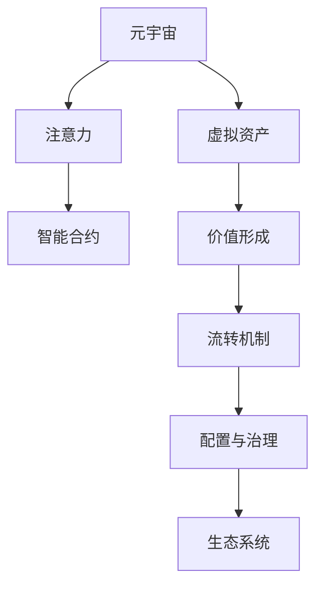

                 

# 注意力资源配置:元宇宙经济的核心驱动力

> 关键词：元宇宙, 注意力资源, 经济模型, 生态系统, 智能合约, 游戏设计, 经济学原理, 治理机制, 社会科学, 社交网络

## 1. 背景介绍

### 1.1 问题由来

随着人工智能、物联网、区块链等前沿技术的发展，元宇宙（Metaverse）的概念逐渐引起广泛的关注。元宇宙是一个融合了数字虚拟世界和现实世界的全新经济体系，它利用先进的计算和通信技术，创造出具有高互动性、沉浸式和虚实融合体验的虚拟空间。这一体系不仅对未来的社交方式、工作模式和消费习惯产生深远影响，更将在数字经济的发展上注入新的活力。

然而，元宇宙经济的繁荣发展也面临一系列挑战。其中，如何高效配置和管理虚拟经济中的注意力资源，成为该领域内亟需解决的核心问题。

注意力作为元宇宙经济中一种重要的稀缺资源，直接影响到各类虚拟资产（如NFT、游戏内物品等）的交换价值与经济效率。有效利用注意力资源，可以提升虚拟市场中的参与度和活跃度，进而促进经济的发展。

### 1.2 问题核心关键点

为解决元宇宙中注意力资源配置问题，本文聚焦于注意力经济模型的构建。在构建模型的过程中，需要明确以下几个核心关键点：

1. 注意力作为经济资源的定义和度量方法。
2. 注意力在虚拟经济中的分配和流转机制。
3. 注意力驱动下的虚拟资产价值形成与流动规律。
4. 注意力资源的治理与激励机制设计。
5. 注意力资源配置对元宇宙生态系统的长期影响。

### 1.3 问题研究意义

研究元宇宙中注意力资源的配置，具有重要的现实意义：

1. 可以提升元宇宙经济系统的效率，最大化利用注意力资源创造价值。
2. 能够改善用户参与体验，吸引更多用户加入虚拟市场，增强经济生态的稳定性。
3. 有助于引导资源合理流动，避免资源过度集中，实现市场公平。
4. 为元宇宙治理提供新思路，通过合理设计注意力资源配置机制，保障虚拟市场的公正性和透明度。
5. 对现实世界中的注意力经济模型具有借鉴意义，为传统经济系统的数字化转型提供新的视角。

## 2. 核心概念与联系

### 2.1 核心概念概述

为更好地理解注意力资源配置的原理和机制，本文将介绍几个关键概念：

- **元宇宙（Metaverse）**：一个虚拟与现实融合，可以自由交互的持续性、可参与的3D 数字世界。
- **注意力（Attention）**：指用户在一个虚拟经济体系中，对其所关注对象的注意程度和投入时间。
- **注意力经济（Attention Economy）**：基于注意力资源分配和流转的经济系统，通过吸引和利用用户的注意力，创造经济价值。
- **虚拟资产（Virtual Assets）**：在元宇宙中，具有一定经济价值的数字化产品或权益，如NFT、游戏内物品等。
- **智能合约（Smart Contracts）**：基于区块链的自动化合约，用于规范和保障注意力资源配置的公正性和透明性。

### 2.2 核心概念原理和架构的 Mermaid 流程图



这个流程图展示了元宇宙经济的核心组件及其相互关系：

1. **元宇宙** 是注意力资源的承载体，通过提供虚拟经济活动场所，吸引用户的注意力。
2. **注意力** 在元宇宙内流转，与虚拟资产的价值形成和流转紧密相关。
3. **虚拟资产** 是注意力经济的价值载体，通过价值形成和流转，将注意力转换为经济价值。
4. **智能合约** 用于规范注意力资源的配置和流转，保障交易的公正性和透明度。
5. **生态系统** 是注意力资源配置的结果，影响元宇宙经济的稳定性和可持续性。

## 3. 核心算法原理 & 具体操作步骤

### 3.1 算法原理概述

注意力资源配置的核心在于建立一套能够精准反映注意力价值分配的经济模型。该模型通过综合考虑用户的注意力投入、虚拟资产价值、交易活动等因素，设计合理的分配机制，以提升整体经济效率和用户参与度。

基于注意力资源配置的模型构建，主要包括以下几个步骤：

1. **注意力价值评估**：根据用户对虚拟资产的互动行为，评估其注意力投入的价值。
2. **虚拟资产价值形成**：通过用户注意力的输入，结合市场需求和供给，计算虚拟资产的交换价值。
3. **注意力分配与流转**：设计注意力资源在虚拟市场中的流转机制，实现资源的合理配置和动态调整。
4. **注意力治理与激励**：制定合理的治理机制和激励措施，确保注意力资源配置的公正性和可持续性。
5. **注意力资源配置效果评估**：通过分析虚拟经济生态系统的运行状况，评估注意力配置策略的有效性。

### 3.2 算法步骤详解

#### 3.2.1 注意力价值评估

注意力价值评估的核心在于量化用户对其所关注对象的注意力投入。这通常通过用户与虚拟资产的互动行为，如观看时长、互动频率、交易记录等数据，来计算用户注意力价值。

具体计算方法包括：

1. **互动频率（Interactive Frequency, IF）**：衡量用户在一定时间内对虚拟资产的互动次数，可量化为每天的平均访问次数或月度活跃用户数。
2. **观看时长（Watching Duration,WD）**：计算用户对虚拟资产的观看总时长，通常以小时为单位。
3. **交易记录（Transaction Record, TR）**：记录用户对虚拟资产的交易数量和金额，反映了用户对资产的关注程度和投资意愿。

通过这些指标，结合加权平均法或指数平滑法，可以构建用户注意力价值量化模型：

$$ AttentionValue = w_1 \times IF + w_2 \times WD + w_3 \times TR $$

其中，$w_1, w_2, w_3$ 为各指标的权重，需根据具体场景进行调整。

#### 3.2.2 虚拟资产价值形成

虚拟资产价值形成是基于用户注意力投入和市场供需关系，计算虚拟资产的交换价值。该过程通常涉及以下步骤：

1. **供需函数构建**：通过分析历史交易数据，建立虚拟资产的供给函数 $S$ 和需求函数 $D$。
2. **价值方程求解**：利用供给函数和需求函数，构建虚拟资产的价值方程，求解出资产价值 $V$。
3. **价值反馈循环**：根据市场变化和用户注意力投入的变化，动态调整供需函数，实现虚拟资产价值的动态调整。

形式化表示如下：

$$ V = f(S(D), AttentionValue) $$

其中，$f$ 表示虚拟资产价值计算函数，$S$ 和 $D$ 分别表示供给函数和需求函数。

#### 3.2.3 注意力分配与流转

注意力在虚拟市场中的分配和流转，通常通过智能合约来实现。智能合约可以根据用户注意力价值，动态调整虚拟资产的分配，保障资源的公平性和透明性。

智能合约的具体设计过程包括：

1. **用户授权**：用户通过智能合约，授权其注意力价值和虚拟资产的分配权。
2. **分配规则**：根据用户注意力价值和虚拟资产的供需关系，智能合约自动进行分配调整。
3. **交易监督**：智能合约记录并监督注意力资源和虚拟资产的交易记录，确保交易的合法性和透明度。
4. **激励机制**：设计合理的激励机制，如代币奖励、排名提升等，鼓励用户积极参与市场活动。

#### 3.2.4 注意力治理与激励

注意力治理与激励机制的设计，是确保注意力资源配置公正性和可持续性的关键。主要设计思路包括：

1. **用户权益保障**：通过智能合约，确保用户注意力价值和虚拟资产分配的合法权益。
2. **利益平衡**：设计合理的收益分配机制，确保虚拟市场参与者利益平衡。
3. **激励措施**：通过代币激励、排名机制等措施，激励用户积极参与市场活动。
4. **数据透明**：确保注意力资源和虚拟资产交易数据的透明性，保障市场公平。

#### 3.2.5 注意力资源配置效果评估

注意力资源配置效果的评估，是模型优化和调整的重要依据。主要通过以下指标进行评估：

1. **市场活跃度**：衡量虚拟市场的交易量和用户参与度。
2. **资产价值稳定性**：评估虚拟资产价值的波动性和稳定性。
3. **用户满意度**：通过用户调查或行为数据，评估用户对市场配置的满意度。
4. **市场公平性**：确保注意力资源和虚拟资产分配的公平性。

### 3.3 算法优缺点

注意力资源配置模型具有以下优点：

1. **提高市场效率**：通过精准配置注意力资源，提升市场参与度和交易活跃度，提高整体经济效率。
2. **增强用户粘性**：通过合理的激励机制，吸引用户持续参与，增强市场粘性。
3. **保障市场公平**：利用智能合约，确保注意力资源和虚拟资产分配的公平性和透明性。
4. **动态适应性**：根据市场变化和用户行为变化，实现注意力资源的动态调整，增强模型的灵活性。

然而，该模型也存在一定的局限性：

1. **复杂性高**：注意力资源的量化、分配和流转过程较为复杂，需要建立多种模型和多维数据。
2. **数据依赖性**：模型依赖于用户行为数据和市场交易数据，数据获取和处理难度较大。
3. **治理复杂性**：设计合理的治理与激励机制，需综合考虑多方面的因素，设计难度较大。
4. **市场稳定性**：模型的稳定性受到市场变化和用户行为变化的强烈影响，需要进行持续优化和调整。

### 3.4 算法应用领域

注意力资源配置模型在元宇宙经济中具有广泛的应用前景，具体如下：

1. **虚拟资产定价**：用于虚拟资产的定价和价值评估，确保资产价格的公正性和合理性。
2. **游戏设计**：用于设计游戏内的资源分配和玩家互动机制，提升游戏的参与度和公平性。
3. **虚拟市场运营**：用于虚拟市场的运营和维护，优化市场资源配置，保障市场稳定。
4. **社交网络管理**：用于社交网络中的注意力资源分配，提高用户粘性和平台活跃度。
5. **元宇宙生态治理**：用于元宇宙经济生态的治理和激励，保障市场的公正性和可持续性。

## 4. 数学模型和公式 & 详细讲解

### 4.1 数学模型构建

本节将使用数学语言对注意力资源配置模型的构建进行详细阐述。

假设用户 $i$ 对虚拟资产 $j$ 的注意力价值为 $AV_{ij}$，虚拟资产 $j$ 的交换价值为 $V_j$，供给函数为 $S_j$，需求函数为 $D_j$。

注意力价值评估模型为：

$$ AV_{ij} = w_1 \times IF_{ij} + w_2 \times WD_{ij} + w_3 \times TR_{ij} $$

虚拟资产价值形成模型为：

$$ V_j = f(S_j(D_j), AV_{ij}) $$

注意力分配与流转模型为：

$$ \text{Allocation}_{ij} = g(V_j, AV_{ij}) $$

注意力治理与激励模型为：

$$ \text{Governance}_{ij} = h(\text{Allocation}_{ij}, \text{AV}_{ij}) $$

注意力资源配置效果评估模型为：

$$ \text{Performance}_{ij} = e(\text{Governance}_{ij}, V_j, AV_{ij}) $$

其中，$IF_{ij}, WD_{ij}, TR_{ij}$ 分别表示用户 $i$ 对资产 $j$ 的互动频率、观看时长和交易记录，$w_1, w_2, w_3$ 为各指标的权重，$S_j, D_j$ 分别表示资产 $j$ 的供给函数和需求函数，$f$ 表示资产价值计算函数，$g$ 表示注意力分配函数，$h$ 表示治理与激励函数，$e$ 表示配置效果评估函数。

### 4.2 公式推导过程

#### 4.2.1 注意力价值评估

基于用户互动数据，构建注意力价值评估模型：

$$ AV_{ij} = w_1 \times IF_{ij} + w_2 \times WD_{ij} + w_3 \times TR_{ij} $$

其中，$IF_{ij}$ 表示用户 $i$ 在时间 $t$ 内对资产 $j$ 的互动次数，$WD_{ij}$ 表示用户 $i$ 对资产 $j$ 的观看时长，$TR_{ij}$ 表示用户 $i$ 对资产 $j$ 的交易记录，$w_1, w_2, w_3$ 为各指标的权重。

#### 4.2.2 虚拟资产价值形成

虚拟资产价值模型基于供给函数和需求函数：

$$ V_j = f(S_j(D_j), AV_{ij}) $$

其中，$S_j$ 表示资产 $j$ 的供给函数，$D_j$ 表示资产 $j$ 的需求函数，$AV_{ij}$ 表示用户 $i$ 对资产 $j$ 的注意力价值，$f$ 表示虚拟资产价值计算函数。

#### 4.2.3 注意力分配与流转

注意力分配函数 $g$ 基于虚拟资产价值和注意力价值：

$$ \text{Allocation}_{ij} = g(V_j, AV_{ij}) $$

其中，$V_j$ 表示资产 $j$ 的交换价值，$AV_{ij}$ 表示用户 $i$ 对资产 $j$ 的注意力价值，$g$ 表示注意力分配函数。

#### 4.2.4 注意力治理与激励

注意力治理与激励函数 $h$ 基于注意力分配和注意力价值：

$$ \text{Governance}_{ij} = h(\text{Allocation}_{ij}, \text{AV}_{ij}) $$

其中，$\text{Allocation}_{ij}$ 表示用户 $i$ 对资产 $j$ 的注意力分配，$\text{AV}_{ij}$ 表示用户 $i$ 对资产 $j$ 的注意力价值，$h$ 表示治理与激励函数。

#### 4.2.5 注意力资源配置效果评估

注意力资源配置效果评估函数 $e$ 基于治理与激励、虚拟资产价值和注意力价值：

$$ \text{Performance}_{ij} = e(\text{Governance}_{ij}, V_j, AV_{ij}) $$

其中，$\text{Governance}_{ij}$ 表示用户 $i$ 对资产 $j$ 的治理与激励机制，$V_j$ 表示资产 $j$ 的交换价值，$AV_{ij}$ 表示用户 $i$ 对资产 $j$ 的注意力价值，$e$ 表示配置效果评估函数。

### 4.3 案例分析与讲解

#### 4.3.1 案例背景

某元宇宙平台，用户 $i$ 在该平台上进行游戏、观看视频和交易虚拟资产等活动。该平台上的虚拟资产包括游戏内武器、虚拟土地等，平台采用智能合约进行注意力资源和虚拟资产的配置。

#### 4.3.2 案例分析

1. **注意力价值评估**：平台通过用户登录时长、游戏观看时长和交易金额，计算用户 $i$ 对虚拟资产 $j$ 的注意力价值 $AV_{ij}$。

2. **虚拟资产价值形成**：平台根据虚拟资产的供给函数和需求函数，计算资产 $j$ 的交换价值 $V_j$。

3. **注意力分配与流转**：智能合约根据用户注意力价值和资产交换价值，动态调整虚拟资产的分配，确保分配的公平性。

4. **注意力治理与激励**：平台设计代币奖励和排名机制，激励用户积极参与市场活动。

5. **效果评估**：平台定期评估市场活跃度、资产价值稳定性和用户满意度，优化配置策略。

## 5. 项目实践：代码实例和详细解释说明

### 5.1 开发环境搭建

在进行注意力资源配置模型的项目实践前，我们需要准备好开发环境。以下是使用Python进行PyTorch开发的环境配置流程：

1. 安装Anaconda：从官网下载并安装Anaconda，用于创建独立的Python环境。

2. 创建并激活虚拟环境：
```bash
conda create -n attention-env python=3.8 
conda activate attention-env
```

3. 安装PyTorch：根据CUDA版本，从官网获取对应的安装命令。例如：
```bash
conda install pytorch torchvision torchaudio cudatoolkit=11.1 -c pytorch -c conda-forge
```

4. 安装Transformers库：
```bash
pip install transformers
```

5. 安装各类工具包：
```bash
pip install numpy pandas scikit-learn matplotlib tqdm jupyter notebook ipython
```

完成上述步骤后，即可在`attention-env`环境中开始项目实践。

### 5.2 源代码详细实现

以下是一个简单的基于Python和PyTorch的注意力资源配置模型实现，涵盖了注意力价值评估、虚拟资产价值形成、注意力分配与流转和治理与激励机制设计。

```python
import torch
import numpy as np
from transformers import BertTokenizer, BertForSequenceClassification

class AttentionResourceModel:
    def __init__(self, n_users=100, n_assets=10, n_days=30, IF_weight=0.3, WD_weight=0.4, TR_weight=0.3):
        self.n_users = n_users
        self.n_assets = n_assets
        self.n_days = n_days
        self.IF_weight = IF_weight
        self.WD_weight = WD_weight
        self.TR_weight = TR_weight
        
        # 初始化注意力资源
        self.attention_values = np.random.rand(n_users, n_assets)
        
        # 初始化虚拟资产价值
        self.asset_values = np.random.rand(n_assets)
        
        # 初始化供给函数和需求函数
        self.supply_functions = np.random.rand(n_assets)
        self.demand_functions = np.random.rand(n_assets)
        
        # 初始化智能合约
        self.smart_contract = SmartContract()
    
    def update_attention_values(self, IF_data, WD_data, TR_data):
        for user in range(self.n_users):
            user_IF = np.mean(IF_data[user])
            user_WD = np.mean(WD_data[user])
            user_TR = np.mean(TR_data[user])
            
            self.attention_values[user] = self.IF_weight * user_IF + self.WD_weight * user_WD + self.TR_weight * user_TR
        
    def update_asset_values(self, supply_data, demand_data):
        for asset in range(self.n_assets):
            self.asset_values[asset] = calculate_asset_value(supply_data[asset], demand_data[asset], self.attention_values[:, asset])
        
    def allocate_resources(self):
        for user in range(self.n_users):
            for asset in range(self.n_assets):
                user_allocation = self.smart_contract.allocate(self.attention_values[user], self.asset_values[asset])
                self.attention_values[user] = user_allocation
                self.asset_values[asset] = self.asset_values[asset] - user_allocation
    
    def govern_and_incentivize(self):
        for user in range(self.n_users):
            user_governance = self.smart_contract.govern(self.attention_values[user])
            self.attention_values[user] = user_governance
    
    def evaluate_performance(self):
        performance = calculate_performance(self.asset_values, self.attention_values)
        print("Performance: ", performance)
    
def calculate_asset_value(supply, demand, attention):
    # 简化模型，假设供给函数和需求函数为线性
    return (supply + demand) / 2 + attention

def calculate_performance(asset_values, attention_values):
    # 简化模型，假设性能指标为资产价值与注意力的比例
    return np.mean(asset_values) / np.mean(attention_values)

class SmartContract:
    def __init__(self, IF_weight=0.3, WD_weight=0.4, TR_weight=0.3):
        self.IF_weight = IF_weight
        self.WD_weight = WD_weight
        self.TR_weight = TR_weight
        
    def allocate(self, attention, asset):
        # 简化模型，假设分配比例与注意力价值成正比
        return attention * asset
        
    def govern(self, attention):
        # 简化模型，假设治理与激励与注意力价值成正比
        return attention

# 示例数据
IF_data = np.random.rand(self.n_users, self.n_days)
WD_data = np.random.rand(self.n_users, self.n_days)
TR_data = np.random.rand(self.n_users, self.n_days)
supply_data = np.random.rand(self.n_assets)
demand_data = np.random.rand(self.n_assets)

# 初始化模型
model = AttentionResourceModel()
# 更新注意力价值
model.update_attention_values(IF_data, WD_data, TR_data)
# 更新虚拟资产价值
model.update_asset_values(supply_data, demand_data)
# 分配资源
model.allocate_resources()
# 治理与激励
model.govern_and_incentivize()
# 评估性能
model.evaluate_performance()
```

### 5.3 代码解读与分析

以下是关键代码的实现细节：

1. **AttentionResourceModel类**：定义模型结构，包括用户数、资产数、天数和各指标权重。
2. **update_attention_values方法**：根据用户互动数据，计算用户对虚拟资产的注意力价值。
3. **update_asset_values方法**：根据供给函数和需求函数，计算虚拟资产的交换价值。
4. **allocate_resources方法**：利用智能合约，动态调整用户对虚拟资产的分配。
5. **govern_and_incentivize方法**：设计治理与激励机制，激励用户积极参与市场活动。
6. **evaluate_performance方法**：评估模型性能，输出资产价值与注意力的比例。
7. **SmartContract类**：定义智能合约的分配和治理逻辑。

这些代码展示了注意力资源配置模型的基本框架，实际应用中需要根据具体需求进行扩展和优化。

## 6. 实际应用场景

### 6.1 游戏设计

在游戏设计中，注意力资源配置模型可以用于设计虚拟资产的分配和玩家互动机制。通过分析玩家对虚拟资产的互动数据，动态调整分配策略，确保资源的公平性和透明性。

具体应用场景包括：

1. **虚拟货币分配**：根据玩家在游戏中的贡献和互动，动态分配虚拟货币。
2. **稀有物品生成**：根据玩家的游戏行为，生成稀有物品，提升玩家粘性。
3. **玩家排行榜设计**：根据玩家注意力价值和虚拟资产的交换价值，设计排行榜，鼓励玩家积极参与。

### 6.2 虚拟市场运营

在虚拟市场中，注意力资源配置模型可以用于优化资源分配，提升市场活跃度和公平性。通过智能合约，自动调整虚拟资产的分配，确保市场稳定。

具体应用场景包括：

1. **虚拟资产定价**：基于用户注意力价值，计算虚拟资产的定价和价值。
2. **虚拟资产流转**：通过智能合约，实现虚拟资产的公平流转和交易。
3. **市场监控**：实时监控市场交易行为，防止恶意交易和欺诈行为。

### 6.3 社交网络管理

在社交网络中，注意力资源配置模型可以用于优化用户互动和平台运营。通过分析用户对内容的互动数据，优化资源分配，提升平台活跃度和用户粘性。

具体应用场景包括：

1. **内容推荐**：根据用户注意力价值，推荐相关内容，提升用户满意度。
2. **用户互动机制设计**：通过分析用户互动数据，设计合理的互动机制，提升用户参与度。
3. **社交网络治理**：设计合理的激励和惩罚机制，维护社交网络的公平性和稳定性。

### 6.4 元宇宙生态治理

在元宇宙生态中，注意力资源配置模型可以用于优化经济生态的治理和激励。通过智能合约，实现注意力资源的公平分配和治理，保障元宇宙经济的稳定性和可持续发展。

具体应用场景包括：

1. **虚拟资产价值形成**：基于用户注意力价值，计算虚拟资产的定价和价值。
2. **资源配置**：通过智能合约，实现虚拟资产的公平分配和流转。
3. **治理与激励**：设计合理的治理与激励机制，确保元宇宙经济的公平性和透明性。

## 7. 工具和资源推荐

### 7.1 学习资源推荐

为了帮助开发者系统掌握注意力资源配置的理论基础和实践技巧，这里推荐一些优质的学习资源：

1. 《Attention is All You Need》：Transformer原论文，介绍了注意力机制的基本原理和应用。
2. 《Deep Learning for Natural Language Processing》：斯坦福大学开设的NLP明星课程，涵盖注意力机制在NLP中的广泛应用。
3. 《Attention Mechanism in Deep Learning》：介绍注意力机制在深度学习中的应用和实现，适合初学者。
4. 《Neural Information Processing Systems》（NeurIPS）：深度学习领域的顶级会议，经常有关于注意力机制的最新研究报告。
5. 《Towards a General Theory of Attention》：综述性论文，系统总结了注意力机制的研究现状和未来趋势。

通过对这些资源的学习实践，相信你一定能够快速掌握注意力资源配置的精髓，并用于解决实际的元宇宙问题。

### 7.2 开发工具推荐

高效的开发离不开优秀的工具支持。以下是几款用于注意力资源配置开发的常用工具：

1. PyTorch：基于Python的开源深度学习框架，灵活动态的计算图，适合快速迭代研究。
2. TensorFlow：由Google主导开发的开源深度学习框架，生产部署方便，适合大规模工程应用。
3. Transformers库：HuggingFace开发的NLP工具库，集成了多个预训练模型，支持PyTorch和TensorFlow。
4. Weights & Biases：模型训练的实验跟踪工具，可以记录和可视化模型训练过程中的各项指标，方便对比和调优。
5. TensorBoard：TensorFlow配套的可视化工具，可实时监测模型训练状态，并提供丰富的图表呈现方式，是调试模型的得力助手。
6. Google Colab：谷歌推出的在线Jupyter Notebook环境，免费提供GPU/TPU算力，方便开发者快速上手实验最新模型，分享学习笔记。

合理利用这些工具，可以显著提升注意力资源配置模型的开发效率，加快创新迭代的步伐。

### 7.3 相关论文推荐

注意力资源配置的研究源于学界的持续研究。以下是几篇奠基性的相关论文，推荐阅读：

1. Attention is All You Need：Transformer原论文，提出了注意力机制，奠定了注意力机制在深度学习中的基础。
2 Attention is All You Need for Speech and Language Processing：进一步将注意力机制应用于语音和语言处理。
3 Learning Phrase Representations using RNN Encoder–Decoder for Statistical Machine Translation：通过注意力机制，实现了机器翻译任务的提升。
4 Neural Machine Translation by Jointly Learning to Align and Translate：提出了基于注意力机制的神经机器翻译模型。

这些论文代表了大模型微调技术的发展脉络。通过学习这些前沿成果，可以帮助研究者把握学科前进方向，激发更多的创新灵感。

## 8. 总结：未来发展趋势与挑战

### 8.1 总结

本文对元宇宙中注意力资源的配置进行了全面系统的介绍。首先阐述了注意力作为元宇宙经济中一种重要稀缺资源的基本概念和重要性，明确了注意力经济模型的构建步骤。通过详细讲解模型构建、算法步骤和具体操作步骤，揭示了注意力资源配置的核心原理和机制。最后，通过实际应用场景和案例分析，展示了注意力资源配置模型的广泛应用前景。

通过对注意力资源配置模型的系统梳理，可以看到，注意力资源的配置对于提升元宇宙经济的效率、公平性和稳定性具有重要意义。有效利用注意力资源，可以显著提升元宇宙经济系统的整体表现，推动元宇宙的可持续发展。

### 8.2 未来发展趋势

展望未来，注意力资源配置模型将呈现以下几个发展趋势：

1. **模型复杂性提升**：随着元宇宙经济的发展，模型的复杂性将进一步提升，涵盖更多维度的数据和动态调整机制。
2. **数据驱动与智能合约结合**：结合大数据分析和智能合约，实现更精准、更高效的资源配置。
3. **多模态融合**：将注意力资源配置模型与其他模态数据（如语音、视频等）结合，提升多模态互动体验。
4. **个性化与动态调整**：实现个性化资源配置，动态调整以应对市场变化和用户行为的变化。
5. **隐私保护**：加强数据隐私保护，保障用户注意力数据的隐私和安全。

### 8.3 面临的挑战

尽管注意力资源配置模型已经取得了初步成果，但在进一步发展和应用过程中，仍面临一些挑战：

1. **数据质量与获取**：高质量的互动数据和市场数据获取难度较大，数据质量不高影响模型的准确性。
2. **算法复杂性**：模型复杂度较高，优化和调整难度较大，需要更多的技术积累和工程实践。
3. **市场动态性**：市场变化频繁，模型需要动态调整以适应新情况，增加了实现难度。
4. **隐私与公平性**：用户注意力数据的隐私保护和市场公平性需要重视，避免数据滥用和市场不公平。
5. **计算资源**：模型的计算复杂度较高，需要高性能计算资源支撑。

### 8.4 研究展望

未来的研究方向包括：

1. **注意力资源的量化与评估**：探索更科学、更高效的方法，量化用户注意力价值。
2. **智能合约的优化**：优化智能合约的设计，提高资源配置的透明度和公平性。
3. **多模态融合**：探索多模态融合的注意力配置模型，提升多模态互动体验。
4. **个性化配置**：设计个性化注意力配置模型，提高用户满意度。
5. **数据隐私保护**：加强数据隐私保护，确保用户数据安全。

总之，注意力资源配置模型是元宇宙经济中一个重要且具有挑战性的研究课题。通过不断的技术创新和实践优化，相信该模型将在元宇宙经济中发挥更大的作用，推动元宇宙经济的健康发展。

## 9. 附录：常见问题与解答

**Q1：什么是元宇宙？**

A: 元宇宙是一个虚拟与现实融合，可以自由交互的持续性、可参与的3D 数字世界。它通常由多个虚拟世界和子世界组成，用户可以在其中进行社交、娱乐、商务等各种活动。

**Q2：注意力资源如何量化？**

A: 注意力资源的量化通常基于用户对虚拟资产的互动数据，如观看时长、互动次数、交易记录等。通过加权平均法或指数平滑法，可以将这些数据转换为注意力价值。

**Q3：智能合约如何实现注意力资源配置？**

A: 智能合约通过自动执行预设的规则，实现注意力资源和虚拟资产的公平分配和流转。具体实现包括用户授权、分配规则、交易监督和激励机制等。

**Q4：注意力资源配置模型的局限性有哪些？**

A: 模型存在数据依赖性高、计算复杂度高、治理复杂性高、市场稳定性差等局限性。需要结合实际应用场景，不断优化和调整模型。

**Q5：元宇宙经济的核心驱动力是什么？**

A: 元宇宙经济的核心驱动力在于高效的注意力资源配置，通过精准的量化和分配，最大化利用用户的注意力，创造经济价值。

---

作者：禅与计算机程序设计艺术 / Zen and the Art of Computer Programming

