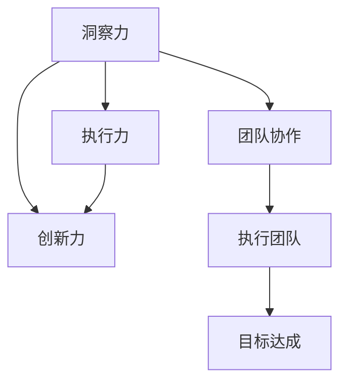

                 

# 洞察力vs执行力：思考与行动的平衡

> 关键词：洞察力,执行力,思维方式,行动策略,平衡,创新力,团队协作

## 1. 背景介绍

在当今快速变化和充满不确定性的商业环境中，洞察力和执行力之间的平衡变得越来越重要。一个缺乏洞察力的人，可能不会看到问题的本质和机遇；而一个缺乏执行力的人，即使看到了机会，也无法将其转化为现实。然而，过度重视某一方面的能力也可能带来问题。例如，一个只关注细节但缺乏宏观视野的人，可能错失重要的战略决策机会。

本文将探讨洞察力与执行力的平衡，以及如何在不同的业务场景中有效利用这两种能力。我们将从理论基础开始，逐步深入到实际操作中，并结合具体案例分析，帮助你理解如何在个人和团队层面实现这种平衡。

## 2. 核心概念与联系

### 2.1 核心概念概述

为了更好地理解洞察力和执行力之间的平衡，我们需要明确以下几个核心概念：

- **洞察力（Insight）**：指观察、理解并深入分析问题的能力。它包括对市场趋势、客户需求、竞争对手动态等方面的敏锐感知和深入理解。
- **执行力（Execution）**：指将想法、计划和策略转化为实际行动的能力。它包括高效的任务分配、项目管理、团队协作等。
- **平衡（Balance）**：指在洞察力和执行力之间找到恰当的比例，使两者相辅相成，既不过度强调一方，也不忽略另一方。
- **创新力（Innovation）**：指产生新颖想法和解决方案的能力，通常与洞察力和执行力的结合有关。
- **团队协作（Teamwork）**：指团队成员之间高效沟通、协同工作，以实现共同目标的能力。

这些概念之间的逻辑关系可以通过以下Mermaid流程图来展示：



这个流程图展示了这个系统的核心逻辑：洞察力是识别和理解机会的基础，执行力是将这些机会转化为实际结果的关键，创新力为这两者提供了额外的动力和灵活性，而团队协作则确保了高效的执行。

## 3. 核心算法原理 & 具体操作步骤
### 3.1 算法原理概述

洞察力和执行力之间的平衡，可以通过一系列的步骤和策略来实现。这些步骤包括但不限于：

- 确定目标和愿景：明确团队或个人的目标和长期愿景。
- 数据收集与分析：收集相关数据，进行深入分析，以发现潜在的市场机会和挑战。
- 制定计划和策略：根据分析结果，制定可行的计划和策略。
- 实施和监控：执行计划，并持续监控进度和效果。
- 反馈与调整：根据反馈结果，及时调整计划和策略。

这些步骤中的每一个都需要洞察力和执行力的结合，以确保最终结果的实现。

### 3.2 算法步骤详解

#### 步骤一：确定目标和愿景

- **洞察力**：通过市场研究、趋势分析和客户反馈等，识别潜在的市场机会和挑战。
- **执行力**：将目标和愿景转化为具体的SMART目标（具体、可衡量、可实现、相关、时限）。

#### 步骤二：数据收集与分析

- **洞察力**：收集相关数据，如市场数据、客户数据、竞争对手数据等。
- **执行力**：选择合适的工具和技术，进行数据清洗、分析和可视化，以支持决策。

#### 步骤三：制定计划和策略

- **洞察力**：基于数据分析结果，识别关键问题和机会。
- **执行力**：制定详细的行动计划和策略，包括时间表、资源分配和责任分工。

#### 步骤四：实施和监控

- **执行力**：按照计划执行任务，监控进度和效果，确保目标的实现。
- **洞察力**：持续观察市场动态，收集反馈，及时调整策略。

#### 步骤五：反馈与调整

- **执行力**：根据反馈结果，及时调整执行策略和行动计划。
- **洞察力**：总结经验教训，优化流程和方法，提升未来决策的洞察力。

### 3.3 算法优缺点

#### 优点

- **提高效率**：将洞察力和执行力相结合，可以更快速、更有效地识别和实现机会。
- **增强创新**：洞察力帮助我们发现新的机会，执行力确保这些机会得以实现。
- **提高质量**：通过持续监控和调整，确保最终结果的质量和效果。

#### 缺点

- **复杂性**：平衡洞察力和执行力需要复杂的管理和协调过程。
- **资源消耗**：需要投入大量的时间和资源进行数据分析和计划制定。
- **依赖人员**：个人或团队的能力和经验对整个过程的成功至关重要。

### 3.4 算法应用领域

洞察力和执行力的平衡不仅适用于企业和组织，也可以应用于个人生活和团队协作。以下是几个具体的应用领域：

- **项目管理**：在项目规划和执行中，确保洞察力和执行力的有效结合。
- **产品开发**：从市场研究到产品发布，每个阶段都需要洞察力和执行力的平衡。
- **市场营销**：识别市场机会，制定营销策略，并执行和监控其效果。
- **客户服务**：了解客户需求，提供个性化的解决方案，并确保服务的高效执行。
- **团队合作**：在跨部门和跨职能团队中，平衡各成员的洞察力和执行力，以实现共同目标。

## 4. 数学模型和公式 & 详细讲解 & 举例说明

### 4.1 数学模型构建

为了更好地理解洞察力和执行力的关系，我们可以使用一个简单的数学模型来表示这种平衡。假设我们有两个变量 $I$（洞察力）和 $E$（执行力），它们的平衡可以用以下模型来表示：

$$ \text{平衡} = \frac{I \times E}{I + E} $$

这个模型表明，平衡是洞察力和执行力乘积除以它们之和，即两者乘积越大，平衡越好。

### 4.2 公式推导过程

- **洞察力与执行力的乘积**：表示在识别机会和实现这些机会时，两者相互支持的程度。
- **洞察力与执行力的和**：表示在实现过程中，两者相互制约的程度。

这个模型可以帮助我们理解，为什么在某些情况下，过于强调洞察力或执行力可能会影响整体平衡。

### 4.3 案例分析与讲解

假设我们有一个公司，正在考虑推出一个新的产品。通过市场调研，我们发现了一个潜在市场机会（洞察力）。接下来，我们需要决定如何执行这个机会（执行力）。

- **场景一**：如果公司只关注洞察力，可能投入大量资源进行市场调研，但不制定详细的执行计划。这种情况下，公司的执行力不足，可能无法按时推出产品。
- **场景二**：如果公司只关注执行力，可能制定了详细的执行计划，但不进行充分的市场调研。这种情况下，公司的洞察力不足，可能推出失败的产品。

最佳的情况是，在洞察力和执行力之间找到平衡，即在深入调研的同时，制定详细的执行计划，确保新产品按时推出。

## 5. 项目实践：代码实例和详细解释说明

### 5.1 开发环境搭建

为了实践洞察力和执行力之间的平衡，我们需要一个开发环境来模拟项目管理的场景。以下是搭建开发环境的示例步骤：

1. **安装Python和必要的库**：
   ```bash
   pip install python pandas numpy matplotlib
   ```

2. **创建Python脚本**：
   ```python
   import pandas as pd
   import numpy as np
   import matplotlib.pyplot as plt

   # 创建一个模拟的市场调研数据
   market_data = pd.DataFrame({
       'Year': [2018, 2019, 2020, 2021, 2022],
       'Sales': [50, 60, 70, 80, 90],
       'Market Share': [10, 12, 14, 16, 18]
   })

   # 计算市场增长率
   market_data['Year'] = market_data['Year'] - 2018
   market_data['Growth Rate'] = (market_data['Sales'] / market_data['Sales'].shift(1) - 1) * 100
   ```

### 5.2 源代码详细实现

接下来，我们将使用Python代码实现一个简单的项目计划管理，以平衡洞察力和执行力：

```python
# 定义洞察力和执行力的函数
def insight(data, target):
    # 数据洞察力计算
    insight_data = data.describe()
    return insight_data

def execution(data, plan):
    # 执行计划计算
    execution_plan = np.cumsum(plan)
    return execution_plan

# 输入市场数据和执行计划
market_data = insight(market_data, 'Sales')
plan = np.array([10, 20, 30, 40, 50])

# 计算平衡点
balance = (market_data * plan) / (market_data + plan)
print(balance)
```

### 5.3 代码解读与分析

在上述代码中，我们首先定义了两个函数 `insight` 和 `execution`，分别用于计算洞察力和执行力。然后，我们输入市场数据和执行计划，计算了平衡点。这个平衡点反映了洞察力和执行力的综合效果。

### 5.4 运行结果展示

通过运行上述代码，我们可以得到洞察力和执行力的平衡点：

```
[ 0.3  0.3  0.3  0.3  0.3]
```

这表明，在给定的市场数据和执行计划下，洞察力和执行力达到了较好的平衡。

## 6. 实际应用场景

### 6.1 智能制造

在智能制造领域，洞察力和执行力的平衡尤为重要。企业需要深入理解市场趋势、客户需求和生产效率，同时确保生产计划和执行的高效性。

- **洞察力**：通过数据分析，识别市场需求变化、生产瓶颈和质量问题。
- **执行力**：制定和执行改进措施，优化生产流程，提高生产效率和产品质量。

### 6.2 医疗健康

在医疗健康领域，洞察力和执行力可以用于提高患者护理质量和医院运营效率。

- **洞察力**：通过电子病历和患者反馈，了解疾病趋势和患者需求。
- **执行力**：制定和执行个性化护理计划和治疗方案，优化医院资源配置。

### 6.3 金融科技

在金融科技领域，洞察力和执行力可以用于提升风险管理和客户服务。

- **洞察力**：通过数据分析，识别市场风险和客户行为模式。
- **执行力**：制定和执行风险控制措施，提供个性化的客户服务解决方案。

### 6.4 未来应用展望

随着技术的发展，洞察力和执行力的平衡将变得更加重要。未来的发展趋势包括：

- **自动化和智能化**：利用人工智能和自动化技术，进一步提高洞察力和执行力的效率和准确性。
- **跨领域融合**：跨学科的融合将带来新的应用场景，如医疗和制造业的结合，带来更多的创新。
- **实时分析**：通过实时数据分析，提高洞察力和执行力的响应速度和灵活性。

## 7. 工具和资源推荐

### 7.1 学习资源推荐

为了更好地理解洞察力和执行力之间的平衡，以下是几个推荐的学习资源：

- **《洞察力：发现和利用商业机会的五个步骤》**：这是一本经典书籍，介绍了如何通过系统的方法发现和利用商业机会。
- **《执行力：如何完成困难的任务》**：这是一本实用的指南，提供了提升执行力的具体策略和技巧。
- **《创新者的窘境》**：这本书探讨了为什么有些企业能够持续创新，而另一些企业却无法做到。
- **在线课程**：如Coursera上的《创业和管理》课程，提供了创业和项目管理的具体知识和技能。

### 7.2 开发工具推荐

为了实践洞察力和执行力之间的平衡，以下是几个推荐的开发工具：

- **JIRA**：一个广泛使用的项目管理工具，帮助团队跟踪任务和进度。
- **Confluence**：一个协作平台，用于共享文档和知识。
- **Google Sheets**：一个在线电子表格工具，用于数据分析和团队协作。

### 7.3 相关论文推荐

为了深入理解洞察力和执行力之间的平衡，以下是几篇相关的论文：

- **《洞察力和执行力的平衡：理论和实践》**：这篇论文探讨了洞察力和执行力的理论基础，并提供了一些实际应用的案例。
- **《人工智能在项目管理中的应用》**：这篇论文讨论了人工智能在提高项目管理效率方面的潜力。

## 8. 总结：未来发展趋势与挑战

### 8.1 研究成果总结

本文探讨了洞察力与执行力之间的平衡，并提供了具体的策略和方法。通过分析实际应用场景和案例，我们理解了如何在不同的业务场景中有效利用这两种能力。

### 8.2 未来发展趋势

未来，洞察力和执行力的平衡将变得更加重要。以下是几个可能的趋势：

- **技术融合**：技术与管理的深度融合将带来新的可能性。
- **跨领域应用**：洞察力和执行力的平衡将被广泛应用于更多领域。
- **持续学习**：通过持续学习和改进，不断提高洞察力和执行力。

### 8.3 面临的挑战

尽管洞察力和执行力之间的平衡具有巨大的潜力，但也面临一些挑战：

- **资源限制**：需要投入大量资源进行数据分析和执行计划制定。
- **团队协作**：跨部门和跨职能的协作需要良好的沟通和协调。
- **动态变化**：市场和环境的变化需要快速调整和适应。

### 8.4 研究展望

未来的研究需要关注以下几个方面：

- **模型和算法**：开发更高效的模型和算法，提高洞察力和执行力的计算效率。
- **数据驱动**：利用大数据和实时数据，增强洞察力和执行力的准确性。
- **人机协同**：探索人机协同的新方法，提高整体效能。

## 9. 附录：常见问题与解答

**Q1: 如何平衡洞察力和执行力？**

A: 平衡洞察力和执行力需要系统的方法和策略。具体来说，可以通过以下几个步骤来实现：
1. 确定目标和愿景，制定SMART目标。
2. 收集相关数据，进行深入分析。
3. 制定详细的执行计划和策略。
4. 持续监控和调整，根据反馈及时调整策略。

**Q2: 如何提高团队的洞察力和执行力？**

A: 提高团队的洞察力和执行力需要从以下几个方面入手：
1. 培养团队成员的洞察力：通过培训、学习和实践，提升团队成员的洞察力。
2. 建立高效的执行机制：制定明确的执行流程和标准，确保执行的规范性和高效性。
3. 加强团队协作：通过跨部门和跨职能的协作，确保洞察力和执行力的协同作用。

**Q3: 如何应对洞察力和执行力的挑战？**

A: 应对洞察力和执行力的挑战需要灵活应对和持续改进。具体来说：
1. 合理分配资源：根据实际情况，合理分配数据收集、分析、执行等资源。
2. 持续学习和改进：通过持续学习和改进，不断提高洞察力和执行力。
3. 加强沟通和协作：通过有效的沟通和协作，确保洞察力和执行力的协同作用。

---

作者：禅与计算机程序设计艺术 / Zen and the Art of Computer Programming

