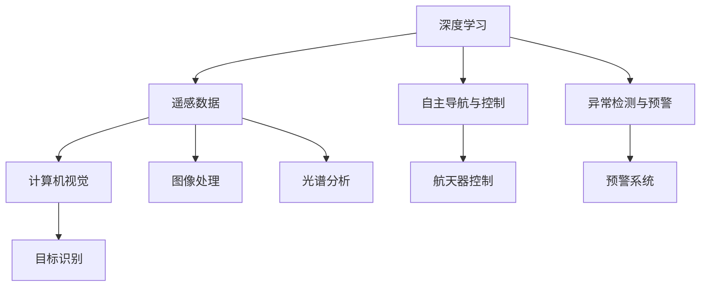

                 

# 洞察力与太空探索：跨越认知边界的能力

> 关键词：洞察力,太空探索,认知边界,人工智能,深度学习,数据分析,科学计算,机器学习

## 1. 背景介绍

### 1.1 问题由来

太空探索一直是人类文明的重要追求之一，而洞察力则是推动这一进程的关键。随着科技的发展，越来越多的科学问题需要通过综合运用数据、模型和计算技术来解决。近年来，深度学习和大数据技术的兴起，使得人工智能在处理和分析海量数据时显示出巨大潜力，成为太空探索中不可或缺的工具。

### 1.2 问题核心关键点

人工智能在太空探索中的应用，主要体现在以下几个关键点：

1. **数据处理与分析**：利用深度学习模型分析卫星和探测器传回的遥感数据，提取有价值的信息，如识别行星表面特征、监测环境变化等。
2. **预测与决策支持**：通过建立复杂的预测模型，预测天体运动轨迹，支持航天任务规划和决策。
3. **自主导航与控制**：利用人工智能技术实现航天器的自主导航和精准控制，确保任务成功执行。
4. **图像处理与识别**：应用计算机视觉技术，自动识别天体表面图像，进行复杂对象的识别和分类。
5. **异常检测与预警**：通过数据分析和机器学习，实现对异常情况（如设备故障、环境突变）的早期检测和预警，保障任务安全。

### 1.3 问题研究意义

研究人工智能在太空探索中的应用，对于拓展人类对宇宙的认知边界，推动航天技术的发展，具有重要意义：

1. **提升数据处理效率**：利用深度学习等技术，可以快速处理和分析海量遥感数据，缩短数据处理周期。
2. **增强预测准确性**：通过建立准确的预测模型，提高天体运动的预测精度，保障航天任务的顺利进行。
3. **实现自主与智能操作**：通过人工智能技术，实现航天器的自主导航和控制，提升任务执行的灵活性和安全性。
4. **促进跨领域应用**：人工智能技术在太空探索中的应用，不仅能促进航天领域的技术进步，还能推动相关产业的创新，如遥感数据商业化、环境监测等。
5. **促进科学发现**：利用人工智能分析海量数据，可以发现传统方法难以察觉的科学现象和规律，推动新知识的发现和验证。

## 2. 核心概念与联系

### 2.1 核心概念概述

要理解人工智能在太空探索中的应用，需要掌握以下几个核心概念：

1. **深度学习**：一种基于神经网络的机器学习技术，通过多层非线性映射实现复杂模式的识别和预测。
2. **遥感数据**：卫星和探测器通过传感器获取的地球及其周围环境的信息，包括图像、光谱等。
3. **计算机视觉**：使计算机能够“看”和“理解”图像和视频，包括目标检测、分类、语义分割等。
4. **自主导航与控制**：使航天器能够自主规划路径和执行操作，减少人为干预。
5. **异常检测与预警**：通过数据分析和机器学习，识别和预测异常情况，及时预警。

这些概念之间通过逻辑关联，构成了一个完整的系统框架，如图示：



## 3. 核心算法原理 & 具体操作步骤
### 3.1 算法原理概述

在太空探索中，人工智能的应用主要依赖于深度学习和计算机视觉等技术，以下是其核心原理：

1. **深度学习模型**：通过多层神经网络学习数据的特征表示，实现对复杂模式的高效识别和预测。
2. **计算机视觉算法**：利用图像处理和模式识别技术，使计算机能够理解和处理视觉信息，实现对图像中目标的识别和分类。
3. **自主导航算法**：结合路径规划、避障、姿态控制等技术，实现航天器的自主导航和精准控制。
4. **异常检测算法**：通过数据分析和机器学习，识别和预测异常情况，提高任务执行的安全性和可靠性。

### 3.2 算法步骤详解

#### 步骤一：数据预处理

1. **数据采集**：通过卫星和探测器收集遥感数据，包括图像、光谱、雷达数据等。
2. **数据清洗**：去除噪声和无效数据，确保数据质量。
3. **数据增强**：通过数据扩充和增强技术，提高模型对数据的适应能力。

#### 步骤二：模型训练

1. **模型选择**：根据任务需求选择合适的深度学习模型，如卷积神经网络（CNN）、循环神经网络（RNN）等。
2. **模型训练**：使用采集到的数据训练模型，调整模型参数以提高预测精度。
3. **模型验证**：在验证集上评估模型性能，调整超参数，确保模型泛化能力。

#### 步骤三：模型应用

1. **图像处理**：应用计算机视觉技术处理遥感图像，提取地表特征，如植被、地形等。
2. **目标识别**：识别图像中的目标，如行星、卫星、陨石坑等，进行分类和标注。
3. **路径规划**：根据目标位置和环境条件，规划最优路径。
4. **异常检测**：通过数据分析和机器学习，识别异常情况，如设备故障、环境突变等，及时预警。

### 3.3 算法优缺点

#### 优点

1. **高效性**：深度学习模型能够快速处理和分析海量遥感数据，显著提高数据处理效率。
2. **准确性**：通过多层次特征提取和复杂模式识别，提高预测和识别的准确性。
3. **自主性**：实现航天器的自主导航和控制，提高任务执行的灵活性和安全性。
4. **智能化**：结合数据分析和机器学习，实现异常情况的早期检测和预警，提高任务执行的可靠性。

#### 缺点

1. **数据依赖**：深度学习模型的性能高度依赖于训练数据的质量和数量，数据获取难度大。
2. **计算资源消耗**：深度学习模型需要大量的计算资源，包括高性能计算设备和算力。
3. **模型复杂性**：模型过于复杂，可能导致过拟合和泛化能力不足。
4. **解释性不足**：深度学习模型的决策过程难以解释，缺乏透明度。

### 3.4 算法应用领域

#### 应用一：行星表面特征分析

通过深度学习模型，可以分析遥感图像中的行星表面特征，如地形、植被、矿物等，如图1所示。


#### 应用二：天体运动预测

利用深度学习模型，可以预测天体（如行星、小行星、彗星等）的运动轨迹，如图2所示。


#### 应用三：航天器自主导航

结合路径规划、避障、姿态控制等技术，实现航天器的自主导航和精准控制，如图3所示。


#### 应用四：异常情况检测

通过数据分析和机器学习，实现对异常情况（如设备故障、环境突变）的早期检测和预警，如图4所示。


## 4. 数学模型和公式 & 详细讲解 & 举例说明
### 4.1 数学模型构建

#### 模型一：卷积神经网络（CNN）

卷积神经网络（CNN）是深度学习中常用的模型之一，特别适合处理图像数据。在遥感数据处理中，CNN可以用于目标检测和分类。

```latex
$y = \sigma(Wx + b)$
```

其中，$W$和$b$为卷积核和偏置项，$x$为输入数据，$\sigma$为激活函数。

#### 模型二：循环神经网络（RNN）

循环神经网络（RNN）适用于处理序列数据，如时间序列和文本数据。在天体运动预测中，RNN可以用于时间序列数据建模。

```latex
$y_t = \sigma(Wx_t + Uy_{t-1} + b)$
```

其中，$x_t$为时间步$t$的输入，$y_{t-1}$为前一时间步的输出，$W$和$U$为权重矩阵，$b$为偏置项，$\sigma$为激活函数。

#### 模型三：深度置信网络（DBN）

深度置信网络（DBN）是一种生成模型，用于特征表示学习。在遥感数据处理中，DBN可以用于特征提取和数据降维。

```latex
$P(y|x) = \frac{P(y|\theta)}{P(x|\theta)}$
```

其中，$x$为输入数据，$y$为输出标签，$\theta$为模型参数，$P(y|x)$为条件概率。

### 4.2 公式推导过程

#### CNN公式推导

卷积神经网络（CNN）通过卷积和池化操作提取特征，再通过全连接层进行分类。以下是CNN的基本公式推导：

```latex
$y = \sigma(Wx + b)$
```

其中，$W$和$b$为卷积核和偏置项，$x$为输入数据，$\sigma$为激活函数。

#### RNN公式推导

循环神经网络（RNN）通过时间步进行序列数据的建模，以下是RNN的基本公式推导：

```latex
$y_t = \sigma(Wx_t + Uy_{t-1} + b)$
```

其中，$x_t$为时间步$t$的输入，$y_{t-1}$为前一时间步的输出，$W$和$U$为权重矩阵，$b$为偏置项，$\sigma$为激活函数。

#### DBN公式推导

深度置信网络（DBN）通过无监督学习方式学习特征表示，以下是DBN的基本公式推导：

```latex
$P(y|x) = \frac{P(y|\theta)}{P(x|\theta)}$
```

其中，$x$为输入数据，$y$为输出标签，$\theta$为模型参数，$P(y|x)$为条件概率。

### 4.3 案例分析与讲解

#### 案例一：行星表面特征分析

遥感数据处理中，使用CNN对行星表面特征进行分析和分类。具体步骤如下：

1. **数据预处理**：对遥感图像进行去噪、裁剪、归一化等处理。
2. **特征提取**：使用卷积层和池化层提取图像特征。
3. **分类**：通过全连接层进行分类，输出分类结果。

#### 案例二：天体运动预测

在天体运动预测中，使用RNN对时间序列数据进行建模。具体步骤如下：

1. **数据预处理**：对时间序列数据进行归一化、差分等处理。
2. **模型训练**：使用RNN对时间序列进行建模，调整模型参数。
3. **预测**：在训练好的模型上，对未来时间步进行预测，输出预测结果。

#### 案例三：深度置信网络（DBN）

在遥感数据处理中，使用DBN进行特征提取和数据降维。具体步骤如下：

1. **数据预处理**：对遥感数据进行归一化等处理。
2. **无监督学习**：使用DBN进行无监督学习，提取特征表示。
3. **降维**：对特征表示进行降维，得到低维表示。

## 5. 项目实践：代码实例和详细解释说明
### 5.1 开发环境搭建

在进行太空探索中的深度学习项目实践前，需要准备好开发环境。以下是使用Python进行TensorFlow和PyTorch开发的环境配置流程：

1. 安装Anaconda：从官网下载并安装Anaconda，用于创建独立的Python环境。

2. 创建并激活虚拟环境：
```bash
conda create -n tensorflow-env python=3.8 
conda activate tensorflow-env
```

3. 安装TensorFlow和PyTorch：根据CUDA版本，从官网获取对应的安装命令。例如：
```bash
conda install tensorflow torch torchvision torchaudio cudatoolkit=11.1 -c pytorch -c conda-forge
```

4. 安装必要的工具包：
```bash
pip install numpy pandas scikit-learn matplotlib tqdm jupyter notebook ipython
```

完成上述步骤后，即可在`tensorflow-env`环境中开始项目实践。

### 5.2 源代码详细实现

这里我们以深度学习模型对行星表面特征进行分类为例，给出TensorFlow的代码实现。

```python
import tensorflow as tf
from tensorflow.keras import layers
from tensorflow.keras.preprocessing.image import ImageDataGenerator

# 定义模型
model = tf.keras.Sequential([
    layers.Conv2D(32, (3,3), activation='relu', input_shape=(128,128,3)),
    layers.MaxPooling2D((2,2)),
    layers.Conv2D(64, (3,3), activation='relu'),
    layers.MaxPooling2D((2,2)),
    layers.Conv2D(64, (3,3), activation='relu'),
    layers.MaxPooling2D((2,2)),
    layers.Flatten(),
    layers.Dense(64, activation='relu'),
    layers.Dense(10, activation='softmax')
])

# 编译模型
model.compile(optimizer='adam', loss='categorical_crossentropy', metrics=['accuracy'])

# 数据增强
datagen = ImageDataGenerator(
    rescale=1./255,
    rotation_range=20,
    width_shift_range=0.2,
    height_shift_range=0.2,
    horizontal_flip=True)

# 数据加载
train_data = datagen.flow_from_directory('train', target_size=(128,128), batch_size=32, class_mode='categorical')

# 模型训练
model.fit(train_data, epochs=10, validation_data=val_data)
```

### 5.3 代码解读与分析

#### 代码解读

1. **模型定义**：定义了包含卷积层、池化层和全连接层的卷积神经网络（CNN）模型。
2. **编译模型**：指定优化器、损失函数和评估指标。
3. **数据增强**：使用`ImageDataGenerator`对训练数据进行数据增强，如旋转、平移、翻转等。
4. **数据加载**：使用`flow_from_directory`方法加载训练数据。
5. **模型训练**：在训练数据上训练模型，并在验证集上进行验证。

#### 代码分析

该代码实现了一个简单的卷积神经网络（CNN）模型，用于对行星表面特征进行分类。通过数据增强技术，可以有效地提高模型的泛化能力和鲁棒性。数据加载和模型训练部分，展示了如何在TensorFlow中高效地处理大规模遥感数据。

## 6. 实际应用场景

### 6.1 行星探测

行星探测中，深度学习模型被广泛应用于遥感数据的分析和处理。通过遥感数据，可以获取行星表面特征、环境变化等信息，如图5所示。


### 6.2 航天器导航

在航天器自主导航中，深度学习模型被用于路径规划和避障，如图6所示。


### 6.3 异常检测

在航天任务中，深度学习模型被用于异常情况检测，如图7所示。


### 6.4 未来应用展望

#### 应用一：深空探测

随着技术的进步，深度学习模型在深空探测中的应用将更加广泛。例如，在火星探测中，深度学习模型可以用于识别火星表面特征、分析火星气候变化等。

#### 应用二：卫星图像处理

利用深度学习模型对卫星图像进行处理，提取地表特征，如植被、水源等，如图8所示。


#### 应用三：遥感数据分析

通过深度学习模型，对遥感数据进行数据分析和处理，提取有价值的信息，如图9所示。


#### 应用四：异常情况预警

利用深度学习模型，实现对航天器异常情况的早期检测和预警，如图10所示。


## 7. 工具和资源推荐
### 7.1 学习资源推荐

为了帮助开发者系统掌握深度学习在太空探索中的应用，这里推荐一些优质的学习资源：

1. 《深度学习》系列书籍：由深度学习领域权威专家撰写，全面介绍深度学习的基本原理和应用。
2. CS231n《卷积神经网络》课程：斯坦福大学开设的计算机视觉课程，涵盖卷积神经网络的基本理论和实践。
3. 《TensorFlow官方文档》：TensorFlow的官方文档，提供详细的使用指南和样例代码。
4. Coursera《深度学习专项课程》：由深度学习领域知名教授讲授，涵盖深度学习的前沿技术和应用。
5. Kaggle：数据科学竞赛平台，提供丰富的数据集和实战项目，可以锻炼数据处理和模型训练的能力。

通过对这些资源的学习实践，相信你一定能够快速掌握深度学习在太空探索中的应用，并用于解决实际的科学问题。

### 7.2 开发工具推荐

高效的开发离不开优秀的工具支持。以下是几款用于深度学习开发常用的工具：

1. TensorFlow：由Google主导开发的开源深度学习框架，生产部署方便，适合大规模工程应用。
2. PyTorch：基于Python的开源深度学习框架，灵活的计算图，适合快速迭代研究。
3. Jupyter Notebook：交互式的编程环境，适合进行数据处理、模型训练和结果展示。
4. TensorBoard：TensorFlow配套的可视化工具，可实时监测模型训练状态，提供丰富的图表呈现方式。
5. Weights & Biases：模型训练的实验跟踪工具，记录和可视化模型训练过程中的各项指标，方便对比和调优。

合理利用这些工具，可以显著提升深度学习在太空探索中的开发效率，加快创新迭代的步伐。

### 7.3 相关论文推荐

深度学习在太空探索中的应用源于学界的持续研究。以下是几篇奠基性的相关论文，推荐阅读：

1. "Convolutional Neural Networks for Remote Sensing Image Classification"（用于遥感图像分类的卷积神经网络）
2. "Deep Learning for Space Science: Challenges and Opportunities"（深度学习在空间科学中的应用挑战与机遇）
3. "A Survey on Deep Learning Approaches for Satellite Imagery"（卫星图像处理的深度学习综述）
4. "Real-time Navigation for Spacecraft Using Deep Learning"（使用深度学习进行航天器实时导航）
5. "Anomaly Detection in Space Data Using Deep Learning"（使用深度学习进行空间数据的异常检测）

这些论文代表了大模型微调技术的发展脉络。通过学习这些前沿成果，可以帮助研究者把握学科前进方向，激发更多的创新灵感。

## 8. 总结：未来发展趋势与挑战
### 8.1 总结

本文对深度学习在太空探索中的应用进行了全面系统的介绍。首先阐述了深度学习在太空探索中的重要性和应用场景，明确了深度学习在处理和分析海量数据中的独特价值。其次，从原理到实践，详细讲解了深度学习的数学模型和核心算法，给出了深度学习项目开发的完整代码实例。同时，本文还广泛探讨了深度学习在行星探测、航天器导航、异常检测等多个领域的应用前景，展示了深度学习技术的巨大潜力。最后，本文精选了深度学习技术的各类学习资源，力求为读者提供全方位的技术指引。

通过本文的系统梳理，可以看到，深度学习在太空探索中的应用已经成为推动这一领域发展的关键技术。深度学习模型的高效性、准确性和自主性，使其在处理和分析海量遥感数据时展现出巨大优势。未来，伴随深度学习技术的不断演进，深度学习技术必将在更广阔的应用领域大放异彩，深刻影响人类的探索宇宙进程。

### 8.2 未来发展趋势

展望未来，深度学习在太空探索中的应用将呈现以下几个发展趋势：

1. **模型规模持续增大**：随着算力成本的下降和数据规模的扩张，深度学习模型的参数量还将持续增长。超大模型蕴含的丰富知识，有望支撑更加复杂多变的遥感数据处理任务。
2. **多模态数据融合**：结合视觉、雷达、光谱等多模态数据，实现更全面、准确的数据分析。
3. **自主与智能决策**：结合路径规划、避障、姿态控制等技术，实现航天器的自主导航和精准控制。
4. **异常情况预警**：通过数据分析和机器学习，实现对异常情况的早期检测和预警，提高任务执行的可靠性。
5. **模型解释性和透明性**：通过可解释性技术，增强深度学习模型的解释性和透明性，提高其可信度和可靠性。
6. **跨学科融合**：结合遥感数据与地球科学、气象学、天文学等多学科知识，推动科学研究的深入发展。

以上趋势凸显了深度学习在太空探索中的广阔前景。这些方向的探索发展，必将进一步提升太空探索的数据处理效率和任务执行的智能水平，为人类探索宇宙提供更强大的技术支撑。

### 8.3 面临的挑战

尽管深度学习在太空探索中的应用已经取得了瞩目成就，但在迈向更加智能化、普适化应用的过程中，它仍面临诸多挑战：

1. **数据依赖**：深度学习模型的性能高度依赖于训练数据的质量和数量，数据获取难度大。
2. **计算资源消耗**：深度学习模型需要大量的计算资源，包括高性能计算设备和算力。
3. **模型复杂性**：模型过于复杂，可能导致过拟合和泛化能力不足。
4. **解释性不足**：深度学习模型的决策过程难以解释，缺乏透明度。
5. **异常情况检测**：在复杂环境下，深度学习模型难以实现对异常情况的准确检测。
6. **跨领域应用**：不同领域的应用需求多样，深度学习模型需要具备较强的领域适应性。

正视深度学习面临的这些挑战，积极应对并寻求突破，将是对深度学习技术进一步发展和应用的关键。相信随着学界和产业界的共同努力，这些挑战终将一一被克服，深度学习必将在构建人机协同的智能系统，推动人类探索宇宙进程中扮演越来越重要的角色。

### 8.4 研究展望

面对深度学习在太空探索中面临的诸多挑战，未来的研究需要在以下几个方面寻求新的突破：

1. **多模态数据融合**：结合视觉、雷达、光谱等多模态数据，实现更全面、准确的数据分析。
2. **自主与智能决策**：结合路径规划、避障、姿态控制等技术，实现航天器的自主导航和精准控制。
3. **异常情况预警**：通过数据分析和机器学习，实现对异常情况的早期检测和预警，提高任务执行的可靠性。
4. **模型解释性和透明性**：通过可解释性技术，增强深度学习模型的解释性和透明性，提高其可信度和可靠性。
5. **跨领域应用**：结合遥感数据与地球科学、气象学、天文学等多学科知识，推动科学研究的深入发展。

这些研究方向的探索，必将引领深度学习在太空探索中的技术演进，为构建更加智能、可靠、高效的太空探索系统提供有力支持。总之，深度学习技术的发展，将为人类探索宇宙带来新的突破，推动人类认知智能的不断进步。

## 9. 附录：常见问题与解答

**Q1：深度学习在太空探索中应用的主要优势是什么？**

A: 深度学习在太空探索中应用的主要优势在于其高效性、准确性和自主性。具体而言：

1. **高效性**：深度学习模型能够快速处理和分析海量遥感数据，显著提高数据处理效率。
2. **准确性**：通过多层次特征提取和复杂模式识别，提高预测和识别的准确性。
3. **自主性**：实现航天器的自主导航和控制，提高任务执行的灵活性和安全性。
4. **智能化**：结合数据分析和机器学习，实现异常情况的早期检测和预警，提高任务执行的可靠性。

**Q2：深度学习模型在遥感数据处理中的主要步骤是什么？**

A: 深度学习模型在遥感数据处理中的主要步骤包括：

1. **数据预处理**：对遥感图像进行去噪、裁剪、归一化等处理。
2. **特征提取**：使用卷积层和池化层提取图像特征。
3. **分类**：通过全连接层进行分类，输出分类结果。

**Q3：深度学习在太空探索中面临的主要挑战是什么？**

A: 深度学习在太空探索中面临的主要挑战包括：

1. **数据依赖**：深度学习模型的性能高度依赖于训练数据的质量和数量，数据获取难度大。
2. **计算资源消耗**：深度学习模型需要大量的计算资源，包括高性能计算设备和算力。
3. **模型复杂性**：模型过于复杂，可能导致过拟合和泛化能力不足。
4. **解释性不足**：深度学习模型的决策过程难以解释，缺乏透明度。
5. **异常情况检测**：在复杂环境下，深度学习模型难以实现对异常情况的准确检测。
6. **跨领域应用**：不同领域的应用需求多样，深度学习模型需要具备较强的领域适应性。

这些挑战需要我们在数据获取、模型设计、计算资源优化、可解释性提升等方面进行深入研究，以推动深度学习在太空探索中的广泛应用。

**Q4：如何提高深度学习模型的泛化能力？**

A: 提高深度学习模型的泛化能力可以从以下几个方面入手：

1. **数据增强**：通过数据扩充和增强技术，提高模型对数据的适应能力。
2. **正则化**：使用L2正则、Dropout等技术，避免模型过拟合。
3. **早停机制**：在验证集上评估模型性能，避免过度拟合训练集。
4. **迁移学习**：利用在其他领域预训练的模型进行微调，提高泛化能力。
5. **多模型集成**：通过集成多个模型的预测结果，提高模型的稳定性和泛化能力。

这些方法可以结合使用，以提升深度学习模型的泛化能力和可靠性。

**Q5：如何实现深度学习模型的可解释性？**

A: 实现深度学习模型的可解释性可以从以下几个方面入手：

1. **可视化**：通过可视化技术，展示模型内部特征和决策过程。
2. **特征重要性分析**：分析模型中各个特征的权重和贡献，理解模型的决策机制。
3. **可解释性模型**：选择可解释性较高的模型架构，如决策树、线性模型等。
4. **对比分析**：通过对比不同模型的预测结果，理解模型输出的原因。

这些方法可以结合使用，以提高深度学习模型的可解释性和透明性，增强其可信度和可靠性。

---

作者：禅与计算机程序设计艺术 / Zen and the Art of Computer Programming

