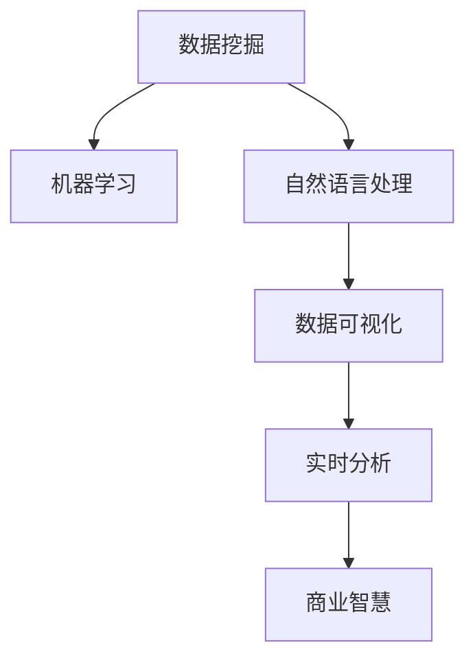

                 

# 洞察力与市场分析：商业智慧的体现

> 关键词：商业智慧,市场分析,洞察力,数据挖掘,机器学习,深度学习,自然语言处理,数据可视化,业务决策,未来趋势

## 1. 背景介绍

### 1.1 问题由来

在商业世界中，洞察力和市场分析是企业战略决策的核心要素，它帮助企业预测市场趋势、优化资源配置、制定精准的营销策略。然而，随着数据量的爆炸式增长，传统的数据分析方法已经无法满足企业对于更快速、更准确、更深入的市场洞察需求。

现代企业需要一种全新的工具，能够快速而准确地从海量的数据中提取出有价值的商业洞察，助力企业做出更明智的决策。在这样的背景下，商业智慧（Business Intelligence, BI）应运而生，它融合了数据挖掘、机器学习、自然语言处理（Natural Language Processing, NLP）和数据可视化等多种技术手段，帮助企业在瞬息万变的市场环境中立于不败之地。

### 1.2 问题核心关键点

商业智慧的核心在于如何利用先进的技术手段，从原始数据中提取出商业洞察，为企业提供更准确的市场分析报告，助力企业决策。

- **数据挖掘**：通过算法从大量数据中挖掘出潜在模式和规律，帮助企业理解数据背后隐藏的市场信息。
- **机器学习**：利用数据训练模型，预测未来市场趋势，提供决策依据。
- **自然语言处理**：将文本数据转换为结构化数据，进行情感分析、主题提取等操作。
- **数据可视化**：将数据和分析结果转化为直观的图表和报告，帮助决策者更好地理解信息。
- **实时分析**：结合时间序列分析等技术手段，实现对市场动态的实时监控和分析。

商业智慧技术已经广泛应用于金融、零售、医疗、制造业等多个领域，帮助企业优化决策流程，提升运营效率，降低成本，实现更高程度的自动化和智能化。

## 2. 核心概念与联系

### 2.1 核心概念概述

商业智慧的核心概念包括数据挖掘、机器学习、自然语言处理、数据可视化和实时分析等多个方面。

- **数据挖掘**：利用统计学、机器学习等方法，从大量数据中挖掘出有用的信息和知识。常用的方法包括聚类分析、关联规则挖掘、异常检测等。
- **机器学习**：通过数据训练模型，进行预测和分类。常用的算法包括线性回归、决策树、支持向量机、神经网络等。
- **自然语言处理**：将文本数据转换为结构化数据，进行情感分析、主题提取、实体识别等操作。常用的技术包括分词、词性标注、句法分析等。
- **数据可视化**：将数据和分析结果以图表、报告等形式呈现，帮助决策者直观理解信息。常用的工具包括Tableau、Power BI、D3.js等。
- **实时分析**：结合时间序列分析、大数据技术等手段，实现对市场动态的实时监控和分析。

这些概念之间的联系可以通过以下Mermaid流程图来展示：



## 3. 核心算法原理 & 具体操作步骤

### 3.1 算法原理概述

商业智慧的核心算法原理是通过对原始数据的分析和处理，提取出有价值的商业洞察。

具体来说，商业智慧的工作流程可以概括为以下几个步骤：

1. **数据收集与预处理**：收集企业内外部数据，清洗和整理数据，去除噪声和异常值，为后续分析做准备。
2. **特征工程**：提取数据中的重要特征，如用户行为、交易记录、市场趋势等。
3. **模型训练**：利用机器学习算法训练模型，预测市场趋势、优化营销策略等。
4. **情感分析与主题提取**：使用自然语言处理技术对文本数据进行情感分析和主题提取。
5. **数据可视化**：将分析结果以图表、报告等形式呈现，帮助决策者直观理解信息。
6. **实时分析**：结合时间序列分析等技术手段，实现对市场动态的实时监控和分析。

### 3.2 算法步骤详解

下面以一个具体的例子来说明商业智慧的实现步骤。假设某电商平台希望分析用户购买行为，优化其营销策略。

**Step 1: 数据收集与预处理**

- 收集电商平台的用户购买数据、浏览数据、反馈数据等。
- 清洗数据，去除缺失值、异常值和重复记录。
- 进行数据标准化处理，保证数据的一致性和可用性。

**Step 2: 特征工程**

- 提取用户的关键特征，如购买频率、购买金额、浏览时间、评价情绪等。
- 使用关联规则挖掘技术，发现不同商品之间的购买关联。
- 利用聚类分析，将用户分为不同的群体，进行个性化推荐。

**Step 3: 模型训练**

- 选择适当的机器学习算法，如决策树、随机森林、神经网络等。
- 使用历史数据训练模型，预测用户未来的购买行为。
- 对模型进行交叉验证和调参，优化模型性能。

**Step 4: 情感分析与主题提取**

- 对用户评论、反馈文本进行情感分析，判断用户对商品的评价情绪。
- 使用自然语言处理技术，提取文本中的主题和关键词，如商品特性、用户需求等。
- 将情感分析和主题提取的结果与用户行为数据结合，进行更深入的市场分析。

**Step 5: 数据可视化**

- 使用数据可视化工具，如Tableau、Power BI，将分析结果转换为图表和报告。
- 设计直观的仪表盘，展示用户购买行为、市场趋势、情感分析结果等。
- 提供动态可视化界面，实时更新数据和图表，确保决策者获取最新信息。

**Step 6: 实时分析**

- 结合时间序列分析技术，实现对市场动态的实时监控和分析。
- 使用大数据技术，实现对海量数据的实时处理和分析。
- 设计实时预警系统，一旦发现异常情况，立即发出警报，确保企业的快速响应。

### 3.3 算法优缺点

商业智慧的优点在于其强大的数据分析和预测能力，能够帮助企业快速获取商业洞察，优化决策流程。其缺点主要在于对数据的依赖性强，数据质量直接影响分析结果的准确性，且需要大量的计算资源进行模型训练和处理。

### 3.4 算法应用领域

商业智慧在金融、零售、医疗、制造业等多个领域都有广泛的应用，具体包括：

- **金融领域**：利用机器学习算法预测股票走势、信用风险、欺诈检测等。
- **零售领域**：通过情感分析和用户行为数据，优化库存管理和个性化推荐。
- **医疗领域**：利用大数据和机器学习技术，进行疾病预测、患者数据分析等。
- **制造领域**：结合工业物联网数据，优化生产流程、预测设备故障等。

## 4. 数学模型和公式 & 详细讲解 & 举例说明

### 4.1 数学模型构建

商业智慧的数学模型构建主要包括以下几个方面：

- **回归模型**：用于预测数值型变量的值，常用的模型包括线性回归、多项式回归等。
- **分类模型**：用于将数据分类，常用的模型包括决策树、随机森林、支持向量机等。
- **聚类模型**：用于发现数据中的群体和模式，常用的模型包括K-means、层次聚类等。
- **关联规则模型**：用于发现不同变量之间的关联关系，常用的模型包括Apriori、FP-growth等。

### 4.2 公式推导过程

以线性回归模型为例，其数学推导过程如下：

假设有一个样本集 $D=\{(x_1, y_1), (x_2, y_2), ..., (x_n, y_n)\}$，其中 $x$ 为输入变量，$y$ 为输出变量。线性回归模型的目标是最小化预测值与真实值之间的误差，即最小化损失函数：

$$
\min_{\theta} \sum_{i=1}^{n} (y_i - \hat{y}_i)^2
$$

其中 $\hat{y}_i$ 为模型预测值，$\theta$ 为模型参数。

线性回归模型的公式可以表示为：

$$
\hat{y} = \theta_0 + \theta_1 x_1 + \theta_2 x_2 + ... + \theta_n x_n
$$

其中 $\theta_0$ 为截距，$\theta_1, \theta_2, ..., \theta_n$ 为各个输入变量的系数。

通过最小化损失函数，可以得到最优参数 $\theta$：

$$
\theta = (X^TX)^{-1}X^Ty
$$

其中 $X$ 为特征矩阵，$y$ 为标签向量。

### 4.3 案例分析与讲解

假设某电商平台的销售数据如下：

| 日期   | 销售量 | 广告支出 | 营销费用 |
| ------ | ------ | -------- | -------- |
| 2021-01 | 100    | 500      | 200      |
| 2021-02 | 150    | 600      | 250      |
| 2021-03 | 200    | 700      | 300      |

假设我们希望预测2021年4月的销售量。

**Step 1: 数据收集与预处理**

- 收集销售数据、广告支出和营销费用数据。
- 清洗数据，去除缺失值和异常值。
- 进行数据标准化处理，保证数据的一致性和可用性。

**Step 2: 特征工程**

- 提取时间、销售量、广告支出、营销费用等特征。
- 使用关联规则挖掘技术，发现广告支出和营销费用与销售量之间的关系。
- 利用聚类分析，将数据分为不同的季节性周期。

**Step 3: 模型训练**

- 选择线性回归模型进行训练。
- 使用历史数据训练模型，预测4月的销售量。
- 对模型进行交叉验证和调参，优化模型性能。

假设模型训练结果为：

$$
\hat{y} = 0.5 \times \text{广告支出} + 0.3 \times \text{营销费用} + 50
$$

**Step 4: 数据可视化**

- 使用Tableau等工具，将预测结果和实际数据可视化。
- 设计直观的仪表盘，展示预测结果和实际销售量。

**Step 5: 实时分析**

- 结合时间序列分析技术，实现对市场动态的实时监控和分析。
- 设计实时预警系统，一旦发现异常情况，立即发出警报。

假设4月的实际销售量为180，预测值为200，则预测结果与实际数据存在一定偏差，需要进一步调整模型参数或引入更复杂的模型进行优化。

## 5. 项目实践：代码实例和详细解释说明

### 5.1 开发环境搭建

在进行商业智慧开发前，我们需要准备好开发环境。以下是使用Python进行商业智慧开发的環境配置流程：

1. 安装Anaconda：从官网下载并安装Anaconda，用于创建独立的Python环境。

2. 创建并激活虚拟环境：
```bash
conda create -n business-intelligence python=3.8 
conda activate business-intelligence
```

3. 安装必要的Python库：
```bash
pip install pandas numpy scikit-learn seaborn matplotlib 
```

4. 安装商业智慧工具包：
```bash
pip install dask
```

5. 安装机器学习库：
```bash
pip install scikit-learn
```

6. 安装自然语言处理库：
```bash
pip install nltk
```

7. 安装数据可视化工具：
```bash
pip install plotly pandas-profiling 
```

完成上述步骤后，即可在`business-intelligence`环境中开始商业智慧项目的开发。

### 5.2 源代码详细实现

下面以一个具体的例子来说明如何使用Python进行商业智慧的实现。

假设我们有一份销售数据，希望利用机器学习算法预测未来的销售量。

**Step 1: 数据收集与预处理**

```python
import pandas as pd

# 读取数据
df = pd.read_csv('sales_data.csv')

# 数据清洗和预处理
df.dropna(inplace=True)
```

**Step 2: 特征工程**

```python
# 提取特征
X = df[['广告支出', '营销费用', '时间']]
y = df['销售量']

# 数据标准化
from sklearn.preprocessing import StandardScaler
scaler = StandardScaler()
X = scaler.fit_transform(X)
```

**Step 3: 模型训练**

```python
from sklearn.linear_model import LinearRegression

# 选择线性回归模型
model = LinearRegression()

# 训练模型
model.fit(X, y)
```

**Step 4: 数据可视化**

```python
import matplotlib.pyplot as plt

# 绘制散点图
plt.scatter(X[:, 0], X[:, 1], c=y, cmap='viridis')

# 拟合直线
plt.plot(X[:, 0], model.predict(X[:, 0]), color='red')
```

**Step 5: 实时分析**

```python
import time

# 实时数据收集
def get_real_time_data():
    # 从数据库或API获取实时数据
    # 返回实时数据
    pass

# 实时更新模型参数
def update_model(params):
    # 根据实时数据更新模型参数
    # 更新模型
    pass

# 实时监控
while True:
    real_time_data = get_real_time_data()
    update_model(real_time_data)
    time.sleep(60)
```

### 5.3 代码解读与分析

让我们再详细解读一下关键代码的实现细节：

**Step 1: 数据收集与预处理**

- `pd.read_csv()`：使用Pandas库读取销售数据，将数据转换为DataFrame格式。
- `dropna(inplace=True)`：删除缺失值，确保数据完整性。

**Step 2: 特征工程**

- `X`：提取广告支出、营销费用和时间特征，构成特征矩阵。
- `y`：提取销售量标签，构成标签向量。
- `StandardScaler()`：使用标准化处理，保证数据的一致性和可用性。

**Step 3: 模型训练**

- `LinearRegression()`：选择线性回归模型进行训练。
- `model.fit(X, y)`：使用历史数据训练模型，得到模型参数。

**Step 4: 数据可视化**

- `plt.scatter()`：绘制散点图，展示数据分布情况。
- `plt.plot()`：拟合直线，展示模型预测结果。

**Step 5: 实时分析**

- `get_real_time_data()`：从数据库或API获取实时数据，返回最新数据。
- `update_model(params)`：根据实时数据更新模型参数，重新训练模型。
- `time.sleep(60)`：每隔60秒更新一次模型参数，实现实时监控和分析。

可以看到，商业智慧的开发需要多个步骤的协作，从数据收集、预处理、特征工程到模型训练、数据可视化、实时分析等环节，每一个环节都需要精细的考虑和处理。

## 6. 实际应用场景

### 6.1 智能客服系统

智能客服系统是商业智慧的重要应用之一。传统客服往往依赖人工处理，效率低、成本高、响应时间长。利用商业智慧技术，可以构建一个智能客服系统，实时分析用户咨询，提供快速准确的解答。

**应用场景**

假设某电商平台希望优化其客服系统，提高用户满意度。

**商业智慧实现步骤**

1. **数据收集与预处理**

- 收集历史客服数据，包括用户咨询内容、用户反馈、客服回答等。
- 清洗数据，去除噪音和异常值。

2. **特征工程**

- 提取用户咨询内容、客服回答等特征。
- 使用自然语言处理技术，进行情感分析、主题提取、实体识别等操作。

3. **模型训练**

- 选择适当的机器学习算法，如决策树、随机森林、神经网络等。
- 使用历史数据训练模型，预测用户满意度。

4. **数据可视化**

- 使用数据可视化工具，如Tableau、Power BI，将分析结果转换为图表和报告。
- 设计直观的仪表盘，展示用户咨询数据、客服回答效果等。

5. **实时分析**

- 结合时间序列分析技术，实现对客服动态的实时监控和分析。
- 设计实时预警系统，一旦发现异常情况，立即发出警报。

### 6.2 金融风险管理

金融风险管理是商业智慧的另一个重要应用领域。金融机构需要实时监控市场动态，预测风险，保护资产安全。

**应用场景**

假设某金融机构希望构建一个金融风险管理系统，实时监控市场动态，预测股票走势。

**商业智慧实现步骤**

1. **数据收集与预处理**

- 收集历史交易数据、市场新闻、公司财报等数据。
- 清洗数据，去除噪音和异常值。

2. **特征工程**

- 提取股价、成交量、市场新闻、公司财报等特征。
- 使用关联规则挖掘技术，发现不同变量之间的关联关系。

3. **模型训练**

- 选择适当的机器学习算法，如决策树、随机森林、神经网络等。
- 使用历史数据训练模型，预测股票走势。

4. **数据可视化**

- 使用数据可视化工具，如Tableau、Power BI，将分析结果转换为图表和报告。
- 设计直观的仪表盘，展示股票走势、市场风险等。

5. **实时分析**

- 结合时间序列分析技术，实现对市场动态的实时监控和分析。
- 设计实时预警系统，一旦发现异常情况，立即发出警报。

### 6.3 零售推荐系统

零售推荐系统是商业智慧在零售领域的重要应用之一。利用商业智慧技术，可以构建一个智能推荐系统，实时分析用户行为，提供个性化的商品推荐。

**应用场景**

假设某电商平台希望构建一个智能推荐系统，提升用户购买转化率。

**商业智慧实现步骤**

1. **数据收集与预处理**

- 收集用户浏览数据、购买数据、评价数据等。
- 清洗数据，去除噪音和异常值。

2. **特征工程**

- 提取用户浏览时间、购买金额、评价情绪等特征。
- 使用关联规则挖掘技术，发现不同商品之间的购买关联。

3. **模型训练**

- 选择适当的机器学习算法，如协同过滤、深度学习等。
- 使用历史数据训练模型，预测用户购买行为。

4. **数据可视化**

- 使用数据可视化工具，如Tableau、Power BI，将分析结果转换为图表和报告。
- 设计直观的仪表盘，展示用户行为数据、推荐效果等。

5. **实时分析**

- 结合时间序列分析技术，实现对市场动态的实时监控和分析。
- 设计实时预警系统，一旦发现异常情况，立即发出警报。

## 7. 工具和资源推荐

### 7.1 学习资源推荐

为了帮助开发者系统掌握商业智慧的理论基础和实践技巧，这里推荐一些优质的学习资源：

1. 《数据挖掘导论》：权威教材，涵盖数据挖掘的基本概念、算法和应用。
2. 《Python机器学习》：入门书籍，介绍Python在机器学习中的应用。
3. 《机器学习实战》：实战教程，通过具体案例讲解机器学习算法的应用。
4. 《自然语言处理综论》：权威教材，涵盖NLP的基本概念、技术和应用。
5. 《商业智慧》：综合性书籍，涵盖商业智慧的基本概念、工具和技术。

通过对这些资源的学习实践，相信你一定能够快速掌握商业智慧的精髓，并用于解决实际的商业问题。

### 7.2 开发工具推荐

高效的开发离不开优秀的工具支持。以下是几款用于商业智慧开发的常用工具：

1. Jupyter Notebook：交互式编程环境，适合快速迭代和调试。
2. Dask：分布式计算框架，支持大数据处理和分布式任务调度。
3. Scikit-learn：Python机器学习库，支持多种机器学习算法。
4. NLTK：Python自然语言处理库，支持文本处理和分析。
5. Pandas：Python数据处理库，支持大规模数据处理和分析。

合理利用这些工具，可以显著提升商业智慧任务的开发效率，加快创新迭代的步伐。

### 7.3 相关论文推荐

商业智慧技术的发展源于学界的持续研究。以下是几篇奠基性的相关论文，推荐阅读：

1. J. Han, M. Kamber, and J. Pei, *Data Mining: Concepts and Techniques* (3rd Edition).
2. T. Mitchell, *Machine Learning*. 
3. J. B. Breiman, *Random Forests*. 
4. H. Liu and J. Liu, *Text Mining: Concepts, Techniques, and Applications*.
5. Y. Freund and R. Schapire, *A Decision-Theoretic Generalization of On-Line Learning and an Application to Boosting*. 

这些论文代表了大数据和商业智慧技术的发展脉络。通过学习这些前沿成果，可以帮助研究者把握学科前进方向，激发更多的创新灵感。

## 8. 总结：未来发展趋势与挑战

### 8.1 总结

本文对商业智慧技术的背景、核心概念、算法原理、具体操作步骤进行了全面系统的介绍。首先阐述了商业智慧技术在商业决策中的重要性和应用前景，明确了商业智慧在数据挖掘、机器学习、自然语言处理、数据可视化和实时分析等方面的核心技术。其次，通过具体的例子，详细讲解了商业智慧技术的实现步骤，包括数据收集与预处理、特征工程、模型训练、数据可视化和实时分析等环节。最后，探讨了商业智慧技术的未来发展趋势和面临的挑战。

通过本文的系统梳理，可以看到，商业智慧技术正在成为商业决策的重要工具，极大地提升了企业的数据分析能力，优化了决策流程，降低了成本，提高了运营效率。未来，随着技术的不断进步和应用场景的不断拓展，商业智慧技术必将在更广阔的领域发挥更大的作用。

### 8.2 未来发展趋势

展望未来，商业智慧技术的发展将呈现以下几个趋势：

1. **智能化提升**：通过引入深度学习、自然语言处理等技术，提升商业智慧的智能化水平，实现更精准的预测和分析。
2. **实时化扩展**：结合实时数据处理和大数据技术，实现对市场动态的实时监控和分析，及时响应市场变化。
3. **自动化增强**：利用自动化技术，优化商业智慧系统的开发流程，降低人工干预，提高工作效率。
4. **跨领域融合**：结合工业物联网、供应链管理、客户关系管理等多个领域的数据，实现跨领域的商业智慧应用。
5. **数据质量优化**：通过数据清洗、数据增强等技术手段，提高数据质量，确保商业智慧分析结果的准确性。

这些趋势将进一步推动商业智慧技术的进步，为企业的商业决策提供更强大的支持。

### 8.3 面临的挑战

尽管商业智慧技术已经取得了显著的进展，但在其发展过程中，仍然面临着诸多挑战：

1. **数据质量问题**：数据质量直接影响商业智慧分析结果的准确性，如何获取高质量、高可靠性的数据，是商业智慧发展的关键。
2. **计算资源消耗**：商业智慧任务通常涉及大量的数据处理和模型训练，需要高计算资源的支撑。如何优化资源消耗，提升计算效率，是商业智慧发展的重要方向。
3. **模型鲁棒性不足**：商业智慧模型面对新的数据或异常情况，可能出现预测误差或模型失效，如何提高模型的鲁棒性和泛化能力，是商业智慧应用的关键。
4. **解释性和可解释性**：商业智慧模型通常被视为"黑盒"系统，难以解释其内部工作机制和决策逻辑。如何赋予模型更强的可解释性，是商业智慧应用的重要课题。
5. **隐私和安全问题**：商业智慧涉及大量的数据和模型，如何保护数据隐私和安全，防止数据泄露和模型滥用，是商业智慧应用的重要挑战。

### 8.4 研究展望

面向未来，商业智慧技术需要在以下几个方面进行进一步研究：

1. **数据清洗和增强**：开发更高效、更准确的数据清洗和增强技术，提高数据质量，减少噪音和异常值的影响。
2. **模型压缩和优化**：开发更高效的模型压缩和优化技术，减少模型参数量，提升模型效率，降低计算资源消耗。
3. **跨领域融合**：结合工业物联网、供应链管理、客户关系管理等多个领域的数据，实现跨领域的商业智慧应用。
4. **模型鲁棒性提升**：开发更鲁棒、更泛化的商业智慧模型，应对新的数据或异常情况，提高模型的实用性和稳定性。
5. **可解释性和隐私保护**：开发更可解释、更安全的商业智慧模型，确保模型内部机制透明，数据隐私保护到位。

这些研究方向的探索，将进一步推动商业智慧技术的进步，为企业的商业决策提供更强大的支持。

## 9. 附录：常见问题与解答

**Q1: 商业智慧与数据分析有何区别？**

A: 商业智慧是基于数据分析的高级应用，它通过数据挖掘、机器学习等技术手段，从原始数据中提取出商业洞察，为企业提供更精准的市场分析报告，助力企业决策。数据分析则更加侧重于数据的统计和描述，其目的是发现数据中的规律和趋势，帮助企业做出更好的业务决策。

**Q2: 商业智慧的实现需要哪些核心技术？**

A: 商业智慧的实现需要以下几个核心技术：
1. 数据挖掘：利用统计学、机器学习等方法，从大量数据中挖掘出有用的信息和知识。
2. 机器学习：利用数据训练模型，预测未来市场趋势，提供决策依据。
3. 自然语言处理：将文本数据转换为结构化数据，进行情感分析、主题提取、实体识别等操作。
4. 数据可视化：将数据和分析结果以图表、报告等形式呈现，帮助决策者直观理解信息。
5. 实时分析：结合时间序列分析等技术手段，实现对市场动态的实时监控和分析。

**Q3: 商业智慧在实际应用中需要注意哪些问题？**

A: 商业智慧在实际应用中需要注意以下几个问题：
1. 数据质量问题：数据质量直接影响商业智慧分析结果的准确性，如何获取高质量、高可靠性的数据，是商业智慧发展的关键。
2. 计算资源消耗：商业智慧任务通常涉及大量的数据处理和模型训练，需要高计算资源的支撑。如何优化资源消耗，提升计算效率，是商业智慧发展的重要方向。
3. 模型鲁棒性不足：商业智慧模型面对新的数据或异常情况，可能出现预测误差或模型失效，如何提高模型的鲁棒性和泛化能力，是商业智慧应用的关键。
4. 解释性和可解释性：商业智慧模型通常被视为"黑盒"系统，难以解释其内部工作机制和决策逻辑。如何赋予模型更强的可解释性，是商业智慧应用的重要课题。
5. 隐私和安全问题：商业智慧涉及大量的数据和模型，如何保护数据隐私和安全，防止数据泄露和模型滥用，是商业智慧应用的重要挑战。

---

作者：禅与计算机程序设计艺术 / Zen and the Art of Computer Programming

