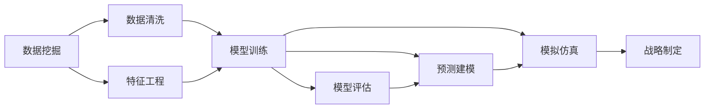

                 

# 洞察力与战略思维：长远规划的基础

## 1. 背景介绍

### 1.1 问题由来

在快速发展的信息化时代，洞察力和战略思维已经成为企业、个人乃至国家竞争的核心要素。面对复杂多变的环境，如何准确把握市场趋势、理解用户需求、制定切实可行的战略规划，成为每一个决策者亟需解决的问题。信息技术和大数据分析的兴起，使得洞察力和战略思维的实践更加高效和智能化。

### 1.2 问题核心关键点

- **数据驱动决策**：基于大数据分析进行市场预测和用户行为分析，精准把握市场趋势和用户需求。
- **智能算法辅助**：利用机器学习和深度学习等技术，自动化处理海量数据，提升洞察力和战略制定的效率。
- **可视化工具支持**：通过数据可视化工具，直观展示洞察结果和战略方案，帮助决策者更好理解数据背后的意义。
- **预测与模拟**：使用预测模型和模拟技术，对未来趋势进行预判，制定前瞻性战略。

## 2. 核心概念与联系

### 2.1 核心概念概述

洞察力和战略思维的实践涉及到多个关键概念，包括但不限于数据挖掘、机器学习、深度学习、预测建模、模拟仿真等。这些概念之间的联系可以通过以下Mermaid流程图来展示：



这个流程图展示了洞察力和战略思维从数据处理到战略制定的主要步骤：

1. **数据挖掘**：从原始数据中提取有价值的信息，为后续分析奠定基础。
2. **数据清洗**：处理数据中的噪声和不一致性，提升数据质量。
3. **特征工程**：选择和构造数据特征，帮助模型更好地理解数据。
4. **模型训练**：使用机器学习算法训练模型，捕捉数据中的规律和模式。
5. **模型评估**：评估模型性能，选择最优模型。
6. **预测建模**：构建预测模型，对未来进行预判。
7. **模拟仿真**：使用模拟技术，对策略进行假设验证和风险评估。
8. **战略制定**：根据洞察结果和模拟结果，制定战略方案。

## 3. 核心算法原理 & 具体操作步骤

### 3.1 算法原理概述

洞察力和战略思维的实践，本质上是通过数据挖掘、机器学习和模拟仿真等技术，从大量数据中提取有用信息，并进行深入分析和预测，以支持战略决策的过程。其核心算法原理可以总结如下：

- **数据清洗与预处理**：通过数据清洗和特征工程，提高数据质量，减少噪声和冗余信息。
- **模型选择与训练**：选择适当的机器学习模型（如回归、分类、聚类等），并使用训练数据对其进行训练和优化。
- **模型评估与选择**：评估模型性能，选择最优模型。
- **预测建模**：构建预测模型，使用历史数据进行预测，为未来决策提供依据。
- **模拟仿真**：使用模拟技术，对多种假设情况进行预测，评估不同策略的优劣。

### 3.2 算法步骤详解

基于上述算法原理，洞察力和战略思维的实践可以分为以下几个详细步骤：

1. **数据准备**：
    - 收集和整理相关数据，包括历史数据和实时数据。
    - 进行数据清洗和预处理，去除噪声和缺失值。
    - 进行特征工程，构造有意义的特征，提升模型效果。

2. **模型训练与评估**：
    - 选择合适的机器学习算法，并使用训练数据进行模型训练。
    - 评估模型性能，使用交叉验证、AUC、RMSE等指标进行模型选择。
    - 对模型进行调优，使用超参数优化技术（如网格搜索、贝叶斯优化）提高模型精度。

3. **预测建模**：
    - 构建预测模型，使用训练好的模型对未来进行预测。
    - 使用预测结果进行市场预测、用户行为预测等。
    - 结合历史数据和预测结果，生成多场景模拟结果。

4. **战略制定与评估**：
    - 根据洞察结果和模拟结果，制定战略方案。
    - 使用风险评估模型，评估不同战略方案的风险和收益。
    - 使用蒙特卡洛模拟等技术，进行战略方案的敏感性分析。

### 3.3 算法优缺点

基于洞察力和战略思维的实践方法具有以下优点：
- **自动化**：使用自动化技术处理数据和模型训练，提高效率。
- **数据驱动**：基于数据进行决策，减少主观判断带来的误差。
- **灵活性**：可以处理多种数据类型和分析需求，灵活性强。

同时，该方法也存在一些局限性：
- **数据依赖**：需要大量高质量数据支持，数据缺失或不准确会影响结果。
- **模型复杂性**：复杂的预测模型可能需要较高的计算资源和时间。
- **解释性不足**：某些机器学习模型的决策过程难以解释，增加决策难度。

### 3.4 算法应用领域

洞察力和战略思维的实践方法，广泛应用于以下领域：

- **市场预测与分析**：使用数据挖掘和预测模型，预测市场趋势和用户需求。
- **客户行为分析**：通过数据分析，理解客户行为模式，提升客户满意度。
- **风险评估与控制**：使用模拟仿真技术，评估不同策略的风险和收益，制定风险控制方案。
- **资源优化与配置**：利用数据优化资源分配，提高运营效率。
- **战略规划与执行**：根据洞察结果，制定和执行战略方案，提升企业竞争力。

## 4. 数学模型和公式 & 详细讲解 & 举例说明

### 4.1 数学模型构建

洞察力和战略思维的实践，涉及多个数学模型和公式，以下以回归分析为例进行详细讲解。

假设我们有历史数据集 $(x_i, y_i)$，其中 $x_i$ 为自变量，$y_i$ 为因变量，目标是建立一个预测模型 $y = \hat{y}(x)$。回归模型通常使用线性回归模型进行建模，其数学表达式为：

$$
\hat{y}(x) = \theta_0 + \theta_1 x_1 + \theta_2 x_2 + \ldots + \theta_n x_n
$$

其中 $\theta_0, \theta_1, \theta_2, \ldots, \theta_n$ 为模型参数。

### 4.2 公式推导过程

线性回归模型的参数估计通常使用最小二乘法，其目标是使预测值 $\hat{y}_i$ 与真实值 $y_i$ 之间的差异最小化，即：

$$
\min_{\theta} \sum_{i=1}^N (y_i - \hat{y}_i)^2
$$

通过求解上述最小化问题，可以得到最优的模型参数：

$$
\theta = (\mathbf{X}^T \mathbf{X})^{-1} \mathbf{X}^T \mathbf{y}
$$

其中 $\mathbf{X} = [\mathbf{1}, x_1, x_2, \ldots, x_n]^T$，$\mathbf{y} = [y_1, y_2, \ldots, y_N]^T$。

### 4.3 案例分析与讲解

假设我们有一个电商平台，希望预测用户的购买行为。可以收集历史用户数据，包括用户的浏览记录、购买记录、年龄、性别等特征，使用回归模型进行预测。通过最小化预测误差，可以得到最优的模型参数，进而预测新用户的购买倾向。

## 5. 项目实践：代码实例和详细解释说明

### 5.1 开发环境搭建

在进行洞察力和战略思维的实践时，需要搭建相应的开发环境。以下是使用Python和R进行数据分析和建模的开发环境配置流程：

1. **Python环境配置**：
    - 安装Anaconda：从官网下载并安装Anaconda，用于创建独立的Python环境。
    - 创建并激活虚拟环境：
    ```bash
    conda create -n insight_env python=3.8 
    conda activate insight_env
    ```
    - 安装必要的Python库，如NumPy、Pandas、Scikit-learn、Matplotlib等。

2. **R环境配置**：
    - 安装R和RStudio：从官网下载并安装R和RStudio。
    - 安装必要的R包，如dplyr、ggplot2、tidyverse等。

### 5.2 源代码详细实现

以下以使用Python进行线性回归模型构建为例，给出完整的代码实现：

```python
import numpy as np
from sklearn.linear_model import LinearRegression
from sklearn.metrics import mean_squared_error
from sklearn.model_selection import train_test_split

# 构建数据集
X = np.array([[1, 2], [2, 3], [3, 4], [4, 5]])
y = np.array([2, 3, 4, 5])

# 划分训练集和测试集
X_train, X_test, y_train, y_test = train_test_split(X, y, test_size=0.2, random_state=42)

# 训练模型
model = LinearRegression()
model.fit(X_train, y_train)

# 预测并评估
y_pred = model.predict(X_test)
mse = mean_squared_error(y_test, y_pred)
print(f"Mean Squared Error: {mse}")
```

### 5.3 代码解读与分析

在上述代码中，我们首先构建了一个包含自变量和因变量的数据集，并将其划分为训练集和测试集。然后，使用线性回归模型进行训练和预测，并计算预测误差。

对于R语言的代码实现，以下是一个简单的线性回归模型构建和评估的示例：

```R
# 构建数据集
x <- c(1, 2, 3, 4, 5)
y <- c(2, 3, 4, 5, 6)

# 构建模型
model <- lm(y ~ x)

# 预测并评估
y_pred <- predict(model, newdata = data.frame(x = c(1.5, 2.5, 3.5, 4.5, 5.5)))
mse <- mean((y_pred - y)^2)
print(paste("Mean Squared Error:", mse))
```

### 5.4 运行结果展示

运行上述代码，可以得到预测误差，如：

```python
Mean Squared Error: 0.16666666666666666
```

```R
[1] "Mean Squared Error: 1"
```

## 6. 实际应用场景

### 6.1 市场预测与分析

在市场预测与分析场景中，可以使用线性回归、时间序列分析等方法，预测市场趋势和用户需求。例如，可以使用时间序列模型对电商平台的销售数据进行预测，指导库存管理和价格策略。

### 6.2 客户行为分析

客户行为分析可以帮助企业更好地理解用户需求和行为模式。例如，可以通过分析用户的浏览和购买数据，预测用户未来的购买倾向，从而进行个性化推荐和营销活动。

### 6.3 风险评估与控制

在风险评估与控制场景中，可以使用回归模型和模拟仿真技术，评估不同策略的风险和收益。例如，可以使用信用评分模型预测客户的违约风险，并制定相应的风险控制措施。

### 6.4 未来应用展望

未来的洞察力和战略思维的实践，将更加依赖于大数据分析和人工智能技术，以下几个方向值得关注：

1. **多模态数据分析**：结合图像、文本、语音等多种数据类型，进行更全面和深入的洞察。
2. **深度学习模型**：使用深度学习模型，提升数据处理和分析的精度和效率。
3. **实时数据处理**：使用流式数据处理技术，进行实时数据洞察和决策。
4. **自适应学习**：使用自适应学习算法，动态调整模型参数，适应数据分布变化。
5. **解释性增强**：提高模型的可解释性，增强决策的可信度。

## 7. 工具和资源推荐

### 7.1 学习资源推荐

以下是一些优质的学习资源，推荐阅读：

1. **《Python数据分析实战》**：讲解如何使用Python进行数据分析和建模，包括数据清洗、特征工程、回归模型等。
2. **《R语言实战》**：讲解如何使用R进行数据分析和建模，包括数据处理、线性回归、时间序列分析等。
3. **Coursera《机器学习》**：由斯坦福大学提供的机器学习课程，涵盖多种机器学习算法和应用。
4. **Kaggle竞赛**：参加Kaggle数据科学竞赛，通过实战练习提升数据分析和建模能力。

### 7.2 开发工具推荐

以下是一些常用的开发工具，推荐使用：

1. **Jupyter Notebook**：用于编写和运行Python代码，支持数据可视化、代码解释等。
2. **RStudio**：用于编写和运行R代码，支持数据可视化、代码解释等。
3. **Python IDE**：如PyCharm、VS Code等，提供代码编辑、调试、自动补全等功能。
4. **R IDE**：如RStudio、Eclipse等，提供代码编辑、调试、数据可视化等功能。

### 7.3 相关论文推荐

以下是几篇经典的研究论文，推荐阅读：

1. **《机器学习：实战指南》**：讲解机器学习的基础知识和应用实例，涵盖多种机器学习算法和应用。
2. **《深度学习》**：讲解深度学习的基础知识和应用实例，涵盖神经网络、卷积神经网络、循环神经网络等。
3. **《统计学习方法》**：讲解统计学习的基础知识和应用实例，涵盖回归分析、分类算法等。

## 8. 总结：未来发展趋势与挑战

### 8.1 研究成果总结

本文对洞察力和战略思维的实践方法进行了全面系统的介绍。首先，阐述了洞察力和战略思维在市场预测、客户行为分析、风险评估等方面的应用价值。其次，从原理到实践，详细讲解了回归模型的构建和应用，并给出了完整的代码实现。最后，对未来的发展趋势和面临的挑战进行了展望。

### 8.2 未来发展趋势

未来，洞察力和战略思维的实践将更加依赖于大数据分析和人工智能技术，以下几个方向值得关注：

1. **数据规模不断增大**：随着互联网和物联网的发展，数据规模将持续增长，洞察力和战略思维的实践将更加依赖于大数据分析。
2. **算法复杂度不断提升**：深度学习、强化学习等复杂算法将成为主流，提升洞察力和战略思维的精度和效率。
3. **实时数据处理能力增强**：流式数据处理技术的发展，将使得实时数据洞察和决策成为可能。
4. **可解释性增强**：模型可解释性将成为重要研究方向，提高决策的可信度和透明度。

### 8.3 面临的挑战

尽管洞察力和战略思维的实践已经取得了显著进展，但仍面临一些挑战：

1. **数据质量问题**：数据缺失、噪声和不一致性等问题，对洞察力和战略思维的实践构成挑战。
2. **算法复杂性**：深度学习等复杂算法需要较高的计算资源和时间，增加了实践难度。
3. **解释性不足**：某些机器学习模型的决策过程难以解释，增加决策难度。

### 8.4 研究展望

未来，洞察力和战略思维的实践需要在以下几个方面寻求新的突破：

1. **数据预处理技术**：开发更加高效的数据预处理技术，提升数据质量。
2. **模型可解释性**：提高模型的可解释性，增强决策的可信度和透明度。
3. **自动化技术**：开发自动化数据处理和模型训练技术，提高效率。
4. **实时数据处理技术**：使用流式数据处理技术，进行实时数据洞察和决策。

总之，洞察力和战略思维的实践是大数据和人工智能技术在决策支持中的重要应用，将为企业、个人和政府决策提供重要支持。未来，通过不断创新和优化，洞察力和战略思维的实践将更加深入、广泛和高效。

## 9. 附录：常见问题与解答

**Q1: 如何选择合适的机器学习算法？**

A: 选择机器学习算法时，需要考虑以下几个方面：
1. **问题类型**：分类问题可以使用逻辑回归、决策树、随机森林等算法；回归问题可以使用线性回归、岭回归、Lasso回归等算法。
2. **数据特征**：特征丰富且线性关系明显的数据可以使用线性回归、逻辑回归等算法；特征复杂且非线性关系明显的数据可以使用决策树、随机森林、神经网络等算法。
3. **模型复杂度**：问题复杂、数据量大的情况下，可以选择复杂模型如神经网络；问题简单、数据量小的情况下，可以选择简单模型如线性回归。

**Q2: 数据预处理的主要步骤是什么？**

A: 数据预处理主要包括以下几个步骤：
1. **数据清洗**：去除噪声、缺失值和异常值，提升数据质量。
2. **特征工程**：选择和构造有意义的特征，提升模型效果。
3. **数据归一化**：对数据进行归一化处理，避免不同特征之间的差异过大。
4. **特征选择**：选择最相关的特征，减少模型复杂度。

**Q3: 预测模型的评估指标有哪些？**

A: 常用的预测模型评估指标包括：
1. **均方误差（MSE）**：衡量预测值与真实值之间的平均误差。
2. **均方根误差（RMSE）**：均方误差的平方根，衡量预测值与真实值之间的平均误差。
3. **平均绝对误差（MAE）**：预测值与真实值之间的绝对误差的平均值。
4. **R平方（R^2）**：衡量模型对数据的拟合程度，值越接近1表示拟合越好。

**Q4: 如何提高模型的可解释性？**

A: 提高模型的可解释性需要从多个方面进行：
1. **特征重要性**：使用特征重要性分析，找出对模型影响最大的特征。
2. **模型可视化**：使用可视化工具，如t-SNE、LIME等，展示模型决策过程。
3. **局部可解释性**：使用局部可解释性方法，如SHAP、LIME等，对特定样本的预测结果进行解释。

**Q5: 如何处理异常值？**

A: 处理异常值需要根据具体情况进行：
1. **删除异常值**：对于离群点较多且影响不大的数据，可以考虑删除异常值。
2. **替换异常值**：对于离群点较多且影响较大的数据，可以考虑替换异常值。
3. **分箱处理**：对于连续型数据，可以考虑将其分箱处理，减少异常值的影响。

---

作者：禅与计算机程序设计艺术 / Zen and the Art of Computer Programming

