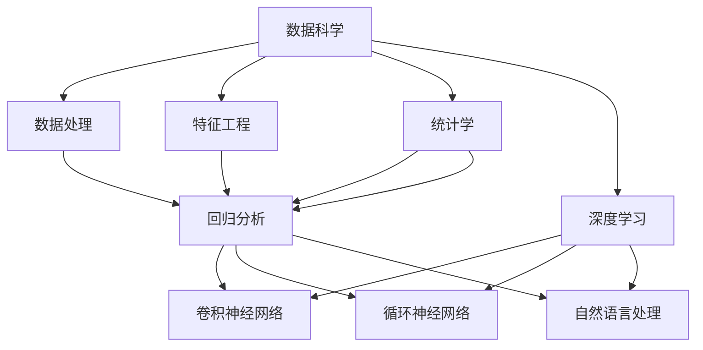

                 

# 洞察力与预测：未来思维的培养

> 关键词：预测分析,机器学习,数据科学,深度学习,洞察力培养,未来思维,数据处理

## 1. 背景介绍

### 1.1 问题由来
随着信息技术的发展和数据的普及，我们正处在一个数据驱动的时代。数据的涌入为各行各业带来了巨大的机遇，也带来了前所未有的挑战。如何在海量数据中挖掘出有用的信息，预测未来的趋势，成为了企业决策的重要支撑。预测分析技术的崛起，正是为了应对这种需求而诞生的。

### 1.2 问题核心关键点
预测分析是指通过数学模型和统计方法，从历史数据中学习规律，并用于预测未来事件发生概率的一种技术。其主要思想是将过去的数据与未来预测的目标建立关联，通过模型训练不断优化，最终得到准确预测的结果。预测分析的常用方法包括回归分析、分类分析、时序预测等。

在企业实际应用中，预测分析可以帮助企业进行销售预测、库存管理、市场趋势分析、客户行为预测等，从而优化运营、提升决策质量。但预测分析的核心在于数据的选择、模型的构建、参数的调优等，这些都需要系统化的培训和实践才能掌握。因此，本文将探讨如何在未来培养出具有洞察力和预测能力的人才，以适应数据驱动时代的挑战。

### 1.3 问题研究意义
未来，随着数据规模的爆炸性增长，预测分析将变得越来越重要。培养具备预测分析能力的人才，不仅能够提升企业的数据处理和决策能力，还能够加速技术创新，促进经济社会发展。本文旨在通过系统化的方法和步骤，帮助读者掌握预测分析的核心技术和应用场景，从而为培养未来的洞察力和预测人才提供指导。

## 2. 核心概念与联系

### 2.1 核心概念概述

为了更好地理解预测分析的核心概念，本节将介绍几个关键概念及其相互关系：

- **预测分析(Predictive Analytics)**：利用历史数据，通过统计和机器学习模型，预测未来事件的概率或趋势。其核心在于对数据的理解、模型的选择和参数的优化。
- **数据科学(Data Science)**：从数据中提取有价值的信息，分析数据背后的规律，并应用于实际决策。数据科学包含了数据处理、特征工程、模型构建和解释等环节。
- **深度学习(Deep Learning)**：一种基于神经网络的机器学习方法，通过多层次的特征提取和抽象，实现对复杂数据的处理和预测。深度学习在预测分析中的应用广泛，尤其是在图像、语音和自然语言处理等领域。
- **统计学(Statistics)**：研究数据收集、处理和分析的理论和方法，为预测分析提供了数学和理论支持。统计方法如回归分析、假设检验、时间序列分析等，在预测分析中广泛应用。
- **机器学习(Machine Learning)**：通过算法和模型，让计算机自动学习和优化，从数据中发现规律和模式。机器学习是预测分析的重要工具，特别是在大数据环境下，能够处理复杂的非线性关系。

这些概念之间存在着紧密的联系，共同构成了预测分析的理论基础和技术手段。通过对这些概念的深入理解，可以帮助我们更好地掌握预测分析的核心方法。

### 2.2 核心概念原理和架构的 Mermaid 流程图



这个流程图展示了预测分析的主要流程和技术路径。从数据处理到特征工程，从统计学到深度学习，每一个环节都是预测分析的重要组成部分。

## 3. 核心算法原理 & 具体操作步骤
### 3.1 算法原理概述

预测分析的核心理论包括统计学方法和机器学习算法。通过对历史数据的分析，预测模型可以学习到数据的规律，并应用于未来的预测。预测模型的选择和调优是预测分析成功的关键。

在实际应用中，预测分析的流程大致如下：
1. **数据准备**：收集、清洗、处理数据，准备用于模型训练和验证。
2. **特征工程**：从原始数据中提取有用的特征，以提高模型的预测能力。
3. **模型选择**：根据任务特点选择适合的预测模型，如线性回归、逻辑回归、决策树、支持向量机、神经网络等。
4. **模型训练**：使用历史数据训练模型，调整模型参数，优化模型性能。
5. **模型评估**：使用验证集或测试集评估模型性能，选择合适的模型。
6. **预测应用**：将模型应用于实际预测任务，得到预测结果。

### 3.2 算法步骤详解

以下将详细讲解预测分析的主要步骤，以线性回归模型为例：

**Step 1: 数据准备**
- 收集数据：包括历史数据和未来数据。
- 数据清洗：去除缺失值、异常值和噪声，保证数据的质量。
- 数据分割：将数据划分为训练集、验证集和测试集。

**Step 2: 特征工程**
- 数据转换：对数据进行归一化、标准化等预处理。
- 特征选择：选择对目标变量有重要影响的特征，去除冗余特征。
- 特征构造：通过多项式变换、交互项等方法，构造新的特征，提高模型性能。

**Step 3: 模型选择**
- 根据任务选择模型：如线性回归、逻辑回归、随机森林、神经网络等。
- 模型参数选择：如学习率、正则化参数、网络层数等。

**Step 4: 模型训练**
- 模型训练：使用训练集数据，通过梯度下降等优化算法训练模型。
- 参数优化：调整模型参数，提高模型预测能力。
- 模型评估：使用验证集评估模型性能，避免过拟合。

**Step 5: 模型评估**
- 模型评估：使用测试集评估模型预测能力，计算误差指标。
- 模型选择：选择性能最好的模型作为最终预测模型。

**Step 6: 预测应用**
- 数据输入：将未来数据输入模型，得到预测结果。
- 结果解释：解释预测结果，提供决策支持。

### 3.3 算法优缺点

预测分析作为一种重要的数据分析技术，具有以下优点：
1. 数据驱动：能够从数据中学习规律，预测未来趋势。
2. 自动化：通过算法自动优化模型参数，减少人工干预。
3. 灵活性：支持多种预测模型，适用于不同类型的数据和任务。
4. 可解释性：部分模型（如线性回归、决策树等）可以提供可解释的预测结果。

但预测分析也存在一些缺点：
1. 数据依赖：需要大量高质量的数据，数据质量和数量的不足会影响预测准确性。
2. 模型选择：选择合适模型的难度大，不同的模型适用于不同的数据和任务。
3. 模型复杂：部分复杂模型（如深度学习）需要较高的计算资源，训练复杂。
4. 解释性问题：部分高级模型（如神经网络）的决策过程不透明，难以解释。

尽管存在这些局限，预测分析仍然是一种非常有效的数据分析方法，能够帮助企业实现数据驱动的决策和预测。

### 3.4 算法应用领域

预测分析已经在各个领域得到了广泛的应用，包括但不限于以下几个方面：

- **金融领域**：预测股票价格、市场趋势、风险评估等。
- **零售行业**：预测销售趋势、库存管理、客户行为等。
- **医疗健康**：预测疾病风险、患者康复、药物效果等。
- **物流管理**：预测运输需求、货物配送、库存水平等。
- **营销分析**：预测广告效果、客户转化、市场份额等。
- **风险管理**：预测信贷风险、信用评分、欺诈检测等。

以上只是预测分析应用的冰山一角，未来随着技术的发展，预测分析将在更多领域得到应用，带来更多的商业价值。

## 4. 数学模型和公式 & 详细讲解 & 举例说明

### 4.1 数学模型构建

预测分析的核心数学模型包括线性回归、逻辑回归、决策树、随机森林、支持向量机、神经网络等。以线性回归模型为例，其数学模型如下：

$$
y = \beta_0 + \beta_1 x_1 + \beta_2 x_2 + \ldots + \beta_n x_n + \epsilon
$$

其中，$y$ 为预测目标变量，$\beta_0, \beta_1, \ldots, \beta_n$ 为模型参数，$x_1, x_2, \ldots, x_n$ 为特征变量，$\epsilon$ 为误差项。

### 4.2 公式推导过程

线性回归模型的目标是最小化预测值与真实值之间的误差，即：

$$
\min_{\beta} \sum_{i=1}^{n}(y_i - \hat{y}_i)^2
$$

其中，$\hat{y}_i = \beta_0 + \beta_1 x_{i1} + \beta_2 x_{i2} + \ldots + \beta_n x_{in}$ 为第 $i$ 个样本的预测值。

通过梯度下降等优化算法，求解上述最小化问题，得到最优的模型参数 $\beta$。

### 4.3 案例分析与讲解

以下以房价预测为例，展示线性回归模型的应用：

假设我们有历史房屋销售数据，包括房屋面积、房龄、地理位置等特征，以及房屋价格。我们可以使用线性回归模型预测未来房屋价格。具体步骤如下：

**Step 1: 数据准备**
- 收集历史房屋销售数据，包括房屋面积、房龄、地理位置、价格等。
- 数据清洗：去除缺失值和异常值，保证数据的质量。
- 数据分割：将数据划分为训练集和测试集。

**Step 2: 特征工程**
- 数据转换：对数据进行归一化处理。
- 特征选择：选择对房屋价格有重要影响的特征，如房屋面积、房龄等。
- 特征构造：构造新的特征，如房屋面积与房龄的交互项，提高模型性能。

**Step 3: 模型选择**
- 选择线性回归模型：线性回归模型适用于预测连续变量的任务。
- 模型参数选择：选择初始学习率为0.01，正则化参数为0.01。

**Step 4: 模型训练**
- 模型训练：使用训练集数据，通过梯度下降算法训练模型。
- 参数优化：调整学习率和正则化参数，优化模型性能。
- 模型评估：使用验证集评估模型性能，避免过拟合。

**Step 5: 模型评估**
- 模型评估：使用测试集评估模型预测能力，计算误差指标。
- 模型选择：选择性能最好的模型作为最终预测模型。

**Step 6: 预测应用**
- 数据输入：将未来房屋的面积、房龄、地理位置等特征输入模型，得到预测价格。
- 结果解释：解释预测结果，提供决策支持。

## 5. 项目实践：代码实例和详细解释说明

### 5.1 开发环境搭建

在进行预测分析项目实践前，我们需要准备好开发环境。以下是使用Python进行Scikit-learn开发的环境配置流程：

1. 安装Anaconda：从官网下载并安装Anaconda，用于创建独立的Python环境。

2. 创建并激活虚拟环境：
```bash
conda create -n predictive-env python=3.8 
conda activate predictive-env
```

3. 安装Scikit-learn：
```bash
pip install scikit-learn
```

4. 安装各类工具包：
```bash
pip install numpy pandas matplotlib seaborn scikit-optimize
```

5. 安装Jupyter Notebook：
```bash
pip install jupyter notebook
```

完成上述步骤后，即可在`predictive-env`环境中开始预测分析实践。

### 5.2 源代码详细实现

我们以房价预测为例，给出使用Scikit-learn库进行线性回归模型预测的Python代码实现。

```python
import pandas as pd
from sklearn.model_selection import train_test_split
from sklearn.linear_model import LinearRegression
from sklearn.metrics import mean_squared_error
import matplotlib.pyplot as plt

# 加载数据
df = pd.read_csv('housing.csv')

# 数据预处理
X = df[['area', 'age']]
y = df['price']
X_train, X_test, y_train, y_test = train_test_split(X, y, test_size=0.2, random_state=42)

# 模型训练
model = LinearRegression()
model.fit(X_train, y_train)

# 模型评估
y_pred = model.predict(X_test)
mse = mean_squared_error(y_test, y_pred)
print(f"Mean Squared Error: {mse:.2f}")

# 可视化结果
plt.scatter(y_test, y_pred)
plt.xlabel('True Price')
plt.ylabel('Predicted Price')
plt.show()
```

以上代码实现了从数据加载、预处理、模型训练、评估和可视化预测结果的全流程。代码简洁高效，便于理解和扩展。

### 5.3 代码解读与分析

下面我们详细解读一下关键代码的实现细节：

- **数据加载**：使用pandas库加载CSV文件，获取房屋数据。
- **数据预处理**：选择预测目标变量（价格）和特征变量（面积、房龄），使用train_test_split函数将数据划分为训练集和测试集。
- **模型训练**：创建线性回归模型，使用训练集数据fit函数进行模型训练。
- **模型评估**：使用测试集数据predict函数进行预测，并计算均方误差（MSE），评估模型性能。
- **可视化结果**：使用matplotlib库绘制真实价格与预测价格的散点图，直观展示模型预测效果。

以上代码展示了预测分析项目的基本流程和技术要点。通过学习和实践这些代码，可以快速掌握预测分析的核心方法和实现技巧。

## 6. 实际应用场景

### 6.1 智能客服系统

智能客服系统利用预测分析技术，可以实时预测客户需求，自动分配客服资源，提升客户服务效率和质量。

在技术实现上，可以收集历史客服数据，如客户提问、回复、转接记录等，构建预测模型预测客户需求，自动分配客服资源，甚至生成智能回复。这种基于预测分析的智能客服系统，能够大幅提升客户服务响应速度和满意度，降低企业运营成本。

### 6.2 金融风险管理

金融行业面临高风险和高不确定性，预测分析技术可以用于预测市场趋势、识别信用风险、评估信贷风险等，帮助金融机构进行风险管理。

具体而言，可以收集历史交易数据、市场数据、客户信用数据等，使用预测分析模型预测未来市场走势、客户违约概率等，帮助金融机构制定风控策略，减少损失。这种基于预测分析的风险管理方法，能够帮助金融机构及时调整策略，应对市场变化，提高风险管理能力。

### 6.3 医疗健康预测

医疗行业需要快速响应疾病暴发和流行病疫情，预测分析技术可以用于预测疾病风险、分析疫情传播趋势、评估治疗效果等，帮助医疗机构进行健康管理和预测。

具体而言，可以收集历史病例数据、环境数据、人口统计数据等，使用预测分析模型预测疾病发病率、疫情传播速度、治疗效果等，帮助医疗机构制定预防措施和治疗方案。这种基于预测分析的健康管理方法，能够帮助医疗机构及时发现和应对疾病风险，保障公共健康。

### 6.4 未来应用展望

随着预测分析技术的不断发展和应用，未来将在更多领域得到广泛应用，为社会经济的发展提供强有力的支持。

- **智能交通管理**：预测分析可以用于交通流量预测、事故风险评估、交通信号优化等，提升城市交通管理水平。
- **工业制造**：预测分析可以用于设备故障预测、生产计划优化、供应链管理等，提升工业生产效率和质量。
- **农业生产**：预测分析可以用于作物生长预测、病虫害预测、土壤分析等，提升农业生产效益。
- **教育培训**：预测分析可以用于学生成绩预测、课程推荐、教师教学效果评估等，提升教育质量。
- **智能家居**：预测分析可以用于家居设备预测维护、智能家电能耗预测等，提升家居智能水平。

预测分析技术的发展，将极大地推动各行各业向智能化、高效化、精准化的方向发展，为未来社会的智能化转型提供坚实的基础。

## 7. 工具和资源推荐

### 7.1 学习资源推荐

为了帮助开发者系统掌握预测分析的理论基础和实践技巧，这里推荐一些优质的学习资源：

1. 《Python数据分析与预测建模》系列书籍：由著名数据科学家撰写，系统介绍了Python在数据分析和预测建模中的应用。
2. Coursera《数据科学导论》课程：由斯坦福大学教授讲授，涵盖数据科学的基本概念和预测分析方法。
3. Kaggle竞赛平台：通过参与Kaggle竞赛，学习和应用预测分析方法，提升实战能力。
4. Udacity《机器学习工程师》纳米学位：涵盖机器学习和预测分析的深入知识和实战技能，适合进阶学习。
5. GitHub开源项目：查找和学习预测分析项目的代码实现，积累项目经验。

通过对这些资源的学习实践，相信你一定能够快速掌握预测分析的核心方法和应用技能。

### 7.2 开发工具推荐

高效的开发离不开优秀的工具支持。以下是几款用于预测分析开发的常用工具：

1. Jupyter Notebook：开源的交互式编程环境，支持Python和R等多种语言，适合数据分析和机器学习开发。
2. Scikit-learn：Python的机器学习库，包含丰富的预测分析算法和工具，适合快速开发和原型测试。
3. TensorFlow：由Google主导的深度学习框架，支持大规模模型训练和部署，适合复杂预测任务。
4. PyTorch：由Facebook主导的深度学习框架，支持动态图和静态图，适合快速迭代和实验。
5. Microsoft Azure Machine Learning：云端机器学习平台，支持大规模数据处理和模型训练，适合企业级应用。

合理利用这些工具，可以显著提升预测分析的开发效率，加快创新迭代的步伐。

### 7.3 相关论文推荐

预测分析技术的发展离不开学界的持续研究。以下是几篇奠基性的相关论文，推荐阅读：

1. "The Elements of Statistical Learning"：由统计学家撰写，全面介绍了统计学习的基本理论和算法。
2. "Pattern Recognition and Machine Learning"：由机器学习专家撰写，涵盖机器学习和预测分析的深入知识。
3. "Predictive Analytics: The Power of Data Discovery and Decision Making"：由数据科学家撰写，系统介绍了预测分析的方法和应用。
4. "Grokking Regression Analysis"：由数据分析专家撰写，深入浅出地讲解了回归分析的基本方法和实现。
5. "Deep Learning with Python"：由深度学习专家撰写，涵盖深度学习在预测分析中的应用和实践。

这些论文代表了大数据预测分析的发展脉络，通过学习这些前沿成果，可以帮助研究者把握学科前进方向，激发更多的创新灵感。

## 8. 总结：未来发展趋势与挑战

### 8.1 总结

本文对预测分析的核心技术和应用场景进行了全面系统的介绍。首先阐述了预测分析在数据驱动时代的重要性，明确了其数据驱动、自动化、灵活性和可解释性等核心特点。其次，从数据准备到模型训练，详细讲解了预测分析的主要步骤和技术要点，给出了预测分析项目开发的完整代码实现。同时，本文还广泛探讨了预测分析技术在智能客服、金融风险管理、医疗健康预测等多个领域的应用前景，展示了预测分析技术的巨大潜力。

通过本文的系统梳理，可以看到，预测分析技术在各行各业的应用越来越广泛，成为数据驱动决策的重要工具。未来，随着预测分析技术的不断发展和应用，将进一步提升各行各业的数据处理和决策能力，推动社会经济的智能化转型。

### 8.2 未来发展趋势

展望未来，预测分析技术将呈现以下几个发展趋势：

1. **数据规模持续增大**：随着物联网、云计算等技术的普及，数据规模将呈爆炸性增长，预测分析技术需要处理的数据量将越来越大。如何高效处理大规模数据，提高计算效率，将是未来的重要课题。
2. **模型复杂度提高**：深度学习等高级模型在预测分析中的应用将越来越广泛，模型的复杂度和训练难度将不断增加。如何优化模型结构，降低训练成本，提高模型性能，将是未来的重要挑战。
3. **可解释性增强**：预测分析模型需要具有更高的可解释性，以便决策者和用户理解和信任模型的预测结果。如何设计可解释性强的预测模型，将是未来的重要研究方向。
4. **多模态数据融合**：预测分析需要融合多种数据类型，如文本、图像、声音等，以获取更全面的信息。如何高效融合多种数据，提升预测准确性，将是未来的重要课题。
5. **实时预测**：预测分析需要实时处理和预测数据，以适应快速变化的环境。如何优化实时预测算法，提高系统响应速度，将是未来的重要研究方向。
6. **跨领域应用拓展**：预测分析技术将在更多领域得到应用，如城市管理、工业制造、农业生产等，帮助各个行业实现智能化转型。

以上趋势凸显了预测分析技术的广阔前景。这些方向的探索发展，必将进一步提升预测分析的性能和应用范围，为各行各业带来新的变革和机遇。

### 8.3 面临的挑战

尽管预测分析技术已经取得了显著进展，但在迈向更加智能化、高效化、精准化的应用过程中，仍面临诸多挑战：

1. **数据质量问题**：预测分析依赖高质量的数据，但数据获取、清洗和处理的成本较高。如何提高数据质量，降低数据获取和处理成本，将是未来的重要挑战。
2. **模型复杂度问题**：深度学习等高级模型的训练复杂度和计算成本较高，如何优化模型结构，降低训练难度，提高模型性能，将是未来的重要课题。
3. **模型可解释性问题**：预测分析模型往往具有较高的复杂度，其决策过程不透明，难以解释。如何设计可解释性强的预测模型，提高模型的可信度，将是未来的重要研究方向。
4. **跨领域应用问题**：不同行业的预测分析问题具有不同的特点和要求，如何设计通用化的预测模型，适应多种行业的需求，将是未来的重要课题。
5. **实时预测问题**：预测分析需要实时处理和预测数据，如何优化实时预测算法，提高系统响应速度，将是未来的重要研究方向。

### 8.4 研究展望

面对预测分析面临的挑战，未来的研究需要在以下几个方面寻求新的突破：

1. **数据预处理技术**：开发高效的数据清洗、转换和特征工程技术，提高数据处理效率和质量。
2. **模型优化技术**：优化模型结构，降低训练难度和计算成本，提高模型性能。
3. **可解释性增强技术**：设计可解释性强的预测模型，提高模型的可信度和可理解性。
4. **跨领域应用技术**：设计通用化的预测模型，适应多种行业的需求，提升模型的应用范围和效果。
5. **实时预测技术**：优化实时预测算法，提高系统响应速度，满足实时应用的需求。

这些研究方向将为预测分析技术带来新的突破，提升其在各个行业的应用效果和价值。相信随着学界和产业界的共同努力，预测分析技术必将迈向更高的台阶，为未来社会的智能化转型提供坚实的技术支持。

## 9. 附录：常见问题与解答

**Q1：预测分析需要大量的历史数据，如何获取高质量的数据？**

A: 高质量的数据是预测分析的基础，但获取高质量数据的成本较高。可以通过以下方法获取高质量数据：
- 数据购买：购买公共数据集或商业数据服务，如Kaggle、Google Dataset Search等。
- 数据共享：与同行业企业或研究机构共享数据，互相补充数据资源。
- 数据生成：通过模拟、仿真等技术生成高质量数据，弥补实际数据的缺失。

**Q2：预测分析模型选择和调参有哪些方法？**

A: 模型选择和调参是预测分析的关键环节，常用的方法包括：
- 模型选择：根据任务特点选择模型，如线性回归、逻辑回归、支持向量机、随机森林、神经网络等。
- 超参数调优：使用网格搜索、随机搜索、贝叶斯优化等方法，调整模型参数，优化模型性能。
- 模型评估：使用交叉验证、留出法、自助法等方法，评估模型性能，避免过拟合。

**Q3：预测分析模型的可解释性有哪些方法？**

A: 预测分析模型的可解释性对于决策者和用户理解模型预测结果非常重要，常用的方法包括：
- 模型简化：简化模型结构，减少模型复杂度，提高模型可解释性。
- 特征重要性：计算特征重要性，评估特征对模型的影响。
- 模型解释工具：使用工具如SHAP、LIME、interpret等，解释模型预测结果。

**Q4：预测分析模型在生产环境中的部署有哪些方法？**

A: 预测分析模型的部署需要在生产环境中高效运行，常用的方法包括：
- 模型压缩：压缩模型大小，减少计算资源消耗。
- 分布式部署：使用分布式计算平台，如Spark、Kafka等，提升模型计算效率。
- 容器化部署：使用容器技术，如Docker、Kubernetes等，实现模型自动化部署和扩展。

**Q5：如何优化实时预测算法的性能？**

A: 实时预测算法需要快速处理和预测数据，常用的方法包括：
- 算法优化：优化算法实现，减少计算复杂度和资源消耗。
- 数据预处理：预处理数据，减少模型计算量。
- 硬件优化：使用高效的硬件设备，如GPU、TPU等，提升模型计算速度。

这些方法和技术将帮助预测分析模型在实际应用中实现高效、稳定的部署和运行。通过持续的研究和优化，预测分析技术将在各个领域发挥更大的作用，推动社会经济的发展和进步。

