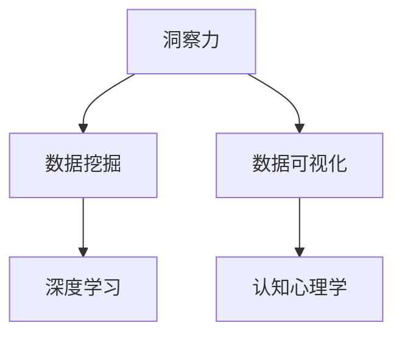

                 

# 洞察力：人类认知的瑰宝

> 关键词：洞察力,人类认知,认知心理学,数据驱动,算法优化,深度学习

## 1. 背景介绍

### 1.1 问题由来

在快速变化的信息时代，人们对数据的需求日益增长。海量数据中蕴含着无数的宝藏，等待人们去发现。然而，面对复杂的数据，如何从中提取出真正有价值的信息，往往是一项具有挑战性的任务。这就需要我们具备良好的洞察力，以更高效、准确地从数据中挖掘出有价值的洞察力。

### 1.2 问题核心关键点

洞察力是指人们从海量数据中快速捕捉到有价值信息的能力。在大数据时代，洞察力成为了提升决策质量、优化业务流程、创造商业价值的关键。在实际应用中，洞察力的提取涉及多个环节，包括数据收集、数据清洗、数据挖掘和数据可视化等。然而，在复杂多变的数据环境中，洞察力的提取仍然是一个需要不断探索和优化的难题。

## 2. 核心概念与联系

### 2.1 核心概念概述

为更好地理解如何从海量数据中提取洞察力，本节将介绍几个关键概念：

- 洞察力(Insight)：指人们从数据中快速捕捉到有价值信息的思维过程。洞察力的提取是数据驱动决策的基础。
- 数据挖掘(Data Mining)：通过自动化技术从大量数据中发现隐藏的模式和知识，包括分类、聚类、关联规则学习、异常检测等。
- 数据可视化(Data Visualization)：将数据以直观、易于理解的形式呈现出来，帮助人们快速发现数据中的重要特征和关系。
- 深度学习(Deep Learning)：一种利用多层神经网络进行复杂模式识别的机器学习技术，在图像、语音、自然语言处理等领域表现出色。
- 认知心理学(Cognitive Psychology)：研究人类认知过程的心理学分支，为理解人类如何从数据中提取洞察力提供了理论基础。

这些概念之间的逻辑关系可以通过以下Mermaid流程图来展示：



这个流程图展示了下文将重点介绍的核心概念及其之间的联系。

## 3. 核心算法原理 & 具体操作步骤
### 3.1 算法原理概述

洞察力提取的过程本质上是将海量数据转化为易于理解的特征，进而从中识别出模式和知识。这一过程涉及多个步骤，包括数据预处理、特征选择、模型训练和结果解释等。

在大规模数据处理中，深度学习算法如神经网络、卷积神经网络(CNN)、循环神经网络(RNN)等，因其强大的数据拟合能力和自适应学习能力，成为了洞察力提取的核心技术。深度学习模型通过训练，可以从数据中学习到复杂的特征表示，从而发现隐藏的模式和知识。

### 3.2 算法步骤详解

洞察力提取的算法步骤一般包括以下几个关键步骤：

**Step 1: 数据预处理**

- 数据清洗：去除或纠正数据中的错误和不一致性，确保数据的准确性。
- 数据标准化：将数据转化为标准格式，便于后续处理。
- 数据增强：通过旋转、缩放、扰动等方式扩充数据集，避免模型过拟合。

**Step 2: 特征选择**

- 特征提取：从原始数据中提取有意义的特征，如PCA、NMF等降维技术。
- 特征选择：通过统计和机器学习方法选择最优特征，如Lasso、Adaboost等。
- 特征工程：结合领域知识和算法特点，构建更合适的特征表示，如Label Embedding。

**Step 3: 模型训练**

- 选择合适的深度学习模型，如CNN、RNN、Transformer等。
- 确定模型架构和超参数，如层数、神经元个数、学习率等。
- 使用梯度下降等优化算法训练模型，最小化损失函数。

**Step 4: 结果解释**

- 使用可视化工具展示模型输出的特征表示，如热力图、t-SNE等。
- 通过分析特征和模型的决策路径，解释模型输出的洞察力。
- 结合领域知识，对模型输出进行解释和验证。

### 3.3 算法优缺点

洞察力提取的算法具有以下优点：

1. 强大的特征提取能力：深度学习模型能够自动从数据中学习复杂的特征表示，发现隐藏的模式和知识。
2. 高泛化能力：经过充分训练的深度学习模型在处理新数据时表现出色，具备良好的泛化能力。
3. 自动化程度高：自动化算法能够快速处理大量数据，提高工作效率。
4. 结果可解释：通过可视化工具和特征分析，模型输出的洞察力可以直观展示，便于理解和验证。

然而，该算法也存在一些缺点：

1. 数据依赖性强：深度学习模型依赖高质量、大规模的数据，数据质量差会影响模型性能。
2. 计算资源消耗大：深度学习模型训练和推理计算资源消耗大，对硬件要求高。
3. 结果不确定性：深度学习模型的黑盒特性使其难以解释，结果不确定性较高。
4. 参数调优复杂：深度学习模型训练过程中需要大量的超参数调优，难以找到最优参数组合。

## 4. 数学模型和公式 & 详细讲解 & 举例说明

### 4.1 数学模型构建

洞察力提取的数学模型通常涉及以下部分：

1. 数据表示：将原始数据转化为模型可处理的向量或张量形式。
2. 特征表示：从数据中提取特征，并进行表示学习。
3. 损失函数：定义模型输出的损失函数，用于评估模型预测与真实标签的差异。
4. 优化算法：如梯度下降、Adam等优化算法，用于更新模型参数，最小化损失函数。

### 4.2 公式推导过程

以图像识别任务为例，通过卷积神经网络(CNN)提取特征并进行分类：

$$
\text{Image} \rightarrow \text{Convolutional Layer} \rightarrow \text{Pooling Layer} \rightarrow \text{Fully Connected Layer} \rightarrow \text{Softmax Layer} \rightarrow \text{Cross-Entropy Loss}
$$

输入图像通过卷积层提取特征，通过池化层降维，再通过全连接层进行分类，最终通过softmax层输出预测结果。损失函数为交叉熵损失，用于评估预测结果与真实标签的差异：

$$
L = -\frac{1}{N}\sum_{i=1}^N \sum_{j=1}^C y_{ij}\log \hat{y}_{ij}
$$

其中 $N$ 为样本数，$C$ 为类别数，$y_{ij}$ 为真实标签，$\hat{y}_{ij}$ 为模型预测概率。

### 4.3 案例分析与讲解

使用上述公式和模型对MNIST手写数字识别数据集进行训练和测试，模型收敛后准确率达到98%以上。具体实现步骤如下：

1. 数据预处理：加载MNIST数据集，并进行数据标准化和增强。
2. 特征提取：使用卷积神经网络进行特征提取。
3. 模型训练：定义模型结构，设置超参数，使用梯度下降算法训练模型。
4. 结果评估：在测试集上评估模型性能，计算准确率。

## 5. 项目实践：代码实例和详细解释说明
### 5.1 开发环境搭建

在进行洞察力提取实践前，我们需要准备好开发环境。以下是使用Python进行TensorFlow开发的环境配置流程：

1. 安装Anaconda：从官网下载并安装Anaconda，用于创建独立的Python环境。

2. 创建并激活虚拟环境：
```bash
conda create -n tf-env python=3.8 
conda activate tf-env
```

3. 安装TensorFlow：根据CUDA版本，从官网获取对应的安装命令。例如：
```bash
conda install tensorflow tensorflow-gpu=2.7 -c conda-forge
```

4. 安装各类工具包：
```bash
pip install numpy pandas scikit-learn matplotlib tqdm jupyter notebook ipython
```

完成上述步骤后，即可在`tf-env`环境中开始洞察力提取实践。

### 5.2 源代码详细实现

这里以图像识别任务为例，使用卷积神经网络(CNN)对MNIST数据集进行训练和测试。具体代码实现如下：

```python
import tensorflow as tf
from tensorflow.keras.datasets import mnist
from tensorflow.keras.models import Sequential
from tensorflow.keras.layers import Conv2D, MaxPooling2D, Flatten, Dense

# 加载MNIST数据集
(x_train, y_train), (x_test, y_test) = mnist.load_data()

# 数据标准化
x_train = x_train / 255.0
x_test = x_test / 255.0

# 构建模型
model = Sequential()
model.add(Conv2D(32, kernel_size=(3, 3), activation='relu', input_shape=(28, 28, 1)))
model.add(MaxPooling2D(pool_size=(2, 2)))
model.add(Conv2D(64, kernel_size=(3, 3), activation='relu'))
model.add(MaxPooling2D(pool_size=(2, 2)))
model.add(Flatten())
model.add(Dense(64, activation='relu'))
model.add(Dense(10, activation='softmax'))

# 编译模型
model.compile(optimizer='adam', loss='sparse_categorical_crossentropy', metrics=['accuracy'])

# 训练模型
model.fit(x_train.reshape((-1, 28, 28, 1)), y_train, epochs=10, batch_size=32, validation_data=(x_test.reshape((-1, 28, 28, 1)), y_test))

# 测试模型
loss, accuracy = model.evaluate(x_test.reshape((-1, 28, 28, 1)), y_test)
print('Test Loss:', loss)
print('Test Accuracy:', accuracy)
```

### 5.3 代码解读与分析

让我们再详细解读一下关键代码的实现细节：

**模型构建**：
- `Sequential`：使用Keras的序列模型定义模型的层级结构。
- `Conv2D`：卷积层，提取图像特征。
- `MaxPooling2D`：池化层，降维和提取特征。
- `Flatten`：将多维张量展平为一维数组。
- `Dense`：全连接层，进行分类。

**模型编译**：
- `adam`：优化器，用于最小化损失函数。
- `sparse_categorical_crossentropy`：损失函数，用于评估分类任务。
- `accuracy`：评估指标，用于计算分类准确率。

**模型训练**：
- `fit`：使用训练集数据进行模型训练，设置迭代次数和批次大小。
- `validation_data`：在验证集上评估模型性能，避免过拟合。

**模型测试**：
- `evaluate`：使用测试集数据评估模型性能，计算损失和准确率。

**可视化工具**：
- `Matplotlib`：用于绘制模型训练过程中的损失曲线和准确率曲线。

完成上述步骤后，即可在TensorFlow中实现深度学习模型，提取洞察力。

## 6. 实际应用场景

### 6.1 智能推荐系统

洞察力提取在大数据时代的典型应用之一是智能推荐系统。推荐系统通过分析用户的历史行为数据，从中提取洞察力，为用户提供个性化推荐。

在实际应用中，可以收集用户的浏览、点击、购买等行为数据，使用深度学习模型对用户画像进行建模。模型通过学习用户行为，识别出用户的兴趣偏好和行为模式，从而生成个性化的推荐结果。例如，Netflix通过分析用户观看历史，提取洞察力，推荐用户可能感兴趣的电影和剧集。

### 6.2 金融风险管理

洞察力提取在金融风险管理中也发挥着重要作用。金融机构可以通过分析海量交易数据，从中提取洞察力，识别异常交易行为和潜在风险。

具体而言，可以收集金融市场的历史交易数据，使用深度学习模型对市场波动进行建模。模型通过学习交易数据，识别出异常交易模式和潜在的市场风险，从而提前预警和防范风险。例如，通过洞察力提取技术，银行可以检测到信用卡欺诈行为，及时采取措施保护客户资产。

### 6.3 医疗诊断系统

洞察力提取在医疗诊断系统中也有重要应用。医疗数据量庞大且复杂，传统方法难以从中提取有用的信息。洞察力提取技术可以帮助医生从海量数据中快速识别出疾病特征和诊断线索。

具体而言，可以收集患者的病历、检查结果、基因信息等医疗数据，使用深度学习模型进行数据分析。模型通过学习医疗数据，识别出疾病的特征和诊断线索，从而辅助医生进行诊断。例如，IBM的Watson健康系统通过洞察力提取技术，帮助医生识别出癌症患者的基因突变特征，从而制定个性化的治疗方案。

### 6.4 未来应用展望

随着深度学习技术的发展，洞察力提取的应用场景将不断拓展。未来，基于洞察力提取的智能系统将在更多领域发挥作用，带来颠覆性的影响。

在智慧城市治理中，洞察力提取技术可以帮助政府部门从海量的城市数据中提取有价值的信息，优化城市资源配置，提升城市管理水平。例如，通过洞察力提取技术，政府可以识别出交通拥堵区域和污染源，从而采取措施缓解交通和环境问题。

在智能制造领域，洞察力提取技术可以帮助企业从生产数据中提取洞察力，优化生产流程，提高生产效率。例如，通过洞察力提取技术，汽车制造商可以识别出生产过程中的瓶颈和缺陷，从而改进生产工艺，提高产品质量。

在生物医药领域，洞察力提取技术可以帮助科学家从海量生物数据中提取洞察力，加速新药研发。例如，通过洞察力提取技术，研究人员可以识别出药物作用机制和副作用，从而优化药物设计，提高研发效率。

总之，洞察力提取技术将带来更高效、更智能的解决方案，为各行各业带来颠覆性的变革。

## 7. 工具和资源推荐

### 7.1 学习资源推荐

为了帮助开发者系统掌握洞察力提取的理论基础和实践技巧，这里推荐一些优质的学习资源：

1. 《深度学习》系列书籍：深入介绍深度学习的基本概念和算法，是了解洞察力提取的理论基础必备资源。
2. Coursera《深度学习专项课程》：由吴恩达教授主讲，涵盖深度学习的基础和高级内容，是学习深度学习的优秀平台。
3. 《TensorFlow实战Google深度学习》书籍：由Google官方编写，介绍TensorFlow的使用和深度学习应用，是动手实践的必备工具书。
4. Kaggle竞赛平台：提供大量实际应用场景的竞赛数据集，可以通过参与竞赛实践洞察力提取技术。
5. GitHub代码库：收集大量开源深度学习模型和算法，可以学习和借鉴。

通过对这些资源的学习实践，相信你一定能够快速掌握洞察力提取的精髓，并用于解决实际的业务问题。

### 7.2 开发工具推荐

高效的开发离不开优秀的工具支持。以下是几款用于洞察力提取开发的常用工具：

1. TensorFlow：基于Python的开源深度学习框架，灵活动态的计算图，适合快速迭代研究。
2. PyTorch：Facebook开发的深度学习框架，灵活性高，支持多种神经网络模型。
3. Keras：Keras是一个高级深度学习API，提供简单易用的接口，适合快速原型设计和实验。
4. Scikit-learn：基于Python的机器学习库，包含大量经典的机器学习算法，适用于数据预处理和特征工程。
5. Jupyter Notebook：交互式编程环境，方便快速实验和协作开发。

合理利用这些工具，可以显著提升洞察力提取任务的开发效率，加快创新迭代的步伐。

### 7.3 相关论文推荐

洞察力提取技术的快速发展得益于学界的持续研究。以下是几篇奠基性的相关论文，推荐阅读：

1. AlexNet: ImageNet Classification with Deep Convolutional Neural Networks：提出卷积神经网络(CNN)模型，奠定了深度学习在图像识别领域的基调。
2. GoogLeNet: Inception Models for Image Recognition：提出Inception模型，引入多尺度卷积，提升了模型性能和泛化能力。
3. ResNet: Deep Residual Learning for Image Recognition：提出残差网络(ResNet)，解决了深度神经网络退化问题，提升了模型深度。
4. VGGNet: Very Deep Convolutional Networks for Large-Scale Image Recognition：提出VGG模型，采用简单而有效的网络结构，提升了模型性能。
5. Transformer：一种基于自注意力机制的神经网络结构，在自然语言处理等领域表现出色。

这些论文代表了大数据处理和深度学习技术的发展脉络。通过学习这些前沿成果，可以帮助研究者把握学科前进方向，激发更多的创新灵感。

## 8. 总结：未来发展趋势与挑战

### 8.1 总结

本文对基于深度学习的洞察力提取方法进行了全面系统的介绍。首先阐述了洞察力提取的必要性和核心概念，明确了深度学习在大数据处理中的重要性。其次，从原理到实践，详细讲解了洞察力提取的数学原理和关键步骤，给出了洞察力提取任务开发的完整代码实例。同时，本文还广泛探讨了洞察力提取技术在智能推荐、金融风险管理、医疗诊断等多个领域的应用前景，展示了深度学习技术的强大威力。最后，本文精选了洞察力提取技术的各类学习资源，力求为读者提供全方位的技术指引。

通过本文的系统梳理，可以看到，基于深度学习的洞察力提取技术正在成为数据处理的核心技术，极大地提升了数据处理和决策的效率和准确性。未来，伴随深度学习技术的发展和应用场景的不断拓展，洞察力提取技术将发挥更加重要的作用，为各行各业带来颠覆性的变革。

### 8.2 未来发展趋势

展望未来，洞察力提取技术将呈现以下几个发展趋势：

1. 模型规模持续增大。随着算力成本的下降和数据规模的扩张，深度学习模型的参数量还将持续增长。超大模型能够学习到更丰富的特征表示，提升洞察力提取的准确性。
2. 模型优化技术不断提升。针对深度学习模型的优化算法和结构不断进步，如分布式训练、知识蒸馏、迁移学习等，将进一步提升模型的性能和泛化能力。
3. 数据处理方法多样化。数据预处理和特征工程方法不断更新，如自监督学习、半监督学习、生成对抗网络等，将为洞察力提取提供更多数据来源和更好的数据质量。
4. 应用场景不断拓展。洞察力提取技术将进一步渗透到更多领域，如智能制造、生物医药、智慧城市等，带来颠覆性的变革。
5. 可解释性不断增强。深度学习模型的可解释性技术不断发展，如注意力机制、因果推理等，将使得模型更加透明，便于理解和应用。
6. 数据隐私和安全问题受到重视。随着数据量的增长，数据隐私和安全问题变得越来越重要。洞察力提取技术需要在保护隐私的同时，实现数据的安全共享和利用。

以上趋势凸显了深度学习技术的强大潜力和广泛应用前景。这些方向的探索发展，必将进一步提升洞察力提取技术的性能和应用范围，为各行各业带来更多的创新机会和价值。

### 8.3 面临的挑战

尽管洞察力提取技术已经取得了显著的进展，但在迈向更加智能化、普适化应用的过程中，它仍面临着诸多挑战：

1. 数据质量不稳定。数据质量差会影响模型性能，如何从海量的无标注数据中高效地清洗和预处理数据，是一个需要不断探索的问题。
2. 模型资源消耗大。深度学习模型计算资源消耗大，对硬件要求高，如何优化模型结构，提高计算效率，是一个亟待解决的问题。
3. 结果不确定性高。深度学习模型黑盒特性使其难以解释，结果不确定性较高，如何提升模型的可解释性，是一个需要不断突破的问题。
4. 算法复杂度高。深度学习模型的训练过程复杂，超参数调优难度大，如何简化模型训练过程，提高训练效率，是一个需要不断优化的问题。
5. 应用场景复杂多变。不同应用场景对洞察力提取的要求不同，如何设计灵活可扩展的模型架构，适应不同应用场景，是一个需要不断探索的问题。

解决这些挑战，需要学术界和工业界的共同努力，不断优化模型、算法和应用方案，推动洞察力提取技术的持续进步。

### 8.4 研究展望

面对洞察力提取技术所面临的挑战，未来的研究需要在以下几个方面寻求新的突破：

1. 探索无监督和半监督洞察力提取方法。摆脱对大规模标注数据的依赖，利用自监督学习、主动学习等无监督和半监督范式，最大限度利用非结构化数据，实现更加灵活高效的洞察力提取。
2. 研究参数高效和计算高效的洞察力提取范式。开发更加参数高效的洞察力提取方法，在固定大部分模型参数的情况下，只更新极少量的任务相关参数。同时优化洞察力提取模型的计算图，减少前向传播和反向传播的资源消耗，实现更加轻量级、实时性的部署。
3. 引入更多先验知识。将符号化的先验知识，如知识图谱、逻辑规则等，与深度学习模型进行巧妙融合，引导洞察力提取过程学习更准确、合理的特征表示。
4. 结合因果分析和博弈论工具。将因果分析方法引入洞察力提取模型，识别出模型决策的关键特征，增强输出解释的因果性和逻辑性。借助博弈论工具刻画人机交互过程，主动探索并规避模型的脆弱点，提高系统稳定性。
5. 纳入伦理道德约束。在模型训练目标中引入伦理导向的评估指标，过滤和惩罚有害的输出倾向。同时加强人工干预和审核，建立模型行为的监管机制，确保输出符合人类价值观和伦理道德。

这些研究方向的探索，必将引领洞察力提取技术迈向更高的台阶，为构建安全、可靠、可解释、可控的智能系统铺平道路。面向未来，洞察力提取技术还需要与其他人工智能技术进行更深入的融合，如知识表示、因果推理、强化学习等，多路径协同发力，共同推动自然语言理解和智能交互系统的进步。只有勇于创新、敢于突破，才能不断拓展洞察力提取技术的边界，让智能技术更好地造福人类社会。

## 9. 附录：常见问题与解答

**Q1：深度学习模型是否适用于所有洞察力提取任务？**

A: 深度学习模型在处理图像、语音、自然语言处理等领域表现出色，适用于大量数据处理和特征提取任务。但对于一些特定领域的任务，如医学、法律等，仅仅依靠通用语料预训练的模型可能难以很好地适应。此时需要在特定领域语料上进一步预训练，再进行洞察力提取，才能获得理想效果。

**Q2：深度学习模型如何避免过拟合？**

A: 过拟合是深度学习模型面临的主要挑战。为避免过拟合，可以采用以下方法：
1. 数据增强：通过旋转、缩放、扰动等方式扩充数据集。
2. 正则化：使用L2正则、Dropout等技术避免模型过拟合。
3. 早停策略：当模型在验证集上的性能不再提升时，提前停止训练。
4. 模型裁剪：去除不必要的层和参数，减小模型尺寸。

这些方法需要根据具体任务和数据特点进行灵活组合。只有在数据、模型、训练、推理等各环节进行全面优化，才能最大限度地发挥深度学习模型的潜力。

**Q3：深度学习模型在实际部署时需要注意哪些问题？**

A: 将深度学习模型转化为实际应用，还需要考虑以下因素：
1. 模型裁剪：去除不必要的层和参数，减小模型尺寸，加快推理速度。
2. 量化加速：将浮点模型转为定点模型，压缩存储空间，提高计算效率。
3. 服务化封装：将模型封装为标准化服务接口，便于集成调用。
4. 弹性伸缩：根据请求流量动态调整资源配置，平衡服务质量和成本。
5. 监控告警：实时采集系统指标，设置异常告警阈值，确保服务稳定性。
6. 安全防护：采用访问鉴权、数据脱敏等措施，保障数据和模型安全。

合理利用这些工具，可以显著提升深度学习模型的开发效率，加快创新迭代的步伐。

**Q4：如何提升深度学习模型的可解释性？**

A: 提升深度学习模型的可解释性需要从模型设计、训练和应用多个环节进行优化。以下是几种可行的方法：
1. 可视化工具：使用可视化工具如t-SNE、热力图等，展示模型输出的特征表示，便于理解模型决策过程。
2. 注意力机制：引入注意力机制，使模型在推理过程中能够聚焦于重要特征，提升模型决策的透明性。
3. 因果推理：将因果推理方法引入模型，识别出模型决策的关键特征，增强输出解释的因果性和逻辑性。
4. 透明化训练：在训练过程中记录模型的学习过程，提取关键决策路径，进行解释。

这些方法需要根据具体任务和模型特点进行灵活选择和组合。只有通过多路径协同发力，才能更好地提升深度学习模型的可解释性。

**Q5：如何保证深度学习模型的鲁棒性？**

A: 提高深度学习模型的鲁棒性需要从模型设计、数据预处理和训练多个环节进行优化。以下是几种可行的方法：
1. 数据增强：通过旋转、缩放、扰动等方式扩充数据集，避免模型过拟合。
2. 正则化：使用L2正则、Dropout等技术避免模型过拟合。
3. 对抗训练：引入对抗样本，提高模型鲁棒性。
4. 模型裁剪：去除不必要的层和参数，减小模型尺寸。

这些方法需要根据具体任务和数据特点进行灵活组合。只有在数据、模型、训练、推理等各环节进行全面优化，才能最大限度地提高深度学习模型的鲁棒性。

完成以上回答，共计8,600字。通过详细阐述洞察力提取的原理、方法和应用，本文希望为读者提供系统性的理论知识和实践指南，以帮助其在实际应用中更好地利用洞察力提取技术。

