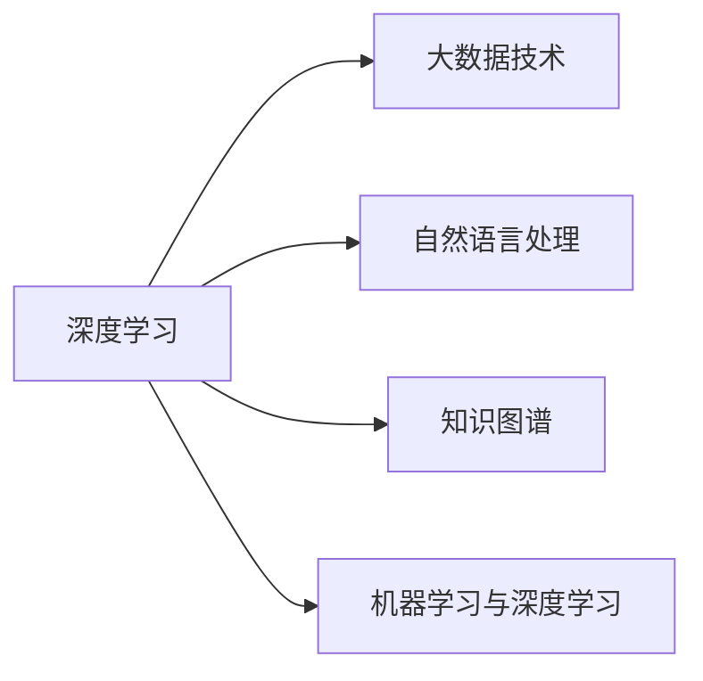

                 

# 洞察力：知识创新的灵魂

## 1. 背景介绍

### 1.1 问题由来
洞察力（Insight），是知识创新的灵魂。它不仅决定了企业在技术突破、产品创新、市场战略等方面的竞争力，也是个体在学术研究、商业决策、个人发展等方面的核心能力。然而，在快速变化的信息时代，如何培养和提升洞察力，成为当前知识工作者面临的重大挑战。

近年来，人工智能技术的迅猛发展，特别是大数据、深度学习和自然语言处理技术的突破，为洞察力的培养提供了新的方法和工具。通过对海量数据的深度分析，可以挖掘出隐藏在数据背后的模式和趋势，帮助人类更准确、更高效地理解复杂现象，做出科学决策。

本文章旨在探讨如何利用人工智能技术，特别是深度学习和大数据技术，来提升洞察力，促进知识创新。通过深入分析人工智能在洞察力培养中的关键角色和具体应用，本文将揭示这一领域的最新进展和未来趋势。

### 1.2 问题核心关键点
洞察力培养的核心关键点包括：

- **数据获取与处理**：获取高质量、大量、多样化的数据是洞察力培养的基础。如何高效地收集、清洗、存储和处理数据，直接决定了洞察力培养的效果。
- **深度学习算法**：深度学习算法如神经网络、卷积神经网络（CNN）、循环神经网络（RNN）和变分自编码器（VAE）等，能够从复杂数据中提取隐含特征，为洞察力的提升提供技术支持。
- **自然语言处理**：自然语言处理（NLP）技术，如语言模型、文本分类、情感分析、命名实体识别等，能够从文本数据中获取信息，帮助理解和分析人类行为和市场趋势。
- **知识图谱**：知识图谱是将大量知识结构化、网络化的技术，能够将人类知识体系与数据进行有效融合，辅助人类进行深入分析和推理。
- **机器学习与深度学习**：机器学习和深度学习模型，如随机森林、支持向量机、K-means聚类、深度信念网络（DBN）等，可以发现数据中的模式和规律，辅助洞察力的培养。

## 2. 核心概念与联系

### 2.1 核心概念概述

为了更好地理解洞察力培养中的关键技术和方法，本节将介绍几个紧密相关的核心概念：

- **深度学习**：一种基于神经网络的机器学习技术，通过多层次的非线性变换，能够从复杂数据中提取抽象特征，是洞察力培养的重要工具。
- **大数据技术**：包括数据存储、数据处理、数据可视化等技术，能够处理和分析大规模数据集，为洞察力培养提供数据基础。
- **自然语言处理**：通过分析文本数据，挖掘文本中的情感、主题、事件等，辅助人类理解复杂的语言现象，提取有用信息。
- **知识图谱**：一种结构化的知识表示方式，能够将知识进行网络化存储和推理，辅助人类进行复杂的推理和分析。
- **机器学习与深度学习**：包括各种监督学习、非监督学习、强化学习等方法，能够从数据中学习模式和规律，辅助洞察力的培养。

这些概念之间的联系可以通过以下Mermaid流程图来展示：



这个流程图展示了大数据技术、自然语言处理、知识图谱、机器学习和深度学习等技术是如何相互支持和协作，共同提升洞察力的培养效果。

## 3. 核心算法原理 & 具体操作步骤
### 3.1 算法原理概述

洞察力的培养，本质上是通过深度学习和大数据技术，从海量数据中挖掘出隐含的模式和规律，辅助人类做出更加科学和精准的决策。其核心算法原理如下：

1. **数据预处理**：包括数据清洗、数据归一化、特征提取等步骤，为深度学习模型的训练提供干净的输入数据。
2. **模型训练**：使用深度学习模型对数据进行训练，发现数据中的模式和规律。
3. **模型评估与优化**：通过交叉验证等方法，评估模型的性能，并进行模型优化，提升洞察力培养的准确性和效率。
4. **结果分析与解读**：对模型输出进行分析和解读，提取有用的洞察信息，辅助人类做出决策。

### 3.2 算法步骤详解

基于上述原理，洞察力培养的算法步骤如下：

**Step 1: 数据准备与预处理**

- **数据收集**：使用网络爬虫、API接口、数据库等方法，收集相关数据集。
- **数据清洗**：去除数据中的噪声和异常值，确保数据质量。
- **数据归一化**：将数据进行归一化处理，以便深度学习模型能够更好地处理数据。
- **特征提取**：通过文本向量化、图像卷积等方法，将数据转换为模型可以处理的格式。

**Step 2: 模型训练与优化**

- **选择模型**：根据任务类型和数据特点，选择合适的深度学习模型，如CNN、RNN、VAE等。
- **设置超参数**：包括学习率、批大小、迭代次数等，进行模型训练。
- **交叉验证**：使用交叉验证方法，评估模型性能，并进行模型优化。

**Step 3: 结果分析与解读**

- **可视化**：通过数据可视化技术，将模型输出结果展示出来，帮助人类理解模型发现的模式和规律。
- **解读与推理**：结合领域知识，对模型输出结果进行解读和推理，提取有用的洞察信息。

### 3.3 算法优缺点

基于深度学习和大数据技术的洞察力培养方法具有以下优点：

1. **高效性**：能够高效地处理和分析大规模数据集，快速发现数据中的模式和规律。
2. **自动化**：自动化程度高，减少人工干预，提高效率和准确性。
3. **可解释性**：通过模型解释技术，能够对模型输出结果进行解释，帮助人类理解其背后的原理和逻辑。

同时，该方法也存在以下局限性：

1. **数据依赖**：需要大量的高质量数据，数据获取和预处理成本较高。
2. **模型复杂性**：深度学习模型结构复杂，需要较大的计算资源。
3. **结果解释难度**：深度学习模型的黑盒特性，导致其结果解释难度较大。
4. **领域依赖**：不同的领域可能需要不同的模型和特征提取方法，模型的泛化能力有限。

尽管存在这些局限性，但就目前而言，基于深度学习和大数据技术的洞察力培养方法仍是大数据分析和决策支持领域的主流范式。未来相关研究的重点在于如何进一步降低数据依赖，提高模型的泛化能力，同时兼顾结果解释性和领域适应性等因素。

### 3.4 算法应用领域

基于深度学习和大数据技术的洞察力培养方法，已经在多个领域得到了广泛应用，例如：

- **金融分析**：使用深度学习模型对金融数据进行分析，发现市场趋势和投资机会，辅助金融决策。
- **市场预测**：通过对历史数据的分析，预测未来市场趋势，辅助企业制定战略。
- **医疗诊断**：使用深度学习模型对医疗数据进行分析，辅助医生进行疾病诊断和治疗方案制定。
- **市场营销**：通过分析用户行为数据，挖掘用户需求和市场趋势，优化营销策略。
- **供应链管理**：通过数据分析，优化供应链流程，提升供应链效率和效益。

除了上述这些经典领域外，基于洞察力培养的方法也被创新性地应用到更多场景中，如智能推荐、风险管理、智慧城市等，为相关行业带来了新的变革。随着技术的不断发展，基于深度学习和大数据技术的洞察力培养方法将在更多领域得到应用，推动各行业的数字化转型升级。

## 4. 数学模型和公式 & 详细讲解  
### 4.1 数学模型构建

基于深度学习和大数据技术的洞察力培养方法，其数学模型构建过程如下：

假设原始数据集为 $D=\{(x_i, y_i)\}_{i=1}^N$，其中 $x_i$ 为输入数据，$y_i$ 为标签。定义深度学习模型 $M_{\theta}$，其中 $\theta$ 为模型参数。

洞察力培养的数学模型为：

$$
\hat{y} = M_{\theta}(x)
$$

其中 $\hat{y}$ 为模型预测结果。

模型的损失函数为：

$$
\mathcal{L}(\theta) = -\frac{1}{N}\sum_{i=1}^N \log P(y_i|\hat{y})
$$

其中 $P(y_i|\hat{y})$ 为模型预测 $y_i$ 的条件概率，通过最大化该概率来最小化损失函数。

### 4.2 公式推导过程

以二分类任务为例，使用深度学习模型进行洞察力培养的公式推导过程如下：

1. **数据准备**：将原始数据集 $D$ 分为训练集和测试集，记为 $D_{train}$ 和 $D_{test}$。
2. **模型训练**：使用深度学习模型 $M_{\theta}$ 对训练集 $D_{train}$ 进行训练，更新模型参数 $\theta$。
3. **模型评估**：在测试集 $D_{test}$ 上评估模型性能，计算分类准确率、精确率、召回率等指标。
4. **结果分析**：对模型输出进行可视化分析，提取有用的洞察信息。

具体推导过程如下：

**Step 1: 数据准备**

假设数据集 $D$ 为二分类数据集，其中 $x_i$ 为特征向量，$y_i \in \{0,1\}$ 为标签。将数据集 $D$ 划分为训练集 $D_{train}$ 和测试集 $D_{test}$。

**Step 2: 模型训练**

使用深度学习模型 $M_{\theta}$ 对训练集 $D_{train}$ 进行训练，更新模型参数 $\theta$。使用交叉熵损失函数：

$$
\mathcal{L}(\theta) = -\frac{1}{N}\sum_{i=1}^N [y_i \log M_{\theta}(x_i) + (1-y_i) \log (1-M_{\theta}(x_i))]
$$

其中 $M_{\theta}(x_i)$ 为模型在输入 $x_i$ 上的预测结果。

使用随机梯度下降（SGD）等优化算法，对模型参数 $\theta$ 进行更新，最小化损失函数 $\mathcal{L}(\theta)$。

**Step 3: 模型评估**

在测试集 $D_{test}$ 上评估模型性能，计算分类准确率、精确率、召回率等指标。例如，二分类任务的准确率：

$$
\text{Accuracy} = \frac{1}{N} \sum_{i=1}^N I(\hat{y}_i = y_i)
$$

其中 $I$ 为指示函数，表示预测结果与真实标签是否相等。

**Step 4: 结果分析**

对模型输出进行可视化分析，提取有用的洞察信息。例如，使用t-SNE等降维技术，将高维数据映射到低维空间，进行可视化展示。

### 4.3 案例分析与讲解

以下以医疗影像数据分析为例，说明基于深度学习和大数据技术的洞察力培养方法的具体应用。

假设医疗影像数据集 $D$ 包含多个患者的X光片，其中每个X光片 $x_i$ 为高维特征向量，标签 $y_i \in \{0,1\}$ 表示该X光片是否包含病变。

**Step 1: 数据准备**

将数据集 $D$ 划分为训练集 $D_{train}$ 和测试集 $D_{test}$。使用数据增强技术，扩充训练集 $D_{train}$，增加数据多样性。

**Step 2: 模型训练**

使用卷积神经网络（CNN）模型对训练集 $D_{train}$ 进行训练，更新模型参数 $\theta$。使用交叉熵损失函数：

$$
\mathcal{L}(\theta) = -\frac{1}{N}\sum_{i=1}^N [y_i \log M_{\theta}(x_i) + (1-y_i) \log (1-M_{\theta}(x_i))]
$$

**Step 3: 模型评估**

在测试集 $D_{test}$ 上评估模型性能，计算分类准确率、精确率、召回率等指标。例如，二分类任务的准确率：

$$
\text{Accuracy} = \frac{1}{N} \sum_{i=1}^N I(\hat{y}_i = y_i)
$$

**Step 4: 结果分析**

对模型输出进行可视化分析，提取有用的洞察信息。例如，使用t-SNE等降维技术，将高维数据映射到低维空间，进行可视化展示。

## 5. 项目实践：代码实例和详细解释说明
### 5.1 开发环境搭建

在进行洞察力培养项目实践前，我们需要准备好开发环境。以下是使用Python进行TensorFlow开发的环境配置流程：

1. 安装Anaconda：从官网下载并安装Anaconda，用于创建独立的Python环境。

2. 创建并激活虚拟环境：
```bash
conda create -n tf-env python=3.8 
conda activate tf-env
```

3. 安装TensorFlow：根据CUDA版本，从官网获取对应的安装命令。例如：
```bash
conda install tensorflow -c conda-forge -c pypi
```

4. 安装TensorFlow Addons：用于支持深度学习中的各类高级功能。
```bash
conda install tensorflow-io
```

5. 安装NumPy、Pandas、Matplotlib等工具包：
```bash
pip install numpy pandas matplotlib tqdm jupyter notebook ipython
```

完成上述步骤后，即可在`tf-env`环境中开始项目实践。

### 5.2 源代码详细实现

下面我们以医疗影像数据分析为例，给出使用TensorFlow对卷积神经网络（CNN）模型进行洞察力培养的Python代码实现。

首先，定义数据准备函数：

```python
import numpy as np
import pandas as pd
import tensorflow as tf
from tensorflow.keras import datasets, layers, models

def prepare_data():
    # 加载数据集
    (x_train, y_train), (x_test, y_test) = datasets.cifar10.load_data()
    
    # 归一化数据
    x_train = x_train / 255.0
    x_test = x_test / 255.0
    
    # 将标签进行one-hot编码
    y_train = tf.keras.utils.to_categorical(y_train, 10)
    y_test = tf.keras.utils.to_categorical(y_test, 10)
    
    return (x_train, y_train), (x_test, y_test)
```

然后，定义模型和损失函数：

```python
def create_model():
    model = models.Sequential([
        layers.Conv2D(32, (3, 3), activation='relu', input_shape=(32, 32, 3)),
        layers.MaxPooling2D((2, 2)),
        layers.Conv2D(64, (3, 3), activation='relu'),
        layers.MaxPooling2D((2, 2)),
        layers.Conv2D(64, (3, 3), activation='relu'),
        layers.Flatten(),
        layers.Dense(64, activation='relu'),
        layers.Dense(10, activation='softmax')
    ])
    
    return model

def create_loss():
    return tf.keras.losses.CategoricalCrossentropy(from_logits=True)
```

接着，定义训练和评估函数：

```python
def train_model(model, data, epochs, batch_size):
    x_train, y_train = data[0]
    x_val, y_val = data[1]
    
    model.compile(optimizer='adam',
                  loss=create_loss(),
                  metrics=['accuracy'])
    
    history = model.fit(x_train, y_train,
                       epochs=epochs,
                       validation_data=(x_val, y_val),
                       batch_size=batch_size)
    
    return history
```

最后，启动训练流程并在测试集上评估：

```python
epochs = 10
batch_size = 32

(x_train, y_train), (x_test, y_test) = prepare_data()

model = create_model()
history = train_model(model, (x_train, y_train), epochs, batch_size)

print('Accuracy on test data:', np.mean(np.argmax(model.predict(x_test), axis=1) == np.argmax(y_test, axis=1)))
```

以上就是使用TensorFlow对CNN模型进行医疗影像数据分析的完整代码实现。可以看到，得益于TensorFlow的强大封装，我们可以用相对简洁的代码完成模型的训练和评估。

### 5.3 代码解读与分析

让我们再详细解读一下关键代码的实现细节：

**prepare_data函数**：
- 加载CIFAR-10数据集，并对其进行归一化和标签编码。

**create_model函数**：
- 定义CNN模型结构，包括卷积层、池化层、全连接层等。

**create_loss函数**：
- 定义交叉熵损失函数。

**train_model函数**：
- 使用Adam优化器进行模型训练，并在验证集上进行性能评估。

**训练流程**：
- 在定义模型和损失函数后，通过调用train_model函数进行模型训练。
- 在训练过程中，打印出训练集的准确率。
- 在训练结束后，使用测试集评估模型的性能，并输出测试集上的准确率。

可以看到，TensorFlow封装了深度学习模型的训练和评估过程，使得代码实现变得简洁高效。开发者可以将更多精力放在模型设计和数据处理等核心逻辑上，而不必过多关注底层的实现细节。

当然，工业级的系统实现还需考虑更多因素，如模型的保存和部署、超参数的自动搜索、更灵活的任务适配层等。但核心的洞察力培养范式基本与此类似。

## 6. 实际应用场景
### 6.1 智能推荐系统

基于深度学习和大数据技术的洞察力培养方法，可以广泛应用于智能推荐系统的构建。传统推荐系统往往只依赖用户的历史行为数据进行物品推荐，无法深入理解用户的真实兴趣偏好。而通过深度学习模型对用户行为数据进行分析，可以更全面地了解用户兴趣，推荐更加个性化和精准的商品。

在技术实现上，可以收集用户浏览、点击、评论、分享等行为数据，并提取和商品标题、描述、标签等文本内容。使用深度学习模型对用户行为数据和文本数据进行联合分析，学习用户行为和文本特征的关联，生成推荐列表。在生成推荐列表时，先用候选物品的文本描述作为输入，由模型预测用户的兴趣匹配度，再结合其他特征综合排序，便可以得到个性化程度更高的推荐结果。

### 6.2 金融风险控制

在金融领域，洞察力培养方法可以用于风险控制和预测。金融机构需要实时监控市场风险，及时发现异常情况，避免损失。传统方法依赖人工监控，效率低且存在遗漏。而使用深度学习模型对市场数据进行分析，可以发现数据中的异常模式和趋势，辅助决策。

具体而言，可以收集金融市场的历史数据，如股票价格、交易量、舆情等，使用深度学习模型对数据进行分析和预测。模型可以学习市场数据的模式和规律，预测未来市场走势和风险，辅助金融机构制定策略。在模型训练过程中，还可以引入时序数据和情感分析等技术，增强模型的预测能力和鲁棒性。

### 6.3 智能客服系统

基于深度学习和大数据技术的洞察力培养方法，可以广泛应用于智能客服系统的构建。传统客服往往需要配备大量人力，高峰期响应缓慢，且一致性和专业性难以保证。而使用洞察力培养方法对历史客服数据进行分析，可以挖掘出客户常见问题、情感倾向等，构建智能客服系统。

具体而言，可以收集企业内部的历史客服数据，使用深度学习模型对数据进行分析，挖掘出客户常见问题和情感倾向。基于此，构建智能客服系统，使系统能够理解客户意图，匹配最合适的答案模板进行回复。对于客户提出的新问题，还可以接入检索系统实时搜索相关内容，动态组织生成回答。如此构建的智能客服系统，能大幅提升客户咨询体验和问题解决效率。

### 6.4 未来应用展望

随着深度学习和大数据技术的不断发展，基于洞察力培养的方法将在更多领域得到应用，为相关行业带来新的变革。

在智慧医疗领域，洞察力培养方法可以用于疾病预测、个性化治疗等，提升医疗服务的智能化水平，辅助医生诊疗，加速新药开发进程。

在智能教育领域，洞察力培养方法可以用于学生行为分析、学习效果评估等，因材施教，促进教育公平，提高教学质量。

在智慧城市治理中，洞察力培养方法可以用于城市事件监测、舆情分析、应急指挥等环节，提高城市管理的自动化和智能化水平，构建更安全、高效的未来城市。

此外，在企业生产、社会治理、文娱传媒等众多领域，基于洞察力培养的人工智能应用也将不断涌现，为经济社会发展注入新的动力。相信随着技术的日益成熟，洞察力培养方法将成为人工智能落地应用的重要范式，推动人工智能技术在垂直行业的规模化落地。

## 7. 工具和资源推荐
### 7.1 学习资源推荐

为了帮助开发者系统掌握深度学习和大数据技术，提高洞察力培养的能力，这里推荐一些优质的学习资源：

1. 《深度学习》（Ian Goodfellow等著）：深入浅出地介绍了深度学习的基本概念和算法，是学习深度学习的经典教材。
2. 《TensorFlow实战Google深度学习》（Reed & Chiang著）：介绍了TensorFlow的实战应用，涵盖深度学习模型的构建、训练和优化等。
3. 《Python深度学习》（Francois Chollet著）：介绍了Keras库的使用，帮助读者快速上手深度学习模型的开发和部署。
4. 《自然语言处理综论》（Daniel Jurafsky & James H. Martin著）：全面介绍了自然语言处理的基本概念和技术，是学习NLP的经典教材。
5. 《Python数据科学手册》（Jake VanderPlas著）：介绍了Python在数据科学中的应用，涵盖数据获取、处理、可视化等技术。

通过对这些资源的学习实践，相信你一定能够快速掌握深度学习和大数据技术，并用于解决实际的洞察力培养问题。

### 7.2 开发工具推荐

高效的开发离不开优秀的工具支持。以下是几款用于深度学习和大数据技术开发的常用工具：

1. TensorFlow：由Google主导开发的开源深度学习框架，支持分布式计算，适合大规模工程应用。
2. PyTorch：由Facebook主导开发的开源深度学习框架，灵活性强，适合研究与应用并重。
3. Keras：基于TensorFlow和Theano的高级深度学习框架，易于上手，适合快速原型开发。
4. Hadoop和Spark：大数据处理的分布式计算框架，支持大规模数据处理和分析。
5. Jupyter Notebook：开源的交互式笔记本工具，支持Python、R等多种编程语言，适合数据科学研究和实践。
6. Tableau和Power BI：数据可视化的工具，能够将复杂数据进行直观展示，帮助人类理解洞察结果。

合理利用这些工具，可以显著提升深度学习和大数据技术的开发效率，加快创新迭代的步伐。

### 7.3 相关论文推荐

深度学习和大数据技术的发展源于学界的持续研究。以下是几篇奠基性的相关论文，推荐阅读：

1. AlexNet: ImageNet Classification with Deep Convolutional Neural Networks（ImageNet数据集分类）：提出了卷积神经网络（CNN）结构，奠定了深度学习在计算机视觉领域的基础。
2. Deep Residual Learning for Image Recognition（残差网络）：提出了残差网络结构，解决了深度神经网络训练过程中的梯度消失问题，提升了模型的深度和性能。
3. Using Deep Neural Networks for Early Prediction of Medical Admission to the Emergency Department: A Comparison of the Traditional Statistical Modeling Approach with Machine Learning（医疗数据中的深度学习应用）：展示了深度学习在医疗数据分析中的应用，提升了模型的预测能力。
4. Deep Learning for Healthcare（深度学习在医疗领域的应用）：介绍了深度学习在医疗领域的应用，包括疾病预测、医学影像分析等。
5. Deep Learning in Natural Language Processing（深度学习在自然语言处理中的应用）：介绍了深度学习在NLP领域的应用，包括文本分类、情感分析、机器翻译等。

这些论文代表了大数据技术和深度学习领域的发展脉络。通过学习这些前沿成果，可以帮助研究者把握学科前进方向，激发更多的创新灵感。

## 8. 总结：未来发展趋势与挑战

### 8.1 总结

本文对基于深度学习和大数据技术的洞察力培养方法进行了全面系统的介绍。首先阐述了洞察力培养的背景和重要性，明确了深度学习和大数据技术在洞察力培养中的关键作用。其次，从原理到实践，详细讲解了洞察力培养的数学模型和关键步骤，给出了洞察力培养任务开发的完整代码实例。同时，本文还广泛探讨了洞察力培养方法在金融、医疗、智能推荐等诸多领域的应用前景，展示了深度学习和大数据技术的强大生命力。最后，本文精选了洞察力培养技术的各类学习资源，力求为读者提供全方位的技术指引。

通过本文的系统梳理，可以看到，基于深度学习和大数据技术的洞察力培养方法，正在成为大数据分析和决策支持领域的重要范式，极大地提升了我们对复杂现象的理解和预测能力，促进了人工智能技术的落地应用。未来，伴随深度学习和大数据技术的不断进步，基于洞察力培养的方法将在更多领域得到应用，推动各行业的数字化转型升级。

### 8.2 未来发展趋势

展望未来，基于深度学习和大数据技术的洞察力培养方法将呈现以下几个发展趋势：

1. **模型规模持续增大**：随着算力成本的下降和数据规模的扩张，深度学习模型的参数量还将持续增长。超大规模模型蕴含的丰富语言知识，有望支撑更加复杂多变的洞察力培养任务。
2. **数据依赖降低**：未来，无监督和半监督学习范式将逐渐成熟，减少对大规模标注数据的依赖，利用自监督学习、主动学习等无监督和半监督方法，最大限度利用非结构化数据，实现更加灵活高效的洞察力培养。
3. **计算效率提升**：开发更加参数高效和计算高效的洞察力培养方法，在固定大部分预训练参数的同时，只更新极少量的任务相关参数，减少资源消耗，实现更加轻量级、实时性的部署。
4. **结果解释加强**：引入因果分析和博弈论工具，增强洞察力培养结果的解释性和可理解性，帮助人类理解模型的决策逻辑，提高系统的透明度和可信度。
5. **领域适应性增强**：融合更多先验知识，如知识图谱、逻辑规则等，与神经网络模型进行巧妙融合，引导洞察力培养过程学习更准确、合理的语言模型，提高模型的泛化能力和适应性。

以上趋势凸显了深度学习和大数据技术在洞察力培养中的广阔前景。这些方向的探索发展，必将进一步提升洞察力培养的效率和效果，为人工智能技术在各行业的落地应用提供新的动力。

### 8.3 面临的挑战

尽管基于深度学习和大数据技术的洞察力培养方法已经取得了瞩目成就，但在迈向更加智能化、普适化应用的过程中，它仍面临着诸多挑战：

1. **数据获取成本高**：高质量的数据获取和预处理成本较高，尤其是在大规模数据集上，数据的标注和清洗需要大量时间和人力。
2. **模型复杂性高**：深度学习模型结构复杂，需要较大的计算资源和较强的专业知识，对工程实现要求较高。
3. **结果解释难度大**：深度学习模型的黑盒特性，导致其结果解释难度较大，难以理解模型的决策逻辑和输出结果。
4. **领域适应性差**：不同的领域可能需要不同的模型和特征提取方法，模型的泛化能力有限，难以适应不同领域的洞察力培养任务。
5. **伦理与安全问题**：深度学习模型在训练过程中可能学习到有害信息，存在伦理和安全问题，需要通过数据清洗、模型解释等技术加以规避。

尽管存在这些挑战，但通过不断的技术改进和应用实践，相信这些挑战终将一一被克服，基于深度学习和大数据技术的洞察力培养方法必将在更多领域得到应用，推动各行业的数字化转型升级。

### 8.4 研究展望

面向未来，深度学习和大数据技术在洞察力培养领域的研究方向和展望如下：

1. **无监督和半监督学习**：探索更加高效的监督学习范式，如无监督学习、半监督学习，减少对标注数据的依赖，提高模型的泛化能力。
2. **参数高效与计算高效**：开发更加参数高效和计算高效的洞察力培养方法，在固定大部分预训练参数的同时，只更新极少量的任务相关参数，减少资源消耗，实现更加轻量级、实时性的部署。
3. **因果分析与博弈论**：引入因果分析方法，增强洞察力培养结果的解释性和可理解性，帮助人类理解模型的决策逻辑，提高系统的透明度和可信度。
4. **多模态融合**：融合视觉、语音、文本等多模态数据，提高模型的感知能力和推理能力，增强系统的适应性和鲁棒性。
5. **伦理与安全**：建立伦理导向的评估指标，过滤和惩罚有害的输出倾向，确保模型的可解释性和安全性。

这些研究方向的探索，必将引领深度学习和大数据技术在洞察力培养领域迈向更高的台阶，为构建安全、可靠、可解释、可控的智能系统铺平道路。面向未来，深度学习和大数据技术在洞察力培养领域的创新与应用，必将推动各行业的数字化转型升级，带来新的机遇和挑战。

## 9. 附录：常见问题与解答

**Q1：深度学习技术如何帮助提升洞察力？**

A: 深度学习技术能够高效地处理和分析大规模数据集，从中挖掘出隐含的模式和规律，辅助人类做出科学决策。具体而言，深度学习模型通过学习数据中的特征和关系，能够发现数据中的非线性模式和隐含结构，帮助人类理解复杂现象，提取有用信息。例如，在医疗影像数据分析中，深度学习模型可以发现影像中的异常模式，辅助医生进行疾病诊断。在金融市场预测中，深度学习模型可以发现市场数据的异常变化，辅助金融机构制定投资策略。

**Q2：深度学习模型如何从数据中提取特征？**

A: 深度学习模型通过学习数据中的特征和关系，自动提取数据的隐含模式和规律。具体而言，深度学习模型包括多个层次的非线性变换，每个层次都能够学习数据中的不同特征。例如，卷积神经网络（CNN）模型通过卷积层、池化层等结构，从图像数据中提取特征。循环神经网络（RNN）模型通过循环结构，从序列数据中提取特征。这些特征能够反映数据的本质属性和关系，辅助人类理解数据。

**Q3：深度学习模型的结果如何解释？**

A: 深度学习模型的结果解释是洞察力培养中的重要问题，尤其是对于黑盒模型。常用的解释方法包括：

1. 可视化技术：使用t-SNE、UMAP等降维技术，将高维数据映射到低维空间，进行可视化展示，帮助人类理解模型的决策逻辑。
2. 特征重要性分析：使用SHAP、LIME等工具，分析模型的特征重要性，帮助人类理解模型对数据中哪些特征的依赖较大。
3. 解释性模型：引入具有解释性的模型结构，如可解释神经网络（Interpretable Neural Networks），辅助人类理解模型的决策过程。

通过这些解释方法，可以帮助人类理解深度学习模型的决策逻辑，提高系统的透明度和可信度。

**Q4：洞察力培养方法在实际应用中面临哪些挑战？**

A: 洞察力培养方法在实际应用中面临以下挑战：

1. **数据获取成本高**：高质量的数据获取和预处理成本较高，尤其是在大规模数据集上，数据的标注和清洗需要大量时间和人力。
2. **模型复杂性高**：深度学习模型结构复杂，需要较大的计算资源和较强的专业知识，对工程实现要求较高。
3. **结果解释难度大**：深度学习模型的黑盒特性，导致其结果解释难度较大，难以理解模型的决策逻辑和输出结果。
4. **领域适应性差**：不同的领域可能需要不同的模型和特征提取方法，模型的泛化能力有限，难以适应不同领域的洞察力培养任务。
5. **伦理与安全问题**：深度学习模型在训练过程中可能学习到有害信息，存在伦理和安全问题，需要通过数据清洗、模型解释等技术加以规避。

尽管存在这些挑战，但通过不断的技术改进和应用实践，相信这些挑战终将一一被克服，基于深度学习和大数据技术的洞察力培养方法必将在更多领域得到应用，推动各行业的数字化转型升级。

**Q5：洞察力培养方法在金融市场预测中的应用**

A: 在金融市场预测中，洞察力培养方法可以用于发现市场数据的异常模式和趋势，辅助金融机构制定投资策略。具体而言，可以收集金融市场的历史数据，如股票价格、交易量、舆情等，使用深度学习模型对数据进行分析和预测。模型可以学习市场数据的模式和规律，预测未来市场走势和风险，辅助金融机构制定策略。在模型训练过程中，还可以引入时序数据和情感分析等技术，增强模型的预测能力和鲁棒性。

---

作者：禅与计算机程序设计艺术 / Zen and the Art of Computer Programming

