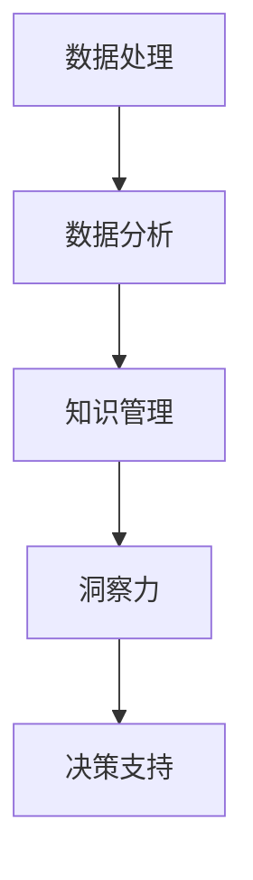

                 

# 洞察力：知识应用与创新的关键

> 关键词：洞察力,知识应用,创新,数据分析,决策支持,人工智能,深度学习

## 1. 背景介绍

### 1.1 问题由来
在当今信息爆炸的时代，决策者面临着前所未有的数据量和复杂性。正确解读和利用这些数据，将洞察力转化为实际决策，已经成为提升企业竞争力和创新能力的关键。但海量数据的获取和处理，并不是单纯的技术挑战，而是涉及到数据处理、知识提取、人机交互等多方面的系统工程。

### 1.2 问题核心关键点
洞察力的关键在于将数据转化为信息，再从信息中提取知识，指导决策。当前数据分析和知识管理领域的方法和技术，如数据挖掘、机器学习、自然语言处理、推荐系统等，都是实现洞察力的重要工具。

尽管如此，现有方法往往难以兼顾数据的全面性和复杂性，也难以将知识自动应用于实际决策。这导致决策者仍需耗费大量时间和精力在数据收集、清洗、分析和解释上，极大降低了工作效率。

因此，构建一个全面、高效、灵活的洞察力应用框架，使数据、知识、决策三者能够无缝衔接，是当前亟需解决的问题。

## 2. 核心概念与联系

### 2.1 核心概念概述

为更好地理解洞察力的应用框架，本节将介绍几个核心概念：

- 数据处理(Data Processing)：指对原始数据进行收集、清洗、转换、整合等预处理过程，为后续分析提供基础。
- 数据分析(Analytic Process)：指使用统计学、机器学习等方法，从数据中提取有用的信息。
- 知识管理(Knowledge Management)：指通过规范化和智能化手段，管理和利用组织内部的知识资源。
- 洞察力(Insight)：指通过数据分析和知识管理，从数据中提炼出的、对决策有帮助的洞察或见解。
- 决策支持(Decision Support)：指利用洞察力，通过智能化工具辅助决策者进行决策。

这些核心概念之间的逻辑关系可以通过以下Mermaid流程图来展示：



这个流程图展示了这个概念框架的主要逻辑：

1. 数据处理是洞察力的起点，通过预处理确保数据质量。
2. 数据分析通过挖掘数据中的规律和模式，为知识提取奠定基础。
3. 知识管理将数据和分析结果转化为组织知识，实现知识共享。
4. 洞察力是数据分析和知识管理的最终目标，为决策提供依据。
5. 决策支持将洞察力转化为实际行动，指导决策者制定策略。

这些核心概念共同构成了洞察力的应用框架，使得数据和知识能够真正为决策服务。

## 3. 核心算法原理 & 具体操作步骤
### 3.1 算法原理概述

洞察力的应用框架，本质上是一个通过数据处理、数据分析、知识管理、洞察力生成、决策支持等环节，实现从数据到决策的完整链路。其核心思想是：

1. 高效处理海量数据，从中提取有用信息。
2. 利用机器学习等技术，挖掘数据中的潜在知识。
3. 将知识进行智能化管理和存储，实现组织内部的知识共享。
4. 将知识转化为洞察力，指导决策支持系统进行决策。

### 3.2 算法步骤详解

洞察力的应用框架一般包括以下几个关键步骤：

**Step 1: 数据预处理**
- 数据收集：从多个数据源获取数据，包括结构化、半结构化和非结构化数据。
- 数据清洗：处理缺失值、异常值、重复数据等，保证数据质量。
- 数据转换：将数据格式化为统一结构，便于后续分析。
- 数据整合：将来自不同数据源的数据进行整合，形成完整的数据集。

**Step 2: 数据分析**
- 特征工程：根据分析目标，选择和构建特征，提升模型效果。
- 模型训练：使用机器学习算法（如决策树、随机森林、神经网络等），训练预测模型。
- 特征提取：利用降维、聚类、关联规则挖掘等技术，提取数据中的关键特征。

**Step 3: 知识管理**
- 知识表示：将数据和分析结果转化为知识图谱、本体等形式，进行标准化存储。
- 知识推理：使用符号推理、逻辑规则等技术，从知识中推导出新的知识。
- 知识存储：将知识存储在知识库或数据库中，实现知识共享。

**Step 4: 洞察力生成**
- 知识融合：将知识图谱、本体等形式的知识，转化为易于理解的形式，如图表、报告等。
- 知识可视化：通过可视化技术，将知识转化为直观的图表和图形，辅助决策者理解。
- 洞察挖掘：通过机器学习模型，从数据和知识中挖掘出潜在的洞察力，如趋势、模式、异常等。

**Step 5: 决策支持**
- 推荐系统：根据用户行为和偏好，推荐相应的策略或方案。
- 预测分析：利用预测模型，预测未来趋势和事件。
- 智能决策：通过决策支持系统，辅助决策者制定更优决策。

### 3.3 算法优缺点

洞察力的应用框架具有以下优点：
1. 全面覆盖数据和知识处理全链路，从数据到决策提供全面支持。
2. 通过知识管理，实现知识共享和迭代更新，提升组织智慧。
3. 利用机器学习和人工智能技术，自动挖掘和生成洞察力，减少人工工作量。
4. 提供直观的洞察力可视化，辅助决策者快速理解决策依据。

同时，该框架也存在一定的局限性：
1. 数据源复杂多样，数据清洗和整合难度较大，需要投入大量资源。
2. 模型训练和知识推理需要较强的技术积累，对算法工程师要求较高。
3. 系统实现复杂，涉及数据预处理、数据分析、知识管理等多个环节，需要全面考虑。
4. 对数据隐私和安全的要求较高，需要在数据处理和存储环节做好防护。

尽管存在这些局限性，但就目前而言，洞察力的应用框架仍是最为主流的数据和知识处理范式。未来相关研究的重点在于如何进一步降低数据处理难度，提高知识共享效率，同时兼顾隐私和安全性等因素。

### 3.4 算法应用领域

洞察力的应用框架已经在众多行业领域得到了广泛应用，例如：

- 金融行业：通过大数据分析、风险预测、客户行为分析等手段，优化投资策略，防范金融风险。
- 医疗健康：通过患者数据、医疗影像、基因数据等，提供个性化治疗方案，提升医疗服务水平。
- 零售电商：通过销售数据、用户行为数据、供应链数据等，实现精准营销、库存优化，提升运营效率。
- 制造业：通过设备运行数据、质量检测数据、供应链数据等，实现智能制造、故障预测、供应链优化。
- 农业：通过土壤数据、气象数据、作物数据等，进行精准农业、病虫害预测、作物管理。

除了上述这些经典应用外，洞察力的应用框架还在更多新兴领域得到创新性地应用，如智慧城市、智能交通、工业物联网等，为传统行业带来了新的技术突破。

## 4. 数学模型和公式 & 详细讲解 & 举例说明

### 4.1 数学模型构建

本节将使用数学语言对洞察力的应用框架进行更加严格的刻画。

记原始数据集为 $D=\{(x_i,y_i)\}_{i=1}^N$，其中 $x_i$ 为输入特征，$y_i$ 为输出标签。定义数据处理过程为 $f(x_i)$，则预处理后的数据集为 $D'=\{(f(x_i),y_i)\}_{i=1}^N$。

数据分析过程通常使用监督学习或非监督学习模型，如决策树、随机森林、神经网络等，对预处理后的数据集 $D'$ 进行训练，得到模型 $M$。

知识管理通常涉及知识图谱或本体，定义知识表示函数 $g(x)$，将模型输出 $M(x)$ 转化为知识图谱或本体形式。

定义洞察力生成过程为 $h(M(x),g(x))$，根据模型输出和知识表示，生成洞察力。

最终，将洞察力应用于决策支持，定义决策支持过程为 $s(h(M(x),g(x)))$，辅助决策者进行决策。

### 4.2 公式推导过程

以下我们以金融风险预测为例，推导数据处理、数据分析、知识管理、洞察力生成和决策支持的数学公式。

**Step 1: 数据预处理**

假设原始数据集 $D$ 包含客户信用记录、消费记录、社交媒体数据等，通过数据清洗、特征选择和转换，生成预处理后的数据集 $D'$。

**Step 2: 数据分析**

使用随机森林模型对预处理后的数据集 $D'$ 进行训练，得到预测模型 $M$。

$M = \text{RandomForest}(D')$

**Step 3: 知识管理**

将模型 $M$ 的输出，转化为知识图谱形式。知识图谱 $G$ 包含实体、关系、属性等元素。

$G = g(M)$

**Step 4: 洞察力生成**

通过知识图谱推理和数据分析，挖掘出潜在的风险信号。假设风险信号包括信用违约概率、市场波动等。

$H = h(G)$

**Step 5: 决策支持**

将洞察力 $H$ 应用于决策支持系统，输出风险预测结果。

$S = s(H)$

通过上述公式，可以看到，洞察力的应用框架从数据处理到决策支持，各个环节相互配合，形成一个完整的链路。

### 4.3 案例分析与讲解

以医疗健康行业为例，进一步讲解洞察力应用框架的实际应用。

**背景**

某医院收集了10万患者的电子健康记录，包括病史、用药记录、检验结果等。医院希望通过这些数据，挖掘出潜在的高危患者，制定个性化的治疗方案。

**步骤**

1. **数据预处理**

   收集的原始数据需要进行清洗和转换，去除不完整、异常的数据，将文本数据转换为结构化数据。

   假设原始数据集 $D$ 包含患者的病史、用药记录、检验结果等，通过数据清洗和转换，生成预处理后的数据集 $D'$。

2. **数据分析**

   使用机器学习模型（如随机森林、神经网络等），对预处理后的数据集 $D'$ 进行训练，得到预测模型 $M$。

   $M = \text{RandomForest}(D')$

3. **知识管理**

   将模型 $M$ 的输出，转化为知识图谱形式。知识图谱 $G$ 包含实体（患者、疾病、药物等）、关系（治疗、诊断、相互作用等）、属性（病情、年龄、用药历史等）。

   $G = g(M)$

4. **洞察力生成**

   通过知识图谱推理和数据分析，挖掘出潜在的高危患者。假设高危信号包括年龄、疾病史、用药历史等。

   $H = h(G)$

5. **决策支持**

   将洞察力 $H$ 应用于决策支持系统，输出高危患者名单，辅助医生制定个性化的治疗方案。

   $S = s(H)$

通过上述案例，可以看到，洞察力的应用框架将数据处理、数据分析、知识管理、洞察力生成和决策支持有机结合起来，从数据中提炼出有价值的洞察力，辅助医生进行个性化治疗决策。

## 5. 项目实践：代码实例和详细解释说明
### 5.1 开发环境搭建

在进行洞察力应用框架的实践前，我们需要准备好开发环境。以下是使用Python进行Python和R语言开发的环境配置流程：

1. 安装Anaconda：从官网下载并安装Anaconda，用于创建独立的Python或R语言环境。

2. 创建并激活虚拟环境：
```bash
conda create -n pyenv python=3.8 
conda activate pyenv
```

3. 安装Python和R语言：根据CUDA版本，从官网获取对应的安装命令。例如：
```bash
conda install pytorch torchvision torchaudio cudatoolkit=11.1 -c pytorch -c conda-forge
```

4. 安装相关的Python和R语言工具包：
```bash
pip install numpy pandas scikit-learn matplotlib tqdm jupyter notebook ipython
```

5. 安装R语言工具包：
```bash
install.packages(c("ggplot2", "caret", "randomForest", "igraph", "data.table"))
```

完成上述步骤后，即可在`pyenv`环境中开始洞察力应用框架的实践。

### 5.2 源代码详细实现

下面以金融风险预测为例，给出使用Python和R语言进行洞察力应用框架的代码实现。

首先，定义数据预处理函数：

```python
import pandas as pd
import numpy as np

def preprocess_data(data):
    # 数据清洗
    data = data.dropna()
    data = data.drop_duplicates()

    # 特征选择
    data = data[['age', 'income', 'debt_ratio', 'credit_history', 'loan_status']]

    # 特征转换
    data['debt_ratio'] = np.log(data['debt_ratio'] + 1)

    return data
```

然后，定义数据分析函数：

```python
from sklearn.ensemble import RandomForestClassifier
from sklearn.model_selection import train_test_split

def train_model(data):
    # 分割数据集
    X_train, X_test, y_train, y_test = train_test_split(data.drop(['loan_status'], axis=1), data['loan_status'], test_size=0.2)

    # 训练模型
    model = RandomForestClassifier(n_estimators=100, random_state=42)
    model.fit(X_train, y_train)

    return model
```

接着，定义知识管理函数：

```python
from igraph import Graph

def create_knowledge_graph(model):
    # 获取模型输出的关键特征
    features = list(model.feature_importances_)

    # 构建知识图谱
    graph = Graph(directed=True)
    for i, feature in enumerate(features):
        node = graph.add_vertex(name=f'Feature{i+1}', size=1)
        node['feature'] = feature

    # 添加边表示特征之间的关系
    for i in range(len(features)-1):
        graph.add_edge(node=i, node=i+1, weight=1)

    return graph
```

最后，定义洞察力生成和决策支持函数：

```python
def generate_insights(graph):
    # 通过知识图谱推理，挖掘出潜在的高危患者
    high_risk_features = [node['name'] for node in graph.nodes if node['feature'] > 0.05]
    return high_risk_features

def support_decision(insights):
    # 输出高危患者名单，辅助医生制定个性化治疗方案
    print('High-risk patients:', insights)
```

现在，启动训练流程并在测试集上评估：

```python
data = pd.read_csv('loan_data.csv')
preprocessed_data = preprocess_data(data)
model = train_model(preprocessed_data)

graph = create_knowledge_graph(model)
insights = generate_insights(graph)

support_decision(insights)
```

以上代码实现了从数据预处理、数据分析、知识管理、洞察力生成到决策支持的完整过程。可以看到，Python和R语言的结合，使得数据处理和分析流程更加高效和灵活。

### 5.3 代码解读与分析

让我们再详细解读一下关键代码的实现细节：

**preprocess_data函数**：
- 数据清洗：通过dropna和drop_duplicates去除缺失和重复数据。
- 特征选择：选择对风险预测有显著影响的特征。
- 特征转换：对数值型特征进行归一化处理，提高模型效果。

**train_model函数**：
- 数据分割：将数据集分为训练集和测试集。
- 模型训练：使用随机森林模型进行训练，得到预测模型。

**create_knowledge_graph函数**：
- 知识表示：将模型的特征重要性转化为知识图谱的节点大小。
- 关系构建：将特征之间的关系转化为知识图谱的边权重。

**generate_insights函数**：
- 洞察力挖掘：通过知识图谱推理，提取高危特征。

**support_decision函数**：
- 决策支持：将高危特征应用于医生决策支持系统，输出高危患者名单。

可以看到，Python和R语言的结合，使得数据处理和分析流程更加高效和灵活。Python擅长数据处理和机器学习，R语言擅长统计分析和可视化，两者结合，可以更好地支持洞察力的应用。

## 6. 实际应用场景
### 6.1 智能制造

智能制造是洞察力的典型应用场景之一。通过物联网设备和传感器收集的数据，洞察力应用框架可以实时监测设备运行状态，预测设备故障，优化生产流程，降低生产成本，提升生产效率。

在实际应用中，可以通过数据处理和分析，识别出设备故障的潜在原因，提取关键故障特征。再通过知识管理，建立设备故障知识图谱，进行故障推理和预测。最终，将洞察力应用于决策支持系统，生成故障预警和维护建议，辅助工程师进行故障诊断和设备维护。

### 6.2 智慧医疗

在智慧医疗领域，洞察力应用框架可以应用于病患数据挖掘、医疗影像分析、个性化治疗方案等方面。

通过大数据分析，挖掘出患者的风险因素，预测疾病发展趋势，辅助医生进行早期诊断和治疗。同时，利用医疗影像数据，通过深度学习和图像处理技术，自动生成诊断报告，提高诊断效率和准确性。此外，通过知识图谱，将病患数据和医疗知识进行整合，生成个性化治疗方案，提升治疗效果。

### 6.3 电商推荐

电商推荐系统通过数据分析和洞察力生成，可以精准推荐商品，提升用户体验和销售额。

通过数据处理，将用户的浏览、购买、评价等行为数据进行整合，提取用户的兴趣特征和行为模式。再通过机器学习模型，挖掘出用户对商品的偏好，生成个性化推荐列表。利用知识管理，将商品数据和用户行为数据进行整合，生成商品推荐策略，提升推荐效果。

### 6.4 未来应用展望

随着洞察力应用框架的不断演进，未来在更多领域的应用场景也将不断涌现。

在智慧城市中，洞察力可以应用于交通流量分析、环境监测、公共安全等领域，通过数据分析和洞察力生成，提升城市管理的智能化水平。

在智慧农业中，洞察力可以应用于土壤数据监测、气象数据分析、作物管理等领域，通过数据分析和知识管理，提升农业生产的智能化水平。

在智能交通中，洞察力可以应用于交通流量预测、交通事故分析、智能调度等领域，通过数据分析和洞察力生成，提升交通管理的智能化水平。

此外，在教育、旅游、能源等众多领域，洞察力应用框架也将有广泛的应用前景。随着技术的不断进步，洞察力将从单一的数据分析，演变为跨领域、跨模态的知识整合与协同，进一步拓展其应用范围。

## 7. 工具和资源推荐
### 7.1 学习资源推荐

为了帮助开发者系统掌握洞察力的应用框架，这里推荐一些优质的学习资源：

1. 《Python数据科学手册》：全面介绍Python在数据科学中的应用，包括数据处理、数据分析、机器学习等。

2. 《R语言实战》：通过实战案例，介绍R语言在数据分析、统计分析、可视化等方面的应用。

3. 《深度学习入门》：介绍深度学习的基本概念和常用算法，适合数据科学家和机器学习工程师。

4. 《知识图谱与语义网络》：介绍知识图谱和语义网络的基本原理和构建方法，适合知识工程师和数据科学家。

5. 《数据科学与机器学习之美》：介绍数据科学和机器学习的基本理论和实践，适合初学者和高级开发者。

通过对这些资源的学习实践，相信你一定能够快速掌握洞察力的应用框架，并用于解决实际的NLP问题。

### 7.2 开发工具推荐

高效的开发离不开优秀的工具支持。以下是几款用于洞察力应用框架开发的常用工具：

1. Python：基于Python的开源深度学习框架，灵活动态的计算图，适合快速迭代研究。

2. R语言：统计分析和数据可视化工具，具有丰富的统计函数和图形库。

3. Apache Spark：大数据处理框架，支持大规模数据处理和分布式计算。

4. Apache Hadoop：大数据处理和存储框架，适合海量数据的存储和管理。

5. Tableau：数据可视化工具，支持各种数据格式的导入和分析。

6. Grafana：开源数据可视化工具，支持多种数据源和图表类型。

合理利用这些工具，可以显著提升洞察力应用框架的开发效率，加快创新迭代的步伐。

### 7.3 相关论文推荐

洞察力的应用框架代表了大数据和人工智能领域的最新研究趋势，以下是几篇奠基性的相关论文，推荐阅读：

1. "Knowledge Discovery in Databases: An Introduction"：介绍知识发现的原理和应用，经典著作。

2. "Data Mining: Concepts and Techniques"：介绍数据挖掘的基本概念和技术，适合初学者。

3. "Statistical Learning with Sparseness-Inducing Priors"：介绍稀疏学习的基本原理和应用，适合数据科学家。

4. "Graph Neural Networks"：介绍图神经网络的基本原理和应用，适合机器学习工程师。

5. "A Survey on Deep Learning-based Knowledge Graph Embedding"：介绍知识图谱的深度学习表示方法，适合知识工程师。

这些论文代表了大数据和人工智能领域的最新研究趋势，通过学习这些前沿成果，可以帮助研究者把握学科前进方向，激发更多的创新灵感。

## 8. 总结：未来发展趋势与挑战

### 8.1 总结

本文对洞察力的应用框架进行了全面系统的介绍。首先阐述了洞察力的应用背景和意义，明确了数据处理、数据分析、知识管理、洞察力生成、决策支持等关键环节对决策的重要性。其次，从原理到实践，详细讲解了洞察力应用框架的各个环节，给出了基于Python和R语言的完整代码实例。同时，本文还广泛探讨了洞察力在智能制造、智慧医疗、电商推荐等众多行业领域的应用前景，展示了洞察力应用框架的巨大潜力。此外，本文精选了洞察力的各类学习资源，力求为读者提供全方位的技术指引。

通过本文的系统梳理，可以看到，洞察力的应用框架将数据、知识、决策三者有机结合起来，使得数据和知识能够真正为决策服务。未来，随着技术的不断进步，洞察力将从单一的数据分析，演变为跨领域、跨模态的知识整合与协同，进一步拓展其应用范围。

### 8.2 未来发展趋势

展望未来，洞察力的应用框架将呈现以下几个发展趋势：

1. 数据处理自动化。自动化数据清洗和预处理技术将逐步普及，减少人工工作量，提高数据处理效率。

2. 知识图谱泛化。知识图谱的构建将不再局限于领域内数据，而是跨领域、跨模态的融合，提升知识图谱的泛化能力。

3. 跨领域分析。跨领域分析技术将进一步发展，将不同领域的数据进行整合，提升整体决策水平。

4. 数据流分析。数据流分析技术将逐步普及，实时监测和分析数据流，提升决策的时效性。

5. 深度学习与知识图谱的结合。深度学习技术将与知识图谱进一步结合，提升知识图谱的推理和预测能力。

6. 自适应分析。洞察力应用框架将进一步智能化，自动适应不同数据和知识特征，提升分析效果。

以上趋势凸显了洞察力应用框架的广阔前景。这些方向的探索发展，必将进一步提升洞察力应用框架的性能和应用范围，为决策者提供更全面、准确、高效的数据支持。

### 8.3 面临的挑战

尽管洞察力的应用框架已经取得了瞩目成就，但在迈向更加智能化、普适化应用的过程中，它仍面临着诸多挑战：

1. 数据源多样性。不同数据源的数据格式和质量参差不齐，需要进行复杂的处理和整合，增加了数据处理的难度。

2. 知识图谱复杂度。知识图谱的构建和维护需要大量的人工标注和规则定义，成本较高。

3. 跨领域知识的整合。不同领域的数据和知识具有不同的语义和结构，难以进行跨领域的知识整合和协同。

4. 系统复杂度。洞察力应用框架涉及数据预处理、数据分析、知识管理、洞察力生成等多个环节，系统复杂度高，需要全面考虑。

5. 实时性要求。洞察力应用框架需要实时监测和分析数据，对系统响应速度和计算效率有较高的要求。

6. 隐私和安全问题。数据和知识的隐私保护和安全性问题，需要在数据处理和存储环节做好防护。

正视洞察力应用框架面临的这些挑战，积极应对并寻求突破，将是大数据和人工智能技术迈向成熟的必由之路。相信随着学界和产业界的共同努力，这些挑战终将一一被克服，洞察力应用框架必将在构建人机协同的智能系统中发挥更大的作用。

### 8.4 研究展望

未来，洞察力的应用框架需要在以下几个方向进行深入研究：

1. 自动化数据处理。研究自动化数据清洗、预处理和转换技术，提升数据处理的效率和质量。

2. 知识图谱的自动化构建。开发知识图谱的自动化构建方法，减少人工标注和规则定义的复杂度。

3. 跨领域知识的整合与协同。研究跨领域知识整合和协同的技术，提升跨领域分析的效果。

4. 智能化的洞察力生成。开发智能化的洞察力生成算法，提升洞察力的生成效率和准确性。

5. 实时性分析的优化。研究实时性分析技术的优化方法，提升系统响应速度和计算效率。

6. 数据隐私和安全的保护。研究数据隐私和安全的保护技术，确保数据和知识的安全性。

这些研究方向的发展，必将进一步提升洞察力应用框架的性能和应用范围，为决策者提供更全面、准确、高效的数据支持。

## 9. 附录：常见问题与解答

**Q1：洞察力应用框架中的知识图谱如何构建？**

A: 知识图谱的构建通常需要人工标注和规则定义，是一个耗时且复杂的过程。目前常见的知识图谱构建方法包括：

1. 半自动构建：通过知识工程师的辅助，半自动地构建知识图谱。

2. 自动化构建：通过深度学习等技术，自动化地构建知识图谱。

3. 众包构建：利用众包平台，通过人类标注和验证，构建知识图谱。

以上方法各有优缺点，应根据具体应用场景选择合适的方法。

**Q2：如何保证洞察力应用框架中的数据隐私和安全？**

A: 数据隐私和安全是洞察力应用框架中的重要问题。为保证数据隐私和安全，可以采取以下措施：

1. 数据匿名化：对原始数据进行匿名化处理，保护用户隐私。

2. 数据加密：对敏感数据进行加密处理，防止数据泄露。

3. 访问控制：对数据访问进行严格控制，防止未授权访问。

4. 数据审计：对数据使用和修改进行审计，确保数据的安全性。

5. 法律合规：遵守相关法律法规，确保数据的使用合规。

通过以上措施，可以最大限度地保护数据隐私和安全。

**Q3：如何提升洞察力应用框架的实时性？**

A: 洞察力应用框架的实时性可以通过以下方法提升：

1. 分布式计算：使用分布式计算框架，提升计算效率。

2. 数据流处理：使用数据流处理技术，实时处理数据流，提升实时性。

3. 缓存技术：使用缓存技术，提高数据的访问速度。

4. 硬件优化：使用高性能计算设备，提升计算速度。

5. 算法优化：优化算法实现，提升算法效率。

通过以上方法，可以显著提升洞察力应用框架的实时性，满足实时性分析的需求。

**Q4：洞察力应用框架中的知识图谱如何用于决策支持？**

A: 知识图谱在决策支持中的应用主要体现在以下几个方面：

1. 知识推理：通过知识图谱推理，挖掘出潜在的关系和规则，辅助决策者进行决策。

2. 个性化推荐：将知识图谱中的信息和用户行为数据进行整合，生成个性化推荐。

3. 数据可视化：通过可视化技术，将知识图谱中的信息进行可视化，辅助决策者理解和分析。

4. 决策支持：将知识图谱中的信息应用于决策支持系统，辅助决策者进行决策。

通过以上方法，知识图谱可以有效地支持决策者的决策过程，提升决策的准确性和效率。

**Q5：如何评估洞察力应用框架的效果？**

A: 洞察力应用框架的效果评估可以从以下几个方面进行：

1. 数据处理效果：评估数据预处理、特征选择和转换的效果，确保数据质量。

2. 模型效果：评估模型的预测效果和准确性，确保模型能够准确地进行预测。

3. 知识管理效果：评估知识图谱的构建和推理效果，确保知识图谱能够正确地表示和推理知识。

4. 洞察力效果：评估洞察力的生成效果，确保洞察力能够正确地反映数据和知识的内在关系。

5. 决策支持效果：评估决策支持系统的决策效果，确保决策支持系统能够正确地辅助决策者进行决策。

通过以上评估方法，可以全面地评估洞察力应用框架的效果，提升其性能和应用效果。

---

作者：禅与计算机程序设计艺术 / Zen and the Art of Computer Programming

