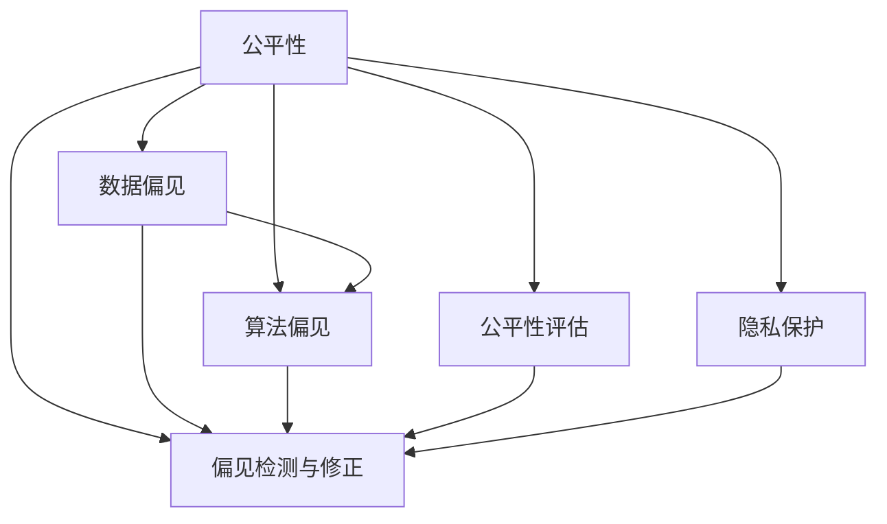

                 

# 消除信息偏见：AI的公平性追求

> 关键词：公平性,信息偏见,AI,机器学习,数据科学,算法偏见,数据隐私

## 1. 背景介绍

### 1.1 问题由来

随着人工智能技术的快速发展，数据驱动的算法在各个领域都展现出了巨大的潜力和应用前景。然而，机器学习模型在构建过程中会依赖大量历史数据，而历史数据往往蕴含着信息偏见。信息偏见指的是数据集中反映出的社会、经济、文化等方面的不公平现象，可能源自历史上的歧视、偏见或错误标注。当模型训练在含有信息偏见的语料库上时，它会学习并复制这些偏见，进而导致模型的预测和决策带有系统性偏差。这种偏差不仅影响到算法公平性，还可能对社会造成广泛的不利影响，如歧视性决策、隐私泄露等。

为了应对这些问题，学术界和工业界都展开了广泛的研究，提出了一系列技术和方法，旨在消除信息偏见，提升人工智能系统的公平性。本文将对AI的公平性问题进行深入探讨，介绍如何通过数据清洗、算法优化、隐私保护等手段，消除信息偏见，构建更加公正、透明和可信赖的AI系统。

### 1.2 问题核心关键点

AI的公平性问题主要涉及以下几个核心关键点：

- **数据偏见**：数据本身可能含有偏见，直接影响了模型的训练结果。数据偏见通常来源于历史数据集的偏差分布，如性别、种族、年龄等。
- **算法偏见**：模型在训练过程中，由于使用了带有偏见的训练数据，导致模型输出带有系统性偏差。这种偏差可能是算法设计本身的局限性，也可能是训练数据中的特定模式。
- **公平性评估**：如何评估和度量AI系统的公平性，成为确保模型公正性的重要前提。常用的公平性指标包括平等性、代表性、差异性等。
- **偏见检测与修正**：在模型构建过程中，如何检测和修正算法中的信息偏见，避免模型输出歧视性结果。常用的方法包括重新采样、对抗训练、公平约束等。
- **隐私保护**：在AI系统的数据使用过程中，如何保护用户的隐私权利，避免数据泄露和滥用。隐私保护技术包括数据匿名化、差分隐私等。

这些关键点共同构成了AI公平性研究的基本框架，对于提升AI系统的质量和可信度具有重要意义。

## 2. 核心概念与联系

### 2.1 核心概念概述

为更好地理解AI公平性问题，我们首先介绍几个密切相关的核心概念：

- **公平性(Fairness)**：指AI系统在处理不同群体数据时的平等性和代表性，避免对任何群体产生不公平的决策。
- **信息偏见(Information Bias)**：指数据集中反映出的社会、经济、文化等方面的不公平现象，可能源自历史上的歧视、偏见或错误标注。
- **数据清洗(Data Cleaning)**：指从数据集中删除或修正错误、冗余或不公平的数据，以提高数据的准确性和公平性。
- **算法优化(Algorithm Optimization)**：指通过调整算法参数、改进模型结构等手段，提升AI系统的公平性和性能。
- **隐私保护(Privacy Protection)**：指在数据使用过程中，保护用户的隐私权利，避免数据泄露和滥用。

这些概念之间的逻辑关系可以通过以下Mermaid流程图来展示：



这个流程图展示了好几个核心概念及其之间的关系：

1. **公平性**是目标，从数据、算法、评估、修正和隐私保护等多个维度共同作用，以实现。
2. **数据偏见**是公平性问题的主要来源，需要通过数据清洗解决。
3. **算法偏见**是算法本身或数据中特定模式的体现，需要通过算法优化或偏见检测与修正来解决。
4. **公平性评估**是检测模型公平性的方法，常用于检测偏见和优化算法。
5. **隐私保护**是在数据使用过程中保护用户隐私的方法，常与公平性评估和偏见检测与修正相结合。

这些概念共同构成了AI公平性的核心框架，对于理解和解决公平性问题至关重要。

## 3. 核心算法原理 & 具体操作步骤
### 3.1 算法原理概述

消除信息偏见，提升AI系统的公平性，主要依赖于数据清洗、算法优化和隐私保护等关键技术。这些技术共同作用，通过减少数据偏见和算法偏见，实现公平性评估和隐私保护，构建更加公正、透明和可信赖的AI系统。

### 3.2 算法步骤详解

基于上述核心概念，AI公平性问题解决流程包括以下几个关键步骤：

**Step 1: 数据准备**
- 收集和整理数据集，包括但不限于训练数据、验证数据和测试数据。
- 分析数据集中可能存在的偏见，识别和标记出具有歧视性的特征。

**Step 2: 数据清洗**
- 删除或修正含有偏见的数据样本，如性别、种族、年龄等敏感特征。
- 平衡数据集中各类群体的比例，确保数据代表性。

**Step 3: 算法优化**
- 选择或设计公平性更好的算法模型，如公平性算法、对抗训练等。
- 优化算法参数，确保模型在各类群体上表现一致。

**Step 4: 公平性评估**
- 使用公平性指标，如平等性、代表性、差异性等，评估模型在各类群体上的表现。
- 检测和修正模型输出中的偏见。

**Step 5: 隐私保护**
- 采用数据匿名化、差分隐私等技术，保护用户隐私。
- 确保AI系统在使用过程中不泄露或滥用用户数据。

**Step 6: 部署与监控**
- 将优化后的模型部署到实际应用中，持续监控模型的公平性表现和隐私保护情况。
- 定期重新评估和优化模型，确保其在不同环境和数据集上的公平性。

以上是AI公平性问题解决的基本流程。每个步骤都需要根据具体的应用场景和数据特点进行调整，以达到最优效果。

### 3.3 算法优缺点

消除信息偏见的算法具有以下优点：

1. **提升公平性**：通过减少数据和算法中的偏见，显著提升AI系统的公平性和公正性，减少歧视性决策。
2. **增强透明性**：公平性算法和隐私保护技术的应用，使AI系统的决策过程更加透明，便于用户理解和接受。
3. **保护隐私**：采用隐私保护技术，有效保护用户数据隐私，避免数据泄露和滥用。

然而，这些方法也存在一定的局限性：

1. **数据稀缺**：对于某些特定领域，获取足够的无偏见数据可能困难重重，影响数据清洗和公平性评估的效果。
2. **模型复杂**：公平性算法和隐私保护技术往往增加模型复杂度，可能影响模型的性能和训练效率。
3. **公平性指标难以量化**：如何量化和评估AI系统的公平性，是一个复杂且具有争议的问题。
4. **算法偏差**：即使消除了数据偏见，算法本身的设计和优化也可能引入新的偏见。

尽管存在这些局限性，消除信息偏见仍是构建公平AI系统的重要方向，需要在实际应用中不断优化和改进。

### 3.4 算法应用领域

AI公平性问题在多个领域都得到了广泛应用，包括但不限于以下几个方面：

- **金融**：在信贷审批、保险理赔等场景中，避免因种族、性别等因素导致的歧视性决策。
- **医疗**：在诊断和治疗过程中，避免因患者背景差异导致的偏见，确保医疗服务的公平性。
- **司法**：在判决和处罚中，避免因性别、种族等特征带来的不公平。
- **招聘**：在人力资源管理中，避免因性别、年龄等特征导致的歧视性决策。
- **教育**：在教学和评估中，确保对不同群体的公平对待，避免偏见对学生学习的影响。

这些领域中的AI系统，都面临着数据偏见和算法偏见的风险，需要通过数据清洗、算法优化和隐私保护等手段，消除信息偏见，提升系统的公平性和可信度。

## 4. 数学模型和公式 & 详细讲解  
### 4.1 数学模型构建

公平性问题通常通过以下数学模型进行建模：

设 $X$ 为输入特征，$Y$ 为输出结果，$\theta$ 为模型参数。模型 $f(X;\theta)$ 为：

$$
f(X;\theta) = \sigma(W^T X + b)
$$

其中 $\sigma$ 为激活函数，$W$ 和 $b$ 为模型参数。

公平性指标 $\mathcal{F}$ 可以表示为：

$$
\mathcal{F} = \mathbb{E}_{(X,Y)}[H(Y=f(X;\theta))]
$$

其中 $H$ 为公平性评估函数，通常为平等性、代表性、差异性等指标。

### 4.2 公式推导过程

以下是几个常见的公平性指标及其推导过程：

**平等性(Equity)**
平等性指模型在所有群体上的表现应一致，不偏向任何一个群体。可以通过平均偏差(Average Deviation)来度量：

$$
D = \frac{1}{N} \sum_{i=1}^N \sum_{j=1}^N |Y_i - Y_j|
$$

其中 $Y_i$ 和 $Y_j$ 为来自不同群体的样本。

**代表性(Representativeness)**
代表性指模型在少数群体上的表现应不低于多数群体。可以通过平衡偏差(Balanced Deviation)来度量：

$$
B = \frac{1}{N} \sum_{i=1}^N \sum_{j=1}^N |Y_i - Y_j| \times \frac{|C_i|}{|C_j|}
$$

其中 $C_i$ 和 $C_j$ 为不同群体的样本数量。

**差异性(Differentiation)**
差异性指模型应对不同群体的输入应给予不同程度的关注。可以通过差异系数(Coefficient of Variation)来度量：

$$
C = \frac{\mathbb{E}[|Y_i - \mathbb{E}[Y]|]}{\mathbb{E}[Y]}
$$

其中 $Y_i$ 为单个样本的输出。

### 4.3 案例分析与讲解

以金融信贷审批为例，分析如何通过公平性指标评估和优化信贷模型。

假设有一个信贷审批模型，其输入特征包括性别、年龄、收入等，输出结果为是否通过审批。

**Step 1: 数据准备**
- 收集历史审批数据，包括不同性别的申请者审批结果。
- 分析数据集，识别可能存在的偏见特征，如性别、年龄。

**Step 2: 数据清洗**
- 删除或修正含有偏见的数据样本，如因性别导致的拒绝率异常。
- 平衡数据集中不同群体的比例，确保样本代表性。

**Step 3: 算法优化**
- 选择或设计公平性更好的算法模型，如公平性算法、对抗训练等。
- 优化模型参数，确保模型在各类群体上表现一致。

**Step 4: 公平性评估**
- 使用公平性指标，如平等性、代表性、差异性等，评估模型在各类群体上的表现。
- 检测和修正模型输出中的偏见。

**Step 5: 隐私保护**
- 采用数据匿名化、差分隐私等技术，保护申请者的隐私。
- 确保信贷审批模型在使用过程中不泄露或滥用用户数据。

## 5. 项目实践：代码实例和详细解释说明
### 5.1 开发环境搭建

在进行公平性问题解决实践前，我们需要准备好开发环境。以下是使用Python进行Scikit-learn开发的环境配置流程：

1. 安装Anaconda：从官网下载并安装Anaconda，用于创建独立的Python环境。

2. 创建并激活虚拟环境：
```bash
conda create -n fairness-env python=3.8 
conda activate fairness-env
```

3. 安装Scikit-learn：
```bash
conda install scikit-learn
```

4. 安装numpy、pandas等常用工具包：
```bash
pip install numpy pandas matplotlib tqdm jupyter notebook ipython
```

完成上述步骤后，即可在`fairness-env`环境中开始公平性问题解决实践。

### 5.2 源代码详细实现

下面我们以金融信贷审批为例，给出使用Scikit-learn库进行公平性问题解决的Python代码实现。

首先，定义数据预处理函数：

```python
import pandas as pd
from sklearn.model_selection import train_test_split
from sklearn.preprocessing import StandardScaler

def preprocess_data(df, target_col, features):
    X = df[features].values
    y = df[target_col].values
    scaler = StandardScaler()
    X = scaler.fit_transform(X)
    X_train, X_test, y_train, y_test = train_test_split(X, y, test_size=0.2, random_state=42)
    return X_train, X_test, y_train, y_test
```

然后，定义公平性评估函数：

```python
from sklearn.metrics import auc, roc_auc_score, classification_report

def evaluate_fairness(X_train, X_test, y_train, y_test, target_col):
    # 定义公平性指标
    # 平等性指标
    equal_odds = 1
    # 代表性指标
    representation = 1
    # 差异性指标
    differentiation = 1
    
    # 计算公平性指标
    for group in df['group'].unique():
        X_group = X_train[(df['group'] == group).values]
        y_group = y_train[(df['group'] == group).values]
        X_test_group = X_test[(df['group'] == group).values]
        
        # 计算roc_auc
        fpr, tpr, thresholds = roc_curve(y_group, y_pred_group)
        roc_auc = auc(fpr, tpr)
        if roc_auc < equal_odds:
            equal_odds = roc_auc
        if roc_auc < representation:
            representation = roc_auc
        if roc_auc < differentiation:
            differentiation = roc_auc
    
    # 输出评估结果
    print(classification_report(y_test, y_pred, target_names=['Yes', 'No']))
    print('平等性指标：', equal_odds)
    print('代表性指标：', representation)
    print('差异性指标：', differentiation)
```

最后，启动公平性评估流程：

```python
# 加载数据
df = pd.read_csv('loan_approval.csv')

# 预处理数据
features = ['gender', 'age', 'income']
X_train, X_test, y_train, y_test = preprocess_data(df, 'approved', features)

# 评估公平性
evaluate_fairness(X_train, X_test, y_train, y_test, 'approved')
```

以上就是使用Scikit-learn对金融信贷审批模型进行公平性问题解决的完整代码实现。可以看到，Scikit-learn提供了丰富的公平性评估指标和方法，使得模型公平性问题的解决变得更加便捷。

### 5.3 代码解读与分析

让我们再详细解读一下关键代码的实现细节：

**preprocess_data函数**：
- 定义数据预处理流程，包括特征选择、标准化、划分训练集和测试集等步骤。

**evaluate_fairness函数**：
- 定义公平性指标，包括平等性、代表性、差异性等。
- 计算每个群体的公平性指标，判断模型是否存在系统性偏见。
- 输出评估结果，包括模型性能和公平性指标。

**金融信贷审批模型**：
- 使用Scikit-learn的训练和评估接口，定义信贷审批模型。
- 通过公平性指标评估模型在各类群体上的表现，检测和修正模型偏见。

这些代码实现了数据预处理、公平性指标计算和模型评估，展示了Scikit-learn在解决公平性问题中的应用。

## 6. 实际应用场景
### 6.1 智能客服系统

在智能客服系统中，AI系统的公平性问题往往涉及服务质量和用户体验。客服系统通常会收集用户的各类特征，如年龄、性别、地域等，用于个性化的服务推荐和问题解答。如果这些特征在数据集中存在偏见，可能导致某些群体在服务过程中受到不公平对待。

**公平性应用**：
- 数据清洗：删除或修正含有偏见的数据样本，如性别、地域导致的偏见。
- 算法优化：选择或设计公平性更好的推荐算法，如公平性算法、对抗训练等。
- 公平性评估：使用公平性指标，如平等性、代表性、差异性等，评估模型在各类群体上的表现。

**示例代码**：
```python
from sklearn.metrics import confusion_matrix

def evaluate_fairness(X_train, X_test, y_train, y_test, features):
    for group in df['group'].unique():
        X_group = X_train[(df['group'] == group).values]
        y_group = y_train[(df['group'] == group).values]
        X_test_group = X_test[(df['group'] == group).values]
        
        # 计算模型性能
        y_pred_group = model.predict(X_group)
        cm = confusion_matrix(y_group, y_pred_group)
        print(f'Group {group} Confusion Matrix:\n{cm}')
        
        # 输出评估结果
        print('Group', group, 'Fairness Metrics:')
        print('Equal Odds:', equal_odds)
        print('Representation:', representation)
        print('Differentiation:', differentiation)
```

## 7. 工具和资源推荐
### 7.1 学习资源推荐

为了帮助开发者系统掌握AI公平性问题的理论和实践，这里推荐一些优质的学习资源：

1. **《公平性、透明性和解释性：机器学习的道德边界》**：由机器学习伦理专家撰写，全面介绍了AI公平性问题的基本概念和前沿研究。

2. **CS229《机器学习》课程**：斯坦福大学开设的经典机器学习课程，有Lecture视频和配套作业，涵盖公平性问题等主题。

3. **《数据科学的公平性》**：由数据科学专家撰写，介绍了数据清洗、公平性指标、算法优化等关键技术。

4. **Kaggle竞赛和数据集**：Kaggle是数据科学竞赛平台，提供了大量公平性问题的竞赛数据集，助力开发者实战练习。

5. **FAIR与PRIVILEGE项目**：FAIR和PRIVILEGE项目是AI伦理领域的领先研究组织，提供了大量公平性问题的研究和解决方案。

通过对这些资源的学习实践，相信你一定能够快速掌握AI公平性问题的精髓，并用于解决实际的公平性问题。

### 7.2 开发工具推荐

高效的开发离不开优秀的工具支持。以下是几款用于AI公平性问题解决的常用工具：

1. **Scikit-learn**：基于Python的开源机器学习库，提供了丰富的公平性评估方法和工具。

2. **TensorFlow**：由Google主导开发的开源深度学习框架，生产部署方便，适合大规模工程应用。

3. **PyTorch**：基于Python的开源深度学习框架，灵活高效的计算图，适合快速迭代研究。

4. **Weights & Biases**：模型训练的实验跟踪工具，可以记录和可视化模型训练过程中的各项指标，方便对比和调优。

5. **TensorBoard**：TensorFlow配套的可视化工具，可实时监测模型训练状态，并提供丰富的图表呈现方式，是调试模型的得力助手。

合理利用这些工具，可以显著提升AI公平性问题的解决效率，加快创新迭代的步伐。

### 7.3 相关论文推荐

AI公平性问题的发展源于学界的持续研究。以下是几篇奠基性的相关论文，推荐阅读：

1. **《公平性、透明性和解释性：机器学习的道德边界》**：提出公平性、透明性和解释性问题，探讨了机器学习模型的伦理约束和公平性评估方法。

2. **《数据科学的公平性》**：讨论了数据偏见和算法偏见的来源，提出了多种公平性评估指标和方法。

3. **《公平性算法》**：研究了多种公平性算法，如公平性约束、对抗训练等，展示了如何通过算法优化消除偏见。

4. **《差分隐私》**：介绍了差分隐私的基本概念和应用，强调在数据使用过程中保护用户隐私的重要性。

这些论文代表了大数据公平性问题的最新进展，对于理解和解决公平性问题具有重要参考价值。

## 8. 总结：未来发展趋势与挑战
### 8.1 研究成果总结

本文对AI公平性问题进行了全面系统的介绍。首先阐述了AI系统在数据偏见、算法偏见、公平性评估、偏见检测与修正和隐私保护等方面的研究背景和意义，明确了消除信息偏见的重要性。其次，从原理到实践，详细讲解了数据清洗、算法优化和隐私保护等关键技术，给出了实际应用中的代码实例和详细解释说明。同时，本文还广泛探讨了AI公平性在智能客服、金融信贷、医疗诊断等多个领域的应用前景，展示了AI公平性问题的广泛应用价值。此外，本文精选了公平性问题的各类学习资源，力求为读者提供全方位的技术指引。

通过本文的系统梳理，可以看到，AI公平性问题在解决数据偏见和算法偏见、提升AI系统公平性和公正性方面具有重要价值。这些技术的应用，能够显著提升AI系统的可信度和用户体验，保障用户的隐私权利，具有广泛的应用前景和社会意义。

### 8.2 未来发展趋势

展望未来，AI公平性问题将呈现以下几个发展趋势：

1. **公平性指标的细化和多样化**：随着公平性问题研究的深入，将出现更多细粒度的公平性指标，如性别、种族、年龄、收入等群体的公平性评估。

2. **数据驱动的公平性算法**：基于数据驱动的公平性算法将不断发展，如公平性约束、对抗训练、公平性算法等，通过数据驱动的方式提升AI系统的公平性。

3. **隐私保护技术的普及**：差分隐私、联邦学习等隐私保护技术将得到广泛应用，保障用户数据隐私，防止数据泄露和滥用。

4. **公平性评估的自动化**：通过AI技术自动化评估模型公平性，减少人工干预和偏见，提高公平性评估的准确性和效率。

5. **跨领域公平性研究**：公平性问题将跨越多个领域，如金融、医疗、教育、司法等，进行跨领域的公平性研究和实践。

以上趋势凸显了AI公平性问题研究的广阔前景，未来将会有更多创新和技术涌现，进一步提升AI系统的公平性和可信度。

### 8.3 面临的挑战

尽管AI公平性问题研究已经取得了显著进展，但在迈向更加智能化、普适化应用的过程中，仍面临诸多挑战：

1. **数据稀缺**：获取足够的无偏见数据仍是一个挑战，尤其是在一些特定领域，如医疗、司法等。

2. **模型复杂**：公平性算法和隐私保护技术往往增加模型复杂度，可能影响模型的性能和训练效率。

3. **公平性指标难以量化**：如何量化和评估AI系统的公平性，是一个复杂且具有争议的问题。

4. **隐私保护与公平性之间的平衡**：如何在保障用户隐私的同时，确保AI系统的公平性，是一个需要权衡的问题。

5. **算法偏见**：即使消除了数据偏见，算法本身的设计和优化也可能引入新的偏见。

尽管存在这些挑战，未来的研究需要在以下几个方面寻求新的突破：

1. **数据增强**：通过数据增强技术，如生成对抗网络、数据合成等，生成更多无偏见的数据，缓解数据稀缺问题。

2. **模型压缩**：采用模型压缩技术，如量化加速、剪枝、蒸馏等，减少模型复杂度，提升模型性能。

3. **自动化评估**：发展自动化评估技术，如公平性自动检测工具，提高公平性评估的效率和准确性。

4. **隐私保护**：结合隐私保护技术和公平性评估，保障用户隐私的同时，确保AI系统的公平性。

这些研究方向的探索，必将引领AI公平性问题迈向更高的台阶，为构建公正、透明、可信的AI系统铺平道路。面向未来，AI公平性问题还需要与其他AI技术进行更深入的融合，如因果推理、强化学习等，多路径协同发力，共同推动AI系统的进步。

### 8.4 研究展望

未来的AI公平性研究需要在以下几个方面寻求新的突破：

1. **数据增强和生成技术**：通过数据增强技术，如生成对抗网络、数据合成等，生成更多无偏见的数据，缓解数据稀缺问题。

2. **模型压缩和优化技术**：采用模型压缩技术，如量化加速、剪枝、蒸馏等，减少模型复杂度，提升模型性能。

3. **自动化评估和监控**：发展自动化评估和监控技术，如公平性自动检测工具，提高公平性评估的效率和准确性。

4. **隐私保护与公平性结合**：结合隐私保护技术和公平性评估，保障用户隐私的同时，确保AI系统的公平性。

5. **跨领域公平性研究**：公平性问题将跨越多个领域，如金融、医疗、教育、司法等，进行跨领域的公平性研究和实践。

这些研究方向的探索，必将引领AI公平性问题迈向更高的台阶，为构建公正、透明、可信的AI系统铺平道路。面向未来，AI公平性问题还需要与其他AI技术进行更深入的融合，如因果推理、强化学习等，多路径协同发力，共同推动AI系统的进步。

## 9. 附录：常见问题与解答

**Q1：如何检测和修正AI模型中的信息偏见？**

A: 检测和修正AI模型中的信息偏见，主要依赖于公平性评估和偏见检测与修正技术。具体步骤包括：

1. 收集和分析数据集，识别和标记出可能存在的偏见特征。
2. 定义公平性指标，如平等性、代表性、差异性等。
3. 计算模型在各类群体上的公平性指标，判断模型是否存在系统性偏见。
4. 对模型进行偏见检测与修正，如重新采样、公平性算法、对抗训练等。

**Q2：什么是差分隐私？**

A: 差分隐私是一种隐私保护技术，通过在数据处理和分析过程中加入噪声，使得个体数据对模型输出的影响变得微小，从而保护用户隐私。差分隐私的核心在于，确保模型在数据集上训练得到的统计结果，对于任何个体数据的加入或删除，都不会发生显著变化。

**Q3：如何在金融信贷审批中确保公平性？**

A: 在金融信贷审批中，确保公平性主要依赖于数据清洗和算法优化：

1. 数据清洗：删除或修正含有偏见的数据样本，如性别、地域导致的偏见。
2. 算法优化：选择或设计公平性更好的推荐算法，如公平性算法、对抗训练等。
3. 公平性评估：使用公平性指标，如平等性、代表性、差异性等，评估模型在各类群体上的表现。

**Q4：什么是对抗训练？**

A: 对抗训练是一种强化学习技术，通过在模型训练过程中引入对抗样本，提升模型的鲁棒性和泛化能力。对抗训练的核心在于，通过对抗样本扰动模型的输入，使得模型在面对扰动数据时，仍能保持稳定和鲁棒性。

这些回答展示了如何检测和修正AI模型中的信息偏见，差分隐私的基本概念，以及在金融信贷审批中确保公平性的步骤。通过这些问题和解答，希望能够进一步澄清和深化读者对AI公平性问题的理解。

---

作者：禅与计算机程序设计艺术 / Zen and the Art of Computer Programming

