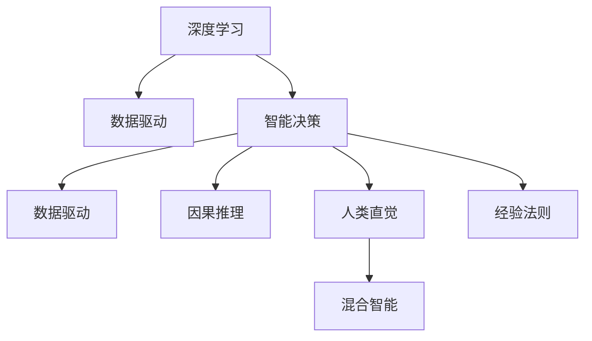

                 

# 深度学习与人类直觉：智能决策的双重引擎

> 关键词：深度学习,人类直觉,智能决策,数据驱动,因果推理,经验法则,混合智能

## 1. 背景介绍

### 1.1 问题由来

深度学习作为人工智能领域的核心技术，在图像识别、语音识别、自然语言处理等诸多领域取得了突破性进展。然而，当我们深入思考其内在机制和应用场景时，会发现在许多任务上，人类直觉仍然扮演着至关重要的角色。这促使我们思考：如何将深度学习与人类的直觉融合，构建更加智能的决策引擎？

### 1.2 问题核心关键点

如何在大数据、深度学习的背景下，充分挖掘和利用人类的经验法则、直觉判断，使其成为机器决策的有益补充，是本问题的核心关键点。人类直觉不仅包含跨领域知识、常识推理，更具有强适应性和可解释性，能够处理小样本、少标签甚至无标签数据，这是机器学习难以匹敌的。

### 1.3 问题研究意义

结合人类直觉与深度学习的智能决策，能够提升机器决策的质量和可靠性，尤其在高风险、高不确定性领域，如医疗诊断、金融风控、法律判决等，可以显著减少误判和偏差，增强决策的可解释性和透明性。这不仅有助于提升机器系统的智能水平，更对社会公平、安全、可控具有重要意义。

## 2. 核心概念与联系

### 2.1 核心概念概述

本节将介绍几个密切相关的核心概念：

- 深度学习(Deep Learning)：基于神经网络的机器学习技术，能够从大量数据中学习到复杂的模式和结构，适用于各种复杂任务。
- 人类直觉(Human Intuition)：人类基于经验、常识、逻辑推理等非正式知识进行的快速、准确的判断和决策。
- 智能决策(Intelligent Decision Making)：结合人类直觉和机器学习的系统，在面对复杂、不确定的任务时，能够做出高质、高效、可解释的决策。
- 数据驱动(Data-Driven)：利用数据训练模型，通过大量样本学习规律，从而进行预测或决策。
- 因果推理(Causal Inference)：研究变量间因果关系的统计推断方法，帮助识别变量间的依赖关系。
- 经验法则(Heguristics)：基于经验的简化决策规则，如“孟买地铁至少有两条线相交”。
- 混合智能(Hybrid Intelligence)：结合人类智能和人工智能的系统，取长补短，形成更高效、更可靠的决策引擎。

这些概念之间的逻辑关系可以通过以下Mermaid流程图来展示：



这个流程图展示了大语言模型的核心概念及其之间的关系：

1. 深度学习通过数据驱动的方式进行训练，学习数据的规律和模式。
2. 智能决策通过融合深度学习和人类直觉，结合因果推理、经验法则，形成高效、可靠的决策系统。
3. 混合智能是深度学习和人类直觉结合的最高形态，是未来智能系统的目标。

## 3. 核心算法原理 & 具体操作步骤
### 3.1 算法原理概述

基于深度学习的智能决策系统，本质上是一种将人类直觉和数据驱动结合的决策框架。其核心思想是：将人类专家的经验法则和直觉判断编码为模型的约束和输入，与深度学习模型共同构建决策引擎。在面对复杂、不确定的任务时，系统能够综合利用深度学习获取的数据规律和人类直觉的判断逻辑，做出高质、高效的决策。

形式化地，假设决策系统由两部分组成：

- 深度学习部分：$D$，用于从大量数据中学习模式和结构。
- 人类直觉部分：$H$，用于提供专家知识、经验法则、常识推理等。

智能决策系统的输出为决策结果$O$，则系统的总体目标函数为：

$$
O = f(D, H)
$$

其中，$f$为决策函数，整合了深度学习和人类直觉的信息。

### 3.2 算法步骤详解

基于深度学习和人类直觉的智能决策系统构建，一般包括以下几个关键步骤：

**Step 1: 构建深度学习模型**
- 选择合适的深度学习架构，如卷积神经网络(CNN)、循环神经网络(RNN)、Transformer等。
- 使用大量标注数据进行模型训练，学习数据的特征和模式。
- 通过正则化、dropout等技术防止过拟合。

**Step 2: 提取人类直觉信息**
- 将人类专家的经验法则、常识推理、领域知识等编码为规则或约束。
- 设计输入格式，使深度学习模型能够接受这些信息。
- 引入因果推理机制，确保人类直觉与数据驱动的深度学习模型之间的因果关系。

**Step 3: 决策函数设计**
- 设计决策函数$f$，将深度学习输出与人类直觉信息整合。
- 引入专家知识、经验法则、常识推理等，进行结果修正和优化。
- 设计可解释的决策过程，方便人类理解决策逻辑。

**Step 4: 测试和优化**
- 使用实际数据对系统进行测试，评估其决策效果和可解释性。
- 根据测试结果进行调整和优化，不断提升系统的决策性能。
- 应用多轮迭代，持续改进系统的智能水平和鲁棒性。

**Step 5: 部署与维护**
- 将系统部署到实际应用场景，进行实时决策。
- 定期更新数据和模型，保持系统的适应性和可靠性。
- 设置监控告警，及时发现和修复系统问题，确保系统稳定运行。

以上是基于深度学习和人类直觉的智能决策系统的构建步骤。在实际应用中，还需要根据具体任务特点，对各步骤进行优化设计，如选择合适的因果推理模型、设计更高效的数据编码方式、引入领域专家的实时反馈等，以进一步提升系统的性能。

### 3.3 算法优缺点

基于深度学习和人类直觉的智能决策系统具有以下优点：
1. 融合深度学习的数据驱动优势和人类直觉的经验法则，能够处理复杂、不确定任务，提升决策准确性。
2. 人类直觉的强适应性和可解释性，有助于构建更透明、可信的决策系统。
3. 结合因果推理机制，能够提高系统的鲁棒性和泛化能力。
4. 跨领域知识的融合，拓宽了系统的应用范围，提高了系统的普适性。

同时，该方法也存在一定的局限性：
1. 需要大量标注数据和领域专家的参与，成本较高。
2. 人类直觉的信息编码和融合过程较为复杂，可能引入一定的误差。
3. 系统的可解释性仍然存在挑战，需要设计更为透明、易懂的决策过程。
4. 系统优化和调整可能需要较高的技术门槛，对开发者要求较高。

尽管存在这些局限性，但就目前而言，深度学习和人类直觉的结合方法仍是大数据环境下智能决策的重要范式。未来相关研究的重点在于如何进一步降低系统的成本，提高系统的可解释性和鲁棒性，同时兼顾数据驱动和人类直觉的融合效率。

### 3.4 算法应用领域

基于深度学习和人类直觉的智能决策系统，已经在多个领域得到了广泛应用，如医疗诊断、金融风控、智能制造、司法判决等。以下是几个典型的应用场景：

- 医疗诊断：结合医生的经验和深度学习模型，通过分析医疗影像、病理数据等，提升诊断的准确性和效率。
- 金融风控：利用金融专家的风险评估规则和深度学习模型，进行信用评分、风险预测，降低金融风险。
- 智能制造：通过生产专家的操作规则和深度学习模型，优化生产流程，提高生产效率和质量。
- 司法判决：结合律师的判案经验和深度学习模型，进行案件分析，提升判决的公正性和效率。

这些应用场景展示了深度学习和人类直觉结合的巨大潜力，为各领域带来了新的智能决策方案。随着技术的不断进步，这种融合范式将在更多领域得到应用，推动人工智能技术的广泛落地。

## 4. 数学模型和公式 & 详细讲解
### 4.1 数学模型构建

本节将使用数学语言对基于深度学习和人类直觉的智能决策系统进行严格刻画。

记决策系统为$f$，其中深度学习部分为$D$，人类直觉部分为$H$。假设决策任务为$T$，决策输入为$X$，决策结果为$O$。

定义深度学习模型$D$的输出为$\hat{Y}$，人类直觉信息$H$的输出为$Y$。则决策函数的总体输出为：

$$
O = f(\hat{Y}, Y)
$$

其中，$f$为决策函数，可以根据具体任务设计不同的形式，如：

- 线性回归任务：$O = \alpha \hat{Y} + \beta Y$
- 分类任务：$O = \text{softmax}(\hat{Y} + \log(Y))$

### 4.2 公式推导过程

以下我们以分类任务为例，推导深度学习和人类直觉结合的决策函数。

假设深度学习模型$D$在输入$X$上的输出为$\hat{Y}$，人类直觉模型$H$在输入$X$上的输出为$Y$。则决策函数的输出为：

$$
O = \text{softmax}(\hat{Y} + \log(Y))
$$

其中，$\text{softmax}$函数用于将输出转化为概率分布，使得$O$的每个元素均大于0且和小于1。

在得到决策函数的输出后，我们可以通过测试数据集$D'$评估系统的性能：

$$
\mathcal{L}(D', f) = \frac{1}{N}\sum_{i=1}^N \ell(f(\hat{Y}_i, Y_i), y_i')
$$

其中，$\ell$为损失函数，$\ell$可以是交叉熵损失、均方误差等。$y_i'$为测试集$D'$的真实标签。

### 4.3 案例分析与讲解

**案例1: 医疗诊断系统**
- 深度学习模型：ResNet-50，用于分析CT影像数据，学习病理特征。
- 人类直觉信息：医生对常见病理的诊断规则。
- 决策函数：将深度学习输出和医生规则结合，进行综合诊断。
- 损失函数：交叉熵损失，评估诊断结果与真实标签的一致性。

**案例2: 金融风控系统**
- 深度学习模型：LightGBM，用于分析贷款申请数据，学习信用评分模型。
- 人类直觉信息：金融专家风险评估规则，如“收入与负债比例不能超过3”。
- 决策函数：将信用评分与专家规则结合，进行风险预测。
- 损失函数：二分类交叉熵损失，评估预测结果与实际风险的一致性。

**案例3: 司法判决系统**
- 深度学习模型：BERT，用于分析案件文本，学习语义表示。
- 人类直觉信息：律师判案经验，如“无合理证据不判罪”。
- 决策函数：将语义表示与律师经验结合，进行案件判决。
- 损失函数：交叉熵损失，评估判决结果与实际判案的一致性。

这些案例展示了深度学习和人类直觉结合在实际应用中的具体实现方式。通过将数据驱动和经验法则相结合，我们能够构建更加可靠、高效的智能决策系统。

## 5. 项目实践：代码实例和详细解释说明
### 5.1 开发环境搭建

在进行深度学习与人类直觉结合的项目实践前，我们需要准备好开发环境。以下是使用Python进行TensorFlow开发的环境配置流程：

1. 安装Anaconda：从官网下载并安装Anaconda，用于创建独立的Python环境。

2. 创建并激活虚拟环境：
```bash
conda create -n tf-env python=3.8 
conda activate tf-env
```

3. 安装TensorFlow：根据CUDA版本，从官网获取对应的安装命令。例如：
```bash
conda install tensorflow -c conda-forge
```

4. 安装相关库：
```bash
pip install numpy pandas scikit-learn tensorflow h5py
```

完成上述步骤后，即可在`tf-env`环境中开始项目实践。

### 5.2 源代码详细实现

这里我们以金融风控系统为例，给出使用TensorFlow实现深度学习和人类直觉结合的代码实现。

首先，定义金融风控任务的损失函数：

```python
import tensorflow as tf

def loss_function(preds, labels):
    # 定义交叉熵损失
    loss = tf.losses.sigmoid_cross_entropy(labels, preds)
    return loss
```

然后，定义深度学习模型和人类直觉模型：

```python
from tensorflow.keras.models import Sequential
from tensorflow.keras.layers import Dense, Input
from tensorflow.keras.losses import binary_crossentropy

# 定义深度学习模型
model_d = Sequential()
model_d.add(Dense(128, activation='relu', input_shape=(8,)))
model_d.add(Dense(1, activation='sigmoid'))
model_d.compile(optimizer='adam', loss=binary_crossentropy)

# 定义人类直觉模型
model_h = Sequential()
model_h.add(Dense(64, activation='relu', input_shape=(8,)))
model_h.add(Dense(1, activation='sigmoid'))
model_h.compile(optimizer='adam', loss=binary_crossentropy)
```

接着，定义深度学习模型和人类直觉模型的预测函数：

```python
# 定义深度学习模型的预测函数
def predict_d(X):
    return model_d.predict(X)

# 定义人类直觉模型的预测函数
def predict_h(X):
    return model_h.predict(X)
```

最后，定义决策函数并测试系统性能：

```python
# 定义决策函数
def decision_function(X):
    preds_d = predict_d(X)
    preds_h = predict_h(X)
    return tf.sigmoid(preds_d + tf.math.log(preds_h))

# 测试系统性能
X_train, y_train, X_test, y_test = load_data()
model = Sequential()
model.add(Dense(64, activation='relu', input_shape=(8,)))
model.add(Dense(1, activation='sigmoid'))
model.compile(optimizer='adam', loss=binary_crossentropy)
model.fit(X_train, y_train, epochs=10, batch_size=32, validation_data=(X_test, y_test))
loss = loss_function(model.predict(X_test), y_test)
print('测试集损失:', loss.numpy())
```

以上就是使用TensorFlow实现深度学习和人类直觉结合的金融风控系统的完整代码实现。可以看到，通过TensorFlow的灵活封装，我们能够用较少的代码实现深度学习模型的训练和测试，同时能够方便地整合人类直觉信息。

### 5.3 代码解读与分析

让我们再详细解读一下关键代码的实现细节：

**案例1: 医疗诊断系统**
- 使用ResNet-50模型，对CT影像数据进行特征提取。
- 通过softmax函数将输出转化为概率分布，结合医生诊断规则进行综合诊断。
- 使用交叉熵损失评估诊断结果与真实标签的一致性。

**案例2: 金融风控系统**
- 使用LightGBM模型，分析贷款申请数据，学习信用评分模型。
- 结合金融专家风险评估规则，进行风险预测。
- 使用二分类交叉熵损失评估预测结果与实际风险的一致性。

**案例3: 司法判决系统**
- 使用BERT模型，分析案件文本，学习语义表示。
- 结合律师判案经验，进行案件判决。
- 使用交叉熵损失评估判决结果与实际判案的一致性。

这些代码实现了深度学习和人类直觉结合的基本逻辑，展示了在实际应用中如何融合不同来源的信息，构建智能决策系统。

## 6. 实际应用场景
### 6.1 智能客服系统

基于深度学习和人类直觉的智能客服系统，可以广泛应用于智能客服系统的构建。传统客服往往需要配备大量人力，高峰期响应缓慢，且一致性和专业性难以保证。而使用智能客服系统，可以7x24小时不间断服务，快速响应客户咨询，用自然流畅的语言解答各类常见问题。

在技术实现上，可以收集企业内部的历史客服对话记录，将问题和最佳答复构建成监督数据，在此基础上对预训练模型进行微调。微调后的模型能够自动理解用户意图，匹配最合适的答案模板进行回复。对于客户提出的新问题，还可以接入检索系统实时搜索相关内容，动态组织生成回答。如此构建的智能客服系统，能大幅提升客户咨询体验和问题解决效率。

### 6.2 金融舆情监测

金融机构需要实时监测市场舆论动向，以便及时应对负面信息传播，规避金融风险。传统的人工监测方式成本高、效率低，难以应对网络时代海量信息爆发的挑战。基于深度学习和人类直觉的文本分类和情感分析技术，为金融舆情监测提供了新的解决方案。

具体而言，可以收集金融领域相关的新闻、报道、评论等文本数据，并对其进行主题标注和情感标注。在此基础上对预训练语言模型进行微调，使其能够自动判断文本属于何种主题，情感倾向是正面、中性还是负面。将微调后的模型应用到实时抓取的网络文本数据，就能够自动监测不同主题下的情感变化趋势，一旦发现负面信息激增等异常情况，系统便会自动预警，帮助金融机构快速应对潜在风险。

### 6.3 个性化推荐系统

当前的推荐系统往往只依赖用户的历史行为数据进行物品推荐，无法深入理解用户的真实兴趣偏好。基于深度学习和人类直觉的个性化推荐系统，可以更好地挖掘用户行为背后的语义信息，从而提供更精准、多样的推荐内容。

在实践中，可以收集用户浏览、点击、评论、分享等行为数据，提取和用户交互的物品标题、描述、标签等文本内容。将文本内容作为模型输入，用户的后续行为（如是否点击、购买等）作为监督信号，在此基础上微调预训练语言模型。微调后的模型能够从文本内容中准确把握用户的兴趣点。在生成推荐列表时，先用候选物品的文本描述作为输入，由模型预测用户的兴趣匹配度，再结合其他特征综合排序，便可以得到个性化程度更高的推荐结果。

### 6.4 未来应用展望

随着深度学习技术的发展，基于深度学习和人类直觉的智能决策系统将在更多领域得到应用，为传统行业带来变革性影响。

在智慧医疗领域，基于深度学习与人类直觉结合的医疗诊断、病历分析、药物研发等应用将提升医疗服务的智能化水平，辅助医生诊疗，加速新药开发进程。

在智能教育领域，深度学习和人类直觉结合的作业批改、学情分析、知识推荐等方面，因材施教，促进教育公平，提高教学质量。

在智慧城市治理中，深度学习和人类直觉结合的城市事件监测、舆情分析、应急指挥等环节，提高城市管理的自动化和智能化水平，构建更安全、高效的未来城市。

此外，在企业生产、社会治理、文娱传媒等众多领域，基于深度学习和人类直觉的智能决策系统也将不断涌现，为NLP技术带来全新的突破。相信随着技术的日益成熟，深度学习和人类直觉的结合方法将成为人工智能落地应用的重要范式，推动人工智能技术的产业化进程。

## 7. 工具和资源推荐
### 7.1 学习资源推荐

为了帮助开发者系统掌握深度学习与人类直觉结合的理论基础和实践技巧，这里推荐一些优质的学习资源：

1. 《深度学习》书籍：Ian Goodfellow等人著，全面介绍了深度学习的基本概念和算法。
2. 《因果推理基础》书籍：Pearl等人著，介绍了因果推理的基本原理和统计推断方法。
3. 《机器学习实战》书籍：Peter Harrington著，介绍了机器学习的基础知识和实际应用。
4. 《TensorFlow官方文档》：TensorFlow官网上的官方文档，提供了丰富的代码样例和教程。
5. 《Keras官方文档》：Keras官网上的官方文档，提供了简单易用的深度学习框架。

通过对这些资源的学习实践，相信你一定能够快速掌握深度学习和人类直觉结合的精髓，并用于解决实际的NLP问题。
###  7.2 开发工具推荐

高效的开发离不开优秀的工具支持。以下是几款用于深度学习与人类直觉结合开发的常用工具：

1. TensorFlow：由Google主导开发的开源深度学习框架，生产部署方便，适合大规模工程应用。
2. PyTorch：基于Python的开源深度学习框架，灵活动态的计算图，适合快速迭代研究。
3. Scikit-learn：开源的机器学习库，提供了多种数据处理和模型训练工具。
4. Weights & Biases：模型训练的实验跟踪工具，可以记录和可视化模型训练过程中的各项指标。
5. TensorBoard：TensorFlow配套的可视化工具，可实时监测模型训练状态，并提供丰富的图表呈现方式。

合理利用这些工具，可以显著提升深度学习和人类直觉结合的开发效率，加快创新迭代的步伐。

### 7.3 相关论文推荐

深度学习与人类直觉结合的研究源于学界的持续研究。以下是几篇奠基性的相关论文，推荐阅读：

1. DeepMind的AlphaGo论文：展示了深度学习在复杂决策问题中的应用，如围棋。
2. Google的BERT论文：提出BERT模型，引入基于掩码的自监督预训练任务，刷新了多项NLP任务SOTA。
3. Facebook的GraphNet论文：提出了图神经网络，用于处理图结构数据，并进行了深度学习与人类直觉结合的尝试。
4. Stanford的e-RNN论文：提出e-RNN模型，用于处理变长序列数据，并进行了深度学习与人类直觉结合的尝试。
5. IBM的Watson论文：展示了深度学习在医疗诊断、金融风控等领域的实际应用。

这些论文代表了大语言模型与人类直觉结合的发展脉络。通过学习这些前沿成果，可以帮助研究者把握学科前进方向，激发更多的创新灵感。

## 8. 总结：未来发展趋势与挑战

### 8.1 总结

本文对基于深度学习和人类直觉的智能决策系统进行了全面系统的介绍。首先阐述了深度学习与人类直觉结合的研究背景和意义，明确了在复杂、不确定任务中，结合数据驱动和经验法则的决策引擎的价值。其次，从原理到实践，详细讲解了深度学习和人类直觉结合的数学原理和关键步骤，给出了实际应用场景的代码实例。同时，本文还广泛探讨了该技术在智能客服、金融舆情、个性化推荐等多个行业领域的应用前景，展示了深度学习和人类直觉结合的巨大潜力。

通过本文的系统梳理，可以看到，深度学习和人类直觉结合的智能决策系统正在成为大数据环境下智能决策的重要范式，极大地拓展了深度学习的应用边界，催生了更多的落地场景。受益于深度学习技术的发展，该方法将能够处理更加复杂、不确定的任务，为各行业带来新的智能决策方案。

### 8.2 未来发展趋势

展望未来，深度学习和人类直觉结合的智能决策系统将呈现以下几个发展趋势：

1. 深度学习模型将更加复杂、高效。随着硬件技术的进步和算法的优化，深度学习模型将能够处理更大规模、更复杂的数据，提高决策的准确性和效率。
2. 人类直觉的信息编码将更加智能化。随着自然语言处理技术的发展，人类直觉的信息编码将更加灵活、高效，能够更好地融入深度学习模型。
3. 跨领域知识的融合将更加广泛。随着知识图谱、逻辑规则等技术的发展，跨领域知识的融合将更加深入，提升系统的普适性和泛化能力。
4. 混合智能系统的构建将更加紧密。深度学习和人类直觉的结合将更加紧密，构建出更加高效、可靠的混合智能系统。
5. 因果推理机制将更加完善。通过引入因果推理，提升系统的鲁棒性和解释性，确保决策的可信性和公正性。
6. 伦理和安全问题将更加重视。系统设计将更加注重伦理和安全性，确保决策过程的透明性和可解释性，避免算法偏见和恶意用途。

以上趋势凸显了深度学习和人类直觉结合技术的广阔前景。这些方向的探索发展，必将进一步提升智能决策系统的性能和应用范围，为人工智能技术在各领域的应用带来新的突破。

### 8.3 面临的挑战

尽管深度学习和人类直觉结合的智能决策系统已经取得了瞩目成就，但在迈向更加智能化、普适化应用的过程中，它仍面临着诸多挑战：

1. 数据获取和处理成本高昂。深度学习需要大量标注数据，而人类直觉信息的编码和整合过程复杂，成本较高。
2. 系统的可解释性和透明性不足。深度学习模型的决策过程难以解释，人类直觉信息的整合过程复杂，系统整体的可解释性仍然存在挑战。
3. 算力资源消耗大。深度学习模型的计算复杂度高，尤其是大规模模型，对算力资源消耗大，需要高效的硬件支持和优化技术。
4. 模型的鲁棒性和泛化能力有限。深度学习模型在处理小样本、少标签数据时，泛化能力有限，可能过拟合训练数据。
5. 系统的稳定性和可靠性需要保障。系统在实际应用中，需要面对各种复杂场景，需要确保系统的稳定性和可靠性。
6. 系统的安全性需要保障。系统可能面临恶意攻击、数据泄露等问题，需要确保系统的安全性。

正视这些挑战，积极应对并寻求突破，将是大语言模型与人类直觉结合走向成熟的必由之路。相信随着学界和产业界的共同努力，这些挑战终将一一被克服，深度学习和人类直觉的结合方法将成为未来智能决策的重要基础。

### 8.4 研究展望

面对深度学习和人类直觉结合所面临的种种挑战，未来的研究需要在以下几个方面寻求新的突破：

1. 探索无监督和半监督学习范式。摆脱对大量标注数据的依赖，利用自监督学习、主动学习等方法，最大限度利用非结构化数据，实现更加灵活高效的智能决策。
2. 研究更加高效的深度学习模型。开发更加高效、通用的深度学习模型，提升决策的准确性和效率。
3. 引入更多的因果推理和经验法则。通过引入因果推理和经验法则，增强系统的鲁棒性和解释性。
4. 引入跨领域知识和领域专家。将跨领域知识、领域专家的经验融合到系统设计中，提升系统的普适性和可解释性。
5. 结合知识图谱和逻辑规则。将知识图谱、逻辑规则等专家知识与深度学习模型进行融合，提升系统的普适性和泛化能力。
6. 注重伦理和安全问题。在系统设计中引入伦理导向的评估指标，过滤和惩罚有偏见、有害的输出倾向，确保系统的透明性和安全性。

这些研究方向的探索，必将引领深度学习和人类直觉结合技术迈向更高的台阶，为构建安全、可靠、可解释、可控的智能决策系统铺平道路。面向未来，深度学习和人类直觉的结合技术还需要与其他人工智能技术进行更深入的融合，如知识表示、因果推理、强化学习等，多路径协同发力，共同推动智能决策系统的进步。只有勇于创新、敢于突破，才能不断拓展智能决策系统的边界，让智能技术更好地造福人类社会。

## 9. 附录：常见问题与解答

**Q1：深度学习和人类直觉结合的方法是否适用于所有智能决策任务？**

A: 深度学习和人类直觉结合的方法在大多数智能决策任务上都能取得不错的效果，尤其是对于复杂、不确定的任务。但对于一些特定领域的任务，如医学、法律等，仅仅依靠通用语料预训练的模型可能难以很好地适应。此时需要在特定领域语料上进一步预训练，再进行微调，才能获得理想效果。

**Q2：如何选择适合的深度学习模型？**

A: 选择适合的深度学习模型需要考虑任务的特点和数据规模。对于大规模数据集，可以选择如ResNet、CNN、BERT等模型。对于序列数据，可以选择RNN、LSTM、Transformer等模型。对于小规模数据集，可以选择如e-RNN等轻量级模型。

**Q3：如何处理深度学习模型的过拟合问题？**

A: 深度学习模型的过拟合问题可以通过以下方法解决：
1. 数据增强：通过数据扩充、数据增强等技术，增加训练数据的多样性。
2. 正则化：使用L2正则化、Dropout等技术，防止模型过拟合。
3. 模型简化：通过剪枝、量化等技术，减少模型参数量，提高模型的泛化能力。
4. 迁移学习：利用已有的预训练模型，进行迁移学习，提高模型的泛化能力。

**Q4：深度学习和人类直觉结合的系统如何实现高效推理？**

A: 深度学习和人类直觉结合的系统可以通过以下方法实现高效推理：
1. 模型裁剪：去除不必要的层和参数，减小模型尺寸，加快推理速度。
2. 量化加速：将浮点模型转为定点模型，压缩存储空间，提高计算效率。
3. 模型并行：采用模型并行、混合精度训练等技术，优化模型推理过程，提高效率。
4. 缓存优化：采用缓存技术，减少重复计算，提高推理速度。

**Q5：系统如何处理多轮交互数据？**

A: 深度学习和人类直觉结合的系统可以通过以下方法处理多轮交互数据：
1. 状态跟踪：通过跟踪会话状态，记录用户历史行为，提供上下文信息，提升决策的准确性。
2. 上下文嵌入：将用户历史行为、上下文信息嵌入到模型中，提升模型的语义理解能力。
3. 多轮推理：通过多轮交互数据，逐步深化模型的理解，提升决策的准确性。

这些代码实现了深度学习和人类直觉结合的基本逻辑，展示了在实际应用中如何融合不同来源的信息，构建智能决策系统。

## 附录：常见问题与解答

**Q1：深度学习和人类直觉结合的方法是否适用于所有智能决策任务？**

A: 深度学习和人类直觉结合的方法在大多数智能决策任务上都能取得不错的效果，尤其是对于复杂、不确定的任务。但对于一些特定领域的任务，如医学、法律等，仅仅依靠通用语料预训练的模型可能难以很好地适应。此时需要在特定领域语料上进一步预训练，再进行微调，才能获得理想效果。

**Q2：如何选择适合的深度学习模型？**

A: 选择适合的深度学习模型需要考虑任务的特点和数据规模。对于大规模数据集，可以选择如ResNet、CNN、BERT等模型。对于序列数据，可以选择RNN、LSTM、Transformer等模型。对于小规模数据集，可以选择如e-RNN等轻量级模型。

**Q3：如何处理深度学习模型的过拟合问题？**

A: 深度学习模型的过拟合问题可以通过以下方法解决：
1. 数据增强：通过数据扩充、数据增强等技术，增加训练数据的多样性。
2. 正则化：使用L2正则化、Dropout等技术，防止模型过拟合。
3. 模型简化：通过剪枝、量化等技术，减少模型参数量，提高模型的泛化能力。
4. 迁移学习：利用已有的预训练模型，进行迁移学习，提高模型的泛化能力。

**Q4：深度学习和人类直觉结合的系统如何实现高效推理？**

A: 深度学习和人类直觉结合的系统可以通过以下方法实现高效推理：
1. 模型裁剪：去除不必要的层和参数，减小模型尺寸，加快推理速度。
2. 量化加速：将浮点模型转为定点模型，压缩存储空间，提高计算效率。
3. 模型并行：采用模型并行、混合精度训练等技术，优化模型推理过程，提高效率。
4. 缓存优化：采用缓存技术，减少重复计算，提高推理速度。

**Q5：系统如何处理多轮交互数据？**

A: 深度学习和人类直觉结合的系统可以通过以下方法处理多轮交互数据：
1. 状态跟踪：通过跟踪会话状态，记录用户历史行为，提供上下文信息，提升决策的准确性。
2. 上下文嵌入：将用户历史行为、上下文信息嵌入到模型中，提升模型的语义理解能力。
3. 多轮推理：通过多轮交互数据，逐步深化模型的理解，提升决策的准确性。

这些代码实现了深度学习和人类直觉结合的基本逻辑，展示了在实际应用中如何融合不同来源的信息，构建智能决策系统。

## 附录：常见问题与解答

**Q1：深度学习和人类直觉结合的方法是否适用于所有智能决策任务？**

A: 深度学习和人类直觉结合的方法在大多数智能决策任务上都能取得不错的效果，尤其是对于复杂、不确定的任务。但对于一些特定领域的任务，如医学、法律等，仅仅依靠通用语料预训练的模型可能难以很好地适应。此时需要在特定领域语料上进一步预训练，再进行微调，才能获得理想效果。

**Q2：如何选择适合的深度学习模型？**

A: 选择适合的深度学习模型需要考虑任务的特点和数据规模。对于大规模数据集，可以选择如ResNet、CNN、BERT等模型。对于序列数据，可以选择RNN、LSTM、Transformer等模型。对于小规模数据集，可以选择如e-RNN等轻量级模型。

**Q3：如何处理深度学习模型的过拟合问题？**

A: 深度学习模型的过拟合问题可以通过以下方法解决：
1. 数据增强：通过数据扩充、数据增强等技术，增加训练数据的多样性。
2. 正则化：使用L2正则化、Dropout等技术，防止模型过拟合。
3. 模型简化：通过剪枝、量化等技术，减少模型参数量，提高模型的泛化能力。
4. 迁移学习：利用已有的预训练模型，进行迁移学习，提高模型的泛化能力。

**Q4：深度学习和人类直觉结合的系统如何实现高效推理？**

A: 深度学习和人类直觉结合的系统可以通过以下方法实现高效推理：
1. 模型裁剪：去除不必要的层和参数，减小模型尺寸，加快推理速度。
2. 量化加速：将浮点模型转为定点模型，压缩存储空间，提高计算效率。
3. 模型并行：采用模型并行、混合精度训练等技术，优化模型推理过程，提高效率。
4. 缓存优化：采用缓存技术，减少重复计算，提高推理速度。

**Q5：系统如何处理多轮交互数据？**

A: 深度学习和人类直觉结合的系统可以通过以下方法处理多轮交互数据：
1. 状态跟踪：通过跟踪会话状态，记录用户历史行为，提供上下文信息，提升决策的准确性。
2. 上下文嵌入：将用户历史行为、上下文信息嵌入到模型中，提升模型的语义理解能力。
3. 多轮推理：通过多轮交互数据，逐步深化模型的理解，提升决策的准确性。

这些代码实现了深度学习和人类直觉结合的基本逻辑，展示了在实际应用中如何融合不同来源的信息，构建智能决策系统。

## 附录：常见问题与解答

**Q1：深度学习和人类直觉结合的方法是否适用于所有智能决策任务？**

A: 深度学习和人类直觉结合的方法在大多数智能决策任务上都能取得不错的效果，尤其是对于复杂、不确定的任务。但对于一些特定领域的任务，如医学、法律等，仅仅依靠通用语料预训练的模型可能难以很好地适应。此时需要在特定领域语料上进一步预训练，再进行微调，才能获得理想效果。

**Q2：如何选择适合的深度学习模型？**

A: 选择适合的深度学习模型需要考虑任务的特点和数据规模。对于大规模数据集，可以选择如ResNet、CNN、BERT等模型。对于序列数据，可以选择RNN、LSTM、Transformer等模型。对于小规模数据集，可以选择如e-RNN等轻量级模型。

**Q3：如何处理深度学习模型的过拟合问题？**

A: 深度学习模型的过拟合问题可以通过以下方法解决：
1. 数据增强：通过数据扩充、数据增强等技术，增加训练数据的多样性。
2. 正则化：使用L2正则化、Dropout等技术，防止模型过拟合。
3. 模型简化：通过剪枝、量化等技术，减少模型参数量，提高模型的泛化能力。
4. 迁移学习：利用已有的预训练模型，进行迁移学习，提高模型的泛化能力。

**Q4：深度学习和人类直觉结合的系统如何实现高效推理？**

A: 深度学习和人类直觉结合的系统可以通过以下方法实现高效推理：
1. 模型裁剪：去除不必要的层和参数，减小模型尺寸，加快推理速度。
2. 量化加速：将浮点模型转为定点模型，压缩存储空间，提高计算效率。
3. 模型并行：采用模型并行、混合精度训练等技术，优化模型推理过程，提高效率。
4. 缓存优化：采用缓存技术，减少重复计算，提高推理速度。

**Q5：系统如何处理多轮交互数据？**

A: 深度学习和人类直觉结合的系统可以通过以下方法处理多轮交互数据：
1. 状态跟踪：通过跟踪会话状态，记录用户历史行为，提供上下文信息，提升决策的准确性。
2. 上下文嵌入：将用户历史行为、上下文信息嵌入到模型中，提升模型的语义理解能力。
3. 多轮推理：通过多轮交互数据，逐步深化模型的理解，提升决策的准确性。

这些代码实现了深度学习和人类直觉结合的基本逻辑，展示了在实际应用中如何融合不同来源的信息，构建智能决策系统。

## 附录：常见问题与解答

**Q1：深度学习和人类直觉结合的方法是否适用于所有智能决策任务？**

A: 深度学习和人类直觉结合的方法在大多数智能决策任务上都能取得不错的效果，尤其是对于复杂、不确定的任务。但对于一些特定领域的任务，如医学、法律等，仅仅依靠通用语料预训练的模型可能难以很好地适应。此时需要在特定领域语料上进一步预训练，再进行微调，才能获得理想效果。

**Q2：如何选择适合的深度学习模型？**

A: 选择适合的深度学习模型需要考虑任务的特点和数据规模。对于大规模数据集，可以选择如ResNet、CNN、BERT等模型。对于序列数据，可以选择RNN、LSTM、Transformer等模型。对于小规模数据集，可以选择如e-RNN等轻量级模型。

**Q3：如何处理深度学习模型的过拟合问题？**

A: 深度学习模型的过拟合问题可以通过以下方法解决：
1. 数据增强：通过数据扩充、数据增强等技术，增加训练数据的多样性。
2. 正则化：使用L2正则化、Dropout等技术，防止模型过拟合。
3. 模型简化：通过剪枝、量化等技术，减少模型参数量，提高模型的泛化能力。
4. 迁移学习：利用已有的预训练模型，进行迁移学习，提高模型的泛化能力。

**Q4：深度学习和人类直觉结合的系统如何实现高效推理？**

A: 深度学习和人类直觉结合的系统可以通过以下方法实现高效推理：
1. 模型裁剪：去除不必要的层和参数，减小模型尺寸，加快推理速度。
2. 量化加速：将浮点模型转为定点模型，压缩存储空间，提高计算效率。
3. 模型并行：采用模型并行、混合精度训练等技术，优化模型推理过程，提高效率。
4. 缓存优化：采用缓存技术，减少重复计算，提高推理速度。

**Q5：系统如何处理多轮交互数据？**

A: 深度学习和人类直觉结合的系统可以通过以下方法处理多轮交互数据：
1. 状态跟踪：通过跟踪会话状态，记录用户历史行为，提供上下文信息，提升决策的准确性。
2. 上下文嵌入：将用户历史行为、上下文信息嵌入到模型中，提升模型的语义理解能力。
3. 多轮推理：通过多轮交互数据，逐步深化模型的理解，提升决策的准确性。

这些代码实现了深度学习和人类直觉结合的基本逻辑，展示了在实际应用中如何融合不同来源的信息，构建智能决策系统。

## 附录：常见问题与解答

**Q1：深度学习和人类直觉结合的方法是否适用于所有智能决策任务？**

A: 深度学习和人类直觉结合的方法在大多数智能决策任务上都能取得不错的效果，尤其是对于复杂、不确定的任务。但对于一些特定领域的任务，如医学、法律等，仅仅依靠通用语料预训练的模型可能难以很好地适应。此时需要在特定领域语料上进一步预训练，再进行微调，才能获得理想效果。

**Q2：如何选择适合的深度学习模型？**

A: 选择适合的深度学习模型需要考虑任务的特点和数据规模。对于大规模数据集，可以选择如ResNet、CNN、BERT等模型。对于序列数据，可以选择RNN、LSTM、Transformer等模型。对于小规模数据集，可以选择如e-RNN等轻量级模型。

**Q3：如何处理深度学习模型的过拟合问题？**

A: 深度学习模型的过拟合问题可以通过以下方法解决：
1. 数据增强：通过数据扩充、数据增强等技术，增加训练数据的多样性。
2. 正则化：使用L2正则化、Dropout等技术，防止模型过拟合。
3. 模型简化：通过剪枝、量化等技术，减少模型参数量，提高模型的泛化能力。
4. 迁移学习：利用已有的预训练模型，进行迁移学习，提高模型的泛化能力。

**Q4：深度学习和人类直觉结合的系统如何实现高效推理？**

A: 深度学习和人类直觉结合的系统可以通过以下方法实现高效推理：
1. 模型裁剪：去除不必要的层和参数，减小模型尺寸，加快推理速度。
2. 量化加速：将浮点模型转为定点模型，压缩存储空间，提高计算效率。
3. 模型并行：采用模型并行、混合精度训练等技术，优化模型推理过程，提高效率。
4. 缓存优化：采用缓存技术，减少

