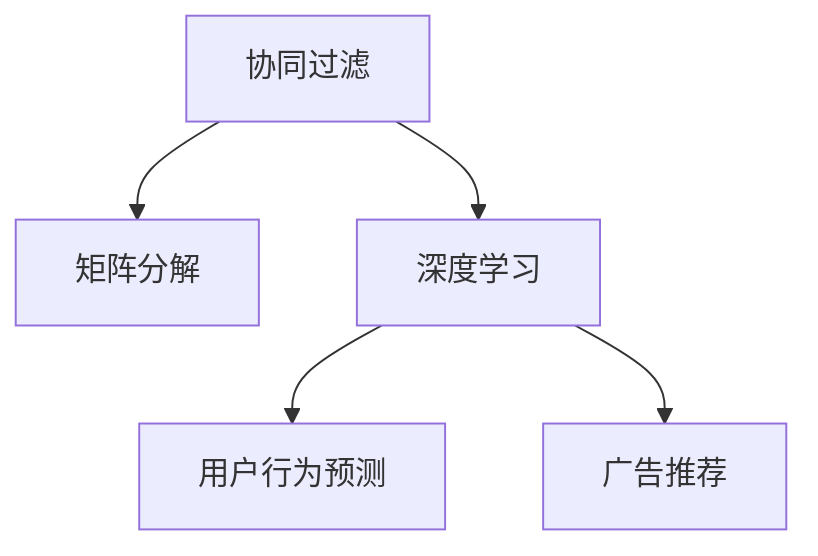

                 

# 深度学习在个性化推荐中的应用

> 关键词：深度学习, 个性化推荐, 协同过滤, 矩阵分解, 神经网络, 用户行为预测, 广告推荐, 推荐系统, 算法优化

## 1. 背景介绍

随着互联网和数字技术的快速发展，个性化推荐系统已成为各领域应用中不可或缺的一部分。从电商平台的商品推荐、视频网站的影片推荐，到新闻网站的新闻推荐，以及在线广告的定向投放，个性化推荐技术已深入到人们日常生活的方方面面。深度学习作为当前AI技术的前沿方向，以其强大的模型表达能力和自适应学习能力，在个性化推荐系统中得到了广泛应用。本文将系统地介绍深度学习在个性化推荐中的应用，涵盖协同过滤、矩阵分解、神经网络等核心算法，并探讨其未来发展趋势和面临的挑战。

## 2. 核心概念与联系

### 2.1 核心概念概述

为了更好地理解深度学习在个性化推荐系统中的应用，我们先介绍几个关键概念：

- **协同过滤**：一种基于用户和物品评分矩阵推荐算法的技术，通过分析用户历史行为数据，推断用户可能感兴趣的物品。
- **矩阵分解**：一种基于矩阵因式分解技术的推荐算法，通过分解用户-物品评分矩阵，获取用户和物品的低维特征表示，用于预测评分。
- **深度学习**：一种基于多层神经网络的机器学习技术，通过复杂的数据表达和优化算法，从原始数据中学习到高层次的特征表示，用于分类、回归等任务。
- **用户行为预测**：通过深度学习模型，基于用户的历史行为数据，预测其未来的行为，如购买商品、点击广告等。
- **广告推荐**：通过深度学习模型，基于用户的历史行为数据和广告特征，精准推荐广告，提升广告效果。

这些核心概念之间的联系可以通过以下Mermaid流程图来展示：



该流程图展示了大语言模型的核心概念及其之间的关系：协同过滤、矩阵分解和深度学习共同构成个性化推荐系统的基础技术，用于处理用户和物品数据，并预测用户行为。用户行为预测和广告推荐则是基于基础技术的高级应用，通过深度学习模型提升推荐精准度和广告效果。

## 3. 核心算法原理 & 具体操作步骤
### 3.1 算法原理概述

个性化推荐系统的核心目标是根据用户的历史行为数据，预测其对新物品的评分或是否购买，从而实现精准推荐。深度学习通过复杂的模型结构和优化算法，可以从原始数据中学习到高层次的特征表示，用于提升推荐系统的准确性和多样性。

形式化地，假设用户-物品评分矩阵为 $R \in \mathbb{R}^{m \times n}$，其中 $m$ 为用户数，$n$ 为物品数。推荐系统的目标是找到一个低维特征矩阵 $X \in \mathbb{R}^{m \times k}$ 和一个低维特征矩阵 $Y \in \mathbb{R}^{n \times k}$，使得两者相乘得到的矩阵 $X \times Y \approx R$。这样，每个用户和物品都可以被低维向量表示，模型可以基于这些向量进行预测。

### 3.2 算法步骤详解

深度学习在个性化推荐中的应用，主要包括以下几个关键步骤：

**Step 1: 数据准备**

- 收集用户的历史行为数据，如浏览、点击、购买等记录，形成用户-物品评分矩阵 $R$。
- 清洗和预处理数据，去除缺失值和异常值，标准化数据。

**Step 2: 特征工程**

- 设计特征表示，将原始数据转化为模型的输入特征。常用的特征包括用户ID、物品ID、时间戳、品类等。
- 引入额外的信息，如物品的标签、属性等，丰富模型输入。

**Step 3: 模型训练**

- 选择合适的深度学习模型，如神经网络、矩阵分解等，进行模型训练。
- 设定训练参数，如学习率、批大小、迭代轮数等，优化模型参数。
- 应用正则化技术，如L2正则、Dropout等，防止过拟合。

**Step 4: 模型评估**

- 在测试集上评估模型性能，如准确率、召回率、F1-score等。
- 分析模型预测与真实评分之间的差异，调整模型参数。

**Step 5: 模型部署**

- 将训练好的模型部署到生产环境，进行在线预测。
- 实时监测模型性能，收集反馈数据，定期更新模型。

### 3.3 算法优缺点

深度学习在个性化推荐系统中的应用，具有以下优点：

1. **高精度预测**：深度学习模型可以从大量数据中学习到复杂的多层次特征表示，具有很强的泛化能力，能够准确预测用户行为。
2. **自适应学习能力**：深度学习模型能够自动调整模型参数，适应数据分布的变化，提升推荐效果。
3. **灵活的特征表示**：深度学习模型可以通过增加神经网络层数和节点数，灵活地设计特征表示方式，满足不同应用场景的需求。
4. **良好的扩展性**：深度学习模型可以并行训练，支持大规模数据处理，具有较好的扩展性。

同时，该方法也存在一些局限性：

1. **计算资源消耗大**：深度学习模型通常需要大量的计算资源和存储空间，尤其是在训练和推理阶段。
2. **模型复杂度高**：深度学习模型参数众多，训练过程复杂，容易出现过拟合现象。
3. **需要大量标注数据**：深度学习模型的训练需要大量的标注数据，而标注数据的获取成本较高。
4. **可解释性不足**：深度学习模型通常被视为"黑盒"模型，难以解释模型的决策过程。
5. **鲁棒性有待提升**：深度学习模型对异常数据和噪声的鲁棒性较差，容易受到攻击和误导。

尽管存在这些局限性，但深度学习在个性化推荐系统中仍显示出巨大的潜力，得到了广泛应用。未来，随着计算资源的不断提升和模型优化技术的发展，这些问题有望逐步得到解决。

### 3.4 算法应用领域

深度学习在个性化推荐系统中的应用，已经在电商、视频、新闻、广告等多个领域取得了显著成果，主要应用包括：

- **电商推荐**：基于用户的历史购买记录和浏览行为，推荐相似商品或热门商品。
- **视频推荐**：基于用户的历史观看记录和评分，推荐相似影片或热门影片。
- **新闻推荐**：基于用户的历史阅读记录和点击行为，推荐相关新闻或热门文章。
- **广告推荐**：基于用户的历史行为数据和广告特征，精准推荐广告，提升广告效果。

除了这些经典应用外，深度学习还在金融、医疗、社交网络等领域，推动了个性化推荐系统的创新和应用。

## 4. 数学模型和公式 & 详细讲解 & 举例说明

### 4.1 数学模型构建

个性化推荐系统通常采用深度学习模型进行用户行为预测，这里以常见的深度学习模型为例，介绍其数学模型的构建。

假设深度学习模型为 $M$，用户和物品的低维特征表示分别为 $X \in \mathbb{R}^{m \times k}$ 和 $Y \in \mathbb{R}^{n \times k}$，其中 $m$ 和 $n$ 分别为用户数和物品数，$k$ 为特征维度。模型 $M$ 的输出为 $R_{\theta} = X \times Y$，其中 $\theta$ 为模型参数。

### 4.2 公式推导过程

以下我们以神经网络为例，推导深度学习模型的用户行为预测过程。

假设神经网络模型包含 $L$ 层，输入为 $X$，输出为 $R_{\theta}$。神经网络的层数为 $L$，每层神经元的数量分别为 $d_1, d_2, ..., d_L$，激活函数为 $f$。模型前向传播的过程如下：

$$
h_1 = f(W_1X + b_1)
$$
$$
h_2 = f(W_2h_1 + b_2)
$$
$$
\vdots
$$
$$
h_L = f(W_Lh_{L-1} + b_L)
$$

其中 $W_i$ 为第 $i$ 层的权重矩阵，$b_i$ 为第 $i$ 层的偏置向量。最终输出为：

$$
R_{\theta} = W_Lh_{L-1} + b_L
$$

损失函数通常采用均方误差（MSE）损失，定义如下：

$$
\mathcal{L}(\theta) = \frac{1}{N} \sum_{i=1}^N (R_{\theta}(i) - R(i))^2
$$

其中 $R(i)$ 为真实评分，$N$ 为样本数。

### 4.3 案例分析与讲解

以一个简单的电影推荐系统为例，假设用户对电影的评分 $R$ 在 $[1, 5]$ 之间，深度学习模型的输入特征为：用户ID、电影ID、评分时间戳、电影品类等。

**模型设计**：
- 输入层：用户ID和电影ID，特征维度为 $d_1$。
- 隐藏层：包含 $L$ 个神经元的全连接层，每层神经元的数量为 $d_2, d_3, ..., d_L$。
- 输出层：输出用户的评分预测值，维度为 $k$。

**模型训练**：
- 设置神经网络模型，损失函数为MSE损失。
- 准备用户-电影评分数据，将用户ID和电影ID转换为特征表示。
- 训练神经网络模型，通过反向传播算法更新模型参数。
- 在测试集上评估模型性能，调整模型参数。

**模型评估**：
- 计算模型在测试集上的MSE损失。
- 计算模型的准确率、召回率、F1-score等指标。
- 分析模型预测与真实评分之间的差异，调整模型参数。

## 5. 项目实践：代码实例和详细解释说明
### 5.1 开发环境搭建

在进行深度学习推荐系统的开发之前，需要先准备好开发环境。以下是使用Python进行TensorFlow开发的环境配置流程：

1. 安装Anaconda：从官网下载并安装Anaconda，用于创建独立的Python环境。

2. 创建并激活虚拟环境：
```bash
conda create -n tf-env python=3.8 
conda activate tf-env
```

3. 安装TensorFlow：根据CUDA版本，从官网获取对应的安装命令。例如：
```bash
conda install tensorflow tensorflow-gpu -c conda-forge -c nvidia
```

4. 安装各类工具包：
```bash
pip install numpy pandas scikit-learn matplotlib tqdm jupyter notebook ipython
```

完成上述步骤后，即可在`tf-env`环境中开始推荐系统的开发实践。

### 5.2 源代码详细实现

下面我们以电商推荐系统为例，给出使用TensorFlow进行深度学习推荐系统开发的PyTorch代码实现。

首先，定义推荐系统的数据处理函数：

```python
import tensorflow as tf
from tensorflow.keras.layers import Input, Dense, Embedding, Flatten
from tensorflow.keras.models import Model
from sklearn.model_selection import train_test_split

# 定义数据结构
user_id = tf.keras.layers.Input(shape=(), name='user_id')
movie_id = tf.keras.layers.Input(shape=(), name='movie_id')
rating = tf.keras.layers.Input(shape=(), name='rating')
timestamp = tf.keras.layers.Input(shape=(), name='timestamp')
category = tf.keras.layers.Input(shape=(), name='category')

# 定义嵌入层
user_embed = Embedding(input_dim=num_users, output_dim=embedding_dim, name='user_embed')
movie_embed = Embedding(input_dim=num_movies, output_dim=embedding_dim, name='movie_embed')

# 定义隐藏层
hidden_layer = tf.keras.layers.Dense(hidden_size, activation='relu', name='hidden_layer')

# 定义输出层
output_layer = Dense(1, activation='sigmoid', name='output_layer')

# 定义模型
model = Model(inputs=[user_id, movie_id, rating, timestamp, category],
              outputs=output_layer(user_embed(user_id), movie_embed(movie_id)))

# 编译模型
model.compile(optimizer='adam', loss='mse', metrics=['mae'])

# 加载数据
train_data, test_data = train_test_split(train_dataset, test_size=0.2)
```

然后，定义模型训练和评估函数：

```python
from tensorflow.keras.callbacks import EarlyStopping

def train_model(model, train_data, test_data, epochs, batch_size):
    model.fit(train_data, validation_data=test_data, epochs=epochs, batch_size=batch_size, callbacks=[EarlyStopping(patience=5)])
```

最后，启动训练流程并在测试集上评估：

```python
epochs = 10
batch_size = 128

# 训练模型
train_model(model, train_data, test_data, epochs, batch_size)

# 评估模型
test_loss, test_mae = model.evaluate(test_data)
print(f"Test loss: {test_loss:.4f}, Test MAE: {test_mae:.4f}")
```

以上就是使用TensorFlow进行电商推荐系统深度学习开发的完整代码实现。可以看到，TensorFlow的Keras API使得模型设计、编译和训练过程变得简洁高效。

### 5.3 代码解读与分析

让我们再详细解读一下关键代码的实现细节：

**数据处理函数**：
- 定义输入层，分别对应用户ID、电影ID、评分、时间戳和品类。
- 定义嵌入层，将用户ID和电影ID转换为低维特征表示。
- 定义隐藏层，进行非线性映射。
- 定义输出层，预测用户的评分。

**模型定义**：
- 将输入层、嵌入层、隐藏层和输出层进行组合，形成完整的推荐模型。
- 使用Adam优化器和均方误差损失函数，编译模型。

**训练和评估函数**：
- 使用EarlyStopping回调函数，避免过拟合。
- 在训练集上训练模型，在测试集上评估模型性能。

**训练流程**：
- 设置训练轮数和批大小。
- 在训练集上训练模型，在测试集上评估模型性能。

可以看到，TensorFlow的Keras API使得模型设计和训练过程变得简单明了，开发者可以更加专注于业务逻辑和特征设计。

## 6. 实际应用场景
### 6.1 电商推荐系统

电商推荐系统是深度学习在个性化推荐中最为典型的应用之一。通过深度学习模型，电商网站可以根据用户的历史购买记录和浏览行为，推荐用户可能感兴趣的商品，提升用户体验和销售额。

在技术实现上，电商推荐系统通常包括以下几个步骤：
1. 数据收集：收集用户的历史行为数据，如浏览记录、购买记录等。
2. 数据预处理：清洗和预处理数据，去除缺失值和异常值，标准化数据。
3. 特征工程：设计特征表示，将原始数据转化为模型的输入特征。常用的特征包括用户ID、商品ID、时间戳、品类等。
4. 模型训练：选择合适的深度学习模型，如神经网络、矩阵分解等，进行模型训练。
5. 模型评估：在测试集上评估模型性能，如准确率、召回率、F1-score等。
6. 模型部署：将训练好的模型部署到生产环境，进行在线预测。

### 6.2 视频推荐系统

视频推荐系统是另一个深度学习在个性化推荐中的重要应用。通过深度学习模型，视频网站可以根据用户的历史观看记录和评分，推荐用户可能感兴趣的视频，提升用户体验和视频点击率。

在技术实现上，视频推荐系统通常包括以下几个步骤：
1. 数据收集：收集用户的视频观看记录和评分数据。
2. 数据预处理：清洗和预处理数据，去除缺失值和异常值，标准化数据。
3. 特征工程：设计特征表示，将原始数据转化为模型的输入特征。常用的特征包括用户ID、视频ID、评分、时间戳、标签等。
4. 模型训练：选择合适的深度学习模型，如神经网络、矩阵分解等，进行模型训练。
5. 模型评估：在测试集上评估模型性能，如准确率、召回率、F1-score等。
6. 模型部署：将训练好的模型部署到生产环境，进行在线预测。

### 6.3 新闻推荐系统

新闻推荐系统是深度学习在个性化推荐中的另一个重要应用。通过深度学习模型，新闻网站可以根据用户的历史阅读记录和点击行为，推荐用户可能感兴趣的新闻，提升用户体验和新闻点击率。

在技术实现上，新闻推荐系统通常包括以下几个步骤：
1. 数据收集：收集用户的新闻阅读记录和点击数据。
2. 数据预处理：清洗和预处理数据，去除缺失值和异常值，标准化数据。
3. 特征工程：设计特征表示，将原始数据转化为模型的输入特征。常用的特征包括用户ID、新闻ID、点击时间戳、新闻品类等。
4. 模型训练：选择合适的深度学习模型，如神经网络、矩阵分解等，进行模型训练。
5. 模型评估：在测试集上评估模型性能，如准确率、召回率、F1-score等。
6. 模型部署：将训练好的模型部署到生产环境，进行在线预测。

### 6.4 未来应用展望

随着深度学习技术的不断进步，个性化推荐系统在未来将呈现以下几个发展趋势：

1. **跨领域推荐**：通过多模态信息融合，推荐系统可以同时考虑文本、图像、视频等多种数据类型，提升推荐效果。
2. **实时推荐**：通过在线学习技术，推荐系统可以实现实时推荐，及时响应用户需求。
3. **用户画像增强**：通过深度学习技术，推荐系统可以构建更全面、更详细的用户画像，提升推荐精准度。
4. **隐私保护**：通过差分隐私等技术，推荐系统可以在保护用户隐私的前提下，提升推荐效果。
5. **推荐系统智能化**：通过强化学习、因果推理等技术，推荐系统可以实现自适应优化，不断提升推荐效果。

## 7. 工具和资源推荐
### 7.1 学习资源推荐

为了帮助开发者系统掌握深度学习在个性化推荐中的应用，这里推荐一些优质的学习资源：

1. 《深度学习》系列书籍：由斯坦福大学李飞飞教授领衔编写，全面介绍了深度学习的基本概念、算法和应用。
2. 《深度学习入门》（《Deep Learning with Python》）书籍：由Francois Chollet撰写，详细介绍了TensorFlow框架的使用方法。
3. CS231n《卷积神经网络》课程：斯坦福大学开设的深度学习课程，重点介绍深度学习在计算机视觉中的应用。
4. CS224n《自然语言处理与深度学习》课程：斯坦福大学开设的NLP课程，详细介绍了深度学习在NLP中的应用。
5. Kaggle竞赛平台：提供大量推荐系统竞赛数据集和开源解决方案，帮助开发者实践和提升推荐系统技能。

通过对这些资源的学习实践，相信你一定能够快速掌握深度学习在个性化推荐中的应用技巧，并用于解决实际的推荐问题。

### 7.2 开发工具推荐

高效的开发离不开优秀的工具支持。以下是几款用于深度学习推荐系统开发的常用工具：

1. TensorFlow：由Google主导开发的开源深度学习框架，支持大规模工程应用。TensorFlow提供丰富的深度学习模型库，支持复杂的神经网络结构。
2. PyTorch：由Facebook主导开发的开源深度学习框架，支持动态计算图，适合快速迭代研究。PyTorch提供灵活的模型设计和训练工具。
3. Keras：由Francois Chollet主导开发的高级深度学习API，支持多种深度学习框架，提供简洁的模型设计和训练接口。
4. H2O.ai：提供深度学习、机器学习、统计学习等模型训练工具，支持大规模数据处理，具有较好的扩展性。
5. LightGBM：由微软开发的梯度提升决策树库，支持多模态数据融合，适合推荐系统等复杂模型训练。

合理利用这些工具，可以显著提升深度学习推荐系统的开发效率，加快创新迭代的步伐。

### 7.3 相关论文推荐

深度学习在个性化推荐领域的研究，已经得到了学界的广泛关注和深入探讨。以下是几篇奠基性的相关论文，推荐阅读：

1. "Adaptive Structured Sparsity"：提出基于稀疏矩阵分解的推荐算法，可以高效处理大规模数据。
2. "Deep Interest Network for Recommendations"：提出基于深度学习模型的推荐算法，能够学习到用户和物品的高层次特征表示。
3. "Deep Neural Networks for Collaborative Filtering"：提出基于深度神经网络的协同过滤算法，具有较好的推荐效果。
4. "Learning Deep Structured Generative Models for Collaborative Filtering"：提出基于生成模型的推荐算法，能够更好地处理数据分布的变化。
5. "The Neural Ordinal Embedding Approach to Recommender Systems"：提出基于神经网络模型的推荐算法，能够实现顺序预测和推荐。

这些论文代表了大深度学习在推荐系统领域的研究进展，为未来推荐系统的改进提供了理论基础和技术支持。

## 8. 总结：未来发展趋势与挑战
### 8.1 研究成果总结

深度学习在个性化推荐系统中已经取得了显著的进展，通过复杂的模型结构和优化算法，提升了推荐系统的准确性和多样性。目前，深度学习推荐系统已经在电商、视频、新闻、广告等多个领域得到了广泛应用，提升了用户体验和业务效果。

### 8.2 未来发展趋势

展望未来，深度学习在个性化推荐系统中的发展将呈现以下几个趋势：

1. **多模态推荐**：通过多模态数据融合，推荐系统可以更全面地了解用户需求和物品特征，提升推荐效果。
2. **实时推荐**：通过在线学习技术，推荐系统可以实现实时推荐，及时响应用户需求。
3. **用户画像增强**：通过深度学习技术，推荐系统可以构建更全面、更详细的用户画像，提升推荐精准度。
4. **隐私保护**：通过差分隐私等技术，推荐系统可以在保护用户隐私的前提下，提升推荐效果。
5. **推荐系统智能化**：通过强化学习、因果推理等技术，推荐系统可以实现自适应优化，不断提升推荐效果。

### 8.3 面临的挑战

尽管深度学习在个性化推荐系统中已经取得了显著的进展，但在实现高性能推荐系统时，仍面临诸多挑战：

1. **计算资源消耗大**：深度学习模型通常需要大量的计算资源和存储空间，尤其是在训练和推理阶段。
2. **模型复杂度高**：深度学习模型参数众多，训练过程复杂，容易出现过拟合现象。
3. **需要大量标注数据**：深度学习模型的训练需要大量的标注数据，而标注数据的获取成本较高。
4. **可解释性不足**：深度学习模型通常被视为"黑盒"模型，难以解释模型的决策过程。
5. **鲁棒性有待提升**：深度学习模型对异常数据和噪声的鲁棒性较差，容易受到攻击和误导。

尽管存在这些挑战，但深度学习在个性化推荐系统中仍显示出巨大的潜力，得到了广泛应用。未来，随着计算资源的不断提升和模型优化技术的发展，这些问题有望逐步得到解决。

### 8.4 研究展望

未来，深度学习在个性化推荐系统中的研究将进一步深化和拓展，主要方向包括：

1. **跨领域推荐**：通过多模态信息融合，推荐系统可以同时考虑文本、图像、视频等多种数据类型，提升推荐效果。
2. **实时推荐**：通过在线学习技术，推荐系统可以实现实时推荐，及时响应用户需求。
3. **用户画像增强**：通过深度学习技术，推荐系统可以构建更全面、更详细的用户画像，提升推荐精准度。
4. **隐私保护**：通过差分隐私等技术，推荐系统可以在保护用户隐私的前提下，提升推荐效果。
5. **推荐系统智能化**：通过强化学习、因果推理等技术，推荐系统可以实现自适应优化，不断提升推荐效果。

这些方向的研究将进一步推动个性化推荐系统的进步，为用户提供更加精准、智能的推荐服务。

## 9. 附录：常见问题与解答

**Q1: 深度学习推荐系统是否适用于所有业务场景？**

A: 深度学习推荐系统适用于大多数业务场景，但需要根据具体业务特点进行优化。例如，对于实时性要求较高的场景，可以考虑使用基于在线学习技术的推荐系统。对于数据量较小或数据分布不均衡的场景，可以考虑使用基于协同过滤或矩阵分解的推荐系统。

**Q2: 深度学习推荐系统如何提高推荐效果？**

A: 深度学习推荐系统通过复杂的模型结构和优化算法，可以从原始数据中学习到高层次的特征表示，提升推荐效果。常用的优化方法包括梯度下降、Adam等。同时，可以通过特征工程、正则化等技术，进一步提升推荐效果。

**Q3: 深度学习推荐系统如何保护用户隐私？**

A: 深度学习推荐系统可以通过差分隐私等技术，保护用户隐私。例如，可以在模型训练时加入噪声，使得模型无法准确推测用户数据。同时，可以设计隐私保护算法，确保推荐系统在保护用户隐私的前提下，仍能提供高质量的推荐服务。

**Q4: 深度学习推荐系统如何应对异常数据和噪声？**

A: 深度学习推荐系统可以通过异常检测技术，识别和过滤异常数据和噪声。例如，可以设计异常检测算法，检测并移除异常数据。同时，可以通过正则化、剪枝等技术，减少噪声对推荐系统的影响。

**Q5: 深度学习推荐系统如何实现跨领域推荐？**

A: 深度学习推荐系统可以通过多模态数据融合，实现跨领域推荐。例如，可以同时考虑用户的历史行为数据、物品的图像和视频信息、用户的社交网络信息等多种数据类型，提升推荐效果。

这些问题的回答，希望能为你提供一些有价值的参考和指导，进一步推动深度学习在个性化推荐系统中的应用和发展。

---

作者：禅与计算机程序设计艺术 / Zen and the Art of Computer Programming

