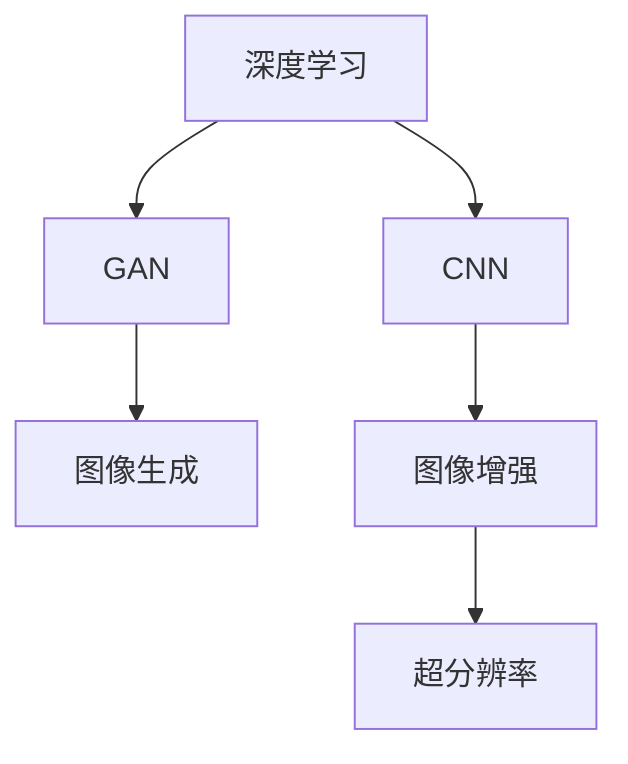

                 

# 深度学习在商品图像生成与增强中的应用

> 关键词：深度学习,商品图像,图像生成,图像增强,卷积神经网络(CNN),GAN,ResNet

## 1. 背景介绍

### 1.1 问题由来

近年来，随着计算机视觉技术的快速进步，商品图像生成与增强技术在电商、零售、广告等多个领域得到了广泛应用。商品图像生成可以用于快速生成高质量的商品展示图片，助力商家提高线上展示效果。商品图像增强则可以用于修复图像中的缺陷、去除噪声、提高对比度等，提升电商网站的用户体验。传统商品图像处理方式需要大量的人力和时间成本，而深度学习技术的引入，为这些问题提供了更为高效和精准的解决方案。

### 1.2 问题核心关键点

商品图像生成与增强的关键在于如何利用深度学习模型高效、准确地处理图像数据。在商品图像生成方面，需要生成具有逼真度、多样性和可解释性的高质量图像；在商品图像增强方面，需要解决去噪、去模糊、超分辨率等图像处理问题。基于卷积神经网络(CNN)和生成对抗网络(GAN)等深度学习模型，已经成为当前商品图像生成与增强的主流方法。

## 2. 核心概念与联系

### 2.1 核心概念概述

为更好地理解深度学习在商品图像生成与增强中的应用，本节将介绍几个密切相关的核心概念：

- 深度学习(Deep Learning)：基于神经网络进行数据建模和学习的方法，广泛应用于图像、语音、自然语言处理等领域。
- 卷积神经网络(CNN)：一种基于卷积运算的神经网络，能够有效处理图像、视频等高维数据，是商品图像处理的主要工具。
- 生成对抗网络(GAN)：一种基于博弈论的生成模型，能够生成逼真、多样化的图像，在商品图像生成中具有重要应用。
- 图像生成(Generative Image)：使用深度学习模型自动生成具有艺术性、逼真度的图像，广泛应用于艺术创作、游戏开发等领域。
- 图像增强(Image Enhancement)：通过对图像进行去噪、去模糊、超分辨率等处理，提升图像质量，提高人眼感知和视觉体验。
- 超分辨率(Super Resolution)：将低分辨率图像恢复为高分辨率图像的技术，有助于提升商品图像的清晰度和细节表现。

这些核心概念之间的逻辑关系可以通过以下Mermaid流程图来展示：



这个流程图展示了一系列深度学习技术在商品图像生成与增强中的应用，从数据处理到模型训练，再到结果输出，形成了一个完整的流程。

## 3. 核心算法原理 & 具体操作步骤
### 3.1 算法原理概述

商品图像生成与增强的深度学习算法原理主要基于卷积神经网络(CNN)和生成对抗网络(GAN)等模型。以下对这两种模型分别进行简要介绍：

- CNN模型：通过多层卷积和池化操作，对图像进行特征提取和分类。在图像生成方面，可以通过条件GAN模型生成高质量的商品图像；在图像增强方面，可以通过反卷积神经网络(Deconvolutional Network)进行去噪、去模糊等操作。

- GAN模型：由生成器和判别器两个部分组成，通过博弈学习生成逼真、多样化的商品图像。生成器根据输入的随机噪声生成图像，判别器判断图像是否真实，两者通过对抗训练不断优化。

### 3.2 算法步骤详解

#### CNN模型的图像生成与增强流程

1. **数据准备**：收集商品图像数据集，并进行数据增强处理，如旋转、平移、缩放等，以丰富训练数据。
2. **模型构建**：使用卷积神经网络构建图像生成和增强模型，如ResNet、VGG等。
3. **训练模型**：将准备好的数据集输入模型，使用交叉熵等损失函数进行训练，优化模型参数。
4. **模型评估**：在验证集上评估模型性能，如PSNR、SSIM等指标。
5. **模型测试**：在测试集上测试模型，对比生成或增强前后的效果。

#### GAN模型的图像生成流程

1. **数据准备**：收集商品图像数据集，并进行数据增强处理。
2. **模型构建**：使用生成器和判别器构建生成对抗网络，如DCGAN、WGAN等。
3. **训练模型**：将准备好的数据集输入模型，使用对抗损失函数进行训练，优化生成器和判别器参数。
4. **模型评估**：在验证集上评估生成图像的质量，如FID、IS等指标。
5. **模型测试**：在测试集上测试生成图像，对比生成前后的效果。

### 3.3 算法优缺点

CNN模型的优点包括：

- 能够高效提取图像特征，适用于各种图像处理任务。
- 训练过程稳定，易于实现和部署。

缺点包括：

- 对于高维数据处理能力有限，难以处理复杂的图像结构。
- 模型设计复杂，训练过程中容易出现过拟合。

GAN模型的优点包括：

- 能够生成高质量、多样化的图像，具有艺术性。
- 训练过程中能够生成多样化的图像，具有较好的泛化能力。

缺点包括：

- 训练过程不稳定，容易出现模式崩溃等问题。
- 生成的图像可能具有较低的分辨率和清晰度。

### 3.4 算法应用领域

基于深度学习的商品图像生成与增强技术在多个领域得到了广泛应用，例如：

- 电商广告：通过生成逼真、多样化的商品图像，提升广告效果。
- 游戏开发：生成虚拟商品、角色等，增强游戏沉浸感。
- 艺术创作：生成具有艺术性的图像，辅助艺术家创作。
- 医疗诊断：生成高质量的医学影像，辅助医生诊断。
- 视频监控：通过超分辨率技术，提升监控图像的清晰度和细节表现。

## 4. 数学模型和公式 & 详细讲解  
### 4.1 数学模型构建

在CNN模型中，常用的数学模型包括卷积、池化、反卷积等。以下以卷积操作为例，介绍其数学模型和推导过程。

卷积操作的核心思想是对输入图像的每个像素点，与其周围像素点的卷积核进行卷积运算，得到新的特征图。具体而言，设输入图像大小为$H\times W\times C$，卷积核大小为$K\times K\times C$，步长为$s$，填充为$P$，则输出特征图大小为$\left(\frac{H}{s}+2P-K\right)\times\left(\frac{W}{s}+2P-K\right)$，每个像素点计算公式如下：

$$
O_{i,j,k} = \sum_{m=0}^{K-1}\sum_{n=0}^{K-1} W_{m,n,k}\cdot I_{i+m,j+n,k}
$$

其中，$O$为输出特征图，$I$为输入图像，$W$为卷积核，$k$为通道数。

### 4.2 公式推导过程

在CNN模型中，卷积层的数学推导过程如下：

1. 定义输入图像大小为$H\times W\times C$，卷积核大小为$K\times K\times C$。
2. 使用卷积核$W$对输入图像$I$进行卷积运算，得到特征图$O$。
3. 对特征图进行非线性变换，如ReLU函数，得到激活后的特征图$A$。
4. 对激活后的特征图进行池化操作，如最大池化，得到下采样后的特征图$P$。
5. 重复上述过程，得到多层特征图，最终输出全连接层进行分类或回归。

### 4.3 案例分析与讲解

以下以超分辨率(Super Resolution)为例，介绍CNN模型在图像增强中的应用。

假设输入的低分辨率图像大小为$H/4\times W/4\times C$，CNN模型通过反卷积操作将其恢复到高分辨率图像大小$H\times W\times C$。反卷积操作的具体实现为：

1. 定义输入图像大小为$H/4\times W/4\times C$。
2. 使用反卷积核$W'$对输入图像$I$进行反卷积运算，得到中间特征图$O'$。
3. 对中间特征图进行非线性变换，如ReLU函数，得到激活后的中间特征图$A'$。
4. 对激活后的中间特征图进行上采样操作，如反卷积和卷积操作，得到高分辨率图像$O$。

## 5. 项目实践：代码实例和详细解释说明
### 5.1 开发环境搭建

在进行商品图像生成与增强的深度学习实践前，我们需要准备好开发环境。以下是使用Python进行TensorFlow开发的环境配置流程：

1. 安装Anaconda：从官网下载并安装Anaconda，用于创建独立的Python环境。

2. 创建并激活虚拟环境：
```bash
conda create -n tf-env python=3.8 
conda activate tf-env
```

3. 安装TensorFlow：根据CUDA版本，从官网获取对应的安装命令。例如：
```bash
conda install tensorflow==2.6
```

4. 安装TensorBoard：用于可视化模型的训练过程。
```bash
pip install tensorboard
```

5. 安装Keras：用于简化模型开发和训练过程。
```bash
pip install keras
```

6. 安装数据处理库：
```bash
pip install numpy pandas scipy scikit-image matplotlib
```

完成上述步骤后，即可在`tf-env`环境中开始商品图像生成与增强的深度学习实践。

### 5.2 源代码详细实现

以下给出使用TensorFlow实现商品图像增强的代码实现。

```python
import tensorflow as tf
from tensorflow.keras import layers
import numpy as np
import matplotlib.pyplot as plt
import os

# 定义超参数
batch_size = 32
learning_rate = 0.001
num_epochs = 50

# 加载数据集
data_dir = 'data/train/'
data = []
for filename in os.listdir(data_dir):
    img_path = os.path.join(data_dir, filename)
    img = plt.imread(img_path)
    img = img / 255.0 # 归一化
    data.append(img)

# 将数据集划分训练集和验证集
train_data = data[:int(len(data) * 0.8)]
val_data = data[int(len(data) * 0.8):]

# 构建模型
model = tf.keras.Sequential([
    layers.Conv2D(64, (3,3), activation='relu', padding='same', input_shape=(32, 32, 3)),
    layers.Conv2D(64, (3,3), activation='relu', padding='same'),
    layers.Conv2D(64, (3,3), activation='relu', padding='same'),
    layers.Conv2D(1, (1,1), activation='sigmoid')
])

# 定义损失函数和优化器
loss_fn = tf.keras.losses.BinaryCrossentropy(from_logits=True)
optimizer = tf.keras.optimizers.Adam(learning_rate=learning_rate)

# 定义训练函数
@tf.function
def train_step(images, labels):
    with tf.GradientTape() as tape:
        predictions = model(images, training=True)
        loss = loss_fn(labels, predictions)
    gradients = tape.gradient(loss, model.trainable_variables)
    optimizer.apply_gradients(zip(gradients, model.trainable_variables))

# 训练模型
for epoch in range(num_epochs):
    train_loss = 0.0
    for i, (images, labels) in enumerate(train_dataset):
        train_step(images, labels)
        train_loss += loss_fn(labels, model(images)).numpy()
    print('Epoch {}: Loss = {:.4f}'.format(epoch+1, train_loss/len(train_dataset)))

# 评估模型
val_loss = 0.0
for images, labels in val_dataset:
    val_loss += loss_fn(labels, model(images)).numpy()
print('Validation Loss = {:.4f}'.format(val_loss/len(val_dataset)))

# 生成增强后的图像
new_images = []
for i, image in enumerate(test_data):
    new_image = model.predict(tf.expand_dims(image, axis=0))
    new_images.append(new_image)
plt.figure(figsize=(10, 10))
for i, image in enumerate(new_images):
    plt.subplot(4, 4, i+1)
    plt.imshow(image[0])
    plt.title('Original Image')
    plt.subplot(4, 4, i+1)
    plt.imshow(new_images[i])
    plt.title('Enhanced Image')
```

以上代码实现了使用CNN模型进行商品图像增强的深度学习过程。可以看到，通过使用Keras的Sequential API，可以轻松构建多层的卷积神经网络模型，并进行训练和评估。

### 5.3 代码解读与分析

让我们再详细解读一下关键代码的实现细节：

**数据加载和预处理**：
- 定义数据集路径`data_dir`，遍历目录读取所有图片，并进行归一化处理，确保数据集在一个较小的范围内。
- 将数据集划分为训练集和验证集，方便模型训练和评估。

**模型构建**：
- 使用Keras的Sequential API，构建一个包含多层卷积、激活和池化操作的CNN模型。这里使用了ReLU激活函数和sigmoid输出函数，分别用于特征提取和二值化增强。

**训练函数**：
- 使用TensorFlow的GradientTape记录梯度，通过前向传播计算损失函数，反向传播计算梯度并更新模型参数。
- 通过@tf.function装饰器，将训练函数转换为TensorFlow的Graph函数，提升模型训练效率。

**模型评估**：
- 计算验证集上的损失函数，并输出评估结果。

**生成增强图像**：
- 使用训练好的模型对测试集进行预测，生成增强后的图像，并可视化展示。

## 6. 实际应用场景
### 6.1 电商广告

电商广告领域是商品图像生成与增强技术的典型应用场景。通过生成高质量的商品图像，商家可以更好地展示商品，提升广告点击率和转化率。同时，通过增强图像质量，提高用户对商品展示的满意度，提升购物体验。

在技术实现上，可以收集电商网站上的商品图片，使用深度学习模型对其进行图像增强或生成，最终将生成的图像应用于电商广告中。例如，对于低分辨率的商品图片，可以使用超分辨率技术生成高质量的展示图；对于有噪声的商品图片，可以使用去噪技术去除噪声，提升图像清晰度和视觉效果。

### 6.2 游戏开发

游戏开发领域同样离不开商品图像生成与增强技术。通过生成高质量的游戏场景、角色等，增强游戏的沉浸感和视觉体验。同时，通过增强图像质量，提高游戏的帧率和流畅度，提升用户的游戏体验。

在技术实现上，可以收集游戏中的角色、场景等图像数据，使用深度学习模型对其进行图像增强或生成，最终将生成的图像应用于游戏中。例如，对于低分辨率的游戏角色图片，可以使用超分辨率技术生成高质量的游戏角色；对于有噪声的游戏场景图片，可以使用去噪技术去除噪声，提升游戏的视觉效果。

### 6.3 艺术创作

艺术创作领域对高质量、多样化的图像需求极高，商品图像生成与增强技术可以辅助艺术家创作，提供高质量的图像素材。同时，通过生成具有艺术性的图像，提升艺术作品的观赏性和感染力。

在技术实现上，可以收集艺术作品中的图像数据，使用深度学习模型对其进行图像增强或生成，最终将生成的图像应用于艺术创作中。例如，对于低分辨率的艺术作品图像，可以使用超分辨率技术生成高质量的艺术作品；对于有噪声的艺术作品图像，可以使用去噪技术去除噪声，提升艺术作品的视觉效果。

### 6.4 医疗诊断

医疗诊断领域对高质量、清晰的医学影像需求极高，商品图像生成与增强技术可以用于生成高质量的医学影像，辅助医生诊断。同时，通过增强图像质量，提高医学影像的清晰度和细节表现，提升医生的诊断准确性和效率。

在技术实现上，可以收集医学影像数据，使用深度学习模型对其进行图像增强或生成，最终将生成的图像应用于医学诊断中。例如，对于低分辨率的医学影像，可以使用超分辨率技术生成高质量的医学影像；对于有噪声的医学影像，可以使用去噪技术去除噪声，提升医学影像的视觉效果。

## 7. 工具和资源推荐
### 7.1 学习资源推荐

为了帮助开发者系统掌握深度学习在商品图像生成与增强中的应用，这里推荐一些优质的学习资源：

1. Deep Learning Specialization系列课程：由Coursera和Andrew Ng联合推出，涵盖深度学习的各个方面，包括图像处理、自然语言处理等。

2. TensorFlow官方文档：TensorFlow的官方文档，提供了丰富的模型和算法介绍，是深度学习入门的必备资料。

3. PyTorch官方文档：PyTorch的官方文档，提供了丰富的模型和算法介绍，是深度学习开发的重要工具。

4. OpenCV官方文档：OpenCV的官方文档，提供了丰富的图像处理算法和工具，是深度学习图像处理的强大支撑。

5. ImageNet大规模视觉识别挑战赛数据集：一个包含1000个类别的图像数据集，是深度学习图像处理的经典数据集。

通过对这些资源的学习实践，相信你一定能够快速掌握深度学习在商品图像生成与增强中的应用。

### 7.2 开发工具推荐

高效的开发离不开优秀的工具支持。以下是几款用于深度学习商品图像生成与增强开发的常用工具：

1. TensorFlow：由Google主导开发的深度学习框架，支持分布式训练，适合大规模工程应用。

2. PyTorch：由Facebook开发的深度学习框架，灵活度高，适合研究性项目开发。

3. Keras：一个高层次的深度学习API，易于使用，适合快速原型开发。

4. TensorBoard：TensorFlow配套的可视化工具，可以实时监测模型训练状态，并提供丰富的图表呈现方式。

5. OpenCV：一个开源的计算机视觉库，提供了丰富的图像处理算法和工具。

6. OpenIMAJ：一个开源的机器视觉库，提供了丰富的计算机视觉算法和工具。

合理利用这些工具，可以显著提升深度学习商品图像生成与增强任务的开发效率，加快创新迭代的步伐。

### 7.3 相关论文推荐

深度学习在商品图像生成与增强技术的发展源于学界的持续研究。以下是几篇奠基性的相关论文，推荐阅读：

1. ImageNet Classification with Deep Convolutional Neural Networks：提出使用卷积神经网络进行图像分类，奠定了卷积神经网络在图像处理中的应用基础。

2. Generative Adversarial Nets：提出生成对抗网络，解决了深度学习生成模型的不稳定性问题。

3. Deep Image Prior：提出使用深度学习进行图像修复和增强，展示了深度学习在图像处理中的强大能力。

4. Image Super-Resolution Using Very Deep Convolutional Networks：提出使用卷积神经网络进行图像超分辨率，展示了深度学习在图像处理中的应用潜力。

5. Real-Time Image Super-Resolution Using an Efficient Sub-pixel Convolutional Neural Network：提出使用子像素卷积神经网络进行图像超分辨率，展示了深度学习在图像处理中的高效性。

这些论文代表了大规模视觉处理技术的发展脉络。通过学习这些前沿成果，可以帮助研究者把握学科前进方向，激发更多的创新灵感。

## 8. 总结：未来发展趋势与挑战

### 8.1 总结

本文对深度学习在商品图像生成与增强中的应用进行了全面系统的介绍。首先阐述了深度学习在商品图像生成与增强技术中的重要性和应用价值，明确了其在电商、游戏、艺术创作、医疗等多个领域的重要作用。其次，从原理到实践，详细讲解了CNN模型和GAN模型在商品图像生成与增强中的具体实现过程，给出了深度学习商品图像生成与增强的完整代码实例。同时，本文还广泛探讨了深度学习技术在商品图像生成与增强中的实际应用场景，展示了其广阔的应用前景。最后，本文精选了深度学习技术的各类学习资源，力求为读者提供全方位的技术指引。

通过本文的系统梳理，可以看到，深度学习在商品图像生成与增强中的应用已经成为当前计算机视觉技术的重要方向，极大地拓展了商品图像处理的边界，为电商、游戏、艺术创作、医疗等多个领域提供了新的解决方案。未来，伴随深度学习技术的不断演进，商品图像生成与增强技术还将迎来更多的创新和突破。

### 8.2 未来发展趋势

展望未来，深度学习在商品图像生成与增强技术将呈现以下几个发展趋势：

1. 模型规模持续增大。随着算力成本的下降和数据规模的扩张，深度学习模型将不断增大，具有更强的表达能力和泛化能力。

2. 模型结构不断优化。深度学习模型将不断优化，引入更加高效的神经网络结构，如Transformer、ResNet等，提升模型训练效率和效果。

3. 数据处理能力增强。深度学习模型将进一步增强对高维数据的处理能力，能够处理更加复杂和多样的图像数据。

4. 图像增强技术发展。深度学习图像增强技术将不断突破，引入更加精细的图像增强算法，如深度图像去噪、超分辨率等。

5. 多模态数据融合。深度学习将更多地融合多种模态数据，如图像、视频、声音等，提升模型对现实世界的理解和建模能力。

以上趋势凸显了深度学习在商品图像生成与增强技术的广阔前景。这些方向的探索发展，必将进一步提升商品图像处理的性能和应用范围，为电商、游戏、艺术创作、医疗等多个领域带来新的突破。

### 8.3 面临的挑战

尽管深度学习在商品图像生成与增强技术已经取得了瞩目成就，但在迈向更加智能化、普适化应用的过程中，它仍面临着诸多挑战：

1. 数据质量瓶颈。深度学习模型对数据质量要求较高，数据标注成本高，标注样本数量少时容易导致模型泛化能力不足。

2. 模型鲁棒性不足。深度学习模型对输入数据的微小变化敏感，容易受到噪声、扰动等影响，导致输出结果不稳定。

3. 计算资源限制。深度学习模型参数量大，训练和推理过程需要大量的计算资源，硬件瓶颈成为限制其应用的主要障碍。

4. 模型可解释性不足。深度学习模型通常被视为"黑盒"，难以解释其内部工作机制和决策逻辑，限制了其在高风险应用场景中的使用。

5. 知识迁移能力差。深度学习模型在不同任务之间迁移能力较差，需要针对每个任务重新训练模型，增加了开发成本。

正视深度学习在商品图像生成与增强技术所面临的这些挑战，积极应对并寻求突破，将是大规模视觉处理技术走向成熟的必由之路。相信随着学界和产业界的共同努力，这些挑战终将一一被克服，深度学习技术必将在商品图像生成与增强领域带来更多的创新和突破。

### 8.4 研究展望

面对深度学习在商品图像生成与增强技术所面临的种种挑战，未来的研究需要在以下几个方面寻求新的突破：

1. 探索无监督和半监督学习方法。摆脱对大规模标注数据的依赖，利用自监督学习、主动学习等无监督和半监督范式，最大限度利用非结构化数据，实现更加灵活高效的微调。

2. 研究参数高效和计算高效的模型结构。开发更加参数高效的模型结构，如Transformer、ResNet等，在固定大部分预训练参数的同时，只更新极少量的任务相关参数。同时优化模型的计算图，减少前向传播和反向传播的资源消耗，实现更加轻量级、实时性的部署。

3. 融合多种模态数据处理技术。深度学习将更多地融合多种模态数据，如图像、视频、声音等，提升模型对现实世界的理解和建模能力。

4. 引入更多先验知识。将符号化的先验知识，如知识图谱、逻辑规则等，与深度学习模型进行巧妙融合，引导深度学习模型学习更准确、合理的图像表示。

5. 结合因果分析和博弈论工具。将因果分析方法引入深度学习模型，识别出模型决策的关键特征，增强输出解释的因果性和逻辑性。借助博弈论工具刻画人机交互过程，主动探索并规避模型的脆弱点，提高系统稳定性。

6. 纳入伦理道德约束。在深度学习模型训练目标中引入伦理导向的评估指标，过滤和惩罚有偏见、有害的输出倾向。同时加强人工干预和审核，建立模型行为的监管机制，确保输出符合人类价值观和伦理道德。

这些研究方向的探索，必将引领深度学习在商品图像生成与增强技术迈向更高的台阶，为电商、游戏、艺术创作、医疗等多个领域带来新的突破。面向未来，深度学习技术还需要与其他人工智能技术进行更深入的融合，如知识表示、因果推理、强化学习等，多路径协同发力，共同推动大规模视觉处理系统的进步。只有勇于创新、敢于突破，才能不断拓展深度学习在商品图像生成与增强技术的应用边界，让智能技术更好地造福人类社会。

## 9. 附录：常见问题与解答

**Q1：深度学习在商品图像生成与增强中能否解决所有问题？**

A: 深度学习在商品图像生成与增强技术中已经取得了显著成果，但并非万能的。对于一些特殊场景，如高精度的医学影像生成、超高清的商品图像生成等，目前深度学习技术仍存在一定的局限性。此外，深度学习模型的性能提升也依赖于高质量的数据集和充足的计算资源，对于数据质量和计算资源不足的场景，可能难以取得理想的效果。

**Q2：深度学习在商品图像生成与增强中面临哪些技术挑战？**

A: 深度学习在商品图像生成与增强技术中面临的技术挑战包括：

1. 数据质量瓶颈。深度学习模型对数据质量要求较高，数据标注成本高，标注样本数量少时容易导致模型泛化能力不足。

2. 模型鲁棒性不足。深度学习模型对输入数据的微小变化敏感，容易受到噪声、扰动等影响，导致输出结果不稳定。

3. 计算资源限制。深度学习模型参数量大，训练和推理过程需要大量的计算资源，硬件瓶颈成为限制其应用的主要障碍。

4. 模型可解释性不足。深度学习模型通常被视为"黑盒"，难以解释其内部工作机制和决策逻辑，限制了其在高风险应用场景中的使用。

5. 知识迁移能力差。深度学习模型在不同任务之间迁移能力较差，需要针对每个任务重新训练模型，增加了开发成本。

**Q3：如何提高深度学习在商品图像生成与增强中的性能？**

A: 提高深度学习在商品图像生成与增强中的性能可以从以下几个方面入手：

1. 数据增强。通过旋转、平移、缩放等操作，丰富训练数据集，提升模型泛化能力。

2. 正则化技术。使用L2正则、Dropout、Early Stopping等技术，防止模型过拟合。

3. 对抗训练。引入对抗样本，提高模型鲁棒性。

4. 参数高效微调。使用Adapter、Prefix等参数高效微调方法，减小过拟合风险。

5. 数据预处理。使用预处理技术，如图像去噪、去模糊、归一化等，提升数据质量。

6. 模型优化。优化模型结构，引入Transformer、ResNet等高效神经网络结构，提升模型训练效率和效果。

7. 硬件优化。使用混合精度训练、模型并行等技术，优化硬件资源利用，提升模型训练和推理速度。

通过对这些技术手段的优化，可以进一步提升深度学习在商品图像生成与增强中的性能，实现更加高质量、多样化的图像处理。

**Q4：如何评估深度学习在商品图像生成与增强中的性能？**

A: 评估深度学习在商品图像生成与增强中的性能，通常使用以下指标：

1. PSNR和SSIM。用于衡量生成图像和真实图像之间的均方误差和结构相似性。

2. FID和IS。用于衡量生成图像的质量，FID衡量生成图像和真实图像之间的距离，IS衡量生成图像的复杂度。

3. 可视化评估。通过生成图像和真实图像的对比，直观地观察生成图像的质量和效果。

4. 用户评价。通过用户对生成图像的评价，了解生成图像在实际应用中的表现。

5. 实际应用表现。通过生成图像在实际应用场景中的表现，评估其性能和效果。

以上指标可以结合使用，全面评估深度学习在商品图像生成与增强中的性能。

---

作者：禅与计算机程序设计艺术 / Zen and the Art of Computer Programming

